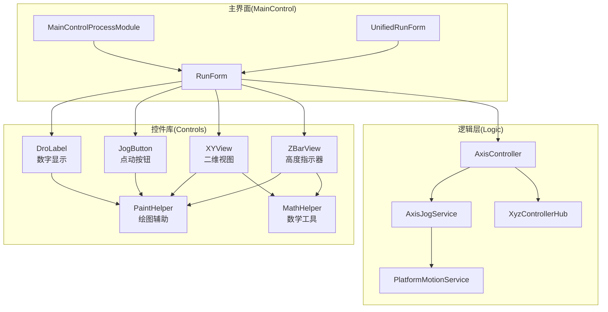
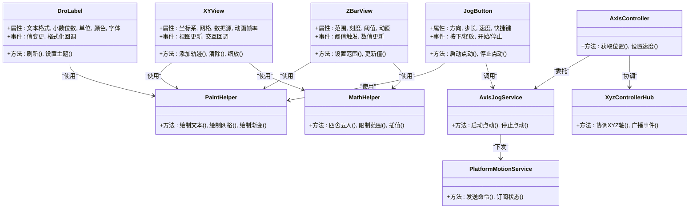
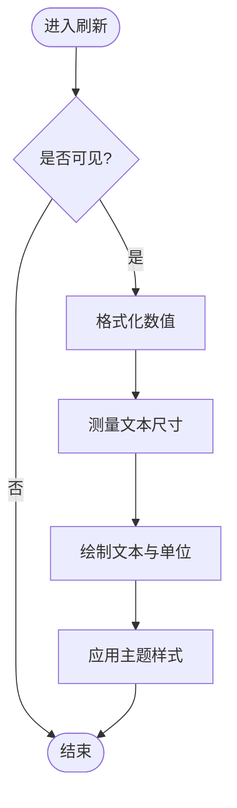
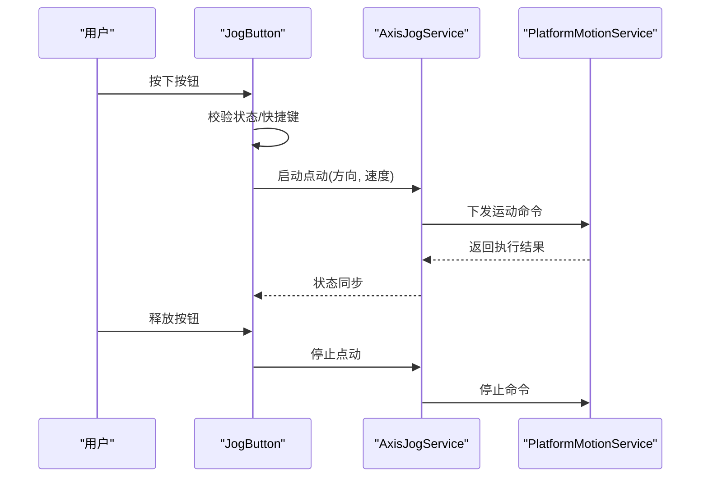
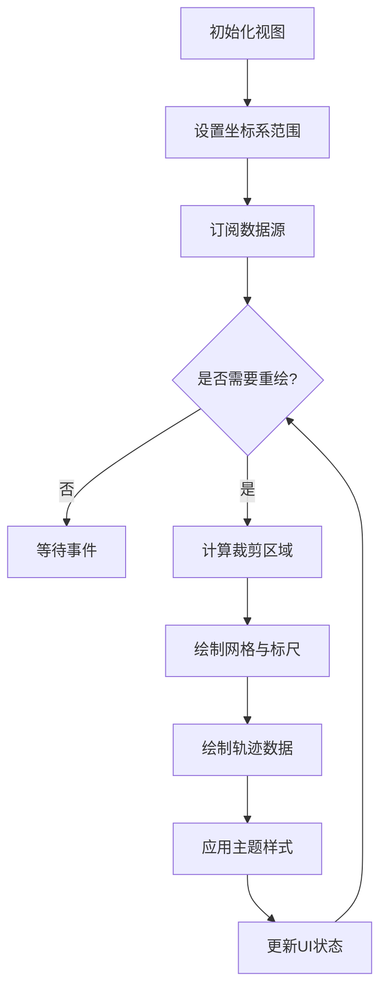
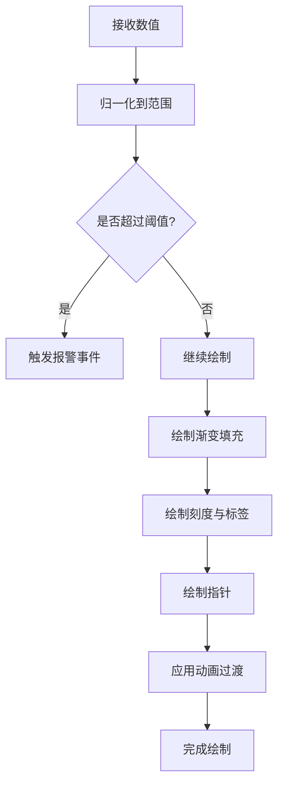
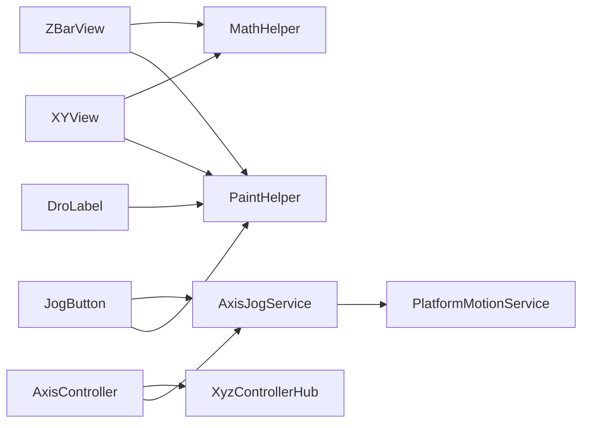

# UI控件库

<cite>
**本文引用的文件**   
- [DroLabel.cs](file://Controls/DroLabel.cs)
- [JogButton.cs](file://Controls/JogButton.cs)
- [XYView.cs](file://Controls/XYView.cs)
- [ZBarView.cs](file://Controls/ZBarView.cs)
- [MathHelper.cs](file://Controls/MathHelper.cs)
- [PaintHelper.cs](file://Controls/PaintHelper.cs)
- [MainControlProcessModule.cs](file://MainControl/MainControlProcessModule.cs)
- [RunForm.cs](file://MainControl/RunForm.cs)
- [UnifiedRunForm.cs](file://MainControl/UnifiedRunForm.cs)
- [AxisController.cs](file://Logic/AxisController.cs)
- [AxisJogService.cs](file://Logic/AxisJogService.cs)
- [PlatformMotionService.cs](file://Logic/PlatformMotionService.cs)
- [XyzControllerHub.cs](file://Logic/XyzControllerHub.cs)
</cite>

## 目录
1. [简介](#简介)
2. [项目结构](#项目结构)
3. [核心控件](#核心控件)
4. [架构总览](#架构总览)
5. [详细组件分析](#详细组件分析)
6. [依赖关系分析](#依赖关系分析)
7. [性能与绘制优化](#性能与绘制优化)
8. [故障排查指南](#故障排查指南)
9. [结论](#结论)
10. [附录：使用示例与最佳实践](#附录使用示例与最佳实践)

## 简介
本开发文档面向 ProcessModules 的 UI 控件库，重点覆盖以下方面：
- 基础控件：DroLabel（数字显示）、JogButton（点动按钮）的功能、属性与事件处理
- 专业视图：XYView（二维视图）、ZBarView（高度指示器）的使用方法
- 自定义绘制与样式定制：主题支持、重绘流程、性能要点
- 工具类：MathHelper（数学计算）、PaintHelper（绘图辅助）的使用示例
- 控件组合与复用：容器化、模板化、数据绑定机制
- 响应式设计与可访问性：缩放、布局适配、键盘与屏幕阅读器支持
- 跨浏览器兼容性说明：Windows Forms 环境下的兼容策略与注意事项

## 项目结构
控件库位于 Controls 目录，包含数值显示、交互按钮、二维视图、高度指示器以及绘图与数学工具。业务集成通过 MainControl 模块中的表单与进程模块进行承载，逻辑层由 AxisController、AxisJogService、PlatformMotionService、XyzControllerHub 等提供运动控制能力。

图表来源
- [DroLabel.cs](file://Controls/DroLabel.cs)
- [JogButton.cs](file://Controls/JogButton.cs)
- [XYView.cs](file://Controls/XYView.cs)
- [ZBarView.cs](file://Controls/ZBarView.cs)
- [MathHelper.cs](file://Controls/MathHelper.cs)
- [PaintHelper.cs](file://Controls/PaintHelper.cs)
- [MainControlProcessModule.cs](file://MainControl/MainControlProcessModule.cs)
- [RunForm.cs](file://MainControl/RunForm.cs)
- [UnifiedRunForm.cs](file://MainControl/UnifiedRunForm.cs)
- [AxisController.cs](file://Logic/AxisController.cs)
- [AxisJogService.cs](file://Logic/AxisJogService.cs)
- [PlatformMotionService.cs](file://Logic/PlatformMotionService.cs)
- [XyzControllerHub.cs](file://Logic/XyzControllerHub.cs)

章节来源
- [MainControlProcessModule.cs](file://MainControl/MainControlProcessModule.cs)
- [RunForm.cs](file://MainControl/RunForm.cs)
- [UnifiedRunForm.cs](file://MainControl/UnifiedRunForm.cs)

## 核心控件
本节聚焦四个关键控件的职责、常用属性、事件与绘制扩展点。

- DroLabel（数字显示控件）
  - 职责：以高可读性展示轴位置、速度、状态等数值，支持单位、精度、颜色与对齐方式
  - 关键属性：文本格式、小数位数、单位字符串、前景色/背景色、字体、边框与阴影
  - 事件：值变更通知、格式化回调、焦点与可见性变化
  - 绘制：基于 PaintHelper 实现抗锯齿文本渲染、单位与符号排版、动态刷新

- JogButton（点动按钮控件）
  - 职责：提供点动方向控制，支持按住持续运行、点击步进、按键映射
  - 关键属性：方向枚举、步长、速度、按下行为、禁用态、快捷键
  - 事件：按下/释放、开始/停止、错误与超时、状态同步
  - 绘制：按压态、悬停态、禁用态的视觉反馈；图标与文字布局

- XYView（二维视图控件）
  - 职责：展示二维轨迹、坐标网格、标尺、图例与缩放平移
  - 关键属性：坐标系范围、网格间距、线条样式、数据源接口、动画帧率
  - 事件：视图更新、数据追加、交互选择、缩放/平移回调
  - 绘制：双缓冲、增量绘制、裁剪区域优化、主题配色

- ZBarView（高度指示器控件）
  - 职责：直观展示当前高度或深度，支持阈值、报警区间、刻度标注
  - 关键属性：最小/最大值、刻度间隔、阈值颜色、动画过渡
  - 事件：阈值触发、越界告警、数值更新
  - 绘制：渐变填充、刻度线、指针与标签

章节来源
- [DroLabel.cs](file://Controls/DroLabel.cs)
- [JogButton.cs](file://Controls/JogButton.cs)
- [XYView.cs](file://Controls/XYView.cs)
- [ZBarView.cs](file://Controls/ZBarView.cs)

## 架构总览
控件库采用“视图-工具-服务”分层：
- 视图层：DroLabel、JogButton、XYView、ZBarView 负责 UI 呈现与交互
- 工具层：MathHelper、PaintHelper 提供通用计算与绘制能力
- 服务层：AxisController、AxisJogService、PlatformMotionService、XyzControllerHub 提供运动控制与状态同步
- 界面集成：RunForm、UnifiedRunForm、MainControlProcessModule 将控件与业务逻辑装配

图表来源
- [DroLabel.cs](file://Controls/DroLabel.cs)
- [JogButton.cs](file://Controls/JogButton.cs)
- [XYView.cs](file://Controls/XYView.cs)
- [ZBarView.cs](file://Controls/ZBarView.cs)
- [MathHelper.cs](file://Controls/MathHelper.cs)
- [PaintHelper.cs](file://Controls/PaintHelper.cs)
- [AxisController.cs](file://Logic/AxisController.cs)
- [AxisJogService.cs](file://Logic/AxisJogService.cs)
- [PlatformMotionService.cs](file://Logic/PlatformMotionService.cs)
- [XyzControllerHub.cs](file://Logic/XyzControllerHub.cs)

## 详细组件分析

### DroLabel 数字显示控件
- 功能要点
  - 数值格式化：支持固定小数位、科学计数法、单位后缀
  - 主题切换：前景/背景色、字体、边框、阴影
  - 刷新策略：按需重绘、防抖更新、增量绘制
- 属性与方法
  - 文本格式、精度、单位、颜色、字体、对齐、可见性
  - 刷新、设置主题、绑定数据源
- 事件
  - 值变更、格式化回调、焦点变化
- 自定义绘制
  - 重写 OnPaint，使用 PaintHelper 绘制文本与装饰元素
  - 支持自定义单位符号与千分位分隔符

图表来源
- [DroLabel.cs](file://Controls/DroLabel.cs)
- [PaintHelper.cs](file://Controls/PaintHelper.cs)

章节来源
- [DroLabel.cs](file://Controls/DroLabel.cs)
- [PaintHelper.cs](file://Controls/PaintHelper.cs)

### JogButton 点动按钮控件
- 功能要点
  - 点动模式：按住连续运行、点击步进、长按加速
  - 方向控制：正/负方向、多轴联动
  - 安全保护：超时、急停、互锁
- 属性与方法
  - 方向、步长、速度、快捷键、禁用态
  - 启动点动、停止点动、重置状态
- 事件
  - 按下/释放、开始/停止、错误与超时
- 自定义绘制
  - 按压态、悬停态、禁用态的视觉反馈
  - 图标与文字布局、颜色主题

图表来源
- [JogButton.cs](file://Controls/JogButton.cs)
- [AxisJogService.cs](file://Logic/AxisJogService.cs)
- [PlatformMotionService.cs](file://Logic/PlatformMotionService.cs)

章节来源
- [JogButton.cs](file://Controls/JogButton.cs)
- [AxisJogService.cs](file://Logic/AxisJogService.cs)
- [PlatformMotionService.cs](file://Logic/PlatformMotionService.cs)

### XYView 二维视图控件
- 功能要点
  - 坐标系与网格：自适应网格间距、标尺、图例
  - 数据管理：追加轨迹、清空、历史回溯
  - 交互：缩放、平移、选择框、右键菜单
- 属性与方法
  - 坐标系范围、网格样式、线条样式、数据源接口、动画帧率
  - 添加轨迹、清除、缩放、平移
- 事件
  - 视图更新、数据追加、交互回调
- 自定义绘制
  - 双缓冲、增量绘制、裁剪区域优化
  - 主题配色、网格透明度、线条粗细

图表来源
- [XYView.cs](file://Controls/XYView.cs)
- [PaintHelper.cs](file://Controls/PaintHelper.cs)
- [MathHelper.cs](file://Controls/MathHelper.cs)

章节来源
- [XYView.cs](file://Controls/XYView.cs)
- [PaintHelper.cs](file://Controls/PaintHelper.cs)
- [MathHelper.cs](file://Controls/MathHelper.cs)

### ZBarView 高度指示器控件
- 功能要点
  - 高度可视化：渐变填充、刻度标注、指针指示
  - 阈值与报警：阈值区间、越界告警、声音提示
  - 动画过渡：平滑过渡、阻尼效果
- 属性与方法
  - 最小/最大值、刻度间隔、阈值颜色、动画参数
  - 设置范围、更新值、重置
- 事件
  - 阈值触发、越界告警、数值更新
- 自定义绘制
  - 渐变填充、刻度线、指针与标签
  - 主题配色与对比度

图表来源
- [ZBarView.cs](file://Controls/ZBarView.cs)
- [MathHelper.cs](file://Controls/MathHelper.cs)
- [PaintHelper.cs](file://Controls/PaintHelper.cs)

章节来源
- [ZBarView.cs](file://Controls/ZBarView.cs)
- [MathHelper.cs](file://Controls/MathHelper.cs)
- [PaintHelper.cs](file://Controls/PaintHelper.cs)

### 工具类：MathHelper 与 PaintHelper
- MathHelper
  - 四舍五入、限制范围、插值、角度转换、单位换算
  - 性能：避免频繁分配、缓存常量、批量计算
- PaintHelper
  - 绘制文本、网格、渐变、圆角矩形、阴影
  - 性能：双缓冲、裁剪区域、路径缓存

章节来源
- [MathHelper.cs](file://Controls/MathHelper.cs)
- [PaintHelper.cs](file://Controls/PaintHelper.cs)

## 依赖关系分析
控件与工具、服务的依赖关系如下：
- DroLabel、JogButton、XYView、ZBarView 依赖 PaintHelper 进行绘制
- XYView、ZBarView 依赖 MathHelper 进行数值计算
- JogButton 依赖 AxisJogService 进行点动控制
- AxisController 协调 AxisJogService、PlatformMotionService、XyzControllerHub

图表来源
- [DroLabel.cs](file://Controls/DroLabel.cs)
- [JogButton.cs](file://Controls/JogButton.cs)
- [XYView.cs](file://Controls/XYView.cs)
- [ZBarView.cs](file://Controls/ZBarView.cs)
- [MathHelper.cs](file://Controls/MathHelper.cs)
- [PaintHelper.cs](file://Controls/PaintHelper.cs)
- [AxisController.cs](file://Logic/AxisController.cs)
- [AxisJogService.cs](file://Logic/AxisJogService.cs)
- [PlatformMotionService.cs](file://Logic/PlatformMotionService.cs)
- [XyzControllerHub.cs](file://Logic/XyzControllerHub.cs)

章节来源
- [MainControlProcessModule.cs](file://MainControl/MainControlProcessModule.cs)
- [RunForm.cs](file://MainControl/RunForm.cs)
- [UnifiedRunForm.cs](file://MainControl/UnifiedRunForm.cs)

## 性能与绘制优化
- 双缓冲与增量绘制
  - 在 XYView、ZBarView 中启用双缓冲，减少闪烁
  - 仅重绘变化区域，利用裁剪区域提升性能
- 文本与图形缓存
  - 对静态网格、图标进行路径缓存
  - 文本度量结果缓存，避免重复测量
- 刷新策略
  - DroLabel 使用防抖更新，降低高频刷新开销
  - XYView 使用帧率控制，平衡流畅性与资源占用
- 主题与样式
  - 统一主题配置，避免重复创建画笔与画刷
  - 颜色与字体资源集中管理，便于切换与复用

[本节为通用指导，不直接分析具体文件]

## 故障排查指南
- 数值显示异常
  - 检查 DroLabel 的文本格式与小数位数设置
  - 确认数据源类型与单位换算是否正确
- 点动无响应
  - 校验 JogButton 的方向与速度参数
  - 检查 AxisJogService 的命令下发与平台状态
- 视图绘制卡顿
  - 确认 XYView 的数据量与刷新频率
  - 优化 PaintHelper 的绘制路径与缓存策略
- 高度指示不准确
  - 检查 ZBarView 的范围与刻度设置
  - 验证阈值与报警逻辑

章节来源
- [DroLabel.cs](file://Controls/DroLabel.cs)
- [JogButton.cs](file://Controls/JogButton.cs)
- [XYView.cs](file://Controls/XYView.cs)
- [ZBarView.cs](file://Controls/ZBarView.cs)
- [AxisJogService.cs](file://Logic/AxisJogService.cs)
- [PlatformMotionService.cs](file://Logic/PlatformMotionService.cs)

## 结论
ProcessModules 的 UI 控件库以清晰的职责划分与工具化支撑，实现了数值显示、交互控制与专业视图的统一。通过 PaintHelper 与 MathHelper 的抽象，控件具备高可定制性与良好性能。结合业务逻辑层的运动控制服务，形成完整的“视图-工具-服务”架构，满足工业控制场景的高可靠性与高可用性需求。

[本节为总结，不直接分析具体文件]

## 附录：使用示例与最佳实践

- 控件组合与复用
  - 将 DroLabel 与 ZBarView 组合为“高度监控面板”，统一主题与刷新策略
  - 使用容器控件封装 JogButton 组，提供方向键与快捷键映射
- 数据绑定机制
  - 通过属性绑定将 AxisController 的位置数据绑定到 DroLabel
  - 使用事件驱动更新 XYView 的轨迹数据，避免轮询
- 响应式设计
  - 根据 DPI 与窗口大小动态调整网格间距与字体大小
  - 使用相对布局与锚定策略，确保不同分辨率下的显示一致性
- 可访问性
  - 为 JogButton 添加键盘导航与屏幕阅读器描述
  - 提供高对比度主题与无障碍颜色方案
- 跨浏览器兼容性
  - Windows Forms 环境下，注意 GDI+ 与高分屏的兼容性
  - 避免使用非标准 API，确保在不同系统版本下的稳定性

章节来源
- [MainControlProcessModule.cs](file://MainControl/MainControlProcessModule.cs)
- [RunForm.cs](file://MainControl/RunForm.cs)
- [UnifiedRunForm.cs](file://MainControl/UnifiedRunForm.cs)
- [AxisController.cs](file://Logic/AxisController.cs)
- [AxisJogService.cs](file://Logic/AxisJogService.cs)
- [PlatformMotionService.cs](file://Logic/PlatformMotionService.cs)
- [XyzControllerHub.cs](file://Logic/XyzControllerHub.cs)