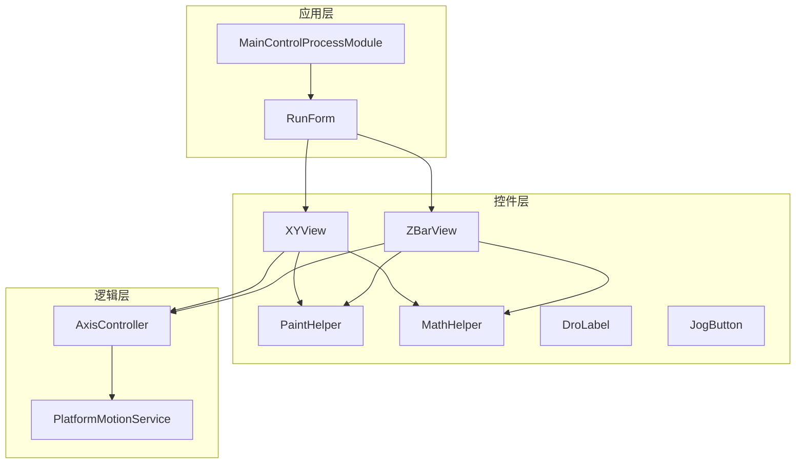
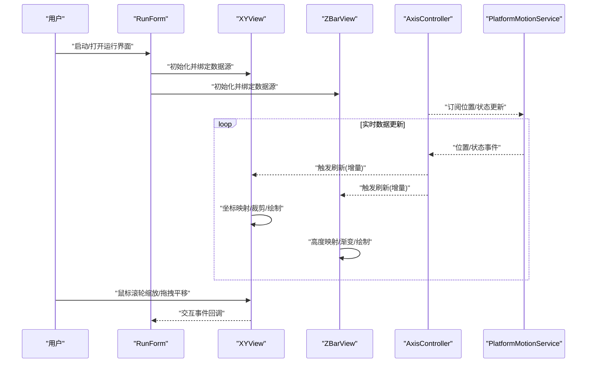
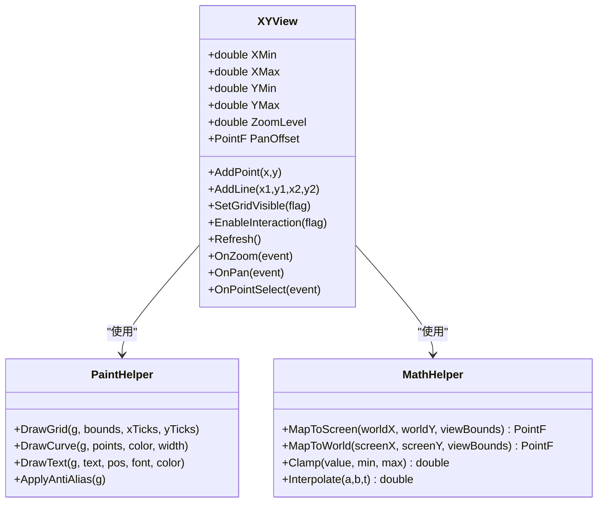
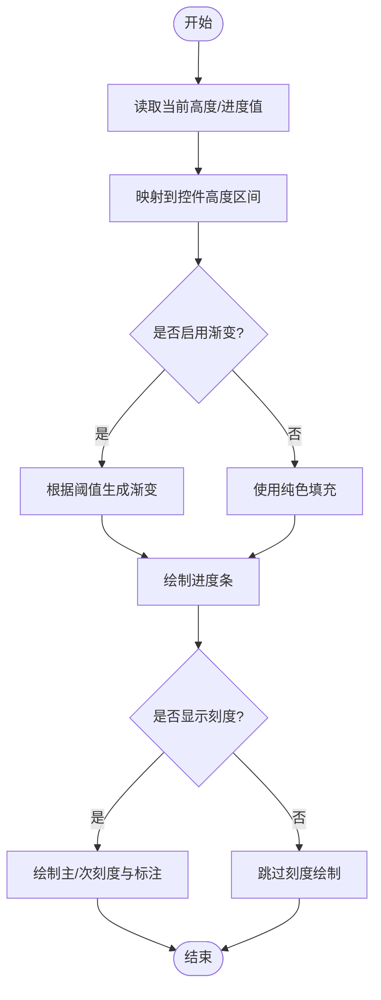
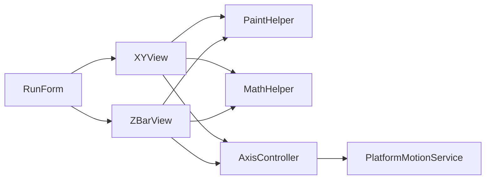

# 专业视图控件

<cite>
**本文引用的文件**   
- [XYView.cs](file://Controls/XYView.cs)
- [ZBarView.cs](file://Controls/ZBarView.cs)
- [PaintHelper.cs](file://Controls/PaintHelper.cs)
- [MathHelper.cs](file://Controls/MathHelper.cs)
- [DroLabel.cs](file://Controls/DroLabel.cs)
- [JogButton.cs](file://Controls/JogButton.cs)
- [MainControlProcessModule.cs](file://MainControl/MainControlProcessModule.cs)
- [RunForm.cs](file://MainControl/RunForm.cs)
- [AxisController.cs](file://Logic/AxisController.cs)
- [PlatformMotionService.cs](file://Logic/PlatformMotionService.cs)
</cite>

## 目录
1. [简介](#简介)
2. [项目结构](#项目结构)
3. [核心组件](#核心组件)
4. [架构总览](#架构总览)
5. [详细组件分析](#详细组件分析)
6. [依赖关系分析](#依赖关系分析)
7. [性能考虑](#性能考虑)
8. [故障排查指南](#故障排查指南)
9. [结论](#结论)
10. [附录](#附录)

## 简介
本文件为 ProcessModules 中的专业视图控件提供系统化文档，重点覆盖 XYView 二维视图与 ZBarView 高度指示器。内容涵盖坐标系统、图形绘制、缩放和平移、实时数据更新、交互事件、渲染引擎与性能优化、内存管理、数据源绑定、事件处理、自定义绘制扩展方法，以及多显示器与高分辨率显示的支持策略。读者可据此快速理解控件能力并高效集成到运动控制与轨迹可视化场景中。

## 项目结构
- Controls：包含 XYView、ZBarView 等绘图与交互控件，以及 PaintHelper、MathHelper 等通用工具类。
- MainControl：主界面与运行表单，演示如何承载与使用这些控件。
- Logic：轴控制器与服务层，负责运动控制与位置数据更新，常作为视图的数据源。

图表来源
- [XYView.cs](file://Controls/XYView.cs)
- [ZBarView.cs](file://Controls/ZBarView.cs)
- [PaintHelper.cs](file://Controls/PaintHelper.cs)
- [MathHelper.cs](file://Controls/MathHelper.cs)
- [MainControlProcessModule.cs](file://MainControl/MainControlProcessModule.cs)
- [RunForm.cs](file://MainControl/RunForm.cs)
- [AxisController.cs](file://Logic/AxisController.cs)
- [PlatformMotionService.cs](file://Logic/PlatformMotionService.cs)

章节来源
- [MainControlProcessModule.cs](file://MainControl/MainControlProcessModule.cs)
- [RunForm.cs](file://MainControl/RunForm.cs)

## 核心组件
- XYView：二维视图控件，支持坐标系映射、网格与刻度、曲线/点/线段绘制、缩放平移、鼠标交互、实时更新与双缓冲渲染。
- ZBarView：高度指示器控件，用于垂直方向的位置或进度展示，支持颜色渐变、刻度标注、动态更新与动画过渡。
- PaintHelper：绘图辅助工具，封装常用绘制流程（裁剪、抗锯齿、路径构建、渐变填充、文本绘制等）。
- MathHelper：数学工具，提供坐标变换、范围计算、插值、角度与距离计算等。
- DroLabel：数字显示标签，常用于显示当前坐标或状态数值。
- JogButton：点动按钮，提供用户交互输入，驱动运动控制。

章节来源
- [XYView.cs](file://Controls/XYView.cs)
- [ZBarView.cs](file://Controls/ZBarView.cs)
- [PaintHelper.cs](file://Controls/PaintHelper.cs)
- [MathHelper.cs](file://Controls/MathHelper.cs)
- [DroLabel.cs](file://Controls/DroLabel.cs)
- [JogButton.cs](file://Controls/JogButton.cs)

## 架构总览
XYView 与 ZBarView 通过数据源（如 AxisController）获取实时位置或轨迹数据，在 UI 线程进行增量绘制。PaintHelper 与 MathHelper 提供底层绘制与数学运算支撑。上层表单（RunForm）负责控件实例化、布局与事件绑定。

图表来源
- [RunForm.cs](file://MainControl/RunForm.cs)
- [XYView.cs](file://Controls/XYView.cs)
- [ZBarView.cs](file://Controls/ZBarView.cs)
- [AxisController.cs](file://Logic/AxisController.cs)
- [PlatformMotionService.cs](file://Logic/PlatformMotionService.cs)

## 详细组件分析

### XYView 二维视图
- 坐标系统
  - 世界坐标到屏幕坐标的线性映射，支持 X/Y 轴独立范围设置与自动适配。
  - 原点偏移与比例因子用于实现平移与缩放。
- 图形绘制
  - 支持点、线、折线、曲线、矩形、文本等基础图元绘制。
  - 网格与刻度自动生成，支持主/次刻度与单位标注。
  - 图层机制：背景、网格、数据、光标等分层绘制，提升可读性与性能。
- 缩放与平移
  - 滚轮缩放以鼠标位置为中心；拖拽平移支持边界限制。
  - 缩放级别与可视范围缓存，避免重复计算。
- 实时数据更新
  - 增量绘制：仅重绘变化区域，减少全屏刷新开销。
  - 双缓冲与离屏位图，降低闪烁与撕裂。
- 交互功能
  - 鼠标点击选择、框选、右键菜单、快捷键操作。
  - 事件回调：OnZoom、OnPan、OnPointSelect、OnDataUpdate 等。
- 性能优化
  - 视口裁剪：只绘制可见区域内的元素。
  - 对象池：重用图形对象与缓冲区。
  - 异步更新：后台线程采集数据，UI 线程批量合并绘制。

图表来源
- [XYView.cs](file://Controls/XYView.cs)
- [PaintHelper.cs](file://Controls/PaintHelper.cs)
- [MathHelper.cs](file://Controls/MathHelper.cs)

章节来源
- [XYView.cs](file://Controls/XYView.cs)

### ZBarView 高度指示器
- 垂直位置显示
  - 将物理高度或进度映射到控件高度区间，支持反向映射（从屏幕到物理值）。
- 进度条效果
  - 支持分段进度、百分比显示、动画过渡（平滑插值）。
- 颜色渐变
  - 基于阈值或数值区间生成渐变色带，增强视觉层次。
- 自定义刻度
  - 主/次刻度自适应，单位标注与格式化字符串支持。
- 实时更新
  - 增量绘制与帧率限制，避免频繁重绘导致卡顿。
- 交互
  - 点击定位、拖拽调节目标值、双击复位。

图表来源
- [ZBarView.cs](file://Controls/ZBarView.cs)
- [PaintHelper.cs](file://Controls/PaintHelper.cs)
- [MathHelper.cs](file://Controls/MathHelper.cs)

章节来源
- [ZBarView.cs](file://Controls/ZBarView.cs)

### 数据源绑定与事件处理示例
- 数据源绑定
  - 将 AxisController 的位置事件订阅到 XYView/ZBarView 的刷新接口，实现实时数据更新。
  - 支持批量更新：累积多个数据点后再一次性绘制，降低 UI 压力。
- 事件处理
  - XYView 的缩放/平移/选择事件回调，用于联动其他控件或记录日志。
  - ZBarView 的点击/拖拽事件，用于设定目标高度或进度。
- 自定义绘制
  - 继承 XYView/ZBarView 并重写 OnCustomDraw，插入业务特定的图形元素（如报警区、参考线）。

章节来源
- [AxisController.cs](file://Logic/AxisController.cs)
- [PlatformMotionService.cs](file://Logic/PlatformMotionService.cs)
- [XYView.cs](file://Controls/XYView.cs)
- [ZBarView.cs](file://Controls/ZBarView.cs)

### 扩展新数据类型与可视化需求
- 新增数据类型
  - 定义新的数据模型与映射规则（例如温度、压力），在 XYView 中增加对应图层与绘制策略。
- 可视化扩展
  - 在 ZBarView 中增加新的指示模式（如环形进度、柱状堆叠），复用 PaintHelper 的渐变与刻度能力。
- 插件式绘制
  - 通过注册自定义绘制器（IDrawable），在 XYView 生命周期中按需调用，实现解耦与可扩展性。

章节来源
- [XYView.cs](file://Controls/XYView.cs)
- [ZBarView.cs](file://Controls/ZBarView.cs)
- [PaintHelper.cs](file://Controls/PaintHelper.cs)

## 依赖关系分析
- XYView 依赖 PaintHelper 与 MathHelper，用于绘制与坐标转换。
- ZBarView 同样依赖上述工具类，保证一致的绘制风格与数学行为。
- RunForm 作为容器，负责控件实例化、布局与事件绑定。
- AxisController 与 PlatformMotionService 提供数据源，驱动视图更新。

图表来源
- [XYView.cs](file://Controls/XYView.cs)
- [ZBarView.cs](file://Controls/ZBarView.cs)
- [PaintHelper.cs](file://Controls/PaintHelper.cs)
- [MathHelper.cs](file://Controls/MathHelper.cs)
- [RunForm.cs](file://MainControl/RunForm.cs)
- [AxisController.cs](file://Logic/AxisController.cs)
- [PlatformMotionService.cs](file://Logic/PlatformMotionService.cs)

章节来源
- [RunForm.cs](file://MainControl/RunForm.cs)
- [AxisController.cs](file://Logic/AxisController.cs)
- [PlatformMotionService.cs](file://Logic/PlatformMotionService.cs)

## 性能考虑
- 渲染优化
  - 双缓冲与离屏绘制，减少闪烁。
  - 视口裁剪与增量绘制，仅重绘变化区域。
  - 对象池与缓冲区复用，降低 GC 压力。
- 数据更新
  - 后台线程采集数据，UI 线程批量合并绘制。
  - 帧率限制与节流，避免过度刷新。
- 内存管理
  - 及时释放临时位图与路径对象。
  - 避免在绘制过程中分配大量对象。
- 高分辨率与多显示器
  - 使用 DpiAware 与逻辑像素映射，确保在不同 DPI 下清晰显示。
  - 针对多显示器场景，正确处理每屏的缩放与坐标映射。

[本节为通用指导，不直接分析具体文件]

## 故障排查指南
- 常见问题
  - 视图不更新：检查数据源事件是否正确订阅与触发。
  - 绘制闪烁：确认双缓冲已启用，避免在 UI 线程进行耗时计算。
  - 缩放异常：校验坐标映射函数与边界限制逻辑。
  - 内存泄漏：排查未释放的位图、路径与事件订阅。
- 调试建议
  - 启用绘制统计（帧率、绘制次数、对象数量）。
  - 使用断点与日志输出关键路径（坐标映射、事件回调）。
  - 逐步禁用图层与特效，定位性能瓶颈。

章节来源
- [XYView.cs](file://Controls/XYView.cs)
- [ZBarView.cs](file://Controls/ZBarView.cs)
- [PaintHelper.cs](file://Controls/PaintHelper.cs)

## 结论
XYView 与 ZBarView 提供了强大的二维视图与高度指示能力，结合 PaintHelper 与 MathHelper 实现了高效、可扩展的渲染体系。通过合理的数据源绑定、事件处理与性能优化策略，可在运动控制与轨迹可视化场景中稳定运行。遵循本文档的扩展指南，可轻松支持新数据类型与可视化需求，并在多显示器与高分辨率环境下保持一致的用户体验。

## 附录
- 最佳实践
  - 始终使用增量绘制与视口裁剪。
  - 在后台线程处理数据采集，UI 线程专注绘制。
  - 对高频更新数据进行批处理与节流。
- 参考路径
  - XYView 核心实现：[XYView.cs](file://Controls/XYView.cs)
  - ZBarView 核心实现：[ZBarView.cs](file://Controls/ZBarView.cs)
  - 绘图工具：[PaintHelper.cs](file://Controls/PaintHelper.cs)
  - 数学工具：[MathHelper.cs](file://Controls/MathHelper.cs)
  - 数据源示例：[AxisController.cs](file://Logic/AxisController.cs)、[PlatformMotionService.cs](file://Logic/PlatformMotionService.cs)
  - 界面集成：[RunForm.cs](file://MainControl/RunForm.cs)