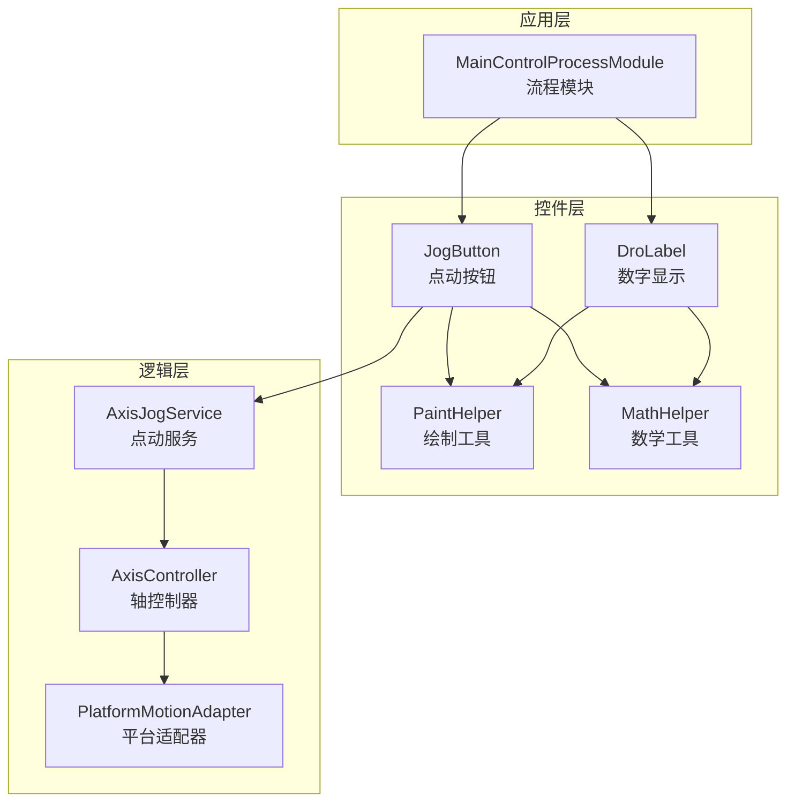
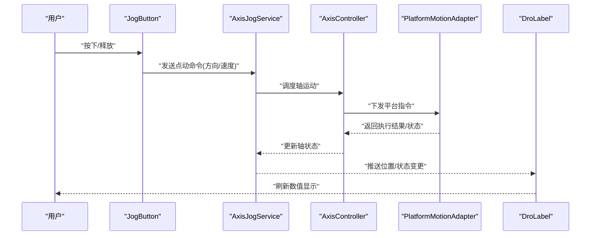
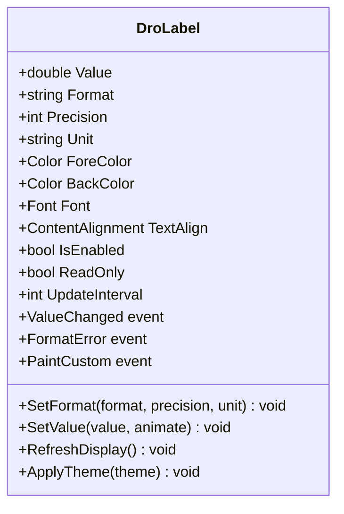
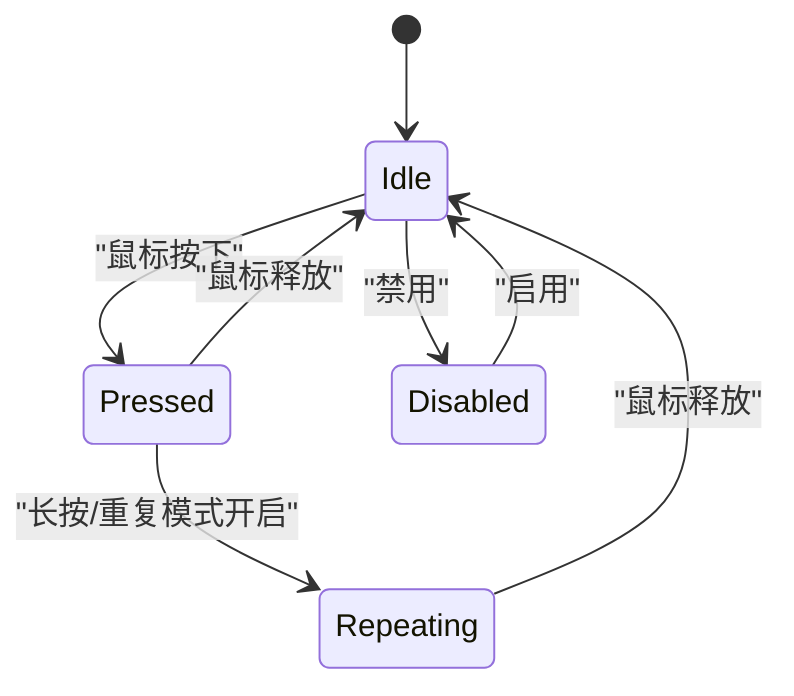
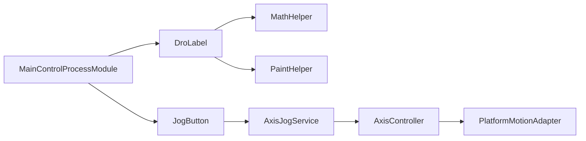

# 基础控件

<cite>
**本文引用的文件**   
- [DroLabel.cs](file://Controls/DroLabel.cs)
- [JogButton.cs](file://Controls/JogButton.cs)
- [MathHelper.cs](file://Controls/MathHelper.cs)
- [PaintHelper.cs](file://Controls/PaintHelper.cs)
- [AxisController.cs](file://Logic/AxisController.cs)
- [AxisJogService.cs](file://Logic/AxisJogService.cs)
- [PlatformMotionAdapter.cs](file://Logic/PlatformMotionAdapter.cs)
- [MainControlProcessModule.cs](file://MainControl/MainControlProcessModule.cs)
</cite>

## 目录
1. [简介](#简介)
2. [项目结构](#项目结构)
3. [核心组件](#核心组件)
4. [架构总览](#架构总览)
5. [详细组件分析](#详细组件分析)
6. [依赖关系分析](#依赖关系分析)
7. [性能考虑](#性能考虑)
8. [故障排查指南](#故障排查指南)
9. [结论](#结论)
10. [附录：集成与使用示例](#附录集成与使用示例)

## 简介
本文件为 ProcessModules 的基础控件提供系统化、可操作的技术文档，重点覆盖以下两类控件：
- DroLabel 数字显示控件：负责数值格式化、实时更新、颜色配置与字体设置。
- JogButton 点动按钮：实现点击事件处理、状态管理、动画效果与自定义样式。

文档同时说明数据绑定机制、与业务逻辑的交互方式、响应式设计与可访问性最佳实践，并提供在 Windows Forms 中集成与使用的参考路径。

## 项目结构
本项目采用“控件 + 逻辑 + 模块”的分层组织方式：
- Controls：基础 UI 控件与绘图辅助工具（DroLabel、JogButton、数学与绘制工具）。
- Logic：运动控制与点动服务（轴控制器、点动服务、平台适配器）。
- MainControl：主界面与流程模块入口，用于承载和编排控件与业务逻辑。

图表来源
- [DroLabel.cs](file://Controls/DroLabel.cs)
- [JogButton.cs](file://Controls/JogButton.cs)
- [PaintHelper.cs](file://Controls/PaintHelper.cs)
- [MathHelper.cs](file://Controls/MathHelper.cs)
- [AxisController.cs](file://Logic/AxisController.cs)
- [AxisJogService.cs](file://Logic/AxisJogService.cs)
- [PlatformMotionAdapter.cs](file://Logic/PlatformMotionAdapter.cs)
- [MainControlProcessModule.cs](file://MainControl/MainControlProcessModule.cs)

章节来源
- [DroLabel.cs](file://Controls/DroLabel.cs)
- [JogButton.cs](file://Controls/JogButton.cs)
- [MainControlProcessModule.cs](file://MainControl/MainControlProcessModule.cs)

## 核心组件
本节聚焦两个关键控件的职责与能力边界：
- DroLabel：以高性能绘制与格式化为核心，支持实时刷新、主题化外观（颜色、字体）、多精度显示。
- JogButton：封装点动交互，包括按下/释放状态机、防抖与重复触发策略、视觉反馈动画、样式定制。

章节来源
- [DroLabel.cs](file://Controls/DroLabel.cs)
- [JogButton.cs](file://Controls/JogButton.cs)

## 架构总览
下图展示从 UI 到运动控制的调用链路与数据流向。用户通过 JogButton 发起点动指令，经 AxisJogService 与 AxisController 协调，最终由 PlatformMotionAdapter 驱动底层设备；DroLabel 订阅位置或状态变化并刷新显示。

图表来源
- [JogButton.cs](file://Controls/JogButton.cs)
- [AxisJogService.cs](file://Logic/AxisJogService.cs)
- [AxisController.cs](file://Logic/AxisController.cs)
- [PlatformMotionAdapter.cs](file://Logic/PlatformMotionAdapter.cs)
- [DroLabel.cs](file://Controls/DroLabel.cs)

## 详细组件分析

### DroLabel 数字显示控件
职责与特性
- 数值格式化：支持小数位数、千分位、单位后缀、科学计数法等常见格式。
- 实时更新：基于值变更事件进行增量重绘，避免全量刷新带来的卡顿。
- 颜色配置：前景色、背景色、边框色、禁用态颜色等。
- 字体设置：字体族、字号、加粗、对齐方式。
- 性能优化：双缓冲绘制、文本度量缓存、按需重绘区域裁剪。

关键属性（建议）
- Value：当前数值（double/decimal）
- Format：格式化字符串或枚举模式
- Precision：小数位数
- Unit：单位后缀
- ForeColor/BackColor：前景/背景色
- Font：字体对象
- TextAlign：文本对齐
- IsEnabled：启用/禁用
- ReadOnly：只读模式（影响交互）
- UpdateInterval：刷新间隔（毫秒）

常用事件
- ValueChanged：数值变化时触发
- FormatError：格式化失败时触发
- PaintCustom：允许自定义绘制细节

方法概览
- SetFormat(format, precision, unit)
- SetValue(value, animate)
- RefreshDisplay()
- ApplyTheme(theme)

数据绑定
- 支持单向绑定（业务模型 -> UI），当模型属性变更时自动刷新。
- 支持双向绑定时仅更新显示，不反向写回，避免误触修改。

响应式与可访问性
- 高 DPI 适配：根据 DpiScaling 动态调整字体与绘制尺寸。
- 键盘可达：Tab 顺序正确，禁用态有焦点提示。
- 屏幕阅读器：提供 Name/Value 描述，便于无障碍读取。

图表来源
- [DroLabel.cs](file://Controls/DroLabel.cs)

章节来源
- [DroLabel.cs](file://Controls/DroLabel.cs)

### JogButton 点动按钮
职责与特性
- 点击事件处理：按下、抬起、长按、双击等事件区分。
- 状态管理：空闲、按下、按住重复触发、禁用、错误等状态机。
- 动画效果：按下缩放、发光、进度指示、抖动反馈。
- 自定义样式：主题色、图标、圆角、阴影、禁用态样式。

关键属性（建议）
- Direction：点动方向（正/负）
- Speed：点动速度档位
- RepeatMode：按住是否重复触发
- RepeatInterval：重复触发间隔
- AnimationEnabled：是否启用动画
- Style：样式主题（默认/扁平/霓虹）
- Icon：图标资源
- Enabled：启用状态
- Text：按钮文本

常用事件
- Clicked：单击事件
- Pressed/Released：按下/释放
- LongPress：长按事件
- StateChanged：状态切换事件
- CommandExecuted：命令执行完成回调

方法概览
- StartJog(direction, speed)
- StopJog()
- SetStyle(style, theme)
- SetIcon(icon)
- ValidateCommand()

状态机

图表来源
- [JogButton.cs](file://Controls/JogButton.cs)

章节来源
- [JogButton.cs](file://Controls/JogButton.cs)

### 辅助工具
- MathHelper：数值范围检查、四舍五入、单位换算、步进计算等。
- PaintHelper：文本测量、矩形裁剪、渐变绘制、抗锯齿开关等。

章节来源
- [MathHelper.cs](file://Controls/MathHelper.cs)
- [PaintHelper.cs](file://Controls/PaintHelper.cs)

## 依赖关系分析
- DroLabel 依赖 MathHelper 与 PaintHelper 完成数值与绘制。
- JogButton 依赖 AxisJogService 与 AxisController 完成点动逻辑，并通过 PlatformMotionAdapter 与硬件交互。
- MainControlProcessModule 作为编排者，将 UI 控件与业务服务组合起来。

图表来源
- [DroLabel.cs](file://Controls/DroLabel.cs)
- [JogButton.cs](file://Controls/JogButton.cs)
- [MathHelper.cs](file://Controls/MathHelper.cs)
- [PaintHelper.cs](file://Controls/PaintHelper.cs)
- [AxisJogService.cs](file://Logic/AxisJogService.cs)
- [AxisController.cs](file://Logic/AxisController.cs)
- [PlatformMotionAdapter.cs](file://Logic/PlatformMotionAdapter.cs)
- [MainControlProcessModule.cs](file://MainControl/MainControlProcessModule.cs)

章节来源
- [MainControlProcessModule.cs](file://MainControl/MainControlProcessModule.cs)

## 性能考虑
- 减少重绘：仅在值变化或可见区域改变时刷新；使用增量绘制与裁剪。
- 文本度量缓存：对固定字体与格式的文本宽度进行缓存。
- 批量更新：多个属性变更时使用 BeginUpdate/EndUpdate 包裹。
- 动画节流：限制动画帧率，避免与 UI 刷新冲突。
- 线程安全：UI 更新必须回到 UI 线程；后台任务完成后通过事件或回调更新。

## 故障排查指南
常见问题与定位要点
- 数值不刷新：检查 ValueChanged 事件是否订阅；确认 UpdateInterval 非零；确保 UI 线程更新。
- 格式化异常：验证 Format 字符串合法性；捕获 FormatError 事件输出日志。
- 点动无响应：检查 JogButton 的 Enabled 与 ReadOnly；确认 AxisJogService 已初始化；查看 CommandExecuted 回调的错误码。
- 动画卡顿：关闭不必要的动画；降低重复触发频率；检查绘制复杂度。
- 高 DPI 错位：确认控件的 AutoScaleMode 与 DpiScaling 计算正确。

章节来源
- [JogButton.cs](file://Controls/JogButton.cs)
- [DroLabel.cs](file://Controls/DroLabel.cs)

## 结论
DroLabel 与 JogButton 分别承担“显示”与“交互”的核心职责，配合 MathHelper、PaintHelper 以及运动控制服务，形成稳定高效的工业级 UI 组件体系。通过合理的属性设计、事件机制与数据绑定，可在 Windows Forms 应用中快速构建响应式、可访问且高性能的人机界面。

## 附录：集成与使用示例
以下为在 Windows Forms 中集成与使用这两个控件的步骤与要点（以路径引用代替代码片段）：

- 添加控件到窗体
  - 在工具箱中添加自定义控件项，指向编译后的 DLL 或工程引用。
  - 拖拽 DroLabel 与 JogButton 到设计器表单。
  - 参考：[MainControlProcessModule.cs](file://MainControl/MainControlProcessModule.cs)

- 初始化与数据绑定
  - 为 DroLabel 设置初始值与格式，并订阅 ValueChanged 事件。
  - 为 JogButton 设置方向、速度与重复模式，订阅 Clicked/StateChanged 事件。
  - 参考：[DroLabel.cs](file://Controls/DroLabel.cs)、[JogButton.cs](file://Controls/JogButton.cs)

- 与业务逻辑交互
  - 将 JogButton 的命令转发至 AxisJogService，再由 AxisController 协调平台适配器。
  - 将轴位置或状态变化推送给 DroLabel 进行刷新。
  - 参考：[AxisJogService.cs](file://Logic/AxisJogService.cs)、[AxisController.cs](file://Logic/AxisController.cs)、[PlatformMotionAdapter.cs](file://Logic/PlatformMotionAdapter.cs)

- 响应式与可访问性
  - 设置控件的 TabIndex、Name、AccessibleName 等属性。
  - 在高 DPI 环境下校验布局与字体大小。
  - 参考：[MainControlProcessModule.cs](file://MainControl/MainControlProcessModule.cs)

- 调试与日志
  - 打印 FormatError、CommandExecuted 等事件信息。
  - 使用断点观察状态机转换与事件触发顺序。
  - 参考：[JogButton.cs](file://Controls/JogButton.cs)、[DroLabel.cs](file://Controls/DroLabel.cs)

章节来源
- [MainControlProcessModule.cs](file://MainControl/MainControlProcessModule.cs)
- [DroLabel.cs](file://Controls/DroLabel.cs)
- [JogButton.cs](file://Controls/JogButton.cs)
- [AxisJogService.cs](file://Logic/AxisJogService.cs)
- [AxisController.cs](file://Logic/AxisController.cs)
- [PlatformMotionAdapter.cs](file://Logic/PlatformMotionAdapter.cs)