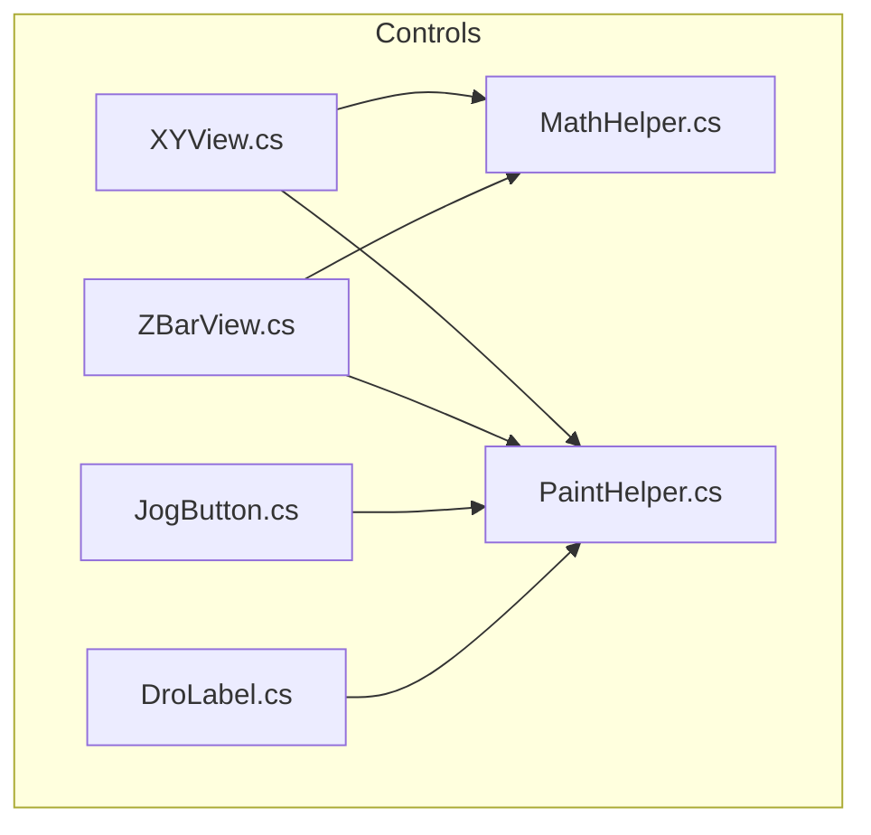
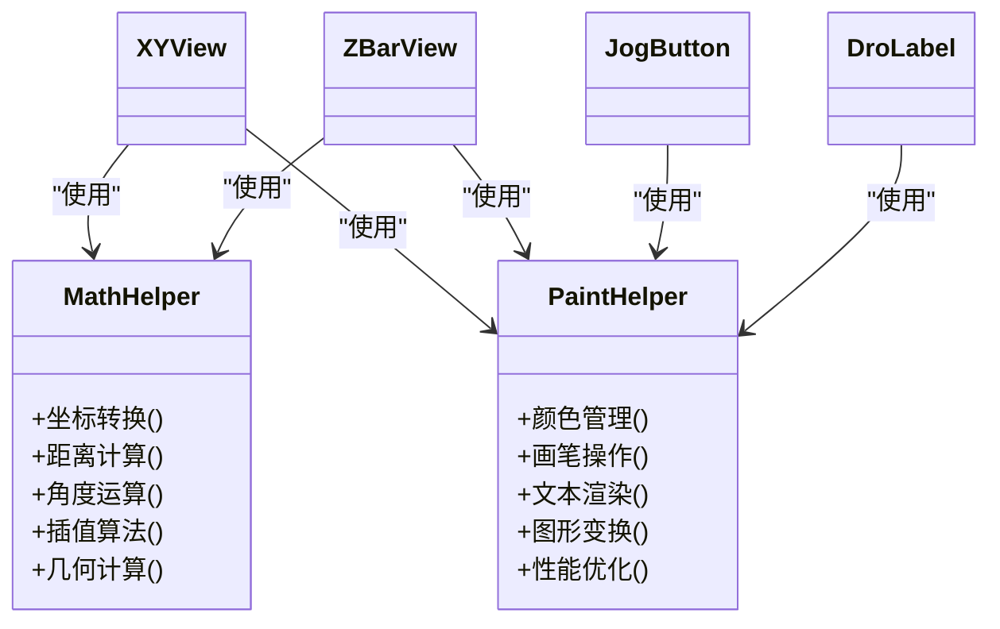
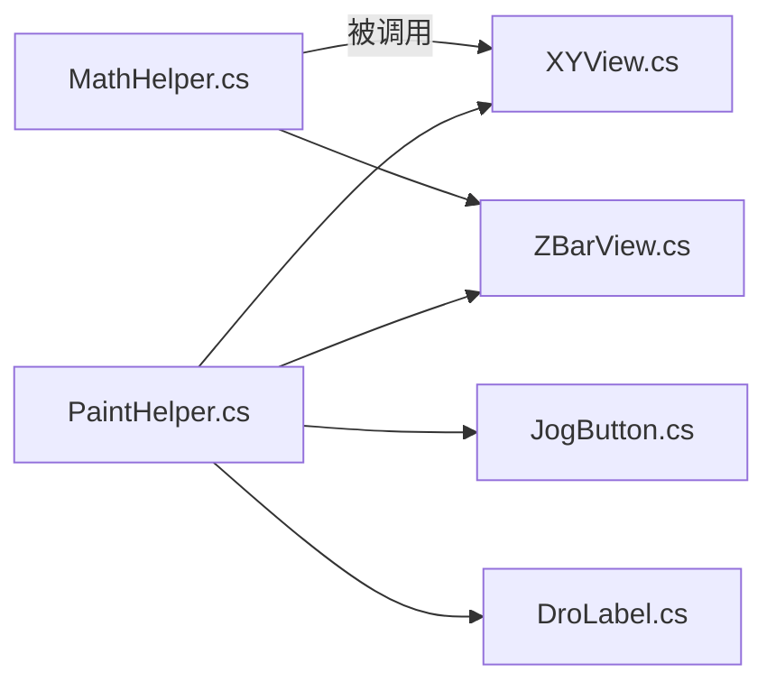

# 工具辅助类

<cite>
**本文档引用的文件**   
- [MathHelper.cs](file://Controls/MathHelper.cs)
- [PaintHelper.cs](file://Controls/PaintHelper.cs)
- [XYView.cs](file://Controls/XYView.cs)
- [ZBarView.cs](file://Controls/ZBarView.cs)
- [JogButton.cs](file://Controls/JogButton.cs)
- [DroLabel.cs](file://Controls/DroLabel.cs)
</cite>

## 目录
1. [简介](#简介)
2. [项目结构](#项目结构)
3. [核心组件](#核心组件)
4. [架构总览](#架构总览)
5. [详细组件分析](#详细组件分析)
6. [依赖分析](#依赖分析)
7. [性能考虑](#性能考虑)
8. [故障排查指南](#故障排查指南)
9. [结论](#结论)
10. [附录](#附录)

## 简介
本文件为 ProcessModules 中的工具辅助类提供系统化文档，重点覆盖：
- MathHelper 数学计算工具：坐标转换、距离与角度运算、插值算法、几何计算等。
- PaintHelper 绘图辅助类：颜色管理、画笔操作、文本渲染、图形变换与性能优化。
并提供常用公式封装、使用场景、复杂度分析与优化建议、单元测试示例与最佳实践，帮助在自定义控件中高效使用这些工具。

## 项目结构
本项目将通用数学与绘图能力集中在 Controls 目录下的工具类中，供各业务控件（如 XYView、ZBarView、JogButton、DroLabel）复用。

图表来源
- [MathHelper.cs](file://Controls/MathHelper.cs)
- [PaintHelper.cs](file://Controls/PaintHelper.cs)
- [XYView.cs](file://Controls/XYView.cs)
- [ZBarView.cs](file://Controls/ZBarView.cs)
- [JogButton.cs](file://Controls/JogButton.cs)
- [DroLabel.cs](file://Controls/DroLabel.cs)

章节来源
- [MathHelper.cs](file://Controls/MathHelper.cs)
- [PaintHelper.cs](file://Controls/PaintHelper.cs)
- [XYView.cs](file://Controls/XYView.cs)
- [ZBarView.cs](file://Controls/ZBarView.cs)
- [JogButton.cs](file://Controls/JogButton.cs)
- [DroLabel.cs](file://Controls/DroLabel.cs)

## 核心组件
- MathHelper：集中实现二维/三维坐标转换、点线面几何计算、角度与弧度换算、线性/样条插值、数值稳定化与精度控制等。
- PaintHelper：封装 GDI+ 常用绘制流程，包括颜色管理、画笔/画刷创建与释放、文本渲染、矩阵变换、双缓冲与批处理优化等。

章节来源
- [MathHelper.cs](file://Controls/MathHelper.cs)
- [PaintHelper.cs](file://Controls/PaintHelper.cs)

## 架构总览
MathHelper 与 PaintHelper 作为无状态或弱状态的静态工具类，被上层控件按需调用，形成“工具层—控件层”的清晰分层。控件负责布局与交互，工具层专注计算与绘制。

图表来源
- [MathHelper.cs](file://Controls/MathHelper.cs)
- [PaintHelper.cs](file://Controls/PaintHelper.cs)
- [XYView.cs](file://Controls/XYView.cs)
- [ZBarView.cs](file://Controls/ZBarView.cs)
- [JogButton.cs](file://Controls/JogButton.cs)
- [DroLabel.cs](file://Controls/DroLabel.cs)

## 详细组件分析

### MathHelper 数学计算工具
职责与能力
- 坐标转换：像素坐标与逻辑坐标互转、坐标系原点与缩放适配。
- 距离与角度：欧氏距离、曼哈顿距离、向量夹角、方向角归一化。
- 插值算法：线性插值、分段线性、平滑插值（如 Catmull-Rom/Spline）。
- 几何计算：点到线段距离、线段相交、点在多边形内判定、凸包近似等。
- 数值稳定：浮点比较容差、舍入策略、溢出保护。

复杂度与优化
- 距离与角度：O(1)。
- 线段相交：O(1)，注意退化情况处理。
- 插值：线性 O(n)，样条 O(n)；批量插值可缓存基函数。
- 几何判定：点在多边形 O(n)，线段集合相交 O(n^2) 需按场景裁剪。

使用建议
- 对高频路径（如每帧重绘）避免重复分配对象，优先使用静态方法与参数传递。
- 对大量点集插值，采用增量更新与分块计算。
- 对角度运算统一使用弧度制，减少三角函数切换开销。

章节来源
- [MathHelper.cs](file://Controls/MathHelper.cs)

### PaintHelper 绘图辅助类
职责与能力
- 颜色管理：主题色、透明度混合、颜色空间转换、调色板缓存。
- 画笔操作：Pen/Brush 生命周期管理、样式设置、抗锯齿开关。
- 文本渲染：字体选择、度量、对齐、阴影与描边。
- 图形变换：平移、旋转、缩放、复合矩阵、视口映射。
- 性能优化：双缓冲、离屏绘制、批处理绘制、裁剪区域、资源复用。

复杂度与优化
- 单帧绘制复杂度与图元数量线性相关，应通过裁剪与合并降低实际绘制量。
- 频繁创建 Pen/Brush 会导致 GC 压力，建议池化或静态缓存。
- 文本测量与换行计算应避免在热路径重复执行，结果可缓存。

使用建议
- 所有绘制进入 OnPaint 前启用双缓冲，必要时使用 Offscreen Bitmap。
- 对重复样式进行缓存，避免每次重绘重建对象。
- 使用 ClipRegion 限制绘制范围，减少无效绘制。

章节来源
- [PaintHelper.cs](file://Controls/PaintHelper.cs)

### 在自定义控件中的典型用法
- XYView：使用 MathHelper 完成数据坐标到像素坐标的转换，使用 PaintHelper 绘制网格、曲线与标注。
- ZBarView：基于 MathHelper 计算条形高度与比例，使用 PaintHelper 绘制渐变与边框。
- JogButton：使用 PaintHelper 绘制按钮状态、图标与文本。
- DroLabel：使用 PaintHelper 渲染数字与单位，支持对齐与格式化。

章节来源
- [XYView.cs](file://Controls/XYView.cs)
- [ZBarView.cs](file://Controls/ZBarView.cs)
- [JogButton.cs](file://Controls/JogButton.cs)
- [DroLabel.cs](file://Controls/DroLabel.cs)

## 依赖分析
- 控件对工具类的依赖是单向的，工具类不反向依赖控件，保证高内聚低耦合。
- 若存在跨控件共享的常量或配置，建议抽取至独立配置模块，避免硬编码。

图表来源
- [MathHelper.cs](file://Controls/MathHelper.cs)
- [PaintHelper.cs](file://Controls/PaintHelper.cs)
- [XYView.cs](file://Controls/XYView.cs)
- [ZBarView.cs](file://Controls/ZBarView.cs)
- [JogButton.cs](file://Controls/JogButton.cs)
- [DroLabel.cs](file://Controls/DroLabel.cs)

章节来源
- [MathHelper.cs](file://Controls/MathHelper.cs)
- [PaintHelper.cs](file://Controls/PaintHelper.cs)
- [XYView.cs](file://Controls/XYView.cs)
- [ZBarView.cs](file://Controls/ZBarView.cs)
- [JogButton.cs](file://Controls/JogButton.cs)
- [DroLabel.cs](file://Controls/DroLabel.cs)

## 性能考虑
- 内存与GC：避免在热路径频繁 new 对象，使用对象池或静态缓存。
- CPU：批量计算优于逐点循环；对三角函数与开方等昂贵操作做缓存或查表。
- I/O与绘制：减少 Draw 调用次数，合并相同样式的绘制；使用裁剪与可见性检测。
- 线程：耗时计算放在后台线程，UI 更新在主线程同步。

[本节为通用指导，无需引用具体文件]

## 故障排查指南
常见问题与定位
- 坐标错位：检查像素/逻辑坐标转换参数（原点、缩放、翻转）。
- 角度异常：确认输入范围与弧度/角度模式一致性。
- 插值抖动：检查步长与边界条件，必要时引入平滑与限幅。
- 绘制闪烁：确认是否启用双缓冲与离屏绘制。
- 内存泄漏：检查未释放的 Pen/Brush/Bitmap，确保 Dispose 或池化回收。

排查步骤
- 最小化复现：剥离无关控件，仅保留工具调用链路。
- 日志与断点：记录关键中间变量（坐标、角度、插值系数）。
- 性能剖析：统计绘制调用次数与对象分配频率。

章节来源
- [MathHelper.cs](file://Controls/MathHelper.cs)
- [PaintHelper.cs](file://Controls/PaintHelper.cs)

## 结论
MathHelper 与 PaintHelper 为 ProcessModules 提供了稳定高效的数学与绘图基础能力。通过清晰的职责划分、合理的复杂度控制与完善的性能优化策略，可在各类自定义控件中快速构建高性能可视化界面。建议在项目中持续沉淀常用算法与绘制模板，形成可复用的工具库。

[本节为总结性内容，无需引用具体文件]

## 附录

### 常用数学公式与封装要点
- 距离：欧氏距离 sqrt((x2-x1)^2+(y2-y1)^2)；曼哈顿距离 |x2-x1|+|y2-y1|。
- 角度：atan2(y,x) 得到 [-π,π] 弧度，可按需转换为角度。
- 线性插值：lerp(a,b,t)=a+(b-a)*t，t∈[0,1]。
- 样条插值：Catmull-Rom 或 Cubic Spline，保证连续性与平滑度。
- 几何：点到线段距离投影法；线段相交用叉积判断；点在多边形内用射线法。

章节来源
- [MathHelper.cs](file://Controls/MathHelper.cs)

### 常用绘图操作封装要点
- 颜色：主题色、透明度混合、灰度/亮度调整。
- 画笔：抗锯齿、线宽、端点样式、虚线模式。
- 文本：字体、字号、对齐、阴影、描边、度量缓存。
- 变换：平移、旋转、缩放、复合矩阵、视口映射。
- 优化：双缓冲、离屏位图、批处理、裁剪区域、对象池。

章节来源
- [PaintHelper.cs](file://Controls/PaintHelper.cs)

### 单元测试示例（思路）
- 数学测试
  - 坐标转换：给定原点和缩放，验证正向与逆向转换一致。
  - 距离与角度：对比标准库结果，误差在容差范围内。
  - 插值：边界值、等距采样、非均匀采样均通过。
  - 几何：线段相交、点在多边形内的边界用例。
- 绘图测试
  - 颜色：透明度混合符合预期。
  - 文本：度量与对齐正确，缓存命中提升性能。
  - 变换：复合矩阵顺序与结果正确。
  - 性能：绘制调用次数与对象分配在阈值内。

[本节为方法论说明，无需引用具体文件]

### 最佳实践指南
- 接口设计：工具方法尽量纯函数化，避免隐式状态。
- 错误处理：输入校验前置，返回明确错误码或抛出异常。
- 性能优先：热点路径避免分配，结果缓存，批量处理。
- 可测试性：提供可注入的随机数源与时间源，便于模拟。
- 文档与示例：每个公共 API 附带用途、参数约束与示例。

[本节为方法论说明，无需引用具体文件]