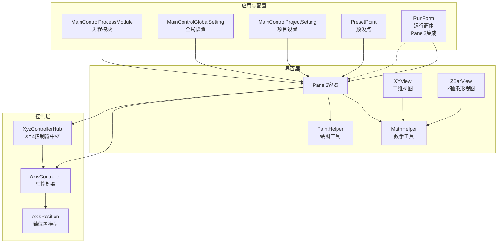
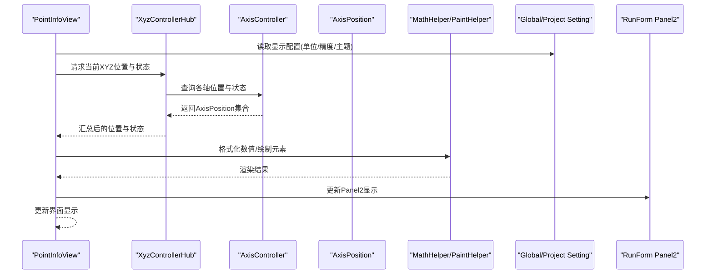
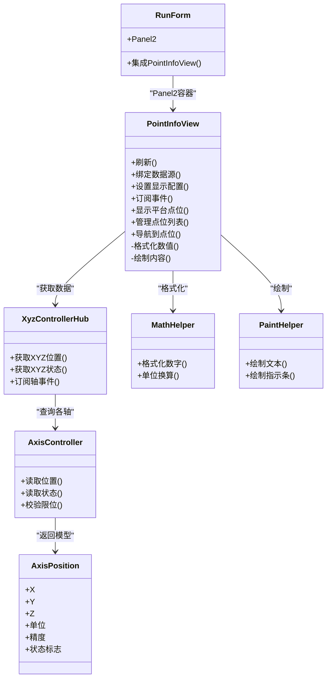
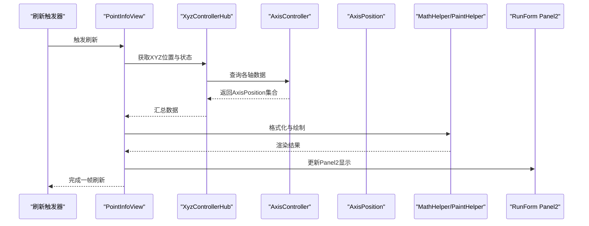
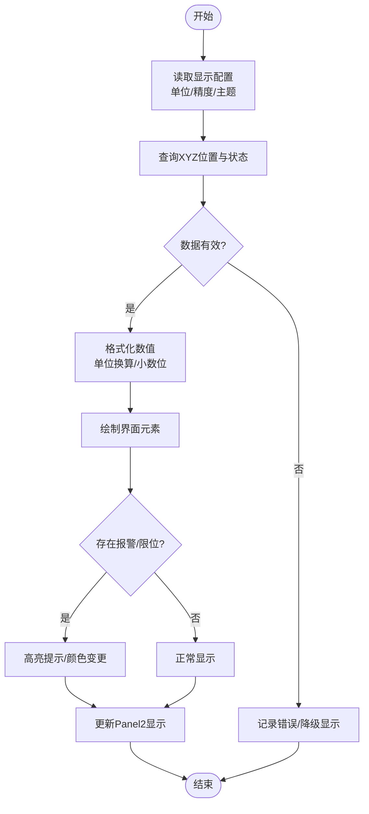
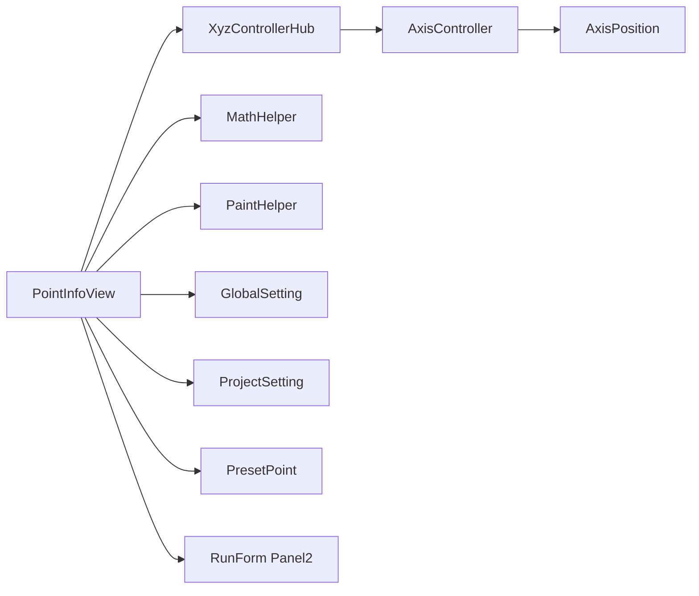

# 点位信息显示控件

<cite>
**本文引用的文件**   
- [MainControl/Controls/PointInfoView.cs](file://MainControl/Controls/PointInfoView.cs)
- [MainControl/Controls/MathHelper.cs](file://MainControl/Controls/MathHelper.cs)
- [MainControl/Controls/PaintHelper.cs](file://MainControl/Controls/PaintHelper.cs)
- [MainControl/Logic/AxisController.cs](file://MainControl/Logic/AxisController.cs)
- [MainControl/Logic/AxisPosition.cs](file://MainControl/Logic/AxisPosition.cs)
- [MainControl/Logic/XyzControllerHub.cs](file://MainControl/Logic/XyzControllerHub.cs)
- [MainControl/MainControlProcessModule.cs](file://MainControl/MainControlProcessModule.cs)
- [MainControl/MainControlGlobalSetting.cs](file://MainControl/MainControlGlobalSetting.cs)
- [MainControl/MainControlProjectSetting.cs](file://MainControl/MainControlProjectSetting.cs)
- [MainControl/PresetPoint.cs](file://MainControl/PresetPoint.cs)
- [MainControl/RunForm.cs](file://MainControl/RunForm.cs)
- [MainControl/XYView.cs](file://MainControl/XYView.cs)
- [MainControl/ZBarView.cs](file://MainControl/ZBarView.cs)
</cite>

## 更新摘要
**所做更改**
- 增强了 PointInfoView 自定义控件的功能，新增了平台点位位置显示、列表管理和导航功能
- 控件已集成到 RunForm 的 Panel2 中，提供全面的点位管理特性
- 更新了组件架构图以反映新的集成方式
- 增加了点位列表管理和导航功能的详细说明

## 目录
1. [简介](#简介)
2. [项目结构](#项目结构)
3. [核心组件](#核心组件)
4. [架构总览](#架构总览)
5. [详细组件分析](#详细组件分析)
6. [依赖关系分析](#依赖关系分析)
7. [性能考虑](#性能考虑)
8. [故障排查指南](#故障排查指南)
9. [结论](#结论)
10. [附录](#附录)

## 简介
本文件围绕"点位信息显示控件"展开，聚焦于 MainControl 模块中的 PointInfoView 及其相关支撑组件。该控件用于实时展示多轴设备的坐标位置、状态与关键信息，并与运动控制逻辑（AxisController、XyzControllerHub）进行数据交互，提供直观的人机界面反馈。**最新更新**：PointInfoView 控件功能已显著增强，新增平台点位位置显示、列表管理和导航能力，并完整集成到 RunForm 的 Panel2 中，为用户提供全面的点位管理体验。文档从系统架构、组件职责、数据流、错误处理与性能优化等维度进行系统化说明，帮助读者快速理解并正确使用该控件。

## 项目结构
MainControl 模块采用分层组织：
- Controls：UI 控件集合，包含 PointInfoView 以及绘图辅助类 MathHelper、PaintHelper。
- Logic：运动控制与数据模型，包括 AxisController、AxisPosition、XyzControllerHub 等。
- 顶层配置与入口：MainControlProcessModule、MainControlGlobalSetting、MainControlProjectSetting、PresetPoint、RunForm 等。

**图表来源**
- [MainControl/Controls/PointInfoView.cs](file://MainControl/Controls/PointInfoView.cs)
- [MainControl/Controls/MathHelper.cs](file://MainControl/Controls/MathHelper.cs)
- [MainControl/Controls/PaintHelper.cs](file://MainControl/Controls/PaintHelper.cs)
- [MainControl/Logic/AxisController.cs](file://MainControl/Logic/AxisController.cs)
- [MainControl/Logic/AxisPosition.cs](file://MainControl/Logic/AxisPosition.cs)
- [MainControl/Logic/XyzControllerHub.cs](file://MainControl/Logic/XyzControllerHub.cs)
- [MainControl/MainControlProcessModule.cs](file://MainControl/MainControlProcessModule.cs)
- [MainControl/MainControlGlobalSetting.cs](file://MainControl/MainControlGlobalSetting.cs)
- [MainControl/MainControlProjectSetting.cs](file://MainControl/MainControlProjectSetting.cs)
- [MainControl/PresetPoint.cs](file://MainControl/PresetPoint.cs)
- [MainControl/RunForm.cs](file://MainControl/RunForm.cs)
- [MainControl/XYView.cs](file://MainControl/XYView.cs)
- [MainControl/ZBarView.cs](file://MainControl/ZBarView.cs)

**章节来源**
- [MainControl/Controls/PointInfoView.cs](file://MainControl/Controls/PointInfoView.cs)
- [MainControl/Logic/AxisController.cs](file://MainControl/Logic/AxisController.cs)
- [MainControl/Logic/XyzControllerHub.cs](file://MainControl/Logic/XyzControllerHub.cs)
- [MainControl/MainControlProcessModule.cs](file://MainControl/MainControlProcessModule.cs)

## 核心组件
- **PointInfoView**：点位信息显示控件，负责聚合并展示当前各轴的坐标、状态、单位、精度等信息，支持刷新策略与事件通知。**增强功能**：新增平台点位位置显示、列表管理和导航能力。
- **AxisController**：轴控制器，封装对单轴或组合轴的运动与状态访问，提供位置读取、限位检测、报警状态等能力。
- **AxisPosition**：轴位置数据模型，承载坐标值、单位、精度、状态标志等字段。
- **XyzControllerHub**：XYZ 控制器中枢，协调多轴联动与统一接口，为 UI 提供稳定的数据源。
- **MathHelper / PaintHelper**：数学计算与绘图辅助，提升渲染效率与数值显示精度。
- **MainControlProcessModule / GlobalSetting / ProjectSetting**：进程级与项目级配置，影响控件的显示行为与默认参数。
- **PresetPoint**：预设点位管理，便于快速跳转与显示。
- **RunForm / XYView / ZBarView**：运行界面与可视化视图，与 PointInfoView 协同呈现整体设备状态。**更新**：RunForm 的 Panel2 现在集成了增强的 PointInfoView 控件。

**章节来源**
- [MainControl/Controls/PointInfoView.cs](file://MainControl/Controls/PointInfoView.cs)
- [MainControl/Logic/AxisController.cs](file://MainControl/Logic/AxisController.cs)
- [MainControl/Logic/AxisPosition.cs](file://MainControl/Logic/AxisPosition.cs)
- [MainControl/Logic/XyzControllerHub.cs](file://MainControl/Logic/XyzControllerHub.cs)
- [MainControl/Controls/MathHelper.cs](file://MainControl/Controls/MathHelper.cs)
- [MainControl/Controls/PaintHelper.cs](file://MainControl/Controls/PaintHelper.cs)
- [MainControl/MainControlProcessModule.cs](file://MainControl/MainControlProcessModule.cs)
- [MainControl/MainControlGlobalSetting.cs](file://MainControl/MainControlGlobalSetting.cs)
- [MainControl/MainControlProjectSetting.cs](file://MainControl/MainControlProjectSetting.cs)
- [MainControl/PresetPoint.cs](file://MainControl/PresetPoint.cs)
- [MainControl/RunForm.cs](file://MainControl/RunForm.cs)
- [MainControl/XYView.cs](file://MainControl/XYView.cs)
- [MainControl/ZBarView.cs](file://MainControl/ZBarView.cs)

## 架构总览
PointInfoView 作为 UI 层的核心，通过事件或轮询机制从 AxisController 与 XyzControllerHub 获取最新位置与状态，使用 MathHelper 进行数值格式化，借助 PaintHelper 完成绘制。配置项来自 GlobalSetting 与 ProjectSetting，预设点由 PresetPoint 管理。RunForm 作为宿主窗体，将 PointInfoView 嵌入其中，形成完整的运行界面。**更新**：PointInfoView 现已完全集成到 RunForm 的 Panel2 容器中，提供更丰富的点位管理功能。

**图表来源**
- [MainControl/Controls/PointInfoView.cs](file://MainControl/Controls/PointInfoView.cs)
- [MainControl/Logic/XyzControllerHub.cs](file://MainControl/Logic/XyzControllerHub.cs)
- [MainControl/Logic/AxisController.cs](file://MainControl/Logic/AxisController.cs)
- [MainControl/Logic/AxisPosition.cs](file://MainControl/Logic/AxisPosition.cs)
- [MainControl/Controls/MathHelper.cs](file://MainControl/Controls/MathHelper.cs)
- [MainControl/Controls/PaintHelper.cs](file://MainControl/Controls/PaintHelper.cs)
- [MainControl/MainControlGlobalSetting.cs](file://MainControl/MainControlGlobalSetting.cs)
- [MainControl/MainControlProjectSetting.cs](file://MainControl/MainControlProjectSetting.cs)
- [MainControl/RunForm.cs](file://MainControl/RunForm.cs)

## 详细组件分析

### PointInfoView 控件分析
- **职责**：聚合显示各轴坐标、单位、精度、报警与限位状态；支持刷新频率、主题切换、预设点选择。**增强功能**：新增平台点位位置显示、列表管理和导航能力。
- **数据源**：通过 XyzControllerHub 与 AxisController 获取实时数据；必要时缓存最近一次有效值。
- **渲染**：使用 MathHelper 进行数值格式化（如小数位、单位换算），PaintHelper 完成文本与图形绘制。
- **事件**：对外暴露位置变化、报警状态变更等事件，供上层订阅。
- **配置**：读取 GlobalSetting 与 ProjectSetting 决定默认显示行为。
- **集成**：在 RunForm 的 Panel2 中完整集成，提供用户友好的界面操作。

**图表来源**
- [MainControl/Controls/PointInfoView.cs](file://MainControl/Controls/PointInfoView.cs)
- [MainControl/Logic/AxisController.cs](file://MainControl/Logic/AxisController.cs)
- [MainControl/Logic/XyzControllerHub.cs](file://MainControl/Logic/XyzControllerHub.cs)
- [MainControl/Logic/AxisPosition.cs](file://MainControl/Logic/AxisPosition.cs)
- [MainControl/Controls/MathHelper.cs](file://MainControl/Controls/MathHelper.cs)
- [MainControl/Controls/PaintHelper.cs](file://MainControl/Controls/PaintHelper.cs)
- [MainControl/RunForm.cs](file://MainControl/RunForm.cs)

**章节来源**
- [MainControl/Controls/PointInfoView.cs](file://MainControl/Controls/PointInfoView.cs)
- [MainControl/Controls/MathHelper.cs](file://MainControl/Controls/MathHelper.cs)
- [MainControl/Controls/PaintHelper.cs](file://MainControl/Controls/PaintHelper.cs)
- [MainControl/Logic/AxisController.cs](file://MainControl/Logic/AxisController.cs)
- [MainControl/Logic/AxisPosition.cs](file://MainControl/Logic/AxisPosition.cs)
- [MainControl/Logic/XyzControllerHub.cs](file://MainControl/Logic/XyzControllerHub.cs)
- [MainControl/RunForm.cs](file://MainControl/RunForm.cs)

### 数据刷新流程（序列图）
- **触发**：定时器或外部事件（如轴位置变化）。
- **步骤**：
  1) PointInfoView 向 XyzControllerHub 请求当前位置与状态。
  2) XyzControllerHub 调用 AxisController 读取各轴数据。
  3) AxisController 返回 AxisPosition 集合。
  4) PointInfoView 使用 MathHelper 格式化数值，PaintHelper 绘制界面。
  5) 若存在报警或限位异常，更新提示样式。
  6) **新增**：更新 RunForm Panel2 中的显示内容。

**图表来源**
- [MainControl/Controls/PointInfoView.cs](file://MainControl/Controls/PointInfoView.cs)
- [MainControl/Logic/XyzControllerHub.cs](file://MainControl/Logic/XyzControllerHub.cs)
- [MainControl/Logic/AxisController.cs](file://MainControl/Logic/AxisController.cs)
- [MainControl/Logic/AxisPosition.cs](file://MainControl/Logic/AxisPosition.cs)
- [MainControl/Controls/MathHelper.cs](file://MainControl/Controls/MathHelper.cs)
- [MainControl/Controls/PaintHelper.cs](file://MainControl/Controls/PaintHelper.cs)
- [MainControl/RunForm.cs](file://MainControl/RunForm.cs)

### 复杂逻辑流程图（刷新与异常处理）

**图表来源**
- [MainControl/Controls/PointInfoView.cs](file://MainControl/Controls/PointInfoView.cs)
- [MainControl/Logic/AxisController.cs](file://MainControl/Logic/AxisController.cs)
- [MainControl/Logic/XyzControllerHub.cs](file://MainControl/Logic/XyzControllerHub.cs)
- [MainControl/Controls/MathHelper.cs](file://MainControl/Controls/MathHelper.cs)
- [MainControl/Controls/PaintHelper.cs](file://MainControl/Controls/PaintHelper.cs)
- [MainControl/RunForm.cs](file://MainControl/RunForm.cs)

### 概念性概览
- 点位信息显示控件以"数据驱动+事件响应"的模式工作，确保界面与底层设备状态一致。
- 通过分层解耦（UI/控制/数据模型/工具），提高可维护性与可扩展性。
- 配置与预设点分离，便于在不同项目间复用与定制。
- **更新**：控件现已完全集成到 RunForm 的 Panel2 中，提供更直观的点位管理界面。

[本节为概念性说明，不直接分析具体文件]

## 依赖关系分析
- PointInfoView 依赖 XyzControllerHub 与 AxisController 获取数据，依赖 MathHelper 与 PaintHelper 完成显示。
- XyzControllerHub 聚合多个 AxisController 的能力，提供统一的 XYZ 数据接口。
- AxisPosition 作为数据载体，被 AxisController 生成并被 UI 消费。
- 配置项（GlobalSetting、ProjectSetting）影响显示行为，但不参与运行时数据流。
- PresetPoint 提供预设点位，供用户快速选择并在 PointInfoView 中显示。
- **更新**：PointInfoView 现在依赖于 RunForm 的 Panel2 容器进行界面集成。

**图表来源**
- [MainControl/Controls/PointInfoView.cs](file://MainControl/Controls/PointInfoView.cs)
- [MainControl/Logic/XyzControllerHub.cs](file://MainControl/Logic/XyzControllerHub.cs)
- [MainControl/Logic/AxisController.cs](file://MainControl/Logic/AxisController.cs)
- [MainControl/Logic/AxisPosition.cs](file://MainControl/Logic/AxisPosition.cs)
- [MainControl/Controls/MathHelper.cs](file://MainControl/Controls/MathHelper.cs)
- [MainControl/Controls/PaintHelper.cs](file://MainControl/Controls/PaintHelper.cs)
- [MainControl/MainControlGlobalSetting.cs](file://MainControl/MainControlGlobalSetting.cs)
- [MainControl/MainControlProjectSetting.cs](file://MainControl/MainControlProjectSetting.cs)
- [MainControl/PresetPoint.cs](file://MainControl/PresetPoint.cs)
- [MainControl/RunForm.cs](file://MainControl/RunForm.cs)

**章节来源**
- [MainControl/Controls/PointInfoView.cs](file://MainControl/Controls/PointInfoView.cs)
- [MainControl/Logic/XyzControllerHub.cs](file://MainControl/Logic/XyzControllerHub.cs)
- [MainControl/Logic/AxisController.cs](file://MainControl/Logic/AxisController.cs)
- [MainControl/Logic/AxisPosition.cs](file://MainControl/Logic/AxisPosition.cs)
- [MainControl/Controls/MathHelper.cs](file://MainControl/Controls/MathHelper.cs)
- [MainControl/Controls/PaintHelper.cs](file://MainControl/Controls/PaintHelper.cs)
- [MainControl/MainControlGlobalSetting.cs](file://MainControl/MainControlGlobalSetting.cs)
- [MainControl/MainControlProjectSetting.cs](file://MainControl/MainControlProjectSetting.cs)
- [MainControl/PresetPoint.cs](file://MainControl/PresetPoint.cs)
- [MainControl/RunForm.cs](file://MainControl/RunForm.cs)

## 性能考虑
- 刷新频率：合理设置刷新间隔，避免频繁 UI 重绘导致卡顿。
- 数据缓存：在数据未变化时减少重复查询，降低总线或硬件访问压力。
- 格式化开销：集中使用 MathHelper 进行批量格式化，减少对象分配。
- 绘制优化：使用 PaintHelper 缓存常用图形资源，减少每次绘制的开销。
- 线程安全：确保 UI 线程与数据线程的隔离，避免跨线程访问导致的异常。
- **更新**：Panel2 集成优化，确保 PointInfoView 在容器中的高效渲染和响应。

[本节提供通用指导，不直接分析具体文件]

## 故障排查指南
- 显示空白或无更新：检查数据源是否可用、事件订阅是否正确、刷新触发器是否启动。
- 数值异常或单位错误：确认 MathHelper 的单位换算与小数位设置是否符合预期。
- 报警/限位误报：核查 AxisController 的状态读取与阈值判断逻辑。
- 界面卡顿：降低刷新频率、优化绘制路径、启用双缓冲。
- 配置不生效：验证 GlobalSetting 与 ProjectSetting 的加载顺序与优先级。
- **新增**：Panel2 集成问题：检查 RunForm 的 Panel2 容器是否正确初始化，PointInfoView 是否正确添加到容器中。

**章节来源**
- [MainControl/Controls/PointInfoView.cs](file://MainControl/Controls/PointInfoView.cs)
- [MainControl/Logic/AxisController.cs](file://MainControl/Logic/AxisController.cs)
- [MainControl/Logic/XyzControllerHub.cs](file://MainControl/Logic/XyzControllerHub.cs)
- [MainControl/Controls/MathHelper.cs](file://MainControl/Controls/MathHelper.cs)
- [MainControl/Controls/PaintHelper.cs](file://MainControl/Controls/PaintHelper.cs)
- [MainControl/MainControlGlobalSetting.cs](file://MainControl/MainControlGlobalSetting.cs)
- [MainControl/MainControlProjectSetting.cs](file://MainControl/MainControlProjectSetting.cs)
- [MainControl/RunForm.cs](file://MainControl/RunForm.cs)

## 结论
PointInfoView 作为点位信息显示的核心控件，通过清晰的层次结构与稳定的数据流，实现了设备状态的直观展示。结合 MathHelper 与 PaintHelper 的辅助能力，以及 AxisController 与 XyzControllerHub 的数据支撑，控件具备良好的可维护性与扩展性。**最新更新**：PointInfoView 现已完全集成到 RunForm 的 Panel2 中，新增了平台点位位置显示、列表管理和导航功能，为用户提供了更全面的点位管理体验。合理的刷新策略与绘制优化可进一步提升用户体验。建议在项目中根据实际需求调整配置与预设点，确保显示效果与业务场景一致。

[本节为总结性内容，不直接分析具体文件]

## 附录
- **相关视图**：XYView、ZBarView 可与 PointInfoView 配合，提供更丰富的可视化信息。
- **运行窗体**：RunForm 作为宿主，集成 PointInfoView 与其他控件，形成完整操作界面。**更新**：RunForm 的 Panel2 现在专门用于容纳增强的 PointInfoView 控件。
- **进程模块**：MainControlProcessModule 负责模块生命周期与初始化，确保控件正确加载。
- **新增功能**：点位列表管理、导航功能、平台点位位置显示等增强特性。

**章节来源**
- [MainControl/XYView.cs](file://MainControl/XYView.cs)
- [MainControl/ZBarView.cs](file://MainControl/ZBarView.cs)
- [MainControl/RunForm.cs](file://MainControl/RunForm.cs)
- [MainControl/MainControlProcessModule.cs](file://MainControl/MainControlProcessModule.cs)
- [MainControl/Controls/PointInfoView.cs](file://MainControl/Controls/PointInfoView.cs)