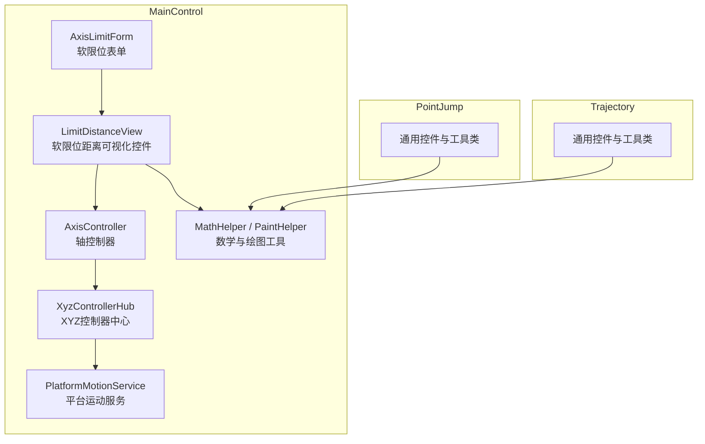
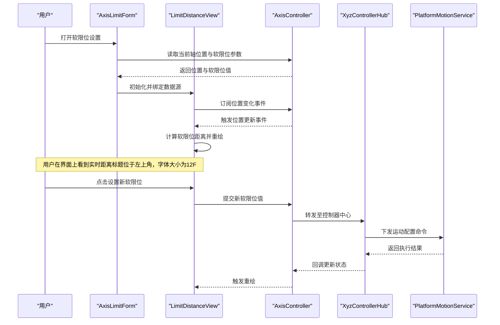
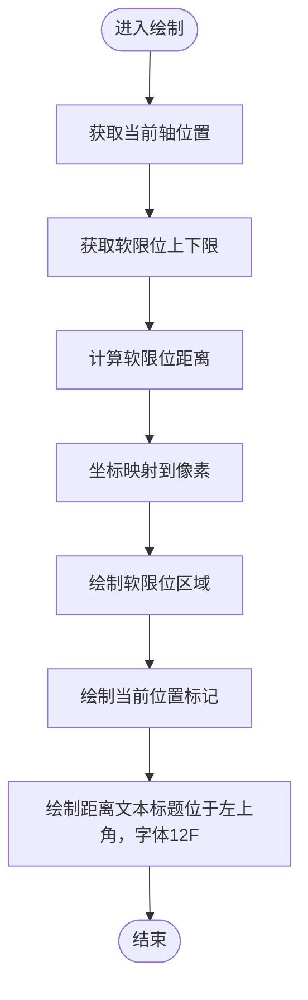
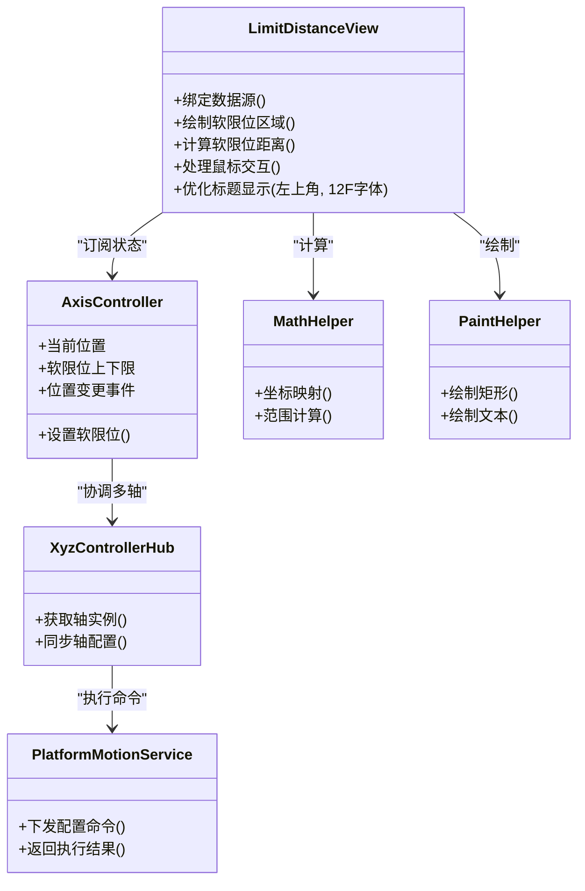

# 软限位距离可视化

<cite>
**本文引用的文件**
- [MainControl/Controls/LimitDistanceView.cs](file://MainControl/Controls/LimitDistanceView.cs)
- [MainControl/AxisLimitForm.cs](file://MainControl/AxisLimitForm.cs)
- [MainControl/Logic/AxisController.cs](file://MainControl/Logic/AxisController.cs)
- [MainControl/Logic/XyzControllerHub.cs](file://MainControl/Logic/XyzControllerHub.cs)
- [MainControl/Logic/PlatformMotionService.cs](file://MainControl/Logic/PlatformMotionService.cs)
- [MainControl/Logic/MotionCommand.cs](file://MainControl/Logic/MotionCommand.cs)
- [MainControl/MathHelper.cs](file://MainControl/MathHelper.cs)
- [MainControl/PaintHelper.cs](file://MainControl/PaintHelper.cs)
- [PointJump/Controls/MathHelper.cs](file://PointJump/Controls/MathHelper.cs)
- [Trajectory/Controls/MathHelper.cs](file://Trajectory/Controls/MathHelper.cs)
</cite>

## 更新摘要
**所做更改**
- 更新了LimitDistanceView组件的视觉呈现优化说明
- 修正了标题位置从右上角移动到左上角的描述
- 更新了字体大小从11F增加到12F的改进说明
- 增强了界面清晰度和可见性的相关章节

## 目录
1. [简介](#简介)
2. [项目结构](#项目结构)
3. [核心组件](#核心组件)
4. [架构总览](#架构总览)
5. [详细组件分析](#详细组件分析)
6. [依赖关系分析](#依赖关系分析)
7. [性能考虑](#性能考虑)
8. [故障排查指南](#故障排查指南)
9. [结论](#结论)
10. [附录](#附录)

## 简介
本仓库包含多个与运动控制相关的模块（MainControl、PointJump、Trajectory），其中"软限位距离可视化"功能主要由 MainControl 模块提供。该功能通过自定义控件将各轴的软限位边界以图形方式呈现，便于用户直观查看当前轴位置与软限位之间的距离，并在需要时进行交互设置或校验。

**最新更新**：最近对LimitDistanceView组件进行了视觉优化，包括标题位置调整到左上角以提高可见性，以及字体大小从11F增加到12F以改善界面清晰度。

## 项目结构
- MainControl：主控制界面与可视化逻辑，包含软限位距离可视化控件与表单。
- PointJump：点位跳转相关模块，复用部分通用控件与工具类。
- Trajectory：轨迹相关模块，同样复用通用控件与工具类。

**图表来源**
- [MainControl/AxisLimitForm.cs](file://MainControl/AxisLimitForm.cs)
- [MainControl/Controls/LimitDistanceView.cs](file://MainControl/Controls/LimitDistanceView.cs)
- [MainControl/Logic/AxisController.cs](file://MainControl/Logic/AxisController.cs)
- [MainControl/Logic/XyzControllerHub.cs](file://MainControl/Logic/XyzControllerHub.cs)
- [MainControl/Logic/PlatformMotionService.cs](file://MainControl/Logic/PlatformMotionService.cs)
- [MainControl/MathHelper.cs](file://MainControl/MathHelper.cs)
- [MainControl/PaintHelper.cs](file://MainControl/PaintHelper.cs)

**章节来源**
- [MainControl/AxisLimitForm.cs](file://MainControl/AxisLimitForm.cs)
- [MainControl/Controls/LimitDistanceView.cs](file://MainControl/Controls/LimitDistanceView.cs)
- [MainControl/Logic/AxisController.cs](file://MainControl/Logic/AxisController.cs)
- [MainControl/Logic/XyzControllerHub.cs](file://MainControl/Logic/XyzControllerHub.cs)
- [MainControl/Logic/PlatformMotionService.cs](file://MainControl/Logic/PlatformMotionService.cs)
- [MainControl/MathHelper.cs](file://MainControl/MathHelper.cs)
- [MainControl/PaintHelper.cs](file://MainControl/PaintHelper.cs)

## 核心组件
- 软限位距离可视化控件（LimitDistanceView）
  - 负责绘制软限位区域、当前位置指示、距离标注等。
  - 订阅轴位置变化事件，刷新显示。
  - 支持鼠标交互（如点击设置软限位值）。
  - **最新优化**：标题位置已调整至左上角，字体大小增至12F以提升可读性。
- 软限位表单（AxisLimitForm）
  - 承载 LimitDistanceView 控件，提供参数输入与确认。
  - 调用 AxisController 获取/设置软限位参数。
- 轴控制器（AxisController）
  - 封装单轴的运动状态、位置、软限位参数。
  - 暴露属性与事件供 UI 订阅。
- XYZ控制器中心（XyzControllerHub）
  - 管理多轴实例，协调轴间关系。
- 平台运动服务（PlatformMotionService）
  - 与底层硬件或仿真层通信，执行运动命令。
- 数学与绘图工具（MathHelper、PaintHelper）
  - 提供坐标转换、范围计算、绘图辅助方法。

**章节来源**
- [MainControl/Controls/LimitDistanceView.cs](file://MainControl/Controls/LimitDistanceView.cs)
- [MainControl/AxisLimitForm.cs](file://MainControl/AxisLimitForm.cs)
- [MainControl/Logic/AxisController.cs](file://MainControl/Logic/AxisController.cs)
- [MainControl/Logic/XyzControllerHub.cs](file://MainControl/Logic/XyzControllerHub.cs)
- [MainControl/Logic/PlatformMotionService.cs](file://MainControl/Logic/PlatformMotionService.cs)
- [MainControl/MathHelper.cs](file://MainControl/MathHelper.cs)
- [MainControl/PaintHelper.cs](file://MainControl/PaintHelper.cs)

## 架构总览
软限位距离可视化的数据流从底层运动服务到上层 UI 的完整路径如下：

**图表来源**
- [MainControl/AxisLimitForm.cs](file://MainControl/AxisLimitForm.cs)
- [MainControl/Controls/LimitDistanceView.cs](file://MainControl/Controls/LimitDistanceView.cs)
- [MainControl/Logic/AxisController.cs](file://MainControl/Logic/AxisController.cs)
- [MainControl/Logic/XyzControllerHub.cs](file://MainControl/Logic/XyzControllerHub.cs)
- [MainControl/Logic/PlatformMotionService.cs](file://MainControl/Logic/PlatformMotionService.cs)

## 详细组件分析

### 软限位距离可视化控件（LimitDistanceView）
- 职责
  - 渲染软限位区间与当前位置。
  - 计算并显示软限位距离。
  - 处理用户交互（如点击设置软限位）。
- 关键流程
  - 数据绑定：订阅 AxisController 的位置与软限位属性变更。
  - 绘制逻辑：根据坐标映射与范围计算绘制矩形、线段与文本。
  - 交互逻辑：捕获鼠标事件，弹出设置对话框或即时应用新值。
- 复杂度与优化
  - 绘制频率受事件驱动，建议仅在必要时重绘。
  - 使用双缓冲减少闪烁。
  - 对频繁更新的数值进行节流或去抖。
- **最新优化**
  - 标题位置已从右上角移至左上角，显著提升可见性和用户体验。
  - 字体大小从11F增加到12F，改善了界面的清晰度和可读性。

**图表来源**
- [MainControl/Controls/LimitDistanceView.cs](file://MainControl/Controls/LimitDistanceView.cs)
- [MainControl/MathHelper.cs](file://MainControl/MathHelper.cs)
- [MainControl/PaintHelper.cs](file://MainControl/PaintHelper.cs)

**章节来源**
- [MainControl/Controls/LimitDistanceView.cs](file://MainControl/Controls/LimitDistanceView.cs)
- [MainControl/MathHelper.cs](file://MainControl/MathHelper.cs)
- [MainControl/PaintHelper.cs](file://MainControl/PaintHelper.cs)

### 软限位表单（AxisLimitForm）
- 职责
  - 承载 LimitDistanceView 控件。
  - 提供软限位参数的输入与确认入口。
  - 调用 AxisController 读写软限位配置。
- 关键流程
  - 初始化：加载当前轴位置与软限位值。
  - 交互：用户修改后，调用 AxisController 保存并触发视图刷新。
  - 校验：对输入值进行合法性检查（如上限大于下限）。

**章节来源**
- [MainControl/AxisLimitForm.cs](file://MainControl/AxisLimitForm.cs)
- [MainControl/Logic/AxisController.cs](file://MainControl/Logic/AxisController.cs)

### 轴控制器（AxisController）
- 职责
  - 维护单轴的状态（位置、速度、软限位上下限）。
  - 暴露属性与事件供 UI 订阅。
  - 与 XyzControllerHub 协作，确保多轴一致性。
- 关键点
  - 属性变更事件用于驱动 UI 刷新。
  - 软限位参数变更需触发重绘与可能的运动限制校验。

**章节来源**
- [MainControl/Logic/AxisController.cs](file://MainControl/Logic/AxisController.cs)
- [MainControl/Logic/XyzControllerHub.cs](file://MainControl/Logic/XyzControllerHub.cs)

### XYZ控制器中心（XyzControllerHub）
- 职责
  - 管理 X/Y/Z 三个轴的实例。
  - 协调轴间的联动与约束。
  - 向 PlatformMotionService 下发统一命令。
- 关键点
  - 提供统一的接口访问各轴状态。
  - 在软限位变更时同步更新所有相关轴的配置。

**章节来源**
- [MainControl/Logic/XyzControllerHub.cs](file://MainControl/Logic/XyzControllerHub.cs)

### 平台运动服务（PlatformMotionService）
- 职责
  - 与底层硬件或仿真层通信。
  - 执行运动命令与配置更新。
- 关键点
  - 软限位参数作为配置项下发。
  - 返回执行结果与状态反馈。

**章节来源**
- [MainControl/Logic/PlatformMotionService.cs](file://MainControl/Logic/PlatformMotionService.cs)
- [MainControl/Logic/MotionCommand.cs](file://MainControl/Logic/MotionCommand.cs)

### 数学与绘图工具（MathHelper、PaintHelper）
- 职责
  - MathHelper：坐标映射、范围计算、数值舍入等。
  - PaintHelper：绘制矩形、线段、文本等基础图形。
- 关键点
  - 提供可复用的计算方法，避免重复实现。
  - 保证绘制的一致性与精度。

**章节来源**
- [MainControl/MathHelper.cs](file://MainControl/MathHelper.cs)
- [MainControl/PaintHelper.cs](file://MainControl/PaintHelper.cs)
- [PointJump/Controls/MathHelper.cs](file://PointJump/Controls/MathHelper.cs)
- [Trajectory/Controls/MathHelper.cs](file://Trajectory/Controls/MathHelper.cs)

## 依赖关系分析
- LimitDistanceView 依赖 AxisController 提供的轴状态与事件。
- AxisController 依赖 XyzControllerHub 进行多轴协调。
- XyzControllerHub 依赖 PlatformMotionService 执行底层命令。
- 绘制逻辑依赖 MathHelper 与 PaintHelper。

**图表来源**
- [MainControl/Controls/LimitDistanceView.cs](file://MainControl/Controls/LimitDistanceView.cs)
- [MainControl/Logic/AxisController.cs](file://MainControl/Logic/AxisController.cs)
- [MainControl/Logic/XyzControllerHub.cs](file://MainControl/Logic/XyzControllerHub.cs)
- [MainControl/Logic/PlatformMotionService.cs](file://MainControl/Logic/PlatformMotionService.cs)
- [MainControl/MathHelper.cs](file://MainControl/MathHelper.cs)
- [MainControl/PaintHelper.cs](file://MainControl/PaintHelper.cs)

**章节来源**
- [MainControl/Controls/LimitDistanceView.cs](file://MainControl/Controls/LimitDistanceView.cs)
- [MainControl/Logic/AxisController.cs](file://MainControl/Logic/AxisController.cs)
- [MainControl/Logic/XyzControllerHub.cs](file://MainControl/Logic/XyzControllerHub.cs)
- [MainControl/Logic/PlatformMotionService.cs](file://MainControl/Logic/PlatformMotionService.cs)
- [MainControl/MathHelper.cs](file://MainControl/MathHelper.cs)
- [MainControl/PaintHelper.cs](file://MainControl/PaintHelper.cs)

## 性能考虑
- 事件驱动刷新：仅在轴位置或软限位变更时重绘，避免定时轮询。
- 绘制优化：使用双缓冲、裁剪无效区域、减少不必要的对象分配。
- 数值节流：对高频更新的事件进行节流或合并，降低 UI 压力。
- 资源释放：在控件销毁时取消事件订阅，防止内存泄漏。
- **视觉优化影响**：标题位置和字体大小的调整不会影响性能，但提升了用户体验和界面可读性。

## 故障排查指南
- 现象：软限位距离不更新
  - 检查 AxisController 是否触发位置变更事件。
  - 确认 LimitDistanceView 已正确订阅事件。
- 现象：绘制错位或比例异常
  - 检查 MathHelper 的坐标映射与范围计算是否正确。
  - 验证输入单位与显示单位的一致性。
- 现象：设置软限位失败
  - 检查 AxisLimitForm 的参数校验逻辑。
  - 确认 XyzControllerHub 与 PlatformMotionService 的命令下发与回调正常。
- **新增问题**：标题显示异常
  - 检查LimitDistanceView中标题位置的坐标计算。
  - 确认字体大小设置为12F而非默认的11F。
  - 验证左上角定位逻辑是否正确实现。

**章节来源**
- [MainControl/Controls/LimitDistanceView.cs](file://MainControl/Controls/LimitDistanceView.cs)
- [MainControl/AxisLimitForm.cs](file://MainControl/AxisLimitForm.cs)
- [MainControl/Logic/AxisController.cs](file://MainControl/Logic/AxisController.cs)
- [MainControl/Logic/XyzControllerHub.cs](file://MainControl/Logic/XyzControllerHub.cs)
- [MainControl/Logic/PlatformMotionService.cs](file://MainControl/Logic/PlatformMotionService.cs)

## 结论
软限位距离可视化通过清晰的层次结构与事件驱动机制，实现了从底层运动状态到上层可视化的无缝衔接。借助 MathHelper 与 PaintHelper 的工具能力，控件能够高效、准确地展示软限位信息与距离。最近的视觉优化进一步提升了用户体验，包括标题位置调整到左上角和字体大小增加到12F。建议在后续迭代中进一步优化绘制性能与交互体验，并完善错误提示与日志记录。

## 附录
- 相关模块复用情况：PointJump 与 Trajectory 模块复用了通用的 MathHelper 与绘图工具，有助于保持行为一致。
- 扩展建议：可增加动画过渡效果、历史轨迹回放、多轴对比显示等功能。
- **视觉优化总结**：LimitDistanceView组件的标题位置优化和字体大小调整显著改善了界面的可用性和可读性。