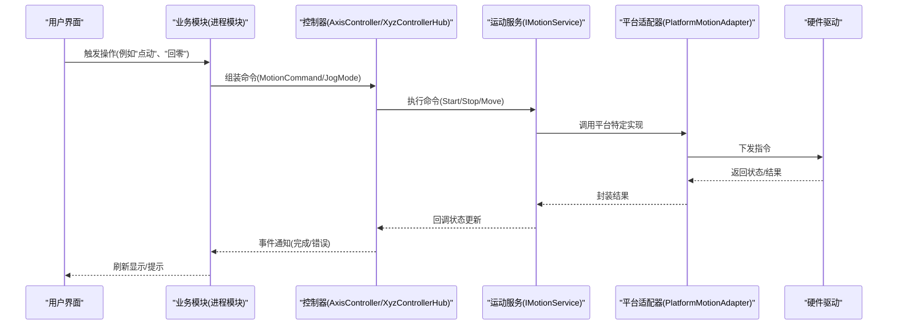
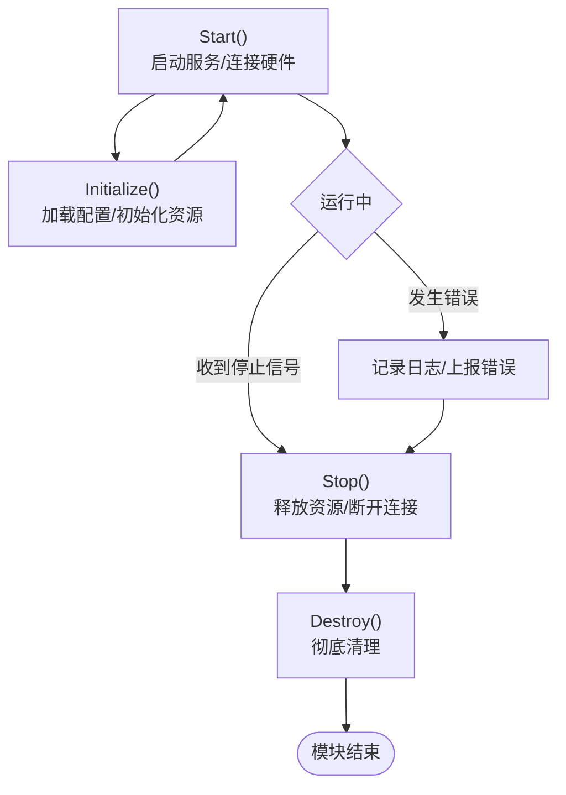
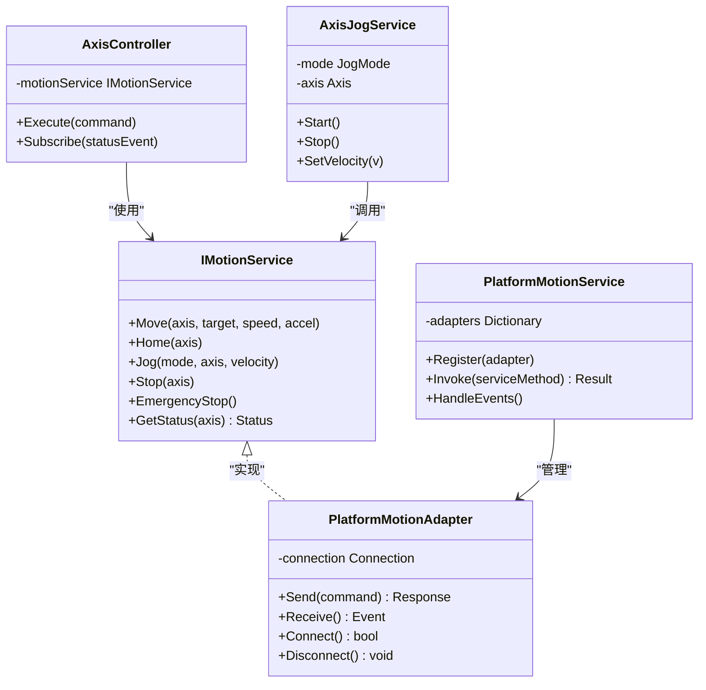
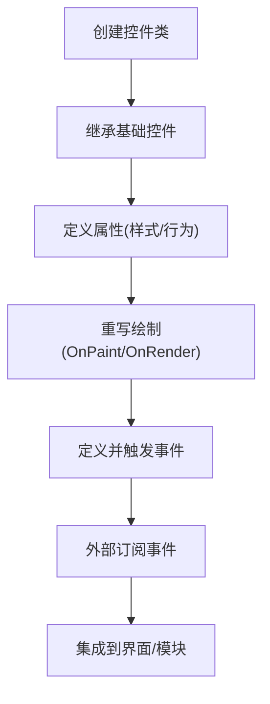
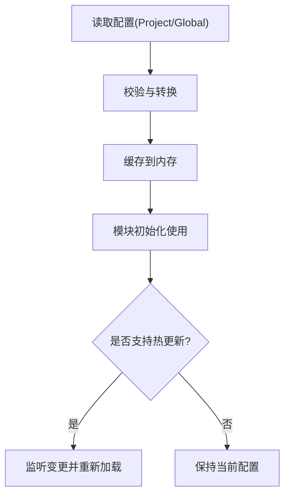

# 开发指南

<cite>
**本文引用的文件**
- [ProcessModules.csproj](file://ProcessModules.csproj)
- [ProcessModules.sln](file://ProcessModules.sln)
- [README.md](file://README.md)
- [AGENTS.md](file://AGENTS.md)
- [基类调整说明.md](file://基类调整说明.md)
- [独立 DLL 构建说明.md](file://独立 DLL 构建说明.md)
- [重构完成报告.md](file://重构完成报告.md)
- [命名空间与类名一致性验证报告.md](file://命名空间与类名一致性验证报告.md)
- [Logic/IMotionService.cs](file://Logic/IMotionService.cs)
- [Logic/PlatformMotionAdapter.cs](file://Logic/PlatformMotionAdapter.cs)
- [Logic/PlatformMotionService.cs](file://Logic/PlatformMotionService.cs)
- [Logic/AxisController.cs](file://Logic/AxisController.cs)
- [Logic/AxisJogService.cs](file://Logic/AxisJogService.cs)
- [Logic/MotionCommand.cs](file://Logic/MotionCommand.cs)
- [Logic/JogMode.cs](file://Logic/JogMode.cs)
- [Logic/XyzControllerHub.cs](file://Logic/XyzControllerHub.cs)
- [MainControl/MainControlProcessModule.cs](file://MainControl/MainControlProcessModule.cs)
- [MainControl/MainControlProjectSetting.cs](file://MainControl/MainControlProjectSetting.cs)
- [MainControl/MainControlGlobalSetting.cs](file://MainControl/MainControlGlobalSetting.cs)
- [PointJump/PointJumpProcessModule.cs](file://PointJump/PointJumpProcessModule.cs)
- [PointJump/PointJumpProjectSetting.cs](file://PointJump/PointJumpProjectSetting.cs)
- [PointJump/PointJumpGlobalSetting.cs](file://PointJump/PointJumpGlobalSetting.cs)
- [Trajectory/TrajectoryViewProcessModule.cs](file://Trajectory/TrajectoryViewProcessModule.cs)
- [Trajectory/TrajectoryProjectSetting.cs](file://Trajectory/TrajectoryProjectSetting.cs)
- [Trajectory/TrajectoryGlobalSetting.cs](file://Trajectory/TrajectoryGlobalSetting.cs)
- [Controls/DroLabel.cs](file://Controls/DroLabel.cs)
- [Controls/JogButton.cs](file://Controls/JogButton.cs)
- [Controls/MathHelper.cs](file://Controls/MathHelper.cs)
- [Controls/PaintHelper.cs](file://Controls/PaintHelper.cs)
- [Controls/XYView.cs](file://Controls/XYView.cs)
- [Controls/ZBarView.cs](file://Controls/ZBarView.cs)
</cite>

## 更新摘要
**所做更改**
- 移除了所有迁移相关的文档引用和章节，因为架构重构已完成
- 更新了项目结构说明，反映当前稳定的架构状态
- 简化了依赖分析部分，移除了迁移相关的复杂性说明
- 优化了故障排查指南，专注于当前架构的常见问题
- 完善了开发环境搭建流程，确保与新架构的一致性

## 目录
1. [简介](#简介)
2. [项目结构](#项目结构)
3. [核心组件](#核心组件)
4. [架构总览](#架构总览)
5. [详细组件分析](#详细组件分析)
6. [依赖分析](#依赖分析)
7. [性能考虑](#性能考虑)
8. [故障排查指南](#故障排查指南)
9. [结论](#结论)
10. [附录](#附录)

## 简介
本指南面向希望基于 ProcessModules 框架扩展新进程模块、实现硬件平台适配以及开发自定义控件的开发者。内容涵盖：
- 如何继承 ProcessModuleBaseEx 基类并遵循生命周期管理
- 如何实现 IMotionService 接口以支持新的硬件平台
- 自定义控件开发的完整流程（事件处理、样式定制）
- 模块间通信的最佳实践与集成模式
- 通过 ProjectSetting 和 GlobalSetting 进行配置扩展
- 调试技巧、性能优化建议与常见问题解决方案
- 代码规范与命名约定
- 完整的开发环境搭建、构建与发布流程

**注意**：本框架已完成架构重构，所有迁移相关工作已结束，开发者可直接基于当前稳定版本进行开发。

## 项目结构
本项目采用多模块（插件化）架构，每个业务功能以独立子项目形式存在，并通过统一的进程模块基类进行注册与生命周期管理。核心目录说明如下：
- Controls：通用自定义控件库，提供 UI 交互与绘制能力
- Logic：运动控制抽象层与平台适配器，定义 IMotionService 接口及具体实现
- MainControl、PointJump、Trajectory：各业务模块，各自包含 ProcessModule、ProjectSetting、GlobalSetting 与运行表单
- 根目录：工程文件、解决方案、文档与说明

```mermaid
graph TB
subgraph "根工程"
PM["ProcessModules.csproj"]
SLN["ProcessModules.sln"]
end
subgraph "逻辑层"
IM["IMotionService.cs"]
PMA["PlatformMotionAdapter.cs"]
PMS["PlatformMotionService.cs"]
AC["AxisController.cs"]
AJS["AxisJogService.cs"]
MC["MotionCommand.cs"]
JM["JogMode.cs"]
XH["XyzControllerHub.cs"]
end
subgraph "控件库"
DL["DroLabel.cs"]
JB["JogButton.cs"]
MH["MathHelper.cs"]
PH["PaintHelper.cs"]
XY["XYView.cs"]
ZB["ZBarView.cs"]
end
subgraph "业务模块"
MCMod["MainControlProcessModule.cs"]
PJMod["PointJumpProcessModule.cs"]
TRMod["TrajectoryViewProcessModule.cs"]
end
PM --> IM
PM --> PMA
PM --> PMS
PM --> AC
PM --> AJS
PM --> MC
PM --> JM
PM --> XH
PM --> DL
PM --> JB
PM --> MH
PM --> PH
PM --> XY
PM --> ZB
PM --> MCMod
PM --> PJMod
PM --> TRMod
```

**图表来源**
- [ProcessModules.csproj](file://ProcessModules.csproj)
- [Logic/IMotionService.cs](file://Logic/IMotionService.cs)
- [Logic/PlatformMotionAdapter.cs](file://Logic/PlatformMotionAdapter.cs)
- [Logic/PlatformMotionService.cs](file://Logic/PlatformMotionService.cs)
- [Logic/AxisController.cs](file://Logic/AxisController.cs)
- [Logic/AxisJogService.cs](file://Logic/AxisJogService.cs)
- [Logic/MotionCommand.cs](file://Logic/MotionCommand.cs)
- [Logic/JogMode.cs](file://Logic/JogMode.cs)
- [Logic/XyzControllerHub.cs](file://Logic/XyzControllerHub.cs)
- [Controls/DroLabel.cs](file://Controls/DroLabel.cs)
- [Controls/JogButton.cs](file://Controls/JogButton.cs)
- [Controls/MathHelper.cs](file://Controls/MathHelper.cs)
- [Controls/PaintHelper.cs](file://Controls/PaintHelper.cs)
- [Controls/XYView.cs](file://Controls/XYView.cs)
- [Controls/ZBarView.cs](file://Controls/ZBarView.cs)
- [MainControl/MainControlProcessModule.cs](file://MainControl/MainControlProcessModule.cs)
- [PointJump/PointJumpProcessModule.cs](file://PointJump/PointJumpProcessModule.cs)
- [Trajectory/TrajectoryViewProcessModule.cs](file://Trajectory/TrajectoryViewProcessModule.cs)

**章节来源**
- [README.md](file://README.md)
- [AGENTS.md](file://AGENTS.md)
- [ProcessModules.csproj](file://ProcessModules.csproj)
- [ProcessModules.sln](file://ProcessModules.sln)

## 核心组件
- 进程模块基类（ProcessModuleBaseEx）：定义模块生命周期（初始化、启动、停止、销毁）、资源管理与事件总线接入点。新模块需继承该基类并按规范实现关键方法。
- 运动服务接口（IMotionService）：抽象硬件平台的运动控制能力，如轴控制、回零、点动、轨迹插补等。平台适配器负责将上层命令映射到具体硬件驱动。
- 平台适配器（PlatformMotionAdapter）：封装底层硬件差异，向上暴露统一接口；PlatformMotionService 作为服务门面协调多个适配器实例。
- 控制器与命令（AxisController、AxisJogService、MotionCommand、JogMode）：封装轴级操作、点动模式与命令对象，保证跨平台一致的行为。
- 控制器枢纽（XyzControllerHub）：聚合 XYZ 三轴控制器，提供组合动作与状态同步。
- 自定义控件（DroLabel、JogButton、XYView、ZBarView）：提供 UI 展示与交互，内置事件模型与绘制辅助工具。

**章节来源**
- [Logic/IMotionService.cs](file://Logic/IMotionService.cs)
- [Logic/PlatformMotionAdapter.cs](file://Logic/PlatformMotionAdapter.cs)
- [Logic/PlatformMotionService.cs](file://Logic/PlatformMotionService.cs)
- [Logic/AxisController.cs](file://Logic/AxisController.cs)
- [Logic/AxisJogService.cs](file://Logic/AxisJogService.cs)
- [Logic/MotionCommand.cs](file://Logic/MotionCommand.cs)
- [Logic/JogMode.cs](file://Logic/JogMode.cs)
- [Logic/XyzControllerHub.cs](file://Logic/XyzControllerHub.cs)
- [Controls/DroLabel.cs](file://Controls/DroLabel.cs)
- [Controls/JogButton.cs](file://Controls/JogButton.cs)
- [Controls/XYView.cs](file://Controls/XYView.cs)
- [Controls/ZBarView.cs](file://Controls/ZBarView.cs)

## 架构总览
下图展示了从 UI 到运动控制的调用链路与模块间的职责划分。UI 层通过控件与业务模块交互，业务模块调用控制器与运动服务，最终由平台适配器对接硬件。

**图表来源**
- [Logic/AxisController.cs](file://Logic/AxisController.cs)
- [Logic/AxisJogService.cs](file://Logic/AxisJogService.cs)
- [Logic/MotionCommand.cs](file://Logic/MotionCommand.cs)
- [Logic/JogMode.cs](file://Logic/JogMode.cs)
- [Logic/IMotionService.cs](file://Logic/IMotionService.cs)
- [Logic/PlatformMotionAdapter.cs](file://Logic/PlatformMotionAdapter.cs)
- [Logic/PlatformMotionService.cs](file://Logic/PlatformMotionService.cs)

## 详细组件分析

### 进程模块开发与生命周期管理
- 继承规范：新建模块应继承 ProcessModuleBaseEx，并在构造函数中设置模块元数据（名称、版本、描述）。
- 生命周期方法：
  - Initialize：加载配置、初始化资源、订阅事件
  - Start：启动后台任务、建立连接、开始监听
  - Stop：释放资源、断开连接、取消订阅
  - Destroy：彻底清理，确保无泄漏
- 模块注册：在模块入口或容器注册处声明类型，确保框架可发现与实例化。
- 异常处理：所有生命周期方法需捕获并上报异常，避免影响宿主进程。

**图表来源**
- [MainControl/MainControlProcessModule.cs](file://MainControl/MainControlProcessModule.cs)
- [PointJump/PointJumpProcessModule.cs](file://PointJump/PointJumpProcessModule.cs)
- [Trajectory/TrajectoryViewProcessModule.cs](file://Trajectory/TrajectoryViewProcessModule.cs)

**章节来源**
- [基类调整说明.md](file://基类调整说明.md)
- [MainControl/MainControlProcessModule.cs](file://MainControl/MainControlProcessModule.cs)
- [PointJump/PointJumpProcessModule.cs](file://PointJump/PointJumpProcessModule.cs)
- [Trajectory/TrajectoryViewProcessModule.cs](file://Trajectory/TrajectoryViewProcessModule.cs)

### 实现 IMotionService 以支持新硬件平台
- 接口职责：定义统一的运动控制能力（如轴移动、速度/加速度设置、回零、急停、状态查询）。
- 适配器实现：
  - PlatformMotionAdapter：针对具体硬件协议进行封装，处理命令序列化、响应解析与错误码映射
  - PlatformMotionService：作为服务门面，管理多个适配器实例并提供线程安全访问
- 命令与模式：
  - MotionCommand：封装单次运动指令（目标位置、速度、加速度、插补方式）
  - JogMode：定义点动模式（连续/步进/增量），与 AxisJogService 协作
- 状态同步：通过事件或回调将硬件状态（位置、报警、就绪）同步至控制器与 UI

**图表来源**
- [Logic/IMotionService.cs](file://Logic/IMotionService.cs)
- [Logic/PlatformMotionAdapter.cs](file://Logic/PlatformMotionAdapter.cs)
- [Logic/PlatformMotionService.cs](file://Logic/PlatformMotionService.cs)
- [Logic/AxisController.cs](file://Logic/AxisController.cs)
- [Logic/AxisJogService.cs](file://Logic/AxisJogService.cs)

**章节来源**
- [Logic/IMotionService.cs](file://Logic/IMotionService.cs)
- [Logic/PlatformMotionAdapter.cs](file://Logic/PlatformMotionAdapter.cs)
- [Logic/PlatformMotionService.cs](file://Logic/PlatformMotionService.cs)
- [Logic/AxisController.cs](file://Logic/AxisController.cs)
- [Logic/AxisJogService.cs](file://Logic/AxisJogService.cs)
- [Logic/MotionCommand.cs](file://Logic/MotionCommand.cs)
- [Logic/JogMode.cs](file://Logic/JogMode.cs)

### 自定义控件开发流程
- 控件基类选择：继承 WinForms/WPF 基础控件（根据技术栈），重写 OnPaint/OnRender 以实现自定义绘制
- 事件机制：
  - 定义公共事件（如 Click、ValueChange、StateUpdate）
  - 在内部状态变化时触发事件，供外部订阅
- 样式定制：
  - 暴露属性（颜色、字体、边框、主题）
  - 提供默认样式与运行时切换能力
- 示例控件：
  - DroLabel：数值显示控件，支持单位与精度设置
  - JogButton：点动按钮，支持方向与速度绑定
  - XYView/ZBarView：视图控件，用于轨迹与状态可视化

**图表来源**
- [Controls/DroLabel.cs](file://Controls/DroLabel.cs)
- [Controls/JogButton.cs](file://Controls/JogButton.cs)
- [Controls/XYView.cs](file://Controls/XYView.cs)
- [Controls/ZBarView.cs](file://Controls/ZBarView.cs)

**章节来源**
- [Controls/DroLabel.cs](file://Controls/DroLabel.cs)
- [Controls/JogButton.cs](file://Controls/JogButton.cs)
- [Controls/MathHelper.cs](file://Controls/MathHelper.cs)
- [Controls/PaintHelper.cs](file://Controls/PaintHelper.cs)
- [Controls/XYView.cs](file://Controls/XYView.cs)
- [Controls/ZBarView.cs](file://Controls/ZBarView.cs)

### 模块间通信与集成模式
- 事件总线：通过统一的事件通道进行松耦合通信，避免直接依赖
- 命令/响应：对需要确认的操作使用请求-响应模式，超时与重试策略需明确
- 状态同步：使用观察者模式订阅状态变更，减少轮询开销
- 最佳实践：
  - 明确消息边界与幂等性
  - 使用强类型消息体，避免字符串解析歧义
  - 为异步操作提供取消令牌与进度回调

[本节为概念性说明，不直接分析具体文件]

### 配置扩展（ProjectSetting 与 GlobalSetting）
- ProjectSetting：模块级配置，存储于项目文件或数据库，随模块加载
- GlobalSetting：全局配置，跨模块共享，通常位于应用配置文件或注册表
- 扩展步骤：
  - 新增配置项（类型、默认值、校验规则）
  - 在模块初始化时读取并缓存
  - 提供运行时热更新能力（可选）
- 示例模块：
  - MainControlProjectSetting / MainControlGlobalSetting
  - PointJumpProjectSetting / PointJumpGlobalSetting
  - TrajectoryProjectSetting / TrajectoryGlobalSetting

**图表来源**
- [MainControl/MainControlProjectSetting.cs](file://MainControl/MainControlProjectSetting.cs)
- [MainControl/MainControlGlobalSetting.cs](file://MainControl/MainControlGlobalSetting.cs)
- [PointJump/PointJumpProjectSetting.cs](file://PointJump/PointJumpProjectSetting.cs)
- [PointJump/PointJumpGlobalSetting.cs](file://PointJump/PointJumpGlobalSetting.cs)
- [Trajectory/TrajectoryProjectSetting.cs](file://Trajectory/TrajectoryProjectSetting.cs)
- [Trajectory/TrajectoryGlobalSetting.cs](file://Trajectory/TrajectoryGlobalSetting.cs)

**章节来源**
- [MainControl/MainControlProjectSetting.cs](file://MainControl/MainControlProjectSetting.cs)
- [MainControl/MainControlGlobalSetting.cs](file://MainControl/MainControlGlobalSetting.cs)
- [PointJump/PointJumpProjectSetting.cs](file://PointJump/PointJumpProjectSetting.cs)
- [PointJump/PointJumpGlobalSetting.cs](file://PointJump/PointJumpGlobalSetting.cs)
- [Trajectory/TrajectoryProjectSetting.cs](file://Trajectory/TrajectoryProjectSetting.cs)
- [Trajectory/TrajectoryGlobalSetting.cs](file://Trajectory/TrajectoryGlobalSetting.cs)

## 依赖分析
- 内聚与耦合：
  - Logic 层高内聚，对外仅暴露 IMotionService 接口，降低与 UI 层的耦合
  - 平台适配器隔离硬件差异，便于替换与测试
- 直接依赖：
  - 业务模块依赖控制器与服务门面
  - 控制器依赖运动服务接口
  - 控件库独立，仅依赖数学与绘制工具
- 潜在循环依赖：
  - 避免控件反向依赖业务模块，使用事件解耦
- 外部依赖：
  - 硬件驱动 SDK、配置文件格式、日志框架

**图表来源**
- [Logic/IMotionService.cs](file://Logic/IMotionService.cs)
- [Logic/PlatformMotionAdapter.cs](file://Logic/PlatformMotionAdapter.cs)
- [Logic/PlatformMotionService.cs](file://Logic/PlatformMotionService.cs)
- [Logic/AxisController.cs](file://Logic/AxisController.cs)
- [Controls/DroLabel.cs](file://Controls/DroLabel.cs)
- [Controls/JogButton.cs](file://Controls/JogButton.cs)

**章节来源**
- [重构完成报告.md](file://重构完成报告.md)
- [命名空间与类名一致性验证报告.md](file://命名空间与类名一致性验证报告.md)

## 性能考虑
- 异步与并发：
  - 硬件 I/O 与 UI 更新分离，避免阻塞主线程
  - 使用线程池与取消令牌管理长时间任务
- 事件与轮询：
  - 优先使用事件驱动，减少轮询频率
  - 批量更新 UI，合并多次绘制
- 内存与资源：
  - 及时释放非托管资源（句柄、连接）
  - 避免频繁分配大对象，使用对象池
- 算法与数据结构：
  - 路径规划与插补计算优化时间复杂度
  - 使用合适的数据结构（队列、环形缓冲）

[本节为通用指导，不直接分析具体文件]

## 故障排查指南
- 常见错误：
  - 模块未正确注册导致无法加载
  - 配置项缺失或类型不匹配引发初始化失败
  - 硬件连接超时或协议不一致
- 调试技巧：
  - 启用详细日志，记录关键节点状态
  - 使用断点与条件断点定位问题
  - 模拟硬件响应进行单元测试
- 恢复策略：
  - 自动重连与降级模式
  - 错误上报与远程诊断

**章节来源**
- [独立 DLL 构建说明.md](file://独立 DLL 构建说明.md)
- [AGENTS.md](file://AGENTS.md)

## 结论
通过遵循本指南的规范与实践，开发者可以高效地扩展 ProcessModules 框架，实现稳定的硬件平台适配与丰富的 UI 控件。建议在迭代过程中持续完善配置管理、事件通信与性能监控，确保系统的可维护性与可扩展性。

[本节为总结性内容，不直接分析具体文件]

## 附录

### 开发环境搭建与构建发布流程
- 环境要求：
  - .NET 运行时与 SDK 版本与项目一致
  - 必要的硬件驱动 SDK 与依赖库
- 构建步骤：
  - 打开解决方案，还原 NuGet 包
  - 选择目标平台（Debug/Release）
  - 编译并运行各模块进行联调
- 发布流程：
  - 生成独立 DLL（按模块拆分）
  - 打包配置文件与资源
  - 签名与版本管理

**章节来源**
- [ProcessModules.csproj](file://ProcessModules.csproj)
- [ProcessModules.sln](file://ProcessModules.sln)
- [独立 DLL 构建说明.md](file://独立 DLL 构建说明.md)

### 代码规范与命名约定
- 命名：
  - 类名使用 PascalCase，接口以 I 开头
  - 方法名动词+名词，属性名语义清晰
- 注释：
  - 公共 API 提供 XML 文档注释
  - 复杂逻辑添加行内注释说明意图
- 错误处理：
  - 使用异常层次结构，区分可恢复与不可恢复错误
  - 记录上下文信息便于定位
- 模块化：
  - 单一职责原则，避免巨型类
  - 依赖注入与接口抽象

**章节来源**
- [命名空间与类名一致性验证报告.md](file://命名空间与类名一致性验证报告.md)
- [AGENTS.md](file://AGENTS.md)