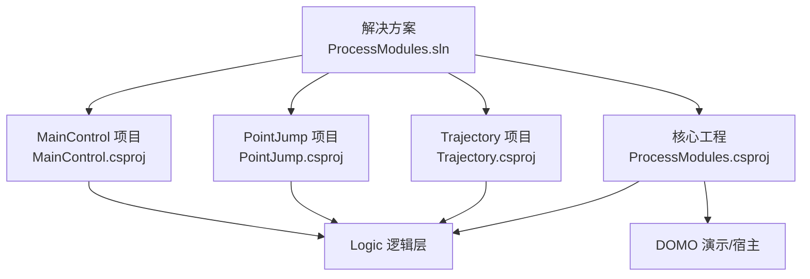
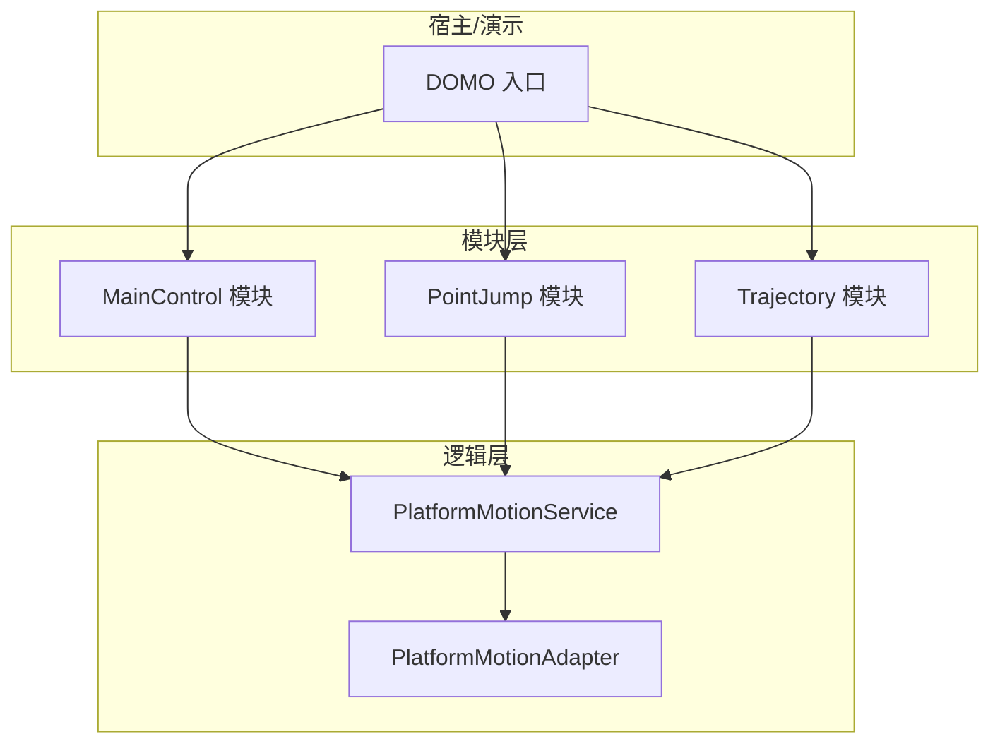
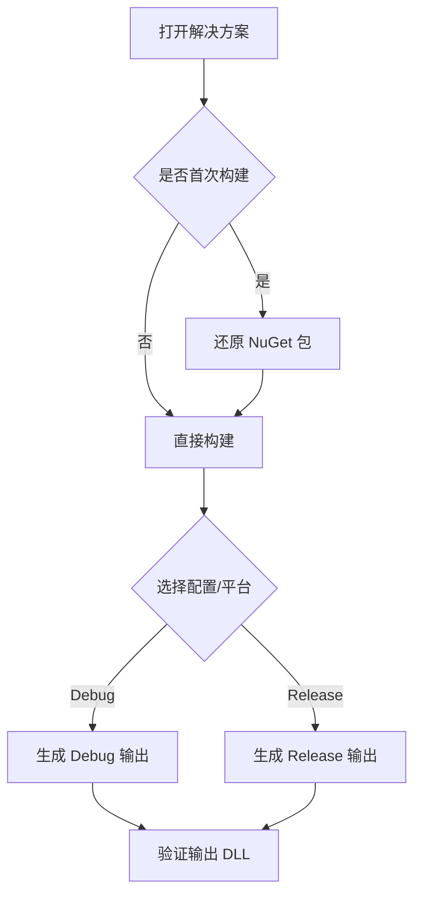
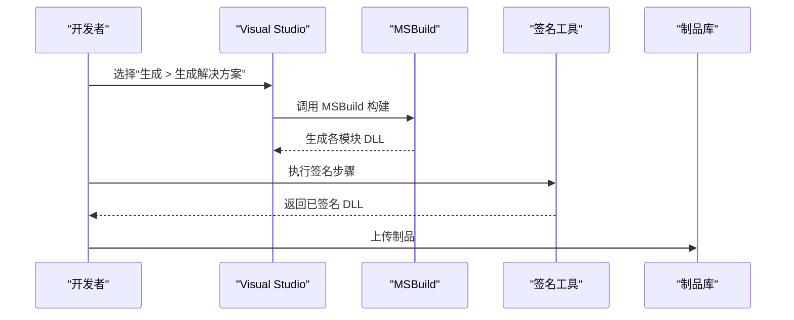
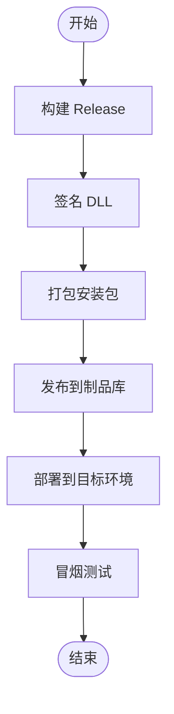
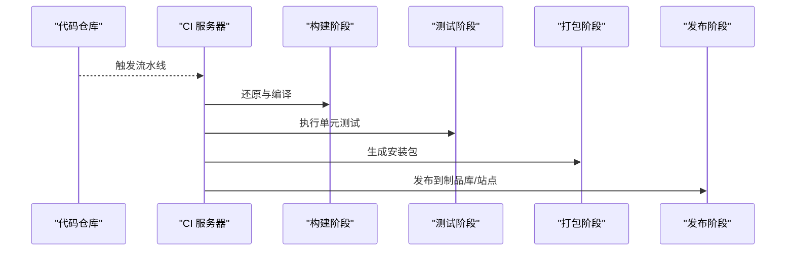
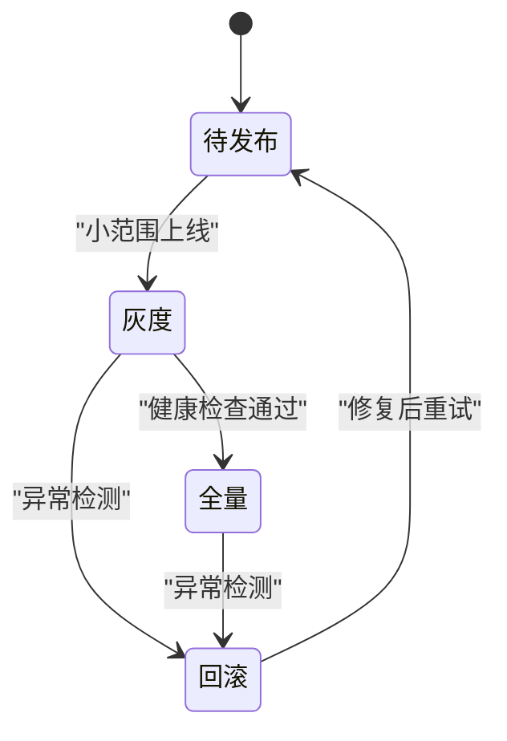
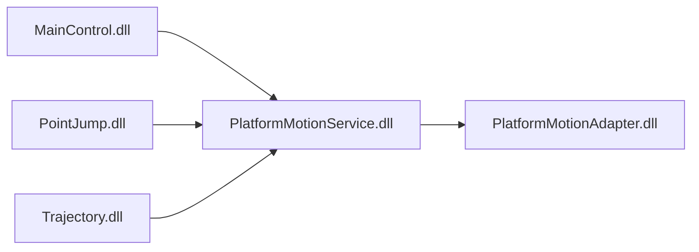

# 构建与部署

<cite>
**本文引用的文件**   
- [ProcessModules.sln](file://ProcessModules.sln)
- [ProcessModules.csproj](file://ProcessModules.csproj)
- [MainControl/MainControl.csproj](file://MainControl/MainControl.csproj)
- [PointJump/PointJump.csproj](file://PointJump/PointJump.csproj)
- [Trajectory/Trajectory.csproj](file://Trajectory/Trajectory.csproj)
- [MainControl/MainControlProcessModule.cs](file://MainControl/MainControlProcessModule.cs)
- [PointJump/PointJumpProcessModule.cs](file://PointJump/PointJumpProcessModule.cs)
- [Trajectory/TrajectoryViewProcessModule.cs](file://Trajectory/TrajectoryViewProcessModule.cs)
- [Logic/PlatformMotionService.cs](file://Logic/PlatformMotionService.cs)
- [Logic/PlatformMotionAdapter.cs](file://Logic/PlatformMotionAdapter.cs)
- [DOMO/DOMO.CS](file://DOMO/DOMO.CS)
- [DOMO/MAINMODUO.CS](file://DOMO/MAINMODUO.CS)
- [Properties/AssemblyInfo.cs](file://Properties/AssemblyInfo.cs)
- [独立 DLL 构建说明.md](file://独立 DLL 构建说明.md)
- [README.md](file://README.md)
</cite>

## 目录
1. [简介](#简介)
2. [项目结构](#项目结构)
3. [核心组件](#核心组件)
4. [架构总览](#架构总览)
5. [详细组件分析](#详细组件分析)
6. [依赖分析](#依赖分析)
7. [性能考虑](#性能考虑)
8. [故障排查指南](#故障排查指南)
9. [结论](#结论)
10. [附录](#附录)

## 简介
本指南面向 ProcessModules 框架的构建与部署，覆盖开发环境搭建、解决方案配置、独立 DLL 构建、打包发布、CI/CD 流水线集成、部署策略以及生产监控与排障。目标是帮助开发者在本地与持续集成环境中稳定地编译、签名、打包并分发各模块 DLL，确保版本兼容与可回滚能力。

## 项目结构
- 解决方案层：包含主解决方案与多个功能模块（MainControl、PointJump、Trajectory）。
- 逻辑层：运动控制与平台适配相关代码，供各模块复用。
- DOMO 层：演示或宿主入口相关代码。
- 资源与属性：程序集元数据、资源文件等。

**图表来源** 
- [ProcessModules.sln](file://ProcessModules.sln)
- [ProcessModules.csproj](file://ProcessModules.csproj)
- [MainControl/MainControl.csproj](file://MainControl/MainControl.csproj)
- [PointJump/PointJump.csproj](file://PointJump/PointJump.csproj)
- [Trajectory/Trajectory.csproj](file://Trajectory/Trajectory.csproj)

**章节来源**
- [ProcessModules.sln](file://ProcessModules.sln)
- [ProcessModules.csproj](file://ProcessModules.csproj)

## 核心组件
- 进程模块基类与实现：各功能模块通过继承统一基类暴露生命周期与运行接口，便于宿主动态加载。
- 平台运动服务：提供统一的运动控制抽象与适配器模式，屏蔽底层差异。
- 演示/宿主入口：用于本地调试与演示加载流程。

关键要点
- 模块 DLL 需遵循命名约定与导出规范，以便宿主按约定发现与实例化。
- 版本信息集中管理于程序集属性文件，便于自动化注入。

**章节来源**
- [MainControl/MainControlProcessModule.cs](file://MainControl/MainControlProcessModule.cs)
- [PointJump/PointJumpProcessModule.cs](file://PointJump/PointJumpProcessModule.cs)
- [Trajectory/TrajectoryViewProcessModule.cs](file://Trajectory/TrajectoryViewProcessModule.cs)
- [Logic/PlatformMotionService.cs](file://Logic/PlatformMotionService.cs)
- [Logic/PlatformMotionAdapter.cs](file://Logic/PlatformMotionAdapter.cs)
- [DOMO/DOMO.CS](file://DOMO/DOMO.CS)
- [DOMO/MAINMODUO.CS](file://DOMO/MAINMODUO.CS)

## 架构总览
下图展示了解决方案中各项目的职责与依赖关系，以及模块与逻辑层的交互方式。

**图表来源** 
- [DOMO/DOMO.CS](file://DOMO/DOMO.CS)
- [DOMO/MAINMODUO.CS](file://DOMO/MAINMODUO.CS)
- [MainControl/MainControlProcessModule.cs](file://MainControl/MainControlProcessModule.cs)
- [PointJump/PointJumpProcessModule.cs](file://PointJump/PointJumpProcessModule.cs)
- [Trajectory/TrajectoryViewProcessModule.cs](file://Trajectory/TrajectoryViewProcessModule.cs)
- [Logic/PlatformMotionService.cs](file://Logic/PlatformMotionService.cs)
- [Logic/PlatformMotionAdapter.cs](file://Logic/PlatformMotionAdapter.cs)

## 详细组件分析

### 解决方案与项目引用
- 解决方案文件定义所有子项目及其依赖关系。
- 各项目 .csproj 指定目标框架、输出类型、引用与生成事件。
- 建议将公共依赖收敛到核心工程，避免重复引用。

**图表来源** 
- [ProcessModules.sln](file://ProcessModules.sln)
- [ProcessModules.csproj](file://ProcessModules.csproj)
- [MainControl/MainControl.csproj](file://MainControl/MainControl.csproj)
- [PointJump/PointJump.csproj](file://PointJump/PointJump.csproj)
- [Trajectory/Trajectory.csproj](file://Trajectory/Trajectory.csproj)

**章节来源**
- [ProcessModules.sln](file://ProcessModules.sln)
- [ProcessModules.csproj](file://ProcessModules.csproj)
- [MainControl/MainControl.csproj](file://MainControl/MainControl.csproj)
- [PointJump/PointJump.csproj](file://PointJump/PointJump.csproj)
- [Trajectory/Trajectory.csproj](file://Trajectory/Trajectory.csproj)

### 独立 DLL 构建流程
- 构建目标：为每个模块生成独立的 DLL，便于宿主按需加载。
- 编译选项：区分 Debug/Release，启用优化与符号文件。
- 签名配置：使用强名称或代码签名证书对 DLL 进行签名。
- 版本管理：通过程序集属性或 MSBuild 变量注入版本号。

**图表来源** 
- [独立 DLL 构建说明.md](file://独立 DLL 构建说明.md)
- [Properties/AssemblyInfo.cs](file://Properties/AssemblyInfo.cs)

**章节来源**
- [独立 DLL 构建说明.md](file://独立 DLL 构建说明.md)
- [Properties/AssemblyInfo.cs](file://Properties/AssemblyInfo.cs)

### 打包与发布
- 安装包制作：将模块 DLL、依赖库与配置文件打包为安装器。
- 部署脚本：提供一键部署脚本，支持增量更新与回滚。
- 自动化构建：在 CI 中自动执行构建、签名、打包与发布。

[无图表来源，因为该图为概念性流程]

### CI/CD 流水线（GitHub Actions / Azure DevOps / Jenkins）
- GitHub Actions：使用 .NET CLI 构建、签名、打包，推送至 GitHub Releases。
- Azure DevOps：使用 .NET 任务构建，NuGet/Publish 任务发布。
- Jenkins：使用 Pipeline 脚本编排构建、测试、打包与部署阶段。

[无图表来源，因为该图为概念性流程]

### 部署策略
- 增量更新：仅替换变更的 DLL，减少停机时间。
- 回滚机制：保留上一版本，失败时快速回滚。
- 灰度发布：先对小范围用户开放新版本，观察稳定性后全量发布。

[无图表来源，因为该图为概念性流程]

## 依赖分析
- 模块间依赖：各模块依赖 Logic 层提供的运动服务与适配器。
- 外部依赖：第三方库通过 NuGet 或本地引用管理。
- 版本兼容性：保持向后兼容，避免破坏性变更；必要时提供多版本共存。

**图表来源** 
- [MainControl/MainControlProcessModule.cs](file://MainControl/MainControlProcessModule.cs)
- [PointJump/PointJumpProcessModule.cs](file://PointJump/PointJumpProcessModule.cs)
- [Trajectory/TrajectoryViewProcessModule.cs](file://Trajectory/TrajectoryViewProcessModule.cs)
- [Logic/PlatformMotionService.cs](file://Logic/PlatformMotionService.cs)
- [Logic/PlatformMotionAdapter.cs](file://Logic/PlatformMotionAdapter.cs)

**章节来源**
- [Logic/PlatformMotionService.cs](file://Logic/PlatformMotionService.cs)
- [Logic/PlatformMotionAdapter.cs](file://Logic/PlatformMotionAdapter.cs)

## 性能考虑
- 构建优化：并行构建、增量构建、禁用不必要的日志。
- 运行时优化：延迟加载模块、缓存常用对象、避免频繁 GC。
- 资源管理：合理拆分资源文件，按需加载。

[本节为通用指导，不直接分析具体文件]

## 故障排查指南
常见问题与定位方法
- 无法解析依赖：检查 NuGet 包还原与引用路径。
- 签名失败：确认证书有效性与权限。
- 运行时找不到模块：核对 DLL 输出目录与宿主加载路径。
- 版本冲突：使用绑定重定向或隔离加载域。

建议的日志与监控
- 应用日志：记录关键生命周期与错误堆栈。
- 系统指标：CPU、内存、I/O 监控。
- 告警规则：基于错误率与响应时间阈值。

**章节来源**
- [README.md](file://README.md)

## 结论
通过规范的构建与部署流程、清晰的依赖管理与稳定的 CI/CD 流水线，ProcessModules 框架可实现高质量的模块化交付。配合完善的监控与回滚策略，可在生产环境中保障系统的可用性与可维护性。

## 附录
- 开发环境要求
  - .NET Framework 版本：根据项目目标框架选择对应 SDK/运行时。
  - Visual Studio：建议使用最新稳定版，启用 .NET 桌面开发工作负载。
  - 依赖库：通过 NuGet 或本地包源安装。
- 构建命令参考
  - 使用 MSBuild 或 dotnet CLI 进行构建与打包。
- 版本兼容性策略
  - 语义化版本控制，保持 API 向后兼容。
  - 提供迁移指南与弃用警告。

**章节来源**
- [README.md](file://README.md)
- [独立 DLL 构建说明.md](file://独立 DLL 构建说明.md)