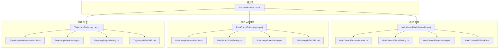
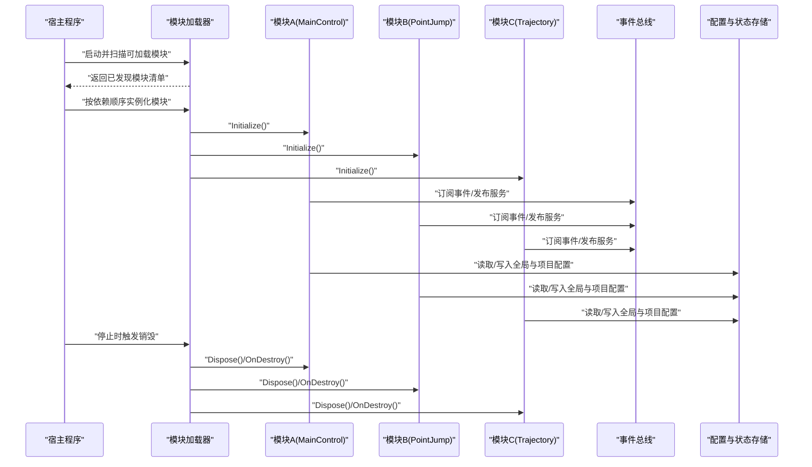
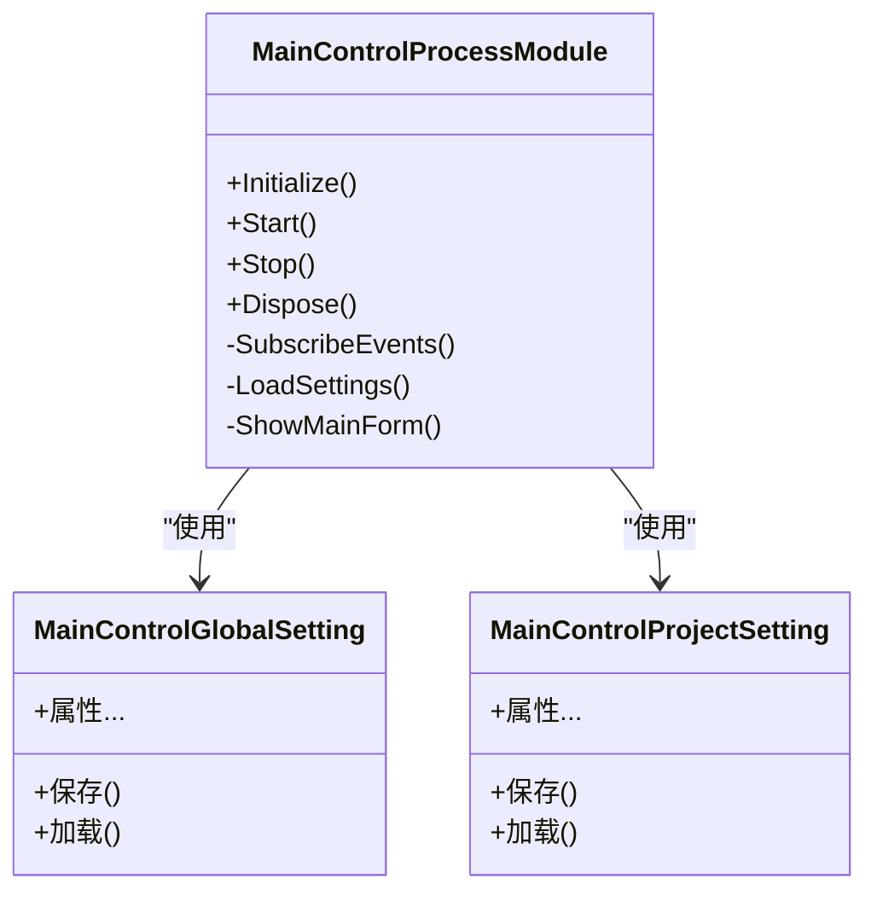
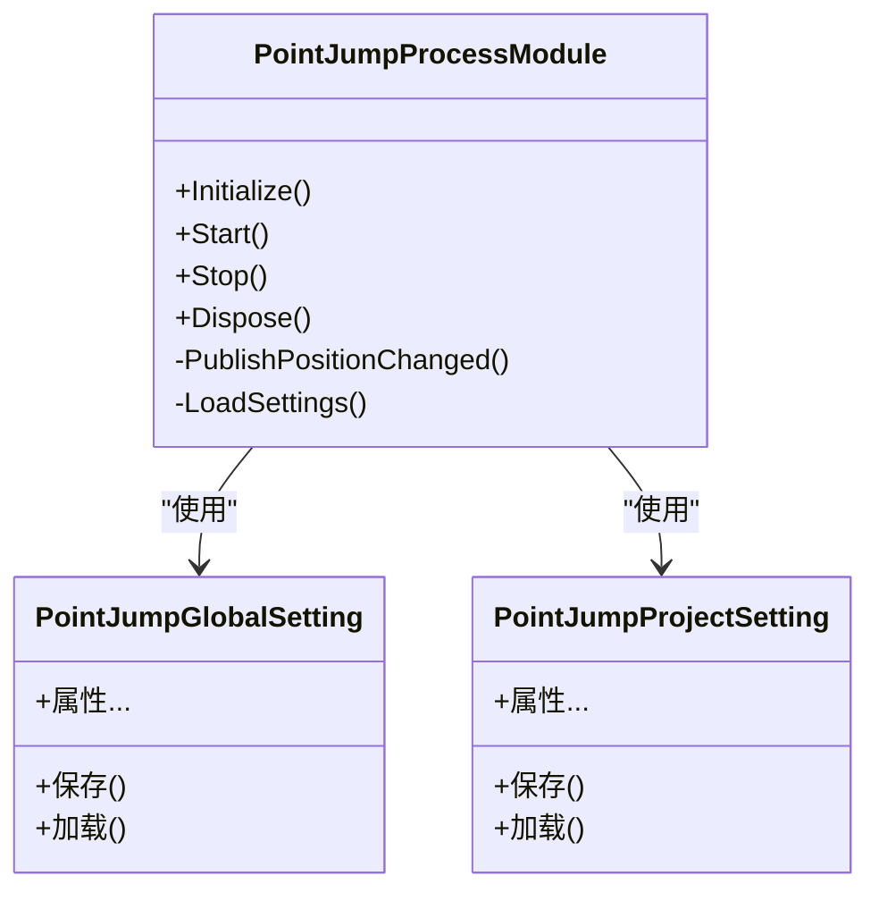
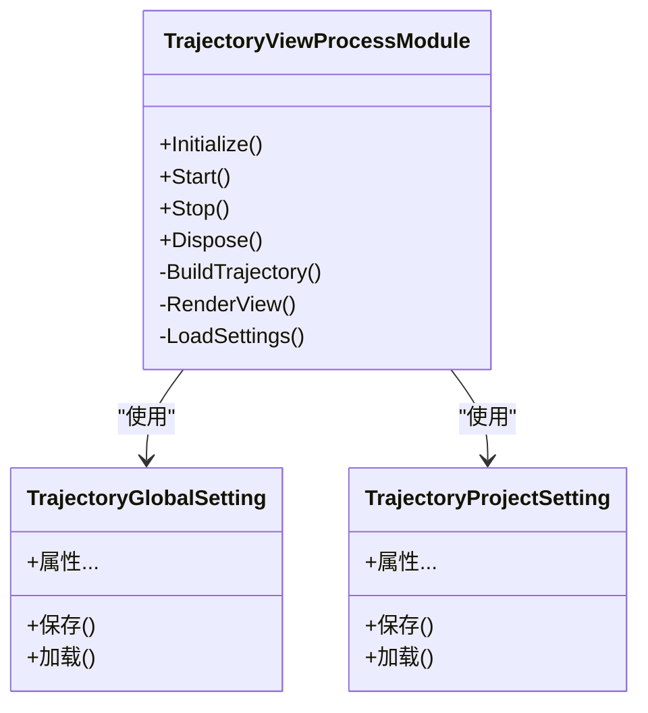
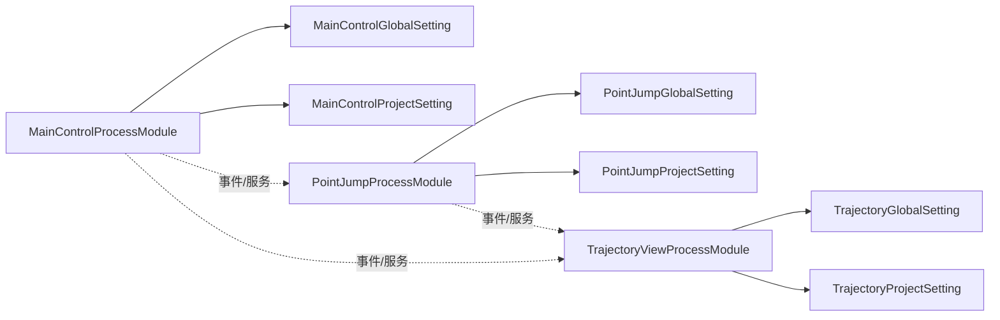

# 模块开发

<cite>
**本文引用的文件**   
- [ProcessModules.csproj](file://ProcessModules.csproj)
- [MainControl/MainControlProcessModule.cs](file://MainControl/MainControlProcessModule.cs)
- [PointJump/PointJumpProcessModule.cs](file://PointJump/PointJumpProcessModule.cs)
- [Trajectory/TrajectoryViewProcessModule.cs](file://Trajectory/TrajectoryViewProcessModule.cs)
- [MainControl/MainControlGlobalSetting.cs](file://MainControl/MainControlGlobalSetting.cs)
- [PointJump/PointJumpGlobalSetting.cs](file://PointJump/PointJumpGlobalSetting.cs)
- [Trajectory/TrajectoryGlobalSetting.cs](file://Trajectory/TrajectoryGlobalSetting.cs)
- [MainControl/MainControlProjectSetting.cs](file://MainControl/MainControlProjectSetting.cs)
- [PointJump/PointJumpProjectSetting.cs](file://PointJump/PointJumpProjectSetting.cs)
- [Trajectory/TrajectoryProjectSetting.cs](file://Trajectory/TrajectoryProjectSetting.cs)
- [MainControl/README.md](file://MainControl/README.md)
- [PointJump/README.md](file://PointJump/README.md)
- [Trajectory/README.md](file://Trajectory/README.md)
- [基类调整说明.md](file://基类调整说明.md)
- [独立 DLL 构建说明.md](file://独立 DLL 构建说明.md)
- [重构完成报告.md](file://重构完成报告.md)
</cite>

## 目录
1. [简介](#简介)
2. [项目结构](#项目结构)
3. [核心组件](#核心组件)
4. [架构总览](#架构总览)
5. [详细组件分析](#详细组件分析)
6. [依赖分析](#依赖分析)
7. [性能考虑](#性能考虑)
8. [故障排查指南](#故障排查指南)
9. [结论](#结论)
10. [附录](#附录)

## 简介
本指南面向希望基于 ProcessModules 框架进行进程模块开发的工程师，系统阐述如何继承 ProcessModuleBaseEx 基类创建新模块，涵盖模块生命周期管理、初始化流程、事件处理与资源清理；解释模块注册机制与依赖注入模式；提供从新建模块到集成主程序的完整流程示例；总结模块间通信（事件总线、消息传递、服务发现）最佳实践；说明配置管理与状态持久化方法；并给出调试技巧、错误处理策略、性能优化建议以及测试方法与单元测试最佳实践。

## 项目结构
仓库采用“按功能域划分”的模块化组织方式：每个业务模块以独立子项目存在（如 MainControl、PointJump、Trajectory），各自包含 UI、Logic、Resources、设置项与模块入口类。根目录包含解决方案与公共工程文件，便于统一构建与发布。

图表来源
- [ProcessModules.csproj](file://ProcessModules.csproj)
- [MainControl/MainControlProcessModule.cs](file://MainControl/MainControlProcessModule.cs)
- [PointJump/PointJumpProcessModule.cs](file://PointJump/PointJumpProcessModule.cs)
- [Trajectory/TrajectoryViewProcessModule.cs](file://Trajectory/TrajectoryViewProcessModule.cs)

章节来源
- [ProcessModules.csproj](file://ProcessModules.csproj)
- [MainControl/README.md](file://MainControl/README.md)
- [PointJump/README.md](file://PointJump/README.md)
- [Trajectory/README.md](file://Trajectory/README.md)

## 核心组件
- 模块基类 ProcessModuleBaseEx：定义模块生命周期钩子、初始化顺序、事件订阅与释放资源的约定。
- 各业务模块入口类：继承自 ProcessModuleBaseEx，实现具体业务逻辑与 UI 集成。
- 全局与项目级设置：通过 GlobalSetting 与 ProjectSetting 两类配置对象分别承载跨模块共享配置与模块私有配置。

章节来源
- [基类调整说明.md](file://基类调整说明.md)
- [MainControl/MainControlProcessModule.cs](file://MainControl/MainControlProcessModule.cs)
- [PointJump/PointJumpProcessModule.cs](file://PointJump/PointJumpProcessModule.cs)
- [Trajectory/TrajectoryViewProcessModule.cs](file://Trajectory/TrajectoryViewProcessModule.cs)
- [MainControl/MainControlGlobalSetting.cs](file://MainControl/MainControlGlobalSetting.cs)
- [PointJump/PointJumpGlobalSetting.cs](file://PointJump/PointJumpGlobalSetting.cs)
- [Trajectory/TrajectoryGlobalSetting.cs](file://Trajectory/TrajectoryGlobalSetting.cs)
- [MainControl/MainControlProjectSetting.cs](file://MainControl/MainControlProjectSetting.cs)
- [PointJump/PointJumpProjectSetting.cs](file://PointJump/PointJumpProjectSetting.cs)
- [Trajectory/TrajectoryProjectSetting.cs](file://Trajectory/TrajectoryProjectSetting.cs)

## 架构总览
下图展示了模块在运行时的典型交互关系：宿主加载模块、模块初始化、事件总线分发、服务发现与调用、配置读写与状态持久化。

图表来源
- [MainControl/MainControlProcessModule.cs](file://MainControl/MainControlProcessModule.cs)
- [PointJump/PointJumpProcessModule.cs](file://PointJump/PointJumpProcessModule.cs)
- [Trajectory/TrajectoryViewProcessModule.cs](file://Trajectory/TrajectoryViewProcessModule.cs)
- [MainControl/MainControlGlobalSetting.cs](file://MainControl/MainControlGlobalSetting.cs)
- [PointJump/PointJumpGlobalSetting.cs](file://PointJump/PointJumpGlobalSetting.cs)
- [Trajectory/TrajectoryGlobalSetting.cs](file://Trajectory/TrajectoryGlobalSetting.cs)

## 详细组件分析

### 模块基类与生命周期
- 生命周期阶段
  - 构造：仅做轻量初始化，避免阻塞。
  - Initialize：执行依赖解析、UI 挂载、事件订阅、资源预热。
  - Start：进入运行态，开始响应外部事件或定时任务。
  - Stop：暂停运行态，释放非关键资源，保留必要状态。
  - Dispose/OnDestroy：彻底释放资源，取消订阅，关闭句柄。
- 设计要点
  - 所有异步操作需在 Initialize/Start 中安全调度，确保线程模型一致。
  - 异常应在钩子内捕获并上报，保证其他模块不受影响。
  - 资源释放遵循“谁申请、谁释放”的原则，避免重复释放。

章节来源
- [基类调整说明.md](file://基类调整说明.md)

### 模块 A：MainControl（主控）
- 职责：作为主控界面与协调者，负责与其他模块协作、展示全局状态、管理用户交互。
- 初始化：加载全局设置、注册事件处理器、挂载主窗体控件。
- 事件：订阅来自其他模块的状态变更，驱动 UI 刷新。
- 配置：读写 MainControlGlobalSetting 与 MainControlProjectSetting。
- 资源：在销毁时卸载 UI、取消订阅、释放非托管资源。

图表来源
- [MainControl/MainControlProcessModule.cs](file://MainControl/MainControlProcessModule.cs)
- [MainControl/MainControlGlobalSetting.cs](file://MainControl/MainControlGlobalSetting.cs)
- [MainControl/MainControlProjectSetting.cs](file://MainControl/MainControlProjectSetting.cs)

章节来源
- [MainControl/MainControlProcessModule.cs](file://MainControl/MainControlProcessModule.cs)
- [MainControl/MainControlGlobalSetting.cs](file://MainControl/MainControlGlobalSetting.cs)
- [MainControl/MainControlProjectSetting.cs](file://MainControl/MainControlProjectSetting.cs)
- [MainControl/README.md](file://MainControl/README.md)

### 模块 B：PointJump（点位跳转）
- 职责：提供点位选择、跳转与校验能力，向主控反馈当前目标点位。
- 初始化：加载 PointJumpGlobalSetting 与 PointJumpProjectSetting，建立点位缓存。
- 事件：发布“点位变更”事件，订阅“运动控制”指令。
- 配置：读写模块私有设置与项目级设置。
- 资源：销毁时清空缓存、释放 IO 句柄。

图表来源
- [PointJump/PointJumpProcessModule.cs](file://PointJump/PointJumpProcessModule.cs)
- [PointJump/PointJumpGlobalSetting.cs](file://PointJump/PointJumpGlobalSetting.cs)
- [PointJump/PointJumpProjectSetting.cs](file://PointJump/PointJumpProjectSetting.cs)

章节来源
- [PointJump/PointJumpProcessModule.cs](file://PointJump/PointJumpProcessModule.cs)
- [PointJump/PointJumpGlobalSetting.cs](file://PointJump/PointJumpGlobalSetting.cs)
- [PointJump/PointJumpProjectSetting.cs](file://PointJump/PointJumpProjectSetting.cs)
- [PointJump/README.md](file://PointJump/README.md)

### 模块 C：Trajectory（轨迹）
- 职责：轨迹规划与可视化，接收点位序列并生成轨迹数据。
- 初始化：加载 TrajectoryGlobalSetting 与 TrajectoryProjectSetting，初始化视图与算法引擎。
- 事件：订阅“点位变更”，发布“轨迹就绪”事件。
- 配置：读写模块私有设置与项目级设置。
- 资源：销毁时释放图形上下文与计算资源。

图表来源
- [Trajectory/TrajectoryViewProcessModule.cs](file://Trajectory/TrajectoryViewProcessModule.cs)
- [Trajectory/TrajectoryGlobalSetting.cs](file://Trajectory/TrajectoryGlobalSetting.cs)
- [Trajectory/TrajectoryProjectSetting.cs](file://Trajectory/TrajectoryProjectSetting.cs)

章节来源
- [Trajectory/TrajectoryViewProcessModule.cs](file://Trajectory/TrajectoryViewProcessModule.cs)
- [Trajectory/TrajectoryGlobalSetting.cs](file://Trajectory/TrajectoryGlobalSetting.cs)
- [Trajectory/TrajectoryProjectSetting.cs](file://Trajectory/TrajectoryProjectSetting.cs)
- [Trajectory/README.md](file://Trajectory/README.md)

### 模块间通信最佳实践
- 事件总线
  - 使用强类型事件，避免字符串键带来的耦合。
  - 在 Initialize 中订阅，在 Dispose/OnDestroy 中取消订阅，防止内存泄漏。
- 消息传递
  - 对需要确认的消息采用请求-应答模式，设置超时与重试策略。
  - 对高频消息采用批处理与节流，降低总线压力。
- 服务发现
  - 通过容器或服务定位器暴露接口，模块按需获取，避免硬编码依赖。
  - 为服务提供健康检查与降级路径，提升鲁棒性。

章节来源
- [MainControl/MainControlProcessModule.cs](file://MainControl/MainControlProcessModule.cs)
- [PointJump/PointJumpProcessModule.cs](file://PointJump/PointJumpProcessModule.cs)
- [Trajectory/TrajectoryViewProcessModule.cs](file://Trajectory/TrajectoryViewProcessModule.cs)

### 配置管理与状态持久化
- 全局设置（GlobalSetting）
  - 适用于跨模块共享的配置，如路径、默认参数、主题等。
  - 提供加载与保存方法，支持热更新与版本迁移。
- 项目设置（ProjectSetting）
  - 适用于模块私有配置，如窗口布局、最近使用的点位列表等。
  - 与项目文件关联，随项目一起保存与恢复。
- 持久化策略
  - 优先使用 JSON/XML 等文本格式，便于版本管理与人工编辑。
  - 对敏感信息加密存储，并提供密钥轮换方案。
  - 读写失败时回退到默认值，并记录诊断日志。

章节来源
- [MainControl/MainControlGlobalSetting.cs](file://MainControl/MainControlGlobalSetting.cs)
- [PointJump/PointJumpGlobalSetting.cs](file://PointJump/PointJumpGlobalSetting.cs)
- [Trajectory/TrajectoryGlobalSetting.cs](file://Trajectory/TrajectoryGlobalSetting.cs)
- [MainControl/MainControlProjectSetting.cs](file://MainControl/MainControlProjectSetting.cs)
- [PointJump/PointJumpProjectSetting.cs](file://PointJump/PointJumpProjectSetting.cs)
- [Trajectory/TrajectoryProjectSetting.cs](file://Trajectory/TrajectoryProjectSetting.cs)

### 从创建新模块到集成主程序的完整流程
- 步骤概览
  - 新建模块项目，引用 ProcessModules 基础库。
  - 新建模块入口类，继承 ProcessModuleBaseEx，实现生命周期钩子。
  - 定义 GlobalSetting 与 ProjectSetting，提供加载/保存方法。
  - 在 Initialize 中订阅事件、注册服务、加载配置。
  - 在 Start/Stop 中启停业务逻辑与后台任务。
  - 在 Dispose/OnDestroy 中释放资源、取消订阅。
  - 将模块加入宿主项目的模块清单，确保按依赖顺序加载。
  - 运行宿主程序，验证模块初始化、事件通信与配置持久化。
- 参考实现
  - 可参考 MainControl、PointJump、Trajectory 三个模块的实现方式与目录结构。

章节来源
- [MainControl/MainControlProcessModule.cs](file://MainControl/MainControlProcessModule.cs)
- [PointJump/PointJumpProcessModule.cs](file://PointJump/PointJumpProcessModule.cs)
- [Trajectory/TrajectoryViewProcessModule.cs](file://Trajectory/TrajectoryViewProcessModule.cs)
- [MainControl/README.md](file://MainControl/README.md)
- [PointJump/README.md](file://PointJump/README.md)
- [Trajectory/README.md](file://Trajectory/README.md)

## 依赖分析
- 模块内依赖
  - 模块入口类依赖其 GlobalSetting 与 ProjectSetting。
  - UI 与 Logic 层通过清晰接口解耦，避免循环依赖。
- 模块间依赖
  - 通过事件总线与服务接口进行松耦合通信。
  - 避免直接引用其他模块的具体实现，保持可替换性。
- 构建与发布
  - 每个模块可独立构建为 DLL，便于插件式扩展。
  - 宿主程序通过反射或清单发现模块，动态加载。

图表来源
- [MainControl/MainControlProcessModule.cs](file://MainControl/MainControlProcessModule.cs)
- [PointJump/PointJumpProcessModule.cs](file://PointJump/PointJumpProcessModule.cs)
- [Trajectory/TrajectoryViewProcessModule.cs](file://Trajectory/TrajectoryViewProcessModule.cs)
- [MainControl/MainControlGlobalSetting.cs](file://MainControl/MainControlGlobalSetting.cs)
- [PointJump/PointJumpGlobalSetting.cs](file://PointJump/PointJumpGlobalSetting.cs)
- [Trajectory/TrajectoryGlobalSetting.cs](file://Trajectory/TrajectoryGlobalSetting.cs)
- [MainControl/MainControlProjectSetting.cs](file://MainControl/MainControlProjectSetting.cs)
- [PointJump/PointJumpProjectSetting.cs](file://PointJump/PointJumpProjectSetting.cs)
- [Trajectory/TrajectoryProjectSetting.cs](file://Trajectory/TrajectoryProjectSetting.cs)

章节来源
- [独立 DLL 构建说明.md](file://独立 DLL 构建说明.md)
- [重构完成报告.md](file://重构完成报告.md)

## 性能考虑
- 初始化优化
  - 延迟加载重型资源，仅在首次使用时初始化。
  - 批量订阅事件，减少回调开销。
- 运行时优化
  - 使用线程池与异步 I/O，避免阻塞 UI 线程。
  - 对高频事件进行合并与节流，降低处理频率。
- 资源管理
  - 及时释放非托管资源，避免内存碎片。
  - 使用对象池复用频繁创建的对象。
- 监控与诊断
  - 埋点关键指标（初始化耗时、事件处理耗时、内存占用）。
  - 定期输出性能快照，便于问题定位。

[本节为通用指导，不直接分析具体文件]

## 故障排查指南
- 常见问题
  - 模块未加载：检查模块清单与依赖声明，确认 DLL 路径正确。
  - 初始化失败：查看 Initialize 中的异常堆栈，确认配置与资源可用。
  - 事件未触发：核对订阅与发布是否在同一事件源，检查线程上下文。
  - 配置丢失：检查配置文件权限与路径，确认序列化版本兼容。
- 调试技巧
  - 启用详细日志，记录关键生命周期节点与异常。
  - 使用断点与条件断点快速定位问题。
  - 隔离模块单独运行，排除宿主环境干扰。
- 错误处理策略
  - 在钩子内捕获异常并上报，避免传播至宿主。
  - 提供降级路径与默认行为，保证系统可用性。
  - 对不可恢复错误，优雅退出并提示用户。

章节来源
- [基类调整说明.md](file://基类调整说明.md)
- [MainControl/MainControlProcessModule.cs](file://MainControl/MainControlProcessModule.cs)
- [PointJump/PointJumpProcessModule.cs](file://PointJump/PointJumpProcessModule.cs)
- [Trajectory/TrajectoryViewProcessModule.cs](file://Trajectory/TrajectoryViewProcessModule.cs)

## 结论
通过继承 ProcessModuleBaseEx 并遵循生命周期约定、事件总线与服务发现模式，开发者可以高效地构建可插拔、易维护的进程模块。结合清晰的配置管理与状态持久化策略，模块能够在复杂系统中稳定运行。配合完善的调试、错误处理与性能优化手段，能够显著提升开发与运维效率。

[本节为总结性内容，不直接分析具体文件]

## 附录
- 术语表
  - 模块：具备独立职责的可插拔单元，通常对应一个 DLL 或项目。
  - 事件总线：模块间松耦合通信的基础设施。
  - 服务发现：运行时查找与获取可用服务的机制。
  - 配置持久化：将配置与状态保存到磁盘或远程存储的过程。
- 参考文档
  - 各模块 README 提供了模块用途与使用示例。
  - 基类调整说明与重构报告有助于理解框架演进与设计取舍。

章节来源
- [MainControl/README.md](file://MainControl/README.md)
- [PointJump/README.md](file://PointJump/README.md)
- [Trajectory/README.md](file://Trajectory/README.md)
- [基类调整说明.md](file://基类调整说明.md)
- [重构完成报告.md](file://重构完成报告.md)