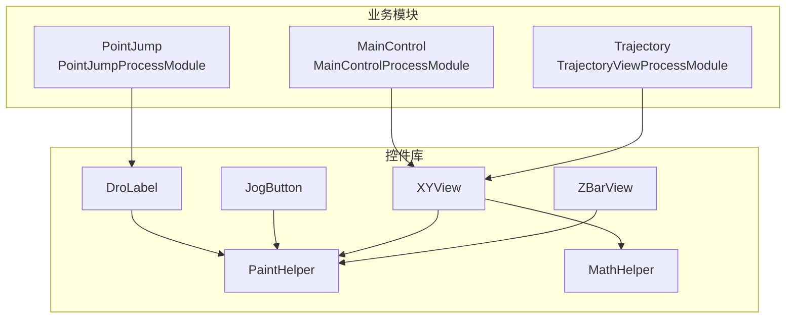
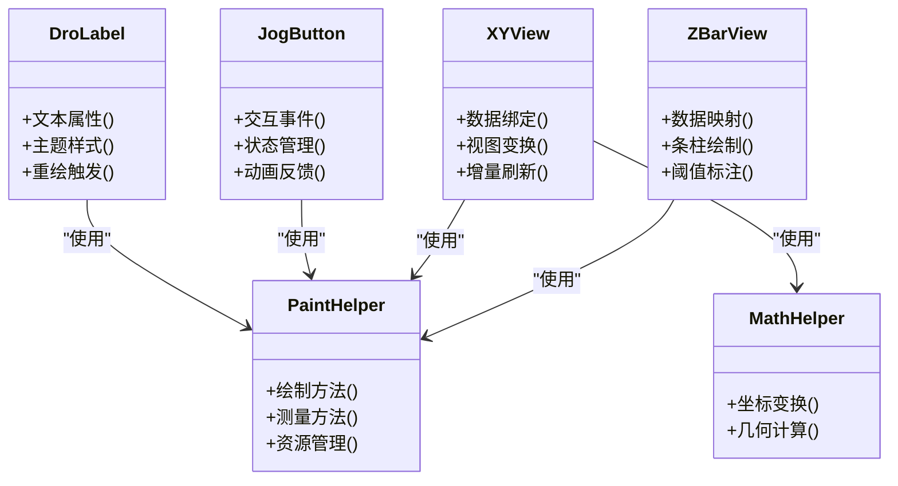
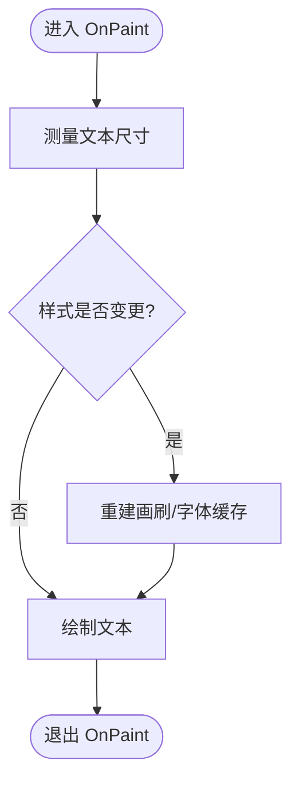
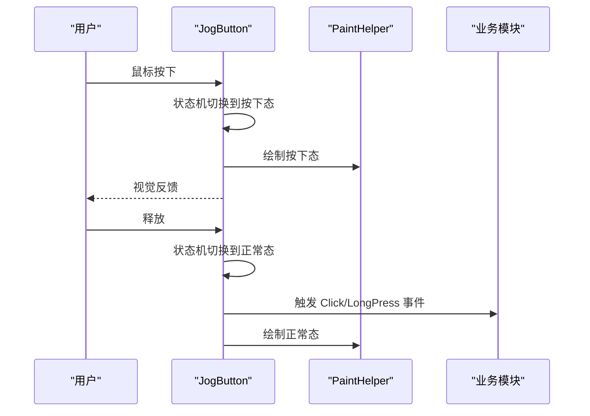
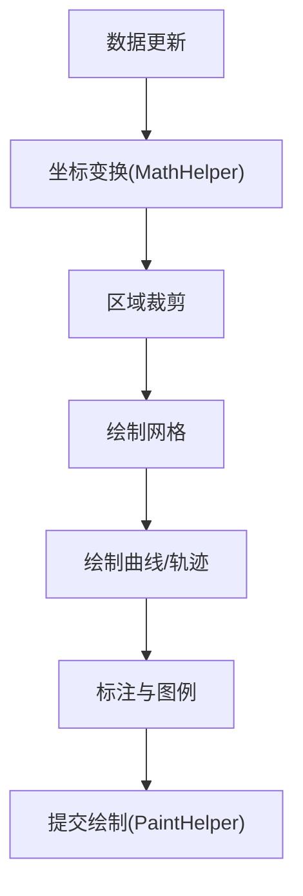
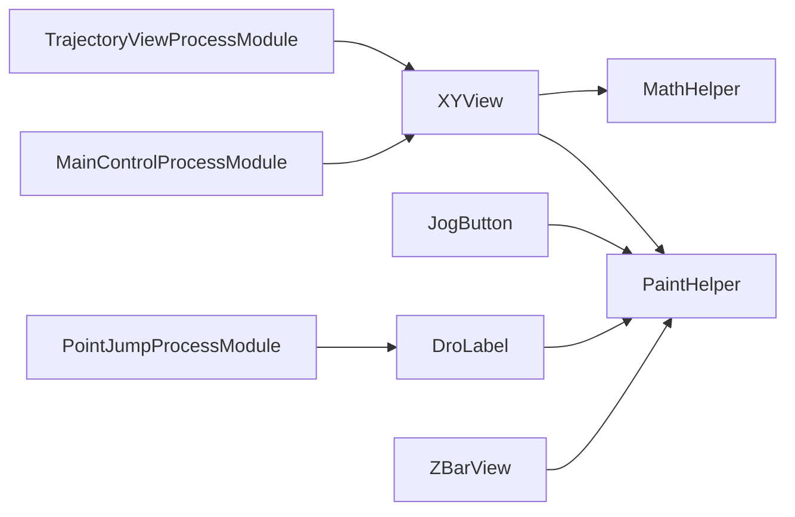

# 自定义控件开发

<cite>
**本文档引用的文件**   
- [Controls/DroLabel.cs](file://Controls/DroLabel.cs)
- [Controls/JogButton.cs](file://Controls/JogButton.cs)
- [Controls/XYView.cs](file://Controls/XYView.cs)
- [Controls/PaintHelper.cs](file://Controls/PaintHelper.cs)
- [Controls/MathHelper.cs](file://Controls/MathHelper.cs)
- [Controls/ZBarView.cs](file://Controls/ZBarView.cs)
- [MainControl/MainControlProcessModule.cs](file://MainControl/MainControlProcessModule.cs)
- [MainControl/RunForm.cs](file://MainControl/RunForm.cs)
- [PointJump/PointJumpProcessModule.cs](file://PointJump/PointJumpProcessModule.cs)
- [Trajectory/TrajectoryViewProcessModule.cs](file://Trajectory/TrajectoryViewProcessModule.cs)
- [ProcessModules.csproj](file://ProcessModules.csproj)
</cite>

## 目录
1. [简介](#简介)
2. [项目结构](#项目结构)
3. [核心组件](#核心组件)
4. [架构总览](#架构总览)
5. [详细组件分析](#详细组件分析)
6. [依赖关系分析](#依赖关系分析)
7. [性能考虑](#性能考虑)
8. [故障排查指南](#故障排查指南)
9. [结论](#结论)
10. [附录](#附录)

## 简介
本指南面向在 ProcessModules 框架中开发自定义控件的工程师，目标是帮助你基于现有基础控件与绘图工具快速构建高性能、可复用、易维护的 UI 组件。文档覆盖：
- 继承基础控件类创建自定义 UI 组件的方法
- 控件生命周期、属性绑定与事件处理机制
- 绘图系统实现（PaintHelper 工具类）与自定义绘制逻辑
- 现有控件 DroLabel、JogButton、XYView 的实现分析与使用示例
- 数据绑定、样式定制与响应式设计模式
- 性能优化、内存管理与渲染效率提升技巧
- 控件测试方法与可视化调试工具使用指南
- WPF 与 WinForms 兼容性考虑及跨平台适配方案

## 项目结构
本项目采用按功能域组织的方式，控件集中在 Controls 目录；业务模块通过 ProcessModule 基类扩展，将 UI 与逻辑解耦。关键目录与职责：
- Controls：通用控件与绘图工具（DroLabel、JogButton、XYView、ZBarView、PaintHelper、MathHelper）
- MainControl、PointJump、Trajectory：具体业务模块，展示如何集成与使用控件
- 根目录：解决方案与工程配置（ProcessModules.csproj）

图表来源
- [Controls/DroLabel.cs](file://Controls/DroLabel.cs)
- [Controls/JogButton.cs](file://Controls/JogButton.cs)
- [Controls/XYView.cs](file://Controls/XYView.cs)
- [Controls/PaintHelper.cs](file://Controls/PaintHelper.cs)
- [Controls/MathHelper.cs](file://Controls/MathHelper.cs)
- [Controls/ZBarView.cs](file://Controls/ZBarView.cs)
- [MainControl/MainControlProcessModule.cs](file://MainControl/MainControlProcessModule.cs)
- [PointJump/PointJumpProcessModule.cs](file://PointJump/PointJumpProcessModule.cs)
- [Trajectory/TrajectoryViewProcessModule.cs](file://Trajectory/TrajectoryViewProcessModule.cs)

章节来源
- [ProcessModules.csproj](file://ProcessModules.csproj)

## 核心组件
- DroLabel：显示动态数值的标签控件，支持文本格式化、颜色主题与尺寸自适应
- JogButton：点动控制按钮，封装点击/长按/双击等交互，提供状态反馈与动画
- XYView：二维视图控件，用于坐标轨迹、曲线或图形绘制，支持缩放、平移与刷新
- ZBarView：条形图控件，适合进度、阈值或统计展示
- PaintHelper：统一的绘图辅助类，封装画笔、画刷、路径、测量与抗锯齿设置
- MathHelper：数学与几何计算工具，如坐标变换、距离与角度计算

章节来源
- [Controls/DroLabel.cs](file://Controls/DroLabel.cs)
- [Controls/JogButton.cs](file://Controls/JogButton.cs)
- [Controls/XYView.cs](file://Controls/XYView.cs)
- [Controls/ZBarView.cs](file://Controls/ZBarView.cs)
- [Controls/PaintHelper.cs](file://Controls/PaintHelper.cs)
- [Controls/MathHelper.cs](file://Controls/MathHelper.cs)

## 架构总览
控件层通过 PaintHelper 统一绘制，业务模块通过 ProcessModule 注入数据与事件回调。整体遵循“UI 与逻辑分离”的原则：
- UI 层：控件负责呈现与交互
- 工具层：PaintHelper/MathHelper 提供绘制与计算能力
- 业务层：各模块 ProcessModule 管理数据源、命令与事件

图表来源
- [Controls/PaintHelper.cs](file://Controls/PaintHelper.cs)
- [Controls/MathHelper.cs](file://Controls/MathHelper.cs)
- [Controls/DroLabel.cs](file://Controls/DroLabel.cs)
- [Controls/JogButton.cs](file://Controls/JogButton.cs)
- [Controls/XYView.cs](file://Controls/XYView.cs)
- [Controls/ZBarView.cs](file://Controls/ZBarView.cs)

## 详细组件分析

### DroLabel 控件分析
- 职责：显示数值或文本，支持格式化、主题切换与尺寸自适应
- 生命周期：初始化时注册事件与默认样式；尺寸变化时触发重绘；数据更新时进行增量绘制
- 属性绑定：文本、颜色、字体、对齐方式等属性变更通知并重绘
- 事件处理：值改变事件、主题切换事件、尺寸变化事件
- 绘制逻辑：使用 PaintHelper 进行文本测量与绘制，避免重复分配资源

图表来源
- [Controls/DroLabel.cs](file://Controls/DroLabel.cs)
- [Controls/PaintHelper.cs](file://Controls/PaintHelper.cs)

章节来源
- [Controls/DroLabel.cs](file://Controls/DroLabel.cs)
- [Controls/PaintHelper.cs](file://Controls/PaintHelper.cs)

### JogButton 控件分析
- 职责：封装点动控制交互，支持单击、长按、双击与状态反馈
- 生命周期：构造时初始化状态机；鼠标/键盘事件驱动状态转换；定时器触发长按
- 属性绑定：按钮文本、图标、启用状态、按下态颜色等
- 事件处理：Click、DoubleClick、LongPress、StateChange
- 绘制逻辑：根据状态选择不同主题与动画帧，使用 PaintHelper 绘制边框、填充与文字

图表来源
- [Controls/JogButton.cs](file://Controls/JogButton.cs)
- [Controls/PaintHelper.cs](file://Controls/PaintHelper.cs)

章节来源
- [Controls/JogButton.cs](file://Controls/JogButton.cs)
- [Controls/PaintHelper.cs](file://Controls/PaintHelper.cs)

### XYView 控件分析
- 职责：二维视图绘制，支持轨迹、曲线、网格、缩放与平移
- 生命周期：数据源订阅更新；视图变换参数变更触发重绘；窗口大小变化时重新布局
- 属性绑定：数据集合、坐标轴范围、网格线开关、线条样式
- 事件处理：数据更新事件、视图变换事件、交互事件（滚轮缩放、拖拽平移）
- 绘制逻辑：使用 PaintHelper 绘制网格、曲线与标注；MathHelper 进行坐标变换与裁剪

图表来源
- [Controls/XYView.cs](file://Controls/XYView.cs)
- [Controls/PaintHelper.cs](file://Controls/PaintHelper.cs)
- [Controls/MathHelper.cs](file://Controls/MathHelper.cs)

章节来源
- [Controls/XYView.cs](file://Controls/XYView.cs)
- [Controls/PaintHelper.cs](file://Controls/PaintHelper.cs)
- [Controls/MathHelper.cs](file://Controls/MathHelper.cs)

### ZBarView 控件分析
- 职责：条形图展示，适合进度、阈值或统计信息
- 生命周期：数据源更新时计算条柱位置与高度；主题切换时重建样式
- 属性绑定：数据集合、颜色映射、阈值线、标签显示
- 事件处理：数据更新事件、阈值告警事件
- 绘制逻辑：使用 PaintHelper 绘制矩形、阴影与标注，MathHelper 计算比例与对齐

章节来源
- [Controls/ZBarView.cs](file://Controls/ZBarView.cs)
- [Controls/PaintHelper.cs](file://Controls/PaintHelper.cs)
- [Controls/MathHelper.cs](file://Controls/MathHelper.cs)

### 使用示例与集成
- MainControl 模块集成 XYView 展示运行轨迹
- PointJump 模块集成 DroLabel 显示点位信息
- Trajectory 模块集成 XYView 与 ZBarView 展示轨迹与状态

章节来源
- [MainControl/MainControlProcessModule.cs](file://MainControl/MainControlProcessModule.cs)
- [MainControl/RunForm.cs](file://MainControl/RunForm.cs)
- [PointJump/PointJumpProcessModule.cs](file://PointJump/PointJumpProcessModule.cs)
- [Trajectory/TrajectoryViewProcessModule.cs](file://Trajectory/TrajectoryViewProcessModule.cs)

## 依赖关系分析
- 控件对 PaintHelper 存在强依赖，确保绘制一致性与资源复用
- XYView 同时依赖 MathHelper 进行坐标与几何计算
- 业务模块通过 ProcessModule 注入数据与事件，降低耦合度

图表来源
- [Controls/DroLabel.cs](file://Controls/DroLabel.cs)
- [Controls/JogButton.cs](file://Controls/JogButton.cs)
- [Controls/XYView.cs](file://Controls/XYView.cs)
- [Controls/ZBarView.cs](file://Controls/ZBarView.cs)
- [Controls/PaintHelper.cs](file://Controls/PaintHelper.cs)
- [Controls/MathHelper.cs](file://Controls/MathHelper.cs)
- [MainControl/MainControlProcessModule.cs](file://MainControl/MainControlProcessModule.cs)
- [PointJump/PointJumpProcessModule.cs](file://PointJump/PointJumpProcessModule.cs)
- [Trajectory/TrajectoryViewProcessModule.cs](file://Trajectory/TrajectoryViewProcessModule.cs)

章节来源
- [ProcessModules.csproj](file://ProcessModules.csproj)

## 性能考虑
- 绘制优化
  - 使用 PaintHelper 缓存画笔、画刷与字体对象，避免频繁分配
  - 仅在必要时触发重绘，利用脏矩形与增量更新
  - 对复杂图形进行离屏缓冲与双缓冲绘制
- 数据更新
  - 批量更新数据集合，减少事件风暴
  - 使用观察者模式与节流策略限制高频刷新
- 内存管理
  - 及时释放未使用的 GDI/GDI+ 资源
  - 避免在 OnPaint 中创建临时大对象
- 渲染效率
  - 合理设置抗锯齿与插值质量
  - 使用 MathHelper 预计算常用变换，减少运行时开销

[本节为通用指导，不直接分析具体文件]

## 故障排查指南
- 常见问题
  - 绘制闪烁：检查是否启用双缓冲与离屏缓冲
  - 性能下降：定位频繁重绘与资源分配热点
  - 样式不一致：确认 PaintHelper 的画笔与画刷是否正确缓存
  - 数据不更新：检查事件订阅与数据源变更通知
- 调试建议
  - 使用日志输出关键事件与状态变化
  - 借助可视化工具观察绘制调用栈与资源占用
  - 编写单元测试验证数据绑定与事件处理

[本节为通用指导，不直接分析具体文件]

## 结论
通过继承基础控件并复用 PaintHelper/MathHelper，可在 ProcessModules 框架中高效构建自定义控件。遵循生命周期规范、属性绑定与事件处理机制，结合性能优化与调试手段，能够产出高质量、可维护且跨平台兼容的 UI 组件。

[本节为总结性内容，不直接分析具体文件]

## 附录
- 控件开发最佳实践
  - 明确职责边界，保持 UI 与逻辑分离
  - 使用属性变更通知与增量绘制
  - 统一样式与主题管理
- 跨平台适配
  - WPF：使用虚拟化与硬件加速
  - WinForms：注意 GDI+ 资源管理与消息循环
  - 跨平台：抽象绘制接口，适配不同后端

[本节为补充说明，不直接分析具体文件]