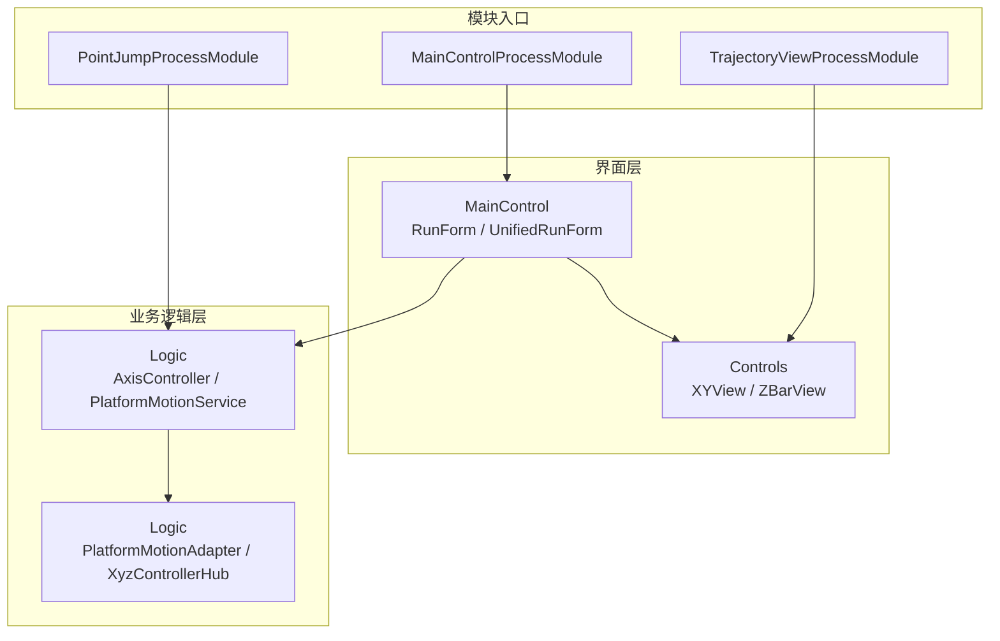
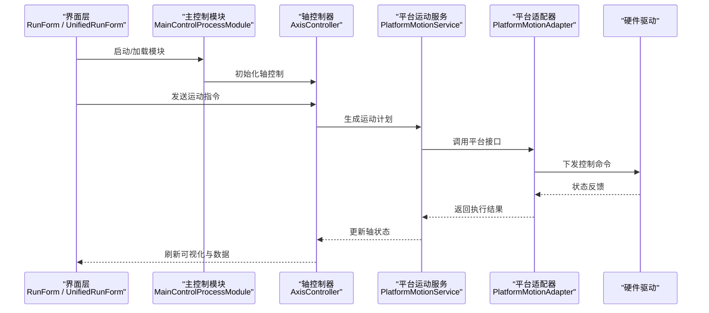
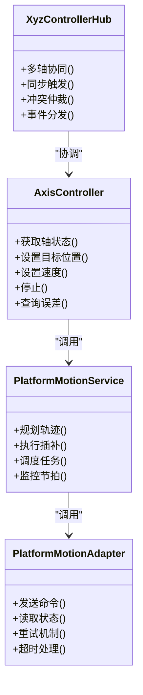
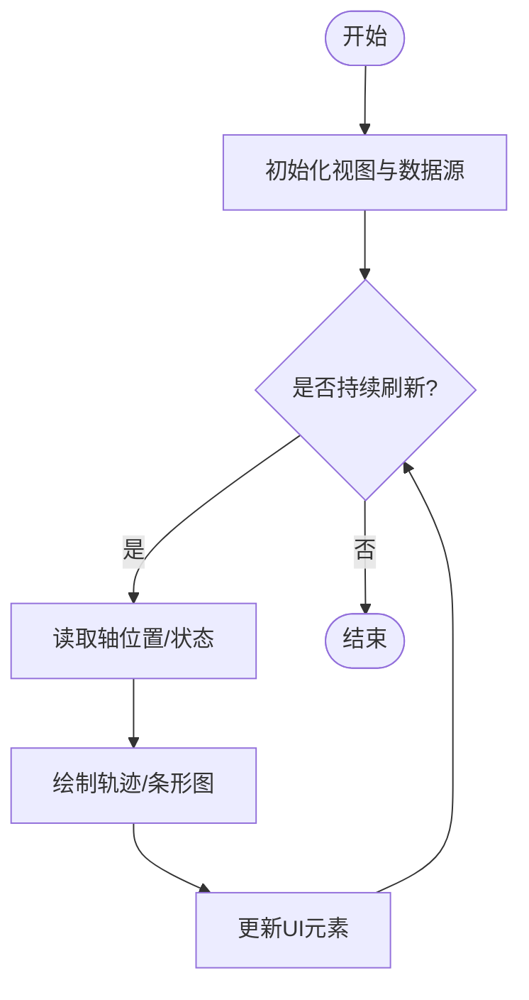
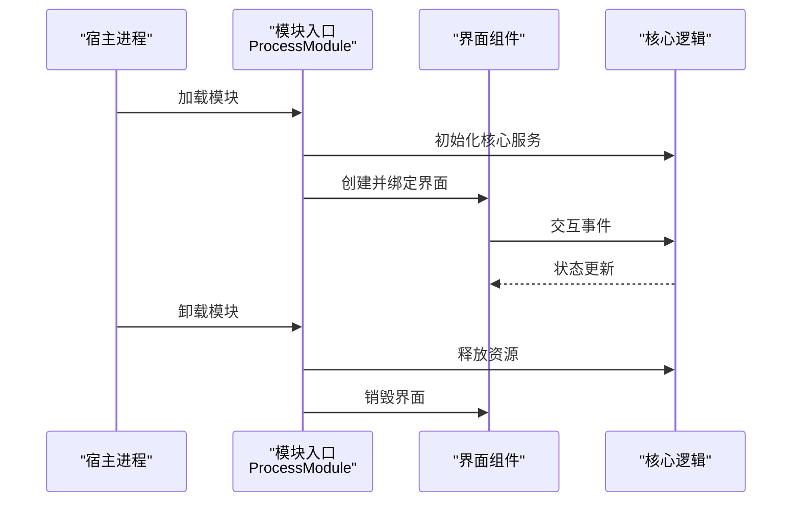

# 调试与优化

<cite>
**本文引用的文件**   
- [ProcessModules.csproj](file://ProcessModules.csproj)
- [README.md](file://README.md)
- [MainControl/MainControlProcessModule.cs](file://MainControl/MainControlProcessModule.cs)
- [MainControl/RunForm.cs](file://MainControl/RunForm.cs)
- [MainControl/UnifiedRunForm.cs](file://MainControl/UnifiedRunForm.cs)
- [PointJump/PointJumpProcessModule.cs](file://PointJump/PointJumpProcessModule.cs)
- [Trajectory/TrajectoryViewProcessModule.cs](file://Trajectory/TrajectoryViewProcessModule.cs)
- [Logic/AxisController.cs](file://Logic/AxisController.cs)
- [Logic/PlatformMotionService.cs](file://Logic/PlatformMotionService.cs)
- [Logic/PlatformMotionAdapter.cs](file://Logic/PlatformMotionAdapter.cs)
- [Logic/XyzControllerHub.cs](file://Logic/XyzControllerHub.cs)
- [Controls/XYView.cs](file://Controls/XYView.cs)
- [Controls/ZBarView.cs](file://Controls/ZBarView.cs)
- [DOMO/DOMO.CS](file://DOMO/DOMO.CS)
- [DOMO/MAINMODUO.CS](file://DOMO/MAINMODUO.CS)
</cite>

## 目录
1. [简介](#简介)
2. [项目结构](#项目结构)
3. [核心组件](#核心组件)
4. [架构总览](#架构总览)
5. [详细组件分析](#详细组件分析)
6. [依赖关系分析](#依赖关系分析)
7. [性能考量](#性能考量)
8. [故障排查指南](#故障排查指南)
9. [结论](#结论)
10. [附录](#附录)

## 简介
本指南面向使用 ProcessModules 框架进行运动控制与轨迹处理的开发者，聚焦于调试环境与性能优化的系统化实践。内容涵盖：
- 调试环境搭建：日志记录、断点调试、远程调试配置
- 运动控制调试技巧：轴状态监控、轨迹跟踪、实时数据可视化
- 性能分析工具：CPU 占用分析、内存泄漏检测、I/O 性能监控
- 多线程调试与死锁定位
- 常见问题诊断与解决方案：运动控制异常、UI 卡顿、数据同步问题
- 性能优化策略：算法优化、内存管理、并发处理
- 测试方法：压力测试、负载测试、稳定性测试

## 项目结构
本项目采用模块化进程（Process Module）组织方式，将不同功能域拆分为独立模块，并通过统一的基类或接口进行集成。关键目录与职责如下：
- Controls：用户界面控件，如 XY 视图、Z 轴条形图、辅助数学与绘图工具
- Logic：运动控制核心逻辑，包括轴控制器、平台适配器与服务、命令模型等
- MainControl：主控制模块，包含运行表单与统一运行界面
- PointJump：点位跳转模块
- Trajectory：轨迹模块，提供轨迹视图与相关设置
- DOMO：示例/演示模块
- 根级工程文件与说明文档

图表来源
- [MainControl/RunForm.cs](file://MainControl/RunForm.cs)
- [MainControl/UnifiedRunForm.cs](file://MainControl/UnifiedRunForm.cs)
- [Controls/XYView.cs](file://Controls/XYView.cs)
- [Controls/ZBarView.cs](file://Controls/ZBarView.cs)
- [Logic/AxisController.cs](file://Logic/AxisController.cs)
- [Logic/PlatformMotionService.cs](file://Logic/PlatformMotionService.cs)
- [Logic/PlatformMotionAdapter.cs](file://Logic/PlatformMotionAdapter.cs)
- [Logic/XyzControllerHub.cs](file://Logic/XyzControllerHub.cs)
- [MainControl/MainControlProcessModule.cs](file://MainControl/MainControlProcessModule.cs)
- [PointJump/PointJumpProcessModule.cs](file://PointJump/PointJumpProcessModule.cs)
- [Trajectory/TrajectoryViewProcessModule.cs](file://Trajectory/TrajectoryViewProcessModule.cs)

章节来源
- [ProcessModules.csproj](file://ProcessModules.csproj)
- [README.md](file://README.md)

## 核心组件
- 运动控制核心
  - AxisController：轴控制抽象与协调，封装轴状态、速度、位置与指令下发
  - PlatformMotionService：平台运动服务，负责运动计划、插补与调度
  - PlatformMotionAdapter：平台适配器，屏蔽底层硬件差异，提供统一接口
  - XyzControllerHub：XYZ 多轴协同控制器，协调三轴联动与同步
- 界面与可视化
  - XYView：二维轨迹与位置可视化
  - ZBarView：Z 轴状态/高度可视化
  - RunForm / UnifiedRunForm：运行界面与统一控制入口
- 模块入口
  - MainControlProcessModule：主控制模块入口
  - PointJumpProcessModule：点位跳转模块入口
  - TrajectoryViewProcessModule：轨迹视图模块入口

章节来源
- [Logic/AxisController.cs](file://Logic/AxisController.cs)
- [Logic/PlatformMotionService.cs](file://Logic/PlatformMotionService.cs)
- [Logic/PlatformMotionAdapter.cs](file://Logic/PlatformMotionAdapter.cs)
- [Logic/XyzControllerHub.cs](file://Logic/XyzControllerHub.cs)
- [Controls/XYView.cs](file://Controls/XYView.cs)
- [Controls/ZBarView.cs](file://Controls/ZBarView.cs)
- [MainControl/RunForm.cs](file://MainControl/RunForm.cs)
- [MainControl/UnifiedRunForm.cs](file://MainControl/UnifiedRunForm.cs)
- [MainControl/MainControlProcessModule.cs](file://MainControl/MainControlProcessModule.cs)
- [PointJump/PointJumpProcessModule.cs](file://PointJump/PointJumpProcessModule.cs)
- [Trajectory/TrajectoryViewProcessModule.cs](file://Trajectory/TrajectoryViewProcessModule.cs)

## 架构总览
整体架构遵循“界面层—业务逻辑层—平台适配层”的分层设计，模块通过进程模块入口进行装配与生命周期管理。

图表来源
- [MainControl/RunForm.cs](file://MainControl/RunForm.cs)
- [MainControl/UnifiedRunForm.cs](file://MainControl/UnifiedRunForm.cs)
- [MainControl/MainControlProcessModule.cs](file://MainControl/MainControlProcessModule.cs)
- [Logic/AxisController.cs](file://Logic/AxisController.cs)
- [Logic/PlatformMotionService.cs](file://Logic/PlatformMotionService.cs)
- [Logic/PlatformMotionAdapter.cs](file://Logic/PlatformMotionAdapter.cs)

## 详细组件分析

### 轴控制器与运动服务
- AxisController
  - 职责：轴状态管理、速度与位置采集、指令编排与校验
  - 关键点：线程安全、状态机、错误码映射、回调通知
- PlatformMotionService
  - 职责：轨迹规划、插补计算、节拍控制、并发任务调度
  - 关键点：缓冲区管理、时间片分配、异常恢复
- PlatformMotionAdapter
  - 职责：平台抽象、协议封装、重试与超时控制
  - 关键点：可插拔实现、兼容性适配、性能回退策略
- XyzControllerHub
  - 职责：多轴协同、同步触发、冲突仲裁
  - 关键点：锁粒度、事件驱动、时序一致性

图表来源
- [Logic/AxisController.cs](file://Logic/AxisController.cs)
- [Logic/PlatformMotionService.cs](file://Logic/PlatformMotionService.cs)
- [Logic/PlatformMotionAdapter.cs](file://Logic/PlatformMotionAdapter.cs)
- [Logic/XyzControllerHub.cs](file://Logic/XyzControllerHub.cs)

章节来源
- [Logic/AxisController.cs](file://Logic/AxisController.cs)
- [Logic/PlatformMotionService.cs](file://Logic/PlatformMotionService.cs)
- [Logic/PlatformMotionAdapter.cs](file://Logic/PlatformMotionAdapter.cs)
- [Logic/XyzControllerHub.cs](file://Logic/XyzControllerHub.cs)

### 界面与可视化
- XYView：二维轨迹绘制、光标与网格、缩放与平移
- ZBarView：Z 轴高度条、阈值指示、动态刷新
- RunForm / UnifiedRunForm：运行流程编排、参数输入、状态展示

图表来源
- [Controls/XYView.cs](file://Controls/XYView.cs)
- [Controls/ZBarView.cs](file://Controls/ZBarView.cs)
- [MainControl/RunForm.cs](file://MainControl/RunForm.cs)
- [MainControl/UnifiedRunForm.cs](file://MainControl/UnifiedRunForm.cs)

章节来源
- [Controls/XYView.cs](file://Controls/XYView.cs)
- [Controls/ZBarView.cs](file://Controls/ZBarView.cs)
- [MainControl/RunForm.cs](file://MainControl/RunForm.cs)
- [MainControl/UnifiedRunForm.cs](file://MainControl/UnifiedRunForm.cs)

### 模块入口与生命周期
- MainControlProcessModule：主控制模块的加载、初始化与资源释放
- PointJumpProcessModule：点位跳转模块的生命周期管理
- TrajectoryViewProcessModule：轨迹视图模块的装配与显示

图表来源
- [MainControl/MainControlProcessModule.cs](file://MainControl/MainControlProcessModule.cs)
- [PointJump/PointJumpProcessModule.cs](file://PointJump/PointJumpProcessModule.cs)
- [Trajectory/TrajectoryViewProcessModule.cs](file://Trajectory/TrajectoryViewProcessModule.cs)

章节来源
- [MainControl/MainControlProcessModule.cs](file://MainControl/MainControlProcessModule.cs)
- [PointJump/PointJumpProcessModule.cs](file://PointJump/PointJumpProcessModule.cs)
- [Trajectory/TrajectoryViewProcessModule.cs](file://Trajectory/TrajectoryViewProcessModule.cs)

### 示例与演示
- DOMO 模块：用于演示模块装配与基础用法，便于快速上手与验证流程

章节来源
- [DOMO/DOMO.CS](file://DOMO/DOMO.CS)
- [DOMO/MAINMODUO.CS](file://DOMO/MAINMODUO.CS)

## 依赖关系分析
- 模块间耦合
  - 界面层依赖业务逻辑层提供的状态与事件
  - 业务逻辑层通过平台适配器与硬件解耦
  - 模块入口负责装配与生命周期管理，降低直接耦合
- 外部依赖
  - 硬件驱动与通信协议由 PlatformMotionAdapter 抽象
  - UI 渲染依赖 .NET 图形库与控件体系

图表来源
- [MainControl/MainControlProcessModule.cs](file://MainControl/MainControlProcessModule.cs)
- [Logic/PlatformMotionAdapter.cs](file://Logic/PlatformMotionAdapter.cs)
- [MainControl/RunForm.cs](file://MainControl/RunForm.cs)

章节来源
- [ProcessModules.csproj](file://ProcessModules.csproj)

## 性能考量
- CPU 占用分析
  - 使用性能分析器对热点函数进行采样，重点关注轨迹插补与 UI 刷新循环
  - 减少不必要的对象分配与频繁 GC，避免在高频路径中创建临时对象
- 内存泄漏检测
  - 使用内存快照对比，定位未释放的事件订阅、定时器与缓存
  - 检查跨线程引用与静态集合的清理
- I/O 性能监控
  - 对硬件通信进行异步化与批处理，减少阻塞
  - 监控网络/串口/USB 的吞吐与延迟，必要时启用缓冲与重试
- 并发与锁
  - 缩小锁粒度，避免长事务持有锁
  - 使用无锁数据结构或队列进行生产者-消费者模式
- UI 流畅性
  - 将重绘与数据处理分离到后台线程，UI 仅做轻量更新
  - 限制刷新频率，合并多次状态变更再批量更新

[本节为通用指导，不直接分析具体文件]

## 故障排查指南
- 日志记录
  - 在关键路径添加结构化日志，包含时间戳、模块名、请求 ID、轴号、错误码
  - 区分日志级别（Debug/Info/Warn/Error），便于过滤与聚合
- 断点调试
  - 在运动指令下发前、状态回调处、异常捕获点设置断点
  - 使用条件断点与命中计数，避免干扰正常流程
- 远程调试
  - 部署 Release 版本并启用调试符号，配置远程连接
  - 确保防火墙与权限允许调试端口访问
- 运动控制异常
  - 检查轴限位、急停信号、编码器反馈与通信超时
  - 核对速度/加速度参数与机械约束，避免超限
- UI 卡顿
  - 识别主线程阻塞点，将耗时操作移至后台
  - 减少 UI 更新频率，使用增量更新与双缓冲
- 数据同步问题
  - 使用事件驱动与不可变数据传递，避免竞态条件
  - 对共享状态加细粒度锁或使用原子操作

章节来源
- [Logic/AxisController.cs](file://Logic/AxisController.cs)
- [Logic/PlatformMotionService.cs](file://Logic/PlatformMotionService.cs)
- [MainControl/RunForm.cs](file://MainControl/RunForm.cs)

## 结论
通过分层架构与模块化设计，ProcessModules 框架在运动控制与轨迹处理上具备良好的扩展性与可维护性。结合系统的调试方法与性能优化策略，可有效提升开发效率与系统稳定性。建议在生产环境中持续监控关键指标，并结合测试手段保障质量。

[本节为总结性内容，不直接分析具体文件]

## 附录
- 调试环境搭建清单
  - 安装 .NET SDK 与 IDE，启用调试符号
  - 配置日志输出路径与级别
  - 准备远程调试所需的权限与端口
- 性能分析工具推荐
  - CPU 分析：性能分析器、采样器
  - 内存分析：内存快照、分配热点
  - I/O 监控：网络/串口/磁盘 IO 计数器
- 测试实施方法
  - 压力测试：高并发指令下发与大数据量轨迹回放
  - 负载测试：长时间运行与边界参数组合
  - 稳定性测试：异常注入与恢复验证

[本节为通用指导，不直接分析具体文件]