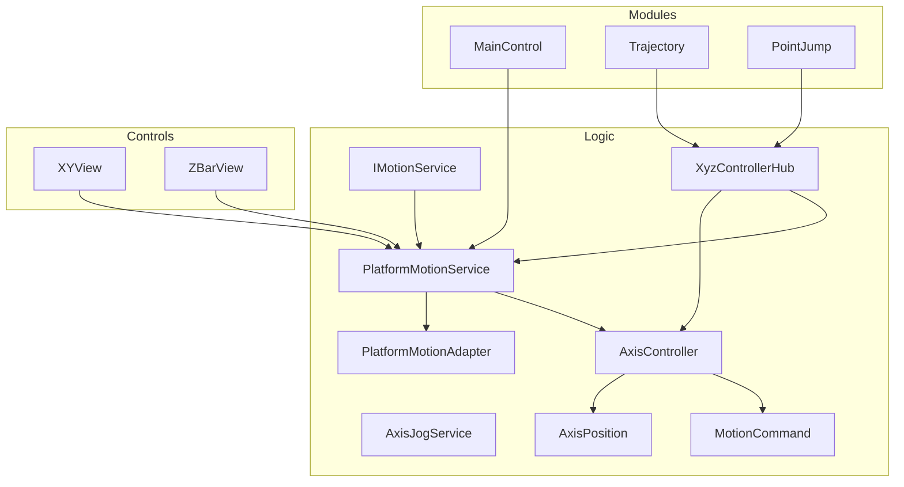
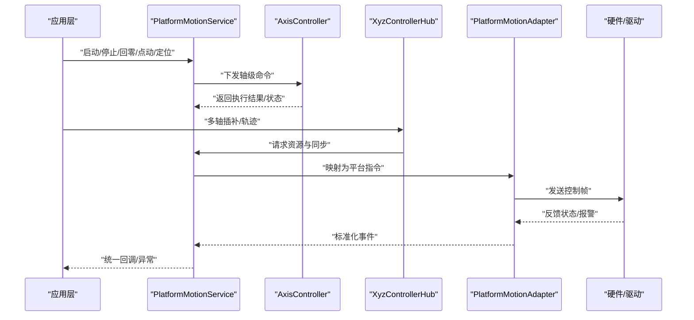
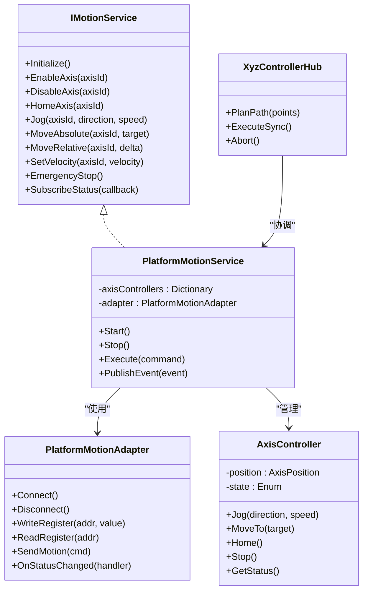
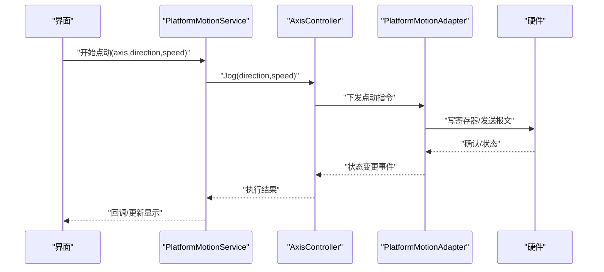
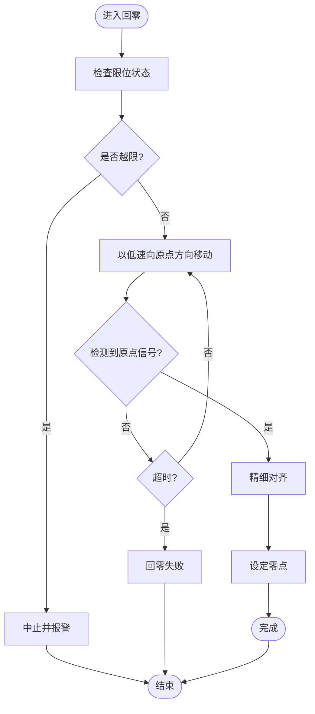
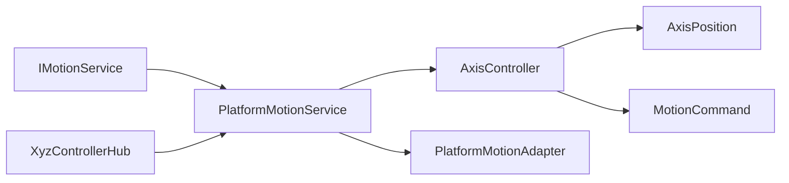

# 运动服务扩展

<cite>
**本文引用的文件**   
- [IMotionService.cs](file://Logic/IMotionService.cs)
- [PlatformMotionAdapter.cs](file://Logic/PlatformMotionAdapter.cs)
- [PlatformMotionService.cs](file://Logic/PlatformMotionService.cs)
- [AxisController.cs](file://Logic/AxisController.cs)
- [AxisJogService.cs](file://Logic/AxisJogService.cs)
- [AxisPosition.cs](file://Logic/AxisPosition.cs)
- [MotionCommand.cs](file://Logic/MotionCommand.cs)
- [XyzControllerHub.cs](file://Logic/XyzControllerHub.cs)
- [PlatformMotionAdapter使用说明.md](file://Logic/PlatformMotionAdapter使用说明.md)
</cite>

## 目录
1. [简介](#简介)
2. [项目结构](#项目结构)
3. [核心组件](#核心组件)
4. [架构总览](#架构总览)
5. [详细组件分析](#详细组件分析)
6. [依赖关系分析](#依赖关系分析)
7. [性能考虑](#性能考虑)
8. [故障排查指南](#故障排查指南)
9. [结论](#结论)
10. [附录](#附录)

## 简介
本指南面向需要在ProcessModules框架中扩展运动服务的工程师，聚焦于IMotionService接口的设计原理与实现规范，以及PlatformMotionAdapter的适配方法。文档涵盖轴控制、位置管理、速度调节与安全保护、异步操作处理、错误恢复与状态同步策略；并给出多轴协调控制、插补算法与轨迹规划集成的实践建议，同时提供性能调优、内存管理与线程安全要点，以及硬件抽象层设计与第三方设备集成方案。

## 项目结构
本项目采用分层与按功能模块组织的方式：
- Logic层：定义运动服务接口、适配器与服务实现、轴控制器、位置模型、命令模型与XYZ多轴协调器。
- Controls层：UI控件（如XY视图、Z条视图等），用于可视化与交互。
- MainControl/Trajectory/PointJump等：进程模块，承载具体业务场景。

图表来源
- [IMotionService.cs](file://Logic/IMotionService.cs)
- [PlatformMotionAdapter.cs](file://Logic/PlatformMotionAdapter.cs)
- [PlatformMotionService.cs](file://Logic/PlatformMotionService.cs)
- [AxisController.cs](file://Logic/AxisController.cs)
- [AxisJogService.cs](file://Logic/AxisJogService.cs)
- [AxisPosition.cs](file://Logic/AxisPosition.cs)
- [MotionCommand.cs](file://Logic/MotionCommand.cs)
- [XyzControllerHub.cs](file://Logic/XyzControllerHub.cs)

章节来源
- [IMotionService.cs](file://Logic/IMotionService.cs)
- [PlatformMotionAdapter.cs](file://Logic/PlatformMotionAdapter.cs)
- [PlatformMotionService.cs](file://Logic/PlatformMotionService.cs)
- [AxisController.cs](file://Logic/AxisController.cs)
- [AxisJogService.cs](file://Logic/AxisJogService.cs)
- [AxisPosition.cs](file://Logic/AxisPosition.cs)
- [MotionCommand.cs](file://Logic/MotionCommand.cs)
- [XyzControllerHub.cs](file://Logic/XyzControllerHub.cs)

## 核心组件
- IMotionService：运动服务契约，定义轴控制、位置查询、速度设置、回零、限位、急停、状态订阅等能力。
- PlatformMotionAdapter：平台适配器抽象，屏蔽底层硬件差异，向上暴露统一接口。
- PlatformMotionService：服务实现，聚合适配器与轴控制器，提供面向应用的高阶API。
- AxisController：单轴控制器，封装加减速、定位、点动、回零、限位与急停等动作。
- AxisPosition：轴位置数据模型，包含当前位置、目标位置、状态与时间戳。
- MotionCommand：运动命令模型，描述指令类型、参数、优先级与执行上下文。
- XyzControllerHub：XYZ三轴协调器，负责多轴插补与轨迹合成。

章节来源
- [IMotionService.cs](file://Logic/IMotionService.cs)
- [PlatformMotionAdapter.cs](file://Logic/PlatformMotionAdapter.cs)
- [PlatformMotionService.cs](file://Logic/PlatformMotionService.cs)
- [AxisController.cs](file://Logic/AxisController.cs)
- [AxisJogService.cs](file://Logic/AxisJogService.cs)
- [AxisPosition.cs](file://Logic/AxisPosition.cs)
- [MotionCommand.cs](file://Logic/MotionCommand.cs)
- [XyzControllerHub.cs](file://Logic/XyzControllerHub.cs)

## 架构总览
整体采用“接口+适配器+服务”的分层设计：
- 上层应用通过IMotionService调用运动能力。
- PlatformMotionService作为门面，协调AxisController与PlatformMotionAdapter。
- PlatformMotionAdapter对接具体硬件或驱动，屏蔽协议与时序差异。
- XyzControllerHub在多轴场景下对命令进行分解、插补与调度。

图表来源
- [PlatformMotionService.cs](file://Logic/PlatformMotionService.cs)
- [AxisController.cs](file://Logic/AxisController.cs)
- [XyzControllerHub.cs](file://Logic/XyzControllerHub.cs)
- [PlatformMotionAdapter.cs](file://Logic/PlatformMotionAdapter.cs)

## 详细组件分析

### IMotionService接口设计
- 职责边界：对外暴露统一的运动控制能力，屏蔽内部实现细节。
- 关键能力：
  - 轴生命周期：初始化、启用、禁用、复位。
  - 运动控制：点动、绝对/相对定位、回零、急停、软限位。
  - 速度与加速度：全局与轴级配置。
  - 状态与事件：位置、速度、报警、完成事件订阅。
  - 安全保护：硬/软限位、碰撞检测、超时与看门狗。
- 设计原则：
  - 幂等性：重复调用应安全且可预期。
  - 异步优先：长耗时操作使用异步API与回调/事件。
  - 错误隔离：单个轴失败不影响其他轴。
  - 可观测性：丰富的状态与诊断信息。

章节来源
- [IMotionService.cs](file://Logic/IMotionService.cs)

### PlatformMotionAdapter适配器模式
- 设计目标：将不同硬件平台的通信协议、寄存器映射、时序约束抽象为统一接口。
- 典型方法：
  - 连接/断开、心跳保活。
  - 读写寄存器/变量。
  - 下发运动指令与批量写入。
  - 接收状态与报警事件。
- 实现要点：
  - 线程安全：并发访问需加锁或使用无锁队列。
  - 重试与退避：网络抖动或总线拥塞时的自动重试。
  - 超时与熔断：防止阻塞与雪崩。
  - 日志与追踪：关键路径打点，便于排障。

章节来源
- [PlatformMotionAdapter.cs](file://Logic/PlatformMotionAdapter.cs)
- [PlatformMotionAdapter使用说明.md](file://Logic/PlatformMotionAdapter使用说明.md)

### PlatformMotionService服务实现
- 角色：聚合AxisController与PlatformMotionAdapter，提供面向应用的API。
- 功能：
  - 命令路由：根据命令类型选择合适控制器或插补器。
  - 状态同步：周期性读取硬件状态，合并到内存模型。
  - 事件分发：将硬件事件转换为应用可订阅的事件。
  - 安全策略：急停、限位、超时、互斥与仲裁。
- 并发模型：
  - 使用任务队列与线程池执行耗时操作。
  - 通过信号量限制并发访问硬件。
  - 使用不可变数据结构传递状态快照。

章节来源
- [PlatformMotionService.cs](file://Logic/PlatformMotionService.cs)

### AxisController轴控制器
- 职责：单轴的加减速、定位、点动、回零、限位与急停。
- 关键点：
  - 运动曲线：梯形/S型加减速，避免冲击。
  - 状态机：空闲、运行、暂停、报警、回零等状态转换。
  - 安全：软限位、电子齿轮比、反向间隙补偿。
  - 性能：批量写入、环形缓冲、中断驱动更新。

章节来源
- [AxisController.cs](file://Logic/AxisController.cs)
- [AxisJogService.cs](file://Logic/AxisJogService.cs)

### AxisPosition位置模型
- 字段：当前值、目标值、单位、分辨率、时间戳、状态码。
- 用途：为UI与上层逻辑提供一致的位置语义。
- 线程安全：只读快照或原子更新。

章节来源
- [AxisPosition.cs](file://Logic/AxisPosition.cs)

### MotionCommand命令模型
- 字段：命令类型、轴ID、参数、优先级、超时、上下文。
- 用途：统一描述所有运动指令，便于序列化与回放。

章节来源
- [MotionCommand.cs](file://Logic/MotionCommand.cs)

### XyzControllerHub多轴协调器
- 职责：将多轴指令分解为插补段，保证同步与平滑过渡。
- 能力：
  - 直线/圆弧插补、加减速同步。
  - 前瞻与缓存，减少卡顿。
  - 冲突检测与仲裁。

章节来源
- [XyzControllerHub.cs](file://Logic/XyzControllerHub.cs)

#### 类关系图（代码级）

图表来源
- [IMotionService.cs](file://Logic/IMotionService.cs)
- [PlatformMotionService.cs](file://Logic/PlatformMotionService.cs)
- [PlatformMotionAdapter.cs](file://Logic/PlatformMotionAdapter.cs)
- [AxisController.cs](file://Logic/AxisController.cs)
- [XyzControllerHub.cs](file://Logic/XyzControllerHub.cs)

#### 序列图：点动流程（示例）

图表来源
- [AxisJogService.cs](file://Logic/AxisJogService.cs)
- [AxisController.cs](file://Logic/AxisController.cs)
- [PlatformMotionAdapter.cs](file://Logic/PlatformMotionAdapter.cs)

#### 流程图：回零算法（示例）

图表来源
- [AxisController.cs](file://Logic/AxisController.cs)

## 依赖关系分析
- 松耦合：IMotionService与具体实现解耦，便于替换与测试。
- 适配器隔离：PlatformMotionAdapter屏蔽硬件差异，降低上层复杂度。
- 组合优于继承：PlatformMotionService组合多个AxisController与Adapter。
- 事件驱动：通过事件/回调降低轮询开销，提升响应性。

图表来源
- [IMotionService.cs](file://Logic/IMotionService.cs)
- [PlatformMotionService.cs](file://Logic/PlatformMotionService.cs)
- [AxisController.cs](file://Logic/AxisController.cs)
- [PlatformMotionAdapter.cs](file://Logic/PlatformMotionAdapter.cs)
- [XyzControllerHub.cs](file://Logic/XyzControllerHub.cs)
- [AxisPosition.cs](file://Logic/AxisPosition.cs)
- [MotionCommand.cs](file://Logic/MotionCommand.cs)

章节来源
- [PlatformMotionAdapter使用说明.md](file://Logic/PlatformMotionAdapter使用说明.md)

## 性能考虑
- 批量写入与合并：将多次写操作合并为一次总线访问，降低延迟。
- 环形缓冲与零拷贝：在高频状态上报时减少内存分配与拷贝。
- 异步与背压：使用非阻塞I/O与有界队列，避免堆积。
- 线程模型：专用工作线程处理硬件通信，UI线程仅做展示。
- 缓存与去抖：对频繁变化的状态进行采样与去抖，降低CPU占用。
- 精度与单位：统一单位换算，避免运行时浮点误差累积。

[本节为通用指导，不直接分析具体文件]

## 故障排查指南
- 常见问题：
  - 连接不稳定：检查心跳、超时与重连策略。
  - 状态不同步：核对事件订阅与刷新周期。
  - 运动卡顿：查看队列长度、线程池大小与锁竞争。
  - 报警频发：检查限位、碰撞检测与参数合理性。
- 定位手段：
  - 开启详细日志，记录命令与响应时间。
  - 使用状态快照对比，定位不一致点。
  - 模拟硬件断言，验证异常分支。

章节来源
- [PlatformMotionAdapter使用说明.md](file://Logic/PlatformMotionAdapter使用说明.md)

## 结论
通过IMotionService与PlatformMotionAdapter的分层设计，ProcessModules实现了高内聚、低耦合的运动控制体系。借助AxisController与XyzControllerHub，既能满足单轴精准控制，也能支撑多轴插补与轨迹规划。遵循本文的实践建议，可在保证安全与性能的前提下，快速扩展新的硬件平台与控制器。

[本节为总结，不直接分析具体文件]

## 附录
- 新平台接入步骤：
  - 实现PlatformMotionAdapter，统一注册事件与命令。
  - 在PlatformMotionService中注册适配器实例。
  - 编写单元测试覆盖连接、读写、超时与异常路径。
- 多轴协调要点：
  - 统一时钟源与同步信号。
  - 合理设置前瞻长度与缓冲区深度。
  - 关注加减速同步与拐角平滑。
- 安全与合规：
  - 急停链路独立于常规控制路径。
  - 限位与碰撞检测必须实时生效。
  - 关键参数变更需权限校验与审计。

[本节为补充说明，不直接分析具体文件]