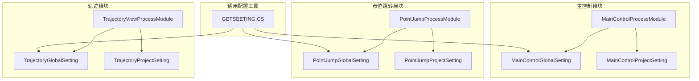
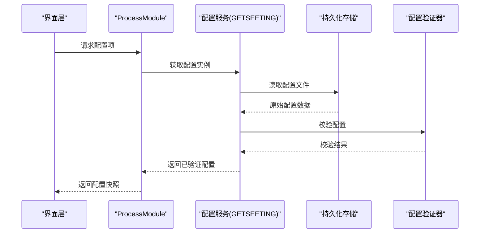
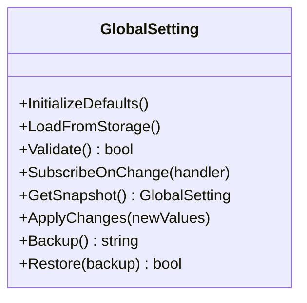
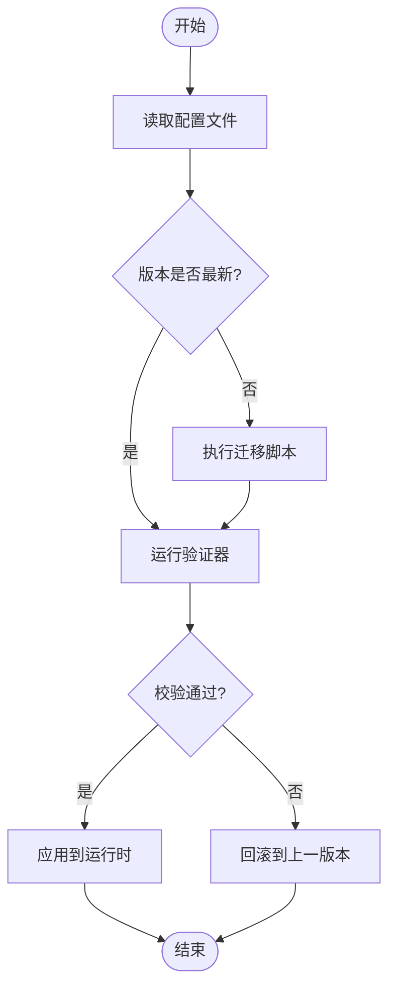
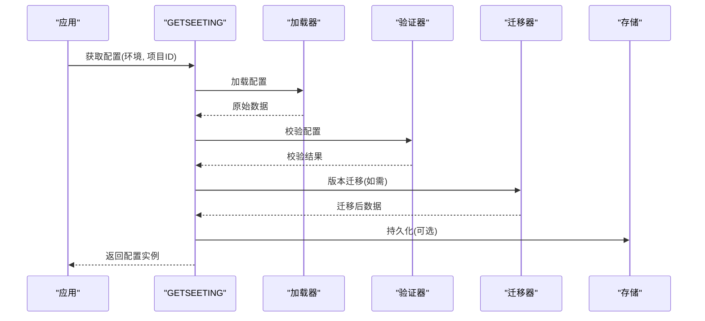
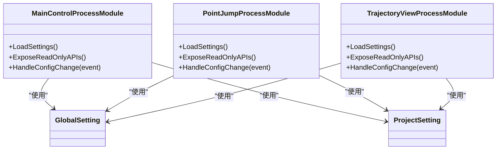
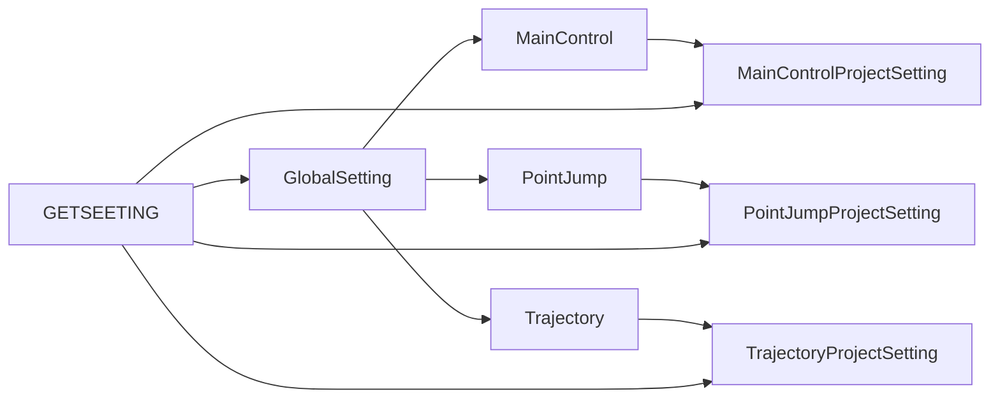

# 配置管理

<cite>
**本文引用的文件**   
- [MainControlGlobalSetting.cs](file://MainControl/MainControlGlobalSetting.cs)
- [MainControlProjectSetting.cs](file://MainControl/MainControlProjectSetting.cs)
- [PointJumpGlobalSetting.cs](file://PointJump/PointJumpGlobalSetting.cs)
- [PointJumpProjectSetting.cs](file://PointJump/PointJumpProjectSetting.cs)
- [TrajectoryGlobalSetting.cs](file://Trajectory/TrajectoryGlobalSetting.cs)
- [TrajectoryProjectSetting.cs](file://Trajectory/TrajectoryProjectSetting.cs)
- [GETSEETING.CS](file://DOMO/GETSEETING.CS)
- [MainControlProcessModule.cs](file://MainControl/MainControlProcessModule.cs)
- [PointJumpProcessModule.cs](file://PointJump/PointJumpProcessModule.cs)
- [TrajectoryViewProcessModule.cs](file://Trajectory/TrajectoryViewProcessModule.cs)
</cite>

## 目录
1. [简介](#简介)
2. [项目结构](#项目结构)
3. [核心组件](#核心组件)
4. [架构总览](#架构总览)
5. [详细组件分析](#详细组件分析)
6. [依赖关系分析](#依赖关系分析)
7. [性能考虑](#性能考虑)
8. [故障排查指南](#故障排查指南)
9. [结论](#结论)
10. [附录](#附录)

## 简介
本指南面向 ProcessModules 框架的配置管理系统，聚焦于 GlobalSetting（全局设置）与 ProjectSetting（项目设置）的设计模式与实现原理。文档将系统阐述如何扩展配置项、定义数据类型与验证规则、设置默认值，以及实现配置的序列化/反序列化、版本迁移、热重载、动态更新、备份恢复、权限控制、加密存储、多环境支持、导入导出与批量管理等能力。同时给出配置与业务逻辑解耦的最佳实践，帮助开发者在保持高内聚低耦合的前提下，构建稳定可扩展的配置体系。

## 项目结构
本项目采用按功能模块划分的项目组织方式：每个功能模块（如 MainControl、PointJump、Trajectory）均包含自身的 GlobalSetting 与 ProjectSetting 类，并通过各自的 ProcessModule 进行装配与使用。DOMO 模块中的 GETSEETING.CS 提供统一的配置读取入口或工具方法。

图表来源
- [MainControlGlobalSetting.cs](file://MainControl/MainControlGlobalSetting.cs)
- [MainControlProjectSetting.cs](file://MainControl/MainControlProjectSetting.cs)
- [PointJumpGlobalSetting.cs](file://PointJump/PointJumpGlobalSetting.cs)
- [PointJumpProjectSetting.cs](file://PointJump/PointJumpProjectSetting.cs)
- [TrajectoryGlobalSetting.cs](file://Trajectory/TrajectoryGlobalSetting.cs)
- [TrajectoryProjectSetting.cs](file://Trajectory/TrajectoryProjectSetting.cs)
- [GETSEETING.CS](file://DOMO/GETSEETING.CS)
- [MainControlProcessModule.cs](file://MainControl/MainControlProcessModule.cs)
- [PointJumpProcessModule.cs](file://PointJump/PointJumpProcessModule.cs)
- [TrajectoryViewProcessModule.cs](file://Trajectory/TrajectoryViewProcessModule.cs)

章节来源
- [MainControlGlobalSetting.cs](file://MainControl/MainControlGlobalSetting.cs)
- [MainControlProjectSetting.cs](file://MainControl/MainControlProjectSetting.cs)
- [PointJumpGlobalSetting.cs](file://PointJump/PointJumpGlobalSetting.cs)
- [PointJumpProjectSetting.cs](file://PointJump/PointJumpProjectSetting.cs)
- [TrajectoryGlobalSetting.cs](file://Trajectory/TrajectoryGlobalSetting.cs)
- [TrajectoryProjectSetting.cs](file://Trajectory/TrajectoryProjectSetting.cs)
- [GETSEETING.CS](file://DOMO/GETSEETING.CS)
- [MainControlProcessModule.cs](file://MainControl/MainControlProcessModule.cs)
- [PointJumpProcessModule.cs](file://PointJump/PointJumpProcessModule.cs)
- [TrajectoryViewProcessModule.cs](file://Trajectory/TrajectoryViewProcessModule.cs)

## 核心组件
- GlobalSetting（全局设置）
  - 职责：承载跨模块共享的运行时参数、界面主题、设备通信参数等。
  - 设计要点：单例或容器托管；提供默认值初始化；支持只读快照与变更通知。
- ProjectSetting（项目设置）
  - 职责：承载特定项目的工艺参数、路径规划参数、限幅阈值等。
  - 设计要点：可序列化为 JSON/XML；支持版本迁移；支持校验与回滚。
- ProcessModule（模块装配）
  - 职责：加载并注入对应 GlobalSetting/ProjectSetting；暴露配置访问接口给 UI 与业务逻辑。
- 配置工具（GETSEETING.CS）
  - 职责：统一获取配置实例、读写持久化、版本迁移、备份恢复、权限检查、加密解密等。

章节来源
- [MainControlGlobalSetting.cs](file://MainControl/MainControlGlobalSetting.cs)
- [MainControlProjectSetting.cs](file://MainControl/MainControlProjectSetting.cs)
- [PointJumpGlobalSetting.cs](file://PointJump/PointJumpGlobalSetting.cs)
- [PointJumpProjectSetting.cs](file://PointJump/PointJumpProjectSetting.cs)
- [TrajectoryGlobalSetting.cs](file://Trajectory/TrajectoryGlobalSetting.cs)
- [TrajectoryProjectSetting.cs](file://Trajectory/TrajectoryProjectSetting.cs)
- [GETSEETING.CS](file://DOMO/GETSEETING.CS)
- [MainControlProcessModule.cs](file://MainControl/MainControlProcessModule.cs)
- [PointJumpProcessModule.cs](file://PointJump/PointJumpProcessModule.cs)
- [TrajectoryViewProcessModule.cs](file://Trajectory/TrajectoryViewProcessModule.cs)

## 架构总览
配置系统采用“分层+模块化”的架构：
- 表现层（UI）通过 ProcessModule 提供的只读接口访问配置，避免直接修改。
- 服务层（配置服务）负责加载、校验、持久化、热重载、备份恢复、权限与加密。
- 数据层（文件/注册表/数据库）提供持久化能力。
- 模块层（各模块 Setting）定义具体配置项与默认值。

图表来源
- [GETSEETING.CS](file://DOMO/GETSEETING.CS)
- [MainControlProcessModule.cs](file://MainControl/MainControlProcessModule.cs)
- [PointJumpProcessModule.cs](file://PointJump/PointJumpProcessModule.cs)
- [TrajectoryViewProcessModule.cs](file://Trajectory/TrajectoryViewProcessModule.cs)

## 详细组件分析

### GlobalSetting 设计与实现
- 设计模式
  - 单例/容器托管：确保全局唯一性，避免重复加载。
  - 观察者模式：变更事件通知订阅者（UI刷新、业务重算）。
  - 工厂模式：根据环境（开发/测试/生产）生成不同默认值。
- 数据结构
  - 基础类型：int、double、bool、string、枚举。
  - 复合类型：数组、字典、嵌套对象。
  - 时间与时区：DateTime、TimeSpan、时区偏移。
- 默认值策略
  - 启动时合并“内置默认值”与“用户覆盖值”。
  - 缺失字段自动填充，记录日志以便审计。
- 验证规则
  - 范围校验、格式校验、依赖校验（A>B 且 B>C）。
  - 自定义验证器扩展点，支持异步校验。
- 热重载与动态更新
  - 监听配置文件变化，增量更新并触发事件。
  - 支持回滚到上一个有效版本。
- 权限与加密
  - 敏感字段标记为机密，写入时加密，读取时解密。
  - 基于角色或用户的访问控制。

图表来源
- [MainControlGlobalSetting.cs](file://MainControl/MainControlGlobalSetting.cs)
- [PointJumpGlobalSetting.cs](file://PointJump/PointJumpGlobalSetting.cs)
- [TrajectoryGlobalSetting.cs](file://Trajectory/TrajectoryGlobalSetting.cs)

章节来源
- [MainControlGlobalSetting.cs](file://MainControl/MainControlGlobalSetting.cs)
- [PointJumpGlobalSetting.cs](file://PointJump/PointJumpGlobalSetting.cs)
- [TrajectoryGlobalSetting.cs](file://Trajectory/TrajectoryGlobalSetting.cs)

### ProjectSetting 设计与实现
- 设计模式
  - 可序列化对象：JSON/XML 映射，支持版本字段。
  - 策略模式：不同项目模板应用不同的默认策略。
- 数据结构
  - 工艺参数：速度、加速度、步距、补偿系数。
  - 路径规划：插补算法选择、平滑半径、拐角处理。
  - 限幅与保护：软限位、急停阈值、报警阈值。
- 版本迁移
  - 迁移脚本：字段增删改、类型转换、数据清洗。
  - 向后兼容：旧版本自动升级，失败则回滚。
- 校验与回滚
  - 预提交校验，失败不保存。
  - 保存前创建备份，失败自动恢复。

图表来源
- [MainControlProjectSetting.cs](file://MainControl/MainControlProjectSetting.cs)
- [PointJumpProjectSetting.cs](file://PointJump/PointJumpProjectSetting.cs)
- [TrajectoryProjectSetting.cs](file://Trajectory/TrajectoryProjectSetting.cs)

章节来源
- [MainControlProjectSetting.cs](file://MainControl/MainControlProjectSetting.cs)
- [PointJumpProjectSetting.cs](file://PointJump/PointJumpProjectSetting.cs)
- [TrajectoryProjectSetting.cs](file://Trajectory/TrajectoryProjectSetting.cs)

### 配置工具与统一入口（GETSEETING.CS）
- 职责
  - 提供统一的配置获取接口，屏蔽底层存储细节。
  - 协调加载、校验、迁移、备份、权限、加密等流程。
- 关键能力
  - 多环境配置：根据环境变量切换配置源。
  - 批量操作：批量导入/导出、批量校验、批量迁移。
  - 审计日志：记录配置变更历史。

图表来源
- [GETSEETING.CS](file://DOMO/GETSEETING.CS)

章节来源
- [GETSEETING.CS](file://DOMO/GETSEETING.CS)

### 模块装配与配置注入（ProcessModule）
- 职责
  - 在模块启动时加载对应的 GlobalSetting/ProjectSetting。
  - 向 UI 和业务逻辑暴露只读接口，防止越权修改。
- 最佳实践
  - 使用依赖注入容器管理配置生命周期。
  - 提供配置快照，避免并发修改导致的不一致。

图表来源
- [MainControlProcessModule.cs](file://MainControl/MainControlProcessModule.cs)
- [PointJumpProcessModule.cs](file://PointJump/PointJumpProcessModule.cs)
- [TrajectoryViewProcessModule.cs](file://Trajectory/TrajectoryViewProcessModule.cs)

章节来源
- [MainControlProcessModule.cs](file://MainControl/MainControlProcessModule.cs)
- [PointJumpProcessModule.cs](file://PointJump/PointJumpProcessModule.cs)
- [TrajectoryViewProcessModule.cs](file://Trajectory/TrajectoryViewProcessModule.cs)

## 依赖关系分析
- 模块间耦合
  - GlobalSetting 被多个模块共享，需保证线程安全与一致性。
  - ProjectSetting 与模块强绑定，避免跨模块引用造成循环依赖。
- 外部依赖
  - 序列化库（JSON/XML）、加密库、文件系统、注册表或数据库。
- 潜在风险
  - 循环依赖：通过接口抽象与依赖注入化解。
  - 配置漂移：引入版本管理与迁移脚本。
  - 并发冲突：读写锁与快照机制。

图表来源
- [MainControlGlobalSetting.cs](file://MainControl/MainControlGlobalSetting.cs)
- [MainControlProjectSetting.cs](file://MainControl/MainControlProjectSetting.cs)
- [PointJumpGlobalSetting.cs](file://PointJump/PointJumpGlobalSetting.cs)
- [PointJumpProjectSetting.cs](file://PointJump/PointJumpProjectSetting.cs)
- [TrajectoryGlobalSetting.cs](file://Trajectory/TrajectoryGlobalSetting.cs)
- [TrajectoryProjectSetting.cs](file://Trajectory/TrajectoryProjectSetting.cs)
- [GETSEETING.CS](file://DOMO/GETSEETING.CS)

章节来源
- [MainControlGlobalSetting.cs](file://MainControl/MainControlGlobalSetting.cs)
- [MainControlProjectSetting.cs](file://MainControl/MainControlProjectSetting.cs)
- [PointJumpGlobalSetting.cs](file://PointJump/PointJumpGlobalSetting.cs)
- [PointJumpProjectSetting.cs](file://PointJump/PointJumpProjectSetting.cs)
- [TrajectoryGlobalSetting.cs](file://Trajectory/TrajectoryGlobalSetting.cs)
- [TrajectoryProjectSetting.cs](file://Trajectory/TrajectoryProjectSetting.cs)
- [GETSEETING.CS](file://DOMO/GETSEETING.CS)

## 性能考虑
- 懒加载与缓存
  - 按需加载配置，首次访问后缓存到内存。
  - 对热点配置项建立索引，提升查询效率。
- 增量更新
  - 监听文件变化，仅更新差异字段，减少全量重建开销。
- 异步校验与迁移
  - 后台线程执行耗时校验与迁移，避免阻塞主线程。
- 序列化优化
  - 使用高效的序列化库，启用压缩与流式读写。
- 并发控制
  - 读写分离，使用不可变快照避免锁竞争。

[本节为通用指导，不涉及具体文件分析]

## 故障排查指南
- 常见问题
  - 配置加载失败：检查文件格式、编码、权限。
  - 校验失败：查看错误详情，定位字段与规则。
  - 迁移失败：检查迁移脚本兼容性，回滚到上一版本。
  - 热重载无效：确认文件监听与事件分发链路。
- 调试建议
  - 启用详细日志，记录加载、校验、迁移、保存全过程。
  - 使用配置对比工具，快速定位差异。
  - 模拟异常场景，验证回滚与恢复机制。

章节来源
- [GETSEETING.CS](file://DOMO/GETSEETING.CS)

## 结论
通过 GlobalSetting 与 ProjectSetting 的分层设计、统一的配置工具与模块装配，ProcessModules 框架实现了高内聚、低耦合、可扩展的配置管理体系。结合版本迁移、热重载、权限控制、加密存储与多环境支持，能够满足复杂工业场景下的配置管理需求。遵循本文档的最佳实践，开发者可以高效地扩展配置项、实现自定义验证规则，并确保系统的稳定性与可维护性。

[本节为总结性内容，不涉及具体文件分析]

## 附录

### 扩展配置项的步骤
- 定义数据类型
  - 基础类型：int、double、bool、string、枚举。
  - 复合类型：数组、字典、嵌套对象。
- 设置默认值
  - 在 GlobalSetting/ProjectSetting 中声明默认值。
  - 支持环境差异化默认值。
- 编写验证规则
  - 内置规则：范围、格式、非空、依赖关系。
  - 自定义验证器：实现接口，注册到验证器集合。
- 实现序列化/反序列化
  - 选择 JSON/XML 作为持久化格式。
  - 处理版本字段与兼容性。
- 添加版本迁移
  - 编写迁移脚本，处理字段增删改。
  - 失败回滚与审计日志。
- 支持热重载与动态更新
  - 监听配置文件变化，增量更新。
  - 触发变更事件，通知订阅者。
- 权限与加密
  - 敏感字段标记机密，写入加密，读取解密。
  - 基于角色的访问控制。
- 导入导出与批量管理
  - 提供批量导入/导出接口。
  - 支持模板与批量校验。

[本节为通用指导，不涉及具体文件分析]

### 配置与业务逻辑解耦最佳实践
- 通过只读接口暴露配置，禁止业务逻辑直接修改。
- 使用事件驱动更新，避免紧耦合调用。
- 配置变更与业务逻辑解耦，便于测试与维护。
- 使用快照与不可变对象，避免并发问题。

[本节为通用指导，不涉及具体文件分析]