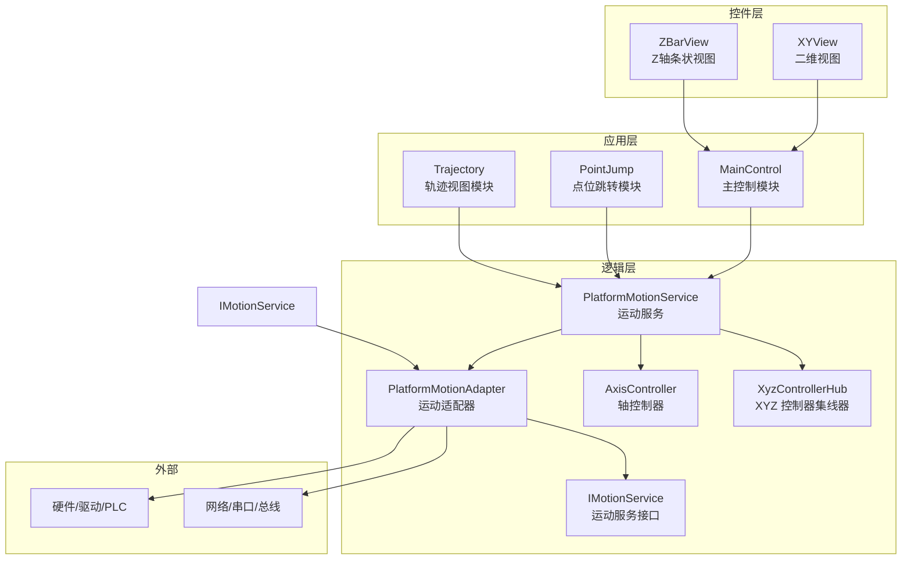
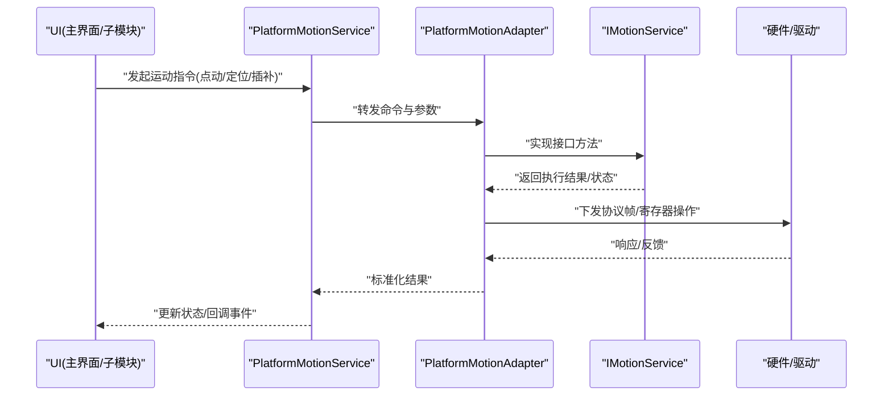
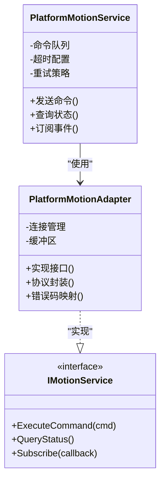
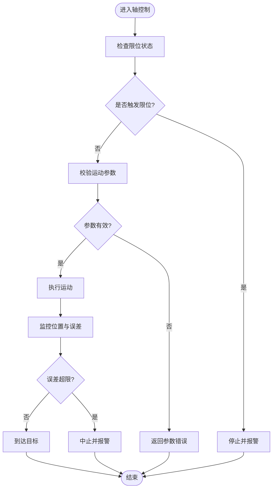
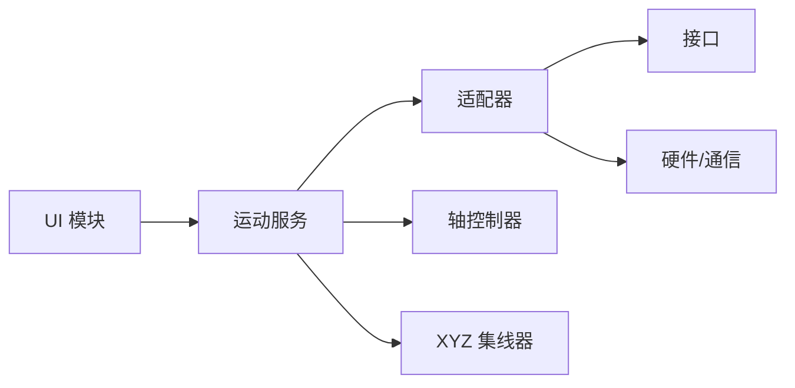

# 故障排除

<cite>
**本文引用的文件**   
- [README.md](file://README.md)
- [ProcessModules.csproj](file://ProcessModules.csproj)
- [MainControl/MainControlProcessModule.cs](file://MainControl/MainControlProcessModule.cs)
- [MainControl/RunForm.cs](file://MainControl/RunForm.cs)
- [MainControl/AxisLimitForm.cs](file://MainControl/AxisLimitForm.cs)
- [Logic/PlatformMotionService.cs](file://Logic/PlatformMotionService.cs)
- [Logic/PlatformMotionAdapter.cs](file://Logic/PlatformMotionAdapter.cs)
- [Logic/AxisController.cs](file://Logic/AxisController.cs)
- [Logic/IMotionService.cs](file://Logic/IMotionService.cs)
- [Logic/XyzControllerHub.cs](file://Logic/XyzControllerHub.cs)
- [PointJump/PointJumpProcessModule.cs](file://PointJump/PointJumpProcessModule.cs)
- [Trajectory/TrajectoryViewProcessModule.cs](file://Trajectory/TrajectoryViewProcessModule.cs)
- [Controls/XYView.cs](file://Controls/XYView.cs)
- [Controls/ZBarView.cs](file://Controls/ZBarView.cs)
- [DOMO/DOMO.CS](file://DOMO/DOMO.CS)
- [DOMO/MAINMODUO.CS](file://DOMO/MAINMODUO.CS)
</cite>

## 目录
1. [简介](#简介)
2. [项目结构](#项目结构)
3. [核心组件](#核心组件)
4. [架构总览](#架构总览)
5. [详细组件分析](#详细组件分析)
6. [依赖关系分析](#依赖关系分析)
7. [性能注意事项](#性能注意事项)
8. [故障排除指南](#故障排除指南)
9. [结论](#结论)
10. [附录](#附录)

## 简介
本指南面向 ProcessModules 框架的使用者与开发者，聚焦于运动控制、UI 交互、网络通信与硬件接口等关键路径的常见问题定位与解决。内容涵盖症状识别、原因分析、解决方案、调试技巧（日志、断点、性能分析）、错误代码参考与异常处理最佳实践，以及社区支持渠道。目标是帮助读者快速恢复系统稳定运行并持续优化性能。

## 项目结构
本项目采用模块化设计，包含主控界面、点位跳转、轨迹视图、通用运动逻辑与控件库等模块。各模块通过进程模块入口进行集成，运动服务与适配器负责与底层硬件或仿真平台交互。

图表来源
- [MainControl/MainControlProcessModule.cs](file://MainControl/MainControlProcessModule.cs)
- [PointJump/PointJumpProcessModule.cs](file://PointJump/PointJumpProcessModule.cs)
- [Trajectory/TrajectoryViewProcessModule.cs](file://Trajectory/TrajectoryViewProcessModule.cs)
- [Logic/PlatformMotionService.cs](file://Logic/PlatformMotionService.cs)
- [Logic/PlatformMotionAdapter.cs](file://Logic/PlatformMotionAdapter.cs)
- [Logic/AxisController.cs](file://Logic/AxisController.cs)
- [Logic/IMotionService.cs](file://Logic/IMotionService.cs)
- [Logic/XyzControllerHub.cs](file://Logic/XyzControllerHub.cs)
- [Controls/XYView.cs](file://Controls/XYView.cs)
- [Controls/ZBarView.cs](file://Controls/ZBarView.cs)

章节来源
- [README.md](file://README.md)
- [ProcessModules.csproj](file://ProcessModules.csproj)

## 核心组件
- 运动服务与适配器：PlatformMotionService 提供统一运动能力，PlatformMotionAdapter 封装具体硬件/协议差异，IMotionService 定义契约。
- 轴控制器：AxisController 管理单轴状态、限位、回零、速度/加速度等参数。
- XYZ 控制器集线器：XyzControllerHub 协调多轴联动与插补。
- UI 控件：XYView、ZBarView 用于实时位置与状态可视化。
- 模块入口：MainControlProcessModule、PointJumpProcessModule、TrajectoryViewProcessModule 作为功能域入口。

章节来源
- [Logic/PlatformMotionService.cs](file://Logic/PlatformMotionService.cs)
- [Logic/PlatformMotionAdapter.cs](file://Logic/PlatformMotionAdapter.cs)
- [Logic/IMotionService.cs](file://Logic/IMotionService.cs)
- [Logic/AxisController.cs](file://Logic/AxisController.cs)
- [Logic/XyzControllerHub.cs](file://Logic/XyzControllerHub.cs)
- [Controls/XYView.cs](file://Controls/XYView.cs)
- [Controls/ZBarView.cs](file://Controls/ZBarView.cs)
- [MainControl/MainControlProcessModule.cs](file://MainControl/MainControlProcessModule.cs)
- [PointJump/PointJumpProcessModule.cs](file://PointJump/PointJumpProcessModule.cs)
- [Trajectory/TrajectoryViewProcessModule.cs](file://Trajectory/TrajectoryViewProcessModule.cs)

## 架构总览
下图展示从 UI 到运动服务、再到硬件适配器的调用链路与数据流向。

图表来源
- [Logic/PlatformMotionService.cs](file://Logic/PlatformMotionService.cs)
- [Logic/PlatformMotionAdapter.cs](file://Logic/PlatformMotionAdapter.cs)
- [Logic/IMotionService.cs](file://Logic/IMotionService.cs)

## 详细组件分析

### 运动服务与适配器（PlatformMotionService / PlatformMotionAdapter）
- 职责：统一运动 API、命令队列、状态同步、异常重试与超时控制；适配器屏蔽不同硬件差异。
- 关键点：
  - 命令入队与并发控制，避免重复触发与死锁。
  - 超时与重试策略，区分瞬时抖动与真实故障。
  - 状态机：空闲、运行中、暂停、报警、急停。
  - 回调与事件：位置更新、完成事件、错误上报。
- 常见故障点：
  - 适配器未正确初始化导致命令无响应。
  - 超时阈值设置不当引发误判。
  - 回调线程与 UI 线程冲突造成卡顿或崩溃。

图表来源
- [Logic/PlatformMotionService.cs](file://Logic/PlatformMotionService.cs)
- [Logic/PlatformMotionAdapter.cs](file://Logic/PlatformMotionAdapter.cs)
- [Logic/IMotionService.cs](file://Logic/IMotionService.cs)

章节来源
- [Logic/PlatformMotionService.cs](file://Logic/PlatformMotionService.cs)
- [Logic/PlatformMotionAdapter.cs](file://Logic/PlatformMotionAdapter.cs)
- [Logic/IMotionService.cs](file://Logic/IMotionService.cs)

### 轴控制器（AxisController）
- 职责：单轴参数管理（目标位置、速度、加速度、加减速曲线）、限位检测、回零流程、误差补偿。
- 关键点：
  - 限位开关与软限位的优先级与互斥。
  - 回零算法与原点标定。
  - 误差累积与补偿策略。
- 常见故障点：
  - 限位触发后未复位导致无法运动。
  - 回零失败因传感器信号不稳定。
  - 参数不一致导致定位偏差。

图表来源
- [Logic/AxisController.cs](file://Logic/AxisController.cs)

章节来源
- [Logic/AxisController.cs](file://Logic/AxisController.cs)

### XYZ 控制器集线器（XyzControllerHub）
- 职责：多轴协调、插补规划、同步控制、冲突仲裁。
- 关键点：
  - 多轴速度/加速度匹配。
  - 路径平滑与加减速曲线。
  - 异常时安全停机与回退。
- 常见故障点：
  - 轴间不同步导致轨迹畸变。
  - 插补参数过大引起振动或丢步。

章节来源
- [Logic/XyzControllerHub.cs](file://Logic/XyzControllerHub.cs)

### UI 控件（XYView / ZBarView）
- 职责：实时绘制位置、状态指示、用户交互。
- 关键点：
  - 高频率刷新与 UI 线程安全。
  - 数据绑定与增量更新。
- 常见故障点：
  - 刷新过快导致 UI 卡顿。
  - 跨线程访问控件引发异常。

章节来源
- [Controls/XYView.cs](file://Controls/XYView.cs)
- [Controls/ZBarView.cs](file://Controls/ZBarView.cs)

### 模块入口（MainControl / PointJump / Trajectory）
- 职责：加载配置、初始化服务、注册事件、生命周期管理。
- 关键点：
  - 依赖注入顺序与初始化时序。
  - 资源释放与清理。
- 常见故障点：
  - 模块未正确启动导致服务不可用。
  - 配置项缺失或类型不匹配。

章节来源
- [MainControl/MainControlProcessModule.cs](file://MainControl/MainControlProcessModule.cs)
- [PointJump/PointJumpProcessModule.cs](file://PointJump/PointJumpProcessModule.cs)
- [Trajectory/TrajectoryViewProcessModule.cs](file://Trajectory/TrajectoryViewProcessModule.cs)

## 依赖关系分析
- 模块间耦合：UI 模块依赖运动服务，运动服务依赖适配器与轴控制器。
- 外部依赖：硬件驱动、通信协议（串口/以太网/CAN 等）。
- 潜在循环依赖：应避免 UI 直接依赖硬件，通过服务层解耦。

图表来源
- [MainControl/MainControlProcessModule.cs](file://MainControl/MainControlProcessModule.cs)
- [Logic/PlatformMotionService.cs](file://Logic/PlatformMotionService.cs)
- [Logic/PlatformMotionAdapter.cs](file://Logic/PlatformMotionAdapter.cs)
- [Logic/AxisController.cs](file://Logic/AxisController.cs)
- [Logic/XyzControllerHub.cs](file://Logic/XyzControllerHub.cs)
- [Logic/IMotionService.cs](file://Logic/IMotionService.cs)

章节来源
- [ProcessModules.csproj](file://ProcessModules.csproj)

## 性能注意事项
- 减少 UI 刷新频率，采用增量更新与批处理。
- 运动命令去抖与合并，避免频繁小步长触发。
- 合理设置超时与重试次数，避免阻塞主线程。
- 使用异步 I/O 与线程池，避免 CPU 占用过高。
- 内存分配优化：重用对象、避免频繁 GC。

[本节为通用指导，无需特定文件引用]

## 故障排除指南

### 一、运动控制类问题

#### 1. 轴定位不准
- 症状：实际位置与目标存在固定偏差或随机漂移。
- 可能原因：
  - 脉冲当量/传动比配置错误。
  - 编码器反馈未校准或零点偏移。
  - 机械间隙与背隙未补偿。
  - 加减速曲线过激导致丢步。
- 排查步骤：
  - 核对轴参数与机械传动比。
  - 执行回零与原点标定流程。
  - 降低速度与加速度测试稳定性。
  - 启用误差补偿并观察收敛情况。
- 解决方案：
  - 修正参数并重新标定。
  - 调整加减速曲线与闭环增益。
  - 增加机械刚性或更换高精度部件。

章节来源
- [Logic/AxisController.cs](file://Logic/AxisController.cs)

#### 2. 运动卡顿或抖动
- 症状：运行过程中出现停顿、抖动或轨迹不平滑。
- 可能原因：
  - 插补参数过大或轴间不同步。
  - UI 刷新占用过多 CPU。
  - 通信延迟或丢包。
- 排查步骤：
  - 降低插补频率与步长。
  - 分离 UI 刷新与计算线程。
  - 检查通信链路质量与重传机制。
- 解决方案：
  - 优化插补算法与缓冲大小。
  - 使用双缓冲与增量绘制。
  - 提升通信带宽或改用更可靠协议。

章节来源
- [Logic/XyzControllerHub.cs](file://Logic/XyzControllerHub.cs)
- [Controls/XYView.cs](file://Controls/XYView.cs)

#### 3. 通信超时
- 症状：命令下发后长时间无响应或频繁超时。
- 可能原因：
  - 端口/地址配置错误。
  - 设备离线或驱动异常。
  - 网络拥塞或防火墙拦截。
- 排查步骤：
  - 验证端口、IP、波特率等基础配置。
  - 使用抓包工具捕获协议帧。
  - 检查设备状态灯与驱动日志。
- 解决方案：
  - 修正配置并重连。
  - 增加超时阈值与重试策略。
  - 隔离网络干扰或升级驱动。

章节来源
- [Logic/PlatformMotionAdapter.cs](file://Logic/PlatformMotionAdapter.cs)

#### 4. 限位触发无法复位
- 症状：限位开关触发后无法继续运动。
- 可能原因：
  - 硬限位未解除或传感器损坏。
  - 软件限位阈值设置过小。
  - 报警状态未清除。
- 排查步骤：
  - 检查限位传感器状态与接线。
  - 查看报警码并清除报警。
  - 手动回退至安全区域。
- 解决方案：
  - 修复硬件或替换传感器。
  - 调整软限位阈值。
  - 按流程复位报警并重启。

章节来源
- [Logic/AxisController.cs](file://Logic/AxisController.cs)

#### 5. 回零失败
- 症状：回零过程反复失败或找不到原点。
- 可能原因：
  - 原点传感器信号不稳定。
  - 回零速度过快或方向错误。
  - 机械卡滞或皮带打滑。
- 排查步骤：
  - 检查原点信号波形与滤波设置。
  - 降低回零速度并确认方向。
  - 检查机械传动部件。
- 解决方案：
  - 优化信号滤波与迟滞。
  - 调整回零策略与等待时间。
  - 维护机械部件。

章节来源
- [Logic/AxisController.cs](file://Logic/AxisController.cs)

### 二、UI 相关问题

#### 1. 界面卡顿或无响应
- 症状：拖动窗口、切换页面时明显卡顿。
- 可能原因：
  - 高频刷新与复杂绘制。
  - 主线程阻塞。
- 排查步骤：
  - 使用性能分析工具定位热点。
  - 拆分耗时任务到后台线程。
- 解决方案：
  - 降低刷新频率与简化绘制。
  - 使用异步与线程池。

章节来源
- [Controls/XYView.cs](file://Controls/XYView.cs)
- [MainControl/RunForm.cs](file://MainControl/RunForm.cs)

#### 2. 数据显示异常
- 症状：位置数值跳变、颜色错乱或控件不更新。
- 可能原因：
  - 数据绑定线程不安全。
  - 数据类型转换错误。
- 排查步骤：
  - 检查跨线程访问与调度。
  - 验证数据源与格式。
- 解决方案：
  - 使用线程安全的更新机制。
  - 统一数据模型与序列化。

章节来源
- [Controls/ZBarView.cs](file://Controls/ZBarView.cs)

### 三、网络通信与硬件接口

#### 1. 连接建立失败
- 症状：启动即报连接错误。
- 可能原因：
  - 端口占用或权限不足。
  - 设备未上电或驱动未安装。
- 排查步骤：
  - 使用端口扫描与 ping 测试。
  - 检查设备管理器与驱动版本。
- 解决方案：
  - 释放端口或更改端口号。
  - 安装或更新驱动。

章节来源
- [Logic/PlatformMotionAdapter.cs](file://Logic/PlatformMotionAdapter.cs)

#### 2. 数据解析错误
- 症状：收到数据但解析失败或乱码。
- 可能原因：
  - 字节序或编码不一致。
  - 帧头/校验位错误。
- 排查步骤：
  - 对比协议文档与抓包数据。
  - 逐步打印中间变量。
- 解决方案：
  - 统一编码与字节序。
  - 增强校验与容错。

章节来源
- [Logic/PlatformMotionAdapter.cs](file://Logic/PlatformMotionAdapter.cs)

### 四、错误代码参考与异常处理

- 建议的错误分类：
  - 通信类：连接失败、超时、校验错误。
  - 运动类：限位触发、过载、失步。
  - 配置类：参数非法、文件损坏。
  - 资源类：内存不足、句柄泄漏。
- 异常处理最佳实践：
  - 明确异常边界，避免吞掉异常。
  - 记录上下文信息（时间、参数、堆栈）。
  - 提供可恢复策略（重试、降级、回滚）。
  - 对外暴露统一错误码与消息。

章节来源
- [Logic/PlatformMotionService.cs](file://Logic/PlatformMotionService.cs)
- [Logic/PlatformMotionAdapter.cs](file://Logic/PlatformMotionAdapter.cs)

### 五、调试技巧与工具

- 日志分析：
  - 分级日志（DEBUG/INFO/WARN/ERROR）。
  - 结构化日志（JSON），便于检索与聚合。
  - 关键路径埋点（命令下发、响应、错误）。
- 断点调试：
  - 在命令入口、适配器收发、回调处设断点。
  - 条件断点过滤噪声。
- 性能分析：
  - CPU 采样与热点函数定位。
  - 内存分配与 GC 压力分析。
  - I/O 延迟与吞吐统计。

章节来源
- [MainControl/MainControlProcessModule.cs](file://MainControl/MainControlProcessModule.cs)
- [Logic/PlatformMotionService.cs](file://Logic/PlatformMotionService.cs)

### 六、内存泄漏检测与资源管理

- 症状：运行一段时间后内存持续增长、界面变慢。
- 排查步骤：
  - 使用内存快照对比增长对象。
  - 检查事件订阅未取消、定时器未释放。
  - 审查大对象缓存与字典膨胀。
- 解决方案：
  - 使用 using 与 Dispose 模式。
  - 弱引用与缓存淘汰策略。
  - 定期清理与重置状态。

章节来源
- [MainControl/RunForm.cs](file://MainControl/RunForm.cs)
- [Logic/PlatformMotionService.cs](file://Logic/PlatformMotionService.cs)

### 七、模块初始化与生命周期

- 症状：部分功能不可用或启动时报错。
- 排查步骤：
  - 检查模块加载顺序与依赖注入。
  - 验证配置文件与默认值。
- 解决方案：
  - 明确初始化契约与错误回滚。
  - 提供健康检查与自检。

章节来源
- [MainControl/MainControlProcessModule.cs](file://MainControl/MainControlProcessModule.cs)
- [PointJump/PointJumpProcessModule.cs](file://PointJump/PointJumpProcessModule.cs)
- [Trajectory/TrajectoryViewProcessModule.cs](file://Trajectory/TrajectoryViewProcessModule.cs)

### 八、其他常见问题

- DOMO 相关：
  - 现象：自定义模块运行异常。
  - 排查：检查入口方法与事件绑定。
- 限制表单：
  - 现象：限位设置不生效。
  - 排查：确认软限位与硬限位优先级。

章节来源
- [DOMO/DOMO.CS](file://DOMO/DOMO.CS)
- [DOMO/MAINMODUO.CS](file://DOMO/MAINMODUO.CS)
- [MainControl/AxisLimitForm.cs](file://MainControl/AxisLimitForm.cs)

## 结论
通过系统化梳理运动控制、UI、通信与资源管理等关键环节，结合日志、断点与性能分析工具，能够快速定位并解决 ProcessModules 框架中的典型问题。建议在生产环境启用结构化日志与健康检查，持续监控关键指标，预防潜在风险。

## 附录

### A. 常用调试清单
- 确认配置项与硬件连接。
- 开启 DEBUG 日志并抓取关键路径。
- 使用抓包工具验证协议帧。
- 分阶段降低复杂度定位问题。

### B. 性能优化建议
- 减少 UI 刷新与绘制开销。
- 合并与去抖运动命令。
- 使用异步与线程池。
- 优化数据结构与缓存策略。

### C. 社区支持与获取帮助
- 查阅项目 README 与说明文档。
- 提交 Issue 并附上日志与复现步骤。
- 参与讨论区与技术交流。

[本节为通用指导，无需特定文件引用]