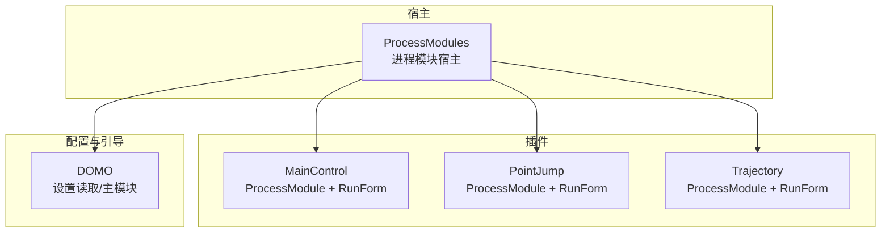
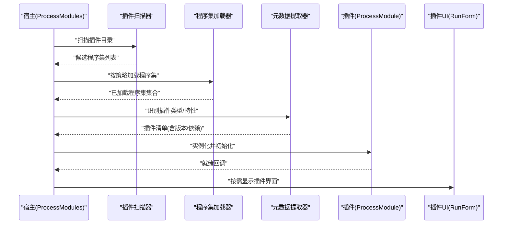
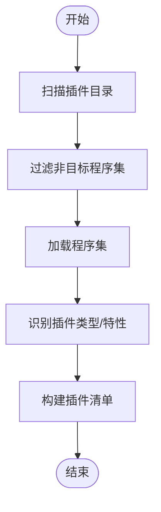
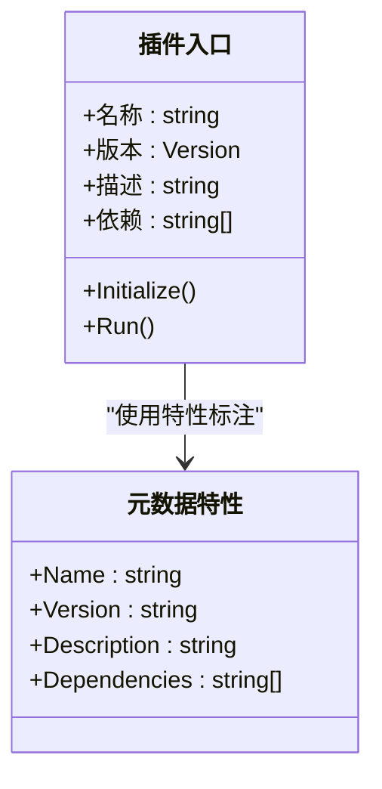
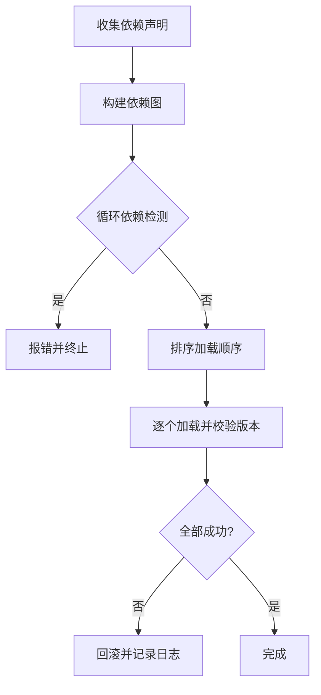
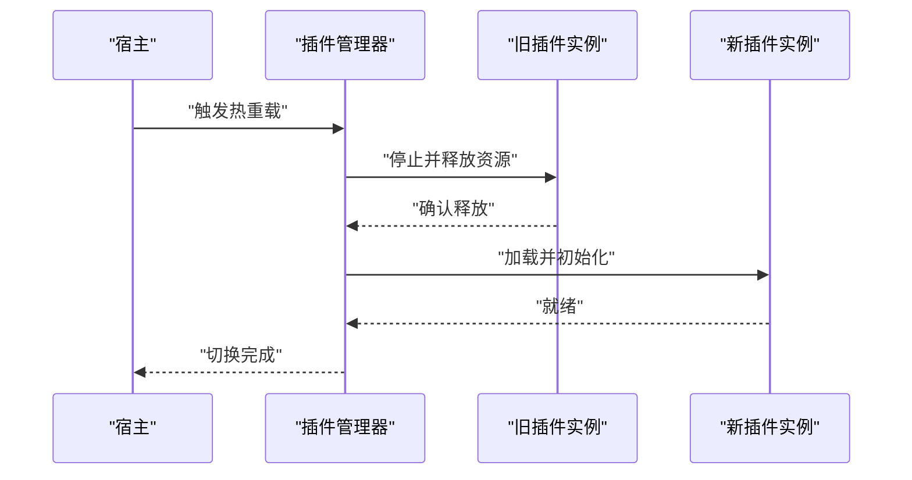
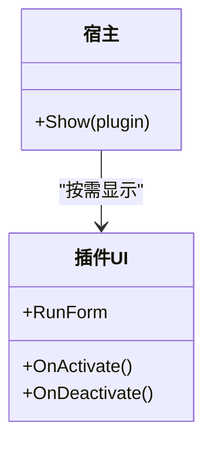
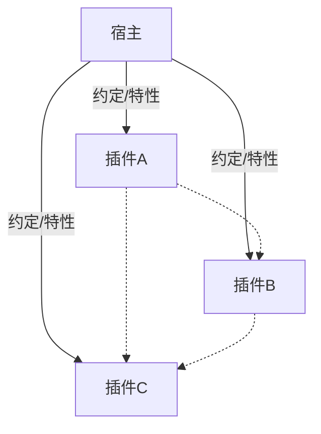

# 插件发现与动态加载

<cite>
**本文引用的文件**   
- [ProcessModules.csproj](file://ProcessModules.csproj)
- [MainControl/MainControlProcessModule.cs](file://MainControl/MainControlProcessModule.cs)
- [PointJump/PointJumpProcessModule.cs](file://PointJump/PointJumpProcessModule.cs)
- [Trajectory/TrajectoryViewProcessModule.cs](file://Trajectory/TrajectoryViewProcessModule.cs)
- [MainControl/MainControlGlobalSetting.cs](file://MainControl/MainControlGlobalSetting.cs)
- [PointJump/PointJumpGlobalSetting.cs](file://PointJump/PointJumpGlobalSetting.cs)
- [Trajectory/TrajectoryGlobalSetting.cs](file://Trajectory/TrajectoryGlobalSetting.cs)
- [MainControl/MainControlProjectSetting.cs](file://MainControl/MainControlProjectSetting.cs)
- [PointJump/PointJumpProjectSetting.cs](file://PointJump/PointJumpProjectSetting.cs)
- [Trajectory/TrajectoryProjectSetting.cs](file://Trajectory/TrajectoryProjectSetting.cs)
- [MainControl/RunForm.cs](file://MainControl/RunForm.cs)
- [PointJump/RunForm.cs](file://PointJump/RunForm.cs)
- [Trajectory/RunForm.cs](file://Trajectory/RunForm.cs)
- [DOMO/DOMO.CS](file://DOMO/DOMO.CS)
- [DOMO/MAINMODUO.CS](file://DOMO/MAINMODUO.CS)
- [DOMO/GETSEETING.CS](file://DOMO/GETSEETING.CS)
- [AGENTS.md](file://AGENTS.md)
- [README.md](file://README.md)
</cite>

## 目录
1. [简介](#简介)
2. [项目结构](#项目结构)
3. [核心组件](#核心组件)
4. [架构总览](#架构总览)
5. [详细组件分析](#详细组件分析)
6. [依赖分析](#依赖分析)
7. [性能考虑](#性能考虑)
8. [故障排除指南](#故障排除指南)
9. [结论](#结论)
10. [附录](#附录)

## 简介
本技术文档围绕 ProcessModules 框架的“插件发现与动态加载机制”展开，重点覆盖以下方面：
- 插件扫描算法：目录遍历、程序集加载、类型识别
- 插件元数据提取：特性标记、配置文件解析、版本信息获取
- 插件依赖解析：静态依赖分析与运行时依赖检查
- 插件隔离机制：命名空间隔离、程序集隔离、权限控制
- 插件热重载：不停止服务更新插件
- 性能优化：延迟加载、缓存机制、并行加载
- 实现示例与故障排除

该文档面向希望理解或扩展 ProcessModules 插件体系的开发者，兼顾非专业读者的可读性。

## 项目结构
仓库采用多项目（Multi-Project）组织方式，包含主应用与多个插件项目：
- 主工程：ProcessModules.csproj（承载宿主与插件管理逻辑）
- 插件工程：MainControl、PointJump、Trajectory（每个插件提供独立的 ProcessModule 入口与 UI）
- DOMO 模块：用于设置读取与主模块协调（可能承担配置与引导职责）
- 资源与说明：README.md、AGENTS.md 等

图表来源
- [ProcessModules.csproj](file://ProcessModules.csproj)
- [MainControl/MainControlProcessModule.cs](file://MainControl/MainControlProcessModule.cs)
- [PointJump/PointJumpProcessModule.cs](file://PointJump/PointJumpProcessModule.cs)
- [Trajectory/TrajectoryViewProcessModule.cs](file://Trajectory/TrajectoryViewProcessModule.cs)
- [DOMO/DOMO.CS](file://DOMO/DOMO.CS)
- [DOMO/MAINMODUO.CS](file://DOMO/MAINMODUO.CS)

章节来源
- [ProcessModules.csproj](file://ProcessModules.csproj)
- [README.md](file://README.md)

## 核心组件
- 插件入口类（各插件均提供）：ProcessModule 派生类，作为插件的发现与生命周期入口
- 运行表单（各插件均提供）：RunForm，承载插件 UI 与交互
- 全局设置与项目设置：GlobalSetting/ProjectSetting，用于插件配置与参数持久化
- 宿主与引导：DOMO 模块负责设置读取与主模块协调

这些组件共同构成“插件即项目”的可插拔架构，便于独立构建、部署与升级。

章节来源
- [MainControl/MainControlProcessModule.cs](file://MainControl/MainControlProcessModule.cs)
- [PointJump/PointJumpProcessModule.cs](file://PointJump/PointJumpProcessModule.cs)
- [Trajectory/TrajectoryViewProcessModule.cs](file://Trajectory/TrajectoryViewProcessModule.cs)
- [MainControl/RunForm.cs](file://MainControl/RunForm.cs)
- [PointJump/RunForm.cs](file://PointJump/RunForm.cs)
- [Trajectory/RunForm.cs](file://Trajectory/RunForm.cs)
- [MainControl/MainControlGlobalSetting.cs](file://MainControl/MainControlGlobalSetting.cs)
- [PointJump/PointJumpGlobalSetting.cs](file://PointJump/PointJumpGlobalSetting.cs)
- [Trajectory/TrajectoryGlobalSetting.cs](file://Trajectory/TrajectoryGlobalSetting.cs)
- [MainControl/MainControlProjectSetting.cs](file://MainControl/MainControlProjectSetting.cs)
- [PointJump/PointJumpProjectSetting.cs](file://PointJump/PointJumpProjectSetting.cs)
- [Trajectory/TrajectoryProjectSetting.cs](file://Trajectory/TrajectoryProjectSetting.cs)
- [DOMO/DOMO.CS](file://DOMO/DOMO.CS)
- [DOMO/MAINMODUO.CS](file://DOMO/MAINMODUO.CS)

## 架构总览
下图展示宿主如何发现并加载插件，以及插件内部的主要交互关系。

图表来源
- [DOMO/DOMO.CS](file://DOMO/DOMO.CS)
- [DOMO/MAINMODUO.CS](file://DOMO/MAINMODUO.CS)
- [MainControl/MainControlProcessModule.cs](file://MainControl/MainControlProcessModule.cs)
- [PointJump/PointJumpProcessModule.cs](file://PointJump/PointJumpProcessModule.cs)
- [Trajectory/TrajectoryViewProcessModule.cs](file://Trajectory/TrajectoryViewProcessModule.cs)

## 详细组件分析

### 插件扫描与发现
- 目录遍历：宿主从指定目录递归扫描可执行/库文件（如 .dll/.exe），过滤系统与非目标程序集
- 程序集加载：使用安全策略加载候选程序集，避免加载不可信代码
- 类型识别：通过约定（如继承自基类）或特性标记识别插件入口类型

图表来源
- [DOMO/DOMO.CS](file://DOMO/DOMO.CS)
- [DOMO/MAINMODUO.CS](file://DOMO/MAINMODUO.CS)

章节来源
- [DOMO/DOMO.CS](file://DOMO/DOMO.CS)
- [DOMO/MAINMODUO.CS](file://DOMO/MAINMODUO.CS)

### 插件元数据提取
- 特性标记：在插件入口类上标注自定义特性，以声明名称、版本、描述、依赖等信息
- 配置文件解析：读取插件级或宿主级配置文件，补充或覆盖元数据
- 版本信息获取：从程序集元数据或特性中获取版本号，用于兼容性校验与热重载

图表来源
- [MainControl/MainControlProcessModule.cs](file://MainControl/MainControlProcessModule.cs)
- [PointJump/PointJumpProcessModule.cs](file://PointJump/PointJumpProcessModule.cs)
- [Trajectory/TrajectoryViewProcessModule.cs](file://Trajectory/TrajectoryViewProcessModule.cs)

章节来源
- [MainControl/MainControlGlobalSetting.cs](file://MainControl/MainControlGlobalSetting.cs)
- [PointJump/PointJumpGlobalSetting.cs](file://PointJump/PointJumpGlobalSetting.cs)
- [Trajectory/TrajectoryGlobalSetting.cs](file://Trajectory/TrajectoryGlobalSetting.cs)
- [MainControl/MainControlProjectSetting.cs](file://MainControl/MainControlProjectSetting.cs)
- [PointJump/PointJumpProjectSetting.cs](file://PointJump/PointJumpProjectSetting.cs)
- [Trajectory/TrajectoryProjectSetting.cs](file://Trajectory/TrajectoryProjectSetting.cs)

### 插件依赖解析
- 静态依赖分析：基于程序集引用与特性声明，生成依赖图
- 运行时依赖检查：加载时验证依赖是否存在、版本是否兼容，失败则回滚并记录错误

图表来源
- [DOMO/DOMO.CS](file://DOMO/DOMO.CS)
- [DOMO/MAINMODUO.CS](file://DOMO/MAINMODUO.CS)

章节来源
- [DOMO/DOMO.CS](file://DOMO/DOMO.CS)
- [DOMO/MAINMODUO.CS](file://DOMO/MAINMODUO.CS)

### 插件隔离机制
- 命名空间隔离：插件使用独立命名空间，避免类型冲突
- 程序集隔离：每个插件加载到独立 AppDomain 或 AssemblyLoadContext（视运行时能力），防止相互干扰
- 权限控制：限制插件对系统资源的访问，仅暴露必要接口

图表来源
- [MainControl/MainControlProcessModule.cs](file://MainControl/MainControlProcessModule.cs)
- [PointJump/PointJumpProcessModule.cs](file://PointJump/PointJumpProcessModule.cs)
- [Trajectory/TrajectoryViewProcessModule.cs](file://Trajectory/TrajectoryViewProcessModule.cs)

章节来源
- [MainControl/MainControlProcessModule.cs](file://MainControl/MainControlProcessModule.cs)
- [PointJump/PointJumpProcessModule.cs](file://PointJump/PointJumpProcessModule.cs)
- [Trajectory/TrajectoryViewProcessModule.cs](file://Trajectory/TrajectoryViewProcessModule.cs)

### 插件热重载
- 卸载旧版本：释放资源、停止任务、移除事件订阅
- 加载新版本：重新扫描并加载新程序集，保持状态迁移
- 无缝切换：通过适配器或代理模式隐藏切换细节，保证 UI 与业务连续性

图表来源
- [DOMO/DOMO.CS](file://DOMO/DOMO.CS)
- [DOMO/MAINMODUO.CS](file://DOMO/MAINMODUO.CS)

章节来源
- [DOMO/DOMO.CS](file://DOMO/DOMO.CS)
- [DOMO/MAINMODUO.CS](file://DOMO/MAINMODUO.CS)

### 插件 UI 集成
- 每个插件提供 RunForm，宿主根据插件清单按需创建并显示
- UI 与业务逻辑解耦，便于独立测试与替换

图表来源
- [MainControl/RunForm.cs](file://MainControl/RunForm.cs)
- [PointJump/RunForm.cs](file://PointJump/RunForm.cs)
- [Trajectory/RunForm.cs](file://Trajectory/RunForm.cs)

章节来源
- [MainControl/RunForm.cs](file://MainControl/RunForm.cs)
- [PointJump/RunForm.cs](file://PointJump/RunForm.cs)
- [Trajectory/RunForm.cs](file://Trajectory/RunForm.cs)

## 依赖分析
- 宿主与插件之间通过约定（基类/接口）和特性进行松耦合
- 插件间不直接依赖，所有通信通过宿主提供的 API 或消息总线

图表来源
- [ProcessModules.csproj](file://ProcessModules.csproj)
- [MainControl/MainControlProcessModule.cs](file://MainControl/MainControlProcessModule.cs)
- [PointJump/PointJumpProcessModule.cs](file://PointJump/PointJumpProcessModule.cs)
- [Trajectory/TrajectoryViewProcessModule.cs](file://Trajectory/TrajectoryViewProcessModule.cs)

章节来源
- [ProcessModules.csproj](file://ProcessModules.csproj)
- [MainControl/MainControlProcessModule.cs](file://MainControl/MainControlProcessModule.cs)
- [PointJump/PointJumpProcessModule.cs](file://PointJump/PointJumpProcessModule.cs)
- [Trajectory/TrajectoryViewProcessModule.cs](file://Trajectory/TrajectoryViewProcessModule.cs)

## 性能考虑
- 延迟加载：仅在首次使用时加载插件，减少启动时间
- 缓存机制：缓存插件清单、类型信息与已加载的程序集，避免重复扫描与加载
- 并行加载：对无依赖的插件并行加载，提升整体吞吐
- 资源清理：及时释放未使用插件的资源，降低内存占用

[本节为通用指导，无需特定文件引用]

## 故障排除指南
- 插件未被发现：检查目录扫描路径与过滤规则；确认程序集命名符合约定
- 加载失败：查看异常堆栈，确认依赖缺失或版本不兼容；启用详细日志
- 热重载失败：确保正确释放资源与事件订阅；验证新旧版本接口兼容性
- UI 无法显示：检查 RunForm 构造与激活流程；确认宿主调用时机

章节来源
- [DOMO/DOMO.CS](file://DOMO/DOMO.CS)
- [DOMO/MAINMODUO.CS](file://DOMO/MAINMODUO.CS)
- [MainControl/MainControlProcessModule.cs](file://MainControl/MainControlProcessModule.cs)
- [PointJump/PointJumpProcessModule.cs](file://PointJump/PointJumpProcessModule.cs)
- [Trajectory/TrajectoryViewProcessModule.cs](file://Trajectory/TrajectoryViewProcessModule.cs)

## 结论
ProcessModules 通过“插件即项目”的架构实现了高内聚、低耦合的可扩展体系。借助目录扫描、特性标记与配置解析，插件能够被自动发现与加载；通过依赖解析与隔离机制，保障稳定与安全；结合热重载与性能优化策略，满足生产环境的持续演进需求。建议在实际使用中遵循约定、完善日志与监控，以提升可维护性与可观测性。

[本节为总结，无需特定文件引用]

## 附录
- 最佳实践
  - 明确插件边界与职责，避免跨插件直接依赖
  - 使用特性与配置文件集中管理元数据
  - 设计稳定的宿主 API，向后兼容
- 参考文件
  - [AGENTS.md](file://AGENTS.md)
  - [README.md](file://README.md)

[本节为附录，无需特定文件引用]