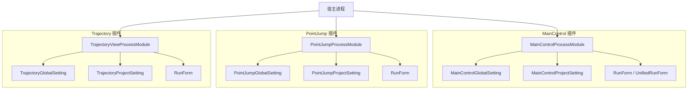
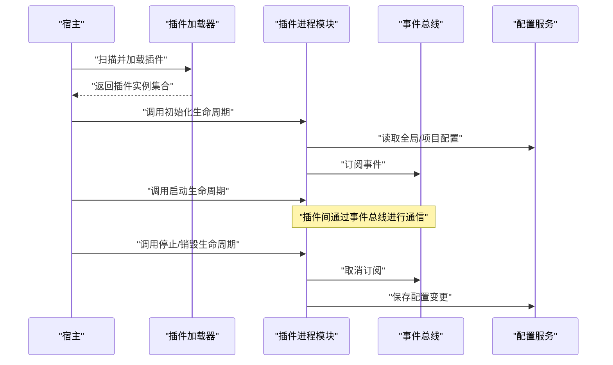
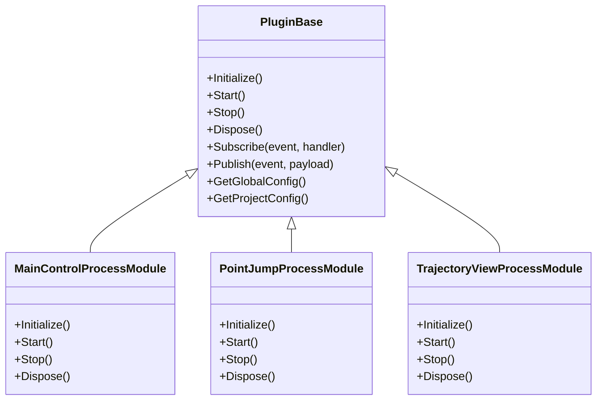
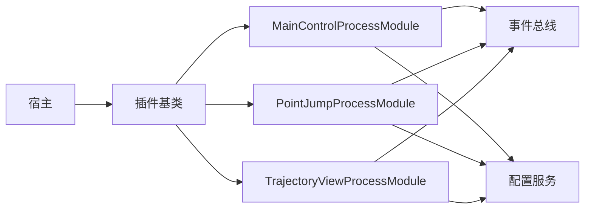

# 插件接口设计

<cite>
**本文档引用的文件**   
- [MainControlProcessModule.cs](file://MainControl/MainControlProcessModule.cs)
- [PointJumpProcessModule.cs](file://PointJump/PointJumpProcessModule.cs)
- [TrajectoryViewProcessModule.cs](file://Trajectory/TrajectoryViewProcessModule.cs)
- [MainControlGlobalSetting.cs](file://MainControl/MainControlGlobalSetting.cs)
- [PointJumpGlobalSetting.cs](file://PointJump/PointJumpGlobalSetting.cs)
- [TrajectoryGlobalSetting.cs](file://Trajectory/TrajectoryGlobalSetting.cs)
- [MainControlProjectSetting.cs](file://MainControl/MainControlProjectSetting.cs)
- [PointJumpProjectSetting.cs](file://PointJump/PointJumpProjectSetting.cs)
- [TrajectoryProjectSetting.cs](file://Trajectory/TrajectoryProjectSetting.cs)
- [README.md](file://README.md)
- [基类调整说明.md](file://基类调整说明.md)
- [重构完成报告.md](file://重构完成报告.md)
</cite>

## 目录
1. [简介](#简介)
2. [项目结构](#项目结构)
3. [核心组件](#核心组件)
4. [架构总览](#架构总览)
5. [详细组件分析](#详细组件分析)
6. [依赖关系分析](#依赖关系分析)
7. [性能考虑](#性能考虑)
8. [故障排查指南](#故障排查指南)
9. [结论](#结论)
10. [附录](#附录)

## 简介
本技术文档围绕 ProcessModules 框架的插件接口设计，系统阐述插件基类的设计原理、继承与抽象/虚方法约定、插件契约（必需实现的方法、事件处理与生命周期回调）、配置接口（全局配置与项目配置）以及插件间通信机制（事件总线与消息传递）。同时给出扩展接口与向后兼容的最佳实践，并提供标准插件实现的参考路径，帮助开发者快速构建稳定可扩展的插件。

## 项目结构
本项目采用按功能模块划分的插件化组织方式：每个插件以独立工程形式存在，包含 UI、逻辑、资源与设置等子目录；各插件通过统一的进程模块入口暴露给宿主加载。典型插件工程包括 MainControl、PointJump、Trajectory 等，它们各自提供：
- 进程模块入口（ProcessModule 派生类），用于注册生命周期、UI 与业务逻辑
- 全局配置与项目配置类，分别承载应用级与项目级设置
- 运行界面与视图控件，封装具体交互与展示

图表来源
- [MainControlProcessModule.cs](file://MainControl/MainControlProcessModule.cs)
- [PointJumpProcessModule.cs](file://PointJump/PointJumpProcessModule.cs)
- [TrajectoryViewProcessModule.cs](file://Trajectory/TrajectoryViewProcessModule.cs)
- [MainControlGlobalSetting.cs](file://MainControl/MainControlGlobalSetting.cs)
- [PointJumpGlobalSetting.cs](file://PointJump/PointJumpGlobalSetting.cs)
- [TrajectoryGlobalSetting.cs](file://Trajectory/TrajectoryGlobalSetting.cs)
- [MainControlProjectSetting.cs](file://MainControl/MainControlProjectSetting.cs)
- [PointJumpProjectSetting.cs](file://PointJump/PointJumpProjectSetting.cs)
- [TrajectoryProjectSetting.cs](file://Trajectory/TrajectoryProjectSetting.cs)

章节来源
- [README.md](file://README.md)
- [基类调整说明.md](file://基类调整说明.md)
- [重构完成报告.md](file://重构完成报告.md)

## 核心组件
- 插件进程模块基类（ProcessModuleBaseEx 或等价基类）
  - 定义插件生命周期钩子（初始化、启动、停止、销毁等）
  - 提供事件总线接入点与消息分发能力
  - 暴露配置访问器（全局配置与项目配置）
- 插件实现类（各插件的 *ProcessModule 派生类）
  - 实现必需的生命周期方法
  - 订阅/发布事件，实现跨插件通信
  - 读写配置项，管理自身状态与资源
- 配置类
  - 全局配置：应用级默认值与用户偏好
  - 项目配置：当前项目范围内的参数与状态

章节来源
- [MainControlProcessModule.cs](file://MainControl/MainControlProcessModule.cs)
- [PointJumpProcessModule.cs](file://PointJump/PointJumpProcessModule.cs)
- [TrajectoryViewProcessModule.cs](file://Trajectory/TrajectoryViewProcessModule.cs)
- [MainControlGlobalSetting.cs](file://MainControl/MainControlGlobalSetting.cs)
- [PointJumpGlobalSetting.cs](file://PointJump/PointJumpGlobalSetting.cs)
- [TrajectoryGlobalSetting.cs](file://Trajectory/TrajectoryGlobalSetting.cs)
- [MainControlProjectSetting.cs](file://MainControl/MainControlProjectSetting.cs)
- [PointJumpProjectSetting.cs](file://PointJump/PointJumpProjectSetting.cs)
- [TrajectoryProjectSetting.cs](file://Trajectory/TrajectoryProjectSetting.cs)

## 架构总览
下图展示了宿主加载插件、插件内部结构与配置的交互关系，以及事件总线在插件间的通信路径。

图表来源
- [MainControlProcessModule.cs](file://MainControl/MainControlProcessModule.cs)
- [PointJumpProcessModule.cs](file://PointJump/PointJumpProcessModule.cs)
- [TrajectoryViewProcessModule.cs](file://Trajectory/TrajectoryViewProcessModule.cs)

## 详细组件分析

### 插件基类与继承关系
- 基类职责
  - 统一生命周期：初始化、启动、停止、销毁等钩子
  - 事件总线集成：提供订阅/发布、命名空间隔离、错误隔离
  - 配置访问：提供全局与项目配置的统一入口
  - 资源管理：确保 UI、线程、句柄等资源正确释放
- 继承约定
  - 所有插件必须派生自统一基类
  - 禁止覆盖非标记为可重写的关键方法，避免破坏宿主行为
  - 推荐仅重写必要生命周期钩子，保持最小侵入

图表来源
- [MainControlProcessModule.cs](file://MainControl/MainControlProcessModule.cs)
- [PointJumpProcessModule.cs](file://PointJump/PointJumpProcessModule.cs)
- [TrajectoryViewProcessModule.cs](file://Trajectory/TrajectoryViewProcessModule.cs)

章节来源
- [基类调整说明.md](file://基类调整说明.md)
- [重构完成报告.md](file://重构完成报告.md)

### 插件契约规范
- 必需实现的方法
  - Initialize：加载资源、解析配置、建立依赖
  - Start：启动运行时服务、绑定 UI、开始监听事件
  - Stop：暂停服务、释放临时资源
  - Dispose：释放持久资源、取消订阅、关闭连接
- 事件处理
  - 使用事件总线订阅命名空间内的特定事件
  - 事件处理器需幂等且异常隔离，避免影响其他插件
- 生命周期回调
  - 严格遵循顺序：Initialize → Start → (运行期) → Stop → Dispose
  - 在 Stop/Dispose 中确保清理顺序与创建顺序相反

章节来源
- [MainControlProcessModule.cs](file://MainControl/MainControlProcessModule.cs)
- [PointJumpProcessModule.cs](file://PointJump/PointJumpProcessModule.cs)
- [TrajectoryViewProcessModule.cs](file://Trajectory/TrajectoryViewProcessModule.cs)

### 配置接口设计
- 全局配置（应用级）
  - 用途：跨项目共享的默认值、用户偏好、插件开关
  - 访问方式：通过基类提供的 GetGlobalConfig 获取只读快照或受控写入
  - 变更策略：仅在 Initialize/Start 阶段读取，必要时在 Stop 前持久化
- 项目配置（项目级）
  - 用途：当前项目的参数、工作区、设备映射等
  - 访问方式：通过基类提供的 GetProjectConfig 获取
  - 变更策略：支持热更新时需谨慎，建议通过事件通知订阅者
- 最佳实践
  - 配置项命名采用“插件名.键名”的层次结构
  - 对敏感信息加密存储，对外暴露脱敏视图
  - 版本化配置，提供迁移脚本

章节来源
- [MainControlGlobalSetting.cs](file://MainControl/MainControlGlobalSetting.cs)
- [PointJumpGlobalSetting.cs](file://PointJump/PointJumpGlobalSetting.cs)
- [TrajectoryGlobalSetting.cs](file://Trajectory/TrajectoryGlobalSetting.cs)
- [MainControlProjectSetting.cs](file://MainControl/MainControlProjectSetting.cs)
- [PointJumpProjectSetting.cs](file://PointJump/PointJumpProjectSetting.cs)
- [TrajectoryProjectSetting.cs](file://Trajectory/TrajectoryProjectSetting.cs)

### 插件间通信机制
- 事件总线模式
  - 主题命名空间：按插件域划分，避免冲突
  - 订阅/发布：强类型事件负载，支持异步派发
  - 错误隔离：单个事件处理器异常不影响其他订阅者
- 消息传递
  - 请求-响应：通过带 ID 的消息与回调通道实现
  - 广播：适用于状态同步与日志上报
- 可靠性
  - 重试与退避策略
  - 死信队列记录失败消息
  - 超时与取消令牌支持

章节来源
- [MainControlProcessModule.cs](file://MainControl/MainControlProcessModule.cs)
- [PointJumpProcessModule.cs](file://PointJump/PointJumpProcessModule.cs)
- [TrajectoryViewProcessModule.cs](file://Trajectory/TrajectoryViewProcessModule.cs)

### 接口扩展与向后兼容
- 新增方法
  - 在基类中以可选参数或空实现提供默认行为
  - 通过特性或版本号判断是否启用新能力
- 事件扩展
  - 新增事件不改变既有事件签名
  - 使用扩展事件总线通道，避免污染原有主题
- 配置扩展
  - 新增配置项提供默认值与迁移逻辑
  - 旧版配置缺失时回退到安全默认值
- 兼容性测试
  - 针对旧版插件进行加载与运行验证
  - 断言关键行为未退化

章节来源
- [基类调整说明.md](file://基类调整说明.md)
- [重构完成报告.md](file://重构完成报告.md)

### 标准插件实现示例（参考路径）
- 初始化阶段
  - 读取全局与项目配置
  - 订阅所需事件
  - 准备 UI 与资源
- 启动阶段
  - 启动后台任务或服务
  - 绑定 UI 事件到业务逻辑
- 停止与销毁
  - 取消订阅与任务
  - 释放 UI 与外部资源
  - 持久化配置变更

章节来源
- [MainControlProcessModule.cs](file://MainControl/MainControlProcessModule.cs)
- [PointJumpProcessModule.cs](file://PointJump/PointJumpProcessModule.cs)
- [TrajectoryViewProcessModule.cs](file://Trajectory/TrajectoryViewProcessModule.cs)

## 依赖关系分析
- 插件与宿主
  - 宿主负责发现、加载与编排插件生命周期
  - 插件通过基类与宿主解耦，仅依赖公共接口
- 插件之间
  - 通过事件总线松耦合通信，避免直接引用
  - 明确事件所有权与消费方，防止循环依赖
- 配置与资源
  - 配置服务集中管理，插件按需读取
  - 资源由插件自行管理，遵循创建/释放对称性

图表来源
- [MainControlProcessModule.cs](file://MainControl/MainControlProcessModule.cs)
- [PointJumpProcessModule.cs](file://PointJump/PointJumpProcessModule.cs)
- [TrajectoryViewProcessModule.cs](file://Trajectory/TrajectoryViewProcessModule.cs)

章节来源
- [重构完成报告.md](file://重构完成报告.md)

## 性能考虑
- 事件派发
  - 批量合并高频事件，降低处理压力
  - 使用无锁队列与生产者-消费者模型
- 配置访问
  - 缓存热点配置，减少 I/O
  - 写操作异步化，避免阻塞主线程
- 资源管理
  - 延迟加载 UI 与重型资源
  - 及时释放句柄与内存，避免泄漏

[本节为通用指导，无需代码来源]

## 故障排查指南
- 常见问题
  - 插件加载失败：检查依赖版本与程序集签名
  - 事件未触发：确认订阅时机与命名空间一致
  - 配置未生效：核对读取时机与持久化路径
- 定位手段
  - 启用调试日志，输出事件流转与异常堆栈
  - 使用诊断工具监控内存与句柄增长
- 恢复策略
  - 自动重启失败插件
  - 回滚至上一版本配置

章节来源
- [MainControlProcessModule.cs](file://MainControl/MainControlProcessModule.cs)
- [PointJumpProcessModule.cs](file://PointJump/PointJumpProcessModule.cs)
- [TrajectoryViewProcessModule.cs](file://Trajectory/TrajectoryViewProcessModule.cs)

## 结论
ProcessModules 框架通过统一的插件基类与事件总线，实现了高内聚、低耦合的插件体系。清晰的契约规范与配置接口使插件开发标准化，扩展策略保障向后兼容。遵循本文档的实践，可高效构建稳定、可演进的插件生态。

[本节为总结性内容，无需代码来源]

## 附录
- 术语表
  - 插件进程模块：插件的入口与生命周期载体
  - 事件总线：插件间通信的中央调度器
  - 全局配置：应用级共享配置
  - 项目配置：项目范围配置
- 参考文件
  - 插件实现入口与配置类见各插件工程对应文件

[本节为补充信息，无需代码来源]