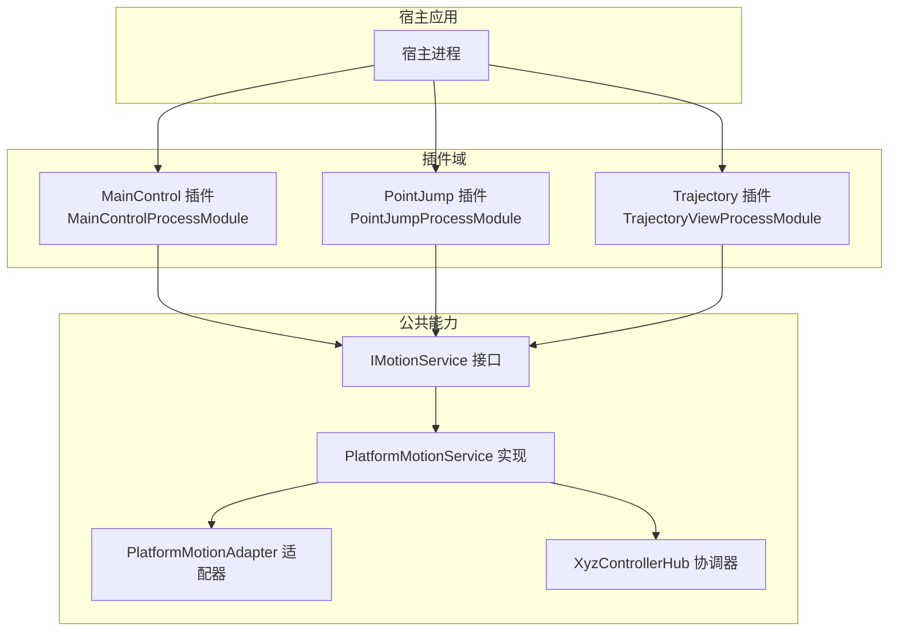
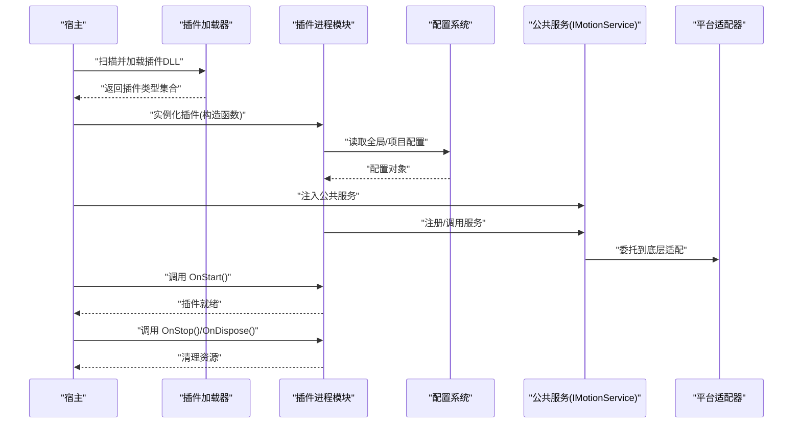
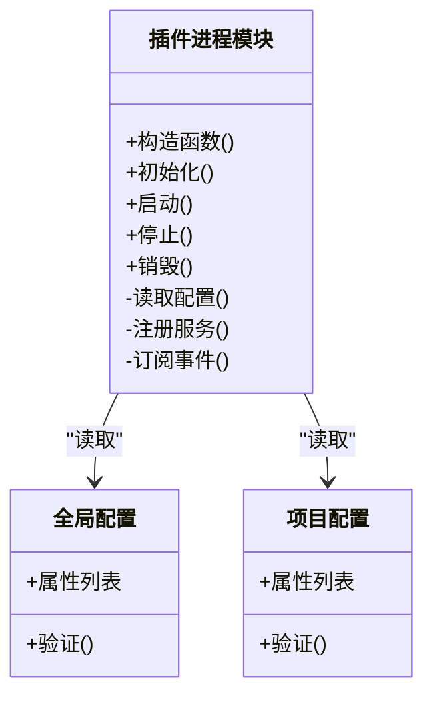
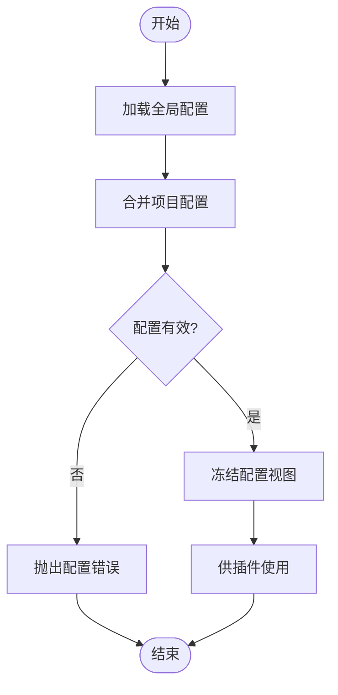
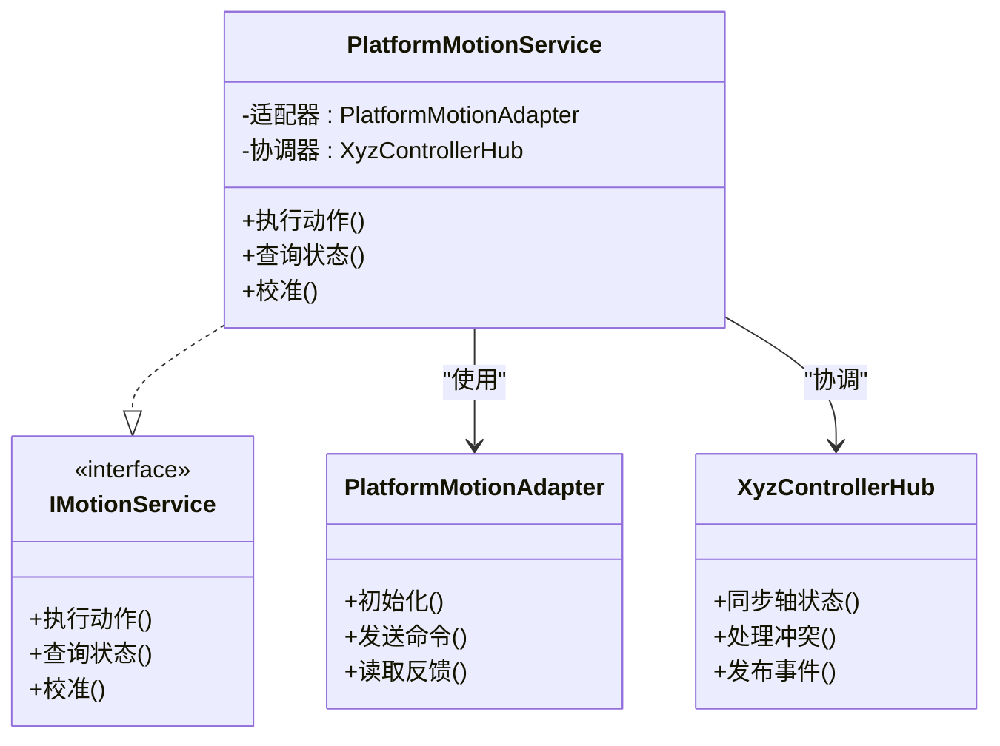
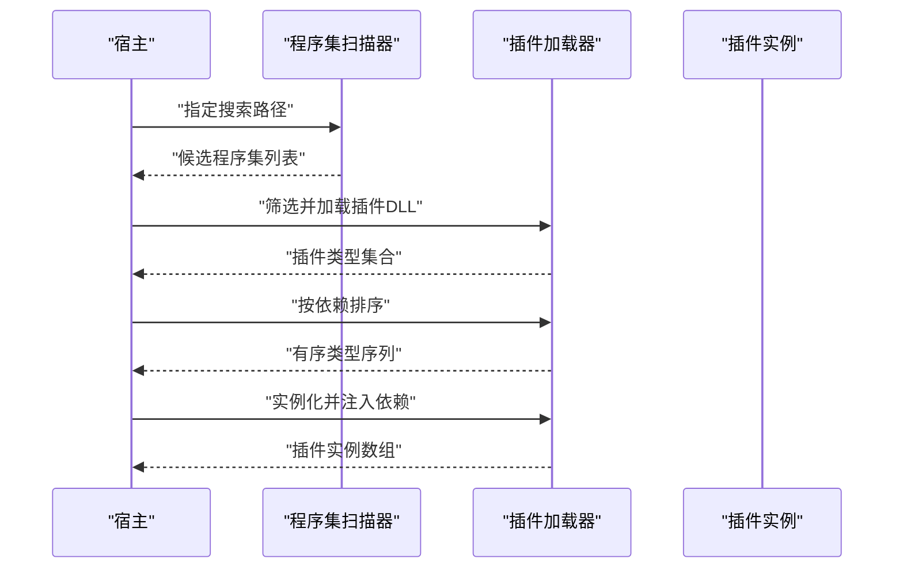
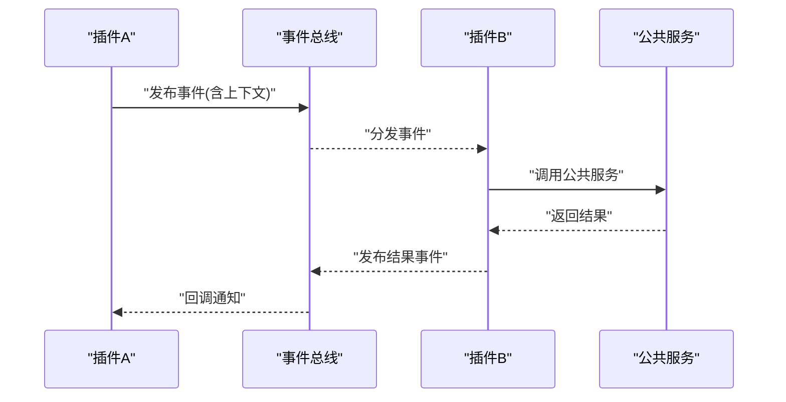
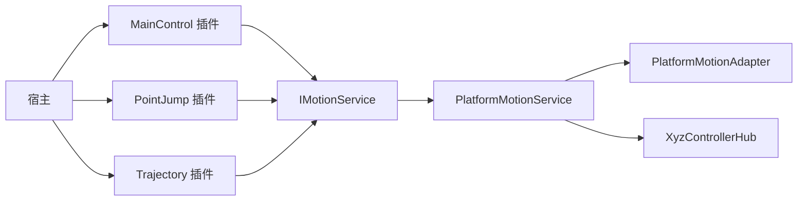

# 插件机制设计

<cite>
**本文引用的文件**   
- [ProcessModules.csproj](file://ProcessModules.csproj)
- [MainControl/MainControlProcessModule.cs](file://MainControl/MainControlProcessModule.cs)
- [MainControl/MainControlGlobalSetting.cs](file://MainControl/MainControlGlobalSetting.cs)
- [MainControl/MainControlProjectSetting.cs](file://MainControl/MainControlProjectSetting.cs)
- [PointJump/PointJumpProcessModule.cs](file://PointJump/PointJumpProcessModule.cs)
- [PointJump/PointJumpGlobalSetting.cs](file://PointJump/PointJumpGlobalSetting.cs)
- [PointJump/PointJumpProjectSetting.cs](file://PointJump/PointJumpProjectSetting.cs)
- [Trajectory/TrajectoryViewProcessModule.cs](file://Trajectory/TrajectoryViewProcessModule.cs)
- [Trajectory/TrajectoryGlobalSetting.cs](file://Trajectory/TrajectoryGlobalSetting.cs)
- [Trajectory/TrajectoryProjectSetting.cs](file://Trajectory/TrajectoryProjectSetting.cs)
- [Logic/PlatformMotionService.cs](file://Logic/PlatformMotionService.cs)
- [Logic/IMotionService.cs](file://Logic/IMotionService.cs)
- [Logic/PlatformMotionAdapter.cs](file://Logic/PlatformMotionAdapter.cs)
- [Logic/XyzControllerHub.cs](file://Logic/XyzControllerHub.cs)
- [DOMO/DOMO.CS](file://DOMO/DOMO.CS)
- [DOMO/MAINMODUO.CS](file://DOMO/MAINMODUO.CS)
- [AGENTS.md](file://AGENTS.md)
- [独立 DLL 构建说明.md](file://独立 DLL 构建说明.md)
</cite>

## 目录
1. [简介](#简介)
2. [项目结构](#项目结构)
3. [核心组件](#核心组件)
4. [架构总览](#架构总览)
5. [详细组件分析](#详细组件分析)
6. [依赖关系分析](#依赖关系分析)
7. [性能考虑](#性能考虑)
8. [故障排除指南](#故障排除指南)
9. [结论](#结论)
10. [附录](#附录)

## 简介
本文件面向 ProcessModules 框架的插件机制，系统性阐述插件接口、发现与动态加载、生命周期管理、配置体系（全局与项目级）、插件间通信与事件模式、开发指南与安全策略、版本兼容与依赖管理，以及调试与排障方法。文档以仓库中的实际实现为依据，结合各功能模块（如 MainControl、PointJump、Trajectory）作为插件示例进行说明。

## 项目结构
- 解决方案包含多个“插件式”子项目：MainControl、PointJump、Trajectory，每个子项目均提供：
  - 进程模块入口类（ProcessModule），负责插件注册、生命周期钩子与对外能力暴露
  - 全局设置类（GlobalSetting），用于跨项目共享的配置项
  - 项目设置类（ProjectSetting），用于当前插件实例化的项目级配置
- 公共逻辑集中在 Logic 目录，通过服务接口与适配器解耦硬件或平台差异
- DOMO 目录包含早期或辅助模块，体现插件化演进的历史形态
- 根目录的 .csproj 与说明文档描述了插件 DLL 构建与集成方式

图表来源
- [MainControl/MainControlProcessModule.cs](file://MainControl/MainControlProcessModule.cs)
- [PointJump/PointJumpProcessModule.cs](file://PointJump/PointJumpProcessModule.cs)
- [Trajectory/TrajectoryViewProcessModule.cs](file://Trajectory/TrajectoryViewProcessModule.cs)
- [Logic/IMotionService.cs](file://Logic/IMotionService.cs)
- [Logic/PlatformMotionService.cs](file://Logic/PlatformMotionService.cs)
- [Logic/PlatformMotionAdapter.cs](file://Logic/PlatformMotionAdapter.cs)
- [Logic/XyzControllerHub.cs](file://Logic/XyzControllerHub.cs)

章节来源
- [ProcessModules.csproj](file://ProcessModules.csproj)
- [独立 DLL 构建说明.md](file://独立 DLL 构建说明.md)

## 核心组件
- 插件进程模块（ProcessModule）
  - 职责：插件入口、生命周期回调、能力注册、配置加载
  - 典型成员：初始化、启动、停止、销毁等钩子；配置读取与校验；对外服务暴露
- 配置体系
  - 全局配置（GlobalSetting）：跨插件共享的系统级参数
  - 项目配置（ProjectSetting）：插件实例化时的项目级参数
- 服务与适配器
  - 运动控制接口（IMotionService）：定义统一动作抽象
  - 平台运动服务（PlatformMotionService）：具体业务编排
  - 平台适配器（PlatformMotionAdapter）：屏蔽底层差异
  - 控制器协调器（XyzControllerHub）：多轴协同与状态同步

章节来源
- [MainControl/MainControlProcessModule.cs](file://MainControl/MainControlProcessModule.cs)
- [MainControl/MainControlGlobalSetting.cs](file://MainControl/MainControlGlobalSetting.cs)
- [MainControl/MainControlProjectSetting.cs](file://MainControl/MainControlProjectSetting.cs)
- [PointJump/PointJumpProcessModule.cs](file://PointJump/PointJumpProcessModule.cs)
- [PointJump/PointJumpGlobalSetting.cs](file://PointJump/PointJumpGlobalSetting.cs)
- [PointJump/PointJumpProjectSetting.cs](file://PointJump/PointJumpProjectSetting.cs)
- [Trajectory/TrajectoryViewProcessModule.cs](file://Trajectory/TrajectoryViewProcessModule.cs)
- [Trajectory/TrajectoryGlobalSetting.cs](file://Trajectory/TrajectoryGlobalSetting.cs)
- [Trajectory/TrajectoryProjectSetting.cs](file://Trajectory/TrajectoryProjectSetting.cs)
- [Logic/IMotionService.cs](file://Logic/IMotionService.cs)
- [Logic/PlatformMotionService.cs](file://Logic/PlatformMotionService.cs)
- [Logic/PlatformMotionAdapter.cs](file://Logic/PlatformMotionAdapter.cs)
- [Logic/XyzControllerHub.cs](file://Logic/XyzControllerHub.cs)

## 架构总览
插件系统采用“宿主 + 插件 DLL + 公共接口层”的分层架构：
- 宿主负责扫描并加载插件 DLL，创建插件实例，注入公共服务
- 插件通过继承统一的基类或实现约定接口，完成自身生命周期与能力暴露
- 公共接口层（如 IMotionService）确保插件与平台无关，便于替换与扩展

图表来源
- [MainControl/MainControlProcessModule.cs](file://MainControl/MainControlProcessModule.cs)
- [PointJump/PointJumpProcessModule.cs](file://PointJump/PointJumpProcessModule.cs)
- [Trajectory/TrajectoryViewProcessModule.cs](file://Trajectory/TrajectoryViewProcessModule.cs)
- [Logic/IMotionService.cs](file://Logic/IMotionService.cs)
- [Logic/PlatformMotionAdapter.cs](file://Logic/PlatformMotionAdapter.cs)

## 详细组件分析

### 插件进程模块（ProcessModule）
- 设计要点
  - 统一入口：每个插件提供一个进程模块类，承载生命周期与对外能力
  - 配置分离：全局配置与项目配置分别封装，避免耦合
  - 能力暴露：通过接口或服务容器向宿主与其他插件暴露能力
- 生命周期
  - 构造：解析程序集元数据，准备配置
  - 初始化：读取配置，注册服务，建立依赖
  - 启动：执行业务初始化，订阅事件
  - 运行：响应宿主指令与外部事件
  - 停止：释放非托管资源，取消订阅
  - 销毁：GC回收前的最后清理

图表来源
- [MainControl/MainControlProcessModule.cs](file://MainControl/MainControlProcessModule.cs)
- [MainControl/MainControlGlobalSetting.cs](file://MainControl/MainControlGlobalSetting.cs)
- [MainControl/MainControlProjectSetting.cs](file://MainControl/MainControlProjectSetting.cs)
- [PointJump/PointJumpProcessModule.cs](file://PointJump/PointJumpProcessModule.cs)
- [PointJump/PointJumpGlobalSetting.cs](file://PointJump/PointJumpGlobalSetting.cs)
- [PointJump/PointJumpProjectSetting.cs](file://PointJump/PointJumpProjectSetting.cs)
- [Trajectory/TrajectoryViewProcessModule.cs](file://Trajectory/TrajectoryViewProcessModule.cs)
- [Trajectory/TrajectoryGlobalSetting.cs](file://Trajectory/TrajectoryGlobalSetting.cs)
- [Trajectory/TrajectoryProjectSetting.cs](file://Trajectory/TrajectoryProjectSetting.cs)

章节来源
- [MainControl/MainControlProcessModule.cs](file://MainControl/MainControlProcessModule.cs)
- [PointJump/PointJumpProcessModule.cs](file://PointJump/PointJumpProcessModule.cs)
- [Trajectory/TrajectoryViewProcessModule.cs](file://Trajectory/TrajectoryViewProcessModule.cs)

### 配置系统（全局与项目级）
- 层次结构
  - 全局配置：系统级默认值、共享开关、路径与端口等
  - 项目配置：插件实例化时的覆盖值、用户偏好、运行时参数
- 加载顺序
  - 先加载全局配置，再合并项目配置，最终生成只读配置视图
- 校验与回退
  - 对必填项进行校验，缺失时回退到默认值或抛出明确错误

图表来源
- [MainControl/MainControlGlobalSetting.cs](file://MainControl/MainControlGlobalSetting.cs)
- [MainControl/MainControlProjectSetting.cs](file://MainControl/MainControlProjectSetting.cs)
- [PointJump/PointJumpGlobalSetting.cs](file://PointJump/PointJumpGlobalSetting.cs)
- [PointJump/PointJumpProjectSetting.cs](file://PointJump/PointJumpProjectSetting.cs)
- [Trajectory/TrajectoryGlobalSetting.cs](file://Trajectory/TrajectoryGlobalSetting.cs)
- [Trajectory/TrajectoryProjectSetting.cs](file://Trajectory/TrajectoryProjectSetting.cs)

章节来源
- [MainControl/MainControlGlobalSetting.cs](file://MainControl/MainControlGlobalSetting.cs)
- [MainControl/MainControlProjectSetting.cs](file://MainControl/MainControlProjectSetting.cs)
- [PointJump/PointJumpGlobalSetting.cs](file://PointJump/PointJumpGlobalSetting.cs)
- [PointJump/PointJumpProjectSetting.cs](file://PointJump/PointJumpProjectSetting.cs)
- [Trajectory/TrajectoryGlobalSetting.cs](file://Trajectory/TrajectoryGlobalSetting.cs)
- [Trajectory/TrajectoryProjectSetting.cs](file://Trajectory/TrajectoryProjectSetting.cs)

### 服务与适配器（运动控制）
- 接口抽象（IMotionService）
  - 定义统一的动作语义，屏蔽平台差异
- 服务实现（PlatformMotionService）
  - 编排业务流程，协调多轴与设备状态
- 适配器（PlatformMotionAdapter）
  - 将上层动作映射到具体硬件驱动或仿真环境
- 协调器（XyzControllerHub）
  - 维护多轴状态、同步与冲突解决

图表来源
- [Logic/IMotionService.cs](file://Logic/IMotionService.cs)
- [Logic/PlatformMotionService.cs](file://Logic/PlatformMotionService.cs)
- [Logic/PlatformMotionAdapter.cs](file://Logic/PlatformMotionAdapter.cs)
- [Logic/XyzControllerHub.cs](file://Logic/XyzControllerHub.cs)

章节来源
- [Logic/IMotionService.cs](file://Logic/IMotionService.cs)
- [Logic/PlatformMotionService.cs](file://Logic/PlatformMotionService.cs)
- [Logic/PlatformMotionAdapter.cs](file://Logic/PlatformMotionAdapter.cs)
- [Logic/XyzControllerHub.cs](file://Logic/XyzControllerHub.cs)

### 插件发现与动态加载
- 发现机制
  - 基于程序集扫描，识别符合约定的插件类型（如继承特定基类或实现标记接口）
- 加载流程
  - 按依赖顺序加载 DLL，创建实例，注入公共服务与配置
- 卸载策略
  - 支持软卸载（停止运行、释放引用）与硬卸载（AppDomain 隔离，视宿主能力而定）

图表来源
- [DOMO/DOMO.CS](file://DOMO/DOMO.CS)
- [DOMO/MAINMODUO.CS](file://DOMO/MAINMODUO.CS)
- [AGENTS.md](file://AGENTS.md)
- [独立 DLL 构建说明.md](file://独立 DLL 构建说明.md)

章节来源
- [DOMO/DOMO.CS](file://DOMO/DOMO.CS)
- [DOMO/MAINMODUO.CS](file://DOMO/MAINMODUO.CS)
- [AGENTS.md](file://AGENTS.md)
- [独立 DLL 构建说明.md](file://独立 DLL 构建说明.md)

### 插件间通信与事件处理
- 通信模式
  - 事件总线：插件订阅/发布领域事件，解耦直接依赖
  - 服务调用：通过公共接口（如 IMotionService）间接交互
  - 消息队列：高吞吐场景下可引入异步消息通道
- 事件处理
  - 建议采用幂等处理器，避免重复触发导致的状态不一致
  - 对异常进行捕获与上报，保证整体稳定性

图表来源
- [Logic/XyzControllerHub.cs](file://Logic/XyzControllerHub.cs)
- [Logic/PlatformMotionService.cs](file://Logic/PlatformMotionService.cs)

章节来源
- [Logic/XyzControllerHub.cs](file://Logic/XyzControllerHub.cs)
- [Logic/PlatformMotionService.cs](file://Logic/PlatformMotionService.cs)

### 插件开发指南与最佳实践
- 创建步骤
  - 新建插件项目，添加对公共接口与宿主契约的引用
  - 实现插件进程模块，完成生命周期钩子
  - 定义全局与项目配置类，提供默认值与校验
  - 在初始化阶段注册服务与订阅事件
- 最佳实践
  - 配置项命名规范与版本迁移策略
  - 资源释放与异常边界清晰
  - 避免在构造函数中执行耗时操作
  - 使用只读配置视图，防止运行时篡改

章节来源
- [MainControl/MainControlProcessModule.cs](file://MainControl/MainControlProcessModule.cs)
- [PointJump/PointJumpProcessModule.cs](file://PointJump/PointJumpProcessModule.cs)
- [Trajectory/TrajectoryViewProcessModule.cs](file://Trajectory/TrajectoryViewProcessModule.cs)

### 安全考虑、版本兼容与依赖管理
- 安全
  - 插件签名与完整性校验
  - 最小权限原则：仅暴露必要接口
  - 输入校验与输出过滤，防止注入与越权
- 版本兼容
  - 接口版本化（如 v1/v2），向后兼容策略
  - 配置项弃用与迁移脚本
- 依赖管理
  - 明确插件依赖清单，避免循环依赖
  - 使用包管理器或静态链接策略统一版本

章节来源
- [独立 DLL 构建说明.md](file://独立 DLL 构建说明.md)
- [AGENTS.md](file://AGENTS.md)

### 调试与故障排除
- 日志与诊断
  - 结构化日志记录关键路径与异常堆栈
  - 启用调试开关，输出插件加载与配置合并过程
- 常见问题
  - 插件未加载：检查程序集路径、依赖缺失、签名失败
  - 配置错误：核对必填项、类型转换、默认值回退
  - 运行时崩溃：定位线程模型、资源竞争、未释放句柄
- 工具建议
  - 使用断点与条件断点快速复现
  - 内存与句柄泄漏检测
  - 性能剖析热点路径

章节来源
- [DOMO/DOMO.CS](file://DOMO/DOMO.CS)
- [DOMO/MAINMODUO.CS](file://DOMO/MAINMODUO.CS)
- [AGENTS.md](file://AGENTS.md)

## 依赖关系分析
- 插件与公共接口解耦，通过服务层访问平台能力
- 插件之间通过事件总线或公共服务间接通信，降低耦合度
- 宿主负责插件发现、加载与生命周期管理

图表来源
- [MainControl/MainControlProcessModule.cs](file://MainControl/MainControlProcessModule.cs)
- [PointJump/PointJumpProcessModule.cs](file://PointJump/PointJumpProcessModule.cs)
- [Trajectory/TrajectoryViewProcessModule.cs](file://Trajectory/TrajectoryViewProcessModule.cs)
- [Logic/IMotionService.cs](file://Logic/IMotionService.cs)
- [Logic/PlatformMotionService.cs](file://Logic/PlatformMotionService.cs)
- [Logic/PlatformMotionAdapter.cs](file://Logic/PlatformMotionAdapter.cs)
- [Logic/XyzControllerHub.cs](file://Logic/XyzControllerHub.cs)

章节来源
- [ProcessModules.csproj](file://ProcessModules.csproj)
- [Logic/IMotionService.cs](file://Logic/IMotionService.cs)
- [Logic/PlatformMotionService.cs](file://Logic/PlatformMotionService.cs)
- [Logic/PlatformMotionAdapter.cs](file://Logic/PlatformMotionAdapter.cs)
- [Logic/XyzControllerHub.cs](file://Logic/XyzControllerHub.cs)

## 性能考虑
- 延迟初始化：按需加载重型资源
- 并发模型：合理划分线程池，避免阻塞主线程
- I/O 优化：批量读写、缓存热点数据
- 内存管理：及时释放非托管资源，避免大对象分配

[本节为通用指导，不直接分析具体文件]

## 故障排除指南
- 插件加载失败
  - 检查程序集路径与依赖项是否齐全
  - 查看签名与兼容性标志
- 配置错误
  - 核对键名、数据类型与范围
  - 启用配置校验日志
- 运行时异常
  - 捕获并记录异常上下文
  - 使用断点与日志定位问题

章节来源
- [DOMO/DOMO.CS](file://DOMO/DOMO.CS)
- [DOMO/MAINMODUO.CS](file://DOMO/MAINMODUO.CS)
- [AGENTS.md](file://AGENTS.md)

## 结论
ProcessModules 插件机制通过清晰的接口分层、完善的配置体系与稳健的生命周期管理，实现了高内聚、低耦合的可扩展架构。借助事件总线与服务抽象，插件间通信与平台适配得以解耦，便于持续演进与生态扩展。遵循本文的开发指南与最佳实践，可显著提升插件质量与可维护性。

## 附录
- 术语表
  - 插件：独立 DLL，提供特定业务能力
  - 宿主：负责插件发现、加载与生命周期管理的进程
  - 服务：跨插件共享的能力抽象
  - 适配器：屏蔽底层差异的中间层
- 参考文档
  - 独立 DLL 构建说明
  - AGENTS 相关说明

[本节为补充信息，不直接分析具体文件]