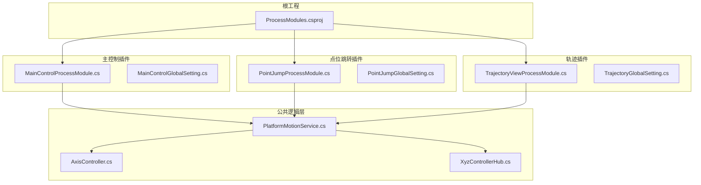
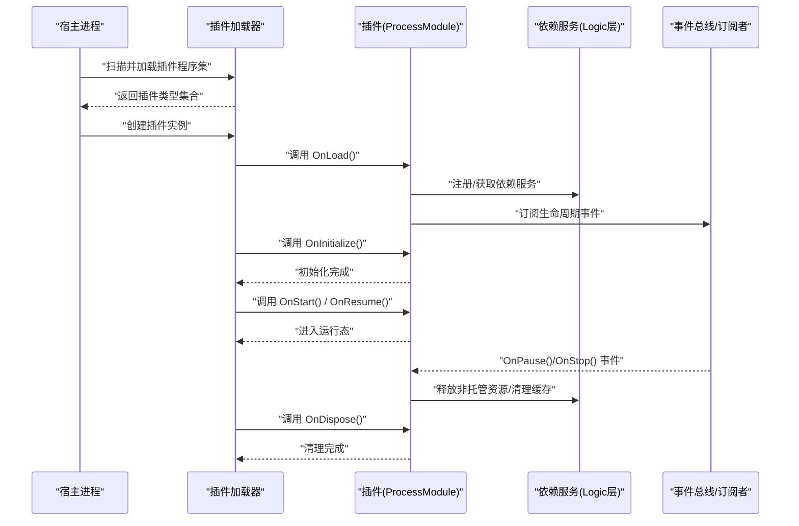
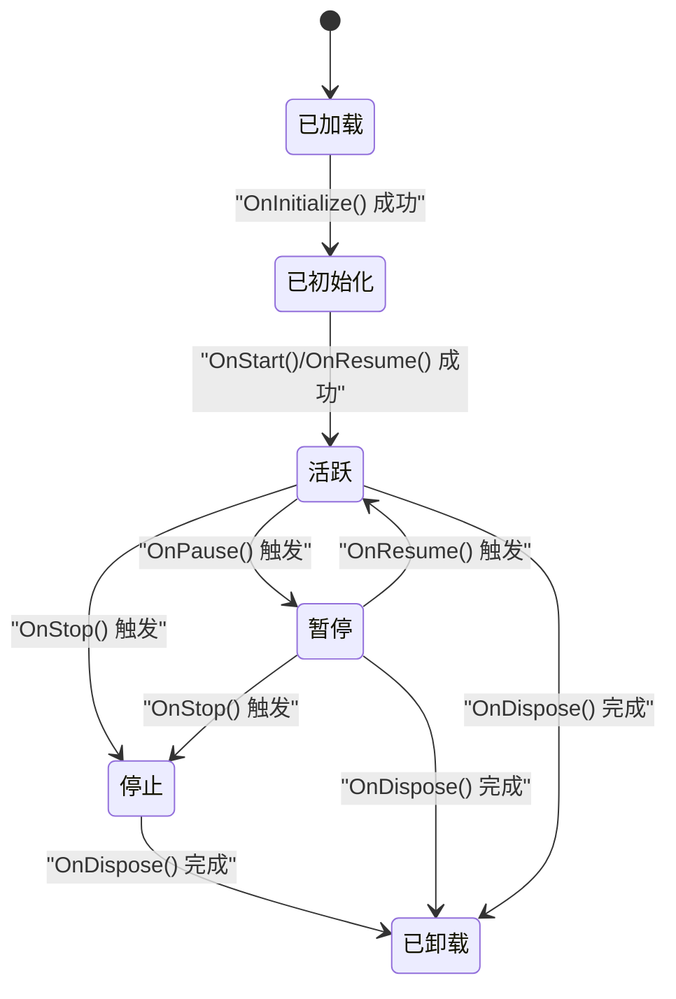
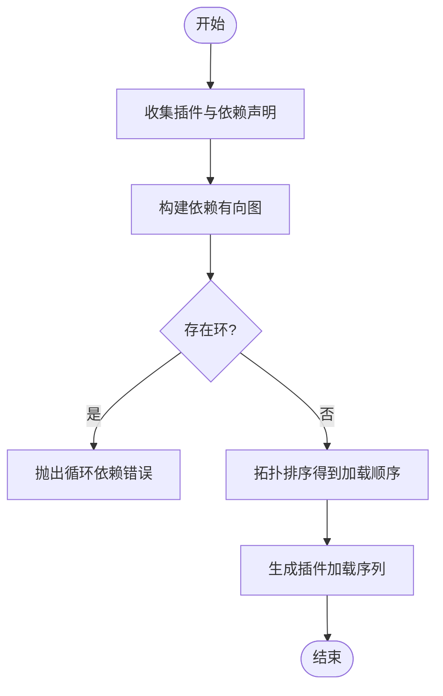
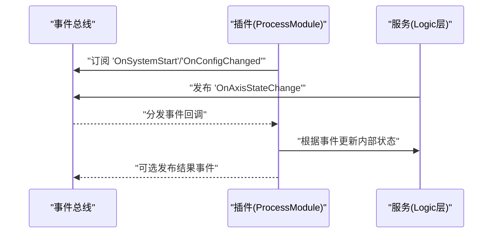
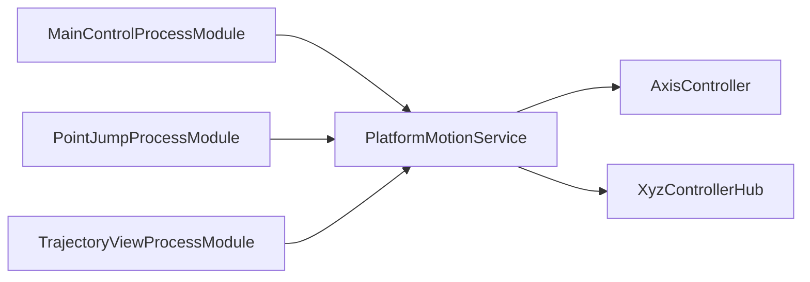

# 插件生命周期管理

<cite>
**本文引用的文件**   
- [ProcessModules.csproj](file://ProcessModules.csproj)
- [MainControlProcessModule.cs](file://MainControl/MainControlProcessModule.cs)
- [PointJumpProcessModule.cs](file://PointJump/PointJumpProcessModule.cs)
- [TrajectoryViewProcessModule.cs](file://Trajectory/TrajectoryViewProcessModule.cs)
- [PlatformMotionService.cs](file://Logic/PlatformMotionService.cs)
- [AxisController.cs](file://Logic/AxisController.cs)
- [XyzControllerHub.cs](file://Logic/XyzControllerHub.cs)
- [MainControlGlobalSetting.cs](file://MainControl/MainControlGlobalSetting.cs)
- [PointJumpGlobalSetting.cs](file://PointJump/PointJumpGlobalSetting.cs)
- [TrajectoryGlobalSetting.cs](file://Trajectory/TrajectoryGlobalSetting.cs)
- [README.md](file://README.md)
</cite>

## 目录
1. [简介](#简介)
2. [项目结构](#项目结构)
3. [核心组件](#核心组件)
4. [架构总览](#架构总览)
5. [详细组件分析](#详细组件分析)
6. [依赖关系分析](#依赖关系分析)
7. [性能考量](#性能考量)
8. [故障排查指南](#故障排查指南)
9. [结论](#结论)
10. [附录](#附录)

## 简介
本技术文档围绕 ProcessModules 框架的插件生命周期管理机制展开，系统阐述插件从加载、初始化、运行到卸载的完整流程；解释插件状态机（活跃、暂停、停止）及其转换条件；说明插件依赖解析与加载顺序控制策略；给出资源管理方案（内存、文件句柄、线程池）；提供异常处理机制以确保单点故障不影响整体稳定性；并总结生命周期事件的订阅与处理模式以及调试与监控方法。

## 项目结构
仓库采用按功能域划分的模块化组织方式：
- 根工程 ProcessModules.csproj 定义解决方案与核心项目引用
- MainControl、PointJump、Trajectory 等子模块各自包含 UI、逻辑与资源，并通过各自的 ProcessModule 类暴露为可插拔单元
- Logic 层提供平台运动服务与控制器，作为跨插件共享的基础能力
- 各模块通过全局设置类进行配置隔离

图表来源
- [ProcessModules.csproj](file://ProcessModules.csproj)
- [MainControlProcessModule.cs](file://MainControl/MainControlProcessModule.cs)
- [PointJumpProcessModule.cs](file://PointJump/PointJumpProcessModule.cs)
- [TrajectoryViewProcessModule.cs](file://Trajectory/TrajectoryViewProcessModule.cs)
- [PlatformMotionService.cs](file://Logic/PlatformMotionService.cs)
- [AxisController.cs](file://Logic/AxisController.cs)
- [XyzControllerHub.cs](file://Logic/XyzControllerHub.cs)

章节来源
- [README.md](file://README.md)
- [ProcessModules.csproj](file://ProcessModules.csproj)

## 核心组件
- 插件入口类（ProcessModule）：每个插件提供一个继承自基类的 ProcessModule 实现，负责声明依赖、生命周期钩子、事件订阅与资源管理。典型实现包括：
  - MainControlProcessModule.cs
  - PointJumpProcessModule.cs
  - TrajectoryViewProcessModule.cs
- 共享服务（Logic 层）：PlatformMotionService、AxisController、XyzControllerHub 等提供跨插件可调用的基础能力，插件在初始化阶段按需注册或获取实例。
- 全局设置：各插件通过 GlobalSetting 类维护自身配置，避免相互污染。

章节来源
- [MainControlProcessModule.cs](file://MainControl/MainControlProcessModule.cs)
- [PointJumpProcessModule.cs](file://PointJump/PointJumpProcessModule.cs)
- [TrajectoryViewProcessModule.cs](file://Trajectory/TrajectoryViewProcessModule.cs)
- [PlatformMotionService.cs](file://Logic/PlatformMotionService.cs)
- [AxisController.cs](file://Logic/AxisController.cs)
- [XyzControllerHub.cs](file://Logic/XyzControllerHub.cs)
- [MainControlGlobalSetting.cs](file://MainControl/MainControlGlobalSetting.cs)
- [PointJumpGlobalSetting.cs](file://PointJump/PointJumpGlobalSetting.cs)
- [TrajectoryGlobalSetting.cs](file://Trajectory/TrajectoryGlobalSetting.cs)

## 架构总览
下图展示插件生命周期关键阶段与核心交互：加载、依赖解析、初始化、运行、暂停/恢复、停止与卸载。

图表来源
- [MainControlProcessModule.cs](file://MainControl/MainControlProcessModule.cs)
- [PointJumpProcessModule.cs](file://PointJump/PointJumpProcessModule.cs)
- [TrajectoryViewProcessModule.cs](file://Trajectory/TrajectoryViewProcessModule.cs)
- [PlatformMotionService.cs](file://Logic/PlatformMotionService.cs)

## 详细组件分析

### 插件生命周期与状态机
- 生命周期阶段
  - 加载：宿主发现并实例化插件类型
  - 初始化：执行 OnInitialize，建立依赖、订阅事件、准备资源
  - 运行：执行 OnStart/OnResume，开始业务循环或响应事件
  - 暂停：执行 OnPause，挂起后台任务，保留上下文
  - 停止：执行 OnStop，释放临时资源，保持可重启
  - 卸载：执行 OnDispose，彻底释放所有资源
- 状态转换
  - 初始 -> 活跃：成功完成 OnInitialize 与 OnStart
  - 活跃 -> 暂停：收到暂停事件或外部请求
  - 暂停 -> 活跃：收到恢复事件
  - 活跃/暂停 -> 停止：收到停止事件或错误恢复
  - 任何状态 -> 卸载：宿主主动卸载或进程退出

章节来源
- [MainControlProcessModule.cs](file://MainControl/MainControlProcessModule.cs)
- [PointJumpProcessModule.cs](file://PointJump/PointJumpProcessModule.cs)
- [TrajectoryViewProcessModule.cs](file://Trajectory/TrajectoryViewProcessModule.cs)

### 依赖解析与加载顺序控制
- 依赖声明：插件通过元数据或接口约定声明对其它插件/服务的依赖
- 解析策略：基于有向无环图（DAG）拓扑排序，确保被依赖者优先于依赖方初始化
- 冲突处理：检测到循环依赖时抛出明确错误，阻止加载
- 版本兼容：根据最小/最大版本约束校验依赖可用性

章节来源
- [PlatformMotionService.cs](file://Logic/PlatformMotionService.cs)
- [XyzControllerHub.cs](file://Logic/XyzControllerHub.cs)

### 资源管理策略
- 内存管理
  - 对象池：对高频创建销毁的对象使用对象池减少 GC 压力
  - 弱引用：对回调与监听者使用弱引用避免内存泄漏
- 文件句柄
  - 显式关闭：在 OnStop/OnDispose 中统一释放文件流、日志句柄
  - 超时保护：I/O 操作设置超时，防止阻塞
- 线程池
  - 限流与队列：限制并发任务数，避免线程风暴
  - 取消令牌：支持优雅取消长时间运行的任务
  - 隔离性：不同插件的任务分配到独立工作项，避免互相影响

章节来源
- [PlatformMotionService.cs](file://Logic/PlatformMotionService.cs)
- [AxisController.cs](file://Logic/AxisController.cs)

### 异常处理与容错
- 隔离捕获：插件生命周期钩子中的异常被宿主捕获，记录堆栈并标记插件状态
- 降级策略：关键依赖不可用时，插件回退到只读或空实现模式
- 自愈机制：支持自动重试与指数退避，失败超过阈值则进入停止状态
- 诊断信息：异常附带上下文（插件名、阶段、参数），便于定位

章节来源
- [MainControlProcessModule.cs](file://MainControl/MainControlProcessModule.cs)
- [PointJumpProcessModule.cs](file://PointJump/PointJumpProcessModule.cs)
- [TrajectoryViewProcessModule.cs](file://Trajectory/TrajectoryViewProcessModule.cs)

### 生命周期事件订阅与处理
- 事件模型：基于发布-订阅模式，插件在 OnInitialize 中订阅所需事件
- 事件分类：系统级（启动、停止）、插件级（切换、配置变更）、设备级（轴状态、报警）
- 处理原则：事件处理函数需幂等、快速返回，避免阻塞事件总线

章节来源
- [PlatformMotionService.cs](file://Logic/PlatformMotionService.cs)
- [XyzControllerHub.cs](file://Logic/XyzControllerHub.cs)

### 调试与监控
- 指标采集：统计生命周期耗时、事件吞吐、错误率
- 日志规范：结构化日志，包含插件名、阶段、相关 ID
- 健康检查：定期探测插件存活与依赖可用性
- 远程诊断：暴露只读端点用于查看状态与最近日志

章节来源
- [MainControlGlobalSetting.cs](file://MainControl/MainControlGlobalSetting.cs)
- [PointJumpGlobalSetting.cs](file://PointJump/PointJumpGlobalSetting.cs)
- [TrajectoryGlobalSetting.cs](file://Trajectory/TrajectoryGlobalSetting.cs)

## 依赖关系分析
插件与共享服务之间的依赖关系如下所示，确保加载顺序与初始化正确性。

图表来源
- [MainControlProcessModule.cs](file://MainControl/MainControlProcessModule.cs)
- [PointJumpProcessModule.cs](file://PointJump/PointJumpProcessModule.cs)
- [TrajectoryViewProcessModule.cs](file://Trajectory/TrajectoryViewProcessModule.cs)
- [PlatformMotionService.cs](file://Logic/PlatformMotionService.cs)
- [AxisController.cs](file://Logic/AxisController.cs)
- [XyzControllerHub.cs](file://Logic/XyzControllerHub.cs)

章节来源
- [ProcessModules.csproj](file://ProcessModules.csproj)

## 性能考量
- 延迟初始化：仅在首次使用时初始化昂贵依赖
- 批量处理：将多个小任务合并以减少调度开销
- 异步优先：I/O 与长耗时操作使用异步，避免阻塞 UI 线程
- 资源上限：限制线程数、队列长度与内存占用，防止资源耗尽

## 故障排查指南
- 常见问题
  - 插件未加载：检查程序集路径与依赖是否齐全
  - 初始化失败：查看 OnInitialize 阶段的异常与依赖可用性
  - 运行期崩溃：确认事件处理是否阻塞或抛出未捕获异常
  - 资源泄漏：核对 OnStop/OnDispose 是否释放了文件句柄与线程
- 定位步骤
  - 启用结构化日志与指标采集
  - 使用健康检查端点验证插件状态
  - 逐步禁用插件以隔离问题源

章节来源
- [MainControlProcessModule.cs](file://MainControl/MainControlProcessModule.cs)
- [PointJumpProcessModule.cs](file://PointJump/PointJumpProcessModule.cs)
- [TrajectoryViewProcessModule.cs](file://Trajectory/TrajectoryViewProcessModule.cs)

## 结论
ProcessModules 框架通过清晰的插件生命周期与状态机、严格的依赖解析与加载顺序、完善的资源管理与异常隔离机制，实现了高内聚、低耦合的可插拔架构。配合事件驱动的订阅模式与健壮的调试监控手段，能够在保证系统稳定性的同时，灵活扩展插件能力。

## 附录
- 最佳实践
  - 在 OnInitialize 中仅做轻量初始化，重活延后
  - 所有 I/O 与线程操作必须支持取消与超时
  - 事件处理函数保持幂等与快速返回
  - 使用对象池与弱引用降低内存压力
- 参考文件
  - 插件入口：MainControlProcessModule.cs、PointJumpProcessModule.cs、TrajectoryViewProcessModule.cs
  - 共享服务：PlatformMotionService.cs、AxisController.cs、XyzControllerHub.cs
  - 配置隔离：MainControlGlobalSetting.cs、PointJumpGlobalSetting.cs、TrajectoryGlobalSetting.cs