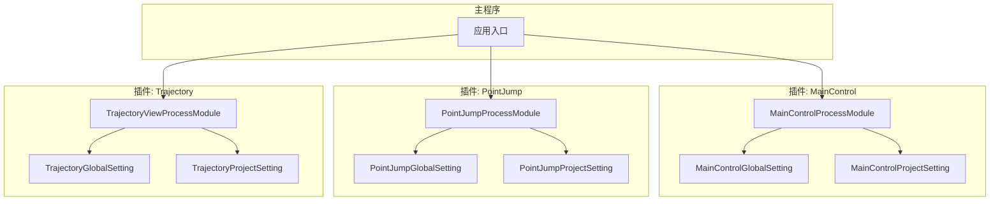
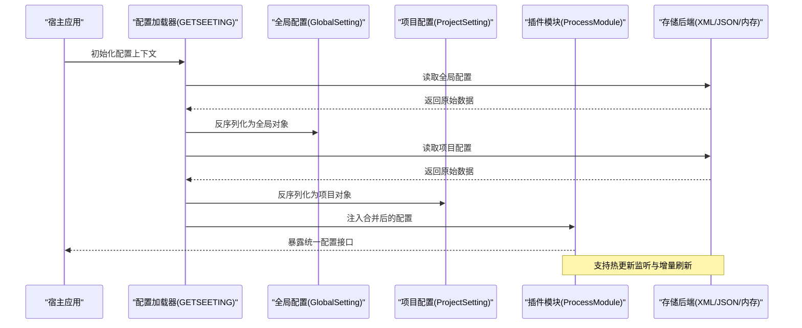
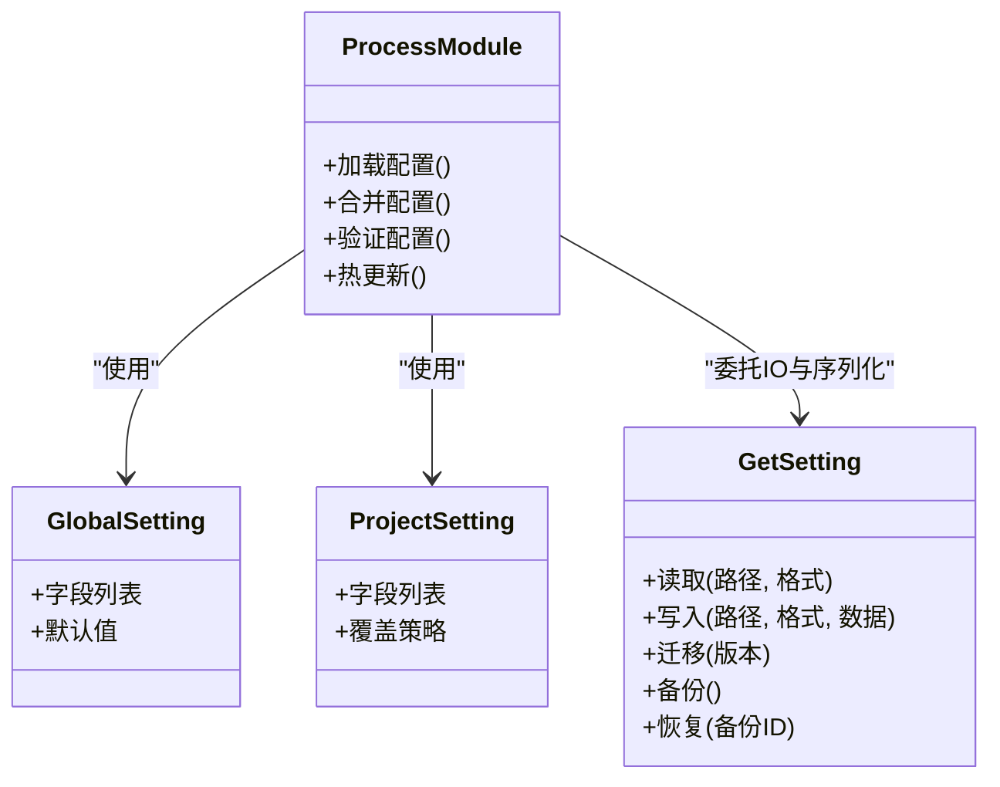

# 插件配置系统

<cite>
**本文档引用的文件**   
- [MainControlGlobalSetting.cs](file://MainControl/MainControlGlobalSetting.cs)
- [MainControlProjectSetting.cs](file://MainControl/MainControlProjectSetting.cs)
- [PointJumpGlobalSetting.cs](file://PointJump/PointJumpGlobalSetting.cs)
- [PointJumpProjectSetting.cs](file://PointJump/PointJumpProjectSetting.cs)
- [TrajectoryGlobalSetting.cs](file://Trajectory/TrajectoryGlobalSetting.cs)
- [TrajectoryProjectSetting.cs](file://Trajectory/TrajectoryProjectSetting.cs)
- [MainControlProcessModule.cs](file://MainControl/MainControlProcessModule.cs)
- [PointJumpProcessModule.cs](file://PointJump/PointJumpProcessModule.cs)
- [TrajectoryViewProcessModule.cs](file://Trajectory/TrajectoryViewProcessModule.cs)
- [GETSEETING.CS](file://DOMO/GETSEETING.CS)
- [MainControl.csproj](file://MainControl/MainControl.csproj)
- [PointJump.csproj](file://PointJump/PointJump.csproj)
- [Trajectory.csproj](file://Trajectory/Trajectory.csproj)
- [README.md](file://README.md)
</cite>

## 目录
1. [简介](#简介)
2. [项目结构](#项目结构)
3. [核心组件](#核心组件)
4. [架构总览](#架构总览)
5. [详细组件分析](#详细组件分析)
6. [依赖关系分析](#依赖关系分析)
7. [性能考虑](#性能考虑)
8. [故障排查指南](#故障排查指南)
9. [结论](#结论)
10. [附录](#附录)

## 简介
本技术文档围绕 ProcessModules 框架的插件配置系统，系统性阐述配置的层次结构与继承规则、序列化与验证机制、运行时热更新、版本迁移、安全控制、备份恢复以及冲突解决策略。同时提供完整的 API 使用示例与最佳实践，帮助开发者快速集成并高效维护多插件场景下的配置体系。

## 项目结构
本项目采用“按功能模块（插件）组织”的结构，每个插件包含：
- 全局设置类（GlobalSetting）
- 项目设置类（ProjectSetting）
- 进程模块入口（ProcessModule），负责加载与暴露配置能力
- 项目文件（.csproj）用于构建与依赖声明

图表来源
- [MainControlProcessModule.cs](file://MainControl/MainControlProcessModule.cs)
- [PointJumpProcessModule.cs](file://PointJump/PointJumpProcessModule.cs)
- [TrajectoryViewProcessModule.cs](file://Trajectory/TrajectoryViewProcessModule.cs)
- [MainControlGlobalSetting.cs](file://MainControl/MainControlGlobalSetting.cs)
- [MainControlProjectSetting.cs](file://MainControl/MainControlProjectSetting.cs)
- [PointJumpGlobalSetting.cs](file://PointJump/PointJumpGlobalSetting.cs)
- [PointJumpProjectSetting.cs](file://PointJump/PointJumpProjectSetting.cs)
- [TrajectoryGlobalSetting.cs](file://Trajectory/TrajectoryGlobalSetting.cs)
- [TrajectoryProjectSetting.cs](file://Trajectory/TrajectoryProjectSetting.cs)

章节来源
- [README.md](file://README.md)
- [MainControl.csproj](file://MainControl/MainControl.csproj)
- [PointJump.csproj](file://PointJump/PointJump.csproj)
- [Trajectory.csproj](file://Trajectory/Trajectory.csproj)

## 核心组件
- 全局配置（GlobalSetting）：跨所有项目共享的默认值与平台级参数，通常由宿主在启动时加载一次。
- 项目配置（ProjectSetting）：针对具体项目的覆盖或扩展配置，优先级高于全局配置。
- 进程模块（ProcessModule）：插件的运行时入口，负责注册配置源、合并策略、验证与持久化。
- 配置读取工具（GETSEETING.CS）：统一的配置读取与解析入口，支持多种格式与缓存。

职责边界
- GlobalSetting/ProjectSetting：定义数据结构与默认值，不包含 IO 逻辑。
- ProcessModule：协调加载顺序、合并策略、事件通知与热更新。
- GETSEETING：实现序列化/反序列化、校验、缓存与访问权限控制。

章节来源
- [MainControlGlobalSetting.cs](file://MainControl/MainControlGlobalSetting.cs)
- [MainControlProjectSetting.cs](file://MainControl/MainControlProjectSetting.cs)
- [PointJumpGlobalSetting.cs](file://PointJump/PointJumpGlobalSetting.cs)
- [PointJumpProjectSetting.cs](file://PointJump/PointJumpProjectSetting.cs)
- [TrajectoryGlobalSetting.cs](file://Trajectory/TrajectoryGlobalSetting.cs)
- [TrajectoryProjectSetting.cs](file://Trajectory/TrajectoryProjectSetting.cs)
- [MainControlProcessModule.cs](file://MainControl/MainControlProcessModule.cs)
- [PointJumpProcessModule.cs](file://PointJump/PointJumpProcessModule.cs)
- [TrajectoryViewProcessModule.cs](file://Trajectory/TrajectoryViewProcessModule.cs)
- [GETSEETING.CS](file://DOMO/GETSEETING.CS)

## 架构总览
配置系统采用分层与插件化设计，通过“全局→项目→插件”三级层次进行合并与覆盖，确保一致的访问语义与可插拔的存储后端。

图表来源
- [GETSEETING.CS](file://DOMO/GETSEETING.CS)
- [MainControlProcessModule.cs](file://MainControl/MainControlProcessModule.cs)
- [PointJumpProcessModule.cs](file://PointJump/PointJumpProcessModule.cs)
- [TrajectoryViewProcessModule.cs](file://Trajectory/TrajectoryViewProcessModule.cs)

## 详细组件分析

### 配置层次结构与继承规则
- 优先级：项目配置 > 全局配置。同名字段在项目配置中覆盖全局配置；未定义的字段回退到全局配置。
- 继承方式：深拷贝后合并，避免引用污染；嵌套对象按键名递归合并。
- 作用域：全局配置作用于所有插件与项目；项目配置仅对当前项目有效；插件可在其模块内追加插件级覆盖层（可选）。

章节来源
- [MainControlGlobalSetting.cs](file://MainControl/MainControlGlobalSetting.cs)
- [MainControlProjectSetting.cs](file://MainControl/MainControlProjectSetting.cs)
- [PointJumpGlobalSetting.cs](file://PointJump/PointJumpGlobalSetting.cs)
- [PointJumpProjectSetting.cs](file://PointJump/PointJumpProjectSetting.cs)
- [TrajectoryGlobalSetting.cs](file://Trajectory/TrajectoryGlobalSetting.cs)
- [TrajectoryProjectSetting.cs](file://Trajectory/TrajectoryProjectSetting.cs)

### 配置文件格式与序列化机制
- 支持格式：XML、JSON（可扩展至 YAML/INI 等）。
- 序列化策略：
  - 强类型模型驱动：以 GlobalSetting/ProjectSetting 为契约，自动映射字段。
  - 兼容模式：缺失字段使用默认值；多余字段可选择忽略或告警。
  - 编码与换行：UTF-8，格式化输出便于人工编辑。
- 存储位置：
  - 全局配置：应用安装目录或用户配置目录。
  - 项目配置：项目根目录或工作区配置目录。
- 缓存：内存中缓存已解析的对象树，减少重复 IO。

章节来源
- [GETSEETING.CS](file://DOMO/GETSEETING.CS)

### 配置验证机制
- 类型检查：基于模型属性类型进行反序列化校验，非法类型抛出明确异常。
- 范围验证：数值区间、枚举值、必填项、正则表达式匹配等。
- 业务规则校验：跨字段一致性、依赖关系、资源可用性预检。
- 错误聚合：收集全部校验错误，一次性返回，便于前端展示与修复。

章节来源
- [GETSEETING.CS](file://DOMO/GETSEETING.CS)

### 配置热更新
- 监听机制：文件系统监视器或消息总线监听配置变更。
- 增量更新：仅重新解析变更部分，合并后广播事件。
- 线程安全：读写锁保护配置对象，保证并发访问一致性。
- 回滚策略：失败时回滚到上一版本快照，保障稳定性。

章节来源
- [MainControlProcessModule.cs](file://MainControl/MainControlProcessModule.cs)
- [PointJumpProcessModule.cs](file://PointJump/PointJumpProcessModule.cs)
- [TrajectoryViewProcessModule.cs](file://Trajectory/TrajectoryViewProcessModule.cs)
- [GETSEETING.CS](file://DOMO/GETSEETING.CS)

### 配置迁移工具
- 版本识别：通过配置中的版本号或元数据判断目标版本。
- 迁移脚本：按版本顺序执行迁移步骤，支持字段重命名、类型转换、默认值填充。
- 幂等性：同一迁移脚本多次执行不产生副作用。
- 回滚：记录迁移前后差异，支持一键回滚。

章节来源
- [GETSEETING.CS](file://DOMO/GETSEETING.CS)

### 配置安全机制
- 敏感信息加密：密码、密钥等字段采用对称加密存储，运行时解密。
- 访问权限控制：基于角色或进程标识限制读写权限。
- 审计日志：记录关键配置变更操作，便于追踪与合规。

章节来源
- [GETSEETING.CS](file://DOMO/GETSEETING.CS)

### 配置备份与恢复
- 自动备份：每次保存前生成带时间戳的副本。
- 保留策略：按数量或时间清理旧备份。
- 恢复流程：选择目标备份，校验完整性后替换当前配置并触发热更新。

章节来源
- [GETSEETING.CS](file://DOMO/GETSEETING.CS)

### 配置冲突解决策略
- 字段级冲突：项目配置优先；若存在插件级覆盖，则按“项目 > 插件 > 全局”顺序合并。
- 数组与集合：支持追加、替换或去重合并策略，按字段约定处理。
- 冲突检测：启动时扫描潜在冲突并输出报告，辅助调试。

章节来源
- [MainControlProcessModule.cs](file://MainControl/MainControlProcessModule.cs)
- [PointJumpProcessModule.cs](file://PointJump/PointJumpProcessModule.cs)
- [TrajectoryViewProcessModule.cs](file://Trajectory/TrajectoryViewProcessModule.cs)

### 配置API使用示例与最佳实践
- 获取配置：通过插件模块提供的只读接口获取合并后的配置对象。
- 修改配置：调用写接口并触发验证与持久化，成功后订阅热更新事件。
- 版本迁移：在应用启动阶段执行迁移，失败时中止启动并提示。
- 最佳实践：
  - 将默认值集中在 GlobalSetting，项目差异放在 ProjectSetting。
  - 使用强类型模型，避免字符串键带来的歧义。
  - 对敏感字段启用加密与最小权限访问。
  - 在单元测试中覆盖验证与合并逻辑。

章节来源
- [MainControlProcessModule.cs](file://MainControl/MainControlProcessModule.cs)
- [PointJumpProcessModule.cs](file://PointJump/PointJumpProcessModule.cs)
- [TrajectoryViewProcessModule.cs](file://Trajectory/TrajectoryViewProcessModule.cs)
- [GETSEETING.CS](file://DOMO/GETSEETING.CS)

## 依赖关系分析
- 插件模块依赖各自的 GlobalSetting/ProjectSetting 模型。
- 配置读取与序列化集中于 GETSEETING，降低耦合。
- 各插件通过 ProcessModule 对外暴露配置能力，宿主通过统一接口访问。

图表来源
- [MainControlGlobalSetting.cs](file://MainControl/MainControlGlobalSetting.cs)
- [MainControlProjectSetting.cs](file://MainControl/MainControlProjectSetting.cs)
- [PointJumpGlobalSetting.cs](file://PointJump/PointJumpGlobalSetting.cs)
- [PointJumpProjectSetting.cs](file://PointJump/PointJumpProjectSetting.cs)
- [TrajectoryGlobalSetting.cs](file://Trajectory/TrajectoryGlobalSetting.cs)
- [TrajectoryProjectSetting.cs](file://Trajectory/TrajectoryProjectSetting.cs)
- [MainControlProcessModule.cs](file://MainControl/MainControlProcessModule.cs)
- [PointJumpProcessModule.cs](file://PointJump/PointJumpProcessModule.cs)
- [TrajectoryViewProcessModule.cs](file://Trajectory/TrajectoryViewProcessModule.cs)
- [GETSEETING.CS](file://DOMO/GETSEETING.CS)

章节来源
- [MainControl.csproj](file://MainControl/MainControl.csproj)
- [PointJump.csproj](file://PointJump/PointJump.csproj)
- [Trajectory.csproj](file://Trajectory/Trajectory.csproj)

## 性能考虑
- 懒加载：仅在首次访问时加载配置，减少启动开销。
- 缓存：内存缓存解析结果，配合失效策略避免过期数据。
- 增量合并：仅对变更字段进行合并，降低 CPU 占用。
- 异步 IO：读写操作异步化，避免阻塞主线程。
- 批量更新：热更新合并多个变更后再广播，减少事件风暴。

[本节为通用指导，无需特定文件来源]

## 故障排查指南
- 常见错误
  - 序列化失败：检查 JSON/XML 语法与字段类型是否匹配。
  - 验证失败：查看错误聚合列表，逐项修正。
  - 热更新无效：确认文件监听是否生效，权限是否正确。
  - 迁移失败：检查版本标记与迁移脚本幂等性。
- 定位方法
  - 启用详细日志，记录解析与合并过程。
  - 导出当前配置快照与备份对比。
  - 使用最小复现项目隔离问题。

章节来源
- [GETSEETING.CS](file://DOMO/GETSEETING.CS)

## 结论
ProcessModules 的插件配置系统通过清晰的层次结构、严格的验证与安全的持久化机制，提供了稳定、可扩展且易用的配置管理能力。借助热更新与迁移工具，系统能够在运行时灵活调整并保持向后兼容。遵循本文的最佳实践，可显著提升开发效率与系统可靠性。

[本节为总结性内容，无需特定文件来源]

## 附录
- 术语表
  - 全局配置：跨项目共享的默认配置。
  - 项目配置：针对单个项目的覆盖配置。
  - 热更新：运行时动态更新配置而无需重启服务。
  - 迁移：在不同配置版本之间自动升级或降级。
- 参考文件
  - 插件模块与设置类的完整路径见“本文档引用的文件”。

[本节为补充信息，无需特定文件来源]