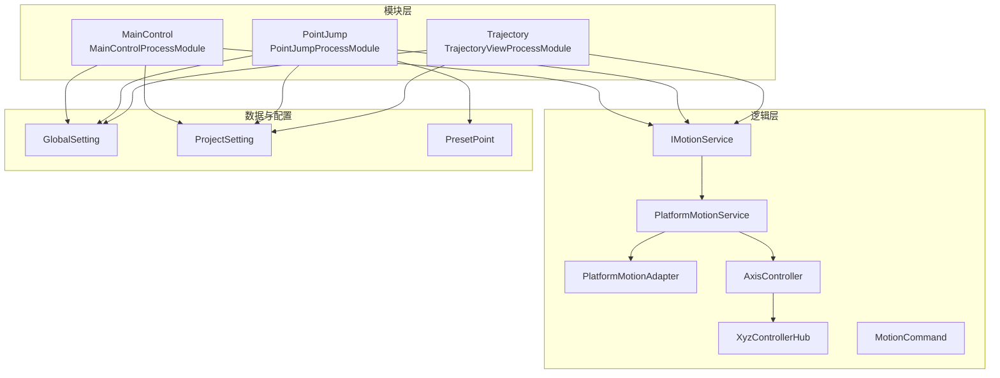
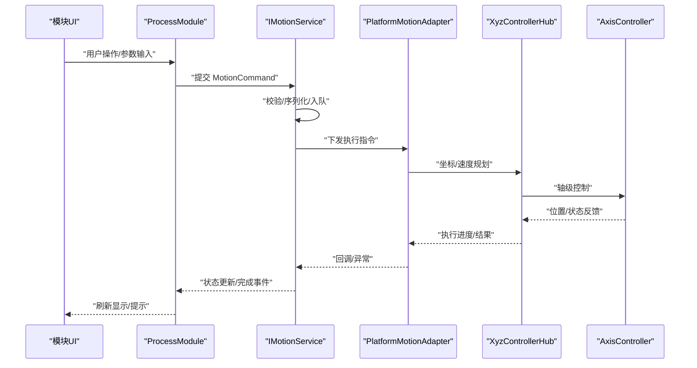
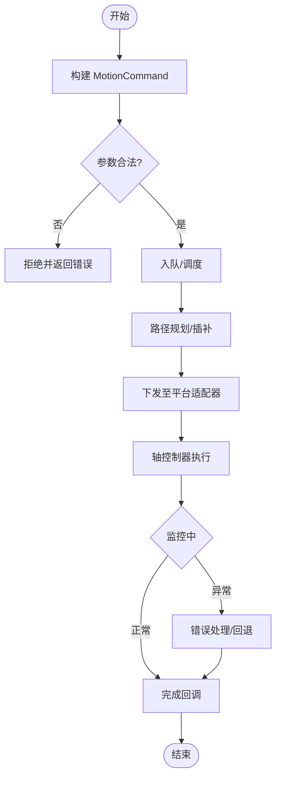
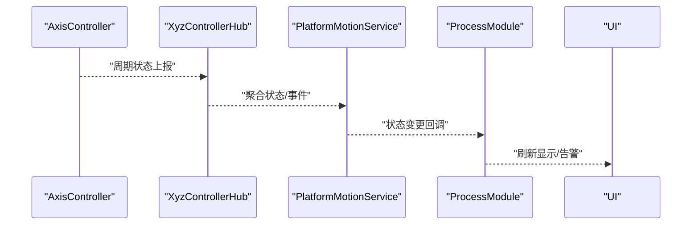
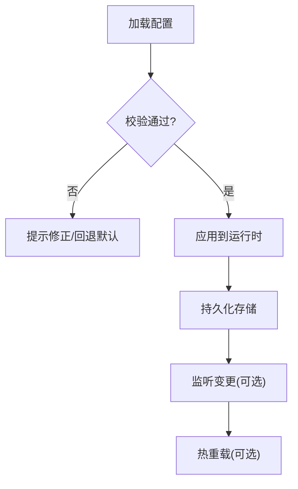
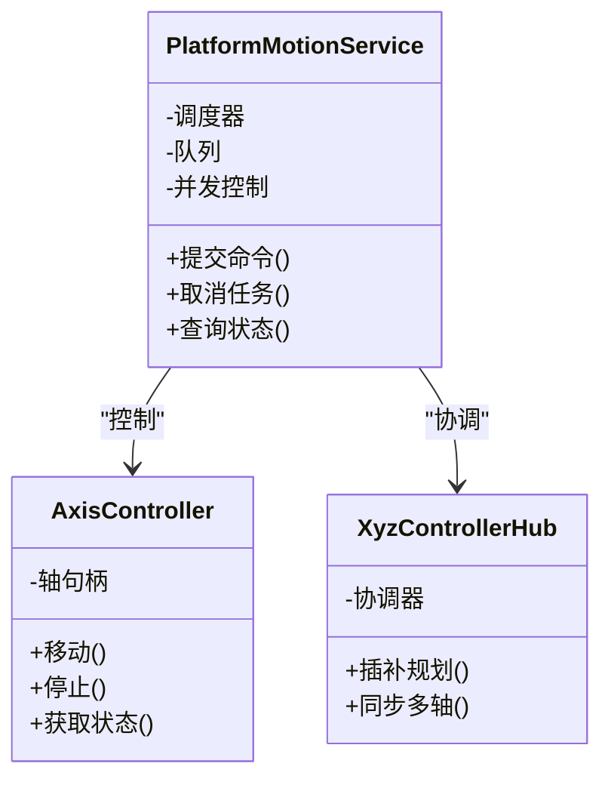
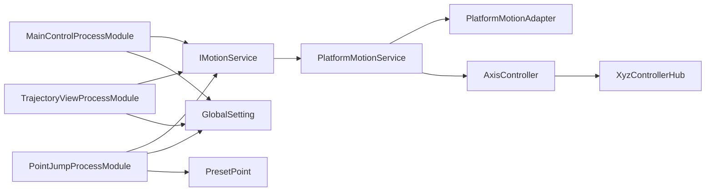

# 数据流设计

<cite>
**本文引用的文件**   
- [ProcessModules.csproj](file://ProcessModules.csproj)
- [README.md](file://README.md)
- [MainControl/MainControlProcessModule.cs](file://MainControl/MainControlProcessModule.cs)
- [MainControl/MainControlGlobalSetting.cs](file://MainControl/MainControlGlobalSetting.cs)
- [MainControl/MainControlProjectSetting.cs](file://MainControl/MainControlProjectSetting.cs)
- [MainControl/RunForm.cs](file://MainControl/RunForm.cs)
- [PointJump/PointJumpProcessModule.cs](file://PointJump/PointJumpProcessModule.cs)
- [PointJump/PointJumpGlobalSetting.cs](file://PointJump/PointJumpGlobalSetting.cs)
- [PointJump/PointJumpProjectSetting.cs](file://PointJump/PointJumpProjectSetting.cs)
- [Trajectory/TrajectoryViewProcessModule.cs](file://Trajectory/TrajectoryViewProcessModule.cs)
- [Trajectory/TrajectoryGlobalSetting.cs](file://Trajectory/TrajectoryGlobalSetting.cs)
- [Trajectory/TrajectoryProjectSetting.cs](file://Trajectory/TrajectoryProjectSetting.cs)
- [Logic/MotionCommand.cs](file://Logic/MotionCommand.cs)
- [Logic/AxisController.cs](file://Logic/AxisController.cs)
- [Logic/PlatformMotionService.cs](file://Logic/PlatformMotionService.cs)
- [Logic/PlatformMotionAdapter.cs](file://Logic/PlatformMotionAdapter.cs)
- [Logic/IMotionService.cs](file://Logic/IMotionService.cs)
- [Logic/XyzControllerHub.cs](file://Logic/XyzControllerHub.cs)
- [PresetPoint.cs](file://PresetPoint.cs)
</cite>

## 目录
1. [简介](#简介)
2. [项目结构](#项目结构)
3. [核心组件](#核心组件)
4. [架构总览](#架构总览)
5. [详细组件分析](#详细组件分析)
6. [依赖关系分析](#依赖关系分析)
7. [性能考虑](#性能考虑)
8. [故障排查指南](#故障排查指南)
9. [结论](#结论)
10. [附录](#附录)

## 简介
本文件面向 ProcessModules 框架的数据流设计，系统性阐述控制指令流、状态反馈流与配置数据流的走向与处理逻辑；定义数据模型的设计原则（数据结构、验证规则、转换逻辑）；说明异步数据处理机制（任务调度、并发控制、错误处理）；给出数据持久化策略（配置文件格式、备份与恢复）；并提供数据流监控与调试工具使用建议、性能优化与内存管理最佳实践。文档力求在技术深度与可读性之间取得平衡，帮助不同背景的读者快速理解并高效使用系统。

## 项目结构
本项目采用“模块插件 + 逻辑层”的分层组织方式：
- 模块层（ProcessModule）：按功能划分（主控、点位跳转、轨迹等），每个模块提供全局设置、项目设置与运行界面。
- 逻辑层（Logic）：运动控制抽象与服务实现，统一对外暴露接口，屏蔽底层平台差异。
- 控件层（Controls）：UI 辅助控件与绘图工具。
- 根级资源与工程文件：包含项目入口、公共数据模型与构建配置。

图表来源
- [MainControl/MainControlProcessModule.cs](file://MainControl/MainControlProcessModule.cs)
- [PointJump/PointJumpProcessModule.cs](file://PointJump/PointJumpProcessModule.cs)
- [Trajectory/TrajectoryViewProcessModule.cs](file://Trajectory/TrajectoryViewProcessModule.cs)
- [Logic/IMotionService.cs](file://Logic/IMotionService.cs)
- [Logic/PlatformMotionService.cs](file://Logic/PlatformMotionService.cs)
- [Logic/PlatformMotionAdapter.cs](file://Logic/PlatformMotionAdapter.cs)
- [Logic/AxisController.cs](file://Logic/AxisController.cs)
- [Logic/XyzControllerHub.cs](file://Logic/XyzControllerHub.cs)
- [Logic/MotionCommand.cs](file://Logic/MotionCommand.cs)
- [MainControl/MainControlGlobalSetting.cs](file://MainControl/MainControlGlobalSetting.cs)
- [MainControl/MainControlProjectSetting.cs](file://MainControl/MainControlProjectSetting.cs)
- [PointJump/PointJumpGlobalSetting.cs](file://PointJump/PointJumpGlobalSetting.cs)
- [PointJump/PointJumpProjectSetting.cs](file://PointJump/PointJumpProjectSetting.cs)
- [Trajectory/TrajectoryGlobalSetting.cs](file://Trajectory/TrajectoryGlobalSetting.cs)
- [Trajectory/TrajectoryProjectSetting.cs](file://Trajectory/TrajectoryProjectSetting.cs)
- [PresetPoint.cs](file://PresetPoint.cs)

章节来源
- [README.md](file://README.md)
- [ProcessModules.csproj](file://ProcessModules.csproj)

## 核心组件
- 进程模块（ProcessModule）：各业务模块的入口与生命周期管理，负责加载配置、初始化 UI、订阅事件、调用逻辑服务。
- 运动服务（IMotionService/PlatformMotionService）：统一的运动控制抽象与实现，封装命令编排、队列与并发控制。
- 平台适配器（PlatformMotionAdapter）：对接具体硬件或仿真平台，屏蔽差异。
- 轴控制器（AxisController）：单轴或多轴的位姿、速度、加速度与限位管理。
- 控制器中心（XyzControllerHub）：XYZ 三轴协同与插补协调。
- 命令对象（MotionCommand）：描述一次运动的参数与约束，作为数据流的核心载体。
- 配置对象（GlobalSetting/ProjectSetting）：全局与项目级配置，驱动运行时行为。
- 预设点（PresetPoint）：常用点位数据的结构化表示。

章节来源
- [Logic/IMotionService.cs](file://Logic/IMotionService.cs)
- [Logic/PlatformMotionService.cs](file://Logic/PlatformMotionService.cs)
- [Logic/PlatformMotionAdapter.cs](file://Logic/PlatformMotionAdapter.cs)
- [Logic/AxisController.cs](file://Logic/AxisController.cs)
- [Logic/XyzControllerHub.cs](file://Logic/XyzControllerHub.cs)
- [Logic/MotionCommand.cs](file://Logic/MotionCommand.cs)
- [MainControl/MainControlGlobalSetting.cs](file://MainControl/MainControlGlobalSetting.cs)
- [MainControl/MainControlProjectSetting.cs](file://MainControl/MainControlProjectSetting.cs)
- [PointJump/PointJumpGlobalSetting.cs](file://PointJump/PointJumpGlobalSetting.cs)
- [PointJump/PointJumpProjectSetting.cs](file://PointJump/PointJumpProjectSetting.cs)
- [Trajectory/TrajectoryGlobalSetting.cs](file://Trajectory/TrajectoryGlobalSetting.cs)
- [Trajectory/TrajectoryProjectSetting.cs](file://Trajectory/TrajectoryProjectSetting.cs)
- [PresetPoint.cs](file://PresetPoint.cs)

## 架构总览
下图展示从 UI 到运动控制的端到端数据流：用户操作触发模块层生成命令，命令经服务层编排后下发至平台适配器执行，状态与结果通过事件回传至 UI 与日志。

图表来源
- [MainControl/MainControlProcessModule.cs](file://MainControl/MainControlProcessModule.cs)
- [Logic/IMotionService.cs](file://Logic/IMotionService.cs)
- [Logic/PlatformMotionService.cs](file://Logic/PlatformMotionService.cs)
- [Logic/PlatformMotionAdapter.cs](file://Logic/PlatformMotionAdapter.cs)
- [Logic/XyzControllerHub.cs](file://Logic/XyzControllerHub.cs)
- [Logic/AxisController.cs](file://Logic/AxisController.cs)
- [Logic/MotionCommand.cs](file://Logic/MotionCommand.cs)

## 详细组件分析

### 控制指令流（MotionCommand 生命周期）
- 生成：模块根据用户输入或算法输出构造命令对象。
- 校验：服务层对速度、加速度、行程、安全边界进行校验。
- 编排：将命令加入队列，必要时合并/插值/加减速曲线计算。
- 下发：通过适配器转换为平台特定指令。
- 执行：轴控制器执行并上报实时状态。
- 完成：回调通知上层，UI 刷新。

图表来源
- [Logic/MotionCommand.cs](file://Logic/MotionCommand.cs)
- [Logic/PlatformMotionService.cs](file://Logic/PlatformMotionService.cs)
- [Logic/PlatformMotionAdapter.cs](file://Logic/PlatformMotionAdapter.cs)
- [Logic/AxisController.cs](file://Logic/AxisController.cs)

章节来源
- [Logic/MotionCommand.cs](file://Logic/MotionCommand.cs)
- [Logic/PlatformMotionService.cs](file://Logic/PlatformMotionService.cs)
- [Logic/PlatformMotionAdapter.cs](file://Logic/PlatformMotionAdapter.cs)
- [Logic/AxisController.cs](file://Logic/AxisController.cs)

### 状态反馈流（从设备到 UI）
- 采集：轴控制器周期性读取位置、速度、误差、报警码。
- 聚合：控制器中心汇总多轴状态，计算合成指标（如跟踪误差）。
- 发布：通过事件或回调推送给服务层与模块层。
- 消费：UI 刷新、记录日志、触发阈值告警。

图表来源
- [Logic/AxisController.cs](file://Logic/AxisController.cs)
- [Logic/XyzControllerHub.cs](file://Logic/XyzControllerHub.cs)
- [Logic/PlatformMotionService.cs](file://Logic/PlatformMotionService.cs)
- [MainControl/MainControlProcessModule.cs](file://MainControl/MainControlProcessModule.cs)

章节来源
- [Logic/AxisController.cs](file://Logic/AxisController.cs)
- [Logic/XyzControllerHub.cs](file://Logic/XyzControllerHub.cs)
- [Logic/PlatformMotionService.cs](file://Logic/PlatformMotionService.cs)
- [MainControl/MainControlProcessModule.cs](file://MainControl/MainControlProcessModule.cs)

### 配置数据流（Global/Project Setting）
- 加载：应用启动时加载全局配置与项目配置。
- 校验：字段类型、范围、依赖关系检查。
- 应用：注入到模块与服务，影响运行行为。
- 持久化：修改后保存为配置文件，支持版本兼容与回滚。

图表来源
- [MainControl/MainControlGlobalSetting.cs](file://MainControl/MainControlGlobalSetting.cs)
- [MainControl/MainControlProjectSetting.cs](file://MainControl/MainControlProjectSetting.cs)
- [PointJump/PointJumpGlobalSetting.cs](file://PointJump/PointJumpGlobalSetting.cs)
- [PointJump/PointJumpProjectSetting.cs](file://PointJump/PointJumpProjectSetting.cs)
- [Trajectory/TrajectoryGlobalSetting.cs](file://Trajectory/TrajectoryGlobalSetting.cs)
- [Trajectory/TrajectoryProjectSetting.cs](file://Trajectory/TrajectoryProjectSetting.cs)

章节来源
- [MainControl/MainControlGlobalSetting.cs](file://MainControl/MainControlGlobalSetting.cs)
- [MainControl/MainControlProjectSetting.cs](file://MainControl/MainControlProjectSetting.cs)
- [PointJump/PointJumpGlobalSetting.cs](file://PointJump/PointJumpGlobalSetting.cs)
- [PointJump/PointJumpProjectSetting.cs](file://PointJump/PointJumpProjectSetting.cs)
- [Trajectory/TrajectoryGlobalSetting.cs](file://Trajectory/TrajectoryGlobalSetting.cs)
- [Trajectory/TrajectoryProjectSetting.cs](file://Trajectory/TrajectoryProjectSetting.cs)

### 数据模型设计原则
- 单一职责：命令、配置、点位等模型职责清晰，避免耦合。
- 不可变性优先：命令对象尽量不可变，保证线程安全与可追溯。
- 强类型与枚举：用枚举表达模式、状态与方向，减少魔法值。
- 校验内聚：模型自带基础校验，服务层做业务级校验。
- 可扩展：通过接口与扩展点支持新平台与新数据类型。

章节来源
- [Logic/MotionCommand.cs](file://Logic/MotionCommand.cs)
- [PresetPoint.cs](file://PresetPoint.cs)
- [MainControl/MainControlGlobalSetting.cs](file://MainControl/MainControlGlobalSetting.cs)
- [MainControl/MainControlProjectSetting.cs](file://MainControl/MainControlProjectSetting.cs)

### 异步数据处理机制
- 任务调度：基于队列的任务分发，支持优先级与超时。
- 并发控制：互斥锁/信号量保护共享资源，限制并发执行数。
- 错误处理：异常捕获、重试策略、降级与熔断。
- 背压与限流：当下游处理慢时，自动降速或丢弃低优先级任务。

图表来源
- [Logic/PlatformMotionService.cs](file://Logic/PlatformMotionService.cs)
- [Logic/AxisController.cs](file://Logic/AxisController.cs)
- [Logic/XyzControllerHub.cs](file://Logic/XyzControllerHub.cs)

章节来源
- [Logic/PlatformMotionService.cs](file://Logic/PlatformMotionService.cs)
- [Logic/AxisController.cs](file://Logic/AxisController.cs)
- [Logic/XyzControllerHub.cs](file://Logic/XyzControllerHub.cs)

### 数据持久化策略
- 配置文件格式：JSON/XML 等结构化格式，含版本号与迁移脚本。
- 备份与恢复：自动备份最近 N 份，支持一键恢复与差异对比。
- 增量更新：仅写入变更字段，降低 I/O 压力。
- 权限与安全：敏感字段加密，访问控制与审计日志。

章节来源
- [MainControl/MainControlGlobalSetting.cs](file://MainControl/MainControlGlobalSetting.cs)
- [MainControl/MainControlProjectSetting.cs](file://MainControl/MainControlProjectSetting.cs)
- [PointJump/PointJumpGlobalSetting.cs](file://PointJump/PointJumpGlobalSetting.cs)
- [PointJump/PointJumpProjectSetting.cs](file://PointJump/PointJumpProjectSetting.cs)
- [Trajectory/TrajectoryGlobalSetting.cs](file://Trajectory/TrajectoryGlobalSetting.cs)
- [Trajectory/TrajectoryProjectSetting.cs](file://Trajectory/TrajectoryProjectSetting.cs)

### 数据流监控与调试
- 日志分级：DEBUG/INFO/WARN/ERROR，关键路径打点。
- 指标采集：命令吞吐、延迟、失败率、队列长度。
- 可视化：轨迹回放、轴状态面板、告警时间线。
- 断点与快照：异常时自动保存上下文快照，便于复现。

章节来源
- [MainControl/RunForm.cs](file://MainControl/RunForm.cs)
- [MainControl/MainControlProcessModule.cs](file://MainControl/MainControlProcessModule.cs)

## 依赖关系分析
模块层依赖逻辑层接口，逻辑层通过适配器解耦硬件差异；配置对象被多个模块共享，命令对象贯穿全链路。

图表来源
- [MainControl/MainControlProcessModule.cs](file://MainControl/MainControlProcessModule.cs)
- [PointJump/PointJumpProcessModule.cs](file://PointJump/PointJumpProcessModule.cs)
- [Trajectory/TrajectoryViewProcessModule.cs](file://Trajectory/TrajectoryViewProcessModule.cs)
- [Logic/IMotionService.cs](file://Logic/IMotionService.cs)
- [Logic/PlatformMotionService.cs](file://Logic/PlatformMotionService.cs)
- [Logic/PlatformMotionAdapter.cs](file://Logic/PlatformMotionAdapter.cs)
- [Logic/AxisController.cs](file://Logic/AxisController.cs)
- [Logic/XyzControllerHub.cs](file://Logic/XyzControllerHub.cs)
- [PresetPoint.cs](file://PresetPoint.cs)

章节来源
- [ProcessModules.csproj](file://ProcessModules.csproj)
- [Logic/IMotionService.cs](file://Logic/IMotionService.cs)

## 性能考虑
- 命令批处理：合并相邻小步长命令，减少调度开销。
- 零拷贝传输：命令对象复用与池化，避免频繁分配。
- 异步非阻塞：I/O 与计算分离，避免 UI 卡顿。
- 缓存热点：常用配置与点位缓存，缩短冷启动。
- 限流与背压：防止突发流量导致队列膨胀。
- 测量与剖析：关键路径埋点，定位瓶颈。

[本节为通用指导，不直接分析具体文件]

## 故障排查指南
- 常见问题
  - 命令被拒绝：检查参数范围、单位与依赖关系。
  - 执行无响应：确认队列是否满、任务是否超时、适配器连接是否正常。
  - 状态不同步：核对事件订阅是否丢失、回调线程是否正确。
  - 配置不生效：确认版本兼容、字段名与默认值。
- 诊断步骤
  - 查看日志与指标，定位异常时间点。
  - 导出快照与轨迹回放，复现场景。
  - 逐步禁用模块，隔离问题域。
  - 替换适配器（仿真/真实）验证平台差异。

章节来源
- [MainControl/RunForm.cs](file://MainControl/RunForm.cs)
- [MainControl/MainControlProcessModule.cs](file://MainControl/MainControlProcessModule.cs)

## 结论
ProcessModules 框架以“模块插件 + 统一运动服务”为核心，通过清晰的命令模型与配置体系，实现了高内聚、低耦合的数据流设计。借助异步调度、并发控制与完善的错误处理，系统在稳定性与性能上具备良好表现。配合监控与调试工具，可有效提升开发与运维效率。

[本节为总结性内容，不直接分析具体文件]

## 附录
- 术语表
  - 进程模块：按功能划分的可插拔业务单元。
  - 运动服务：统一封装运动控制逻辑的服务层。
  - 平台适配器：屏蔽硬件差异的适配层。
  - 命令对象：描述一次运动任务的不可变数据载体。
- 参考文件
  - 工程与说明：见工程文件与 README。
  - 模块实现：各模块的 ProcessModule 与 Settings。
  - 逻辑实现：运动服务、轴控制与协调器。

[本节为补充信息，不直接分析具体文件]