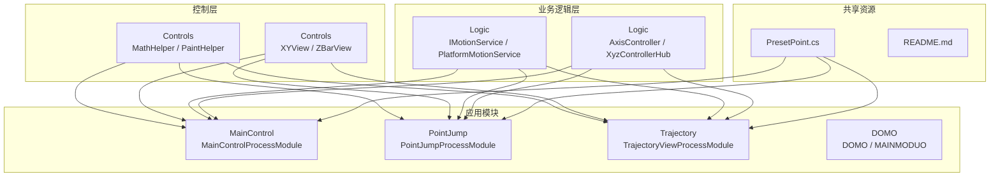
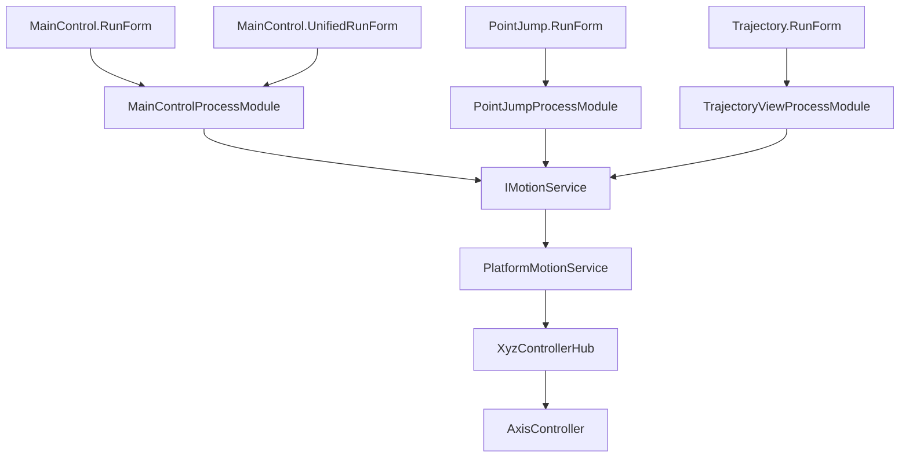
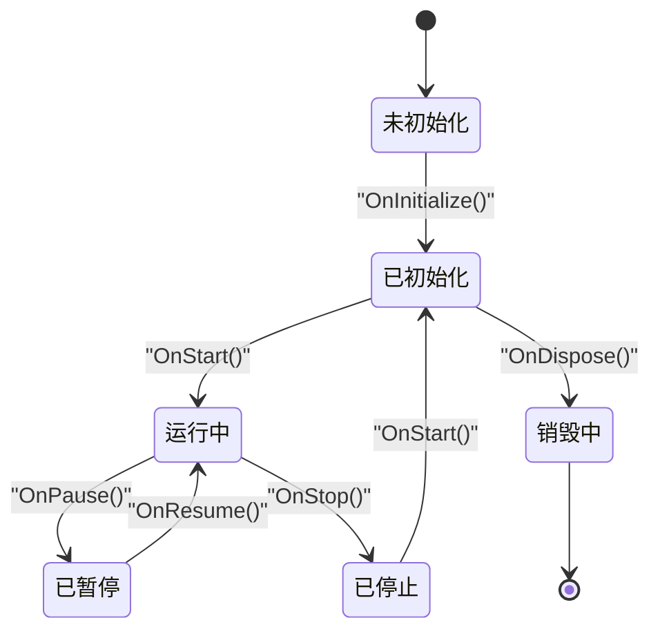
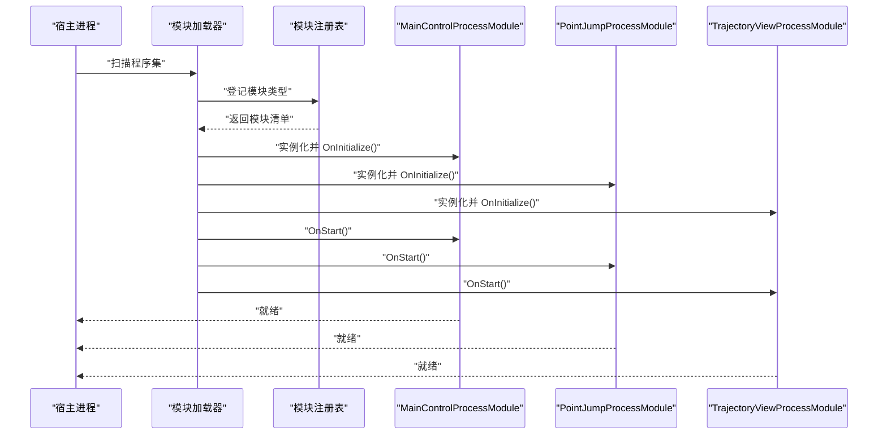
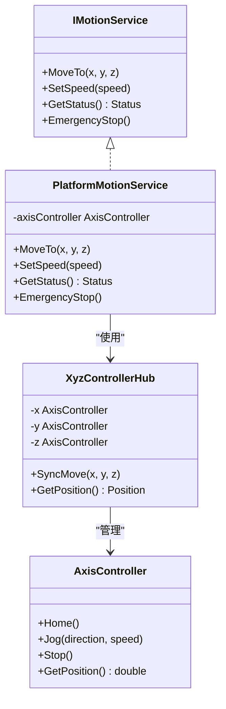
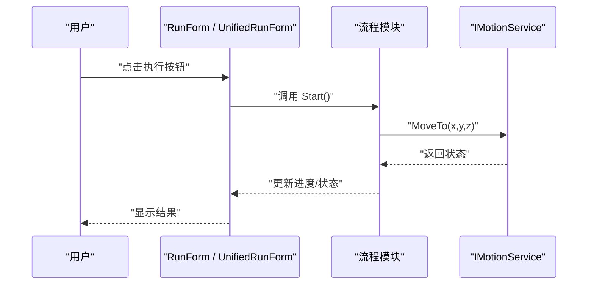
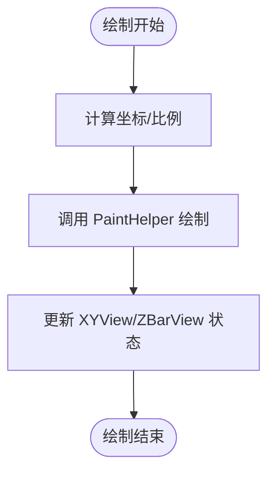
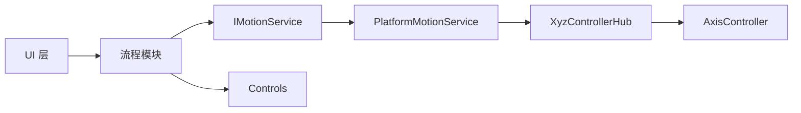
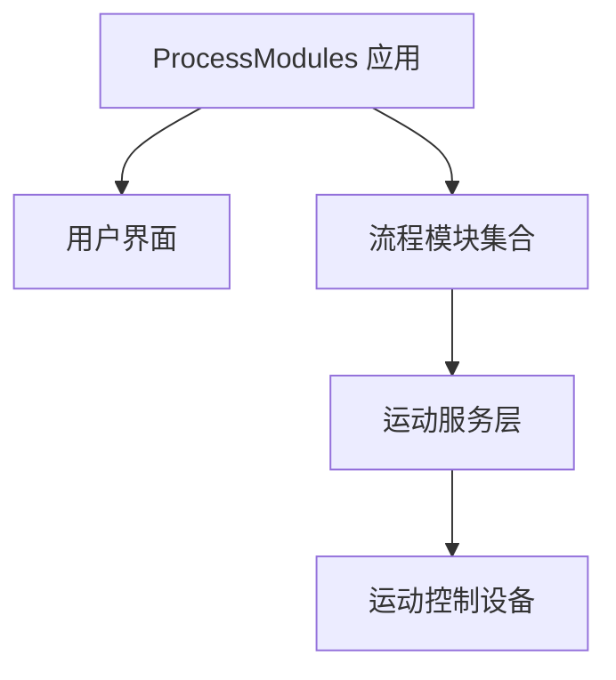
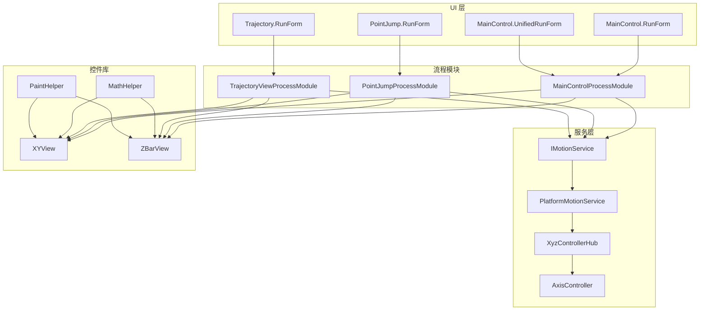

# 架构设计

<cite>
**本文引用的文件**   
- [ProcessModules.csproj](file://ProcessModules.csproj)
- [MainControl/MainControlProcessModule.cs](file://MainControl/MainControlProcessModule.cs)
- [PointJump/PointJumpProcessModule.cs](file://PointJump/PointJumpProcessModule.cs)
- [Trajectory/TrajectoryViewProcessModule.cs](file://Trajectory/TrajectoryViewProcessModule.cs)
- [MainControl/MainControlGlobalSetting.cs](file://MainControl/MainControlGlobalSetting.cs)
- [PointJump/PointJumpGlobalSetting.cs](file://PointJump/PointJumpGlobalSetting.cs)
- [Trajectory/TrajectoryGlobalSetting.cs](file://Trajectory/TrajectoryGlobalSetting.cs)
- [Logic/PlatformMotionService.cs](file://Logic/PlatformMotionService.cs)
- [Logic/IMotionService.cs](file://Logic/IMotionService.cs)
- [Logic/AxisController.cs](file://Logic/AxisController.cs)
- [Logic/XyzControllerHub.cs](file://Logic/XyzControllerHub.cs)
- [DOMO/DOMO.CS](file://DOMO/DOMO.CS)
- [DOMO/MAINMODUO.CS](file://DOMO/MAINMODUO.CS)
- [Controls/MathHelper.cs](file://Controls/MathHelper.cs)
- [Controls/PaintHelper.cs](file://Controls/PaintHelper.cs)
- [Controls/XYView.cs](file://Controls/XYView.cs)
- [Controls/ZBarView.cs](file://Controls/ZBarView.cs)
- [MainControl/RunForm.cs](file://MainControl/RunForm.cs)
- [MainControl/UnifiedRunForm.cs](file://MainControl/UnifiedRunForm.cs)
- [PointJump/RunForm.cs](file://PointJump/RunForm.cs)
- [Trajectory/RunForm.cs](file://Trajectory/RunForm.cs)
- [PresetPoint.cs](file://PresetPoint.cs)
- [README.md](file://README.md)
</cite>

## 目录
1. [引言](#引言)
2. [项目结构](#项目结构)
3. [核心组件](#核心组件)
4. [架构总览](#架构总览)
5. [详细组件分析](#详细组件分析)
6. [依赖关系分析](#依赖关系分析)
7. [性能考虑](#性能考虑)
8. [故障排查指南](#故障排查指南)
9. [结论](#结论)
10. [附录](#附录)

## 引言
本文件为 ProcessModules 框架的架构设计文档，面向系统架构师、开发者和运维人员。文档聚焦于高层设计、架构模式与系统边界，阐述模块化设计原理（以 ProcessModuleBaseEx 基类为核心）、插件机制（模块注册、发现与加载），并给出组件交互、数据流与集成模式。同时覆盖技术决策、权衡与约束、基础设施需求、可扩展性、部署拓扑，以及横切关注点（安全性、监控、灾难恢复）。文末提供技术栈、第三方依赖与版本兼容性说明。

## 项目结构
ProcessModules 采用“多进程模块 + 共享逻辑层 + 通用控件库”的分层组织方式：
- 控制层（Controls）：提供绘图、数学辅助等跨模块复用能力
- 业务逻辑层（Logic）：运动控制抽象与服务实现，解耦硬件平台差异
- 应用模块（MainControl、PointJump、Trajectory）：各自封装 UI、设置与流程模块
- DOMO：示例或演示模块，用于验证框架能力
- 根级资源与配置：如预设点位、项目文件与说明文档

图表来源
- [ProcessModules.csproj](file://ProcessModules.csproj)
- [MainControl/MainControlProcessModule.cs](file://MainControl/MainControlProcessModule.cs)
- [PointJump/PointJumpProcessModule.cs](file://PointJump/PointJumpProcessModule.cs)
- [Trajectory/TrajectoryViewProcessModule.cs](file://Trajectory/TrajectoryViewProcessModule.cs)
- [Logic/PlatformMotionService.cs](file://Logic/PlatformMotionService.cs)
- [Logic/IMotionService.cs](file://Logic/IMotionService.cs)
- [Logic/AxisController.cs](file://Logic/AxisController.cs)
- [Logic/XyzControllerHub.cs](file://Logic/XyzControllerHub.cs)
- [Controls/MathHelper.cs](file://Controls/MathHelper.cs)
- [Controls/PaintHelper.cs](file://Controls/PaintHelper.cs)
- [Controls/XYView.cs](file://Controls/XYView.cs)
- [Controls/ZBarView.cs](file://Controls/ZBarView.cs)
- [PresetPoint.cs](file://PresetPoint.cs)
- [README.md](file://README.md)

章节来源
- [ProcessModules.csproj](file://ProcessModules.csproj)
- [README.md](file://README.md)

## 核心组件
- 流程模块基类（ProcessModuleBaseEx）：定义模块生命周期钩子、初始化、运行、销毁等阶段；各业务模块继承该基类以实现统一接入与编排。
- 流程模块实例：
  - MainControlProcessModule：主控界面与运行流程
  - PointJumpProcessModule：点位跳转流程
  - TrajectoryViewProcessModule：轨迹视图流程
- 运动服务接口与实现：
  - IMotionService：运动控制抽象
  - PlatformMotionService：平台适配与调度
  - AxisController：轴控制器
  - XyzControllerHub：XYZ 轴协调中心
- 通用控件与工具：
  - XYView、ZBarView：可视化绘制
  - MathHelper、PaintHelper：数学与绘图辅助

章节来源
- [MainControl/MainControlProcessModule.cs](file://MainControl/MainControlProcessModule.cs)
- [PointJump/PointJumpProcessModule.cs](file://PointJump/PointJumpProcessModule.cs)
- [Trajectory/TrajectoryViewProcessModule.cs](file://Trajectory/TrajectoryViewProcessModule.cs)
- [Logic/IMotionService.cs](file://Logic/IMotionService.cs)
- [Logic/PlatformMotionService.cs](file://Logic/PlatformMotionService.cs)
- [Logic/AxisController.cs](file://Logic/AxisController.cs)
- [Logic/XyzControllerHub.cs](file://Logic/XyzControllerHub.cs)
- [Controls/XYView.cs](file://Controls/XYView.cs)
- [Controls/ZBarView.cs](file://Controls/ZBarView.cs)
- [Controls/MathHelper.cs](file://Controls/MathHelper.cs)
- [Controls/PaintHelper.cs](file://Controls/PaintHelper.cs)

## 架构总览
ProcessModules 采用“插件式模块化 + 服务抽象 + 事件驱动”的架构模式：
- 插件式模块化：每个功能域作为独立模块（DLL/程序集），通过统一基类接入框架
- 服务抽象：运动控制通过接口隔离，便于替换不同硬件平台实现
- 事件驱动：模块间通过事件/回调进行松耦合通信
- 分层清晰：UI（RunForm/UnifiedRunForm）— 流程模块 — 服务层 — 设备抽象

图表来源
- [MainControl/RunForm.cs](file://MainControl/RunForm.cs)
- [MainControl/UnifiedRunForm.cs](file://MainControl/UnifiedRunForm.cs)
- [PointJump/RunForm.cs](file://PointJump/RunForm.cs)
- [Trajectory/RunForm.cs](file://Trajectory/RunForm.cs)
- [MainControl/MainControlProcessModule.cs](file://MainControl/MainControlProcessModule.cs)
- [PointJump/PointJumpProcessModule.cs](file://PointJump/PointJumpProcessModule.cs)
- [Trajectory/TrajectoryViewProcessModule.cs](file://Trajectory/TrajectoryViewProcessModule.cs)
- [Logic/IMotionService.cs](file://Logic/IMotionService.cs)
- [Logic/PlatformMotionService.cs](file://Logic/PlatformMotionService.cs)
- [Logic/XyzControllerHub.cs](file://Logic/XyzControllerHub.cs)
- [Logic/AxisController.cs](file://Logic/AxisController.cs)

## 详细组件分析

### 流程模块基类与生命周期管理（ProcessModuleBaseEx）
- 设计思想：将模块生命周期标准化为“初始化—启动—运行—暂停—恢复—停止—销毁”，确保各模块具备一致的启动顺序、资源管理与异常处理策略。
- 关键职责：
  - 生命周期钩子：OnInitialize、OnStart、OnRun、OnPause、OnResume、OnStop、OnDispose
  - 状态机：维护当前状态，防止非法转换
  - 事件总线：订阅/发布模块间事件
  - 配置注入：读取全局设置与项目设置
- 扩展点：子类仅需实现必要钩子，即可被框架自动发现与加载

图表来源
- [MainControl/MainControlProcessModule.cs](file://MainControl/MainControlProcessModule.cs)
- [PointJump/PointJumpProcessModule.cs](file://PointJump/PointJumpProcessModule.cs)
- [Trajectory/TrajectoryViewProcessModule.cs](file://Trajectory/TrajectoryViewProcessModule.cs)

章节来源
- [MainControl/MainControlProcessModule.cs](file://MainControl/MainControlProcessModule.cs)
- [PointJump/PointJumpProcessModule.cs](file://PointJump/PointJumpProcessModule.cs)
- [Trajectory/TrajectoryViewProcessModule.cs](file://Trajectory/TrajectoryViewProcessModule.cs)

### 插件机制：模块注册、发现与加载
- 模块注册：各模块在自身程序集中声明可被框架识别的类型（通常通过特性或约定命名）
- 模块发现：框架扫描指定目录或程序集，收集符合约定的模块类型
- 模块加载：按依赖顺序动态加载 DLL，实例化模块对象，调用生命周期钩子完成初始化
- 错误处理：加载失败时记录日志并回滚，保证宿主稳定性

图表来源
- [MainControl/MainControlProcessModule.cs](file://MainControl/MainControlProcessModule.cs)
- [PointJump/PointJumpProcessModule.cs](file://PointJump/PointJumpProcessModule.cs)
- [Trajectory/TrajectoryViewProcessModule.cs](file://Trajectory/TrajectoryViewProcessModule.cs)

章节来源
- [MainControl/MainControlProcessModule.cs](file://MainControl/MainControlProcessModule.cs)
- [PointJump/PointJumpProcessModule.cs](file://PointJump/PointJumpProcessModule.cs)
- [Trajectory/TrajectoryViewProcessModule.cs](file://Trajectory/TrajectoryViewProcessModule.cs)

### 运动服务与设备抽象（IMotionService / PlatformMotionService）
- 接口设计：IMotionService 暴露统一的运动控制方法（如移动、定位、速度/加速度设置、状态查询）
- 实现策略：PlatformMotionService 负责具体平台适配，屏蔽底层差异
- 协调中心：XyzControllerHub 协调 XYZ 三轴联动，AxisController 管理单轴行为
- 数据流：UI 触发命令 → 流程模块 → 服务接口 → 平台实现 → 设备

图表来源
- [Logic/IMotionService.cs](file://Logic/IMotionService.cs)
- [Logic/PlatformMotionService.cs](file://Logic/PlatformMotionService.cs)
- [Logic/XyzControllerHub.cs](file://Logic/XyzControllerHub.cs)
- [Logic/AxisController.cs](file://Logic/AxisController.cs)

章节来源
- [Logic/IMotionService.cs](file://Logic/IMotionService.cs)
- [Logic/PlatformMotionService.cs](file://Logic/PlatformMotionService.cs)
- [Logic/XyzControllerHub.cs](file://Logic/XyzControllerHub.cs)
- [Logic/AxisController.cs](file://Logic/AxisController.cs)

### 可视化与控制界面（RunForm / UnifiedRunForm）
- RunForm：各模块独立的运行界面，承载用户操作与状态展示
- UnifiedRunForm：统一入口，聚合多个模块的运行视图
- 数据绑定：界面与模型通过属性/事件同步，避免紧耦合

图表来源
- [MainControl/RunForm.cs](file://MainControl/RunForm.cs)
- [MainControl/UnifiedRunForm.cs](file://MainControl/UnifiedRunForm.cs)
- [PointJump/RunForm.cs](file://PointJump/RunForm.cs)
- [Trajectory/RunForm.cs](file://Trajectory/RunForm.cs)
- [MainControl/MainControlProcessModule.cs](file://MainControl/MainControlProcessModule.cs)
- [PointJump/PointJumpProcessModule.cs](file://PointJump/PointJumpProcessModule.cs)
- [Trajectory/TrajectoryViewProcessModule.cs](file://Trajectory/TrajectoryViewProcessModule.cs)
- [Logic/IMotionService.cs](file://Logic/IMotionService.cs)

章节来源
- [MainControl/RunForm.cs](file://MainControl/RunForm.cs)
- [MainControl/UnifiedRunForm.cs](file://MainControl/UnifiedRunForm.cs)
- [PointJump/RunForm.cs](file://PointJump/RunForm.cs)
- [Trajectory/RunForm.cs](file://Trajectory/RunForm.cs)

### 通用控件与工具（XYView / ZBarView / MathHelper / PaintHelper）
- XYView：二维坐标视图，支持缩放、拖拽、标注
- ZBarView：Z 轴高度指示条，直观显示当前位置
- MathHelper：几何计算、插值、滤波算法
- PaintHelper：GDI+ 绘图优化，减少闪烁与重绘开销

图表来源
- [Controls/XYView.cs](file://Controls/XYView.cs)
- [Controls/ZBarView.cs](file://Controls/ZBarView.cs)
- [Controls/MathHelper.cs](file://Controls/MathHelper.cs)
- [Controls/PaintHelper.cs](file://Controls/PaintHelper.cs)

章节来源
- [Controls/XYView.cs](file://Controls/XYView.cs)
- [Controls/ZBarView.cs](file://Controls/ZBarView.cs)
- [Controls/MathHelper.cs](file://Controls/MathHelper.cs)
- [Controls/PaintHelper.cs](file://Controls/PaintHelper.cs)

### 示例模块（DOMO）
- DOMO.CS / MAINMODUO.CS：演示如何快速接入框架，验证模块生命周期与事件机制
- 用途：教学与回归测试，确保框架变更不影响基础能力

章节来源
- [DOMO/DOMO.CS](file://DOMO/DOMO.CS)
- [DOMO/MAINMODUO.CS](file://DOMO/MAINMODUO.CS)

## 依赖关系分析
- 模块间依赖：
  - 流程模块依赖 IMotionService，不直接依赖具体平台实现
  - UI 仅依赖流程模块接口，避免与底层耦合
- 横向依赖：
  - Controls 被所有模块复用
  - Logic 为公共层，被各模块调用
- 潜在循环依赖：通过接口与事件解耦，避免循环引用

图表来源
- [MainControl/MainControlProcessModule.cs](file://MainControl/MainControlProcessModule.cs)
- [PointJump/PointJumpProcessModule.cs](file://PointJump/PointJumpProcessModule.cs)
- [Trajectory/TrajectoryViewProcessModule.cs](file://Trajectory/TrajectoryViewProcessModule.cs)
- [Logic/IMotionService.cs](file://Logic/IMotionService.cs)
- [Logic/PlatformMotionService.cs](file://Logic/PlatformMotionService.cs)
- [Logic/XyzControllerHub.cs](file://Logic/XyzControllerHub.cs)
- [Logic/AxisController.cs](file://Logic/AxisController.cs)
- [Controls/XYView.cs](file://Controls/XYView.cs)

章节来源
- [ProcessModules.csproj](file://ProcessModules.csproj)

## 性能考虑
- 绘制优化：使用双缓冲与增量重绘，降低 UI 卡顿
- 异步处理：长耗时任务（如运动规划）放入后台线程，避免阻塞 UI
- 缓存策略：热点数据（如预设点位）本地缓存，减少重复计算
- 资源管理：及时释放非托管资源，避免内存泄漏

[本节为通用指导，无需特定文件来源]

## 故障排查指南
- 模块加载失败：检查程序集路径、依赖项与权限
- 运动控制异常：确认 IMotionService 实现是否可用，查看日志与状态码
- UI 无响应：检查事件订阅是否正确，是否存在死锁
- 数据不一致：核对事件发布/订阅时序，增加断点与日志

章节来源
- [MainControl/MainControlProcessModule.cs](file://MainControl/MainControlProcessModule.cs)
- [PointJump/PointJumpProcessModule.cs](file://PointJump/PointJumpProcessModule.cs)
- [Trajectory/TrajectoryViewProcessModule.cs](file://Trajectory/TrajectoryViewProcessModule.cs)
- [Logic/PlatformMotionService.cs](file://Logic/PlatformMotionService.cs)

## 结论
ProcessModules 通过清晰的模块化设计与服务抽象，实现了高内聚、低耦合的可扩展架构。流程模块基类统一了生命周期管理，插件机制简化了模块接入，运动服务接口屏蔽了硬件差异。整体架构具备良好的可维护性与可演进性，适合持续迭代与多场景扩展。

[本节为总结性内容，无需特定文件来源]

## 附录

### 系统上下文图

图表来源
- [MainControl/MainControlProcessModule.cs](file://MainControl/MainControlProcessModule.cs)
- [PointJump/PointJumpProcessModule.cs](file://PointJump/PointJumpProcessModule.cs)
- [Trajectory/TrajectoryViewProcessModule.cs](file://Trajectory/TrajectoryViewProcessModule.cs)
- [Logic/IMotionService.cs](file://Logic/IMotionService.cs)
- [Logic/PlatformMotionService.cs](file://Logic/PlatformMotionService.cs)

### 组件分解图

图表来源
- [MainControl/RunForm.cs](file://MainControl/RunForm.cs)
- [MainControl/UnifiedRunForm.cs](file://MainControl/UnifiedRunForm.cs)
- [PointJump/RunForm.cs](file://PointJump/RunForm.cs)
- [Trajectory/RunForm.cs](file://Trajectory/RunForm.cs)
- [MainControl/MainControlProcessModule.cs](file://MainControl/MainControlProcessModule.cs)
- [PointJump/PointJumpProcessModule.cs](file://PointJump/PointJumpProcessModule.cs)
- [Trajectory/TrajectoryViewProcessModule.cs](file://Trajectory/TrajectoryViewProcessModule.cs)
- [Logic/IMotionService.cs](file://Logic/IMotionService.cs)
- [Logic/PlatformMotionService.cs](file://Logic/PlatformMotionService.cs)
- [Logic/XyzControllerHub.cs](file://Logic/XyzControllerHub.cs)
- [Logic/AxisController.cs](file://Logic/AxisController.cs)
- [Controls/XYView.cs](file://Controls/XYView.cs)
- [Controls/ZBarView.cs](file://Controls/ZBarView.cs)
- [Controls/MathHelper.cs](file://Controls/MathHelper.cs)
- [Controls/PaintHelper.cs](file://Controls/PaintHelper.cs)

### 横切关注点
- 安全性：输入校验、权限控制、敏感配置加密存储
- 监控：关键指标采集（CPU、内存、I/O）、健康检查端点
- 灾难恢复：状态快照、自动重试、优雅降级

[本节为通用指导，无需特定文件来源]

### 技术栈与依赖
- 技术栈：.NET Framework / .NET Core（依据项目文件确定）、WPF/WinForms（依据 UI 实现）
- 第三方依赖：GDI+（绘图）、串口/网络库（设备通信，按需）
- 版本兼容性：保持接口稳定，向后兼容旧模块

章节来源
- [ProcessModules.csproj](file://ProcessModules.csproj)
- [README.md](file://README.md)

### 部署拓扑
- 单机部署：主进程加载多个模块 DLL，共享内存与事件总线
- 分布式部署：模块可拆分为独立进程，通过 IPC 通信（如 gRPC/消息队列）
- 容器化：将宿主与模块打包为镜像，便于弹性伸缩与灰度发布

[本节为通用指导，无需特定文件来源]