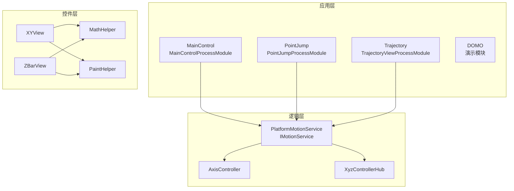
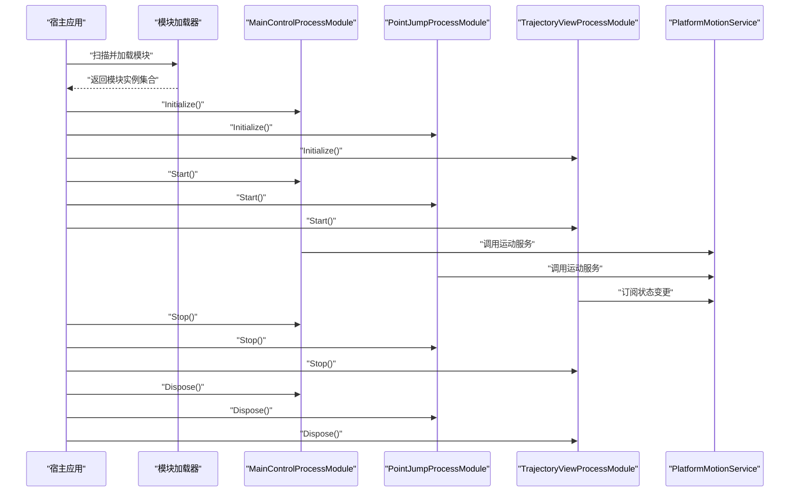
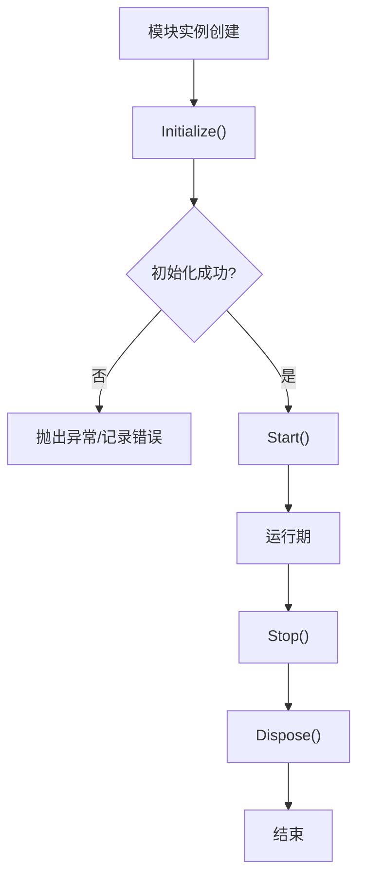
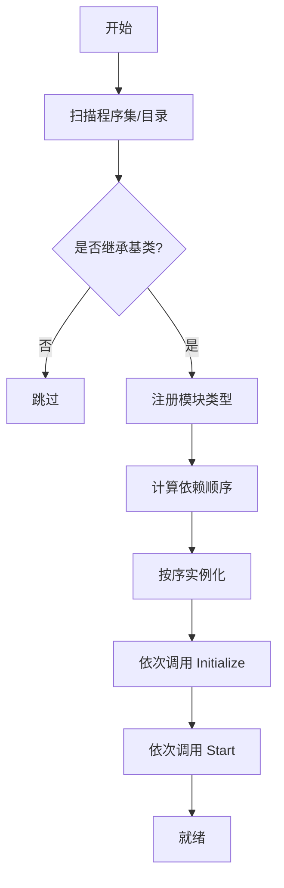
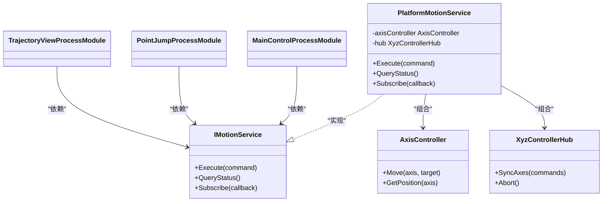
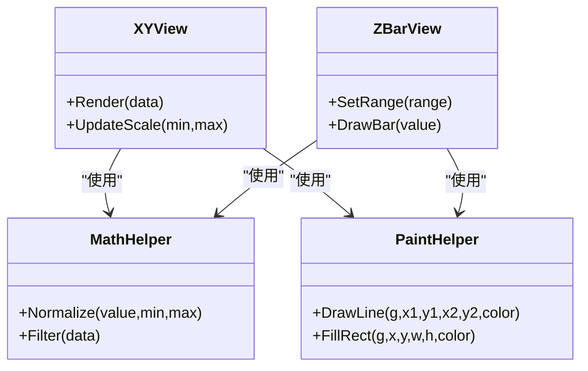
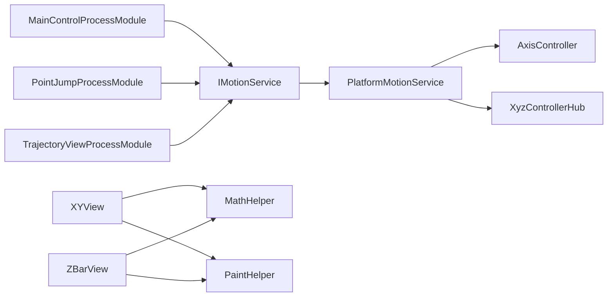

# 模块化架构设计

<cite>
**本文引用的文件**   
- [ProcessModules.csproj](file://ProcessModules.csproj)
- [MainControl/MainControlProcessModule.cs](file://MainControl/MainControlProcessModule.cs)
- [PointJump/PointJumpProcessModule.cs](file://PointJump/PointJumpProcessModule.cs)
- [Trajectory/TrajectoryViewProcessModule.cs](file://Trajectory/TrajectoryViewProcessModule.cs)
- [Logic/PlatformMotionService.cs](file://Logic/PlatformMotionService.cs)
- [Logic/IMotionService.cs](file://Logic/IMotionService.cs)
- [Logic/AxisController.cs](file://Logic/AxisController.cs)
- [Logic/XyzControllerHub.cs](file://Logic/XyzControllerHub.cs)
- [Controls/MathHelper.cs](file://Controls/MathHelper.cs)
- [Controls/PaintHelper.cs](file://Controls/PaintHelper.cs)
- [Controls/XYView.cs](file://Controls/XYView.cs)
- [Controls/ZBarView.cs](file://Controls/ZBarView.cs)
- [DOMO/DOMO.CS](file://DOMO/DOMO.CS)
- [DOMO/MAINMODUO.CS](file://DOMO/MAINMODUO.CS)
- [README.md](file://README.md)
- [基类调整说明.md](file://基类调整说明.md)
- [独立 DLL 构建说明.md](file://独立 DLL 构建说明.md)
</cite>

## 目录
1. [简介](#简介)
2. [项目结构](#项目结构)
3. [核心组件](#核心组件)
4. [架构总览](#架构总览)
5. [详细组件分析](#详细组件分析)
6. [依赖关系分析](#依赖关系分析)
7. [性能考量](#性能考量)
8. [故障排查指南](#故障排查指南)
9. [结论](#结论)
10. [附录](#附录)

## 简介
本文件面向 ProcessModules 框架的模块化架构，系统性阐述模块划分策略、依赖管理与模块间通信机制；深入解析 ProcessModuleBaseEx 基类的设计思想与生命周期管理（初始化、启动、停止、销毁）；文档化模块注册、发现与加载的实现要点；总结模块化架构的优势、约束与扩展点；并提供创建新模块与模块集成的实践示例。同时给出模块依赖图与数据流图，帮助读者快速理解组件交互关系。

## 项目结构
本项目采用“按功能域分模块”的组织方式：每个业务功能以独立工程或命名空间呈现，并通过统一的进程级模块基类进行生命周期管理。核心目录包括：
- Controls：通用控件与绘图辅助
- Logic：运动控制与平台适配服务
- MainControl：主控制界面与入口模块
- PointJump：点位跳转功能模块
- Trajectory：轨迹规划与显示模块
- DOMO：演示与示例模块

图表来源
- [MainControl/MainControlProcessModule.cs](file://MainControl/MainControlProcessModule.cs)
- [PointJump/PointJumpProcessModule.cs](file://PointJump/PointJumpProcessModule.cs)
- [Trajectory/TrajectoryViewProcessModule.cs](file://Trajectory/TrajectoryViewProcessModule.cs)
- [Logic/PlatformMotionService.cs](file://Logic/PlatformMotionService.cs)
- [Logic/IMotionService.cs](file://Logic/IMotionService.cs)
- [Logic/AxisController.cs](file://Logic/AxisController.cs)
- [Logic/XyzControllerHub.cs](file://Logic/XyzControllerHub.cs)
- [Controls/XYView.cs](file://Controls/XYView.cs)
- [Controls/ZBarView.cs](file://Controls/ZBarView.cs)
- [Controls/MathHelper.cs](file://Controls/MathHelper.cs)
- [Controls/PaintHelper.cs](file://Controls/PaintHelper.cs)

章节来源
- [README.md](file://README.md)
- [独立 DLL 构建说明.md](file://独立 DLL 构建说明.md)

## 核心组件
- 模块基类 ProcessModuleBaseEx：定义模块生命周期（初始化、启动、停止、销毁）、资源管理与事件钩子，所有业务模块继承该基类以获得统一的生命周期行为。
- 模块实现类：各功能模块通过继承基类并实现特定接口/方法完成自身职责，如 MainControlProcessModule、PointJumpProcessModule、TrajectoryViewProcessModule。
- 服务与控制器：PlatformMotionService 提供运动控制能力，IMotionService 抽象服务契约；AxisController 与 XyzControllerHub 负责轴控制与多轴协调。
- 控件与工具：XYView、ZBarView 用于可视化展示；MathHelper、PaintHelper 提供数学与绘图工具。

章节来源
- [基类调整说明.md](file://基类调整说明.md)
- [MainControl/MainControlProcessModule.cs](file://MainControl/MainControlProcessModule.cs)
- [PointJump/PointJumpProcessModule.cs](file://PointJump/PointJumpProcessModule.cs)
- [Trajectory/TrajectoryViewProcessModule.cs](file://Trajectory/TrajectoryViewProcessModule.cs)
- [Logic/PlatformMotionService.cs](file://Logic/PlatformMotionService.cs)
- [Logic/IMotionService.cs](file://Logic/IMotionService.cs)
- [Logic/AxisController.cs](file://Logic/AxisController.cs)
- [Logic/XyzControllerHub.cs](file://Logic/XyzControllerHub.cs)

## 架构总览
ProcessModules 框架采用“进程内插件式模块”架构：
- 模块层：各业务模块继承 ProcessModuleBaseEx，暴露生命周期钩子与服务访问点。
- 服务层：通过 IMotionService 等接口解耦具体实现，便于替换与测试。
- 视图层：控件封装 UI 交互与渲染，依赖工具库完成计算与绘制。
- 容器层：由宿主应用负责模块的发现、注册与生命周期编排。

图表来源
- [MainControl/MainControlProcessModule.cs](file://MainControl/MainControlProcessModule.cs)
- [PointJump/PointJumpProcessModule.cs](file://PointJump/PointJumpProcessModule.cs)
- [Trajectory/TrajectoryViewProcessModule.cs](file://Trajectory/TrajectoryViewProcessModule.cs)
- [Logic/PlatformMotionService.cs](file://Logic/PlatformMotionService.cs)

## 详细组件分析

### ProcessModuleBaseEx 基类与生命周期
- 设计思想：将模块的初始化、启动、停止、销毁等阶段抽象为可重写的方法，确保所有模块具备一致的生命周期行为与资源管理能力。
- 生命周期流程：
  - Initialize：分配资源、读取配置、建立依赖注入或服务引用。
  - Start：激活业务逻辑、注册事件、启动后台任务。
  - Stop：暂停任务、释放临时资源、取消订阅。
  - Dispose：释放持久资源、清理句柄、关闭连接。
- 扩展点：可在派生类中重写对应生命周期方法，并在其中加入自定义逻辑；建议避免在构造函数中进行重操作，尽量使用 Initialize 阶段。

图表来源
- [基类调整说明.md](file://基类调整说明.md)

章节来源
- [基类调整说明.md](file://基类调整说明.md)

### 模块注册、发现与加载机制
- 模块类型约定：每个模块类需继承 ProcessModuleBaseEx，并按命名规范暴露默认构造以便反射实例化。
- 发现策略：宿主应用扫描指定程序集或目录，识别符合约定的模块类型。
- 注册与装配：将发现的模块类型注册到容器，按需注入服务与配置。
- 加载顺序：根据依赖关系确定加载顺序，确保被依赖模块先于依赖方加载。

图表来源
- [MainControl/MainControlProcessModule.cs](file://MainControl/MainControlProcessModule.cs)
- [PointJump/PointJumpProcessModule.cs](file://PointJump/PointJumpProcessModule.cs)
- [Trajectory/TrajectoryViewProcessModule.cs](file://Trajectory/TrajectoryViewProcessModule.cs)

章节来源
- [MainControl/MainControlProcessModule.cs](file://MainControl/MainControlProcessModule.cs)
- [PointJump/PointJumpProcessModule.cs](file://PointJump/PointJumpProcessModule.cs)
- [Trajectory/TrajectoryViewProcessModule.cs](file://Trajectory/TrajectoryViewProcessModule.cs)

### 模块间通信与依赖管理
- 服务契约：通过 IMotionService 等接口定义服务契约，模块仅依赖接口而非具体实现，降低耦合度。
- 依赖注入：由容器统一管理服务的生命周期与作用域，模块在 Initialize 阶段获取所需服务。
- 事件总线：模块可通过事件发布/订阅进行松耦合通信，避免直接引用其他模块。
- 数据流：UI 控件通过服务层获取状态与命令，服务层再与底层硬件或仿真引擎交互。

图表来源
- [Logic/IMotionService.cs](file://Logic/IMotionService.cs)
- [Logic/PlatformMotionService.cs](file://Logic/PlatformMotionService.cs)
- [Logic/AxisController.cs](file://Logic/AxisController.cs)
- [Logic/XyzControllerHub.cs](file://Logic/XyzControllerHub.cs)
- [MainControl/MainControlProcessModule.cs](file://MainControl/MainControlProcessModule.cs)
- [PointJump/PointJumpProcessModule.cs](file://PointJump/PointJumpProcessModule.cs)
- [Trajectory/TrajectoryViewProcessModule.cs](file://Trajectory/TrajectoryViewProcessModule.cs)

章节来源
- [Logic/IMotionService.cs](file://Logic/IMotionService.cs)
- [Logic/PlatformMotionService.cs](file://Logic/PlatformMotionService.cs)
- [Logic/AxisController.cs](file://Logic/AxisController.cs)
- [Logic/XyzControllerHub.cs](file://Logic/XyzControllerHub.cs)

### 控件与工具组件
- XYView、ZBarView：封装坐标与条形图绘制逻辑，依赖 MathHelper 与 PaintHelper 完成数值计算与图形渲染。
- MathHelper：提供常用数学运算（如插值、滤波、单位换算）。
- PaintHelper：封装绘图上下文、画笔与颜色管理等重复性操作。

图表来源
- [Controls/XYView.cs](file://Controls/XYView.cs)
- [Controls/ZBarView.cs](file://Controls/ZBarView.cs)
- [Controls/MathHelper.cs](file://Controls/MathHelper.cs)
- [Controls/PaintHelper.cs](file://Controls/PaintHelper.cs)

章节来源
- [Controls/XYView.cs](file://Controls/XYView.cs)
- [Controls/ZBarView.cs](file://Controls/ZBarView.cs)
- [Controls/MathHelper.cs](file://Controls/MathHelper.cs)
- [Controls/PaintHelper.cs](file://Controls/PaintHelper.cs)

### 演示与示例模块
- DOMO 模块：包含演示代码与示例入口，用于验证模块加载与生命周期流程。
- MAINMODUO：示例主模块，展示如何集成多个功能模块并协调其工作。

章节来源
- [DOMO/DOMO.CS](file://DOMO/DOMO.CS)
- [DOMO/MAINMODUO.CS](file://DOMO/MAINMODUO.CS)

## 依赖关系分析
- 低耦合：模块通过接口依赖服务，避免直接引用具体实现。
- 分层清晰：UI 层不直接访问硬件或底层控制，而是通过服务层中转。
- 可扩展：新增模块只需实现接口并继承基类，无需修改现有模块。
- 潜在循环依赖：应通过事件或消息总线避免模块间直接相互引用。

图表来源
- [MainControl/MainControlProcessModule.cs](file://MainControl/MainControlProcessModule.cs)
- [PointJump/PointJumpProcessModule.cs](file://PointJump/PointJumpProcessModule.cs)
- [Trajectory/TrajectoryViewProcessModule.cs](file://Trajectory/TrajectoryViewProcessModule.cs)
- [Logic/IMotionService.cs](file://Logic/IMotionService.cs)
- [Logic/PlatformMotionService.cs](file://Logic/PlatformMotionService.cs)
- [Logic/AxisController.cs](file://Logic/AxisController.cs)
- [Logic/XyzControllerHub.cs](file://Logic/XyzControllerHub.cs)
- [Controls/XYView.cs](file://Controls/XYView.cs)
- [Controls/ZBarView.cs](file://Controls/ZBarView.cs)
- [Controls/MathHelper.cs](file://Controls/MathHelper.cs)
- [Controls/PaintHelper.cs](file://Controls/PaintHelper.cs)

章节来源
- [ProcessModules.csproj](file://ProcessModules.csproj)

## 性能考量
- 延迟初始化：仅在需要时加载重型模块，减少启动时间。
- 异步处理：IO 与耗时计算放入后台线程，避免阻塞 UI。
- 事件去抖与节流：高频事件（如位置更新）进行采样与合并，降低刷新压力。
- 资源复用：共享绘图上下文与对象池，减少 GC 压力。
- 监控与诊断：记录关键指标（帧率、内存、CPU），定位瓶颈。

[本节为通用指导，不涉及具体文件分析]

## 故障排查指南
- 模块未加载：检查程序集扫描路径与模块命名约定是否正确。
- 生命周期异常：确认 Initialize/Start/Stop/Dispose 中的异常捕获与日志输出。
- 依赖注入失败：核对服务注册与作用域设置，确保接口与实现匹配。
- 事件未触发：检查订阅是否在正确时机注册，避免过早释放。
- 性能问题：启用性能计数器与采样，定位热点函数与锁竞争。

章节来源
- [基类调整说明.md](file://基类调整说明.md)
- [独立 DLL 构建说明.md](file://独立 DLL 构建说明.md)

## 结论
ProcessModules 框架通过清晰的模块边界、统一的生命周期管理与基于接口的服务契约，实现了高内聚、低耦合的可扩展架构。借助事件总线与依赖注入，模块间通信简洁且易于测试。遵循本文档的最佳实践，可以快速构建稳定、可维护的运动控制与应用系统。

[本节为总结性内容，不涉及具体文件分析]

## 附录
- 创建新模块的步骤：
  - 新建模块工程或类，继承 ProcessModuleBaseEx。
  - 在 Initialize 中注册服务与订阅事件。
  - 在 Start 中启动业务逻辑与后台任务。
  - 在 Stop 中暂停任务与取消订阅。
  - 在 Dispose 中释放资源与关闭连接。
- 模块集成模式：
  - 服务消费：通过 IMotionService 调用运动控制能力。
  - 事件驱动：订阅状态变化，驱动 UI 更新。
  - 数据绑定：将服务状态绑定至控件，实现实时显示。

章节来源
- [MainControl/MainControlProcessModule.cs](file://MainControl/MainControlProcessModule.cs)
- [PointJump/PointJumpProcessModule.cs](file://PointJump/PointJumpProcessModule.cs)
- [Trajectory/TrajectoryViewProcessModule.cs](file://Trajectory/TrajectoryViewProcessModule.cs)
- [Logic/IMotionService.cs](file://Logic/IMotionService.cs)
- [Logic/PlatformMotionService.cs](file://Logic/PlatformMotionService.cs)