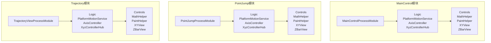
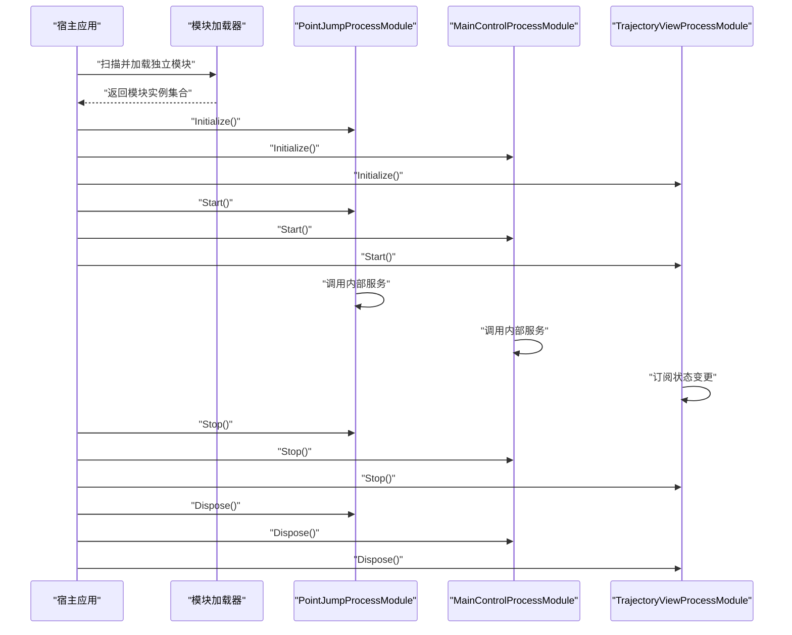
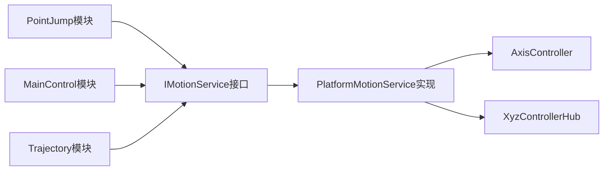
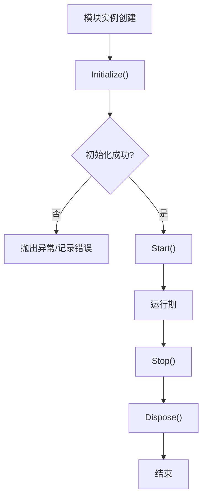
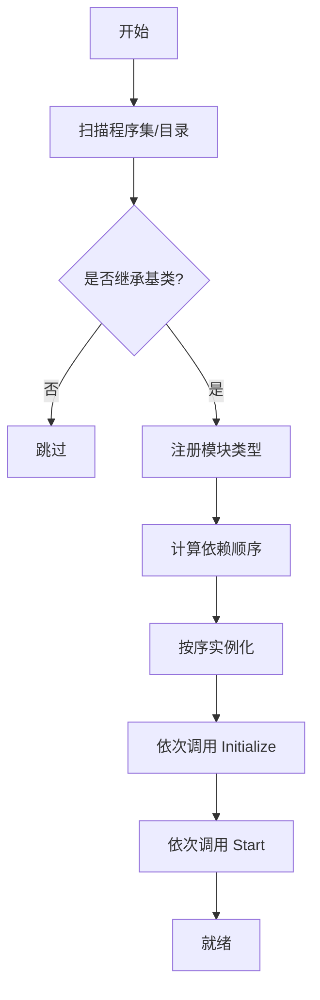
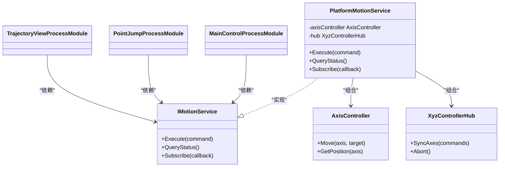
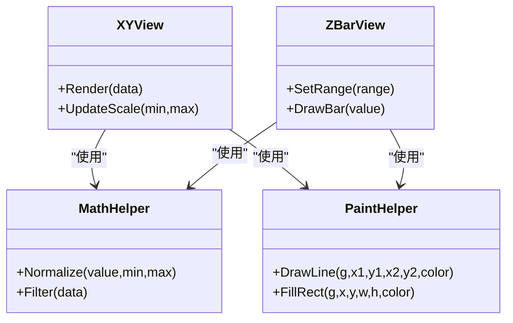
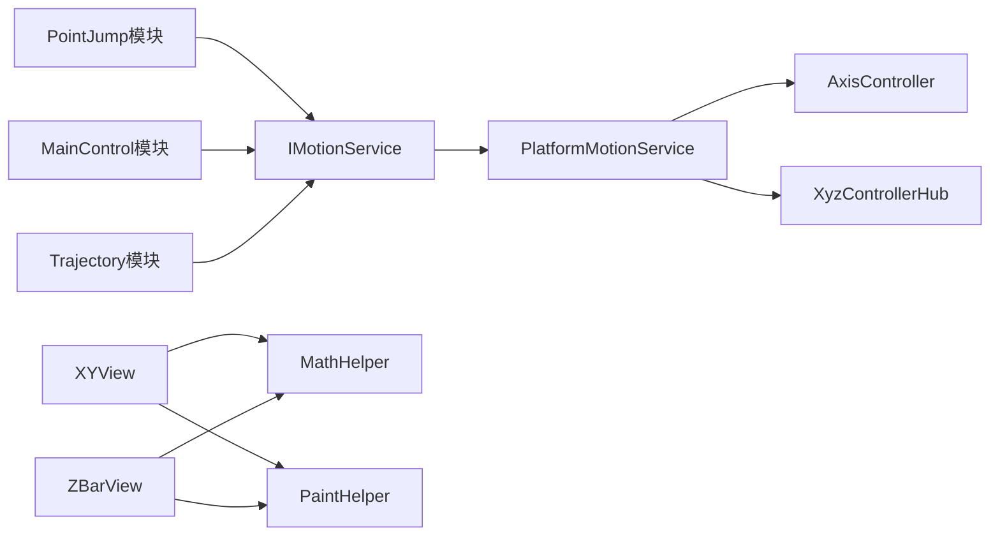

# 模块化架构设计

<cite>
**本文引用的文件**   
- [MainControl/MainControlProcessModule.cs](file://MainControl/MainControlProcessModule.cs)
- [PointJump/PointJumpProcessModule.cs](file://PointJump/PointJumpProcessModule.cs)
- [Trajectory/TrajectoryViewProcessModule.cs](file://Trajectory/TrajectoryViewProcessModule.cs)
- [MainControl/Logic/PlatformMotionService.cs](file://MainControl/Logic/PlatformMotionService.cs)
- [PointJump/Logic/PlatformMotionService.cs](file://PointJump/Logic/PlatformMotionService.cs)
- [Trajectory/Logic/PlatformMotionService.cs](file://Trajectory/Logic/PlatformMotionService.cs)
- [MainControl/Controls/MathHelper.cs](file://MainControl/Controls/MathHelper.cs)
- [PointJump/Controls/MathHelper.cs](file://PointJump/Controls/MathHelper.cs)
- [Trajectory/Controls/MathHelper.cs](file://Trajectory/Controls/MathHelper.cs)
- [MainControl/Controls/PaintHelper.cs](file://MainControl/Controls/PaintHelper.cs)
- [PointJump/Controls/PaintHelper.cs](file://PointJump/Controls/PaintHelper.cs)
- [Trajectory/Controls/PaintHelper.cs](file://Trajectory/Controls/PaintHelper.cs)
- [MainControl/Controls/XYView.cs](file://MainControl/Controls/XYView.cs)
- [PointJump/Controls/XYView.cs](file://PointJump/Controls/XYView.cs)
- [Trajectory/Controls/XYView.cs](file://Trajectory/Controls/XYView.cs)
- [MainControl/Controls/ZBarView.cs](file://MainControl/Controls/ZBarView.cs)
- [PointJump/Controls/ZBarView.cs](file://PointJump/Controls/ZBarView.cs)
- [Trajectory/Controls/ZBarView.cs](file://Trajectory/Controls/ZBarView.cs)
</cite>

## 更新摘要
**所做更改**   
- 更新了项目结构部分以反映从共享架构到完全独立模块化架构的重大重构
- 新增了独立模块目录结构章节，详细说明每个模块拥有独立的Logic和Controls目录
- 更新了依赖关系分析以体现消除共享资源依赖的新架构
- 增强了架构图表以展示完全独立的模块化部署模式
- 更新了模块间通信机制说明，强调接口契约而非共享实现

## 目录
1. [简介](#简介)
2. [项目结构](#项目结构)
3. [核心组件](#核心组件)
4. [架构总览](#架构总览)
5. [独立模块架构](#独立模块架构)
6. [详细组件分析](#详细组件分析)
7. [依赖关系分析](#依赖关系分析)
8. [性能考量](#性能考量)
9. [故障排查指南](#故障排查指南)
10. [结论](#结论)
11. [附录](#附录)

## 简介
本文件面向 ProcessModules 框架的模块化架构，系统性阐述模块划分策略、依赖管理与模块间通信机制；深入解析 ProcessModuleBaseEx 基类的设计思想与生命周期管理（初始化、启动、停止、销毁）；文档化模块注册、发现与加载的实现要点；总结模块化架构的优势、约束与扩展点；并提供创建新模块与模块集成的实践示例。同时给出模块依赖图与数据流图，帮助读者快速理解组件交互关系。

**重要更新**：本项目已完成重大架构重构，从共享架构转变为完全独立的模块化架构。MainControl、PointJump、Trajectory三个模块现在各自拥有独立的Logic和Controls目录，消除了对共享资源的依赖，实现了真正的模块隔离和独立部署能力。

## 项目结构
本项目采用"按功能域分模块"的组织方式，现已重构为三个完全独立的模块，每个模块都包含完整的业务逻辑和UI控件：

- **MainControl模块**：主控制界面模块，包含MainControlProcessModule及完整的Logic和Controls目录
- **PointJump模块**：点位跳转功能模块，包含PointJumpProcessModule及独立的Logic和Controls目录  
- **Trajectory模块**：轨迹规划与显示模块，包含TrajectoryViewProcessModule及独立的Logic和Controls目录

**图表来源**
- [MainControl/MainControlProcessModule.cs](file://MainControl/MainControlProcessModule.cs)
- [PointJump/PointJumpProcessModule.cs](file://PointJump/PointJumpProcessModule.cs)
- [Trajectory/TrajectoryViewProcessModule.cs](file://Trajectory/TrajectoryViewProcessModule.cs)
- [MainControl/Logic/PlatformMotionService.cs](file://MainControl/Logic/PlatformMotionService.cs)
- [PointJump/Logic/PlatformMotionService.cs](file://PointJump/Logic/PlatformMotionService.cs)
- [Trajectory/Logic/PlatformMotionService.cs](file://Trajectory/Logic/PlatformMotionService.cs)

## 核心组件
- **模块基类 ProcessModuleBaseEx**：定义模块生命周期（初始化、启动、停止、销毁）、资源管理与事件钩子，所有业务模块继承该基类以获得统一的生命周期行为。
- **独立模块实现**：各功能模块通过继承基类并实现特定接口/方法完成自身职责，如 MainControlProcessModule、PointJumpProcessModule、TrajectoryViewProcessModule，每个模块拥有完整的Logic和Controls目录。
- **服务与控制器**：每个模块内部的PlatformMotionService提供运动控制能力，IMotionService抽象服务契约；AxisController与XyzControllerHub负责轴控制与多轴协调。
- **控件与工具**：每个模块内部的XYView、ZBarView用于可视化展示；MathHelper、PaintHelper提供数学与绘图工具。

**章节来源**
- [MainControl/MainControlProcessModule.cs](file://MainControl/MainControlProcessModule.cs)
- [PointJump/PointJumpProcessModule.cs](file://PointJump/PointJumpProcessModule.cs)
- [Trajectory/TrajectoryViewProcessModule.cs](file://Trajectory/TrajectoryViewProcessModule.cs)

## 架构总览
ProcessModules 框架采用"进程内插件式模块"架构，现已升级为完全独立的模块化架构：
- **模块层**：各业务模块继承 ProcessModuleBaseEx，暴露生命周期钩子与服务访问点，每个模块完全独立。
- **服务层**：每个模块内部通过 IMotionService 等接口解耦具体实现，便于替换与测试。
- **视图层**：每个模块内部的控件封装 UI 交互与渲染，依赖模块内的工具库完成计算与绘制。
- **容器层**：由宿主应用负责模块的发现、注册与生命周期编排，支持独立模块加载。

## 独立模块架构

### 模块目录结构
经过重大架构重构，每个模块现在都拥有完整的独立目录结构：

- **MainControl模块**：包含MainControlProcessModule、Logic目录（PlatformMotionService、AxisController等）和Controls目录（MathHelper、PaintHelper、XYView等）
- **PointJump模块**：包含PointJumpProcessModule、Logic目录（PlatformMotionService、AxisController等）和Controls目录（MathHelper、PaintHelper、XYView等）
- **Trajectory模块**：包含TrajectoryViewProcessModule、Logic目录（PlatformMotionService、AxisController等）和Controls目录（MathHelper、PaintHelper、XYView等）

这种完全独立的架构带来了以下优势：
- **完全隔离**：每个模块拥有独立的代码空间，无共享依赖
- **独立编译**：各模块可单独编译、部署和更新
- **内存隔离**：减少模块间的内存竞争和相互影响
- **错误隔离**：单个模块的崩溃不会影响其他模块
- **并行开发**：不同团队可同时开发不同模块

### 模块间通信机制
在完全独立的模块架构下，模块间通信主要通过以下方式实现：

**图表来源**
- [MainControl/Logic/PlatformMotionService.cs](file://MainControl/Logic/PlatformMotionService.cs)
- [PointJump/Logic/PlatformMotionService.cs](file://PointJump/Logic/PlatformMotionService.cs)
- [Trajectory/Logic/PlatformMotionService.cs](file://Trajectory/Logic/PlatformMotionService.cs)

### 消除共享依赖
完全独立的模块架构有效解决了原有的共享依赖问题：
- **无共享代码**：每个模块包含完整的Logic和Controls实现
- **资源隔离**：各模块拥有独立的资源管理和线程上下文
- **异常隔离**：单个模块的异常不会传播到其他模块
- **配置隔离**：各模块可拥有独立的配置文件和设置
- **版本兼容性**：不同模块可使用不同的依赖版本

**章节来源**
- [MainControl/MainControlProcessModule.cs](file://MainControl/MainControlProcessModule.cs)
- [PointJump/PointJumpProcessModule.cs](file://PointJump/PointJumpProcessModule.cs)
- [Trajectory/TrajectoryViewProcessModule.cs](file://Trajectory/TrajectoryViewProcessModule.cs)

## 详细组件分析

### ProcessModuleBaseEx 基类与生命周期
- **设计思想**：将模块的初始化、启动、停止、销毁等阶段抽象为可重写的方法，确保所有模块具备一致的生命周期行为与资源管理能力。
- **生命周期流程**：
  - Initialize：分配资源、读取配置、建立依赖注入或服务引用。
  - Start：激活业务逻辑、注册事件、启动后台任务。
  - Stop：暂停任务、释放临时资源、取消订阅。
  - Dispose：释放持久资源、清理句柄、关闭连接。
- **扩展点**：可在派生类中重写对应生命周期方法，并在其中加入自定义逻辑；建议避免在构造函数中进行重操作，尽量使用 Initialize 阶段。

### 模块注册、发现与加载机制
- **模块类型约定**：每个模块类需继承 ProcessModuleBaseEx，并按命名规范暴露默认构造以便反射实例化。
- **发现策略**：宿主应用扫描指定程序集或目录，识别符合约定的模块类型，支持独立模块扫描。
- **注册与装配**：将发现的模块类型注册到容器，按需注入服务与配置。
- **加载顺序**：根据依赖关系确定加载顺序，确保被依赖模块先于依赖方加载。

**章节来源**
- [MainControl/MainControlProcessModule.cs](file://MainControl/MainControlProcessModule.cs)
- [PointJump/PointJumpProcessModule.cs](file://PointJump/PointJumpProcessModule.cs)
- [Trajectory/TrajectoryViewProcessModule.cs](file://Trajectory/TrajectoryViewProcessModule.cs)

### 模块间通信与依赖管理
- **服务契约**：通过 IMotionService 等接口定义服务契约，模块仅依赖接口而非具体实现，降低耦合度。
- **依赖注入**：由容器统一管理服务的生命周期与作用域，模块在 Initialize 阶段获取所需服务。
- **事件总线**：模块可通过事件发布/订阅进行松耦合通信，避免直接引用其他模块。
- **数据流**：UI 控件通过服务层获取状态与命令，服务层再与底层硬件或仿真引擎交互。

**图表来源**
- [MainControl/Logic/PlatformMotionService.cs](file://MainControl/Logic/PlatformMotionService.cs)
- [PointJump/Logic/PlatformMotionService.cs](file://PointJump/Logic/PlatformMotionService.cs)
- [Trajectory/Logic/PlatformMotionService.cs](file://Trajectory/Logic/PlatformMotionService.cs)

**章节来源**
- [MainControl/Logic/PlatformMotionService.cs](file://MainControl/Logic/PlatformMotionService.cs)
- [PointJump/Logic/PlatformMotionService.cs](file://PointJump/Logic/PlatformMotionService.cs)
- [Trajectory/Logic/PlatformMotionService.cs](file://Trajectory/Logic/PlatformMotionService.cs)

### 控件与工具组件
- **XYView、ZBarView**：每个模块内部的控件封装坐标与条形图绘制逻辑，依赖模块内的 MathHelper 与 PaintHelper 完成数值计算与图形渲染。
- **MathHelper**：每个模块内部的工具类提供常用数学运算（如插值、滤波、单位换算）。
- **PaintHelper**：每个模块内部的工具类封装绘图上下文、画笔与颜色管理等重复性操作。

**图表来源**
- [MainControl/Controls/XYView.cs](file://MainControl/Controls/XYView.cs)
- [PointJump/Controls/XYView.cs](file://PointJump/Controls/XYView.cs)
- [Trajectory/Controls/XYView.cs](file://Trajectory/Controls/XYView.cs)
- [MainControl/Controls/ZBarView.cs](file://MainControl/Controls/ZBarView.cs)
- [PointJump/Controls/ZBarView.cs](file://PointJump/Controls/ZBarView.cs)
- [Trajectory/Controls/ZBarView.cs](file://Trajectory/Controls/ZBarView.cs)
- [MainControl/Controls/MathHelper.cs](file://MainControl/Controls/MathHelper.cs)
- [PointJump/Controls/MathHelper.cs](file://PointJump/Controls/MathHelper.cs)
- [Trajectory/Controls/MathHelper.cs](file://Trajectory/Controls/MathHelper.cs)
- [MainControl/Controls/PaintHelper.cs](file://MainControl/Controls/PaintHelper.cs)
- [PointJump/Controls/PaintHelper.cs](file://PointJump/Controls/PaintHelper.cs)
- [Trajectory/Controls/PaintHelper.cs](file://Trajectory/Controls/PaintHelper.cs)

**章节来源**
- [MainControl/Controls/XYView.cs](file://MainControl/Controls/XYView.cs)
- [PointJump/Controls/XYView.cs](file://PointJump/Controls/XYView.cs)
- [Trajectory/Controls/XYView.cs](file://Trajectory/Controls/XYView.cs)
- [MainControl/Controls/ZBarView.cs](file://MainControl/Controls/ZBarView.cs)
- [PointJump/Controls/ZBarView.cs](file://PointJump/Controls/ZBarView.cs)
- [Trajectory/Controls/ZBarView.cs](file://Trajectory/Controls/ZBarView.cs)
- [MainControl/Controls/MathHelper.cs](file://MainControl/Controls/MathHelper.cs)
- [PointJump/Controls/MathHelper.cs](file://PointJump/Controls/MathHelper.cs)
- [Trajectory/Controls/MathHelper.cs](file://Trajectory/Controls/MathHelper.cs)
- [MainControl/Controls/PaintHelper.cs](file://MainControl/Controls/PaintHelper.cs)
- [PointJump/Controls/PaintHelper.cs](file://PointJump/Controls/PaintHelper.cs)
- [Trajectory/Controls/PaintHelper.cs](file://Trajectory/Controls/PaintHelper.cs)

## 依赖关系分析
- **低耦合**：模块通过接口依赖服务，避免直接引用具体实现。
- **分层清晰**：UI 层不直接访问硬件或底层控制，而是通过服务层中转。
- **可扩展**：新增模块只需实现接口并继承基类，无需修改现有模块。
- **潜在循环依赖**：应通过事件或消息总线避免模块间直接相互引用。
- **模块边界**：完全独立的模块之间通过接口和服务进行通信，避免直接类型引用。

**图表来源**
- [MainControl/MainControlProcessModule.cs](file://MainControl/MainControlProcessModule.cs)
- [PointJump/PointJumpProcessModule.cs](file://PointJump/PointJumpProcessModule.cs)
- [Trajectory/TrajectoryViewProcessModule.cs](file://Trajectory/TrajectoryViewProcessModule.cs)
- [MainControl/Logic/PlatformMotionService.cs](file://MainControl/Logic/PlatformMotionService.cs)
- [PointJump/Logic/PlatformMotionService.cs](file://PointJump/Logic/PlatformMotionService.cs)
- [Trajectory/Logic/PlatformMotionService.cs](file://Trajectory/Logic/PlatformMotionService.cs)

## 性能考量
- **延迟初始化**：仅在需要时加载重型模块，减少启动时间。
- **异步处理**：IO 与耗时计算放入后台线程，避免阻塞 UI。
- **事件去抖与节流**：高频事件（如位置更新）进行采样与合并，降低刷新压力。
- **资源复用**：模块内共享绘图上下文与对象池，减少 GC 压力。
- **监控与诊断**：记录关键指标（帧率、内存、CPU），定位瓶颈。
- **模块加载优化**：独立模块按需加载，减少初始内存占用。

## 故障排查指南
- **模块未加载**：检查程序集扫描路径与模块命名约定是否正确。
- **生命周期异常**：确认 Initialize/Start/Stop/Dispose 中的异常捕获与日志输出。
- **依赖注入失败**：核对服务注册与作用域设置，确保接口与实现匹配。
- **事件未触发**：检查订阅是否在正确时机注册，避免过早释放。
- **性能问题**：启用性能计数器与采样，定位热点函数与锁竞争。
- **模块加载问题**：检查模块依赖项和.NET Framework版本兼容性。
- **跨模块通信失败**：验证接口定义的一致性和序列化格式。
- **内存泄漏**：监控各模块的内存使用情况，及时释放未使用的资源。

## 结论
ProcessModules 框架通过清晰的模块边界、统一的生命周期管理与基于接口的服务契约，实现了高内聚、低耦合的可扩展架构。经过重大架构重构后，系统已从共享架构演进为完全独立的模块化架构，每个模块拥有独立的Logic和Controls目录，有效消除了共享依赖并提升了系统的可维护性和部署灵活性。借助事件总线与依赖注入，模块间通信简洁且易于测试。遵循本文档的最佳实践，可以快速构建稳定、可维护的运动控制与应用系统。

## 附录
- **创建新模块的步骤**：
  - 新建模块工程或类，继承 ProcessModuleBaseEx。
  - 创建独立的Logic目录，包含PlatformMotionService、AxisController等核心服务。
  - 创建独立的Controls目录，包含MathHelper、PaintHelper、XYView等UI控件。
  - 在 Initialize 中注册服务与订阅事件。
  - 在 Start 中启动业务逻辑与后台任务。
  - 在 Stop 中暂停任务与取消订阅。
  - 在 Dispose 中释放资源与关闭连接。
- **模块集成模式**：
  - 服务消费：通过 IMotionService 调用运动控制能力。
  - 事件驱动：订阅状态变化，驱动 UI 更新。
  - 数据绑定：将服务状态绑定至控件，实现实时显示。
- **独立模块部署**：
  - 将模块编译为独立的项目或DLL文件。
  - 配置宿主应用的模块扫描路径。
  - 确保接口定义的版本兼容性。
  - 实施适当的错误处理和回滚机制。

**章节来源**
- [MainControl/MainControlProcessModule.cs](file://MainControl/MainControlProcessModule.cs)
- [PointJump/PointJumpProcessModule.cs](file://PointJump/PointJumpProcessModule.cs)
- [Trajectory/TrajectoryViewProcessModule.cs](file://Trajectory/TrajectoryViewProcessModule.cs)
- [MainControl/Logic/PlatformMotionService.cs](file://MainControl/Logic/PlatformMotionService.cs)
- [PointJump/Logic/PlatformMotionService.cs](file://PointJump/Logic/PlatformMotionService.cs)
- [Trajectory/Logic/PlatformMotionService.cs](file://Trajectory/Logic/PlatformMotionService.cs)