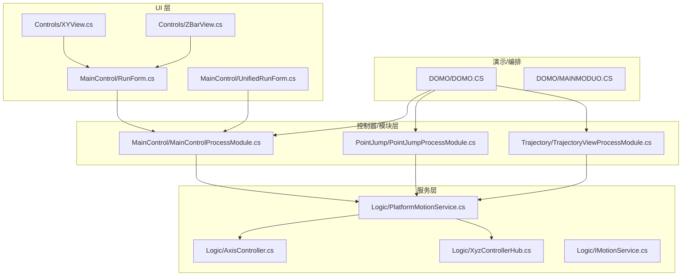
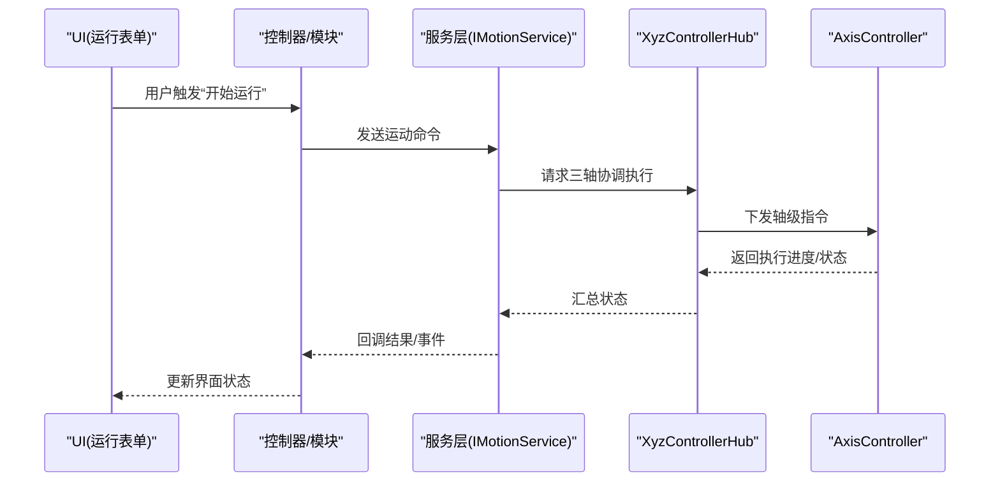
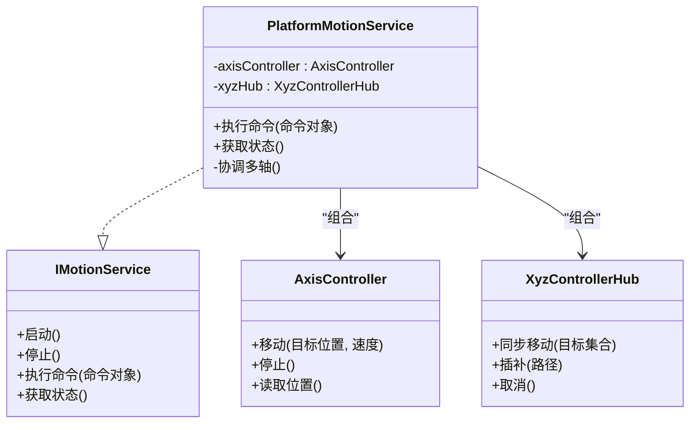
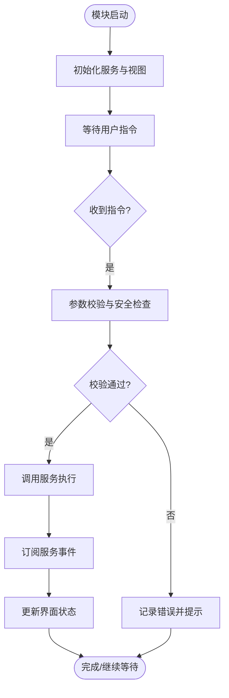
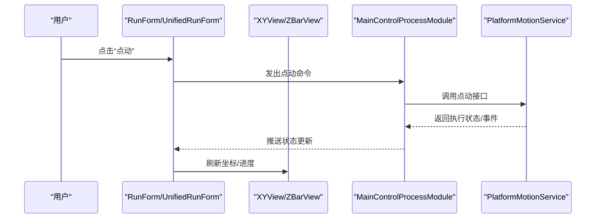
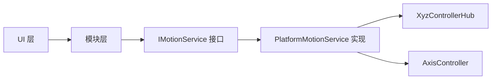

# 组件交互模式

<cite>
**本文引用的文件**   
- [ProcessModules.csproj](file://ProcessModules.csproj)
- [MainControl/MainControlProcessModule.cs](file://MainControl/MainControlProcessModule.cs)
- [MainControl/RunForm.cs](file://MainControl/RunForm.cs)
- [MainControl/UnifiedRunForm.cs](file://MainControl/UnifiedRunForm.cs)
- [PointJump/PointJumpProcessModule.cs](file://PointJump/PointJumpProcessModule.cs)
- [Trajectory/TrajectoryViewProcessModule.cs](file://Trajectory/TrajectoryViewProcessModule.cs)
- [Logic/AxisController.cs](file://Logic/AxisController.cs)
- [Logic/PlatformMotionService.cs](file://Logic/PlatformMotionService.cs)
- [Logic/IMotionService.cs](file://Logic/IMotionService.cs)
- [Logic/XyzControllerHub.cs](file://Logic/XyzControllerHub.cs)
- [Controls/XYView.cs](file://Controls/XYView.cs)
- [Controls/ZBarView.cs](file://Controls/ZBarView.cs)
- [DOMO/DOMO.CS](file://DOMO/DOMO.CS)
- [DOMO/MAINMODUO.CS](file://DOMO/MAINMODUO.CS)
</cite>

## 目录
1. [简介](#简介)
2. [项目结构](#项目结构)
3. [核心组件](#核心组件)
4. [架构总览](#架构总览)
5. [详细组件分析](#详细组件分析)
6. [依赖分析](#依赖分析)
7. [性能考虑](#性能考虑)
8. [故障排查指南](#故障排查指南)
9. [结论](#结论)
10. [附录](#附录)

## 简介
本文件围绕 ProcessModules 框架的组件交互模式，系统性阐述服务层、控制器层与 UI 层的职责分离，事件驱动架构（发布/订阅、消息传递、异步处理）的实现方式，以及依赖注入与服务定位器的使用。同时给出数据绑定与状态管理的实践建议，并提供松耦合组件通信示例与测试策略，帮助读者快速理解并扩展该框架。

## 项目结构
本项目采用按功能域划分的模块化组织：
- Controls：UI 控件与绘图辅助
- Logic：运动控制与平台适配的服务层
- MainControl：主控制面板模块（进程模块入口、运行表单）
- PointJump：点位跳转模块（进程模块入口、运行表单）
- Trajectory：轨迹模块（进程模块入口、视图）
- DOMO：演示与主模块编排
- 根目录：项目文件与说明文档

图表来源 
- [MainControl/MainControlProcessModule.cs](file://MainControl/MainControlProcessModule.cs)
- [MainControl/RunForm.cs](file://MainControl/RunForm.cs)
- [MainControl/UnifiedRunForm.cs](file://MainControl/UnifiedRunForm.cs)
- [PointJump/PointJumpProcessModule.cs](file://PointJump/PointJumpProcessModule.cs)
- [Trajectory/TrajectoryViewProcessModule.cs](file://Trajectory/TrajectoryViewProcessModule.cs)
- [Logic/PlatformMotionService.cs](file://Logic/PlatformMotionService.cs)
- [Logic/AxisController.cs](file://Logic/AxisController.cs)
- [Logic/XyzControllerHub.cs](file://Logic/XyzControllerHub.cs)
- [Logic/IMotionService.cs](file://Logic/IMotionService.cs)
- [DOMO/DOMO.CS](file://DOMO/DOMO.CS)
- [DOMO/MAINMODUO.CS](file://DOMO/MAINMODUO.CS)

章节来源
- [ProcessModules.csproj](file://ProcessModules.csproj)

## 核心组件
- 服务层（Logic）
  - IMotionService：运动服务的抽象接口，定义统一的运动命令与状态查询契约
  - PlatformMotionService：平台运动服务实现，封装底层设备/仿真差异，对外暴露统一 API
  - AxisController：轴级控制器，负责单轴或轴的协同控制细节
  - XyzControllerHub：XYZ 三轴协调中心，提供多轴同步、插补等能力
- 控制器/模块层（各模块 ProcessModule）
  - MainControlProcessModule：主控制模块，聚合 UI 与业务逻辑，协调运行流程
  - PointJumpProcessModule：点位跳转模块，封装点位移动的业务流
  - TrajectoryViewProcessModule：轨迹模块，承载轨迹规划与可视化联动
- UI 层（Controls & Forms）
  - RunForm / UnifiedRunForm：运行界面，承载用户操作与状态展示
  - XYView / ZBarView：专用视图控件，负责坐标显示、图形绘制与交互反馈

职责分离要点
- UI 层只负责输入输出与展示，不直接访问硬件或复杂算法
- 控制器/模块层编排业务流程，调用服务层完成具体动作
- 服务层屏蔽平台差异，向上提供稳定接口；向下通过适配器对接设备

章节来源
- [Logic/IMotionService.cs](file://Logic/IMotionService.cs)
- [Logic/PlatformMotionService.cs](file://Logic/PlatformMotionService.cs)
- [Logic/AxisController.cs](file://Logic/AxisController.cs)
- [Logic/XyzControllerHub.cs](file://Logic/XyzControllerHub.cs)
- [MainControl/MainControlProcessModule.cs](file://MainControl/MainControlProcessModule.cs)
- [PointJump/PointJumpProcessModule.cs](file://PointJump/PointJumpProcessModule.cs)
- [Trajectory/TrajectoryViewProcessModule.cs](file://Trajectory/TrajectoryViewProcessModule.cs)
- [MainControl/RunForm.cs](file://MainControl/RunForm.cs)
- [MainControl/UnifiedRunForm.cs](file://MainControl/UnifiedRunForm.cs)
- [Controls/XYView.cs](file://Controls/XYView.cs)
- [Controls/ZBarView.cs](file://Controls/ZBarView.cs)

## 架构总览
系统采用分层 + 事件驱动的架构：
- 分层：UI → 控制器/模块 → 服务 → 平台适配
- 事件驱动：通过事件总线或轻量消息机制实现跨层解耦
- 依赖注入：服务由容器或静态定位器提供，便于替换与测试

图表来源 
- [MainControl/RunForm.cs](file://MainControl/RunForm.cs)
- [MainControl/MainControlProcessModule.cs](file://MainControl/MainControlProcessModule.cs)
- [Logic/IMotionService.cs](file://Logic/IMotionService.cs)
- [Logic/PlatformMotionService.cs](file://Logic/PlatformMotionService.cs)
- [Logic/XyzControllerHub.cs](file://Logic/XyzControllerHub.cs)
- [Logic/AxisController.cs](file://Logic/AxisController.cs)

## 详细组件分析

### 服务层：IMotionService 与 PlatformMotionService
- 设计要点
  - 以接口隔离平台差异，上层仅依赖 IMotionService
  - PlatformMotionService 内部可组合 AxisController、XyzControllerHub 完成具体任务
  - 通过事件或回调将执行状态回传给调用方
- 关键交互
  - 接收运动命令（如点动、连续运行、插补）
  - 协调多轴与单轴控制器
  - 上报位置、速度、错误码等状态

图表来源 
- [Logic/IMotionService.cs](file://Logic/IMotionService.cs)
- [Logic/PlatformMotionService.cs](file://Logic/PlatformMotionService.cs)
- [Logic/AxisController.cs](file://Logic/AxisController.cs)
- [Logic/XyzControllerHub.cs](file://Logic/XyzControllerHub.cs)

章节来源
- [Logic/IMotionService.cs](file://Logic/IMotionService.cs)
- [Logic/PlatformMotionService.cs](file://Logic/PlatformMotionService.cs)
- [Logic/AxisController.cs](file://Logic/AxisController.cs)
- [Logic/XyzControllerHub.cs](file://Logic/XyzControllerHub.cs)

### 控制器/模块层：MainControlProcessModule、PointJumpProcessModule、TrajectoryViewProcessModule
- 职责
  - 编排业务流程（校验参数、调度服务、处理异常）
  - 管理生命周期（初始化、启动、暂停、停止）
  - 与 UI 双向通信（事件通知、状态更新）
- 典型流程
  - 接收 UI 指令 → 校验与转换 → 调用服务层 → 监听服务事件 → 刷新 UI

图表来源 
- [MainControl/MainControlProcessModule.cs](file://MainControl/MainControlProcessModule.cs)
- [PointJump/PointJumpProcessModule.cs](file://PointJump/PointJumpProcessModule.cs)
- [Trajectory/TrajectoryViewProcessModule.cs](file://Trajectory/TrajectoryViewProcessModule.cs)

章节来源
- [MainControl/MainControlProcessModule.cs](file://MainControl/MainControlProcessModule.cs)
- [PointJump/PointJumpProcessModule.cs](file://PointJump/PointJumpProcessModule.cs)
- [Trajectory/TrajectoryViewProcessModule.cs](file://Trajectory/TrajectoryViewProcessModule.cs)

### UI 层：RunForm、UnifiedRunForm、XYView、ZBarView
- 职责
  - 渲染与交互：按钮、滑块、图表绘制
  - 数据绑定：将服务/模块的状态映射到控件属性
  - 事件转发：将用户操作转换为命令并发送给控制器
- 数据绑定与状态管理建议
  - 使用单向数据流：服务事件 → 模块状态 → UI 属性
  - 避免在 UI 中直接修改共享状态，统一由模块或服务变更
  - 对耗时操作使用异步回调或线程安全队列

图表来源 
- [MainControl/RunForm.cs](file://MainControl/RunForm.cs)
- [MainControl/UnifiedRunForm.cs](file://MainControl/UnifiedRunForm.cs)
- [Controls/XYView.cs](file://Controls/XYView.cs)
- [Controls/ZBarView.cs](file://Controls/ZBarView.cs)
- [MainControl/MainControlProcessModule.cs](file://MainControl/MainControlProcessModule.cs)
- [Logic/PlatformMotionService.cs](file://Logic/PlatformMotionService.cs)

章节来源
- [MainControl/RunForm.cs](file://MainControl/RunForm.cs)
- [MainControl/UnifiedRunForm.cs](file://MainControl/UnifiedRunForm.cs)
- [Controls/XYView.cs](file://Controls/XYView.cs)
- [Controls/ZBarView.cs](file://Controls/ZBarView.cs)

### 演示与编排：DOMO
- 作用
  - 演示不同模块的组合与加载
  - 演示服务定位器或容器的使用方式
- 典型用法
  - 创建并注册服务实例
  - 按需加载模块（MainControl、PointJump、Trajectory）
  - 启动/停止生命周期管理

章节来源
- [DOMO/DOMO.CS](file://DOMO/DOMO.CS)
- [DOMO/MAINMODUO.CS](file://DOMO/MAINMODUO.CS)

## 依赖分析
- 低耦合原则
  - UI 不直接依赖服务实现，而是通过模块间接调用
  - 模块依赖 IMotionService 接口，便于替换实现（仿真/真实设备）
- 可能的循环依赖
  - 确保 UI 不反向依赖服务；服务不依赖 UI
  - 模块作为协调者，避免与 UI 形成双向引用
- 外部依赖
  - 设备驱动/仿真库通过 PlatformMotionService 隔离
  - 第三方 UI 库仅在 UI 层引入

图表来源 
- [Logic/IMotionService.cs](file://Logic/IMotionService.cs)
- [Logic/PlatformMotionService.cs](file://Logic/PlatformMotionService.cs)
- [Logic/XyzControllerHub.cs](file://Logic/XyzControllerHub.cs)
- [Logic/AxisController.cs](file://Logic/AxisController.cs)
- [MainControl/MainControlProcessModule.cs](file://MainControl/MainControlProcessModule.cs)

章节来源
- [Logic/IMotionService.cs](file://Logic/IMotionService.cs)
- [Logic/PlatformMotionService.cs](file://Logic/PlatformMotionService.cs)
- [Logic/XyzControllerHub.cs](file://Logic/XyzControllerHub.cs)
- [Logic/AxisController.cs](file://Logic/AxisController.cs)
- [MainControl/MainControlProcessModule.cs](file://MainControl/MainControlProcessModule.cs)

## 性能考虑
- 异步与并发
  - 所有阻塞式 IO 或设备调用应置于后台线程，并通过事件/回调回到 UI 线程更新
  - 使用线程安全的队列或信号量保护共享状态
- 事件风暴
  - 合并高频事件（如位置采样），降低 UI 刷新频率
  - 使用节流/去抖策略减少不必要的重绘
- 资源管理
  - 及时释放视图控件与句柄，避免内存泄漏
  - 服务层在模块卸载时正确清理资源

[本节为通用指导，无需特定文件来源]

## 故障排查指南
- 常见问题
  - 界面不更新：检查事件订阅是否生效、线程切换是否正确
  - 命令无响应：确认模块是否已初始化、服务是否可用
  - 多轴不同步：检查 Hub 的同步策略与轴间延迟补偿
- 调试建议
  - 在服务层增加日志与断点，追踪命令链路
  - 在 UI 层打印状态变化，验证数据流向
  - 使用模拟服务替代真实设备，隔离问题范围

章节来源
- [MainControl/MainControlProcessModule.cs](file://MainControl/MainControlProcessModule.cs)
- [Logic/PlatformMotionService.cs](file://Logic/PlatformMotionService.cs)
- [Logic/XyzControllerHub.cs](file://Logic/XyzControllerHub.cs)

## 结论
ProcessModules 框架通过清晰的分层与事件驱动架构，实现了 UI、控制器/模块与服务之间的松耦合协作。借助接口抽象与依赖注入/服务定位器，系统具备良好的可扩展性与可测试性。遵循本文的数据绑定与状态管理建议，可在保证性能的同时提升用户体验。

[本节为总结性内容，无需特定文件来源]

## 附录

### 事件驱动与消息传递模式
- 发布/订阅
  - 服务层定义事件（如“执行完成”“错误发生”“位置更新”）
  - 模块订阅事件，进行状态管理与 UI 更新
- 消息传递
  - 使用轻量消息对象封装命令与参数，避免强耦合
  - 支持命令重试、超时与取消
- 异步处理
  - 使用异步方法或任务队列，避免阻塞 UI 线程

章节来源
- [Logic/PlatformMotionService.cs](file://Logic/PlatformMotionService.cs)
- [MainControl/MainControlProcessModule.cs](file://MainControl/MainControlProcessModule.cs)

### 依赖注入与服务定位器
- 推荐做法
  - 使用接口作为契约，运行时注入具体实现
  - 通过服务定位器集中管理实例生命周期与作用域
- 优势
  - 便于单元测试（替换为 Mock）
  - 便于热插拔与配置化

章节来源
- [Logic/IMotionService.cs](file://Logic/IMotionService.cs)
- [DOMO/DOMO.CS](file://DOMO/DOMO.CS)
- [DOMO/MAINMODUO.CS](file://DOMO/MAINMODUO.CS)

### 数据绑定与状态管理
- 单向数据流
  - 服务事件 → 模块状态 → UI 属性
- 状态存储
  - 模块内维护当前运行状态、历史事件与配置
- 一致性保障
  - 使用不可变快照或版本戳，避免竞态条件

章节来源
- [MainControl/RunForm.cs](file://MainControl/RunForm.cs)
- [MainControl/UnifiedRunForm.cs](file://MainControl/UnifiedRunForm.cs)
- [Controls/XYView.cs](file://Controls/XYView.cs)
- [Controls/ZBarView.cs](file://Controls/ZBarView.cs)

### 组件通信示例（松耦合设计）
- 场景：用户点击“点动”，UI 不直接调用设备，而是通过模块与服务
- 步骤
  - UI 发出命令事件
  - 模块校验并转发给服务
  - 服务执行并回发事件
  - 模块更新状态，UI 订阅后刷新

章节来源
- [MainControl/RunForm.cs](file://MainControl/RunForm.cs)
- [MainControl/MainControlProcessModule.cs](file://MainControl/MainControlProcessModule.cs)
- [Logic/PlatformMotionService.cs](file://Logic/PlatformMotionService.cs)

### 组件测试与模拟策略
- 单元测试
  - 为服务接口编写 Mock，验证模块的命令编排与事件处理
  - 覆盖边界条件（参数非法、设备离线、超时）
- 集成测试
  - 使用仿真服务替代真实设备，端到端验证流程
- 自动化
  - 基于命令行或脚本批量执行用例，持续集成

章节来源
- [Logic/IMotionService.cs](file://Logic/IMotionService.cs)
- [Logic/PlatformMotionService.cs](file://Logic/PlatformMotionService.cs)
- [MainControl/MainControlProcessModule.cs](file://MainControl/MainControlProcessModule.cs)