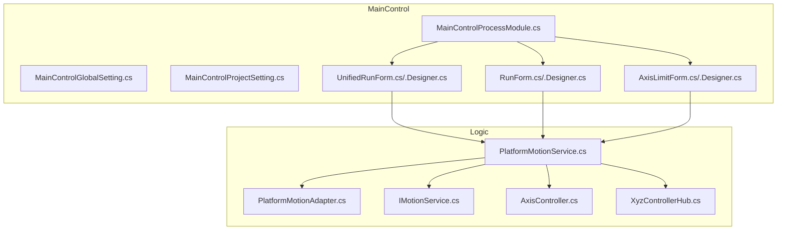
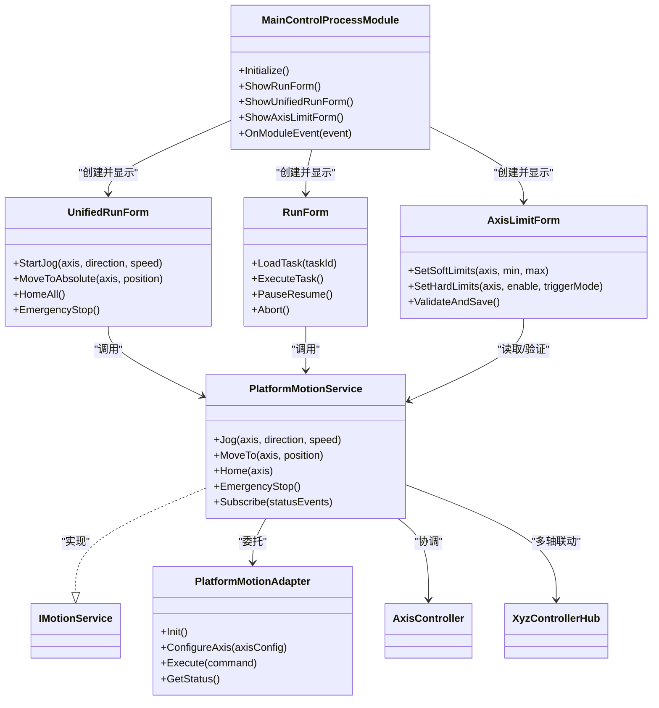
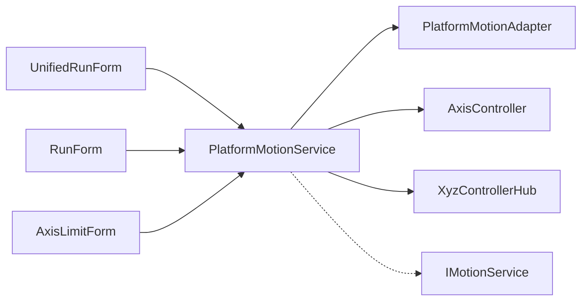

# 主控制模块 (MainControl)

<cite>
**本文档引用的文件**   
- [MainControlProcessModule.cs](file://MainControl/MainControlProcessModule.cs)
- [MainControlGlobalSetting.cs](file://MainControl/MainControlGlobalSetting.cs)
- [MainControlProjectSetting.cs](file://MainControl/MainControlProjectSetting.cs)
- [UnifiedRunForm.cs](file://MainControl/UnifiedRunForm.cs)
- [UnifiedRunForm.Designer.cs](file://MainControl/UnifiedRunForm.Designer.cs)
- [RunForm.cs](file://MainControl/RunForm.cs)
- [RunForm.Designer.cs](file://MainControl/RunForm.Designer.cs)
- [AxisLimitForm.cs](file://MainControl/AxisLimitForm.cs)
- [AxisLimitForm.Designer.cs](file://MainControl/AxisLimitForm.Designer.cs)
- [MainControl.csproj](file://MainControl/MainControl.csproj)
- [README.md](file://MainControl/README.md)
- [PlatformMotionService.cs](file://Logic/PlatformMotionService.cs)
- [PlatformMotionAdapter.cs](file://Logic/PlatformMotionAdapter.cs)
- [IMotionService.cs](file://Logic/IMotionService.cs)
- [AxisController.cs](file://Logic/AxisController.cs)
- [XyzControllerHub.cs](file://Logic/XyzControllerHub.cs)
</cite>

## 目录
1. [简介](#简介)
2. [项目结构](#项目结构)
3. [核心组件](#核心组件)
4. [架构总览](#架构总览)
5. [详细组件分析](#详细组件分析)
6. [依赖关系分析](#依赖关系分析)
7. [性能考虑](#性能考虑)
8. [故障排查指南](#故障排查指南)
9. [结论](#结论)
10. [附录：集成与使用示例](#附录集成与使用示例)

## 简介
本文件为“主控制模块（MainControl）”的权威技术文档，面向开发者与系统集成人员。内容覆盖：
- 轴参数配置、运动控制界面、限位设置等核心功能
- UnifiedRunForm 与 RunForm 界面的使用方法与交互逻辑
- AxisLimitForm 的限位配置与安全保护机制
- 全局设置（MainControlGlobalSetting）与项目设置（MainControlProjectSetting）的配置项说明
- 生命周期管理与事件处理机制
- 错误处理策略与异常恢复方法
- 最佳实践与性能优化建议

该模块以进程模块形式提供统一的运动控制入口，通过服务层与底层硬件适配器解耦，支持多轴设备的统一控制与可视化操作。

## 项目结构
MainControl 子项目包含 UI 表单、设置类与进程模块入口，并与 Logic 层的运动服务进行协作。关键目录与文件如下：
- MainControl 目录：UI 表单（UnifiedRunForm、RunForm、AxisLimitForm）、设置类（Global/Project Setting）、进程模块入口（MainControlProcessModule）
- Logic 目录：运动服务与适配器（PlatformMotionService、PlatformMotionAdapter、IMotionService、AxisController、XyzControllerHub）
- 资源与构建：MainControl.csproj、README.md

图表来源
- [MainControlProcessModule.cs](file://MainControl/MainControlProcessModule.cs)
- [UnifiedRunForm.cs](file://MainControl/UnifiedRunForm.cs)
- [RunForm.cs](file://MainControl/RunForm.cs)
- [AxisLimitForm.cs](file://MainControl/AxisLimitForm.cs)
- [PlatformMotionService.cs](file://Logic/PlatformMotionService.cs)
- [PlatformMotionAdapter.cs](file://Logic/PlatformMotionAdapter.cs)
- [IMotionService.cs](file://Logic/IMotionService.cs)
- [AxisController.cs](file://Logic/AxisController.cs)
- [XyzControllerHub.cs](file://Logic/XyzControllerHub.cs)

章节来源
- [MainControl.csproj](file://MainControl/MainControl.csproj)
- [README.md](file://MainControl/README.md)

## 核心组件
- 进程模块入口：负责模块初始化、生命周期管理、界面创建与事件订阅
- 运行界面：
  - UnifiedRunForm：统一运行界面，聚合常用运动控制操作
  - RunForm：独立运行界面，聚焦单任务或流程化执行
- 限位配置：AxisLimitForm，用于各轴软/硬限位参数配置与安全校验
- 设置类：
  - MainControlGlobalSetting：全局运行参数（如默认速度、加速度、回零模式等）
  - MainControlProjectSetting：项目级参数（如轴映射、点位表、工艺参数等）
- 运动服务：
  - PlatformMotionService：对外暴露的运动控制服务，封装命令编排与状态同步
  - PlatformMotionAdapter：平台适配层，屏蔽不同硬件差异
  - IMotionService：运动服务接口定义
  - AxisController / XyzControllerHub：轴控制器与XYZ三轴协调器

章节来源
- [MainControlProcessModule.cs](file://MainControl/MainControlProcessModule.cs)
- [UnifiedRunForm.cs](file://MainControl/UnifiedRunForm.cs)
- [RunForm.cs](file://MainControl/RunForm.cs)
- [AxisLimitForm.cs](file://MainControl/AxisLimitForm.cs)
- [MainControlGlobalSetting.cs](file://MainControl/MainControlGlobalSetting.cs)
- [MainControlProjectSetting.cs](file://MainControl/MainControlProjectSetting.cs)
- [PlatformMotionService.cs](file://Logic/PlatformMotionService.cs)
- [PlatformMotionAdapter.cs](file://Logic/PlatformMotionAdapter.cs)
- [IMotionService.cs](file://Logic/IMotionService.cs)
- [AxisController.cs](file://Logic/AxisController.cs)
- [XyzControllerHub.cs](file://Logic/XyzControllerHub.cs)

## 架构总览
MainControl 采用“界面-服务-适配器”的分层架构：
- 界面层：UnifiedRunForm、RunForm、AxisLimitForm 负责用户交互与参数输入
- 服务层：PlatformMotionService 提供统一的运动控制 API，处理并发、状态机与事件
- 适配层：PlatformMotionAdapter 对接具体设备驱动，屏蔽差异
- 控制器：AxisController、XxyzControllerHub 实现轴级与多轴协同控制

图表来源
- [MainControlProcessModule.cs](file://MainControl/MainControlProcessModule.cs)
- [UnifiedRunForm.cs](file://MainControl/UnifiedRunForm.cs)
- [RunForm.cs](file://MainControl/RunForm.cs)
- [AxisLimitForm.cs](file://MainControl/AxisLimitForm.cs)
- [PlatformMotionService.cs](file://Logic/PlatformMotionService.cs)
- [PlatformMotionAdapter.cs](file://Logic/PlatformMotionAdapter.cs)
- [IMotionService.cs](file://Logic/IMotionService.cs)
- [AxisController.cs](file://Logic/AxisController.cs)
- [XyzControllerHub.cs](file://Logic/XyzControllerHub.cs)

## 详细组件分析

### 进程模块入口（MainControlProcessModule）
职责：
- 模块初始化：加载全局与项目设置，注册事件处理器
- 界面管理：创建并显示 UnifiedRunForm、RunForm、AxisLimitForm
- 生命周期：响应模块启动、暂停、销毁等事件
- 事件分发：将硬件/服务层事件转发到 UI 或业务逻辑

关键点：
- 在 Initialize 中完成设置加载与服务实例化
- 通过事件订阅实现 UI 与服务的双向通信
- 确保线程安全：UI 更新需回到 UI 线程

章节来源
- [MainControlProcessModule.cs](file://MainControl/MainControlProcessModule.cs)

### 统一运行界面（UnifiedRunForm）
职责：
- 提供一键式点动、绝对定位、回零、急停等操作
- 实时显示轴位置、状态、报警信息
- 与 PlatformMotionService 交互，执行运动命令

交互逻辑：
- 用户点击按钮触发对应运动命令
- 界面根据服务返回的状态更新显示
- 支持批量操作与快捷键

章节来源
- [UnifiedRunForm.cs](file://MainControl/UnifiedRunForm.cs)
- [UnifiedRunForm.Designer.cs](file://MainControl/UnifiedRunForm.Designer.cs)

### 独立运行界面（RunForm）
职责：
- 加载并执行任务（如点位序列、轨迹片段）
- 支持任务暂停/恢复/中止
- 与运动服务协作，保证任务执行的原子性与可恢复性

交互逻辑：
- 选择任务后进入准备阶段（校验参数、预读限位）
- 执行阶段按步骤推进，失败时自动重试或回退
- 完成后输出结果与日志

章节来源
- [RunForm.cs](file://MainControl/RunForm.cs)
- [RunForm.Designer.cs](file://MainControl/RunForm.Designer.cs)

### 限位配置界面（AxisLimitForm）
职责：
- 配置各轴的软限位（最小/最大位置）
- 配置硬限位（使能、触发模式、消抖时间）
- 保存前进行参数合法性校验与安全评估

安全保护机制：
- 软限位冲突检测（避免越界）
- 硬限位优先级高于软限位
- 修改后立即生效并写入持久化配置

章节来源
- [AxisLimitForm.cs](file://MainControl/AxisLimitForm.cs)
- [AxisLimitForm.Designer.cs](file://MainControl/AxisLimitForm.Designer.cs)

### 设置类（MainControlGlobalSetting / MainControlProjectSetting）
MainControlGlobalSetting（全局设置）常见选项：
- 默认速度、加速度、减速度
- 回零速度与搜索模式
- 单位换算（mm/inch）
- 日志级别与存储路径
- 安全超时与急停行为

MainControlProjectSetting（项目设置）常见选项：
- 轴数量与名称映射
- 各轴脉冲当量与传动比
- 点位表与工艺参数
- 任务模板与默认参数
- 权限与访问控制

章节来源
- [MainControlGlobalSetting.cs](file://MainControl/MainControlGlobalSetting.cs)
- [MainControlProjectSetting.cs](file://MainControl/MainControlProjectSetting.cs)

### 运动服务与适配器（PlatformMotionService / PlatformMotionAdapter / IMotionService）
PlatformMotionService：
- 暴露 Jog、MoveTo、Home、EmergencyStop 等方法
- 维护轴状态机与队列，保证命令有序执行
- 发布状态与事件（位置变化、报警、完成）

PlatformMotionAdapter：
- 初始化硬件连接
- 配置轴参数（脉冲当量、加减速、限位）
- 执行底层命令并上报状态

IMotionService：
- 定义运动控制接口契约，便于替换实现

章节来源
- [PlatformMotionService.cs](file://Logic/PlatformMotionService.cs)
- [PlatformMotionAdapter.cs](file://Logic/PlatformMotionAdapter.cs)
- [IMotionService.cs](file://Logic/IMotionService.cs)

### 轴控制器与多轴协调（AxisController / XyzControllerHub）
AxisController：
- 单轴控制（位置、速度、加速度、限位）
- 状态查询与报警处理

XyzControllerHub：
- XYZ 三轴插补与联动
- 轨迹规划与同步控制

章节来源
- [AxisController.cs](file://Logic/AxisController.cs)
- [XyzControllerHub.cs](file://Logic/XyzControllerHub.cs)

## 依赖关系分析
MainControl 对 Logic 层存在明确依赖，UI 不直接访问硬件，所有运动指令均通过服务层下发。

图表来源
- [UnifiedRunForm.cs](file://MainControl/UnifiedRunForm.cs)
- [RunForm.cs](file://MainControl/RunForm.cs)
- [AxisLimitForm.cs](file://MainControl/AxisLimitForm.cs)
- [PlatformMotionService.cs](file://Logic/PlatformMotionService.cs)
- [PlatformMotionAdapter.cs](file://Logic/PlatformMotionAdapter.cs)
- [IMotionService.cs](file://Logic/IMotionService.cs)
- [AxisController.cs](file://Logic/AxisController.cs)
- [XyzControllerHub.cs](file://Logic/XyzControllerHub.cs)

章节来源
- [MainControl.csproj](file://MainControl/MainControl.csproj)

## 性能考虑
- 命令队列化：避免频繁瞬时命令导致抖动，采用队列与节流策略
- 状态轮询优化：降低 UI 刷新频率，按需更新关键指标
- 异步执行：长耗时操作（如回零、轨迹执行）使用异步，避免阻塞 UI
- 缓存热点数据：如轴当前位姿、限位阈值，减少重复计算
- 资源释放：及时关闭连接、释放句柄，防止内存泄漏

[本节为通用指导，无需特定文件引用]

## 故障排查指南
常见问题与处理方法：
- 无法连接设备：检查适配器初始化、端口/地址配置、权限
- 限位报警：确认软/硬限位设置是否合理，临时禁用测试后恢复
- 运动无响应：查看命令队列是否堵塞，检查急停状态与互锁条件
- 界面卡顿：降低刷新频率，拆分耗时任务
- 参数未生效：确认设置已保存并重新加载

调试建议：
- 启用详细日志，记录命令与状态变更
- 使用模拟器或回环模式验证逻辑
- 分步验证：先单轴后多轴，先手动后自动

章节来源
- [PlatformMotionService.cs](file://Logic/PlatformMotionService.cs)
- [PlatformMotionAdapter.cs](file://Logic/PlatformMotionAdapter.cs)
- [AxisLimitForm.cs](file://MainControl/AxisLimitForm.cs)

## 结论
MainControl 模块通过清晰的层次划分与完善的设置/限位机制，提供了稳定可靠的运动控制能力。开发者应遵循服务层抽象、事件驱动与异步执行的原则，结合合理的错误处理与性能优化策略，快速集成并扩展功能。

[本节为总结性内容，无需特定文件引用]

## 附录：集成与使用示例
以下为典型集成步骤与用法要点（以路径引用代替代码片段）：
- 初始化模块与加载设置
  - 参考：[MainControlProcessModule.cs](file://MainControl/MainControlProcessModule.cs)
- 显示统一运行界面
  - 参考：[UnifiedRunForm.cs](file://MainControl/UnifiedRunForm.cs)
- 执行点动与绝对定位
  - 参考：[PlatformMotionService.cs](file://Logic/PlatformMotionService.cs)
- 配置限位参数并保存
  - 参考：[AxisLimitForm.cs](file://MainControl/AxisLimitForm.cs)
- 加载并执行任务
  - 参考：[RunForm.cs](file://MainControl/RunForm.cs)
- 全局与项目设置读写
  - 参考：[MainControlGlobalSetting.cs](file://MainControl/MainControlGlobalSetting.cs)、[MainControlProjectSetting.cs](file://MainControl/MainControlProjectSetting.cs)

章节来源
- [MainControlProcessModule.cs](file://MainControl/MainControlProcessModule.cs)
- [UnifiedRunForm.cs](file://MainControl/UnifiedRunForm.cs)
- [RunForm.cs](file://MainControl/RunForm.cs)
- [AxisLimitForm.cs](file://MainControl/AxisLimitForm.cs)
- [MainControlGlobalSetting.cs](file://MainControl/MainControlGlobalSetting.cs)
- [MainControlProjectSetting.cs](file://MainControl/MainControlProjectSetting.cs)
- [PlatformMotionService.cs](file://Logic/PlatformMotionService.cs)