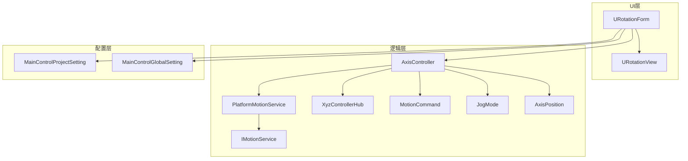
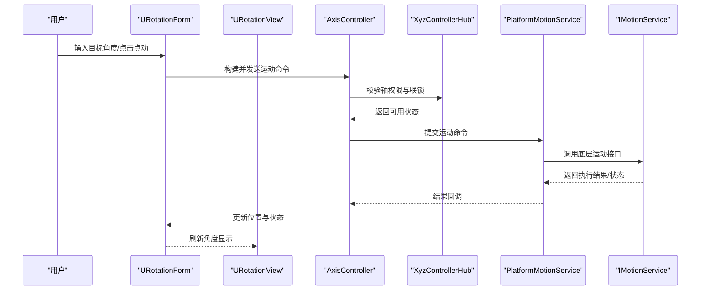
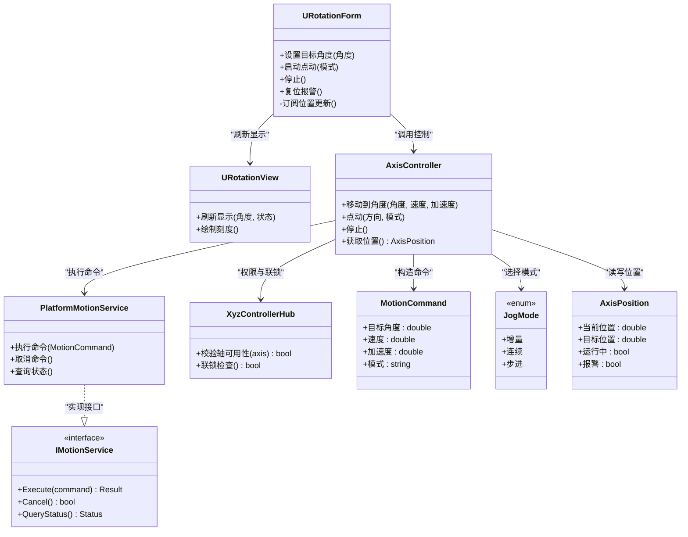
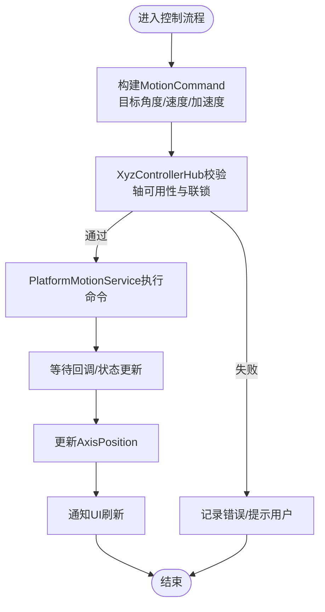
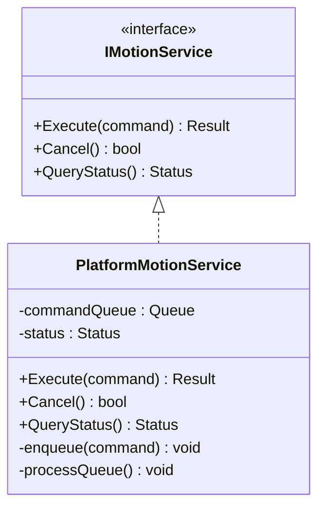
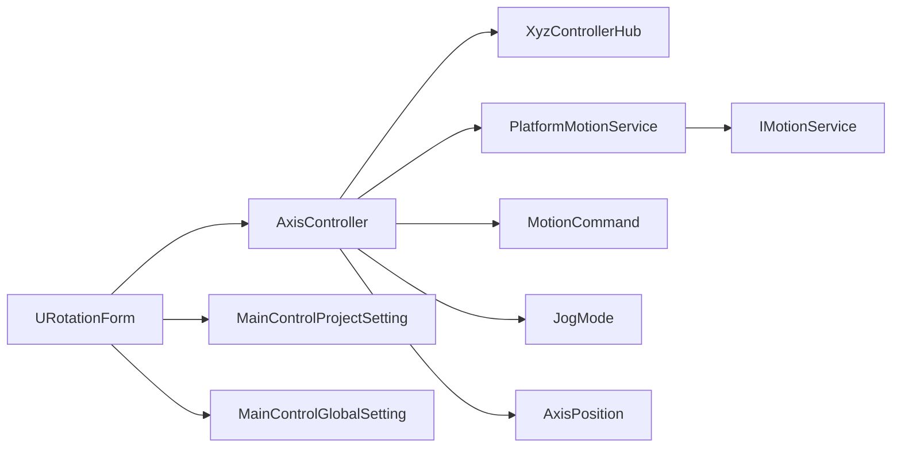

# U轴旋转控制系统

<cite>
**本文档引用的文件**   
- [MainControlProcessModule.cs](file://MainControl/MainControlProcessModule.cs)
- [URotationForm.cs](file://MainControl/URotationForm.cs)
- [URotationView.cs](file://MainControl/Controls/URotationView.cs)
- [AxisController.cs](file://MainControl/Logic/AxisController.cs)
- [PlatformMotionService.cs](file://MainControl/Logic/PlatformMotionService.cs)
- [IMotionService.cs](file://MainControl/Logic/IMotionService.cs)
- [XyzControllerHub.cs](file://MainControl/Logic/XyzControllerHub.cs)
- [MotionCommand.cs](file://MainControl/Logic/MotionCommand.cs)
- [JogMode.cs](file://MainControl/Logic/JogMode.cs)
- [AxisPosition.cs](file://MainControl/Logic/AxisPosition.cs)
- [MainControlProjectSetting.cs](file://MainControl/MainControlProjectSetting.cs)
- [MainControlGlobalSetting.cs](file://MainControl/MainControlGlobalSetting.cs)
</cite>

## 目录
1. [简介](#简介)
2. [项目结构](#项目结构)
3. [核心组件](#核心组件)
4. [架构总览](#架构总览)
5. [详细组件分析](#详细组件分析)
6. [依赖关系分析](#依赖关系分析)
7. [性能考虑](#性能考虑)
8. [故障排查指南](#故障排查指南)
9. [结论](#结论)
10. [附录](#附录)

## 简介
本系统为U轴旋转控制模块，提供面向UI的U轴角度设定、点动与连续运动控制、限位保护与状态可视化等功能。系统采用分层架构：UI层负责交互与展示，逻辑层封装轴控制与运动服务，底层通过平台运动服务抽象硬件接口，便于扩展与替换。

## 项目结构
- UI层
  - URotationForm：U轴旋转主窗体，承载用户操作入口与参数配置
  - URotationView：U轴旋转视图控件，用于角度显示与图形化反馈
- 逻辑层
  - AxisController：轴控制器，协调多轴与单轴动作
  - PlatformMotionService：平台运动服务，统一对外暴露运动指令执行能力
  - IMotionService：运动服务接口，解耦具体实现
  - XyzControllerHub：XYZ轴控制器中心，管理各轴实例与命令分发
  - MotionCommand：运动命令模型，描述目标位置、速度、加速度等
  - JogMode：点动模式枚举，定义不同点动行为
  - AxisPosition：轴位置数据模型，记录当前坐标与状态
- 配置层
  - MainControlProjectSetting：项目级设置（如默认速度、步距）
  - MainControlGlobalSetting：全局设置（如通信端口、安全阈值）

图表来源
- [URotationForm.cs](file://MainControl/URotationForm.cs)
- [URotationView.cs](file://MainControl/Controls/URotationView.cs)
- [AxisController.cs](file://MainControl/Logic/AxisController.cs)
- [PlatformMotionService.cs](file://MainControl/Logic/PlatformMotionService.cs)
- [IMotionService.cs](file://MainControl/Logic/IMotionService.cs)
- [XyzControllerHub.cs](file://MainControl/Logic/XyzControllerHub.cs)
- [MotionCommand.cs](file://MainControl/Logic/MotionCommand.cs)
- [JogMode.cs](file://MainControl/Logic/JogMode.cs)
- [AxisPosition.cs](file://MainControl/Logic/AxisPosition.cs)
- [MainControlProjectSetting.cs](file://MainControl/MainControlProjectSetting.cs)
- [MainControlGlobalSetting.cs](file://MainControl/MainControlGlobalSetting.cs)

章节来源
- [MainControlProcessModule.cs](file://MainControl/MainControlProcessModule.cs)

## 核心组件
- URotationForm
  - 职责：U轴旋转的主界面，集成角度输入、点动按钮、运行/停止、报警复位等
  - 关键交互：读取/写入U轴目标角度；切换点动模式；触发回零/回限位
- URotationView
  - 职责：绘制U轴角度指示与刻度，实时刷新当前位置
  - 关键特性：支持角度范围限制、单位换算、动态刷新
- AxisController
  - 职责：封装U轴的运动控制逻辑，包括点动、绝对/相对定位、速度/加速度曲线
  - 关键方法：启动点动、停止、移动到目标角度、查询当前位置
- PlatformMotionService
  - 职责：对下调用平台运动API，对上提供统一的运动执行接口
  - 关键能力：并发安全、命令队列、错误码映射
- IMotionService
  - 职责：定义运动服务的契约，便于替换实现或模拟测试
- XyzControllerHub
  - 职责：统一管理XYZU各轴控制器，处理跨轴联动与冲突仲裁
- MotionCommand
  - 职责：描述一次运动的完整参数（目标角度、速度、加速度、插补标志等）
- JogMode
  - 职责：定义点动模式（如增量、连续、步进），影响点动行为
- AxisPosition
  - 职责：承载轴的当前位置、目标位置、状态位（运行中、报警、使能）
- 配置项
  - MainControlProjectSetting：项目内默认参数（如U轴最大角度、默认速度）
  - MainControlGlobalSetting：全局参数（如通信超时、安全限幅）

章节来源
- [URotationForm.cs](file://MainControl/URotationForm.cs)
- [URotationView.cs](file://MainControl/Controls/URotationView.cs)
- [AxisController.cs](file://MainControl/Logic/AxisController.cs)
- [PlatformMotionService.cs](file://MainControl/Logic/PlatformMotionService.cs)
- [IMotionService.cs](file://MainControl/Logic/IMotionService.cs)
- [XyzControllerHub.cs](file://MainControl/Logic/XyzControllerHub.cs)
- [MotionCommand.cs](file://MainControl/Logic/MotionCommand.cs)
- [JogMode.cs](file://MainControl/Logic/JogMode.cs)
- [AxisPosition.cs](file://MainControl/Logic/AxisPosition.cs)
- [MainControlProjectSetting.cs](file://MainControl/MainControlProjectSetting.cs)
- [MainControlGlobalSetting.cs](file://MainControl/MainControlGlobalSetting.cs)

## 架构总览
系统采用“UI—逻辑—服务—平台”的分层设计，UI仅负责交互与展示，逻辑层完成业务编排，服务层屏蔽硬件差异，平台层对接实际驱动。

图表来源
- [URotationForm.cs](file://MainControl/URotationForm.cs)
- [URotationView.cs](file://MainControl/Controls/URotationView.cs)
- [AxisController.cs](file://MainControl/Logic/AxisController.cs)
- [XyzControllerHub.cs](file://MainControl/Logic/XyzControllerHub.cs)
- [PlatformMotionService.cs](file://MainControl/Logic/PlatformMotionService.cs)
- [IMotionService.cs](file://MainControl/Logic/IMotionService.cs)

## 详细组件分析

### URotationForm（U轴旋转主窗体）
- 功能要点
  - 角度输入框绑定到U轴目标角度
  - 点动按钮根据JogMode决定行为（增量/连续）
  - 运行/停止按钮触发AxisController对应方法
  - 报警复位与急停逻辑
- 数据流
  - 用户输入→命令构建→AxisController→PlatformMotionService→IMotionService
  - 状态回调→刷新URotationView显示

图表来源
- [URotationForm.cs](file://MainControl/URotationForm.cs)
- [URotationView.cs](file://MainControl/Controls/URotationView.cs)
- [AxisController.cs](file://MainControl/Logic/AxisController.cs)
- [PlatformMotionService.cs](file://MainControl/Logic/PlatformMotionService.cs)
- [IMotionService.cs](file://MainControl/Logic/IMotionService.cs)
- [XyzControllerHub.cs](file://MainControl/Logic/XyzControllerHub.cs)
- [MotionCommand.cs](file://MainControl/Logic/MotionCommand.cs)
- [JogMode.cs](file://MainControl/Logic/JogMode.cs)
- [AxisPosition.cs](file://MainControl/Logic/AxisPosition.cs)

章节来源
- [URotationForm.cs](file://MainControl/URotationForm.cs)
- [URotationView.cs](file://MainControl/Controls/URotationView.cs)

### AxisController（轴控制器）
- 职责
  - 将高层运动意图转换为具体的MotionCommand
  - 与XyzControllerHub协作进行权限与联锁检查
  - 调用PlatformMotionService执行命令并处理回调
- 关键点
  - 速度/加速度曲线生成
  - 点动模式的差异化处理
  - 异常与报警的统一处理

图表来源
- [AxisController.cs](file://MainControl/Logic/AxisController.cs)
- [XyzControllerHub.cs](file://MainControl/Logic/XyzControllerHub.cs)
- [PlatformMotionService.cs](file://MainControl/Logic/PlatformMotionService.cs)
- [MotionCommand.cs](file://MainControl/Logic/MotionCommand.cs)
- [AxisPosition.cs](file://MainControl/Logic/AxisPosition.cs)

章节来源
- [AxisController.cs](file://MainControl/Logic/AxisController.cs)

### PlatformMotionService与IMotionService（运动服务）
- 职责
  - IMotionService定义统一的运动接口契约
  - PlatformMotionService实现该接口，封装底层驱动调用
- 关键点
  - 线程安全与命令队列
  - 错误码映射与重试策略
  - 状态同步与超时处理

图表来源
- [IMotionService.cs](file://MainControl/Logic/IMotionService.cs)
- [PlatformMotionService.cs](file://MainControl/Logic/PlatformMotionService.cs)

章节来源
- [IMotionService.cs](file://MainControl/Logic/IMotionService.cs)
- [PlatformMotionService.cs](file://MainControl/Logic/PlatformMotionService.cs)

### 配置与初始化（MainControlProcessModule、Project/Global Setting）
- 职责
  - MainControlProcessModule负责模块生命周期与初始化
  - ProjectSetting与GlobalSetting加载默认值与用户配置
- 关键点
  - 配置优先级（全局>项目>默认）
  - 运行时热更新与持久化

章节来源
- [MainControlProcessModule.cs](file://MainControl/MainControlProcessModule.cs)
- [MainControlProjectSetting.cs](file://MainControl/MainControlProjectSetting.cs)
- [MainControlGlobalSetting.cs](file://MainControl/MainControlGlobalSetting.cs)

## 依赖关系分析
- 松耦合设计
  - UI与逻辑通过事件/回调解耦
  - 逻辑与服务通过接口IMotionService解耦
- 关键依赖链
  - URotationForm → AxisController → XyzControllerHub → PlatformMotionService → IMotionService
- 潜在风险
  - 循环依赖需避免（例如服务不应反向依赖UI）
  - 配置变更需保证线程安全

图表来源
- [URotationForm.cs](file://MainControl/URotationForm.cs)
- [AxisController.cs](file://MainControl/Logic/AxisController.cs)
- [XyzControllerHub.cs](file://MainControl/Logic/XyzControllerHub.cs)
- [PlatformMotionService.cs](file://MainControl/Logic/PlatformMotionService.cs)
- [IMotionService.cs](file://MainControl/Logic/IMotionService.cs)
- [MotionCommand.cs](file://MainControl/Logic/MotionCommand.cs)
- [JogMode.cs](file://MainControl/Logic/JogMode.cs)
- [AxisPosition.cs](file://MainControl/Logic/AxisPosition.cs)
- [MainControlProjectSetting.cs](file://MainControl/MainControlProjectSetting.cs)
- [MainControlGlobalSetting.cs](file://MainControl/MainControlGlobalSetting.cs)

章节来源
- [MainControlProcessModule.cs](file://MainControl/MainControlProcessModule.cs)

## 性能考虑
- 命令队列与批处理
  - 合理合并相邻小步长移动，减少频繁调度开销
- 异步与回调
  - 使用异步回调避免阻塞UI线程，提升响应性
- 刷新频率
  - URotationView按需刷新，避免高频重绘导致卡顿
- 资源释放
  - 及时释放底层连接与句柄，防止内存泄漏

[本节为通用指导，不直接分析具体文件]

## 故障排查指南
- 常见问题
  - 无法连接到平台服务：检查IMotionService实现与网络/串口配置
  - 点动无效：确认JogMode设置与AxisController点动逻辑
  - 角度超限：检查MainControlProjectSetting中的最大角度与安全阈值
  - 报警未复位：查看AxisPosition报警位与复位流程
- 诊断步骤
  - 启用日志输出，记录命令入队与回调状态
  - 使用模拟器替换IMotionService进行断点调试
  - 逐步缩小问题域（UI→逻辑→服务→平台）

章节来源
- [AxisController.cs](file://MainControl/Logic/AxisController.cs)
- [PlatformMotionService.cs](file://MainControl/Logic/PlatformMotionService.cs)
- [IMotionService.cs](file://MainControl/Logic/IMotionService.cs)
- [MainControlProjectSetting.cs](file://MainControl/MainControlProjectSetting.cs)
- [MainControlGlobalSetting.cs](file://MainControl/MainControlGlobalSetting.cs)

## 结论
U轴旋转控制系统通过清晰的分层与接口抽象，实现了高内聚、低耦合的可维护架构。UI聚焦交互，逻辑专注编排，服务屏蔽差异，整体具备良好的扩展性与可测试性。建议在生产环境中完善日志与监控，持续优化命令队列与刷新策略，以提升稳定性与用户体验。

[本节为总结性内容，不直接分析具体文件]

## 附录
- 术语表
  - U轴：围绕某一固定点的旋转轴
  - 点动：手动控制轴按指定模式移动
  - 联锁：多轴之间的安全约束条件
- 最佳实践
  - 所有外部调用应异步化
  - 配置变更需原子更新与回滚机制
  - 错误信息对用户友好且可追踪

[本节为补充说明，不直接分析具体文件]