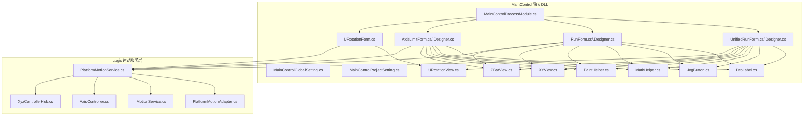
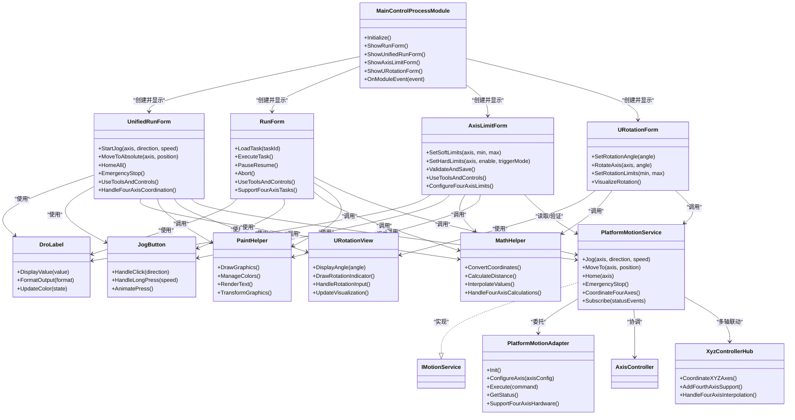
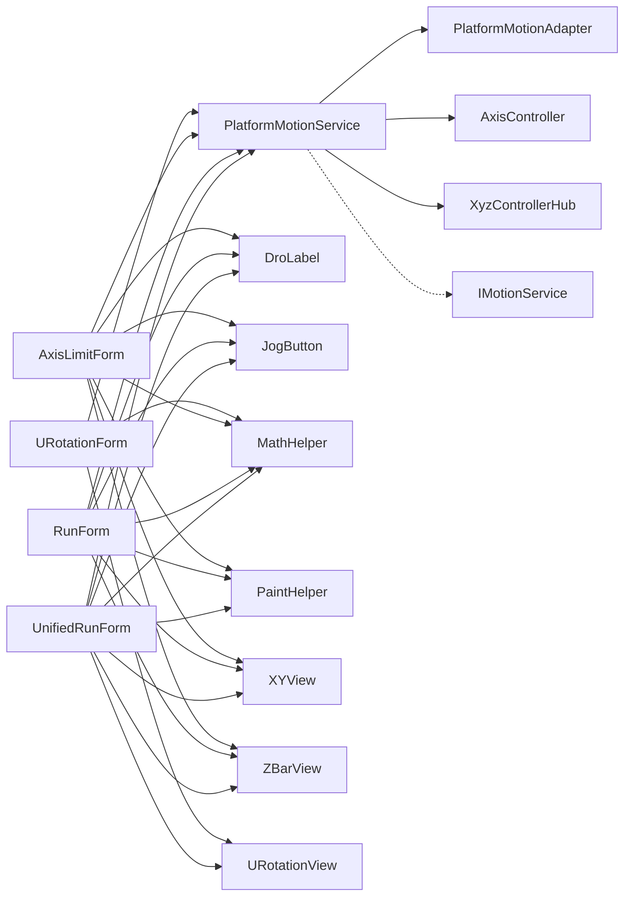

# 主控制模块 (MainControl)

<cite>
**本文档引用的文件**   
- [MainControlProcessModule.cs](file://MainControl/MainControlProcessModule.cs)
- [MainControlGlobalSetting.cs](file://MainControl/MainControlGlobalSetting.cs)
- [MainControlProjectSetting.cs](file://MainControl/MainControlProjectSetting.cs)
- [UnifiedRunForm.cs](file://MainControl/UnifiedRunForm.cs)
- [UnifiedRunForm.Designer.cs](file://MainControl/UnifiedRunForm.Designer.cs)
- [RunForm.cs](file://MainControl/RunForm.cs)
- [RunForm.Designer.cs](file://MainControl/RunForm.Designer.cs)
- [AxisLimitForm.cs](file://MainControl/AxisLimitForm.cs)
- [AxisLimitForm.Designer.cs](file://MainControl/AxisLimitForm.Designer.cs)
- [URotationForm.cs](file://MainControl/URotationForm.cs)
- [MainControl.csproj](file://MainControl/MainControl.csproj)
- [DroLabel.cs](file://MainControl/DroLabel.cs)
- [JogButton.cs](file://MainControl/JogButton.cs)
- [MathHelper.cs](file://MainControl/MathHelper.cs)
- [PaintHelper.cs](file://MainControl/PaintHelper.cs)
- [XYView.cs](file://MainControl/XYView.cs)
- [ZBarView.cs](file://MainControl/ZBarView.cs)
- [URotationView.cs](file://MainControl/Controls/URotationView.cs)
- [PlatformMotionService.cs](file://MainControl/Logic/PlatformMotionService.cs)
- [PlatformMotionAdapter.cs](file://MainControl/Logic/PlatformMotionAdapter.cs)
- [IMotionService.cs](file://MainControl/Logic/IMotionService.cs)
- [AxisController.cs](file://MainControl/Logic/AxisController.cs)
- [XyzControllerHub.cs](file://MainControl/Logic/XyzControllerHub.cs)
</cite>

## 更新摘要
**所做更改**
- 新增四轴系统支持，包括U轴的完整参数处理和控制逻辑
- 界面布局重构：Panel1和Panel2重新组织以支持四轴显示
- 项目配置更新以支持第四轴（U轴）的配置选项
- 新增URotationForm和URotationView控件用于U轴旋转控制
- 更新了运动服务以支持四轴协调控制

## 目录
1. [简介](#简介)
2. [项目结构](#项目结构)
3. [核心组件](#核心组件)
4. [四轴系统支持](#四轴系统支持)
5. [共享控件库](#共享控件库)
6. [架构总览](#架构总览)
7. [详细组件分析](#详细组件分析)
8. [依赖关系分析](#依赖关系分析)
9. [性能考虑](#性能考虑)
10. [故障排查指南](#故障排查指南)
11. [结论](#结论)
12. [附录：集成与使用示例](#附录集成与使用示例)

## 简介
本文件为"主控制模块（MainControl）"的权威技术文档，面向开发者与系统集成人员。内容覆盖：
- 四轴系统支持（X、Y、Z、U轴）的参数配置、运动控制界面、限位设置等核心功能
- UnifiedRunForm 与 RunForm 界面的使用方法与交互逻辑
- AxisLimitForm 的限位配置与安全保护机制
- 全局设置（MainControlGlobalSetting）与项目设置（MainControlProjectSetting）的配置项说明
- **新增**：完整的工具类库（MathHelper、PaintHelper）的使用与扩展
- **新增**：U轴旋转控制和URotationView可视化控件
- 生命周期管理与事件处理机制
- 错误处理策略与异常恢复方法
- 最佳实践与性能优化建议

该模块现已完全独立，包含完整的四轴运动控制逻辑、UI控件和工具类，通过独立的DLL架构提供统一的运动控制入口，支持多轴设备的统一控制与可视化操作。

## 项目结构
MainControl 子项目已重构为完全独立的DLL项目，包含UI表单、设置类、进程模块入口以及完整的工具类库。关键目录与文件如下：
- MainControl 根目录：UI 表单（UnifiedRunForm、RunForm、AxisLimitForm、URotationForm）、设置类（Global/Project Setting）、进程模块入口（MainControlProcessModule）、工具类（MathHelper、PaintHelper）
- Logic 目录：运动服务与适配器（PlatformMotionService、PlatformMotionAdapter、IMotionService、AxisController、XyzControllerHub）
- Controls 目录：新增的URotationView控件和其他共享控件
- 资源与构建：MainControl.csproj、README.md



**图表来源**
- [MainControlProcessModule.cs](file://MainControl/MainControlProcessModule.cs)
- [UnifiedRunForm.cs](file://MainControl/UnifiedRunForm.cs)
- [RunForm.cs](file://MainControl/RunForm.cs)
- [AxisLimitForm.cs](file://MainControl/AxisLimitForm.cs)
- [URotationForm.cs](file://MainControl/URotationForm.cs)
- [URotationView.cs](file://MainControl/Controls/URotationView.cs)
- [DroLabel.cs](file://MainControl/DroLabel.cs)
- [JogButton.cs](file://MainControl/JogButton.cs)
- [MathHelper.cs](file://MainControl/MathHelper.cs)
- [PaintHelper.cs](file://MainControl/PaintHelper.cs)
- [XYView.cs](file://MainControl/XYView.cs)
- [ZBarView.cs](file://MainControl/ZBarView.cs)
- [PlatformMotionService.cs](file://MainControl/Logic/PlatformMotionService.cs)
- [PlatformMotionAdapter.cs](file://MainControl/Logic/PlatformMotionAdapter.cs)
- [IMotionService.cs](file://MainControl/Logic/IMotionService.cs)
- [AxisController.cs](file://MainControl/Logic/AxisController.cs)
- [XyzControllerHub.cs](file://MainControl/Logic/XyzControllerHub.cs)

**章节来源**
- [MainControl.csproj](file://MainControl/MainControl.csproj)

## 核心组件
- 进程模块入口：负责模块初始化、生命周期管理、界面创建与事件订阅
- 运行界面：
  - UnifiedRunForm：统一运行界面，聚合常用运动控制操作，支持四轴显示
  - RunForm：独立运行界面，聚焦单任务或流程化执行
  - URotationForm：U轴旋转控制专用界面
- 限位配置：AxisLimitForm，用于各轴软/硬限位参数配置与安全校验
- 设置类：
  - MainControlGlobalSetting：全局运行参数（如默认速度、加速度、回零模式等）
  - MainControlProjectSetting：项目级参数（如轴映射、点位表、工艺参数等），**新增**四轴配置支持
- **新增**：完整工具类库：
  - DroLabel：数字显示标签控件，用于实时显示轴位置
  - JogButton：点动按钮控件，支持方向控制和速度调节
  - MathHelper：数学计算辅助工具类，提供坐标转换、距离计算等功能
  - PaintHelper：绘图辅助工具类，提供图形绘制、颜色管理等基础功能
  - XYView：二维视图控件，用于平面轨迹显示
  - ZBarView：Z轴条形视图控件
  - **新增**：URotationView：U轴旋转角度可视化控件
- 运动服务：
  - PlatformMotionService：对外暴露的运动控制服务，封装命令编排与状态同步，**新增**四轴协调
  - PlatformMotionAdapter：平台适配层，屏蔽不同硬件差异
  - IMotionService：运动服务接口定义
  - AxisController / XyzControllerHub：轴控制器与XYZ三轴协调器，**新增**四轴支持

**章节来源**
- [MainControlProcessModule.cs](file://MainControl/MainControlProcessModule.cs)
- [UnifiedRunForm.cs](file://MainControl/UnifiedRunForm.cs)
- [RunForm.cs](file://MainControl/RunForm.cs)
- [AxisLimitForm.cs](file://MainControl/AxisLimitForm.cs)
- [URotationForm.cs](file://MainControl/URotationForm.cs)
- [MainControlGlobalSetting.cs](file://MainControl/MainControlGlobalSetting.cs)
- [MainControlProjectSetting.cs](file://MainControl/MainControlProjectSetting.cs)
- [DroLabel.cs](file://MainControl/DroLabel.cs)
- [JogButton.cs](file://MainControl/JogButton.cs)
- [MathHelper.cs](file://MainControl/MathHelper.cs)
- [PaintHelper.cs](file://MainControl/PaintHelper.cs)
- [XYView.cs](file://MainControl/XYView.cs)
- [ZBarView.cs](file://MainControl/ZBarView.cs)
- [URotationView.cs](file://MainControl/Controls/URotationView.cs)
- [PlatformMotionService.cs](file://MainControl/Logic/PlatformMotionService.cs)
- [PlatformMotionAdapter.cs](file://MainControl/Logic/PlatformMotionAdapter.cs)
- [IMotionService.cs](file://MainControl/Logic/IMotionService.cs)
- [AxisController.cs](file://MainControl/Logic/AxisController.cs)
- [XyzControllerHub.cs](file://MainControl/Logic/XyzControllerHub.cs)

## 四轴系统支持
**新增**：MainControl模块现已完全支持四轴系统（X、Y、Z、U轴），包括以下功能：

### U轴参数处理
- U轴独立参数配置：脉冲当量、加减速、限位设置
- U轴与XYZ轴的协调运动控制
- U轴旋转角度的精确控制和显示

### 界面布局重构
- Panel1和Panel2重新组织以支持四轴显示
- 新增URotationForm专门用于U轴旋转控制
- URotationView控件提供U轴旋转角度的可视化显示

### 项目配置更新
- MainControlProjectSetting新增四轴配置选项
- 支持U轴的特殊参数设置（如旋转范围、精度要求）
- 四轴联动运动的配置文件支持

### 运动服务扩展
- PlatformMotionService扩展以支持四轴协调
- XyzControllerHub增强以处理四轴插补
- 新增四轴安全检查和冲突检测

**章节来源**
- [MainControlProjectSetting.cs](file://MainControl/MainControlProjectSetting.cs)
- [URotationForm.cs](file://MainControl/URotationForm.cs)
- [URotationView.cs](file://MainControl/Controls/URotationView.cs)
- [PlatformMotionService.cs](file://MainControl/Logic/PlatformMotionService.cs)
- [XyzControllerHub.cs](file://MainControl/Logic/XyzControllerHub.cs)

## 共享控件库
MainControl模块重构后引入了专门的Controls目录，包含可重用的UI控件和工具类，供各个界面组件共享使用。

### DroLabel 数字显示标签
功能特性：
- 实时显示数值变化，支持格式化输出
- 颜色编码显示状态（正常、警告、报警）
- 自定义字体大小和对齐方式
- 支持单位显示和精度设置

使用示例：
```csharp
// 创建并配置DroLabel
var droLabel = new DroLabel();
droLabel.AxisName = "X轴";
droLabel.Unit = "mm";
droLabel.DecimalPlaces = 3;
droLabel.WarningThreshold = 100.0;
droLabel.AlarmThreshold = 150.0;
```

### JogButton 点动按钮
功能特性：
- 支持四方向点动控制（上、下、左、右）
- 长按加速/减速功能
- 双击快速定位功能
- 视觉反馈和动画效果

使用示例：
```csharp
// 创建点动按钮
var jogButton = new JogButton();
jogButton.Direction = Direction.Up;
jogButton.DefaultSpeed = 50.0;
jogButton.MaxSpeed = 200.0;
jogButton.OnJogStart += HandleJogStart;
jogButton.OnJogStop += HandleJogStop;
```

### MathHelper 数学计算工具
提供的功能：
- 坐标转换和距离计算
- 角度和弧度转换
- 数值范围和插值计算
- 几何图形计算工具

### PaintHelper 绘图辅助工具
提供的功能：
- 图形绘制基础函数
- 颜色和画笔管理
- 文本渲染和测量
- 图形变换和缩放

### XYView 二维视图控件
功能特性：
- 二维坐标系显示
- 轨迹绘制和路径规划
- 缩放和平移操作
- 网格和刻度显示

### ZBarView Z轴条形视图
功能特性：
- Z轴高度可视化
- 进度条式显示
- 阈值标记和报警指示
- 实时更新和动画效果

### **新增** URotationView U轴旋转视图
功能特性：
- U轴旋转角度可视化显示
- 圆形刻度盘和角度指针
- 旋转方向和角度范围限制
- 实时角度更新和动画效果

**章节来源**
- [DroLabel.cs](file://MainControl/DroLabel.cs)
- [JogButton.cs](file://MainControl/JogButton.cs)
- [MathHelper.cs](file://MainControl/MathHelper.cs)
- [PaintHelper.cs](file://MainControl/PaintHelper.cs)
- [XYView.cs](file://MainControl/XYView.cs)
- [ZBarView.cs](file://MainControl/ZBarView.cs)
- [URotationView.cs](file://MainControl/Controls/URotationView.cs)

## 架构总览
MainControl 采用"界面-服务-适配器"的分层架构，并通过完整的工具类库实现功能的复用。**新增**：四轴系统支持和URotationView控件的集成：
- 界面层：UnifiedRunForm、RunForm、AxisLimitForm、URotationForm 负责用户交互与参数输入
- **新增**：工具层：MathHelper、PaintHelper等工具类提供基础计算和绘图功能
- 控件层：DroLabel、JogButton、XYView、URotationView等共享控件提供基础UI功能
- 服务层：PlatformMotionService 提供统一的运动控制 API，处理并发、状态机与事件，**新增**四轴协调
- 适配层：PlatformMotionAdapter 对接具体设备驱动，屏蔽差异
- 控制器：AxisController、XxyzControllerHub 实现轴级与多轴协同控制，**新增**四轴支持



**图表来源**
- [MainControlProcessModule.cs](file://MainControl/MainControlProcessModule.cs)
- [UnifiedRunForm.cs](file://MainControl/UnifiedRunForm.cs)
- [RunForm.cs](file://MainControl/RunForm.cs)
- [AxisLimitForm.cs](file://MainControl/AxisLimitForm.cs)
- [URotationForm.cs](file://MainControl/URotationForm.cs)
- [URotationView.cs](file://MainControl/Controls/URotationView.cs)
- [DroLabel.cs](file://MainControl/DroLabel.cs)
- [JogButton.cs](file://MainControl/JogButton.cs)
- [MathHelper.cs](file://MainControl/MathHelper.cs)
- [PaintHelper.cs](file://MainControl/PaintHelper.cs)
- [PlatformMotionService.cs](file://MainControl/Logic/PlatformMotionService.cs)
- [PlatformMotionAdapter.cs](file://MainControl/Logic/PlatformMotionAdapter.cs)
- [IMotionService.cs](file://MainControl/Logic/IMotionService.cs)
- [AxisController.cs](file://MainControl/Logic/AxisController.cs)
- [XyzControllerHub.cs](file://MainControl/Logic/XyzControllerHub.cs)

## 详细组件分析

### 进程模块入口（MainControlProcessModule）
职责：
- 模块初始化：加载全局与项目设置，注册事件处理器
- 界面管理：创建并显示 UnifiedRunForm、RunForm、AxisLimitForm、URotationForm
- 生命周期：响应模块启动、暂停、销毁等事件
- 事件分发：将硬件/服务层事件转发到 UI 或业务逻辑

关键点：
- 在 Initialize 中完成设置加载与服务实例化
- 通过事件订阅实现 UI 与服务的双向通信
- 确保线程安全：UI 更新需回到 UI 线程
- **新增**：初始化完整的工具类库和资源管理器，支持四轴系统

**章节来源**
- [MainControlProcessModule.cs](file://MainControl/MainControlProcessModule.cs)

### 统一运行界面（UnifiedRunForm）
职责：
- 提供一键式点动、绝对定位、回零、急停等操作
- 实时显示轴位置、状态、报警信息
- 与 PlatformMotionService 交互，执行运动命令
- **新增**：使用完整的工具类库中的MathHelper、PaintHelper等组件
- **新增**：支持四轴协调运动和U轴控制

交互逻辑：
- 用户点击按钮触发对应运动命令
- 界面根据服务返回的状态更新显示
- 支持批量操作与快捷键
- **新增**：工具类和共享控件的事件处理和状态同步，四轴状态监控

**章节来源**
- [UnifiedRunForm.cs](file://MainControl/UnifiedRunForm.cs)
- [UnifiedRunForm.Designer.cs](file://MainControl/UnifiedRunForm.Designer.cs)
- [DroLabel.cs](file://MainControl/DroLabel.cs)
- [JogButton.cs](file://MainControl/JogButton.cs)
- [MathHelper.cs](file://MainControl/MathHelper.cs)
- [PaintHelper.cs](file://MainControl/PaintHelper.cs)

### 独立运行界面（RunForm）
职责：
- 加载并执行任务（如点位序列、轨迹片段）
- 支持任务暂停/恢复/中止
- 与运动服务协作，保证任务执行的原子性与可恢复性
- **新增**：使用完整工具类进行数据展示和用户交互
- **新增**：支持四轴任务的执行和协调

交互逻辑：
- 选择任务后进入准备阶段（校验参数、预读限位）
- 执行阶段按步骤推进，失败时自动重试或回退
- 完成后输出结果与日志
- **新增**：通过工具类和共享控件提供更丰富的用户界面，四轴任务支持

**章节来源**
- [RunForm.cs](file://MainControl/RunForm.cs)
- [RunForm.Designer.cs](file://MainControl/RunForm.Designer.cs)
- [DroLabel.cs](file://MainControl/DroLabel.cs)
- [XYView.cs](file://MainControl/XYView.cs)
- [MathHelper.cs](file://MainControl/MathHelper.cs)
- [PaintHelper.cs](file://MainControl/PaintHelper.cs)

### 限位配置界面（AxisLimitForm）
职责：
- 配置各轴的软限位（最小/最大位置）
- 配置硬限位（使能、触发模式、消抖时间）
- 保存前进行参数合法性校验与安全评估
- **新增**：使用完整工具类提升用户体验
- **新增**：支持四轴限位配置

安全保护机制：
- 软限位冲突检测（避免越界）
- 硬限位优先级高于软限位
- 修改后立即生效并写入持久化配置
- **新增**：通过DroLabel实时显示当前限位值，使用MathHelper进行数值验证，四轴限位协调

**章节来源**
- [AxisLimitForm.cs](file://MainControl/AxisLimitForm.cs)
- [AxisLimitForm.Designer.cs](file://MainControl/AxisLimitForm.Designer.cs)
- [DroLabel.cs](file://MainControl/DroLabel.cs)
- [MathHelper.cs](file://MainControl/MathHelper.cs)

### **新增** U轴旋转控制界面（URotationForm）
职责：
- 专门用于U轴旋转角度的控制和显示
- 提供直观的旋转角度输入和可视化
- 与URotationView控件集成，实时显示旋转状态
- 支持旋转角度限制和安全检查

功能特性：
- 角度输入框和滑块控制
- 圆形角度显示器
- 旋转方向控制（顺时针/逆时针）
- 角度范围限制和报警

**章节来源**
- [URotationForm.cs](file://MainControl/URotationForm.cs)
- [URotationView.cs](file://MainControl/Controls/URotationView.cs)

### 设置类（MainControlGlobalSetting / MainControlProjectSetting）
MainControlGlobalSetting（全局设置）常见选项：
- 默认速度、加速度、减速度
- 回零速度与搜索模式
- 单位换算（mm/inch）
- 日志级别与存储路径
- 安全超时与急停行为

MainControlProjectSetting（项目设置）常见选项：
- 轴数量与名称映射，**新增**支持四轴配置
- 各轴脉冲当量与传动比，**新增**U轴特殊参数
- 点位表与工艺参数，**新增**四轴联动参数
- 任务模板与默认参数，**新增**四轴任务模板
- 权限与访问控制

**章节来源**
- [MainControlGlobalSetting.cs](file://MainControl/MainControlGlobalSetting.cs)
- [MainControlProjectSetting.cs](file://MainControl/MainControlProjectSetting.cs)

### 运动服务与适配器（PlatformMotionService / PlatformMotionAdapter / IMotionService）
PlatformMotionService：
- 暴露 Jog、MoveTo、Home、EmergencyStop 等方法
- 维护轴状态机与队列，保证命令有序执行
- 发布状态与事件（位置变化、报警、完成）
- **新增**：四轴协调控制方法

PlatformMotionAdapter：
- 初始化硬件连接
- 配置轴参数（脉冲当量、加减速、限位）
- 执行底层命令并上报状态
- **新增**：四轴硬件支持

IMotionService：
- 定义运动控制接口契约，便于替换实现

**章节来源**
- [PlatformMotionService.cs](file://MainControl/Logic/PlatformMotionService.cs)
- [PlatformMotionAdapter.cs](file://MainControl/Logic/PlatformMotionAdapter.cs)
- [IMotionService.cs](file://MainControl/Logic/IMotionService.cs)

### 轴控制器与多轴协调（AxisController / XyzControllerHub）
AxisController：
- 单轴控制（位置、速度、加速度、限位）
- 状态查询与报警处理

XyzControllerHub：
- XYZ 三轴插补与联动
- 轨迹规划与同步控制
- **新增**：四轴插补和协调控制

**章节来源**
- [AxisController.cs](file://MainControl/Logic/AxisController.cs)
- [XyzControllerHub.cs](file://MainControl/Logic/XyzControllerHub.cs)

## 依赖关系分析
MainControl 对 Logic 层存在明确依赖，UI 不直接访问硬件，所有运动指令均通过服务层下发。**新增**：完整的工具类库被所有UI组件引用，实现了功能的模块化，**新增**四轴系统的依赖关系。



**图表来源**
- [UnifiedRunForm.cs](file://MainControl/UnifiedRunForm.cs)
- [RunForm.cs](file://MainControl/RunForm.cs)
- [AxisLimitForm.cs](file://MainControl/AxisLimitForm.cs)
- [URotationForm.cs](file://MainControl/URotationForm.cs)
- [PlatformMotionService.cs](file://MainControl/Logic/PlatformMotionService.cs)
- [PlatformMotionAdapter.cs](file://MainControl/Logic/PlatformMotionAdapter.cs)
- [IMotionService.cs](file://MainControl/Logic/IMotionService.cs)
- [AxisController.cs](file://MainControl/Logic/AxisController.cs)
- [XyzControllerHub.cs](file://MainControl/Logic/XyzControllerHub.cs)
- [DroLabel.cs](file://MainControl/DroLabel.cs)
- [JogButton.cs](file://MainControl/JogButton.cs)
- [MathHelper.cs](file://MainControl/MathHelper.cs)
- [PaintHelper.cs](file://MainControl/PaintHelper.cs)
- [XYView.cs](file://MainControl/XYView.cs)
- [ZBarView.cs](file://MainControl/ZBarView.cs)
- [URotationView.cs](file://MainControl/Controls/URotationView.cs)

**章节来源**
- [MainControl.csproj](file://MainControl/MainControl.csproj)

## 性能考虑
- 命令队列化：避免频繁瞬时命令导致抖动，采用队列与节流策略
- 状态轮询优化：降低 UI 刷新频率，按需更新关键指标
- 异步执行：长耗时操作（如回零、轨迹执行）使用异步，避免阻塞 UI
- 缓存热点数据：如轴当前位姿、限位阈值，减少重复计算
- 资源释放：及时关闭连接、释放句柄，防止内存泄漏
- **新增**：完整工具类优化：
  - 数学计算结果缓存，提高响应速度
  - 绘图操作批处理，减少重绘次数
  - 工具类实例复用，避免频繁创建销毁
  - Designer文件优化，移除命名空间前缀提升编译效率
- **新增**：四轴系统性能优化：
  - 四轴协调计算的并行处理
  - U轴旋转角度的增量更新
  - 多轴状态同步的优化策略

## 故障排查指南
常见问题与处理方法：
- 无法连接设备：检查适配器初始化、端口/地址配置、权限
- 限位报警：确认软/硬限位设置是否合理，临时禁用测试后恢复
- 运动无响应：查看命令队列是否堵塞，检查急停状态与互锁条件
- 界面卡顿：降低刷新频率，拆分耗时任务
- 参数未生效：确认设置已保存并重新加载
- **新增**：工具类问题：
  - 数学计算错误：检查MathHelper的参数验证和边界条件
  - 绘图异常：确认PaintHelper的图形上下文和资源管理
  - 控件显示异常：检查控件初始化和属性设置
  - 事件响应失效：确认事件订阅是否正确
- **新增**：四轴系统问题：
  - U轴控制异常：检查URotationForm配置和URotationView显示
  - 四轴协调失败：验证各轴参数一致性和协调算法
  - 四轴限位冲突：检查各轴限位设置的合理性
  - 四轴运动不同步：调整协调算法参数和时序控制

调试建议：
- 启用详细日志，记录命令与状态变更
- 使用模拟器或回环模式验证逻辑
- 分步验证：先单轴后多轴，先手动后自动
- **新增**：工具类调试：
  - 使用Visual Studio设计器预览控件效果
  - 添加工具类调用日志输出
  - 逐步验证工具类功能完整性
  - 检查Designer文件的命名空间配置
- **新增**：四轴系统调试：
  - 单独测试U轴功能后再集成到四轴系统
  - 使用示波器或调试工具监控四轴协调信号
  - 逐步增加轴数验证协调算法的正确性

**章节来源**
- [PlatformMotionService.cs](file://MainControl/Logic/PlatformMotionService.cs)
- [PlatformMotionAdapter.cs](file://MainControl/Logic/PlatformMotionAdapter.cs)
- [AxisLimitForm.cs](file://MainControl/AxisLimitForm.cs)
- [URotationForm.cs](file://MainControl/URotationForm.cs)
- [URotationView.cs](file://MainControl/Controls/URotationView.cs)
- [DroLabel.cs](file://MainControl/DroLabel.cs)
- [JogButton.cs](file://MainControl/JogButton.cs)
- [MathHelper.cs](file://MainControl/MathHelper.cs)
- [PaintHelper.cs](file://MainControl/PaintHelper.cs)

## 结论
MainControl 模块通过清晰的层次划分、完善的设置/限位机制以及**完整的工具类库和四轴系统支持**，提供了稳定可靠的运动控制能力。模块现已完全独立，包含完整的四轴运动控制逻辑、UI控件和工具类，通过独立的DLL架构具有更好的可重用性和可维护性。开发者应遵循服务层抽象、事件驱动与异步执行的原则，结合合理的错误处理与性能优化策略，快速集成并扩展功能。

**新增的四轴系统支持**使得模块能够处理更复杂的运动控制场景，特别是需要U轴旋转的应用场合。URotationForm和URotationView的引入为用户提供了直观的四轴控制界面。

## 附录：集成与使用示例
以下为典型集成步骤与用法要点（以路径引用代替代码片段）：
- 初始化模块与加载设置
  - 参考：[MainControlProcessModule.cs](file://MainControl/MainControlProcessModule.cs)
- 显示统一运行界面
  - 参考：[UnifiedRunForm.cs](file://MainControl/UnifiedRunForm.cs)
- 使用完整工具类库
  - DroLabel使用：[DroLabel.cs](file://MainControl/DroLabel.cs)
  - JogButton使用：[JogButton.cs](file://MainControl/JogButton.cs)
  - 数学工具：[MathHelper.cs](file://MainControl/MathHelper.cs)
  - 绘图工具：[PaintHelper.cs](file://MainControl/PaintHelper.cs)
- **新增**：U轴旋转控制
  - URotationForm使用：[URotationForm.cs](file://MainControl/URotationForm.cs)
  - URotationView使用：[URotationView.cs](file://MainControl/Controls/URotationView.cs)
- 执行点动与绝对定位
  - 参考：[PlatformMotionService.cs](file://MainControl/Logic/PlatformMotionService.cs)
- 配置限位参数并保存
  - 参考：[AxisLimitForm.cs](file://MainControl/AxisLimitForm.cs)
- 加载并执行任务
  - 参考：[RunForm.cs](file://MainControl/RunForm.cs)
- 全局与项目设置读写
  - 参考：[MainControlGlobalSetting.cs](file://MainControl/MainControlGlobalSetting.cs)、[MainControlProjectSetting.cs](file://MainControl/MainControlProjectSetting.cs)

**章节来源**
- [MainControlProcessModule.cs](file://MainControl/MainControlProcessModule.cs)
- [UnifiedRunForm.cs](file://MainControl/UnifiedRunForm.cs)
- [RunForm.cs](file://MainControl/RunForm.cs)
- [AxisLimitForm.cs](file://MainControl/AxisLimitForm.cs)
- [URotationForm.cs](file://MainControl/URotationForm.cs)
- [URotationView.cs](file://MainControl/Controls/URotationView.cs)
- [MainControlGlobalSetting.cs](file://MainControl/MainControlGlobalSetting.cs)
- [MainControlProjectSetting.cs](file://MainControl/MainControlProjectSetting.cs)
- [PlatformMotionService.cs](file://MainControl/Logic/PlatformMotionService.cs)
- [DroLabel.cs](file://MainControl/DroLabel.cs)
- [JogButton.cs](file://MainControl/JogButton.cs)
- [MathHelper.cs](file://MainControl/MathHelper.cs)
- [PaintHelper.cs](file://MainControl/PaintHelper.cs)