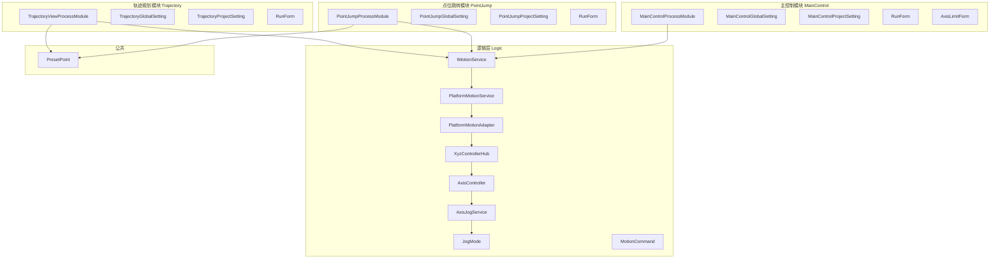
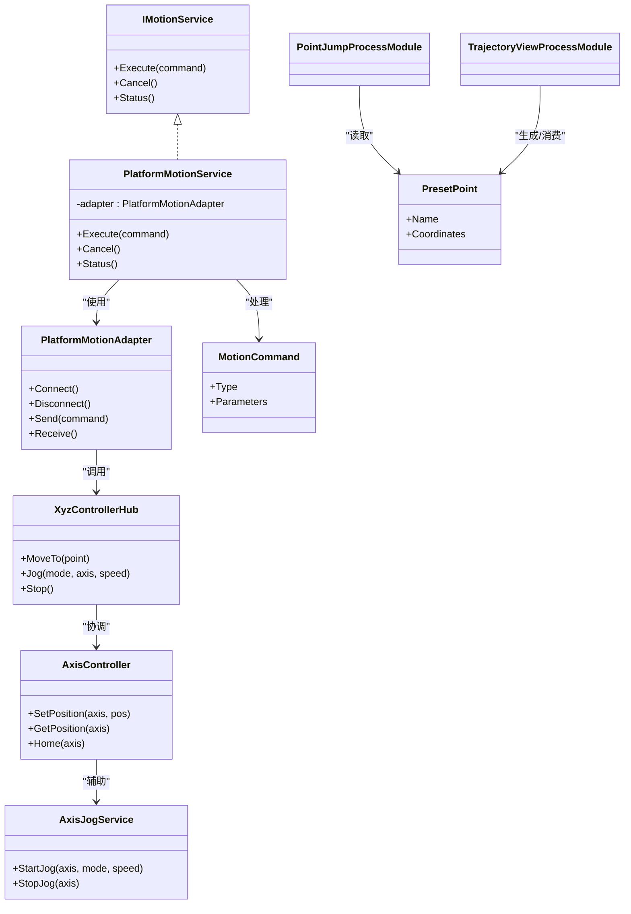
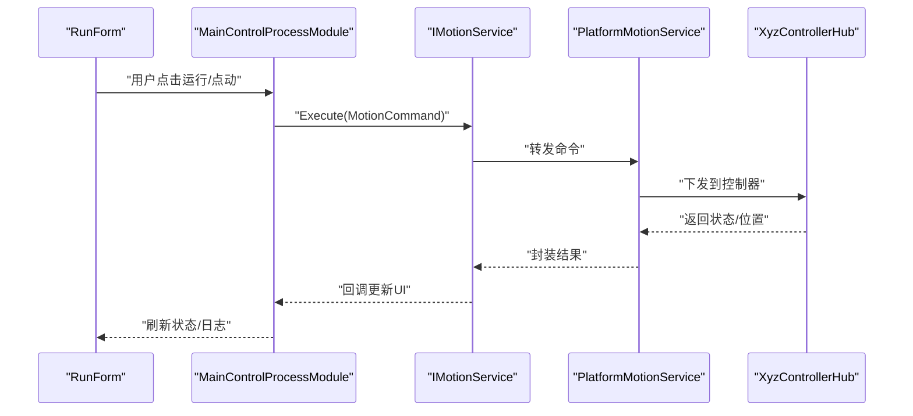
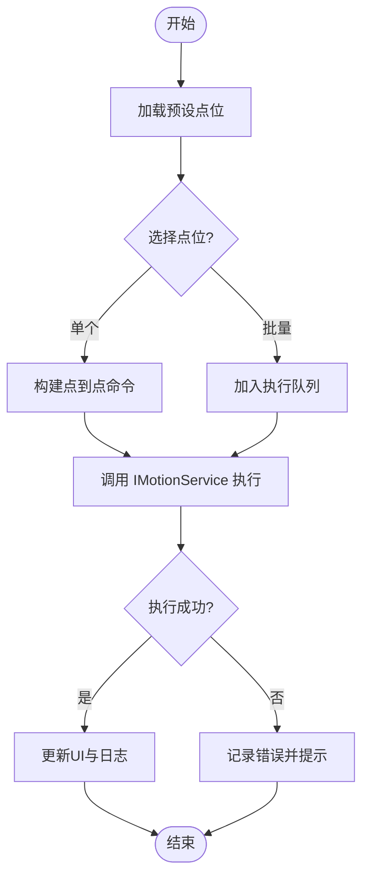
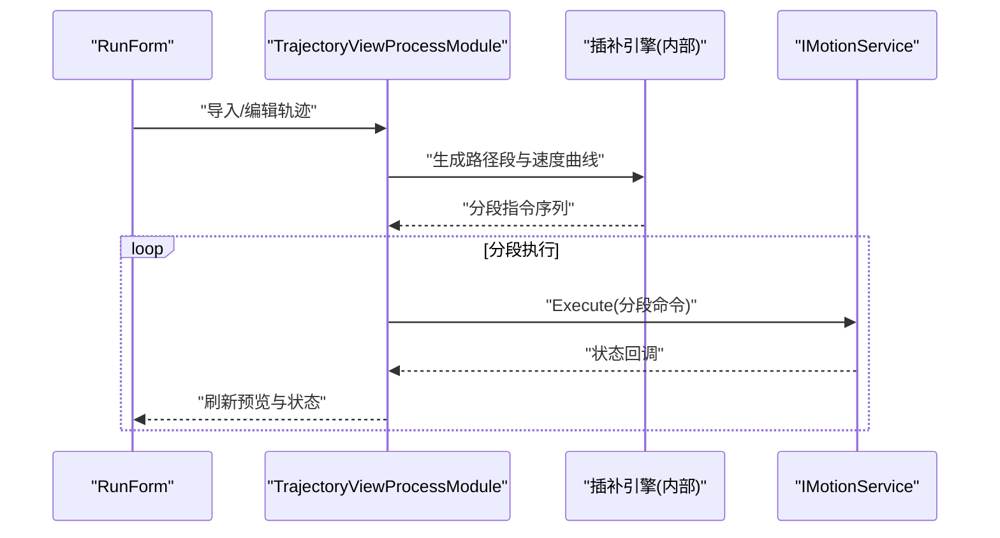
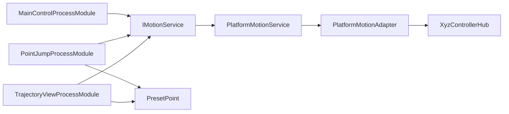

# 核心功能模块

<cite>
**本文引用的文件**   
- [MainControlProcessModule.cs](file://MainControl/MainControlProcessModule.cs)
- [MainControlGlobalSetting.cs](file://MainControl/MainControlGlobalSetting.cs)
- [MainControlProjectSetting.cs](file://MainControl/MainControlProjectSetting.cs)
- [RunForm.cs](file://MainControl/RunForm.cs)
- [AxisLimitForm.cs](file://MainControl/AxisLimitForm.cs)
- [PointJumpProcessModule.cs](file://PointJump/PointJumpProcessModule.cs)
- [PointJumpGlobalSetting.cs](file://PointJump/PointJumpGlobalSetting.cs)
- [PointJumpProjectSetting.cs](file://PointJump/PointJumpProjectSetting.cs)
- [RunForm.cs](file://PointJump/RunForm.cs)
- [TrajectoryViewProcessModule.cs](file://Trajectory/TrajectoryViewProcessModule.cs)
- [TrajectoryGlobalSetting.cs](file://Trajectory/TrajectoryGlobalSetting.cs)
- [TrajectoryProjectSetting.cs](file://Trajectory/TrajectoryProjectSetting.cs)
- [RunForm.cs](file://Trajectory/RunForm.cs)
- [PlatformMotionService.cs](file://Logic/PlatformMotionService.cs)
- [PlatformMotionAdapter.cs](file://Logic/PlatformMotionAdapter.cs)
- [XyzControllerHub.cs](file://Logic/XyzControllerHub.cs)
- [IMotionService.cs](file://Logic/IMotionService.cs)
- [MotionCommand.cs](file://Logic/MotionCommand.cs)
- [AxisController.cs](file://Logic/AxisController.cs)
- [AxisJogService.cs](file://Logic/AxisJogService.cs)
- [JogMode.cs](file://Logic/JogMode.cs)
- [PresetPoint.cs](file://PresetPoint.cs)
- [README.md](file://README.md)
</cite>

## 目录
1. [简介](#简介)
2. [项目结构](#项目结构)
3. [核心组件](#核心组件)
4. [架构总览](#架构总览)
5. [详细组件分析](#详细组件分析)
6. [依赖关系分析](#依赖关系分析)
7. [性能考虑](#性能考虑)
8. [故障排查指南](#故障排查指南)
9. [结论](#结论)
10. [附录](#附录)

## 简介
本文件为 ProcessModules 的核心功能模块提供系统化文档，覆盖主控制模块（MainControl）、点位跳转模块（PointJump）与轨迹规划模块（Trajectory）。内容涵盖：
- 各模块的入口点、主要界面与功能流程
- API 调用方式与数据交换格式
- 配置管理（全局设置与项目设置的差异）
- 错误处理与异常处理策略
- 最佳实践与性能优化建议

## 项目结构
本项目采用“按功能模块划分”的组织方式，每个模块包含独立的进程模块类、全局设置、项目设置与运行界面。逻辑层通过统一的运动服务接口与平台适配器进行解耦，便于扩展不同硬件平台。

图表来源 
- [MainControlProcessModule.cs](file://MainControl/MainControlProcessModule.cs)
- [PointJumpProcessModule.cs](file://PointJump/PointJumpProcessModule.cs)
- [TrajectoryViewProcessModule.cs](file://Trajectory/TrajectoryViewProcessModule.cs)
- [PlatformMotionService.cs](file://Logic/PlatformMotionService.cs)
- [PlatformMotionAdapter.cs](file://Logic/PlatformMotionAdapter.cs)
- [XyzControllerHub.cs](file://Logic/XyzControllerHub.cs)
- [AxisController.cs](file://Logic/AxisController.cs)
- [AxisJogService.cs](file://Logic/AxisJogService.cs)
- [JogMode.cs](file://Logic/JogMode.cs)
- [IMotionService.cs](file://Logic/IMotionService.cs)
- [MotionCommand.cs](file://Logic/MotionCommand.cs)
- [PresetPoint.cs](file://PresetPoint.cs)

章节来源
- [README.md](file://README.md)

## 核心组件
- 主控制模块（MainControl）
  - 入口：MainControlProcessModule
  - 界面：RunForm、AxisLimitForm
  - 配置：MainControlGlobalSetting、MainControlProjectSetting
  - 能力：轴限位配置、运行控制、状态监控

- 点位跳转模块（PointJump）
  - 入口：PointJumpProcessModule
  - 界面：RunForm
  - 配置：PointJumpGlobalSetting、PointJumpProjectSetting
  - 能力：预设点位列表、快速跳转、单轴/多轴联动

- 轨迹规划模块（Trajectory）
  - 入口：TrajectoryViewProcessModule
  - 界面：RunForm
  - 配置：TrajectoryGlobalSetting、TrajectoryProjectSetting
  - 能力：轨迹编辑与预览、插补参数、执行与回放

章节来源
- [MainControlProcessModule.cs](file://MainControl/MainControlProcessModule.cs)
- [MainControlGlobalSetting.cs](file://MainControl/MainControlGlobalSetting.cs)
- [MainControlProjectSetting.cs](file://MainControl/MainControlProjectSetting.cs)
- [RunForm.cs](file://MainControl/RunForm.cs)
- [AxisLimitForm.cs](file://MainControl/AxisLimitForm.cs)
- [PointJumpProcessModule.cs](file://PointJump/PointJumpProcessModule.cs)
- [PointJumpGlobalSetting.cs](file://PointJump/PointJumpGlobalSetting.cs)
- [PointJumpProjectSetting.cs](file://PointJump/PointJumpProjectSetting.cs)
- [RunForm.cs](file://PointJump/RunForm.cs)
- [TrajectoryViewProcessModule.cs](file://Trajectory/TrajectoryViewProcessModule.cs)
- [TrajectoryGlobalSetting.cs](file://Trajectory/TrajectoryGlobalSetting.cs)
- [TrajectoryProjectSetting.cs](file://Trajectory/TrajectoryProjectSetting.cs)
- [RunForm.cs](file://Trajectory/RunForm.cs)

## 架构总览
系统采用“模块-服务-适配器”的分层架构：
- 模块层：各功能模块以 ProcessModule 形式暴露入口，承载 UI 与业务编排
- 服务层：统一运动服务接口 IMotionService，屏蔽底层差异
- 适配层：PlatformMotionAdapter 对接具体控制器（如 XYZ 控制器）
- 数据模型：MotionCommand、PresetPoint 等作为跨模块通信的数据载体

图表来源 
- [IMotionService.cs](file://Logic/IMotionService.cs)
- [PlatformMotionService.cs](file://Logic/PlatformMotionService.cs)
- [PlatformMotionAdapter.cs](file://Logic/PlatformMotionAdapter.cs)
- [XyzControllerHub.cs](file://Logic/XyzControllerHub.cs)
- [AxisController.cs](file://Logic/AxisController.cs)
- [AxisJogService.cs](file://Logic/AxisJogService.cs)
- [MotionCommand.cs](file://Logic/MotionCommand.cs)
- [PresetPoint.cs](file://PresetPoint.cs)

## 详细组件分析

### 主控制模块（MainControl）
- 入口点
  - MainControlProcessModule：模块初始化、注册命令、绑定 UI 事件
- 主要界面
  - RunForm：运行面板，显示轴状态、执行按钮、日志输出
  - AxisLimitForm：轴限位配置，支持软限位与硬限位阈值设置
- 功能流程
  - 启动时加载全局与项目设置
  - 用户通过界面下发运动指令（点到点、回零、点动）
  - 模块将指令封装为 MotionCommand，交由 IMotionService 执行
  - 实时反馈轴位置、状态与错误码

图表来源 
- [MainControlProcessModule.cs](file://MainControl/MainControlProcessModule.cs)
- [RunForm.cs](file://MainControl/RunForm.cs)
- [IMotionService.cs](file://Logic/IMotionService.cs)
- [PlatformMotionService.cs](file://Logic/PlatformMotionService.cs)
- [XyzControllerHub.cs](file://Logic/XyzControllerHub.cs)

章节来源
- [MainControlProcessModule.cs](file://MainControl/MainControlProcessModule.cs)
- [RunForm.cs](file://MainControl/RunForm.cs)
- [AxisLimitForm.cs](file://MainControl/AxisLimitForm.cs)

### 点位跳转模块（PointJump）
- 入口点
  - PointJumpProcessModule：加载预设点位、建立跳转队列、驱动执行
- 主要界面
  - RunForm：点位列表、选择与批量执行、进度与结果展示
- 功能流程
  - 从项目设置或外部源加载 PresetPoint 列表
  - 用户选择目标点位或批量执行
  - 模块将点位转换为 MotionCommand，调用 IMotionService 执行
  - 记录执行历史与错误信息

图表来源 
- [PointJumpProcessModule.cs](file://PointJump/PointJumpProcessModule.cs)
- [RunForm.cs](file://PointJump/RunForm.cs)
- [PresetPoint.cs](file://PresetPoint.cs)
- [IMotionService.cs](file://Logic/IMotionService.cs)

章节来源
- [PointJumpProcessModule.cs](file://PointJump/PointJumpProcessModule.cs)
- [RunForm.cs](file://PointJump/RunForm.cs)
- [PresetPoint.cs](file://PresetPoint.cs)

### 轨迹规划模块（Trajectory）
- 入口点
  - TrajectoryViewProcessModule：轨迹解析、插补参数计算、执行调度
- 主要界面
  - RunForm：轨迹编辑器、预览画布、参数面板、执行控制
- 功能流程
  - 导入或绘制轨迹点序列
  - 根据插补算法生成路径段与速度曲线
  - 将路径段转换为 MotionCommand 序列，分片执行
  - 实时渲染轨迹与轴状态

图表来源 
- [TrajectoryViewProcessModule.cs](file://Trajectory/TrajectoryViewProcessModule.cs)
- [RunForm.cs](file://Trajectory/RunForm.cs)
- [IMotionService.cs](file://Logic/IMotionService.cs)

章节来源
- [TrajectoryViewProcessModule.cs](file://Trajectory/TrajectoryViewProcessModule.cs)
- [RunForm.cs](file://Trajectory/RunForm.cs)

## 依赖关系分析
- 模块间通信
  - 通过 IMotionService 抽象接口进行解耦，避免模块直接依赖具体实现
  - MotionCommand 作为统一命令载体，确保跨模块一致的数据格式
- 数据模型
  - PresetPoint 用于点位跳转与轨迹模块共享的坐标数据结构
- 外部依赖
  - PlatformMotionAdapter 负责与硬件控制器通信，可替换以实现多平台兼容

图表来源 
- [MainControlProcessModule.cs](file://MainControl/MainControlProcessModule.cs)
- [PointJumpProcessModule.cs](file://PointJump/PointJumpProcessModule.cs)
- [TrajectoryViewProcessModule.cs](file://Trajectory/TrajectoryViewProcessModule.cs)
- [IMotionService.cs](file://Logic/IMotionService.cs)
- [PlatformMotionService.cs](file://Logic/PlatformMotionService.cs)
- [PlatformMotionAdapter.cs](file://Logic/PlatformMotionAdapter.cs)
- [XyzControllerHub.cs](file://Logic/XyzControllerHub.cs)
- [PresetPoint.cs](file://PresetPoint.cs)

章节来源
- [IMotionService.cs](file://Logic/IMotionService.cs)
- [MotionCommand.cs](file://Logic/MotionCommand.cs)
- [PresetPoint.cs](file://PresetPoint.cs)

## 性能考虑
- 命令批处理
  - 对高频小命令进行合并与节流，减少总线负载与上下文切换开销
- 异步与回调
  - 所有运动执行应异步化，避免阻塞 UI 线程；使用回调更新状态
- 缓存与预取
  - 对常用点位与轨迹片段进行内存缓存，缩短响应时间
- 资源释放
  - 及时释放控制器连接与缓冲区，防止内存泄漏
- 精度与平滑
  - 合理设置插补步长与加速度曲线，平衡速度与平稳性

[本节为通用指导，不直接分析具体文件]

## 故障排查指南
- 常见问题定位
  - 连接失败：检查 PlatformMotionAdapter 的连接状态与超时设置
  - 执行中断：查看 MotionCommand 类型与参数是否合法
  - 超限报警：确认 AxisLimitForm 中的软/硬限位阈值
- 日志与诊断
  - 在 IMotionService 回调中记录关键状态与错误码
  - 在模块入口打印初始化与配置加载结果
- 恢复策略
  - 自动重试机制与降级模式（如单轴回退）
  - 安全停止与急停优先级高于其他操作

章节来源
- [PlatformMotionAdapter.cs](file://Logic/PlatformMotionAdapter.cs)
- [MotionCommand.cs](file://Logic/MotionCommand.cs)
- [AxisLimitForm.cs](file://MainControl/AxisLimitForm.cs)

## 结论
ProcessModules 通过清晰的模块化设计与统一的服务接口，实现了主控制、点位跳转与轨迹规划的协同工作。借助 IMotionService 与 PlatformMotionAdapter 的解耦，系统具备良好的可扩展性与可维护性。遵循本文的最佳实践与性能建议，可在保证稳定性的同时提升整体效率。

[本节为总结性内容，不直接分析具体文件]

## 附录

### 配置管理说明
- 全局设置（Global Setting）
  - 作用域：应用级，影响所有项目
  - 典型项：默认速度、加速度、通信端口、单位制
  - 示例文件：MainControlGlobalSetting.cs、PointJumpGlobalSetting.cs、TrajectoryGlobalSetting.cs
- 项目设置（Project Setting）
  - 作用域：当前项目，覆盖全局默认值
  - 典型项：轴映射、限位阈值、预设点位、轨迹参数
  - 示例文件：MainControlProjectSetting.cs、PointJumpProjectSetting.cs、TrajectoryProjectSetting.cs
- 差异与优先级
  - 项目设置优先于全局设置；未显式配置的项继承全局默认值

章节来源
- [MainControlGlobalSetting.cs](file://MainControl/MainControlGlobalSetting.cs)
- [MainControlProjectSetting.cs](file://MainControl/MainControlProjectSetting.cs)
- [PointJumpGlobalSetting.cs](file://PointJump/PointJumpGlobalSetting.cs)
- [PointJumpProjectSetting.cs](file://PointJump/PointJumpProjectSetting.cs)
- [TrajectoryGlobalSetting.cs](file://Trajectory/TrajectoryGlobalSetting.cs)
- [TrajectoryProjectSetting.cs](file://Trajectory/TrajectoryProjectSetting.cs)

### API 调用示例（路径引用）
- 主控制模块
  - 入口与命令绑定：[MainControlProcessModule.cs](file://MainControl/MainControlProcessModule.cs)
  - 运行界面事件处理：[RunForm.cs](file://MainControl/RunForm.cs)
- 点位跳转模块
  - 点位加载与执行：[PointJumpProcessModule.cs](file://PointJump/PointJumpProcessModule.cs)
  - 点位数据模型：[PresetPoint.cs](file://PresetPoint.cs)
- 轨迹规划模块
  - 轨迹解析与执行：[TrajectoryViewProcessModule.cs](file://Trajectory/TrajectoryViewProcessModule.cs)
  - 运行界面交互：[RunForm.cs](file://Trajectory/RunForm.cs)
- 运动服务与适配器
  - 接口定义：[IMotionService.cs](file://Logic/IMotionService.cs)
  - 服务实现：[PlatformMotionService.cs](file://Logic/PlatformMotionService.cs)
  - 平台适配：[PlatformMotionAdapter.cs](file://Logic/PlatformMotionAdapter.cs)
  - 控制器中枢：[XyzControllerHub.cs](file://Logic/XyzControllerHub.cs)
  - 轴控制与点动：[AxisController.cs](file://Logic/AxisController.cs)、[AxisJogService.cs](file://Logic/AxisJogService.cs)
  - 点动模式：[JogMode.cs](file://Logic/JogMode.cs)
  - 命令模型：[MotionCommand.cs](file://Logic/MotionCommand.cs)

[本节仅列出文件路径，不包含代码内容]