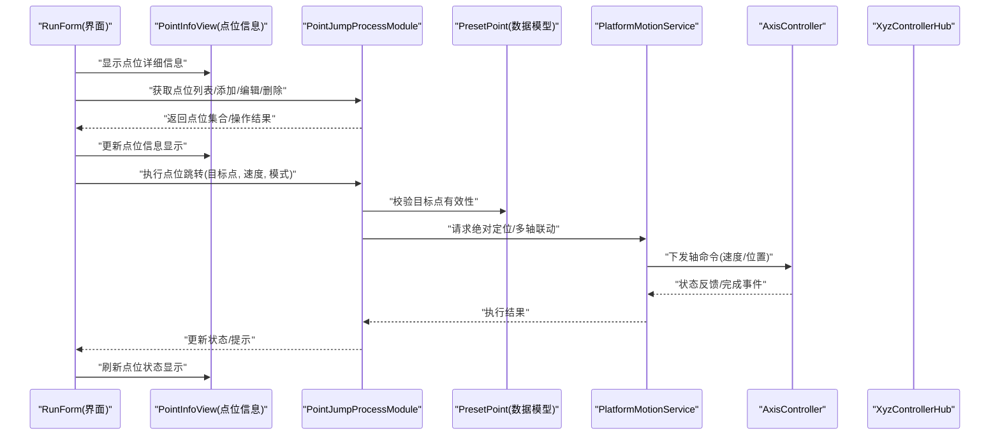
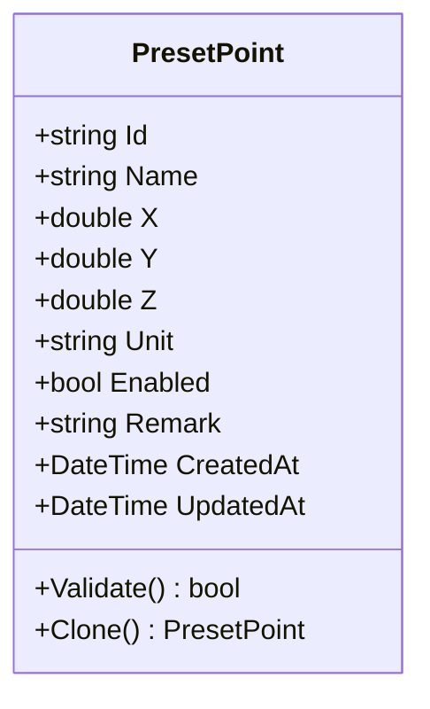
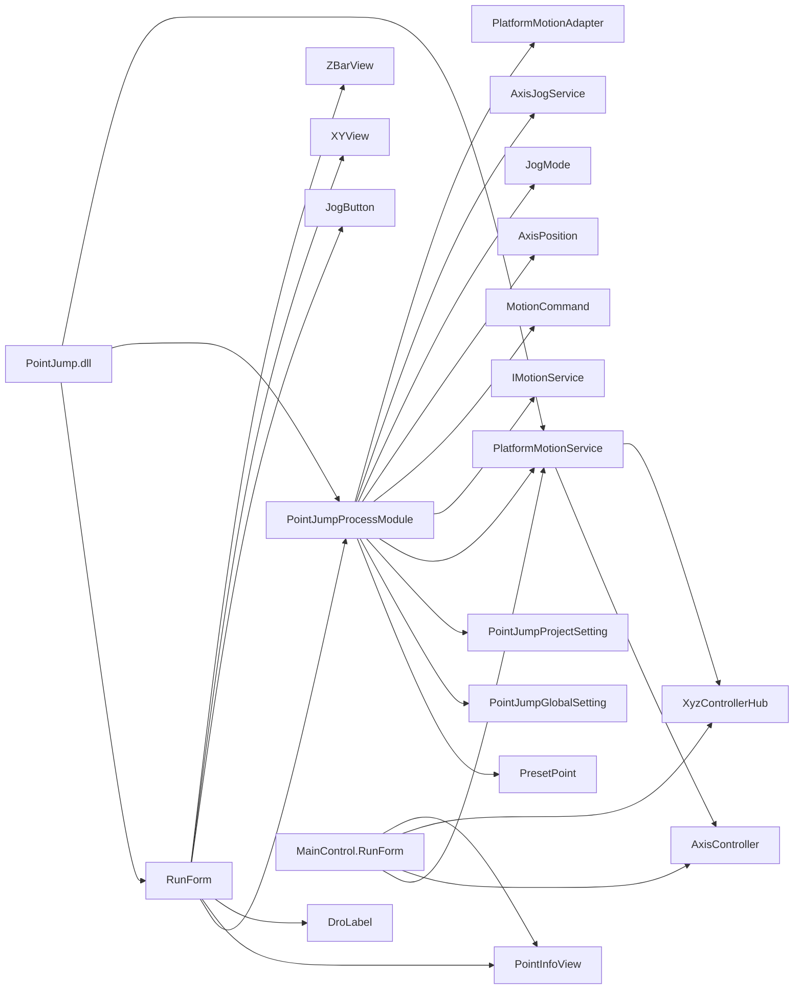

# 点位跳转模块 (PointJump)

<cite>
**本文引用的文件**   
- [PresetPoint.cs](file://PresetPoint.cs)
- [PointJump/PointJumpProcessModule.cs](file://PointJump/PointJumpProcessModule.cs)
- [PointJump/PointJumpGlobalSetting.cs](file://PointJump/PointJumpGlobalSetting.cs)
- [PointJump/PointJumpProjectSetting.cs](file://PointJump/PointJumpProjectSetting.cs)
- [PointJump/RunForm.Designer.cs](file://PointJump/RunForm.Designer.cs)
- [PointJump/RunForm.resx](file://PointJump/RunForm.resx)
- [PointJump/PointJump.csproj](file://PointJump/PointJump.csproj)
- [MainControl/MainControlGlobalSetting.cs](file://MainControl/MainControlGlobalSetting.cs)
- [MainControl/MainControlProjectSetting.cs](file://MainControl/MainControlProjectSetting.cs)
- [MainControl/RunForm.cs](file://MainControl/RunForm.cs)
- [Logic/PlatformMotionService.cs](file://Logic/PlatformMotionService.cs)
- [Logic/AxisController.cs](file://Logic/AxisController.cs)
- [Logic/XyzControllerHub.cs](file://Logic/XyzControllerHub.cs)
- [PointJump/Controls/DroLabel.cs](file://PointJump/Controls/DroLabel.cs)
- [PointJump/Controls/JogButton.cs](file://PointJump/Controls/JogButton.cs)
- [PointJump/Controls/MathHelper.cs](file://PointJump/Controls/MathHelper.cs)
- [PointJump/Controls/PaintHelper.cs](file://PointJump/Controls/PaintHelper.cs)
- [PointJump/Controls/XYView.cs](file://PointJump/Controls/XYView.cs)
- [PointJump/Controls/ZBarView.cs](file://PointJump/Controls/ZBarView.cs)
- [MainControl/Controls/PointInfoView.cs](file://MainControl/Controls/PointInfoView.cs)
</cite>

## 更新摘要
**变更内容**   
- 移除了冗余的文档文件（架构设计.md、概述.md），简化了项目结构
- 在RunForm.Designer.cs中集成了PointInfoView控件，增强了点位管理功能
- 优化了界面布局，提供了更直观的点位信息显示和操作体验
- 保持了PointJump模块的独立性和完整性

## 目录
1. [简介](#简介)
2. [项目结构](#项目结构)
3. [核心组件](#核心组件)
4. [架构总览](#架构总览)
5. [详细组件分析](#详细组件分析)
6. [依赖关系分析](#依赖关系分析)
7. [性能考虑](#性能考虑)
8. [故障排查指南](#故障排查指南)
9. [结论](#结论)
10. [附录](#附录)

## 简介
本文件为"点位跳转模块（PointJump）"的完整技术文档，面向开发者与集成人员。PointJump模块现已重构为完全独立的PointJump.dll，拥有自己的Logic目录实现点跳功能，包括AxisController.cs、PlatformMotionService.cs等核心类，以及完整的UI控件集。该模块采用自包含的模块化设计，可单独部署和使用，同时保持与MainControl相同的架构风格。内容涵盖：
- 点位管理的核心功能：预设点位的创建、编辑、删除与调用
- RunForm 界面的操作流程与用户交互方式
- PresetPoint 数据结构与点位存储机制
- 全局设置与项目设置的配置项说明
- 通过 API 进行点位跳转的代码示例路径
- 坐标系统、速度控制与路径规划要点
- 批量操作与程序化控制实现方法
- 与运动控制系统的集成与数据同步机制
- 调试技巧与常见问题解决方案

## 项目结构
PointJump模块现在是一个完全独立的.NET类库项目，位于PointJump目录下，包含界面、逻辑与资源；同时根目录提供共享的数据模型（如PresetPoint）。关键特色是拥有独立的Logic目录，实现了完整的运动控制功能，包括AxisController.cs、PlatformMotionService.cs等核心类。其他关键目录包括MainControl（主运行界面），以及各模块的独立设置类。

```mermaid
graph TB
subgraph "PointJump.dll (独立模块)"
PJPM["PointJumpProcessModule.cs"]
PJGS["PointJumpGlobalSetting.cs"]
PJPS["PointJumpProjectSetting.cs"]
PJRF_D["RunForm.Designer.cs"]
PJRF_R["RunForm.resx"]
PJPROJ["PointJump.csproj"]
end
subgraph "PointJump.Logic (独立运动控制)"
AC["AxisController.cs"]
PMS["PlatformMotionService.cs"]
XHUB["XyzControllerHub.cs"]
IMC["IMotionService.cs"]
MC["MotionCommand.cs"]
AXPOS["AxisPosition.cs"]
JOG["JogMode.cs"]
AJOG["AxisJogService.cs"]
PMA["PlatformMotionAdapter.cs"]
end
subgraph "PointJump.Controls"
DRO["DroLabel.cs"]
JOGB["JogButton.cs"]
MATH["MathHelper.cs"]
PAINT["PaintHelper.cs"]
XYV["XYView.cs"]
ZBAR["ZBarView.cs"]
end
subgraph "MainControl"
MC_GLOBAL["MainControlGlobalSetting.cs"]
MC_PROJECT["MainControlProjectSetting.cs"]
MC_RF["RunForm.cs"]
MC_PIV["PointInfoView.cs"]
end
RootPP["PresetPoint.cs"]
PJPROJ --> PJPM
PJPM --> PJGS
PJPM --> PJPS
PJPM --> PJRF_D
PJPM --> PJRF_R
PJPM --> RootPP
PJPM --> PMS
PJPM --> AC
PJPM --> XHUB
PJPM --> DRO
PJPM --> JOGB
PJPM --> MATH
PJPM --> PAINT
PJPM --> XYV
PJPM --> ZBAR
PJPM --> IMC
PJPM --> MC
PJPM --> AXPOS
PJPM --> JOG
PJPM --> AJOG
PJPM --> PMA
MC_RF --> PMS
MC_RF --> AC
MC_RF --> XHUB
MC_RF --> MC_PIV
```

**图表来源**
- [PointJump/PointJump.csproj](file://PointJump/PointJump.csproj)
- [PointJump/PointJumpProcessModule.cs](file://PointJump/PointJumpProcessModule.cs)
- [PointJump/PointJumpGlobalSetting.cs](file://PointJump/PointJumpGlobalSetting.cs)
- [PointJump/PointJumpProjectSetting.cs](file://PointJump/PointJumpProjectSetting.cs)
- [PointJump/RunForm.Designer.cs](file://PointJump/RunForm.Designer.cs)
- [PointJump/RunForm.resx](file://PointJump/RunForm.resx)
- [PointJump/Controls/DroLabel.cs](file://PointJump/Controls/DroLabel.cs)
- [PointJump/Controls/JogButton.cs](file://PointJump/Controls/JogButton.cs)
- [PointJump/Controls/MathHelper.cs](file://PointJump/Controls/MathHelper.cs)
- [PointJump/Controls/PaintHelper.cs](file://PointJump/Controls/PaintHelper.cs)
- [PointJump/Controls/XYView.cs](file://PointJump/Controls/XYView.cs)
- [PointJump/Controls/ZBarView.cs](file://PointJump/Controls/ZBarView.cs)
- [Logic/PlatformMotionService.cs](file://Logic/PlatformMotionService.cs)
- [Logic/AxisController.cs](file://Logic/AxisController.cs)
- [Logic/XyzControllerHub.cs](file://Logic/XyzControllerHub.cs)
- [Logic/IMotionService.cs](file://Logic/IMotionService.cs)
- [Logic/MotionCommand.cs](file://Logic/MotionCommand.cs)
- [Logic/AxisPosition.cs](file://Logic/AxisPosition.cs)
- [Logic/JogMode.cs](file://Logic/JogMode.cs)
- [Logic/AxisJogService.cs](file://Logic/AxisJogService.cs)
- [Logic/PlatformMotionAdapter.cs](file://Logic/PlatformMotionAdapter.cs)
- [MainControl/MainControlGlobalSetting.cs](file://MainControl/MainControlGlobalSetting.cs)
- [MainControl/MainControlProjectSetting.cs](file://MainControl/MainControlProjectSetting.cs)
- [MainControl/RunForm.cs](file://MainControl/RunForm.cs)
- [MainControl/Controls/PointInfoView.cs](file://MainControl/Controls/PointInfoView.cs)
- [PresetPoint.cs](file://PresetPoint.cs)

章节来源
- [PointJump/PointJump.csproj](file://PointJump/PointJump.csproj)

## 核心组件
- **点位数据模型**：PresetPoint定义点位的标识、名称、坐标、单位、可选属性等，用于跨模块共享与持久化。
- **进程模块**：PointJumpProcessModule负责加载/保存项目设置、管理点位集合、暴露API供UI或外部调用。
- **设置类**：PointJumpGlobalSetting、PointJumpProjectSetting分别承载全局与项目级配置（如默认单位、坐标系、速度限制、安全参数等）。
- **界面**：RunForm提供点位的可视化列表、选择、编辑与执行入口，现已集成PointInfoView增强显示功能。
- **自定义控件**：Controls目录包含DroLabel、JogButton、XYView、ZBarView等专用控件，提供数值显示、手动操作、二维视图等功能。
- **运动服务**：Logic目录包含完整的运动控制实现，包括PlatformMotionService、AxisController、XyzControllerHub等核心类，封装底层硬件接口，提供绝对定位、速度/加速度、插补与状态同步能力。

**章节来源**
- [PresetPoint.cs](file://PresetPoint.cs)
- [PointJump/PointJumpProcessModule.cs](file://PointJump/PointJumpProcessModule.cs)
- [PointJump/PointJumpGlobalSetting.cs](file://PointJump/PointJumpGlobalSetting.cs)
- [PointJump/PointJumpProjectSetting.cs](file://PointJump/PointJumpProjectSetting.cs)
- [PointJump/RunForm.Designer.cs](file://PointJump/RunForm.Designer.cs)
- [PointJump/Controls/DroLabel.cs](file://PointJump/Controls/DroLabel.cs)
- [PointJump/Controls/JogButton.cs](file://PointJump/Controls/JogButton.cs)
- [PointJump/Controls/XYView.cs](file://PointJump/Controls/XYView.cs)
- [PointJump/Controls/ZBarView.cs](file://PointJump/Controls/ZBarView.cs)
- [Logic/PlatformMotionService.cs](file://Logic/PlatformMotionService.cs)
- [Logic/AxisController.cs](file://Logic/AxisController.cs)
- [Logic/XyzControllerHub.cs](file://Logic/XyzControllerHub.cs)

## 架构总览
PointJump采用"UI-业务-运动服务"的分层架构，现已完全独立为PointJump.dll模块，拥有自己的Logic目录实现完整的运动控制功能：
- **UI层（RunForm）**：展示点位列表、接收用户操作（新增/编辑/删除/执行），并调用ProcessModule提供的API。现已集成PointInfoView提供更丰富的点位信息显示。
- **业务层（PointJumpProcessModule）**：维护点位集合与项目设置，校验输入，协调运动服务完成跳转。
- **运动服务层（Logic目录）**：包含PlatformMotionService、AxisController、XyzControllerHub等核心类，屏蔽硬件差异，统一坐标与速度语义，返回执行结果与状态。

**图表来源**
- [PointJump/RunForm.Designer.cs](file://PointJump/RunForm.Designer.cs)
- [PointJump/PointJumpProcessModule.cs](file://PointJump/PointJumpProcessModule.cs)
- [MainControl/Controls/PointInfoView.cs](file://MainControl/Controls/PointInfoView.cs)
- [PresetPoint.cs](file://PresetPoint.cs)
- [Logic/PlatformMotionService.cs](file://Logic/PlatformMotionService.cs)
- [Logic/AxisController.cs](file://Logic/AxisController.cs)
- [Logic/XyzControllerHub.cs](file://Logic/XyzControllerHub.cs)

## 详细组件分析

### PresetPoint数据模型与存储机制
- **字段与语义**
  - 标识与名称：唯一ID与可读名称，便于管理与显示
  - 坐标值：X/Y/Z（可扩展更多轴），支持不同单位（mm/inch等）
  - 附加属性：如是否启用、备注、优先级、触发条件等
  - 元数据：创建/更新时间戳、版本信息
- **存储机制**
  - 内存集合：运行时由ProcessModule维护，保证线程安全访问
  - 项目持久化：随项目设置序列化到磁盘，启动时加载
  - 全局默认：从全局设置中读取默认单位、坐标系、速度上限等

**图表来源**
- [PresetPoint.cs](file://PresetPoint.cs)

**章节来源**
- [PresetPoint.cs](file://PresetPoint.cs)

### 进程模块 PointJumpProcessModule
- **职责**
  - 管理PresetPoint集合：增删改查、排序、过滤
  - 加载/保存项目设置（含点位集合）
  - 对外暴露API：按名称或索引跳转、批量跳转、查询状态
  - 与运动服务协作：将点位转换为运动命令，处理异常与回调
- **关键点**
  - 线程安全：对集合与状态变更加锁或使用并发容器
  - 参数校验：坐标范围、速度限制、安全联锁
  - 事件通知：执行开始/完成/错误，驱动UI更新

**章节来源**
- [PointJump/PointJumpProcessModule.cs](file://PointJump/PointJumpProcessModule.cs)

### 运行界面 RunForm 与 PointInfoView 集成
- **功能**
  - 点位列表展示、搜索与筛选
  - 新建/编辑/删除点位表单
  - 选择点位后点击"跳转"，可覆盖速度与模式
  - 实时显示执行状态与错误信息
  - **新增**：PointInfoView集成，提供更详细的点位信息显示和预览功能
- **交互流程**
  - 用户编辑点位 -> 保存至内存集合 -> 写入项目设置
  - 用户选择点位 -> 调用ProcessModule执行 -> 订阅运动服务事件 -> 刷新UI
  - **新增**：PointInfoView实时更新显示当前选中点位的详细信息

**章节来源**
- [PointJump/RunForm.Designer.cs](file://PointJump/RunForm.Designer.cs)
- [PointJump/RunForm.resx](file://PointJump/RunForm.resx)
- [MainControl/Controls/PointInfoView.cs](file://MainControl/Controls/PointInfoView.cs)

### Logic目录核心类详解
**更新** PointJump模块现在拥有独立的Logic目录，实现了完整的运动控制功能：

- **PlatformMotionService**：统一的运动服务接口，提供绝对定位、相对移动、插补运动等功能，封装重试与超时机制
- **AxisController**：单轴控制器，负责单个轴的速度、位置、回零、使能/失能等基础控制
- **XyzControllerHub**：XYZ三轴协调控制器，确保多轴同步运动和顺序约束
- **IMotionService**：运动服务接口定义，抽象底层硬件差异
- **MotionCommand**：运动命令封装，包含目标位置、速度、加速度等参数
- **AxisPosition**：轴位置数据结构，记录当前实际位置和状态信息
- **JogMode**：点动模式枚举，定义不同的手动操作模式
- **AxisJogService**：轴点动服务，处理手动点动操作的逻辑
- **PlatformMotionAdapter**：平台运动适配器，适配不同硬件平台的运动控制接口

**章节来源**
- [Logic/PlatformMotionService.cs](file://Logic/PlatformMotionService.cs)
- [Logic/AxisController.cs](file://Logic/AxisController.cs)
- [Logic/XyzControllerHub.cs](file://Logic/XyzControllerHub.cs)
- [Logic/IMotionService.cs](file://Logic/IMotionService.cs)
- [Logic/MotionCommand.cs](file://Logic/MotionCommand.cs)
- [Logic/AxisPosition.cs](file://Logic/AxisPosition.cs)
- [Logic/JogMode.cs](file://Logic/JogMode.cs)
- [Logic/AxisJogService.cs](file://Logic/AxisJogService.cs)
- [Logic/PlatformMotionAdapter.cs](file://Logic/PlatformMotionAdapter.cs)

### Controls目录控件详解
**更新** PointJump模块现在包含完整的Controls目录，提供丰富的自定义控件：

- **DroLabel**：数字显示标签，用于实时显示轴位置、速度等数值信息
- **JogButton**：手动操作按钮，支持点动控制和方向切换
- **MathHelper**：数学计算工具类，提供坐标转换、距离计算等函数
- **PaintHelper**：绘图辅助类，封装GDI+绘制操作
- **XYView**：二维视图控件，显示XY平面位置和轨迹
- **ZBarView**：Z轴条形图控件，直观显示Z轴高度变化

**章节来源**
- [PointJump/Controls/DroLabel.cs](file://PointJump/Controls/DroLabel.cs)
- [PointJump/Controls/JogButton.cs](file://PointJump/Controls/JogButton.cs)
- [PointJump/Controls/MathHelper.cs](file://PointJump/Controls/MathHelper.cs)
- [PointJump/Controls/PaintHelper.cs](file://PointJump/Controls/PaintHelper.cs)
- [PointJump/Controls/XYView.cs](file://PointJump/Controls/XYView.cs)
- [PointJump/Controls/ZBarView.cs](file://PointJump/Controls/ZBarView.cs)

### PointInfoView 点位信息显示控件
**新增** PointInfoView控件为RunForm提供了强大的点位信息显示功能：

- **功能特性**
  - 实时显示当前选中点位的详细信息
  - 支持坐标预览和状态指示
  - 提供点位信息的快速编辑入口
  - 与RunForm无缝集成，自动响应点位选择变化
- **集成方式**
  - 在RunForm.Designer.cs中声明和初始化
  - 通过事件机制与点位选择同步
  - 支持数据绑定和实时更新

**章节来源**
- [MainControl/Controls/PointInfoView.cs](file://MainControl/Controls/PointInfoView.cs)
- [PointJump/RunForm.Designer.cs](file://PointJump/RunForm.Designer.cs)

### 全局设置与项目设置
- **全局设置（PointJumpGlobalSetting / MainControlGlobalSetting）**
  - 默认单位、坐标系原点、默认速度/加速度、安全限位、日志级别
- **项目设置（PointJumpProjectSetting / MainControlProjectSetting）**
  - 点位集合、最近打开的项目路径、界面布局、快捷键映射

**章节来源**
- [PointJump/PointJumpGlobalSetting.cs](file://PointJump/PointJumpGlobalSetting.cs)
- [PointJump/PointJumpProjectSetting.cs](file://PointJump/PointJumpProjectSetting.cs)
- [MainControl/MainControlGlobalSetting.cs](file://MainControl/MainControlGlobalSetting.cs)
- [MainControl/MainControlProjectSetting.cs](file://MainControl/MainControlProjectSetting.cs)

### 运动系统集成与数据同步
- **PlatformMotionService**：统一运动指令（绝对定位、相对移动、插补），封装重试与超时
- **AxisController**：单轴控制（速度、位置、回零、使能/失能）
- **XyzControllerHub**：多轴协调，确保同步与顺序约束
- **数据同步**
  - 运动状态事件回调（开始、到达、错误）
  - 周期性读取实际位置，与目标位置比对，驱动UI与业务逻辑

**章节来源**
- [Logic/PlatformMotionService.cs](file://Logic/PlatformMotionService.cs)
- [Logic/AxisController.cs](file://Logic/AxisController.cs)
- [Logic/XyzControllerHub.cs](file://Logic/XyzControllerHub.cs)

## 依赖关系分析
- **模块内依赖**
  - RunForm依赖PointJumpProcessModule
  - PointJumpProcessModule依赖PresetPoint、PointJumpProjectSetting、PointJumpGlobalSetting
  - PointJumpProcessModule依赖Logic目录下的PlatformMotionService、AxisController、XyzControllerHub等核心类
  - RunForm依赖Controls目录下的自定义控件
  - **新增**：RunForm依赖PointInfoView控件以增强信息显示功能
- **跨模块依赖**
  - MainControl.RunForm同样依赖Logic层运动服务，用于通用运行流程
- **潜在循环依赖**
  - 通过事件与接口解耦，避免直接双向引用

**图表来源**
- [PointJump/RunForm.Designer.cs](file://PointJump/RunForm.Designer.cs)
- [PointJump/PointJumpProcessModule.cs](file://PointJump/PointJumpProcessModule.cs)
- [MainControl/Controls/PointInfoView.cs](file://MainControl/Controls/PointInfoView.cs)
- [PresetPoint.cs](file://PresetPoint.cs)
- [PointJump/PointJumpGlobalSetting.cs](file://PointJump/PointJumpGlobalSetting.cs)
- [PointJump/PointJumpProjectSetting.cs](file://PointJump/PointJumpProjectSetting.cs)
- [Logic/PlatformMotionService.cs](file://Logic/PlatformMotionService.cs)
- [Logic/AxisController.cs](file://Logic/AxisController.cs)
- [Logic/XyzControllerHub.cs](file://Logic/XyzControllerHub.cs)
- [Logic/IMotionService.cs](file://Logic/IMotionService.cs)
- [Logic/MotionCommand.cs](file://Logic/MotionCommand.cs)
- [Logic/AxisPosition.cs](file://Logic/AxisPosition.cs)
- [Logic/JogMode.cs](file://Logic/JogMode.cs)
- [Logic/AxisJogService.cs](file://Logic/AxisJogService.cs)
- [Logic/PlatformMotionAdapter.cs](file://Logic/PlatformMotionAdapter.cs)
- [MainControl/RunForm.cs](file://MainControl/RunForm.cs)
- [PointJump/PointJump.csproj](file://PointJump/PointJump.csproj)
- [PointJump/Controls/DroLabel.cs](file://PointJump/Controls/DroLabel.cs)
- [PointJump/Controls/JogButton.cs](file://PointJump/Controls/JogButton.cs)
- [PointJump/Controls/XYView.cs](file://PointJump/Controls/XYView.cs)
- [PointJump/Controls/ZBarView.cs](file://PointJump/Controls/ZBarView.cs)

**章节来源**
- [PointJump/PointJumpProcessModule.cs](file://PointJump/PointJumpProcessModule.cs)
- [Logic/PlatformMotionService.cs](file://Logic/PlatformMotionService.cs)

## 性能考虑
- **点位集合管理**
  - 使用高效查找结构（字典/哈希表）提升按ID/名称检索性能
  - 批量操作时使用事务式提交，减少频繁IO
- **运动控制**
  - 合理设置速度/加速度，避免频繁启停导致抖动
  - 异步执行与事件回调，避免阻塞UI线程
  - Logic目录中的运动服务采用优化算法，减少不必要的计算
- **数据持久化**
  - 增量保存与压缩，降低磁盘占用与I/O压力
- **线程安全**
  - 读写分离与锁粒度最小化，避免死锁与长等待
- **控件性能优化**
  - 自定义控件采用双缓冲技术减少闪烁
  - 大量数据更新时使用虚拟化技术
  - **新增**：PointInfoView采用延迟加载和缓存机制，提升大数据量显示性能

## 故障排查指南
- **常见错误**
  - 点位不存在或无效：检查ID/名称、单位与坐标范围
  - 运动失败：查看轴状态、限位、使能、通信状态
  - 界面无响应：确认事件订阅与线程切换是否正确
  - 控件显示异常：检查数据绑定和更新机制
  - Logic层错误：检查运动服务初始化、硬件连接状态
  - **新增**：PointInfoView显示问题：检查数据源绑定和更新事件
- **调试技巧**
  - 开启详细日志，记录命令下发与回调
  - 使用只读模式验证点位与路径，再切换到执行模式
  - 逐步缩小问题范围：先单轴测试，再多轴联动
  - 监控控件状态和数据流
  - 使用Logic目录中的诊断工具检查运动状态
  - **新增**：检查PointInfoView的事件订阅和数据绑定
- **恢复策略**
  - 回退到上一个稳定项目设置
  - 重置轴状态与报警，重新回零
  - 重建控件实例和事件订阅
  - 重启Logic层的运动服务
  - **新增**：重新初始化PointInfoView控件实例

**章节来源**
- [PointJump/PointJumpProcessModule.cs](file://PointJump/PointJumpProcessModule.cs)
- [Logic/PlatformMotionService.cs](file://Logic/PlatformMotionService.cs)
- [MainControl/Controls/PointInfoView.cs](file://MainControl/Controls/PointInfoView.cs)

## 结论
PointJump模块以清晰的层次结构与稳定的运动服务抽象，实现了点位的可视化管理与可靠跳转。现已重构为完全独立的PointJump.dll，拥有自己的Logic目录实现点跳功能，包括AxisController.cs、PlatformMotionService.cs等核心类，以及完整的UI控件集。通过移除冗余文档文件和集成PointInfoView控件，模块的结构更加简洁，用户体验得到显著提升。这种自包含的设计既满足日常快速定位需求，也支持复杂场景下的批量与程序化控制。建议在生产环境中结合日志与监控，持续优化速度与路径参数，确保稳定性与效率。

## 附录

### 坐标系统与单位
- **坐标系**：通常采用右手直角坐标系，X/Y平面为主工作面，Z为法向
- **单位**：毫米/英寸等，需在全局设置中统一，并在点位中记录单位
- **原点**：机械零点与工件零点可配置，注意偏移补偿

**章节来源**
- [PointJump/PointJumpGlobalSetting.cs](file://PointJump/PointJumpGlobalSetting.cs)
- [PresetPoint.cs](file://PresetPoint.cs)

### 速度控制与路径规划
- **速度/加速度**：根据负载与精度要求设定，避免过冲与振动
- **路径规划**：直线插补优先，复杂轨迹分段处理
- **安全**：限位、碰撞检测、急停与降级策略

**章节来源**
- [Logic/PlatformMotionService.cs](file://Logic/PlatformMotionService.cs)
- [Logic/AxisController.cs](file://Logic/AxisController.cs)
- [Logic/XyzControllerHub.cs](file://Logic/XyzControllerHub.cs)

### 批量操作与程序化控制
- **批量跳转**：传入点位序列与统一参数，逐条执行并聚合结果
- **程序化控制**：通过ProcessModuleAPI在脚本或外部程序中调用
- **事务与回滚**：失败时回滚已执行步骤，保持状态一致

**章节来源**
- [PointJump/PointJumpProcessModule.cs](file://PointJump/PointJumpProcessModule.cs)

### API使用示例（路径指引）
- **初始化与加载设置**
  - 参考：[PointJump/PointJumpProcessModule.cs](file://PointJump/PointJumpProcessModule.cs)
- **创建/编辑/删除点位**
  - 参考：[PointJump/PointJumpProcessModule.cs](file://PointJump/PointJumpProcessModule.cs)
- **执行点位跳转（单点/批量）**
  - 参考：[PointJump/PointJumpProcessModule.cs](file://PointJump/PointJumpProcessModule.cs)
- **查询状态与事件订阅**
  - 参考：[Logic/PlatformMotionService.cs](file://Logic/PlatformMotionService.cs)

### 与MainControl的协同
- **MainControl.RunForm**作为通用运行界面，复用Logic层运动服务
- **PointJump的RunForm**专注点位管理，两者可通过共享设置与事件互通
- **独立DLL部署**：PointJump.dll可单独部署，通过引用方式使用
- **新增**：PointInfoView控件可在两个模块间共享使用，提供一致的点位信息显示体验

**章节来源**
- [MainControl/RunForm.cs](file://MainControl/RunForm.cs)
- [PointJump/RunForm.Designer.cs](file://PointJump/RunForm.Designer.cs)
- [PointJump/PointJump.csproj](file://PointJump/PointJump.csproj)
- [MainControl/Controls/PointInfoView.cs](file://MainControl/Controls/PointInfoView.cs)

### 独立DLL部署与集成
- **构建输出**：PointJump.dll包含所有必要的界面、逻辑和资源
- **依赖管理**：仅需引用Logic层的运动服务接口
- **配置隔离**：全局设置与项目设置完全独立
- **版本管理**：可独立升级PointJump.dll而不影响其他模块
- **Controls集成**：自定义控件可直接在WinForms项目中重用
- **Logic集成**：独立的Logic目录提供完整的运动控制功能，无需外部依赖

**章节来源**
- [PointJump/PointJump.csproj](file://PointJump/PointJump.csproj)

### Controls控件使用指南
- **DroLabel**：继承自Label，支持数值格式化、实时更新、颜色指示
- **JogButton**：支持点动控制、方向切换、速度调节
- **XYView**：提供二维坐标系显示、轨迹绘制、缩放和平移
- **ZBarView**：垂直条形图显示Z轴高度，支持阈值标记
- **MathHelper**：静态工具类，提供坐标转换、距离计算、角度转换等函数
- **PaintHelper**：封装GDI+绘制操作，简化图形绘制代码

**章节来源**
- [PointJump/Controls/DroLabel.cs](file://PointJump/Controls/DroLabel.cs)
- [PointJump/Controls/JogButton.cs](file://PointJump/Controls/JogButton.cs)
- [PointJump/Controls/XYView.cs](file://PointJump/Controls/XYView.cs)
- [PointJump/Controls/ZBarView.cs](file://PointJump/Controls/ZBarView.cs)
- [PointJump/Controls/MathHelper.cs](file://PointJump/Controls/MathHelper.cs)
- [PointJump/Controls/PaintHelper.cs](file://PointJump/Controls/PaintHelper.cs)

### Logic目录类使用指南
- **PlatformMotionService**：主要的运动服务接口，提供统一的运动控制API
- **AxisController**：单轴控制的基础类，适合简单的单轴应用场景
- **XyzControllerHub**：多轴协调控制器，适合复杂的XYZ三轴联动场景
- **IMotionService**：运动服务接口定义，便于扩展和替换不同的硬件实现
- **MotionCommand**：运动命令封装，用于传递运动参数和状态信息
- **AxisPosition**：轴位置数据结构，记录轴的当前位置和状态
- **JogMode**：点动模式枚举，定义不同的手动操作模式
- **AxisJogService**：轴点动服务，处理手动点动操作的逻辑
- **PlatformMotionAdapter**：平台运动适配器，用于适配不同硬件平台的运动控制接口

**章节来源**
- [Logic/PlatformMotionService.cs](file://Logic/PlatformMotionService.cs)
- [Logic/AxisController.cs](file://Logic/AxisController.cs)
- [Logic/XyzControllerHub.cs](file://Logic/XyzControllerHub.cs)
- [Logic/IMotionService.cs](file://Logic/IMotionService.cs)
- [Logic/MotionCommand.cs](file://Logic/MotionCommand.cs)
- [Logic/AxisPosition.cs](file://Logic/AxisPosition.cs)
- [Logic/JogMode.cs](file://Logic/JogMode.cs)
- [Logic/AxisJogService.cs](file://Logic/AxisJogService.cs)
- [Logic/PlatformMotionAdapter.cs](file://Logic/PlatformMotionAdapter.cs)

### PointInfoView控件使用指南
**新增** PointInfoView控件为点位信息显示提供了强大的功能：

- **主要功能**
  - 实时显示当前选中点位的详细信息
  - 支持坐标预览和状态指示
  - 提供点位信息的快速编辑入口
  - 与RunForm无缝集成，自动响应点位选择变化
- **使用方法**
  - 在窗体设计中拖拽PointInfoView控件
  - 通过DataBinding属性绑定PresetPoint对象
  - 订阅SelectedPointChanged事件处理点位选择变化
  - 支持自定义显示格式和样式
- **集成示例**
  - 在RunForm.Designer.cs中声明控件实例
  - 在构造函数中初始化数据绑定
  - 在点位选择事件中更新控件显示

**章节来源**
- [MainControl/Controls/PointInfoView.cs](file://MainControl/Controls/PointInfoView.cs)
- [PointJump/RunForm.Designer.cs](file://PointJump/RunForm.Designer.cs)