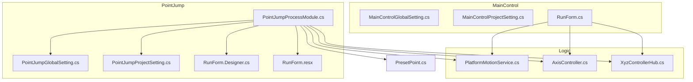
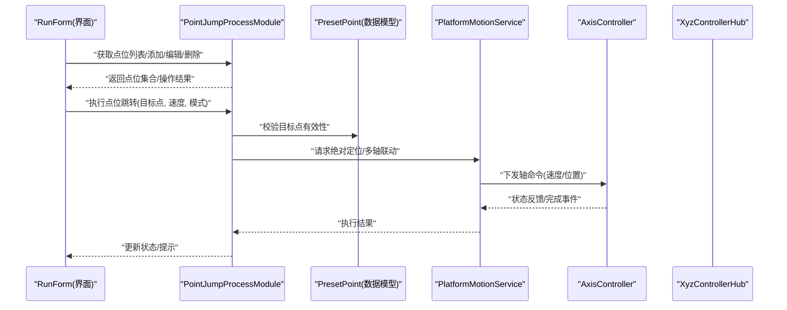
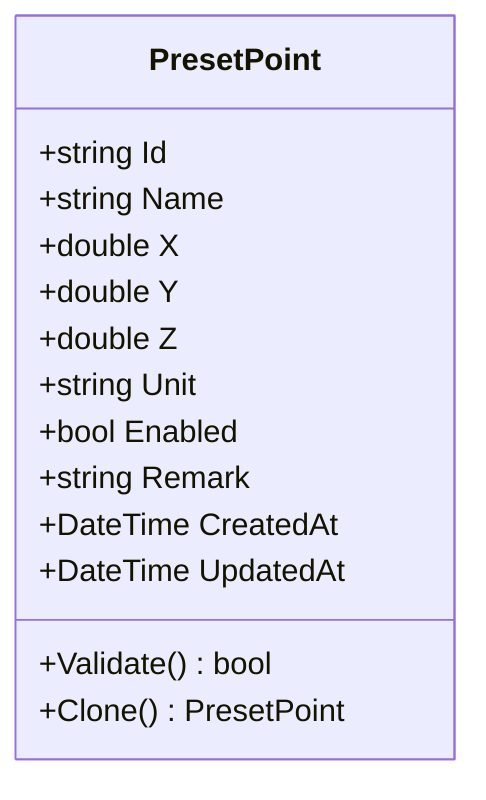
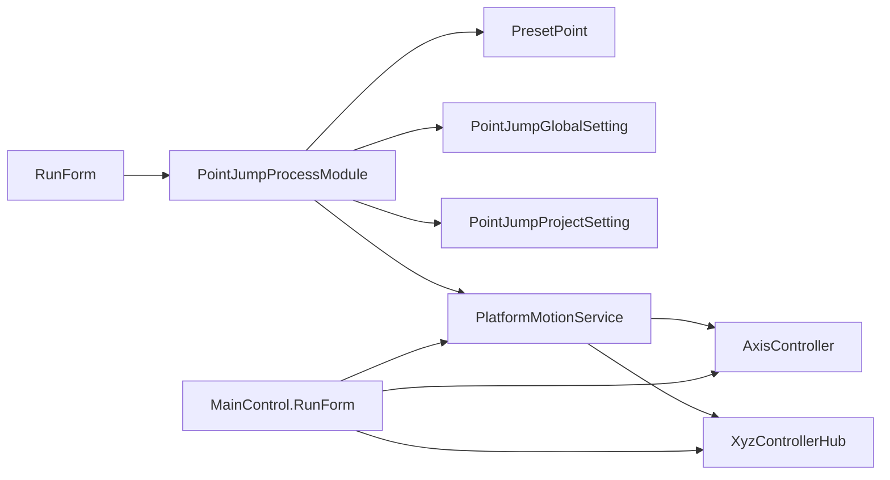

# 点位跳转模块 (PointJump)

<cite>
**本文引用的文件**   
- [PresetPoint.cs](file://PresetPoint.cs)
- [PointJump/PointJumpProcessModule.cs](file://PointJump/PointJumpProcessModule.cs)
- [PointJump/PointJumpGlobalSetting.cs](file://PointJump/PointJumpGlobalSetting.cs)
- [PointJump/PointJumpProjectSetting.cs](file://PointJump/PointJumpProjectSetting.cs)
- [PointJump/RunForm.Designer.cs](file://PointJump/RunForm.Designer.cs)
- [PointJump/RunForm.resx](file://PointJump/RunForm.resx)
- [MainControl/MainControlGlobalSetting.cs](file://MainControl/MainControlGlobalSetting.cs)
- [MainControl/MainControlProjectSetting.cs](file://MainControl/MainControlProjectSetting.cs)
- [MainControl/RunForm.cs](file://MainControl/RunForm.cs)
- [Logic/PlatformMotionService.cs](file://Logic/PlatformMotionService.cs)
- [Logic/AxisController.cs](file://Logic/AxisController.cs)
- [Logic/XyzControllerHub.cs](file://Logic/XyzControllerHub.cs)
- [PointJump/README.md](file://PointJump/README.md)
</cite>

## 目录
1. [简介](#简介)
2. [项目结构](#项目结构)
3. [核心组件](#核心组件)
4. [架构总览](#架构总览)
5. [详细组件分析](#详细组件分析)
6. [依赖关系分析](#依赖关系分析)
7. [性能考虑](#性能考虑)
8. [故障排查指南](#故障排查指南)
9. [结论](#结论)
10. [附录](#附录)

## 简介
本文件为“点位跳转模块（PointJump）”的完整技术文档，面向开发者与集成人员。内容涵盖：
- 点位管理的核心功能：预设点位的创建、编辑、删除与调用
- RunForm 界面的操作流程与用户交互方式
- PresetPoint 数据结构与点位存储机制
- 全局设置与项目设置的配置项说明
- 通过 API 进行点位跳转的代码示例路径
- 坐标系统、速度控制与路径规划要点
- 批量操作与程序化控制实现方法
- 与运动控制系统的集成与数据同步机制
- 调试技巧与常见问题解决方案

## 项目结构
PointJump 模块位于 PointJump 目录下，包含界面、逻辑与资源；同时根目录提供共享的数据模型（如 PresetPoint）。其他关键目录包括 MainControl（主运行界面）、Logic（运动控制抽象与服务）、以及各模块的独立设置类。

图表来源
- [PointJump/PointJumpProcessModule.cs](file://PointJump/PointJumpProcessModule.cs)
- [PointJump/PointJumpGlobalSetting.cs](file://PointJump/PointJumpGlobalSetting.cs)
- [PointJump/PointJumpProjectSetting.cs](file://PointJump/PointJumpProjectSetting.cs)
- [PointJump/RunForm.Designer.cs](file://PointJump/RunForm.Designer.cs)
- [PointJump/RunForm.resx](file://PointJump/RunForm.resx)
- [MainControl/MainControlGlobalSetting.cs](file://MainControl/MainControlGlobalSetting.cs)
- [MainControl/MainControlProjectSetting.cs](file://MainControl/MainControlProjectSetting.cs)
- [MainControl/RunForm.cs](file://MainControl/RunForm.cs)
- [Logic/PlatformMotionService.cs](file://Logic/PlatformMotionService.cs)
- [Logic/AxisController.cs](file://Logic/AxisController.cs)
- [Logic/XyzControllerHub.cs](file://Logic/XyzControllerHub.cs)
- [PresetPoint.cs](file://PresetPoint.cs)

章节来源
- [PointJump/README.md](file://PointJump/README.md)

## 核心组件
- 点位数据模型：PresetPoint 定义点位的标识、名称、坐标、单位、可选属性等，用于跨模块共享与持久化。
- 进程模块：PointJumpProcessModule 负责加载/保存项目设置、管理点位集合、暴露 API 供 UI 或外部调用。
- 设置类：PointJumpGlobalSetting、PointJumpProjectSetting 分别承载全局与项目级配置（如默认单位、坐标系、速度限制、安全参数等）。
- 界面：RunForm 提供点位的可视化列表、选择、编辑与执行入口。
- 运动服务：PlatformMotionService、AxisController、XyzControllerHub 封装底层硬件接口，提供绝对定位、速度/加速度、插补与状态同步能力。

章节来源
- [PresetPoint.cs](file://PresetPoint.cs)
- [PointJump/PointJumpProcessModule.cs](file://PointJump/PointJumpProcessModule.cs)
- [PointJump/PointJumpGlobalSetting.cs](file://PointJump/PointJumpGlobalSetting.cs)
- [PointJump/PointJumpProjectSetting.cs](file://PointJump/PointJumpProjectSetting.cs)
- [PointJump/RunForm.Designer.cs](file://PointJump/RunForm.Designer.cs)
- [Logic/PlatformMotionService.cs](file://Logic/PlatformMotionService.cs)
- [Logic/AxisController.cs](file://Logic/AxisController.cs)
- [Logic/XyzControllerHub.cs](file://Logic/XyzControllerHub.cs)

## 架构总览
PointJump 采用“UI-业务-运动服务”的分层架构：
- UI 层（RunForm）：展示点位列表、接收用户操作（新增/编辑/删除/执行），并调用 ProcessModule 提供的 API。
- 业务层（PointJumpProcessModule）：维护点位集合与项目设置，校验输入，协调运动服务完成跳转。
- 运动服务层（PlatformMotionService/AxisController/XyzControllerHub）：屏蔽硬件差异，统一坐标与速度语义，返回执行结果与状态。

图表来源
- [PointJump/RunForm.Designer.cs](file://PointJump/RunForm.Designer.cs)
- [PointJump/PointJumpProcessModule.cs](file://PointJump/PointJumpProcessModule.cs)
- [PresetPoint.cs](file://PresetPoint.cs)
- [Logic/PlatformMotionService.cs](file://Logic/PlatformMotionService.cs)
- [Logic/AxisController.cs](file://Logic/AxisController.cs)
- [Logic/XyzControllerHub.cs](file://Logic/XyzControllerHub.cs)

## 详细组件分析

### PresetPoint 数据模型与存储机制
- 字段与语义
  - 标识与名称：唯一 ID 与可读名称，便于管理与显示
  - 坐标值：X/Y/Z（可扩展更多轴），支持不同单位（mm/inch 等）
  - 附加属性：如是否启用、备注、优先级、触发条件等
  - 元数据：创建/更新时间戳、版本信息
- 存储机制
  - 内存集合：运行时由 ProcessModule 维护，保证线程安全访问
  - 项目持久化：随项目设置序列化到磁盘，启动时加载
  - 全局默认：从全局设置中读取默认单位、坐标系、速度上限等

图表来源
- [PresetPoint.cs](file://PresetPoint.cs)

章节来源
- [PresetPoint.cs](file://PresetPoint.cs)

### 进程模块 PointJumpProcessModule
- 职责
  - 管理 PresetPoint 集合：增删改查、排序、过滤
  - 加载/保存项目设置（含点位集合）
  - 对外暴露 API：按名称或索引跳转、批量跳转、查询状态
  - 与运动服务协作：将点位转换为运动命令，处理异常与回调
- 关键点
  - 线程安全：对集合与状态变更加锁或使用并发容器
  - 参数校验：坐标范围、速度限制、安全联锁
  - 事件通知：执行开始/完成/错误，驱动 UI 更新

章节来源
- [PointJump/PointJumpProcessModule.cs](file://PointJump/PointJumpProcessModule.cs)

### 运行界面 RunForm
- 功能
  - 点位列表展示、搜索与筛选
  - 新建/编辑/删除点位表单
  - 选择点位后点击“跳转”，可覆盖速度与模式
  - 实时显示执行状态与错误信息
- 交互流程
  - 用户编辑点位 -> 保存至内存集合 -> 写入项目设置
  - 用户选择点位 -> 调用 ProcessModule 执行 -> 订阅运动服务事件 -> 刷新 UI

章节来源
- [PointJump/RunForm.Designer.cs](file://PointJump/RunForm.Designer.cs)
- [PointJump/RunForm.resx](file://PointJump/RunForm.resx)

### 全局设置与项目设置
- 全局设置（PointJumpGlobalSetting / MainControlGlobalSetting）
  - 默认单位、坐标系原点、默认速度/加速度、安全限位、日志级别
- 项目设置（PointJumpProjectSetting / MainControlProjectSetting）
  - 点位集合、最近打开的项目路径、界面布局、快捷键映射

章节来源
- [PointJump/PointJumpGlobalSetting.cs](file://PointJump/PointJumpGlobalSetting.cs)
- [PointJump/PointJumpProjectSetting.cs](file://PointJump/PointJumpProjectSetting.cs)
- [MainControl/MainControlGlobalSetting.cs](file://MainControl/MainControlGlobalSetting.cs)
- [MainControl/MainControlProjectSetting.cs](file://MainControl/MainControlProjectSetting.cs)

### 运动系统集成与数据同步
- PlatformMotionService：统一运动指令（绝对定位、相对移动、插补），封装重试与超时
- AxisController：单轴控制（速度、位置、回零、使能/失能）
- XyzControllerHub：多轴协调，确保同步与顺序约束
- 数据同步
  - 运动状态事件回调（开始、到达、错误）
  - 周期性读取实际位置，与目标位置比对，驱动 UI 与业务逻辑

章节来源
- [Logic/PlatformMotionService.cs](file://Logic/PlatformMotionService.cs)
- [Logic/AxisController.cs](file://Logic/AxisController.cs)
- [Logic/XyzControllerHub.cs](file://Logic/XyzControllerHub.cs)

## 依赖关系分析
- 模块内依赖
  - RunForm 依赖 PointJumpProcessModule
  - PointJumpProcessModule 依赖 PresetPoint、PointJumpProjectSetting、PointJumpGlobalSetting
  - PointJumpProcessModule 依赖 PlatformMotionService、AxisController、XyzControllerHub
- 跨模块依赖
  - MainControl.RunForm 同样依赖 Logic 层运动服务，用于通用运行流程
- 潜在循环依赖
  - 通过事件与接口解耦，避免直接双向引用

图表来源
- [PointJump/RunForm.Designer.cs](file://PointJump/RunForm.Designer.cs)
- [PointJump/PointJumpProcessModule.cs](file://PointJump/PointJumpProcessModule.cs)
- [PresetPoint.cs](file://PresetPoint.cs)
- [PointJump/PointJumpGlobalSetting.cs](file://PointJump/PointJumpGlobalSetting.cs)
- [PointJump/PointJumpProjectSetting.cs](file://PointJump/PointJumpProjectSetting.cs)
- [Logic/PlatformMotionService.cs](file://Logic/PlatformMotionService.cs)
- [Logic/AxisController.cs](file://Logic/AxisController.cs)
- [Logic/XyzControllerHub.cs](file://Logic/XyzControllerHub.cs)
- [MainControl/RunForm.cs](file://MainControl/RunForm.cs)

章节来源
- [PointJump/PointJumpProcessModule.cs](file://PointJump/PointJumpProcessModule.cs)
- [Logic/PlatformMotionService.cs](file://Logic/PlatformMotionService.cs)

## 性能考虑
- 点位集合管理
  - 使用高效查找结构（字典/哈希表）提升按 ID/名称检索性能
  - 批量操作时使用事务式提交，减少频繁 IO
- 运动控制
  - 合理设置速度/加速度，避免频繁启停导致抖动
  - 异步执行与事件回调，避免阻塞 UI 线程
- 数据持久化
  - 增量保存与压缩，降低磁盘占用与 I/O 压力
- 线程安全
  - 读写分离与锁粒度最小化，避免死锁与长等待

[本节为通用指导，不直接分析具体文件]

## 故障排查指南
- 常见错误
  - 点位不存在或无效：检查 ID/名称、单位与坐标范围
  - 运动失败：查看轴状态、限位、使能、通信状态
  - 界面无响应：确认事件订阅与线程切换是否正确
- 调试技巧
  - 开启详细日志，记录命令下发与回调
  - 使用只读模式验证点位与路径，再切换到执行模式
  - 逐步缩小问题范围：先单轴测试，再多轴联动
- 恢复策略
  - 回退到上一个稳定项目设置
  - 重置轴状态与报警，重新回零

章节来源
- [PointJump/PointJumpProcessModule.cs](file://PointJump/PointJumpProcessModule.cs)
- [Logic/PlatformMotionService.cs](file://Logic/PlatformMotionService.cs)

## 结论
PointJump 模块以清晰的层次结构与稳定的运动服务抽象，实现了点位的可视化管理与可靠跳转。通过 PresetPoint 数据模型与完善的设置体系，既满足日常快速定位需求，也支持复杂场景下的批量与程序化控制。建议在生产环境中结合日志与监控，持续优化速度与路径参数，确保稳定性与效率。

[本节为总结性内容，不直接分析具体文件]

## 附录

### 坐标系统与单位
- 坐标系：通常采用右手直角坐标系，X/Y 平面为主工作面，Z 为法向
- 单位：毫米/英寸等，需在全局设置中统一，并在点位中记录单位
- 原点：机械零点与工件零点可配置，注意偏移补偿

章节来源
- [PointJump/PointJumpGlobalSetting.cs](file://PointJump/PointJumpGlobalSetting.cs)
- [PresetPoint.cs](file://PresetPoint.cs)

### 速度控制与路径规划
- 速度/加速度：根据负载与精度要求设定，避免过冲与振动
- 路径规划：直线插补优先，复杂轨迹分段处理
- 安全：限位、碰撞检测、急停与降级策略

章节来源
- [Logic/PlatformMotionService.cs](file://Logic/PlatformMotionService.cs)
- [Logic/AxisController.cs](file://Logic/AxisController.cs)
- [Logic/XyzControllerHub.cs](file://Logic/XyzControllerHub.cs)

### 批量操作与程序化控制
- 批量跳转：传入点位序列与统一参数，逐条执行并聚合结果
- 程序化控制：通过 ProcessModule API 在脚本或外部程序中调用
- 事务与回滚：失败时回滚已执行步骤，保持状态一致

章节来源
- [PointJump/PointJumpProcessModule.cs](file://PointJump/PointJumpProcessModule.cs)

### API 使用示例（路径指引）
- 初始化与加载设置
  - 参考：[PointJump/PointJumpProcessModule.cs](file://PointJump/PointJumpProcessModule.cs)
- 创建/编辑/删除点位
  - 参考：[PointJump/PointJumpProcessModule.cs](file://PointJump/PointJumpProcessModule.cs)
- 执行点位跳转（单点/批量）
  - 参考：[PointJump/PointJumpProcessModule.cs](file://PointJump/PointJumpProcessModule.cs)
- 查询状态与事件订阅
  - 参考：[Logic/PlatformMotionService.cs](file://Logic/PlatformMotionService.cs)

[本节为示例路径指引，不直接粘贴代码]

### 与 MainControl 的协同
- MainControl.RunForm 作为通用运行界面，复用 Logic 层运动服务
- PointJump 的 RunForm 专注点位管理，两者可通过共享设置与事件互通

章节来源
- [MainControl/RunForm.cs](file://MainControl/RunForm.cs)
- [PointJump/RunForm.Designer.cs](file://PointJump/RunForm.Designer.cs)