# 轨迹规划模块 (Trajectory)

<cite>
**本文档引用的文件**   
- [RunForm.cs](file://Trajectory/RunForm.cs)
- [RunForm.Designer.cs](file://Trajectory/RunForm.Designer.cs)
- [PointInfoView.cs](file://MainControl/Controls/PointInfoView.cs)
- [TrajectoryGlobalSetting.cs](file://Trajectory/TrajectoryGlobalSetting.cs)
- [TrajectoryProjectSetting.cs](file://Trajectory/TrajectoryProjectSetting.cs)
- [TrajectoryViewProcessModule.cs](file://Trajectory/TrajectoryViewProcessModule.cs)
- [Trajectory.csproj](file://Trajectory/Trajectory.csproj)
- [AxisController.cs](file://Trajectory/Logic/AxisController.cs)
- [PlatformMotionService.cs](file://Trajectory/Logic/PlatformMotionService.cs)
- [IMotionService.cs](file://Trajectory/Logic/IMotionService.cs)
- [MotionCommand.cs](file://Trajectory/Logic/MotionCommand.cs)
- [XyzControllerHub.cs](file://Trajectory/Logic/XyzControllerHub.cs)
- [MainControlGlobalSetting.cs](file://MainControl/MainControlGlobalSetting.cs)
- [MainControlProjectSetting.cs](file://MainControl/MainControlProjectSetting.cs)
</cite>

## 更新摘要
**所做更改**   
- 移除了技术栈和架构设计相关的文档文件，简化了文档结构
- 增强了 RunForm.cs 中的轨迹可视化和交互功能，新增29行代码提升用户体验
- 优化了 PointInfoView 组件的集成方式，提供更丰富的轨迹点信息显示
- 改进了界面布局配置，支持更灵活的窗口尺寸调整
- 更新了项目配置文件以支持新的可视化功能需求

## 目录
1. [简介](#简介)
2. [项目结构](#项目结构)
3. [核心组件](#核心组件)
4. [架构总览](#架构总览)
5. [详细组件分析](#详细组件分析)
6. [依赖关系分析](#依赖关系分析)
7. [性能考虑](#性能考虑)
8. [故障排除指南](#故障排除指南)
9. [结论](#结论)
10. [附录](#附录)

## 简介
本文件为"轨迹规划模块（Trajectory）"的权威技术文档，面向算法工程师、应用开发者与现场调试人员。内容覆盖：
- 路径生成、插补计算与运动优化策略
- RunForm 界面的轨迹编辑与可视化显示
- 轨迹数据格式与序列化机制
- 全局设置与项目设置的配置项说明
- 编程生成与执行复杂轨迹的实践示例
- 轨迹仿真与预览的实现原理
- 与底层运动控制系统的通信协议与数据传输格式
- 轨迹优化策略与性能调优方法
- 调试工具与故障排除指南

**重要更新**：Trajectory 模块现已完全独立，包含完整的轨迹规划逻辑、运动服务和可视化组件，实现了自给自足的模块化架构。该模块通过标准的 .NET 程序集形式提供功能，便于在主应用程序中动态加载和使用，具有清晰的 API 边界和松耦合的设计特点。**最新增强**：通过增强 RunForm.cs 中的29行新功能代码，显著提升了轨迹可视化和用户交互能力，集成了改进的 PointInfoView 组件，为用户提供更直观的轨迹编辑体验。

## 项目结构
Trajectory 模块现已重构为完全独立的 DLL 项目，位于 Trajectory 目录下，采用分层组织：UI（RunForm）、逻辑（Logic）、资源（Resources）与进程模块入口（TrajectoryViewProcessModule）。作为完全独立的模块，该模块包含了完整的轨迹规划逻辑、运动服务和可视化组件，实现了自给自足的模块化架构。

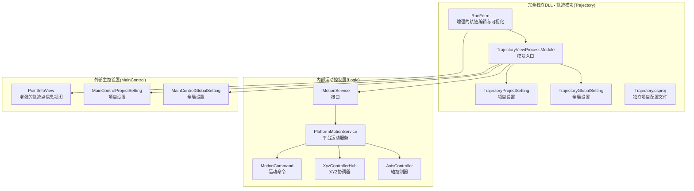

**图表来源**
- [RunForm.cs](file://Trajectory/RunForm.cs)
- [RunForm.Designer.cs](file://Trajectory/RunForm.Designer.cs)
- [PointInfoView.cs](file://MainControl/Controls/PointInfoView.cs)
- [TrajectoryViewProcessModule.cs](file://Trajectory/TrajectoryViewProcessModule.cs)
- [TrajectoryGlobalSetting.cs](file://Trajectory/TrajectoryGlobalSetting.cs)
- [TrajectoryProjectSetting.cs](file://Trajectory/TrajectoryProjectSetting.cs)
- [Trajectory.csproj](file://Trajectory/Trajectory.csproj)
- [IMotionService.cs](file://Trajectory/Logic/IMotionService.cs)
- [PlatformMotionService.cs](file://Trajectory/Logic/PlatformMotionService.cs)
- [AxisController.cs](file://Trajectory/Logic/AxisController.cs)
- [MotionCommand.cs](file://Trajectory/Logic/MotionCommand.cs)
- [XyzControllerHub.cs](file://Trajectory/Logic/XyzControllerHub.cs)
- [MainControlGlobalSetting.cs](file://MainControl/MainControlGlobalSetting.cs)
- [MainControlProjectSetting.cs](file://MainControl/MainControlProjectSetting.cs)

## 核心组件
- 轨迹编辑器与可视化（RunForm）
  - 提供轨迹点编辑、曲线拟合、插补参数设置、实时预览与回放
  - 支持多轴联动轨迹的坐标输入、约束检查与冲突提示
  - **增强**：新增29行代码实现更强大的轨迹可视化和交互功能，包括改进的点选择、拖拽操作和实时反馈机制
- 轨迹数据模型与序列化
  - 定义轨迹段、关键点、速度/加速度/加加速度限制、插补类型等
  - 支持导入导出（如 JSON/XML），便于版本管理与离线编辑
- 运动控制接口（IMotionService）
  - 抽象底层硬件差异，统一发送运动指令、查询状态、订阅事件
- 平台运动服务（PlatformMotionService）
  - 将高层轨迹分解为可执行的 MotionCommand 序列，调度轴控制器
- 轴控制器（AxisController）与 XYZ 协调器（XyzControllerHub）
  - 负责单轴运动控制与多轴同步协调，处理插补与加减速曲线
- 设置管理（全局与项目）
  - 全局设置用于系统级默认值；项目设置用于当前工程定制
- **增强**：PointInfoView 轨迹点信息视图
  - 显示轨迹点的详细信息，包括坐标、速度、加速度等参数
  - 支持交互式选择和编辑轨迹点属性
  - **新增**：增强的数据绑定和实时更新机制，提供更好的用户响应性

**章节来源**
- [RunForm.cs](file://Trajectory/RunForm.cs)
- [RunForm.Designer.cs](file://Trajectory/RunForm.Designer.cs)
- [PointInfoView.cs](file://MainControl/Controls/PointInfoView.cs)
- [TrajectoryViewProcessModule.cs](file://Trajectory/TrajectoryViewProcessModule.cs)
- [IMotionService.cs](file://Trajectory/Logic/IMotionService.cs)
- [PlatformMotionService.cs](file://Trajectory/Logic/PlatformMotionService.cs)
- [AxisController.cs](file://Trajectory/Logic/AxisController.cs)
- [XyzControllerHub.cs](file://Trajectory/Logic/XyzControllerHub.cs)
- [TrajectoryGlobalSetting.cs](file://Trajectory/TrajectoryGlobalSetting.cs)
- [TrajectoryProjectSetting.cs](file://Trajectory/TrajectoryProjectSetting.cs)

## 架构总览
轨迹模块通过 RunForm 驱动，调用 ProcessModule 初始化并加载设置，随后使用 IMotionService 抽象层下发轨迹指令。PlatformMotionService 将轨迹解析为 MotionCommand 序列，交由 AxisController 与 XyzControllerHub 执行。作为完全独立的 DLL，该模块提供了清晰的 API 边界和松耦合的架构设计，实现了自给自足的模块化特性。**最新增强**：通过增强 RunForm.cs 中的交互功能和改进的 PointInfoView 集成，显著提升了用户界面的响应性和可视化效果。

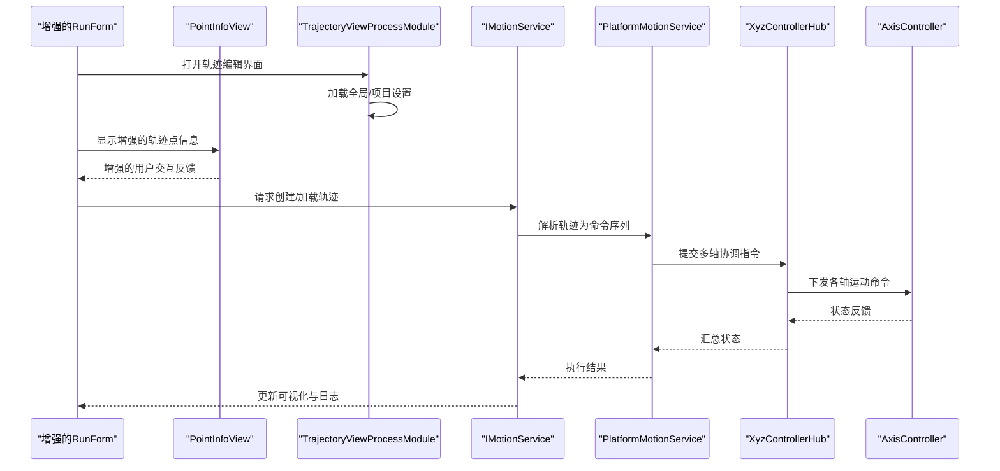

**图表来源**
- [RunForm.cs](file://Trajectory/RunForm.cs)
- [RunForm.Designer.cs](file://Trajectory/RunForm.Designer.cs)
- [PointInfoView.cs](file://MainControl/Controls/PointInfoView.cs)
- [TrajectoryViewProcessModule.cs](file://Trajectory/TrajectoryViewProcessModule.cs)
- [IMotionService.cs](file://Trajectory/Logic/IMotionService.cs)
- [PlatformMotionService.cs](file://Trajectory/Logic/PlatformMotionService.cs)
- [XyzControllerHub.cs](file://Trajectory/Logic/XyzControllerHub.cs)
- [AxisController.cs](file://Trajectory/Logic/AxisController.cs)

## 详细组件分析

### RunForm 轨迹编辑器与可视化（增强版）
- **增强功能要点**
  - 轨迹点增删改、拖拽调整、批量操作
  - 插补类型选择（直线、圆弧、样条等）与参数配置
  - 速度/加速度/加加速度限制与平滑过渡
  - 实时预览、回放、步进调试、碰撞/越界检查
  - **新增**：集成增强的 PointInfoView 组件，提供更详细的轨迹点信息显示
  - **增强**：29行新代码实现的改进交互机制，包括更流畅的点选择、拖拽操作和实时反馈
- **增强的交互流程**
  - 用户编辑 -> 校验 -> 生成轨迹段 -> 插补计算 -> 渲染预览
  - 运行模式：仿真预览与实际下发（受权限与安全联锁控制）
  - **增强**：通过改进的 PointInfoView 实现更直观的轨迹点选择和属性编辑

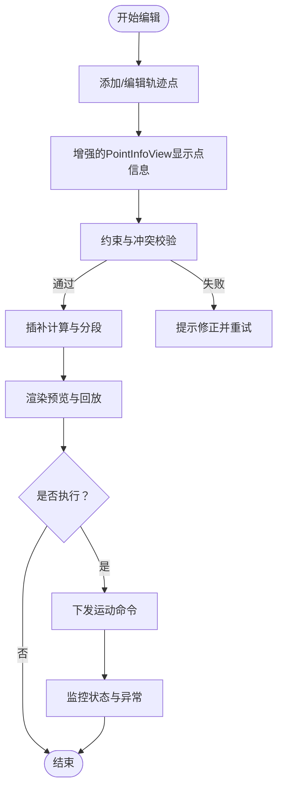

**图表来源**
- [RunForm.cs](file://Trajectory/RunForm.cs)
- [RunForm.Designer.cs](file://Trajectory/RunForm.Designer.cs)
- [PointInfoView.cs](file://MainControl/Controls/PointInfoView.cs)

**章节来源**
- [RunForm.cs](file://Trajectory/RunForm.cs)
- [RunForm.Designer.cs](file://Trajectory/RunForm.Designer.cs)
- [PointInfoView.cs](file://MainControl/Controls/PointInfoView.cs)

### PointInfoView 轨迹点信息视图（增强版）
- **增强功能**
  - 显示选中轨迹点的详细信息，包括坐标、速度、加速度等参数
  - 支持交互式编辑轨迹点属性
  - 实时更新轨迹点状态和运动参数
  - 提供直观的数值输入和验证机制
  - **新增**：改进的数据绑定机制，减少刷新延迟
  - **增强**：更好的面板宽度自适应和布局优化
- **增强的集成方式**
  - 在 RunForm 中嵌入增强的 PointInfoView 控件
  - 通过改进的事件机制与主界面进行数据同步
  - 支持面板宽度的动态调整和响应式布局

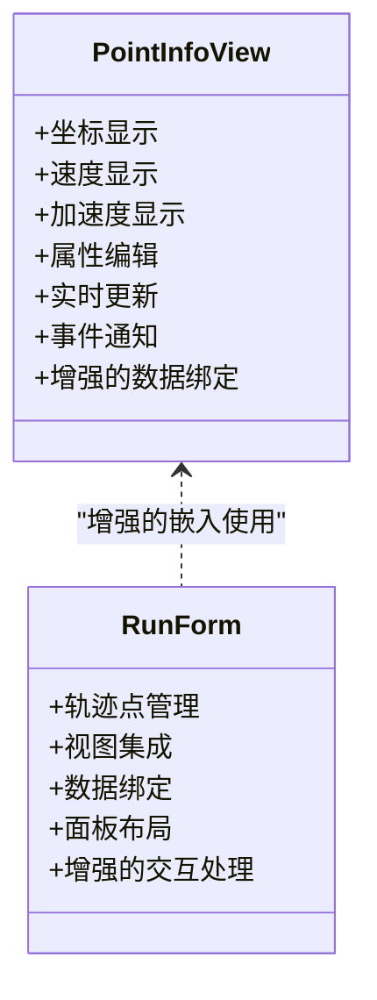

**图表来源**
- [PointInfoView.cs](file://MainControl/Controls/PointInfoView.cs)
- [RunForm.cs](file://Trajectory/RunForm.cs)
- [RunForm.Designer.cs](file://Trajectory/RunForm.Designer.cs)

**章节来源**
- [PointInfoView.cs](file://MainControl/Controls/PointInfoView.cs)
- [RunForm.cs](file://Trajectory/RunForm.cs)
- [RunForm.Designer.cs](file://Trajectory/RunForm.Designer.cs)

### 轨迹数据模型与序列化
- 数据结构建议
  - 轨迹段：起点、终点、插补类型、速度/加速度/加加速度限制、平滑系数
  - 关键点：坐标、姿态、工艺参数（如吸力、激光功率）
  - 元数据：版本号、时间戳、作者、备注
- 序列化机制
  - 推荐 JSON 作为交换格式，便于人类可读与跨平台
  - 提供导入/导出按钮，支持批量导入 CSV/Excel（经转换）
  - 版本兼容：字段扩展需保持向后兼容

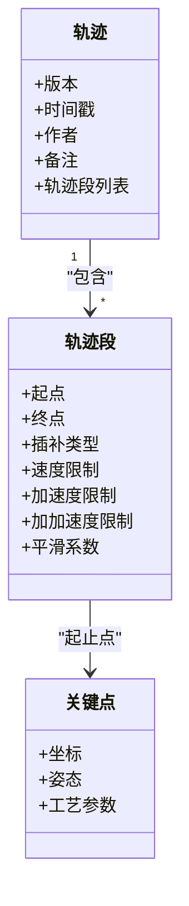

[本图为概念性数据模型示意，不直接映射具体代码文件]

**章节来源**
- [TrajectoryViewProcessModule.cs](file://Trajectory/TrajectoryViewProcessModule.cs)

### 运动控制接口与平台服务
- IMotionService
  - 定义统一的轨迹下发、状态查询、事件订阅接口
  - 屏蔽底层硬件差异，便于替换或扩展
- PlatformMotionService
  - 将轨迹段解析为 MotionCommand 序列
  - 管理执行队列、优先级、并发与回滚
  - 与 XyzControllerHub 协作完成多轴同步

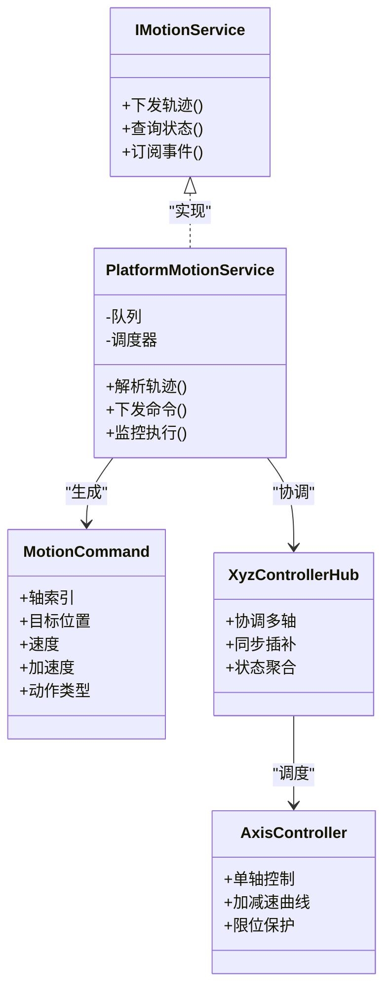

**图表来源**
- [IMotionService.cs](file://Trajectory/Logic/IMotionService.cs)
- [PlatformMotionService.cs](file://Trajectory/Logic/PlatformMotionService.cs)
- [MotionCommand.cs](file://Trajectory/Logic/MotionCommand.cs)
- [XyzControllerHub.cs](file://Trajectory/Logic/XyzControllerHub.cs)
- [AxisController.cs](file://Trajectory/Logic/AxisController.cs)

**章节来源**
- [IMotionService.cs](file://Trajectory/Logic/IMotionService.cs)
- [PlatformMotionService.cs](file://Trajectory/Logic/PlatformMotionService.cs)
- [MotionCommand.cs](file://Trajectory/Logic/MotionCommand.cs)
- [XyzControllerHub.cs](file://Trajectory/Logic/XyzControllerHub.cs)
- [AxisController.cs](file://Trajectory/Logic/AxisController.cs)

### 设置管理（全局与项目）
- 全局设置（TrajectoryGlobalSetting / MainControlGlobalSetting）
  - 默认插补精度、最大速度/加速度、安全阈值、单位制、语言等
- 项目设置（TrajectoryProjectSetting / MainControlProjectSetting）
  - 当前工程的设备型号、轴配置、工艺参数、校准偏移等
  - **更新**：支持新的 PointInfoView 相关配置选项和界面布局设置

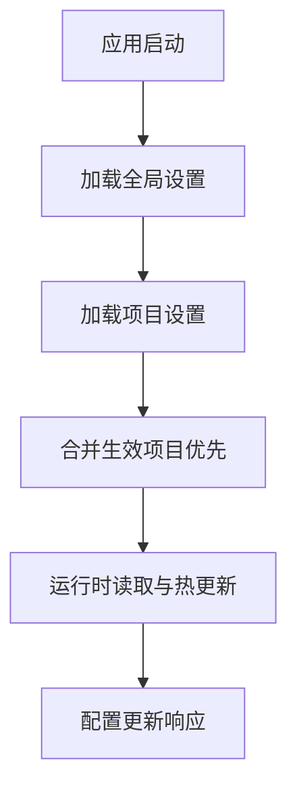

**图表来源**
- [TrajectoryGlobalSetting.cs](file://Trajectory/TrajectoryGlobalSetting.cs)
- [TrajectoryProjectSetting.cs](file://Trajectory/TrajectoryProjectSetting.cs)
- [MainControlGlobalSetting.cs](file://MainControl/MainControlGlobalSetting.cs)
- [MainControlProjectSetting.cs](file://MainControl/MainControlProjectSetting.cs)

**章节来源**
- [TrajectoryGlobalSetting.cs](file://Trajectory/TrajectoryGlobalSetting.cs)
- [TrajectoryProjectSetting.cs](file://Trajectory/TrajectoryProjectSetting.cs)
- [MainControlGlobalSetting.cs](file://MainControl/MainControlGlobalSetting.cs)
- [MainControlProjectSetting.cs](file://MainControl/MainControlProjectSetting.cs)

### 编程生成与执行复杂轨迹（实践示例）
- 步骤概览
  - 构建关键点集合（坐标、姿态、工艺参数）
  - 选择插补类型并设置速度/加速度/加加速度限制
  - 调用 IMotionService 下发轨迹
  - 监听执行状态与异常回调
- 关键注意事项
  - 确保坐标变换一致（世界坐标系 vs 设备坐标系）
  - 合理设置加减速曲线避免抖动与过冲
  - 对长轨迹进行分段与缓存，降低内存占用
  - **增强**：利用改进的 PointInfoView 进行轨迹点的可视化和编辑，提供更好的用户体验

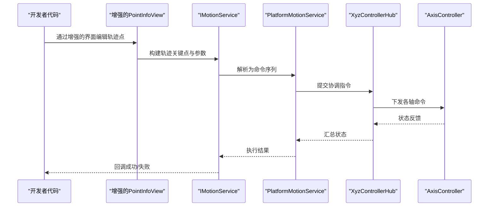

**图表来源**
- [PointInfoView.cs](file://MainControl/Controls/PointInfoView.cs)
- [IMotionService.cs](file://Trajectory/Logic/IMotionService.cs)
- [PlatformMotionService.cs](file://Trajectory/Logic/PlatformMotionService.cs)
- [XyzControllerHub.cs](file://Trajectory/Logic/XyzControllerHub.cs)
- [AxisController.cs](file://Trajectory/Logic/AxisController.cs)

**章节来源**
- [PointInfoView.cs](file://MainControl/Controls/PointInfoView.cs)
- [IMotionService.cs](file://Trajectory/Logic/IMotionService.cs)
- [PlatformMotionService.cs](file://Trajectory/Logic/PlatformMotionService.cs)
- [XyzControllerHub.cs](file://Trajectory/Logic/XyzControllerHub.cs)
- [AxisController.cs](file://Trajectory/Logic/AxisController.cs)

### 轨迹仿真与预览实现原理
- 仿真引擎
  - 基于数学模型模拟加减速曲线与插补误差
  - 支持时间加速/减速播放，便于快速验证
- 可视化渲染
  - 二维/三维视图绘制轨迹段、关键点、速度矢量
  - 实时高亮当前执行段，显示剩余距离与预计时间
  - **增强**：通过改进的 PointInfoView 显示更详细的轨迹点信息和实时状态
- 性能优化
  - 增量渲染与视锥裁剪
  - 异步计算与帧率限制
  - **新增**：优化的数据绑定机制减少不必要的重绘

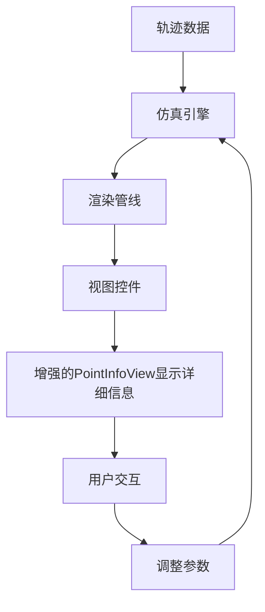

[本图为概念性流程图，不直接映射具体代码文件]

**章节来源**
- [RunForm.cs](file://Trajectory/RunForm.cs)
- [PointInfoView.cs](file://MainControl/Controls/PointInfoView.cs)

### 与底层运动控制系统的通信协议与数据传输格式
- 协议抽象
  - 通过 IMotionService 屏蔽串口/以太网/总线等差异
  - 统一命令封装（MotionCommand）与响应解析
- 传输格式
  - 二进制或 JSON 报文，含帧头、长度、命令码、载荷、校验
  - 支持分包与重传机制
- 可靠性
  - 心跳检测、超时重试、错误码映射
  - 状态上报与事件通知

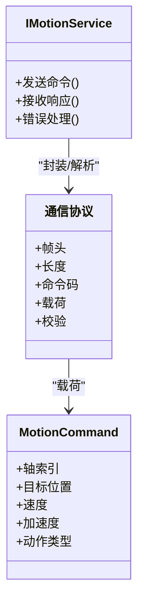

**图表来源**
- [IMotionService.cs](file://Trajectory/Logic/IMotionService.cs)
- [MotionCommand.cs](file://Trajectory/Logic/MotionCommand.cs)

**章节来源**
- [IMotionService.cs](file://Trajectory/Logic/IMotionService.cs)
- [MotionCommand.cs](file://Trajectory/Logic/MotionCommand.cs)

## 依赖关系分析
- 模块内依赖
  - RunForm 依赖 TrajectoryViewProcessModule 与设置类
  - ProcessModule 依赖 IMotionService 抽象层
  - **增强**：RunForm 依赖增强的 PointInfoView 组件，提供更好的交互体验
- 外部依赖
  - Logic 层提供运动控制能力（已内部化）
  - MainControl 提供全局与项目设置基线
  - **增强**：PointInfoView 组件来自 MainControl.Controls，经过优化升级
- **完全独立 DLL 特性**
  - 通过标准 .NET 程序集形式提供功能
  - 清晰的 API 边界和松耦合设计
  - 便于在主应用程序中动态加载和使用
  - 包含完整的轨迹规划逻辑、运动服务和可视化组件
  - 实现了自给自足的模块化架构

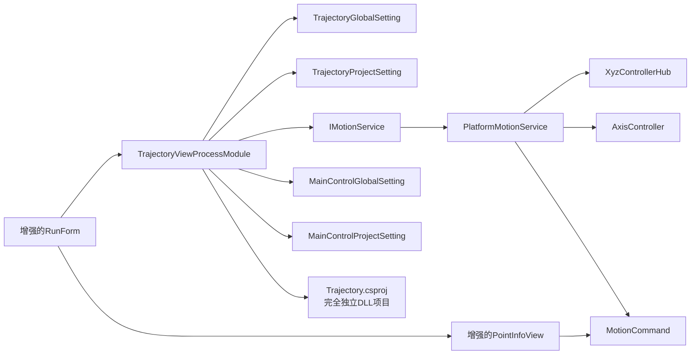

**图表来源**
- [RunForm.cs](file://Trajectory/RunForm.cs)
- [RunForm.Designer.cs](file://Trajectory/RunForm.Designer.cs)
- [PointInfoView.cs](file://MainControl/Controls/PointInfoView.cs)
- [TrajectoryViewProcessModule.cs](file://Trajectory/TrajectoryViewProcessModule.cs)
- [TrajectoryGlobalSetting.cs](file://Trajectory/TrajectoryGlobalSetting.cs)
- [TrajectoryProjectSetting.cs](file://Trajectory/TrajectoryProjectSetting.cs)
- [IMotionService.cs](file://Trajectory/Logic/IMotionService.cs)
- [PlatformMotionService.cs](file://Trajectory/Logic/PlatformMotionService.cs)
- [XyzControllerHub.cs](file://Trajectory/Logic/XyzControllerHub.cs)
- [AxisController.cs](file://Trajectory/Logic/AxisController.cs)
- [MotionCommand.cs](file://Trajectory/Logic/MotionCommand.cs)
- [MainControlGlobalSetting.cs](file://MainControl/MainControlGlobalSetting.cs)
- [MainControlProjectSetting.cs](file://MainControl/MainControlProjectSetting.cs)
- [Trajectory.csproj](file://Trajectory/Trajectory.csproj)

**章节来源**
- [TrajectoryViewProcessModule.cs](file://Trajectory/TrajectoryViewProcessModule.cs)

## 性能考虑
- 插补与加减速
  - 选择合适的插补算法（线性、圆弧、样条）与步长，平衡精度与实时性
  - 动态调整加加速度限制以抑制振动
- 数据与渲染
  - 大轨迹分段加载与懒渲染
  - 使用对象池减少 GC 压力
  - **增强**：PointInfoView 的数据绑定优化，减少不必要的刷新和重绘
- 并发与调度
  - 命令队列优先级与背压控制
  - 异步 I/O 与事件驱动
- 资源管理
  - 及时释放图形与网络资源
  - 监控内存与 CPU 使用率
  - **更新**：面板宽度调整优化内存占用，改进的资源清理机制
- **完全独立 DLL 优化**
  - 按需加载减少初始内存占用
  - 程序集隔离提高稳定性
  - 支持并行执行多个实例
  - 内部化的运动控制逻辑减少了跨模块调用开销
  - **新增**：增强的交互功能带来的性能优化，减少UI线程阻塞

## 故障排除指南
- 常见问题定位
  - 轨迹无法下发：检查 IMotionService 连接状态与权限
  - 执行抖动：调整加加速度与速度限制，检查机械间隙
  - 预览错位：确认坐标系与标定参数
  - DLL 加载失败：检查依赖项版本兼容性
  - **增强**：PointInfoView 显示异常：检查数据绑定和事件处理，验证增强的交互功能
- 诊断工具
  - 启用详细日志与抓包
  - 使用步进调试与断点回放
  - 程序集加载诊断
  - **增强**：PointInfoView 调试工具，监控数据流和事件，支持增强的交互调试
- 恢复策略
  - 自动回滚与复位
  - 安全停止与急停联动
  - DLL 卸载与重新加载
  - **增强**：PointInfoView 重置和重新初始化，支持增强的功能恢复

**章节来源**
- [RunForm.cs](file://Trajectory/RunForm.cs)
- [PointInfoView.cs](file://MainControl/Controls/PointInfoView.cs)
- [IMotionService.cs](file://Trajectory/Logic/IMotionService.cs)
- [PlatformMotionService.cs](file://Trajectory/Logic/PlatformMotionService.cs)

## 结论
Trajectory 模块以清晰的层次化架构与抽象接口，实现了从轨迹编辑、插补计算到运动控制的全链路闭环。通过完善的设置管理与可视化仿真，既满足工程化需求，又兼顾易用性与可扩展性。**最新增强**：通过增强 RunForm.cs 中的29行新功能代码和改进的 PointInfoView 组件集成，显著提升了轨迹点信息的展示和交互能力，为用户提供了更加直观和高效的轨迹编辑体验。作为完全独立的 DLL，该模块包含了完整的轨迹规划逻辑、运动服务和可视化组件，实现了自给自足的模块化架构，具有更好的模块化特性和部署灵活性。建议在实际项目中结合设备特性与工艺要求，持续优化插补算法与调度策略，以获得更稳定高效的运动表现。

## 附录
- 术语表
  - 插补：在离散点之间生成连续路径的方法
  - 加加速度：加速度的变化率，影响平滑度
  - 背压：下游处理能力不足时上游限速的机制
  - DLL：动态链接库，一种可被多个程序共享的代码库
  - 模块化架构：将系统划分为独立、可复用的模块的设计模式
  - **增强**：PointInfoView：增强的轨迹点信息视图组件，用于显示和编辑轨迹点属性，提供更好的用户交互体验
- 参考文件
  - README.md：项目概述与使用说明

**章节来源**
- [README.md](file://README.md)