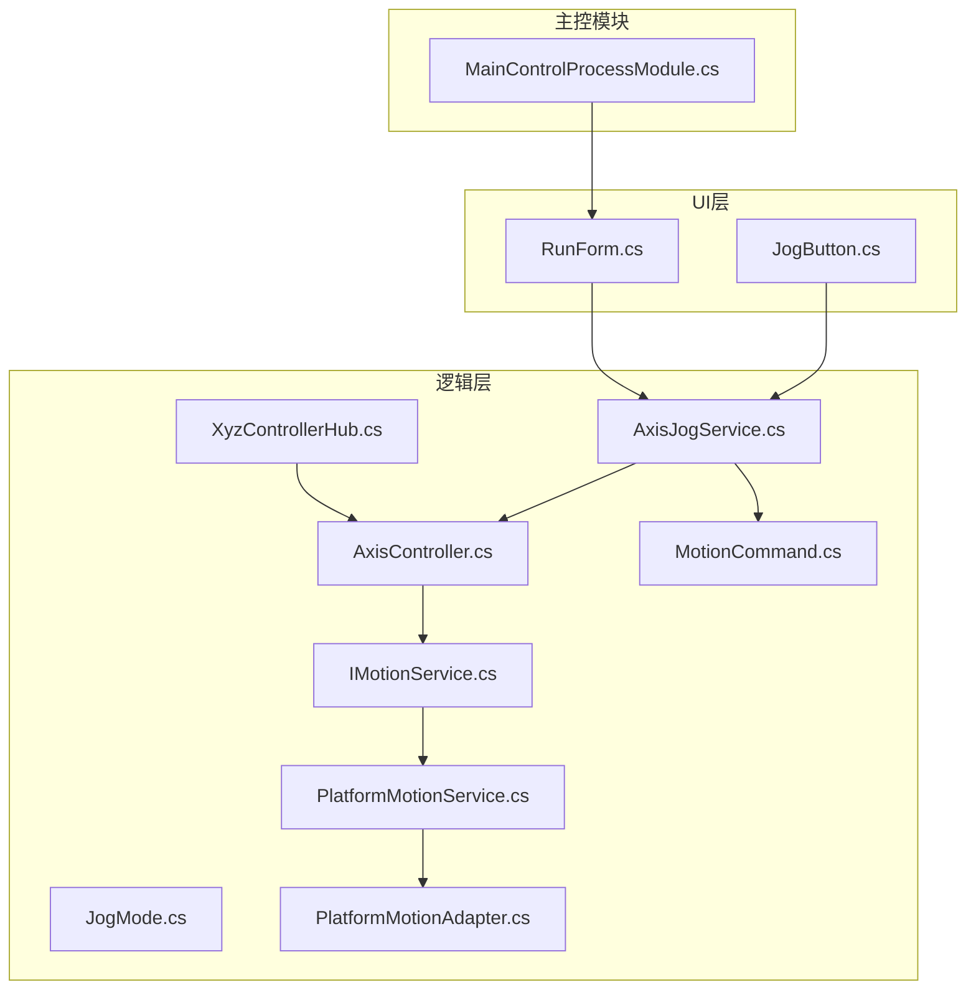
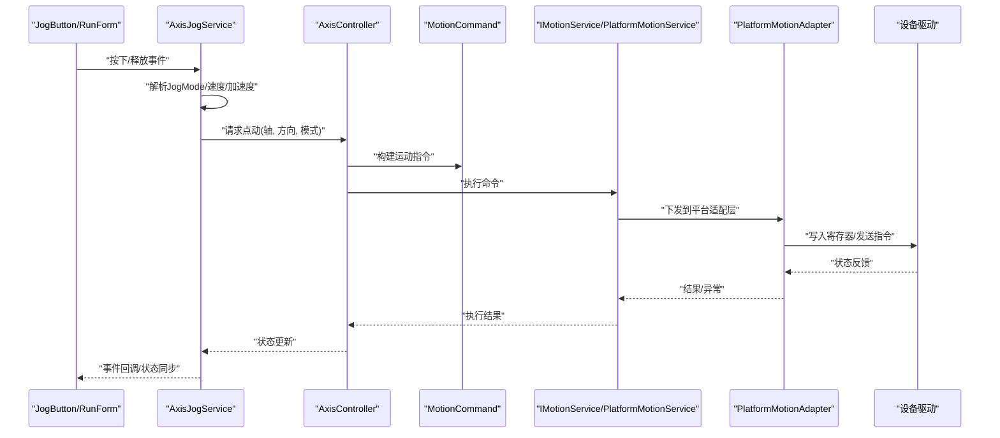
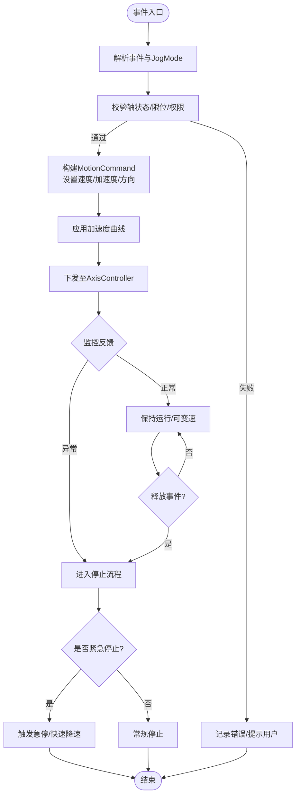
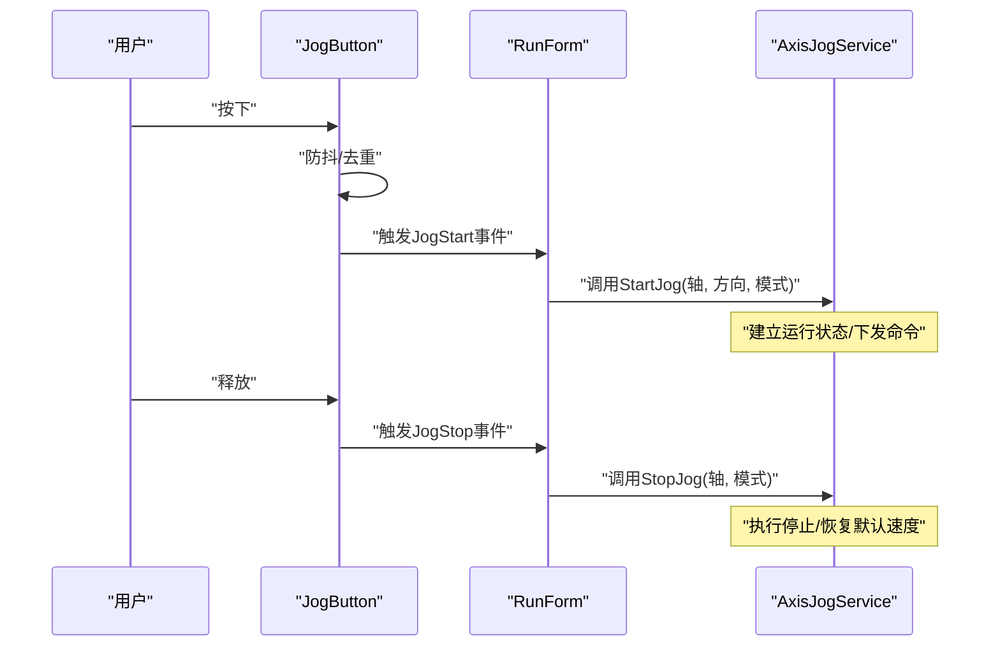
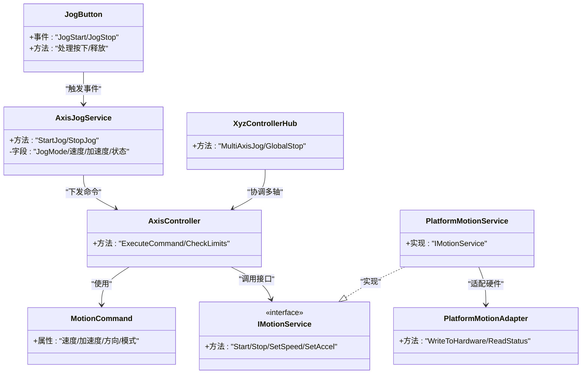

# Jog点动控制系统

<cite>
**本文引用的文件**   
- [AxisJogService.cs](file://Logic/AxisJogService.cs)
- [JogMode.cs](file://Logic/JogMode.cs)
- [JogButton.cs](file://Controls/JogButton.cs)
- [AxisController.cs](file://Logic/AxisController.cs)
- [MotionCommand.cs](file://Logic/MotionCommand.cs)
- [IMotionService.cs](file://Logic/IMotionService.cs)
- [PlatformMotionAdapter.cs](file://Logic/PlatformMotionAdapter.cs)
- [PlatformMotionService.cs](file://Logic/PlatformMotionService.cs)
- [XyzControllerHub.cs](file://Logic/XyzControllerHub.cs)
- [MainControlProcessModule.cs](file://MainControl/MainControlProcessModule.cs)
- [RunForm.cs](file://MainControl/RunForm.cs)
</cite>

## 目录
1. [简介](#简介)
2. [项目结构](#项目结构)
3. [核心组件](#核心组件)
4. [架构总览](#架构总览)
5. [详细组件分析](#详细组件分析)
6. [依赖关系分析](#依赖关系分析)
7. [性能考虑](#性能考虑)
8. [故障排查指南](#故障排查指南)
9. [结论](#结论)
10. [附录](#附录)

## 简介
本技术文档围绕 AxisJogService 点动控制系统展开，系统用于在 UI 中通过按钮或输入事件驱动轴进行点动（Jog）运动。文档涵盖：
- 点动控制实现原理与数据流
- JogMode 枚举模式及其行为差异
- 速度调节、加速度控制与停止机制
- 点动按钮的事件处理与状态管理
- 安全保护与紧急停止
- UI 集成示例与用户输入/设备响应处理
- 配置选项与性能优化建议

## 项目结构
本项目采用分层组织方式：
- Controls：UI 控件层，包含 JogButton 等交互控件
- Logic：业务逻辑与运动控制层，包含 AxisJogService、JogMode、AxisController、平台适配器等
- MainControl：主界面与控制模块，包含 RunForm、MainControlProcessModule 等

图表来源
- [JogButton.cs](file://Controls/JogButton.cs)
- [RunForm.cs](file://MainControl/RunForm.cs)
- [AxisJogService.cs](file://Logic/AxisJogService.cs)
- [JogMode.cs](file://Logic/JogMode.cs)
- [AxisController.cs](file://Logic/AxisController.cs)
- [MotionCommand.cs](file://Logic/MotionCommand.cs)
- [IMotionService.cs](file://Logic/IMotionService.cs)
- [PlatformMotionAdapter.cs](file://Logic/PlatformMotionAdapter.cs)
- [PlatformMotionService.cs](file://Logic/PlatformMotionService.cs)
- [XyzControllerHub.cs](file://Logic/XyzControllerHub.cs)
- [MainControlProcessModule.cs](file://MainControl/MainControlProcessModule.cs)

章节来源
- [JogButton.cs](file://Controls/JogButton.cs)
- [AxisJogService.cs](file://Logic/AxisJogService.cs)
- [JogMode.cs](file://Logic/JogMode.cs)
- [AxisController.cs](file://Logic/AxisController.cs)
- [MotionCommand.cs](file://Logic/MotionCommand.cs)
- [IMotionService.cs](file://Logic/IMotionService.cs)
- [PlatformMotionAdapter.cs](file://Logic/PlatformMotionAdapter.cs)
- [PlatformMotionService.cs](file://Logic/PlatformMotionService.cs)
- [XyzControllerHub.cs](file://Logic/XyzControllerHub.cs)
- [MainControlProcessModule.cs](file://MainControl/MainControlProcessModule.cs)
- [RunForm.cs](file://MainControl/RunForm.cs)

## 核心组件
- AxisJogService：点动服务，负责接收 UI 事件、维护 Jog 状态、计算速度与加速度、下发运动命令并处理停止与异常。
- JogMode：定义点动模式（如连续点动、步进点动、回零点动等），不同模式影响启动、持续、停止策略。
- JogButton：UI 点动按钮控件，封装按下/释放事件、防抖与长按逻辑，向上抛出 Jog 事件。
- AxisController：轴控制器，协调多轴点动、限位检查、命令分发与状态同步。
- MotionCommand：运动指令对象，封装目标速度、加速度、方向、模式等参数。
- IMotionService / PlatformMotionService / PlatformMotionAdapter：运动服务接口与平台适配层，屏蔽底层硬件差异。
- XyzControllerHub：XYZ 轴控制器枢纽，统一管理与 XYZ 轴的联动与冲突处理。
- MainControlProcessModule / RunForm：主控流程与运行表单，承载 UI 布局与事件绑定。

章节来源
- [AxisJogService.cs](file://Logic/AxisJogService.cs)
- [JogMode.cs](file://Logic/JogMode.cs)
- [JogButton.cs](file://Controls/JogButton.cs)
- [AxisController.cs](file://Logic/AxisController.cs)
- [MotionCommand.cs](file://Logic/MotionCommand.cs)
- [IMotionService.cs](file://Logic/IMotionService.cs)
- [PlatformMotionService.cs](file://Logic/PlatformMotionService.cs)
- [PlatformMotionAdapter.cs](file://Logic/PlatformMotionAdapter.cs)
- [XyzControllerHub.cs](file://Logic/XyzControllerHub.cs)
- [MainControlProcessModule.cs](file://MainControl/MainControlProcessModule.cs)
- [RunForm.cs](file://MainControl/RunForm.cs)

## 架构总览
点动控制的典型调用链从 UI 开始，经服务层到平台适配器，最终到达硬件驱动。

图表来源
- [JogButton.cs](file://Controls/JogButton.cs)
- [RunForm.cs](file://MainControl/RunForm.cs)
- [AxisJogService.cs](file://Logic/AxisJogService.cs)
- [AxisController.cs](file://Logic/AxisController.cs)
- [MotionCommand.cs](file://Logic/MotionCommand.cs)
- [IMotionService.cs](file://Logic/IMotionService.cs)
- [PlatformMotionService.cs](file://Logic/PlatformMotionService.cs)
- [PlatformMotionAdapter.cs](file://Logic/PlatformMotionAdapter.cs)

## 详细组件分析

### AxisJogService 点动服务
职责：
- 接收 JogButton 的按下/释放事件
- 根据 JogMode 决定点动策略（连续/步进/回零等）
- 计算并应用速度曲线与加速度限制
- 维护当前点动状态（运行中、暂停、停止、错误）
- 处理停止与紧急停止，确保快速安全停机
- 向 AxisController 下发运动命令并监听反馈

关键流程（按下→运行→释放→停止）：

图表来源
- [AxisJogService.cs](file://Logic/AxisJogService.cs)
- [MotionCommand.cs](file://Logic/MotionCommand.cs)
- [AxisController.cs](file://Logic/AxisController.cs)

章节来源
- [AxisJogService.cs](file://Logic/AxisJogService.cs)
- [MotionCommand.cs](file://Logic/MotionCommand.cs)
- [AxisController.cs](file://Logic/AxisController.cs)

### JogMode 枚举与行为
常见模式说明（以实际代码为准）：
- 连续点动：按住即持续运行，松开停止
- 步进点动：每次点击移动固定步长
- 回零点动：结合回零逻辑，按方向移动到参考点
- 限速点动：受最大速度限制，支持动态调速

行为差异：
- 启动条件：是否需要确认/预加速
- 运行策略：是否允许中途变速
- 停止策略：常规停止 vs 紧急停止
- 安全约束：是否检查限位/互锁

章节来源
- [JogMode.cs](file://Logic/JogMode.cs)

### JogButton 按钮控件
功能要点：
- 封装鼠标/触摸事件，区分按下、释放、长按
- 提供防抖与去重，避免重复触发
- 暴露 JogStart/JogStop 事件供上层订阅
- 支持可视化反馈（高亮、禁用态）

事件处理流程：

图表来源
- [JogButton.cs](file://Controls/JogButton.cs)
- [RunForm.cs](file://MainControl/RunForm.cs)
- [AxisJogService.cs](file://Logic/AxisJogService.cs)

章节来源
- [JogButton.cs](file://Controls/JogButton.cs)
- [RunForm.cs](file://MainControl/RunForm.cs)

### AxisController 轴控制器
职责：
- 协调单轴/多轴点动
- 校验限位、互锁、权限
- 将 MotionCommand 分发给运动服务
- 维护轴状态与事件回调

章节来源
- [AxisController.cs](file://Logic/AxisController.cs)
- [MotionCommand.cs](file://Logic/MotionCommand.cs)
- [IMotionService.cs](file://Logic/IMotionService.cs)

### 运动服务与平台适配
- IMotionService：定义统一的运动接口（启动、停止、设置速度/加速度）
- PlatformMotionService：具体实现，封装平台相关逻辑
- PlatformMotionAdapter：底层硬件适配，屏蔽驱动差异

章节来源
- [IMotionService.cs](file://Logic/IMotionService.cs)
- [PlatformMotionService.cs](file://Logic/PlatformMotionService.cs)
- [PlatformMotionAdapter.cs](file://Logic/PlatformMotionAdapter.cs)

### XyzControllerHub 枢纽
职责：
- 统一管理 XYZ 三轴点动
- 处理联动与冲突（如同时点动 X/Y 时的插补策略）
- 提供全局停止与急停广播

章节来源
- [XyzControllerHub.cs](file://Logic/XyzControllerHub.cs)

## 依赖关系分析

图表来源
- [JogButton.cs](file://Controls/JogButton.cs)
- [AxisJogService.cs](file://Logic/AxisJogService.cs)
- [AxisController.cs](file://Logic/AxisController.cs)
- [MotionCommand.cs](file://Logic/MotionCommand.cs)
- [IMotionService.cs](file://Logic/IMotionService.cs)
- [PlatformMotionService.cs](file://Logic/PlatformMotionService.cs)
- [PlatformMotionAdapter.cs](file://Logic/PlatformMotionAdapter.cs)
- [XyzControllerHub.cs](file://Logic/XyzControllerHub.cs)

章节来源
- [JogButton.cs](file://Controls/JogButton.cs)
- [AxisJogService.cs](file://Logic/AxisJogService.cs)
- [AxisController.cs](file://Logic/AxisController.cs)
- [MotionCommand.cs](file://Logic/MotionCommand.cs)
- [IMotionService.cs](file://Logic/IMotionService.cs)
- [PlatformMotionService.cs](file://Logic/PlatformMotionService.cs)
- [PlatformMotionAdapter.cs](file://Logic/PlatformMotionAdapter.cs)
- [XyzControllerHub.cs](file://Logic/XyzControllerHub.cs)

## 性能考虑
- 速度曲线平滑：合理设置加速度与减速度，避免突变导致抖动
- 事件节流：JogButton 增加防抖与最小间隔，降低无效调用
- 命令合并：高频输入时合并相邻命令，减少通信开销
- 异步处理：运动控制与 UI 解耦，避免阻塞界面响应
- 资源复用：重用 MotionCommand 对象，减少 GC 压力
- 缓存状态：缓存轴状态与限位信息，减少查询次数

[本节为通用指导，不直接分析具体文件]

## 故障排查指南
常见问题与定位：
- 无响应：检查 JogButton 事件是否正确订阅；确认 AxisJogService 是否收到事件
- 不停止：确认 StopJog 是否被调用；检查紧急停止路径是否生效
- 超限报警：查看限位校验逻辑；确认 JogMode 是否允许越界
- 速度异常：核对速度/加速度参数；检查平台适配层返回值
- 多轴冲突：检查 XyzControllerHub 的联动策略与互斥规则

排查步骤：
- 启用日志：记录事件、命令、状态变化
- 断点调试：在服务层与控制器层打断点
- 模拟输入：使用测试工具模拟按钮事件
- 硬件验证：确认设备驱动与通信链路正常

章节来源
- [AxisJogService.cs](file://Logic/AxisJogService.cs)
- [AxisController.cs](file://Logic/AxisController.cs)
- [PlatformMotionAdapter.cs](file://Logic/PlatformMotionAdapter.cs)

## 结论
AxisJogService 点动控制系统通过清晰的层次结构与明确的事件流，实现了稳定可靠的点动控制。JogMode 提供了灵活的模式选择，配合速度/加速度控制与安全机制，满足多样化应用场景。建议在 UI 集成时严格遵循事件契约，并在服务层做好状态管理与异常处理，以获得最佳用户体验与系统稳定性。

[本节为总结性内容，不直接分析具体文件]

## 附录
- UI 集成建议：
  - 在 RunForm 中订阅 JogButton 的 JogStart/JogStop 事件
  - 将事件转发给 AxisJogService 的 StartJog/StopJog
  - 根据 JogMode 动态调整速度滑块与显示
- 配置选项：
  - 默认速度、最大速度、加速度上限
  - 步进点动的步长
  - 紧急停止阈值与响应时间
- 优化建议：
  - 使用线程池或异步任务处理长时间操作
  - 对频繁调用的方法进行批处理
  - 合理分配内存，避免频繁分配临时对象

[本节为补充信息，不直接分析具体文件]