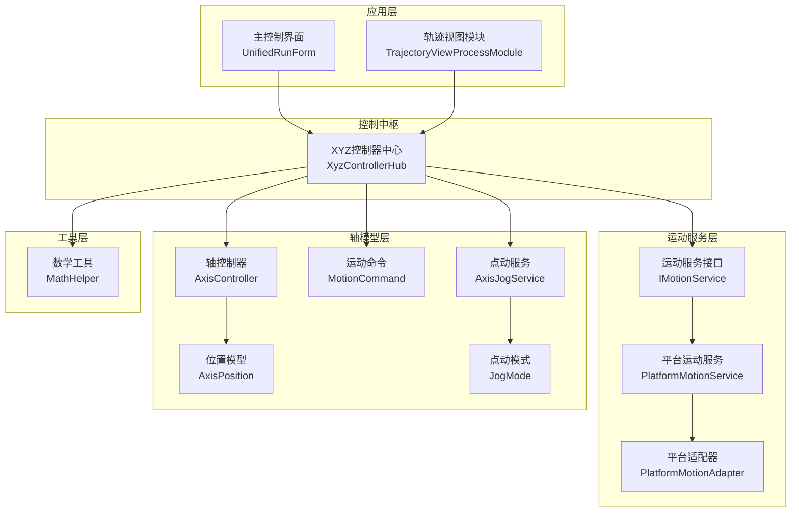
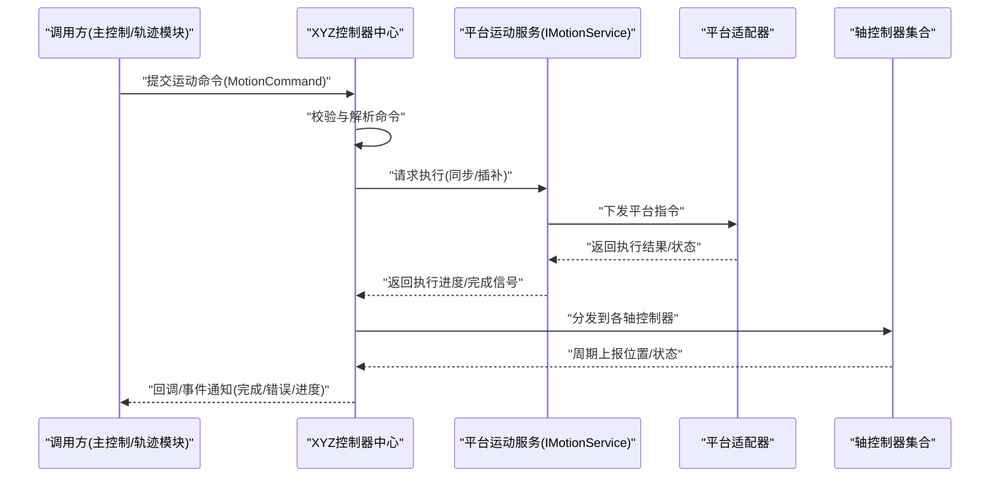
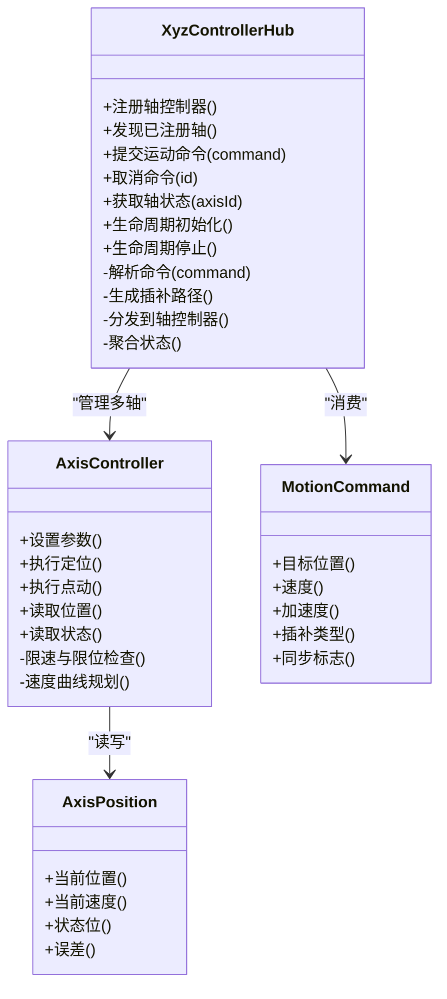
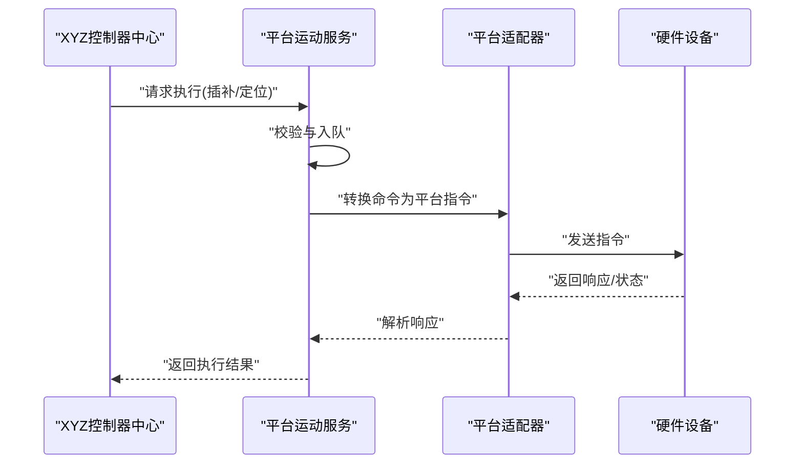
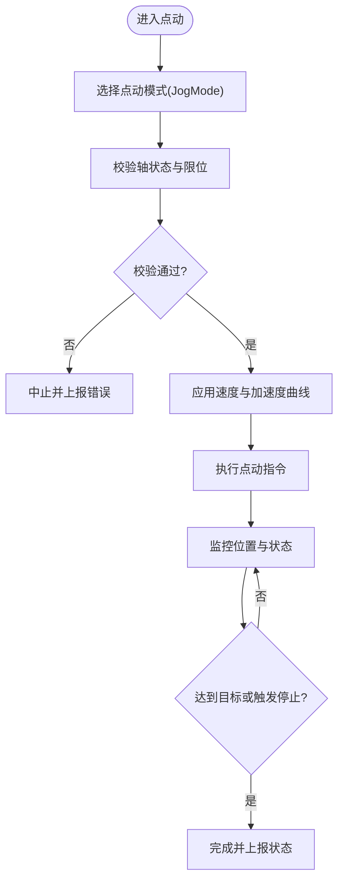
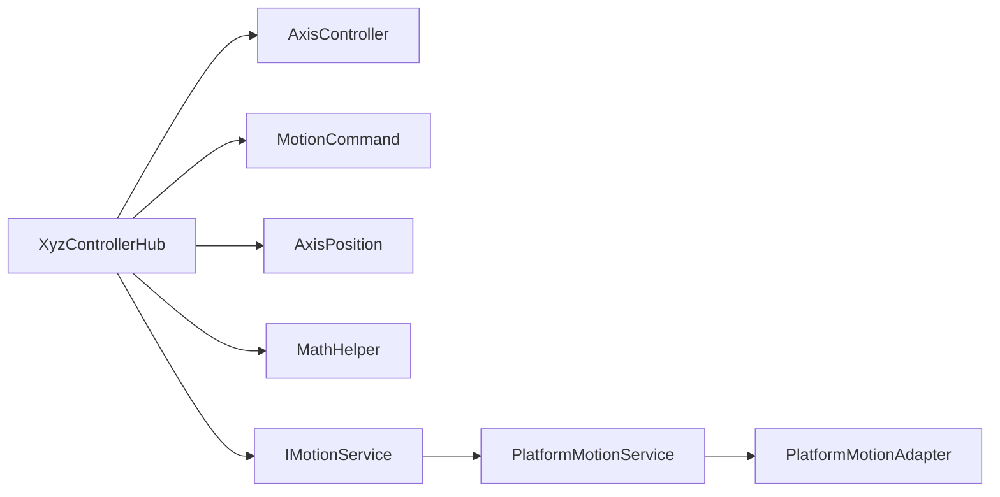

# XYZ控制器中心

<cite>
**本文引用的文件**   
- [XyzControllerHub.cs](file://Logic/XyzControllerHub.cs)
- [AxisController.cs](file://Logic/AxisController.cs)
- [PlatformMotionService.cs](file://Logic/PlatformMotionService.cs)
- [PlatformMotionAdapter.cs](file://Logic/PlatformMotionAdapter.cs)
- [IMotionService.cs](file://Logic/IMotionService.cs)
- [MotionCommand.cs](file://Logic/MotionCommand.cs)
- [AxisPosition.cs](file://Logic/AxisPosition.cs)
- [JogMode.cs](file://Logic/JogMode.cs)
- [AxisJogService.cs](file://Logic/AxisJogService.cs)
- [MathHelper.cs](file://Controls/MathHelper.cs)
- [MainControlProcessModule.cs](file://MainControl/MainControlProcessModule.cs)
- [UnifiedRunForm.cs](file://MainControl/UnifiedRunForm.cs)
- [TrajectoryViewProcessModule.cs](file://Trajectory/TrajectoryViewProcessModule.cs)
</cite>

## 目录
1. [简介](#简介)
2. [项目结构](#项目结构)
3. [核心组件](#核心组件)
4. [架构总览](#架构总览)
5. [详细组件分析](#详细组件分析)
6. [依赖关系分析](#依赖关系分析)
7. [性能考虑](#性能考虑)
8. [故障诊断与排错指南](#故障诊断与排错指南)
9. [结论](#结论)
10. [附录：配置与使用示例](#附录配置与使用示例)

## 简介
本技术文档围绕XYZ控制器中心（XyzControllerHub）展开，系统阐述三轴协调控制的架构设计、消息路由机制、同步控制算法与插补计算策略。文档同时覆盖控制器中心的注册、发现与生命周期管理，多轴运动的协调策略与冲突解决机制，并提供配置与使用示例、性能监控与故障诊断方法以及扩展开发指南，帮助读者快速理解并高效使用该模块进行复杂运动轨迹规划。

## 项目结构
本项目采用分层与按功能域组织相结合的结构：
- Logic层：核心运动控制逻辑，包含XYZ控制器中心、轴控制器、平台适配器与服务接口等。
- Controls层：数学与绘图辅助工具，为上层UI提供基础能力。
- MainControl与Trajectory等进程模块：作为应用入口与业务编排层，负责界面交互与任务调度。

图表来源
- [XyzControllerHub.cs](file://Logic/XyzControllerHub.cs)
- [IMotionService.cs](file://Logic/IMotionService.cs)
- [PlatformMotionService.cs](file://Logic/PlatformMotionService.cs)
- [PlatformMotionAdapter.cs](file://Logic/PlatformMotionAdapter.cs)
- [AxisController.cs](file://Logic/AxisController.cs)
- [AxisPosition.cs](file://Logic/AxisPosition.cs)
- [MotionCommand.cs](file://Logic/MotionCommand.cs)
- [AxisJogService.cs](file://Logic/AxisJogService.cs)
- [JogMode.cs](file://Logic/JogMode.cs)
- [MathHelper.cs](file://Controls/MathHelper.cs)
- [UnifiedRunForm.cs](file://MainControl/UnifiedRunForm.cs)
- [TrajectoryViewProcessModule.cs](file://Trajectory/TrajectoryViewProcessModule.cs)

章节来源
- [XyzControllerHub.cs](file://Logic/XyzControllerHub.cs)
- [PlatformMotionService.cs](file://Logic/PlatformMotionService.cs)
- [PlatformMotionAdapter.cs](file://Logic/PlatformMotionAdapter.cs)
- [IMotionService.cs](file://Logic/IMotionService.cs)
- [AxisController.cs](file://Logic/AxisController.cs)
- [AxisPosition.cs](file://Logic/AxisPosition.cs)
- [MotionCommand.cs](file://Logic/MotionCommand.cs)
- [AxisJogService.cs](file://Logic/AxisJogService.cs)
- [JogMode.cs](file://Logic/JogMode.cs)
- [MathHelper.cs](file://Controls/MathHelper.cs)
- [UnifiedRunForm.cs](file://MainControl/UnifiedRunForm.cs)
- [TrajectoryViewProcessModule.cs](file://Trajectory/TrajectoryViewProcessModule.cs)

## 核心组件
- XYZ控制器中心（XyzControllerHub）
  - 职责：统一注册与管理XYZ三轴控制器；接收高层运动指令；执行三轴同步与插补；协调并发与冲突；暴露查询与事件通知。
  - 关键能力：轴注册/发现、生命周期管理、命令分发、同步调度、状态聚合、异常上报。
- 轴控制器（AxisController）
  - 职责：封装单轴的运动参数、状态机、限位保护、速度/加速度曲线、回零与定位。
- 平台运动服务（PlatformMotionService）
  - 职责：实现IMotionService接口，屏蔽底层硬件差异，向上提供统一的运动API。
- 平台适配器（PlatformMotionAdapter）
  - 职责：将通用运动命令转换为具体硬件平台的指令集，处理通信协议与时序。
- 运动命令（MotionCommand）
  - 职责：描述目标位置、速度、加速度、插补类型、同步标志等。
- 位置模型（AxisPosition）
  - 职责：记录各轴的实时位置、速度、状态位与误差。
- 点动服务（AxisJogService）与点动模式（JogMode）
  - 职责：提供手动点动、步进、连续点动等模式，支持优先级与互斥。
- 数学工具（MathHelper）
  - 职责：提供坐标变换、插补计算、向量运算等基础算法。

章节来源
- [XyzControllerHub.cs](file://Logic/XyzControllerHub.cs)
- [AxisController.cs](file://Logic/AxisController.cs)
- [PlatformMotionService.cs](file://Logic/PlatformMotionService.cs)
- [PlatformMotionAdapter.cs](file://Logic/PlatformMotionAdapter.cs)
- [IMotionService.cs](file://Logic/IMotionService.cs)
- [MotionCommand.cs](file://Logic/MotionCommand.cs)
- [AxisPosition.cs](file://Logic/AxisPosition.cs)
- [AxisJogService.cs](file://Logic/AxisJogService.cs)
- [JogMode.cs](file://Logic/JogMode.cs)
- [MathHelper.cs](file://Controls/MathHelper.cs)

## 架构总览
XYZ控制器中心作为“控制中枢”，对上承接业务模块（主控制界面、轨迹模块），对下通过平台运动服务与适配器驱动硬件。其核心流程包括：
- 注册与发现：启动时扫描或接收轴注册，建立轴映射表。
- 生命周期：初始化、运行、暂停、停止、销毁。
- 命令路由：解析高层指令，生成插补计划，分发给各轴控制器。
- 同步与协调：依据插补算法保证多轴协同，处理冲突与优先级。
- 状态反馈：周期性采集轴状态，聚合后上报给上层。

图表来源
- [XyzControllerHub.cs](file://Logic/XyzControllerHub.cs)
- [IMotionService.cs](file://Logic/IMotionService.cs)
- [PlatformMotionService.cs](file://Logic/PlatformMotionService.cs)
- [PlatformMotionAdapter.cs](file://Logic/PlatformMotionAdapter.cs)
- [AxisController.cs](file://Logic/AxisController.cs)
- [MotionCommand.cs](file://Logic/MotionCommand.cs)

## 详细组件分析

### XyzControllerHub（XYZ控制器中心）
- 注册与发现
  - 支持动态注册XYZ三轴控制器，维护轴ID到控制器的映射。
  - 提供查询接口以获取轴列表、状态与能力。
- 生命周期管理
  - 初始化阶段完成轴绑定、参数加载、事件订阅。
  - 运行阶段负责命令调度与状态聚合。
  - 停止/销毁阶段释放资源、取消未完成任务、清理事件订阅。
- 消息路由与命令分发
  - 接收高层MotionCommand，解析目标轴、运动参数与同步要求。
  - 根据插补类型（直线、圆弧、样条等）生成路径点序列。
  - 将路径点按时间片分配至各轴控制器，确保同步。
- 同步控制与插补计算
  - 基于MathHelper提供的数学函数进行轨迹插补。
  - 采用速度/加速度规划，保证平滑过渡与抖动抑制。
  - 支持多轴同步标志，必要时启用硬同步或软同步策略。
- 冲突解决与优先级
  - 定义命令优先级（如急停>安全限制>常规运动）。
  - 当多个命令竞争同一轴时，按优先级与到达顺序仲裁。
  - 支持互斥组（如Z轴与夹具联动）避免危险动作。
- 状态聚合与事件
  - 周期性汇总各轴位置、速度、报警、限位状态。
  - 向调用方推送进度、完成、错误等事件。

图表来源
- [XyzControllerHub.cs](file://Logic/XyzControllerHub.cs)
- [AxisController.cs](file://Logic/AxisController.cs)
- [MotionCommand.cs](file://Logic/MotionCommand.cs)
- [AxisPosition.cs](file://Logic/AxisPosition.cs)

章节来源
- [XyzControllerHub.cs](file://Logic/XyzControllerHub.cs)
- [AxisController.cs](file://Logic/AxisController.cs)
- [MotionCommand.cs](file://Logic/MotionCommand.cs)
- [AxisPosition.cs](file://Logic/AxisPosition.cs)

### PlatformMotionService与PlatformMotionAdapter（平台适配层）
- IMotionService接口
  - 定义统一的运动API（定位、插补、点动、急停、查询等）。
- PlatformMotionService
  - 实现IMotionService，负责命令校验、队列管理、并发控制与结果聚合。
- PlatformMotionAdapter
  - 将通用命令转换为具体硬件协议帧，处理通信重试、超时与错误码映射。

图表来源
- [IMotionService.cs](file://Logic/IMotionService.cs)
- [PlatformMotionService.cs](file://Logic/PlatformMotionService.cs)
- [PlatformMotionAdapter.cs](file://Logic/PlatformMotionAdapter.cs)

章节来源
- [IMotionService.cs](file://Logic/IMotionService.cs)
- [PlatformMotionService.cs](file://Logic/PlatformMotionService.cs)
- [PlatformMotionAdapter.cs](file://Logic/PlatformMotionAdapter.cs)

### 轴控制器与点动服务（AxisController与AxisJogService）
- AxisController
  - 单轴运动状态机：空闲、运行、暂停、急停、报警。
  - 速度与加速度曲线规划，支持S曲线与梯形曲线。
  - 限位检测与回零逻辑，保障安全。
- AxisJogService与JogMode
  - 提供点动模式切换（步进、连续、增量）。
  - 支持点动优先级与互斥，防止与其他运动冲突。

图表来源
- [AxisController.cs](file://Logic/AxisController.cs)
- [AxisJogService.cs](file://Logic/AxisJogService.cs)
- [JogMode.cs](file://Logic/JogMode.cs)

章节来源
- [AxisController.cs](file://Logic/AxisController.cs)
- [AxisJogService.cs](file://Logic/AxisJogService.cs)
- [JogMode.cs](file://Logic/JogMode.cs)

### 数学工具（MathHelper）
- 提供坐标变换、向量运算、角度换算、距离与速度计算等基础函数。
- 支撑插补算法（直线、圆弧、样条）与速度规划。

章节来源
- [MathHelper.cs](file://Controls/MathHelper.cs)

## 依赖关系分析
- 耦合与内聚
  - XyzControllerHub对内聚了命令解析、插补计划与状态聚合，对外仅暴露简洁API。
  - PlatformMotionService与PlatformMotionAdapter解耦业务与硬件，提升可替换性。
- 直接依赖
  - XyzControllerHub依赖AxisController、MotionCommand、AxisPosition、MathHelper。
  - PlatformMotionService依赖IMotionService与PlatformMotionAdapter。
- 外部集成点
  - 硬件平台通过PlatformMotionAdapter接入，支持多厂商设备。
  - 上层业务通过XyzControllerHub进行统一控制。

图表来源
- [XyzControllerHub.cs](file://Logic/XyzControllerHub.cs)
- [AxisController.cs](file://Logic/AxisController.cs)
- [MotionCommand.cs](file://Logic/MotionCommand.cs)
- [AxisPosition.cs](file://Logic/AxisPosition.cs)
- [MathHelper.cs](file://Controls/MathHelper.cs)
- [IMotionService.cs](file://Logic/IMotionService.cs)
- [PlatformMotionService.cs](file://Logic/PlatformMotionService.cs)
- [PlatformMotionAdapter.cs](file://Logic/PlatformMotionAdapter.cs)

章节来源
- [XyzControllerHub.cs](file://Logic/XyzControllerHub.cs)
- [PlatformMotionService.cs](file://Logic/PlatformMotionService.cs)
- [PlatformMotionAdapter.cs](file://Logic/PlatformMotionAdapter.cs)
- [IMotionService.cs](file://Logic/IMotionService.cs)
- [AxisController.cs](file://Logic/AxisController.cs)
- [MotionCommand.cs](file://Logic/MotionCommand.cs)
- [AxisPosition.cs](file://Logic/AxisPosition.cs)
- [MathHelper.cs](file://Controls/MathHelper.cs)

## 性能考虑
- 插补与路径规划
  - 合理选择插补类型与步长，平衡精度与实时性。
  - 使用速度/加速度规划减少加减速冲击，提高轨迹平滑度。
- 并发与调度
  - 命令队列化与优先级仲裁，避免阻塞与死锁。
  - 周期性状态采样与批量上报，降低通信开销。
- 资源管理
  - 及时释放未使用的轴控制器与事件订阅。
  - 缓存常用参数与路径片段，减少重复计算。
- 监控指标
  - 跟踪命令延迟、执行耗时、丢包率、轴误差与报警频率。
  - 提供性能计数器与日志级别开关，便于线上诊断。

[本节为通用指导，不直接分析具体文件]

## 故障诊断与排错指南
- 常见问题定位
  - 轴未注册或发现失败：检查注册流程与映射表。
  - 命令执行超时：查看平台适配器通信状态与重试策略。
  - 轨迹不平滑：调整插补步长与速度曲线参数。
  - 多轴冲突：确认优先级与互斥组配置。
- 诊断手段
  - 启用详细日志，记录命令入队、分发、执行与回报。
  - 采集轴状态快照（位置、速度、报警、限位）进行分析。
  - 使用单元测试模拟硬件响应，验证命令链路。
- 恢复策略
  - 自动重试与降级（如从硬同步切换到软同步）。
  - 安全停机与复位流程，确保设备与人员安全。

章节来源
- [XyzControllerHub.cs](file://Logic/XyzControllerHub.cs)
- [PlatformMotionAdapter.cs](file://Logic/PlatformMotionAdapter.cs)
- [AxisController.cs](file://Logic/AxisController.cs)

## 结论
XYZ控制器中心通过清晰的层次结构与模块化设计，实现了三轴协调控制的高效与可靠。其注册/发现、生命周期管理、消息路由、同步插补与冲突解决机制，为复杂运动轨迹规划提供了坚实基础。结合性能监控与故障诊断能力，开发者可快速构建稳定、可扩展的多轴控制系统。

[本节为总结性内容，不直接分析具体文件]

## 附录：配置与使用示例
- 配置步骤
  - 在应用启动时初始化XYZ控制器中心，完成轴注册与参数加载。
  - 配置平台运动服务与适配器，指定硬件通信参数。
  - 设置点动模式与优先级策略，定义互斥组与安全限制。
- 使用示例（概念流程）
  - 创建MotionCommand，设定目标位置、速度与加速度。
  - 调用XYZ控制器中心提交命令，监听回调事件。
  - 根据反馈调整后续命令，实现多段轨迹拼接。
- 典型场景
  - 直线插补：XYZ三轴同步移动，保持比例速度。
  - 圆弧插补：以某轴为基准，其他轴跟随形成圆弧。
  - 样条轨迹：高阶平滑路径，适用于精密加工。
- 参考入口
  - 主控制界面与轨迹模块作为调用方，演示如何与XYZ控制器中心交互。

章节来源
- [UnifiedRunForm.cs](file://MainControl/UnifiedRunForm.cs)
- [TrajectoryViewProcessModule.cs](file://Trajectory/TrajectoryViewProcessModule.cs)
- [XyzControllerHub.cs](file://Logic/XyzControllerHub.cs)
- [MotionCommand.cs](file://Logic/MotionCommand.cs)
- [PlatformMotionService.cs](file://Logic/PlatformMotionService.cs)
- [PlatformMotionAdapter.cs](file://Logic/PlatformMotionAdapter.cs)