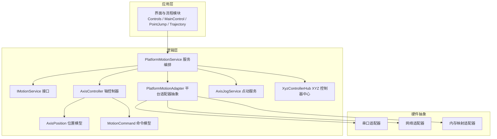
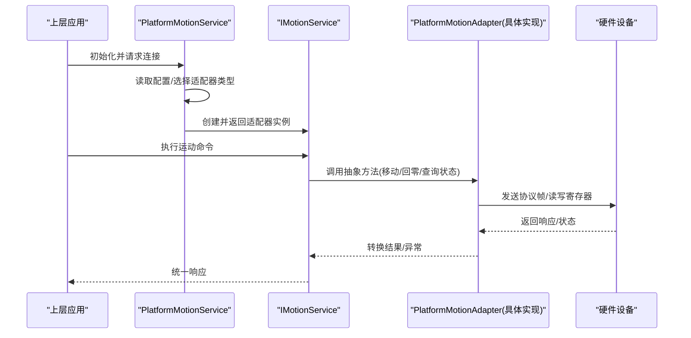
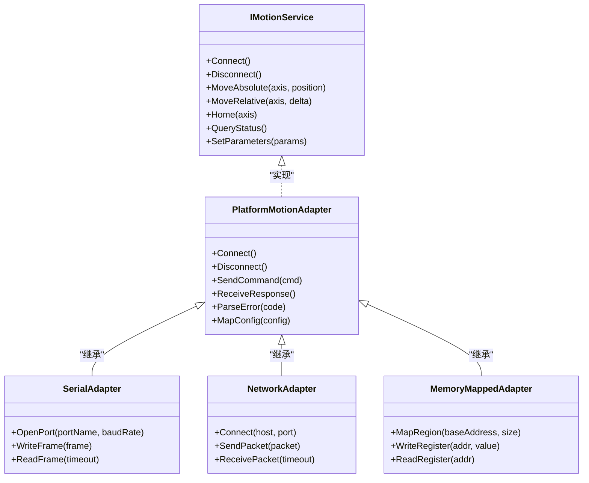
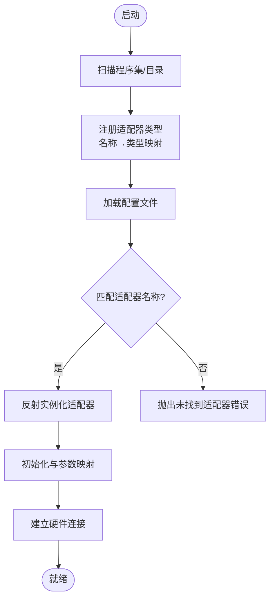
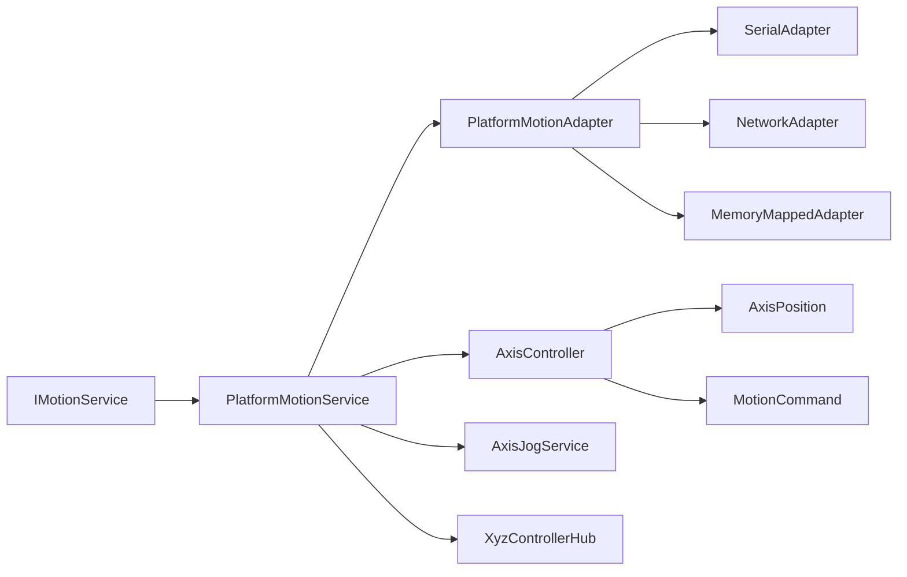

# 平台适配器

<cite>
**本文引用的文件**   
- [PlatformMotionAdapter.cs](file://Logic/PlatformMotionAdapter.cs)
- [PlatformMotionService.cs](file://Logic/PlatformMotionService.cs)
- [IMotionService.cs](file://Logic/IMotionService.cs)
- [AxisController.cs](file://Logic/AxisController.cs)
- [AxisJogService.cs](file://Logic/AxisJogService.cs)
- [AxisPosition.cs](file://Logic/AxisPosition.cs)
- [MotionCommand.cs](file://Logic/MotionCommand.cs)
- [XyzControllerHub.cs](file://Logic/XyzControllerHub.cs)
- [PlatformMotionAdapter使用说明.md](file://Logic/PlatformMotionAdapter使用说明.md)
</cite>

## 目录
1. [简介](#简介)
2. [项目结构](#项目结构)
3. [核心组件](#核心组件)
4. [架构总览](#架构总览)
5. [详细组件分析](#详细组件分析)
6. [依赖关系分析](#依赖关系分析)
7. [性能考虑](#性能考虑)
8. [故障排查指南](#故障排查指南)
9. [结论](#结论)
10. [附录](#附录)

## 简介
本技术文档围绕 PlatformMotionAdapter 平台适配器展开，系统化阐述平台抽象层的设计与硬件无关性原理，详细说明适配器的注册机制、插件加载与动态发现策略，并文档化不同硬件平台的适配方法与通信协议。同时给出配置文件格式与参数映射说明，提供实现新平台适配器的完整示例（串口、网络、内存映射），以及调试工具、测试框架与性能调优指南，帮助开发者快速扩展与集成新的运动控制硬件。

## 项目结构
本项目采用分层与模块化组织方式：
- Logic 层：包含运动控制核心逻辑、平台抽象与服务编排，是平台适配器的主要实现区域。
- Controls、MainControl、PointJump、Trajectory 等：面向具体业务场景的界面与流程模块，通过统一接口调用运动服务。
- Resources、bin、obj：资源与构建产物。

图表来源
- [PlatformMotionService.cs](file://Logic/PlatformMotionService.cs)
- [IMotionService.cs](file://Logic/IMotionService.cs)
- [PlatformMotionAdapter.cs](file://Logic/PlatformMotionAdapter.cs)
- [AxisController.cs](file://Logic/AxisController.cs)
- [AxisJogService.cs](file://Logic/AxisJogService.cs)
- [AxisPosition.cs](file://Logic/AxisPosition.cs)
- [MotionCommand.cs](file://Logic/MotionCommand.cs)
- [XyzControllerHub.cs](file://Logic/XyzControllerHub.cs)

章节来源
- [PlatformMotionAdapter.cs](file://Logic/PlatformMotionAdapter.cs)
- [PlatformMotionService.cs](file://Logic/PlatformMotionService.cs)
- [IMotionService.cs](file://Logic/IMotionService.cs)
- [AxisController.cs](file://Logic/AxisController.cs)
- [AxisJogService.cs](file://Logic/AxisJogService.cs)
- [AxisPosition.cs](file://Logic/AxisPosition.cs)
- [MotionCommand.cs](file://Logic/MotionCommand.cs)
- [XyzControllerHub.cs](file://Logic/XyzControllerHub.cs)

## 核心组件
- IMotionService：定义运动服务的统一接口，屏蔽底层硬件差异，向上层暴露一致的 API。
- PlatformMotionService：服务编排与生命周期管理，负责选择并实例化具体的 PlatformMotionAdapter，协调轴控制器与点动服务。
- PlatformMotionAdapter：平台抽象层基类/适配器契约，定义硬件无关的运动控制方法、状态查询、错误处理与配置解析。
- AxisController：轴级控制封装，将高层指令转换为底层驱动可执行的序列动作。
- AxisJogService：点动模式服务，支持手动/自动点动、速度/加速度曲线控制。
- AxisPosition：轴位置数据模型，用于状态同步与反馈。
- MotionCommand：运动命令模型，描述目标位置、速度、加速度、插补模式等。
- XyzControllerHub：XYZ 三轴协同控制器中心，负责多轴联动与轨迹规划。

章节来源
- [IMotionService.cs](file://Logic/IMotionService.cs)
- [PlatformMotionService.cs](file://Logic/PlatformMotionService.cs)
- [PlatformMotionAdapter.cs](file://Logic/PlatformMotionAdapter.cs)
- [AxisController.cs](file://Logic/AxisController.cs)
- [AxisJogService.cs](file://Logic/AxisJogService.cs)
- [AxisPosition.cs](file://Logic/AxisPosition.cs)
- [MotionCommand.cs](file://Logic/MotionCommand.cs)
- [XyzControllerHub.cs](file://Logic/XyzControllerHub.cs)

## 架构总览
平台抽象层通过“接口 + 适配器”的模式实现硬件无关性：上层仅依赖 IMotionService，运行时由 PlatformMotionService 根据配置动态选择并加载具体适配器（串口、网络、内存映射）。适配器内部封装协议编解码、超时重试、错误码映射与状态同步，确保上层逻辑稳定可靠。

图表来源
- [PlatformMotionService.cs](file://Logic/PlatformMotionService.cs)
- [IMotionService.cs](file://Logic/IMotionService.cs)
- [PlatformMotionAdapter.cs](file://Logic/PlatformMotionAdapter.cs)

## 详细组件分析

### 平台抽象层与硬件无关性设计
- 抽象契约：PlatformMotionAdapter 定义统一的连接、断开、命令下发、状态轮询、错误处理等方法，屏蔽串口、网络、内存映射等差异。
- 协议适配：各具体适配器实现协议编解码、帧校验、重发策略、超时与断线恢复。
- 配置映射：通过配置文件键值映射到适配器参数（端口、波特率、IP、端口号、寄存器偏移、字节序等）。
- 错误归一化：将底层错误码映射为统一异常或状态码，便于上层处理。

图表来源
- [IMotionService.cs](file://Logic/IMotionService.cs)
- [PlatformMotionAdapter.cs](file://Logic/PlatformMotionAdapter.cs)

章节来源
- [PlatformMotionAdapter.cs](file://Logic/PlatformMotionAdapter.cs)

### 适配器注册机制、插件加载与动态发现
- 注册表：在启动时扫描已注册的适配器类型，维护一个“名称→类型”的映射表。
- 插件加载：支持从指定目录或程序集动态加载适配器 DLL，按约定命名或特性标记进行识别。
- 动态发现：根据配置文件中的适配器名称，查找对应类型并实例化；若未找到则抛出明确错误。
- 生命周期：适配器实例由 PlatformMotionService 统一管理，包括初始化、连接、运行与释放。

图表来源
- [PlatformMotionService.cs](file://Logic/PlatformMotionService.cs)
- [PlatformMotionAdapter.cs](file://Logic/PlatformMotionAdapter.cs)

章节来源
- [PlatformMotionService.cs](file://Logic/PlatformMotionService.cs)
- [PlatformMotionAdapter.cs](file://Logic/PlatformMotionAdapter.cs)

### 不同硬件平台的适配方法与通信协议
- 串口适配器：
  - 通信：基于固定帧格式，含起始符、长度、命令、数据、校验、结束符。
  - 参数：端口名、波特率、数据位、停止位、校验位。
  - 错误：超时、CRC 校验失败、帧头错误。
- 网络适配器：
  - 通信：TCP/UDP 报文，支持心跳包与断线重连。
  - 参数：主机地址、端口、超时、最大重传次数。
  - 错误：连接失败、丢包、协议版本不匹配。
- 内存映射适配器：
  - 通信：直接读写共享内存区域，低延迟高吞吐。
  - 参数：基地址、大小、字节序、对齐规则。
  - 错误：访问越界、权限不足、映射失败。

章节来源
- [PlatformMotionAdapter.cs](file://Logic/PlatformMotionAdapter.cs)

### 配置文件格式与参数映射关系
- 配置项建议：
  - adapter.type：适配器类型（serial/network/memory）
  - serial.portName：串口名称
  - serial.baudRate：波特率
  - network.host：主机地址
  - network.port：端口号
  - memory.baseAddress：内存基址
  - memory.size：映射大小
  - common.timeout：通用超时
  - common.retryCount：重试次数
- 映射规则：
  - 配置文件键值经 MapConfig 映射到适配器参数对象。
  - 缺失必填项时抛出配置错误，并提供默认值提示。
  - 支持环境变量覆盖（可选）。

章节来源
- [PlatformMotionAdapter.cs](file://Logic/PlatformMotionAdapter.cs)
- [PlatformMotionService.cs](file://Logic/PlatformMotionService.cs)

### 实现新平台适配器的步骤与示例
- 步骤概览：
  1. 新建适配器类，继承 PlatformMotionAdapter。
  2. 实现连接/断开、命令发送/接收、错误解析与配置映射。
  3. 在注册表中登记适配器名称与类型。
  4. 编写单元测试覆盖正常路径与异常路径。
  5. 集成到 PlatformMotionService 的配置中。
- 示例场景：
  - 串口通信：打开端口、构造帧、发送与接收、校验与重试。
  - 网络通信：建立 TCP 连接、发送报文、处理心跳与断线。
  - 内存映射：映射共享内存、读写寄存器、处理对齐与字节序。

章节来源
- [PlatformMotionAdapter.cs](file://Logic/PlatformMotionAdapter.cs)
- [PlatformMotionService.cs](file://Logic/PlatformMotionService.cs)

### 轴控制器与点动服务
- AxisController：将高层 MoveAbsolute/MoveRelative/Home 转换为底层驱动序列，处理加减速曲线与插补。
- AxisJogService：支持点动模式，提供速度/加速度调节、方向切换与安全限位检查。
- AxisPosition：同步轴当前位置、目标位置、状态标志。
- MotionCommand：描述命令参数，如目标位置、速度、加速度、插补模式、优先级。

章节来源
- [AxisController.cs](file://Logic/AxisController.cs)
- [AxisJogService.cs](file://Logic/AxisJogService.cs)
- [AxisPosition.cs](file://Logic/AxisPosition.cs)
- [MotionCommand.cs](file://Logic/MotionCommand.cs)

### XYZ 控制器中心
- XyzControllerHub：协调 XYZ 三轴联动，处理轨迹规划、同步与冲突检测。
- 与 AxisController 协作，将复杂轨迹分解为单轴指令序列。

章节来源
- [XyzControllerHub.cs](file://Logic/XyzControllerHub.cs)
- [AxisController.cs](file://Logic/AxisController.cs)

## 依赖关系分析
- 耦合度：
  - IMotionService 与 PlatformMotionAdapter 解耦，上层仅依赖接口。
  - PlatformMotionService 负责装配与生命周期，降低模块间直接依赖。
- 外部依赖：
  - 串口：系统串口库。
  - 网络：TCP/UDP 套接字。
  - 内存映射：操作系统共享内存 API。
- 潜在循环依赖：
  - 避免 AxisController 反向依赖 PlatformMotionAdapter，应通过 IMotionService 间接调用。

图表来源
- [IMotionService.cs](file://Logic/IMotionService.cs)
- [PlatformMotionService.cs](file://Logic/PlatformMotionService.cs)
- [PlatformMotionAdapter.cs](file://Logic/PlatformMotionAdapter.cs)
- [AxisController.cs](file://Logic/AxisController.cs)
- [AxisJogService.cs](file://Logic/AxisJogService.cs)
- [AxisPosition.cs](file://Logic/AxisPosition.cs)
- [MotionCommand.cs](file://Logic/MotionCommand.cs)
- [XyzControllerHub.cs](file://Logic/XyzControllerHub.cs)

章节来源
- [IMotionService.cs](file://Logic/IMotionService.cs)
- [PlatformMotionService.cs](file://Logic/PlatformMotionService.cs)
- [PlatformMotionAdapter.cs](file://Logic/PlatformMotionAdapter.cs)
- [AxisController.cs](file://Logic/AxisController.cs)
- [AxisJogService.cs](file://Logic/AxisJogService.cs)
- [AxisPosition.cs](file://Logic/AxisPosition.cs)
- [MotionCommand.cs](file://Logic/MotionCommand.cs)
- [XyzControllerHub.cs](file://Logic/XyzControllerHub.cs)

## 性能考虑
- 序列化与反序列化：
  - 使用轻量级帧结构，减少分配与拷贝。
  - 批量命令合并，降低通信开销。
- 并发与线程安全：
  - 适配器内部使用锁或无锁队列保证线程安全。
  - 避免在回调中进行阻塞操作。
- I/O 优化：
  - 串口：合理设置缓冲区大小与超时。
  - 网络：启用 Nagle 关闭与心跳保活。
  - 内存映射：对齐与分页策略优化。
- 监控与指标：
  - 记录命令耗时、重试次数、错误码分布。
  - 提供性能计数器以便调优。

[本节为通用指导，不直接分析具体文件]

## 故障排查指南
- 常见问题：
  - 适配器未找到：检查配置文件名称与注册表是否一致。
  - 连接失败：确认端口/IP/端口号、防火墙与权限。
  - 超时与重试：调整超时与重试次数，观察日志定位瓶颈。
  - 协议不一致：核对帧格式、校验位与字节序。
- 调试工具：
  - 串口调试器：抓包与帧解析。
  - 网络抓包：Wireshark 查看报文。
  - 内存映射查看：十六进制编辑器验证数据布局。
- 测试框架：
  - 单元测试：模拟适配器行为，覆盖边界条件。
  - 集成测试：端到端验证连接、命令与状态同步。
  - 压力测试：高并发与长时间运行稳定性。

章节来源
- [PlatformMotionAdapter.cs](file://Logic/PlatformMotionAdapter.cs)
- [PlatformMotionService.cs](file://Logic/PlatformMotionService.cs)

## 结论
PlatformMotionAdapter 通过清晰的接口与适配器模式实现了硬件无关的运动控制抽象，结合动态注册与配置映射，使系统具备高度的可扩展性与可维护性。遵循本文档的设计原则与实践指南，开发者可以快速实现新的平台适配器，并在串口、网络与内存映射等多种场景下稳定运行。

[本节为总结，不直接分析具体文件]

## 附录
- 参考文档：
  - [PlatformMotionAdapter使用说明.md](file://Logic/PlatformMotionAdapter使用说明.md)

章节来源
- [PlatformMotionAdapter使用说明.md](file://Logic/PlatformMotionAdapter使用说明.md)