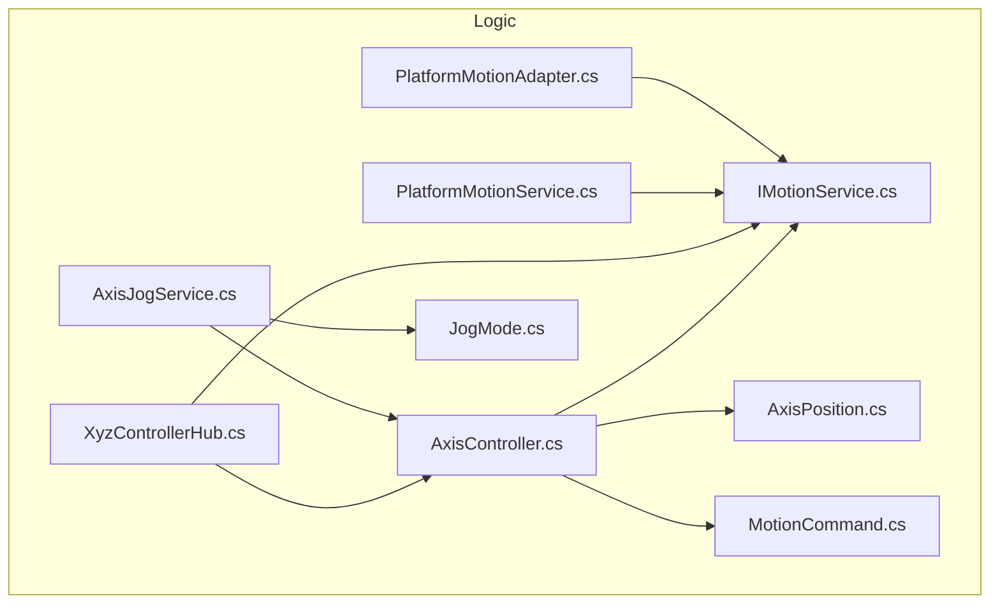
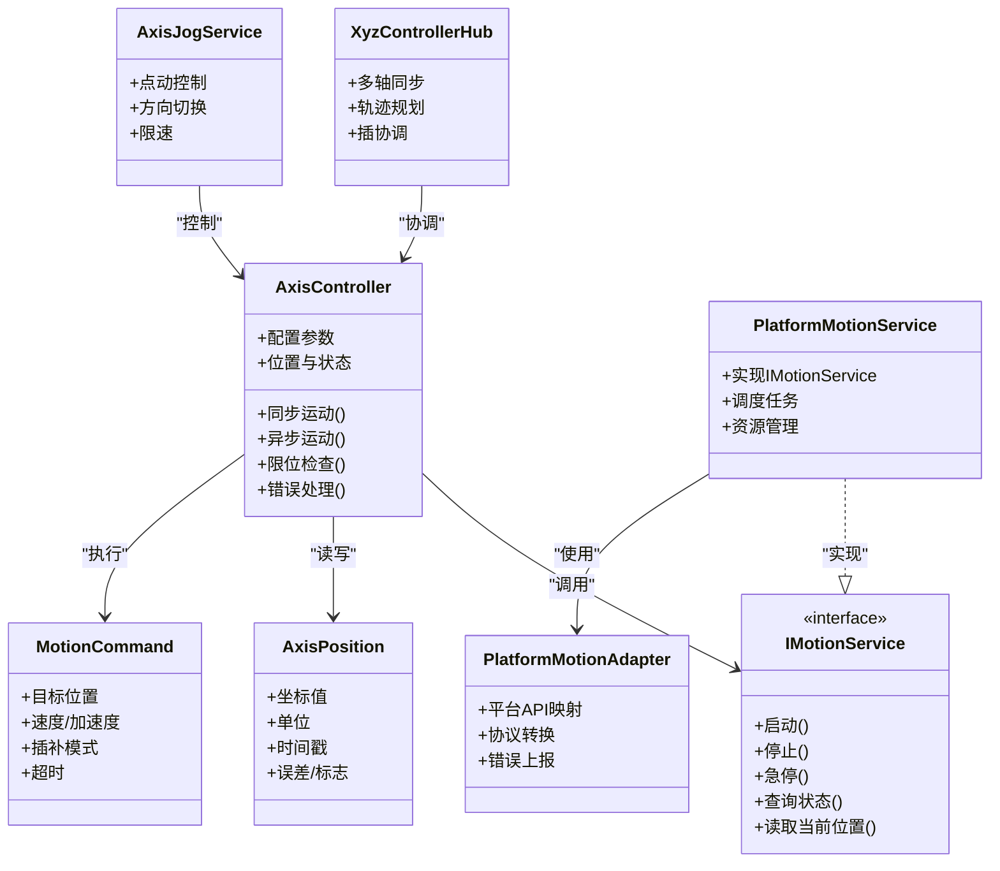
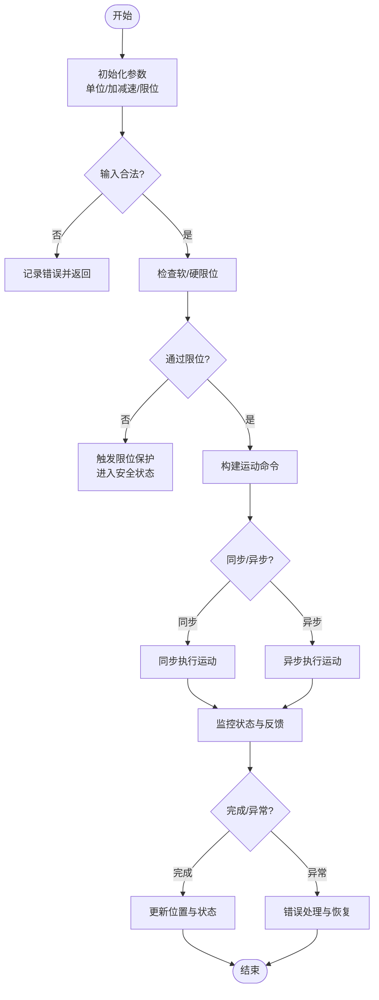
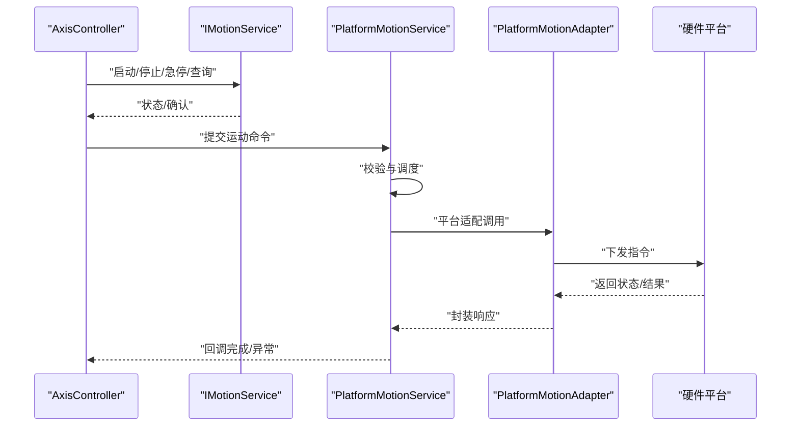
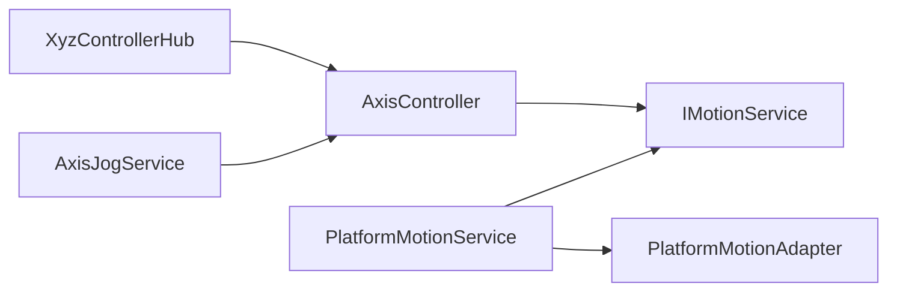

# 轴控制器核心

<cite>
**本文档引用的文件**   
- [AxisController.cs](file://Logic/AxisController.cs)
- [AxisPosition.cs](file://Logic/AxisPosition.cs)
- [IMotionService.cs](file://Logic/IMotionService.cs)
- [PlatformMotionService.cs](file://Logic/PlatformMotionService.cs)
- [PlatformMotionAdapter.cs](file://Logic/PlatformMotionAdapter.cs)
- [MotionCommand.cs](file://Logic/MotionCommand.cs)
- [XyzControllerHub.cs](file://Logic/XyzControllerHub.cs)
- [JogMode.cs](file://Logic/JogMode.cs)
- [AxisJogService.cs](file://Logic/AxisJogService.cs)
</cite>

## 目录
1. [简介](#简介)
2. [项目结构](#项目结构)
3. [核心组件](#核心组件)
4. [架构总览](#架构总览)
5. [详细组件分析](#详细组件分析)
6. [依赖关系分析](#依赖关系分析)
7. [性能考虑](#性能考虑)
8. [故障排查指南](#故障排查指南)
9. [结论](#结论)
10. [附录](#附录)

## 简介
本技术文档围绕 AxisController 轴控制器，系统性阐述多轴协调控制机制、轴位置管理、运动状态监控与同步控制。重点说明 AxisPosition 的位置数据结构与坐标系统，轴的初始化配置、参数设置与运行时控制接口，以及限位保护、错误处理与异常恢复策略。同时提供创建与控制多轴的示例思路，异步运动命令的处理方式，线程安全设计与性能优化建议，帮助读者快速掌握并正确使用该子系统。

## 项目结构
本项目采用按功能域划分的模块化组织方式，核心逻辑集中在 Logic 目录：
- 轴控制与数据模型：AxisController.cs、AxisPosition.cs、MotionCommand.cs
- 运动服务与适配器：IMotionService.cs、PlatformMotionService.cs、PlatformMotionAdapter.cs
- 多轴协同与交互：XyzControllerHub.cs、AxisJogService.cs、JogMode.cs

图表来源
- [AxisController.cs](file://Logic/AxisController.cs)
- [AxisPosition.cs](file://Logic/AxisPosition.cs)
- [MotionCommand.cs](file://Logic/MotionCommand.cs)
- [IMotionService.cs](file://Logic/IMotionService.cs)
- [PlatformMotionService.cs](file://Logic/PlatformMotionService.cs)
- [PlatformMotionAdapter.cs](file://Logic/PlatformMotionAdapter.cs)
- [XyzControllerHub.cs](file://Logic/XyzControllerHub.cs)
- [AxisJogService.cs](file://Logic/AxisJogService.cs)
- [JogMode.cs](file://Logic/JogMode.cs)

章节来源
- [AxisController.cs](file://Logic/AxisController.cs)
- [AxisPosition.cs](file://Logic/AxisPosition.cs)
- [IMotionService.cs](file://Logic/IMotionService.cs)
- [PlatformMotionService.cs](file://Logic/PlatformMotionService.cs)
- [PlatformMotionAdapter.cs](file://Logic/PlatformMotionAdapter.cs)
- [MotionCommand.cs](file://Logic/MotionCommand.cs)
- [XyzControllerHub.cs](file://Logic/XyzControllerHub.cs)
- [AxisJogService.cs](file://Logic/AxisJogService.cs)
- [JogMode.cs](file://Logic/JogMode.cs)

## 核心组件
- AxisController：单轴控制器，封装轴的配置、状态、限位、加减速、目标位置与当前反馈等能力，并提供同步/异步运动接口。
- AxisPosition：描述轴位置的轻量数据结构，包含坐标值、单位、时间戳及可选的误差或状态标志。
- IMotionService：运动服务抽象接口，定义启动、停止、急停、查询状态、读取当前位置等通用方法。
- PlatformMotionService：平台运动服务实现，负责将高层运动指令转换为底层硬件驱动可调用的操作。
- PlatformMotionAdapter：平台适配器，屏蔽不同硬件平台的差异，向上暴露统一接口。
- MotionCommand：运动命令对象，承载目标位置、速度、加速度、插补模式、超时等参数。
- XyzControllerHub：多轴协调中心，负责多轴同步、轨迹规划、插补与冲突消解。
- AxisJogService：点动（Jog）服务，支持连续/步进点动、方向切换与限速。
- JogMode：点动模式枚举，如连续、步进、回零等。

章节来源
- [AxisController.cs](file://Logic/AxisController.cs)
- [AxisPosition.cs](file://Logic/AxisPosition.cs)
- [IMotionService.cs](file://Logic/IMotionService.cs)
- [PlatformMotionService.cs](file://Logic/PlatformMotionService.cs)
- [PlatformMotionAdapter.cs](file://Logic/PlatformMotionAdapter.cs)
- [MotionCommand.cs](file://Logic/MotionCommand.cs)
- [XyzControllerHub.cs](file://Logic/XyzControllerHub.cs)
- [AxisJogService.cs](file://Logic/AxisJogService.cs)
- [JogMode.cs](file://Logic/JogMode.cs)

## 架构总览
整体架构遵循“控制器-服务-适配器”分层设计：
- 控制器层：AxisController 面向业务，提供易用的轴控制 API；XyzControllerHub 负责多轴协同。
- 服务层：IMotionService 抽象出运动能力，PlatformMotionService 提供具体实现。
- 适配层：PlatformMotionAdapter 对接具体硬件平台，屏蔽差异。

图表来源
- [AxisController.cs](file://Logic/AxisController.cs)
- [AxisPosition.cs](file://Logic/AxisPosition.cs)
- [IMotionService.cs](file://Logic/IMotionService.cs)
- [PlatformMotionService.cs](file://Logic/PlatformMotionService.cs)
- [PlatformMotionAdapter.cs](file://Logic/PlatformMotionAdapter.cs)
- [XyzControllerHub.cs](file://Logic/XyzControllerHub.cs)
- [AxisJogService.cs](file://Logic/AxisJogService.cs)
- [MotionCommand.cs](file://Logic/MotionCommand.cs)

## 详细组件分析

### AxisController 轴控制器
- 职责：维护单轴配置与运行状态，提供同步/异步运动接口，执行限位校验、错误检测与恢复。
- 关键能力：
  - 初始化与参数设置：单位换算、加减速曲线、最大速度/加速度、软限位、回零策略。
  - 位置管理：读写 AxisPosition，维护目标位置与实时反馈，支持偏差计算。
  - 运动控制：基于 MotionCommand 发起运动，支持绝对/相对定位、速度/加速度限制、超时与取消。
  - 状态监控：运行中、就绪、报警、停止等状态机，事件通知。
  - 限位保护：硬限位与软限位双重保护，触发后进入安全状态并上报错误。
  - 错误处理：异常捕获、降级策略、重试与复位流程。
  - 线程安全：内部锁保护共享状态，避免并发修改导致的不一致。

图表来源
- [AxisController.cs](file://Logic/AxisController.cs)
- [MotionCommand.cs](file://Logic/MotionCommand.cs)
- [AxisPosition.cs](file://Logic/AxisPosition.cs)

章节来源
- [AxisController.cs](file://Logic/AxisController.cs)
- [MotionCommand.cs](file://Logic/MotionCommand.cs)
- [AxisPosition.cs](file://Logic/AxisPosition.cs)

### AxisPosition 位置数据结构与坐标系统
- 字段含义：
  - 坐标值：物理单位（如 mm、deg），支持小数精度。
  - 单位：长度/角度/脉冲等单位标识。
  - 时间戳：采样或更新时间，用于时序分析与延迟测量。
  - 误差/标志：偏差、有效位、对齐标志等。
- 坐标系统：
  - 以设备原点为基准，正方向由硬件定义。
  - 支持相对/绝对坐标切换，单位换算在控制器层完成。
- 复杂度：
  - 读写 O(1)，比较与距离计算 O(1)。
  - 多线程访问需外部同步或使用原子更新。

章节来源
- [AxisPosition.cs](file://Logic/AxisPosition.cs)

### IMotionService 与 PlatformMotionService 运动服务
- IMotionService：定义统一的运动控制契约，包括启动、停止、急停、状态查询、当前位置读取等。
- PlatformMotionService：实现 IMotionService，负责任务调度、资源管理与生命周期控制。
- 典型流程：上层控制器提交命令 -> 服务校验与排队 -> 适配器下发到硬件 -> 回调状态与结果。

图表来源
- [IMotionService.cs](file://Logic/IMotionService.cs)
- [PlatformMotionService.cs](file://Logic/PlatformMotionService.cs)
- [PlatformMotionAdapter.cs](file://Logic/PlatformMotionAdapter.cs)

章节来源
- [IMotionService.cs](file://Logic/IMotionService.cs)
- [PlatformMotionService.cs](file://Logic/PlatformMotionService.cs)
- [PlatformMotionAdapter.cs](file://Logic/PlatformMotionAdapter.cs)

### XyzControllerHub 多轴协调中心
- 职责：多轴同步、轨迹规划、插补协调、冲突消解与优先级管理。
- 关键点：
  - 同步启动：确保各轴在同一时刻开始运动，保证轨迹精度。
  - 插补模式：直线、圆弧、样条等，根据路径动态调整各轴速度与加速度。
  - 限幅与削峰：全局速度/加速度限制，避免超限与抖动。
  - 异常隔离：单轴故障不影响其他轴继续运行或安全停机。

章节来源
- [XyzControllerHub.cs](file://Logic/XyzControllerHub.cs)

### AxisJogService 点动服务与 JogMode
- 功能：支持连续点动、步进点动、方向切换、限速与急停。
- 模式：
  - 连续：按住按钮持续移动，松开即停。
  - 步进：每次点击移动固定步长。
  - 回零：回到机械零点或参考点。
- 与 AxisController 协作：通过控制器接口下发点动命令，监听状态变化。

章节来源
- [AxisJogService.cs](file://Logic/AxisJogService.cs)
- [JogMode.cs](file://Logic/JogMode.cs)

## 依赖关系分析
- 松耦合：通过 IMotionService 抽象降低控制器与平台实现的耦合。
- 单一职责：AxisController 专注单轴控制，XyzControllerHub 专注多轴协调。
- 可替换性：PlatformMotionAdapter 可替换不同硬件平台实现。
- 潜在循环：应避免 Hub 直接依赖 Controller 的具体实现细节，仅通过接口或命令交互。

图表来源
- [AxisController.cs](file://Logic/AxisController.cs)
- [IMotionService.cs](file://Logic/IMotionService.cs)
- [PlatformMotionService.cs](file://Logic/PlatformMotionService.cs)
- [PlatformMotionAdapter.cs](file://Logic/PlatformMotionAdapter.cs)
- [XyzControllerHub.cs](file://Logic/XyzControllerHub.cs)
- [AxisJogService.cs](file://Logic/AxisJogService.cs)

章节来源
- [AxisController.cs](file://Logic/AxisController.cs)
- [IMotionService.cs](file://Logic/IMotionService.cs)
- [PlatformMotionService.cs](file://Logic/PlatformMotionService.cs)
- [PlatformMotionAdapter.cs](file://Logic/PlatformMotionAdapter.cs)
- [XyzControllerHub.cs](file://Logic/XyzControllerHub.cs)
- [AxisJogService.cs](file://Logic/AxisJogService.cs)

## 性能考虑
- 批量命令：合并多个小位移为一次插补，减少通信开销。
- 异步优先：非阻塞运动命令，配合回调或事件通知，提高吞吐。
- 缓存与预取：热点参数（如加减速曲线）缓存，避免重复计算。
- 锁粒度：缩小临界区，避免长时间持有锁导致阻塞。
- 采样频率：合理设置位置反馈采样周期，平衡精度与负载。
- 内存分配：复用命令对象，减少 GC 压力。

[本节为通用指导，不直接分析具体文件]

## 故障排查指南
- 常见错误：
  - 限位触发：检查软/硬限位阈值与传感器状态。
  - 超时失败：确认命令参数是否合理，网络/驱动是否稳定。
  - 同步失败：检查多轴时钟与启动时机。
- 诊断步骤：
  - 查看状态机与日志，定位失败阶段。
  - 回放命令序列，验证参数合法性。
  - 逐步隔离问题轴，判断是否为平台适配层异常。
- 恢复策略：
  - 自动复位：清除报警并重新初始化。
  - 手动干预：用户确认后恢复运行。
  - 降级运行：禁用受影响轴，继续其他轴作业。

章节来源
- [AxisController.cs](file://Logic/AxisController.cs)
- [PlatformMotionAdapter.cs](file://Logic/PlatformMotionAdapter.cs)

## 结论
AxisController 作为单轴控制的核心，结合 IMotionService 抽象与 PlatformMotionAdapter 适配，形成了清晰的分层架构。XyzControllerHub 提供多轴协调与轨迹规划，AxisJogService 完善人机交互能力。通过完善的限位保护、错误处理与线程安全设计，系统在稳定性与性能上具备良好表现。建议在实际使用中遵循异步优先、批量命令与合理采样等优化策略，以获得更佳的控制效果。

[本节为总结性内容，不直接分析具体文件]

## 附录

### 创建与控制多轴的示例思路
- 初始化轴：
  - 配置单位、加减速、限位与回零参数。
  - 绑定 IMotionService 实现。
- 同步运动：
  - 构造 MotionCommand，调用同步接口等待完成。
- 异步运动：
  - 提交命令并注册回调，处理完成或异常。
- 多轴协调：
  - 通过 XyzControllerHub 提交轨迹命令，自动进行插补与同步。
- 点动控制：
  - 使用 AxisJogService 选择 JogMode，设置方向与速度。

章节来源
- [AxisController.cs](file://Logic/AxisController.cs)
- [MotionCommand.cs](file://Logic/MotionCommand.cs)
- [XyzControllerHub.cs](file://Logic/XyzControllerHub.cs)
- [AxisJogService.cs](file://Logic/AxisJogService.cs)
- [JogMode.cs](file://Logic/JogMode.cs)

### 线程安全与并发模型
- 内部锁：对共享状态（位置、状态机）加锁，避免竞态条件。
- 无锁优化：只读路径使用快照或原子变量，减少锁竞争。
- 生产者-消费者：命令队列异步处理，提升吞吐。
- 事件驱动：状态变更通过事件通知，避免轮询。

章节来源
- [AxisController.cs](file://Logic/AxisController.cs)
- [PlatformMotionService.cs](file://Logic/PlatformMotionService.cs)