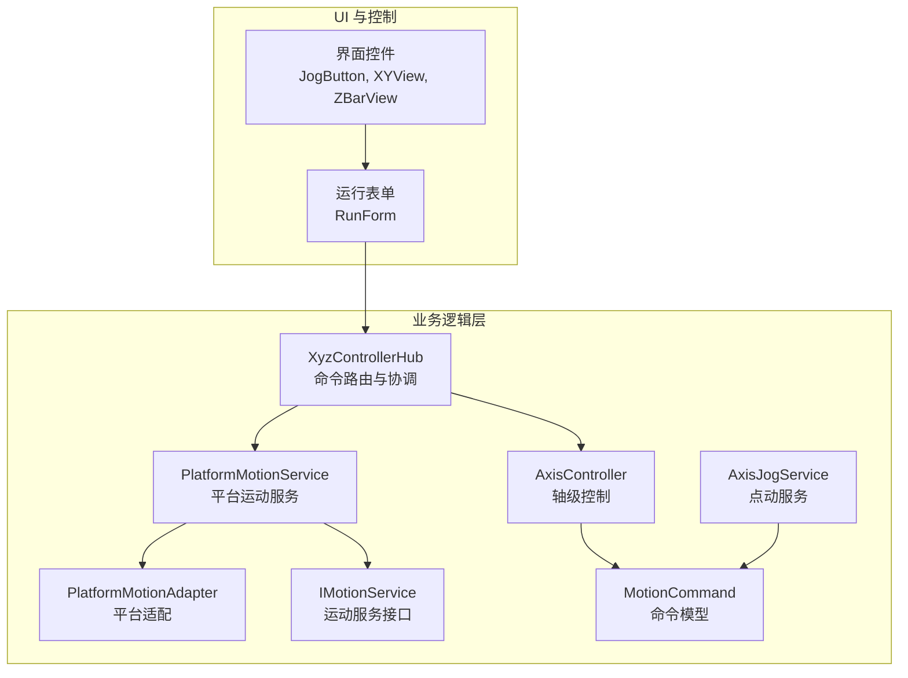
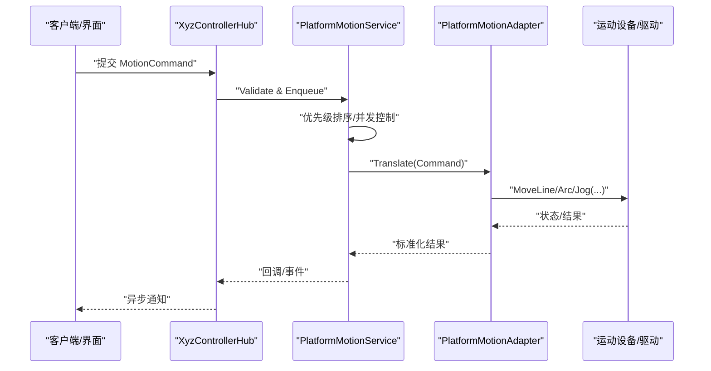
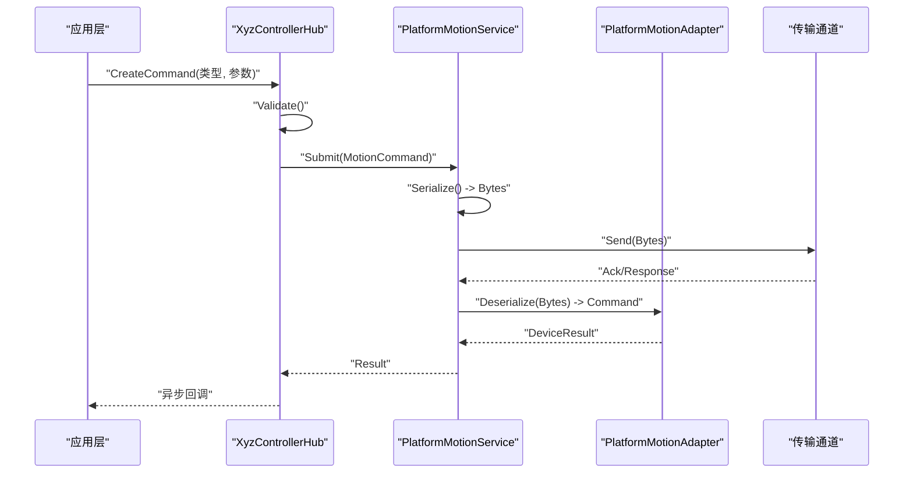
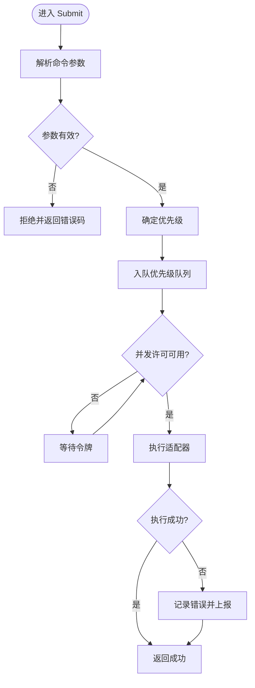
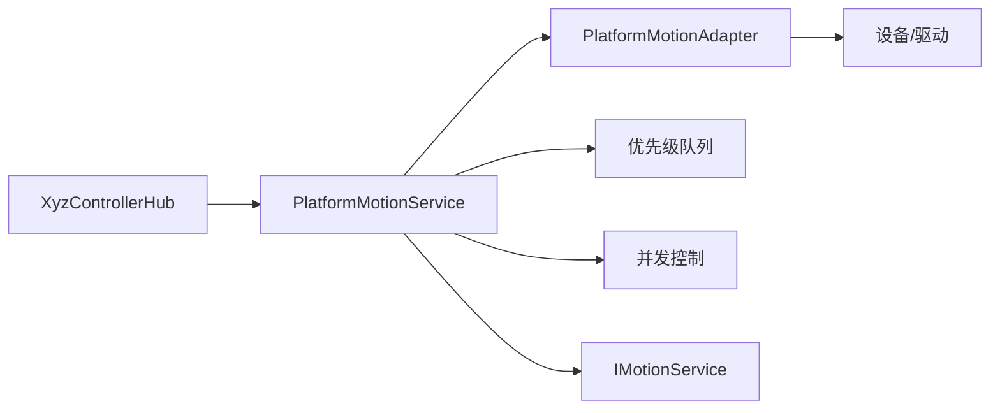

# 运动命令系统

<cite>
**本文档引用的文件**   
- [MotionCommand.cs](file://Logic/MotionCommand.cs)
- [AxisController.cs](file://Logic/AxisController.cs)
- [PlatformMotionService.cs](file://Logic/PlatformMotionService.cs)
- [PlatformMotionAdapter.cs](file://Logic/PlatformMotionAdapter.cs)
- [IMotionService.cs](file://Logic/IMotionService.cs)
- [AxisJogService.cs](file://Logic/AxisJogService.cs)
- [XyzControllerHub.cs](file://Logic/XyzControllerHub.cs)
</cite>

## 目录
1. [简介](#简介)
2. [项目结构](#项目结构)
3. [核心组件](#核心组件)
4. [架构总览](#架构总览)
5. [详细组件分析](#详细组件分析)
6. [依赖关系分析](#依赖关系分析)
7. [性能考虑](#性能考虑)
8. [故障排查指南](#故障排查指南)
9. [结论](#结论)
10. [附录](#附录)

## 简介
本技术文档围绕 MotionCommand 运动命令系统，系统化阐述命令对象的设计模式与数据格式定义，覆盖直线插补、圆弧插补、点动控制等典型运动命令类型。文档同时说明命令的序列化/反序列化与传输机制，解释命令队列管理、优先级处理与并发控制策略，并提供创建、发送与处理命令的实践示例路径，以及命令验证、错误检测与调试工具的使用建议。

## 项目结构
本项目采用分层组织方式：
- Logic 层：承载运动控制核心逻辑，包括命令模型、服务接口与实现、轴控制器、适配器与集线器。
- Controls/UI 层：提供交互控件（如 JogButton、XYView、ZBarView）用于可视化与操作。
- ProcessModule 层：封装各功能模块（如 MainControl、PointJump、Trajectory）的进程入口与设置。
- Resources/Properties：资源与程序集信息。

图表来源
- [XyzControllerHub.cs](file://Logic/XyzControllerHub.cs)
- [AxisController.cs](file://Logic/AxisController.cs)
- [PlatformMotionService.cs](file://Logic/PlatformMotionService.cs)
- [PlatformMotionAdapter.cs](file://Logic/PlatformMotionAdapter.cs)
- [IMotionService.cs](file://Logic/IMotionService.cs)
- [AxisJogService.cs](file://Logic/AxisJogService.cs)
- [MotionCommand.cs](file://Logic/MotionCommand.cs)

章节来源
- [MotionCommand.cs](file://Logic/MotionCommand.cs)
- [AxisController.cs](file://Logic/AxisController.cs)
- [PlatformMotionService.cs](file://Logic/PlatformMotionService.cs)
- [PlatformMotionAdapter.cs](file://Logic/PlatformMotionAdapter.cs)
- [IMotionService.cs](file://Logic/IMotionService.cs)
- [AxisJogService.cs](file://Logic/AxisJogService.cs)
- [XyzControllerHub.cs](file://Logic/XyzControllerHub.cs)

## 核心组件
- 命令模型（MotionCommand）
  - 职责：统一描述一次运动指令，包含命令类型、目标位置/速度/加速度、坐标系、插补参数、校验标志等。
  - 设计要点：使用强类型字段与枚举约束，确保可序列化为 JSON/二进制；支持扩展字段以兼容不同平台。
- 运动服务接口（IMotionService）
  - 职责：抽象平台无关的运动执行能力，定义提交命令、查询状态、取消/停止等方法。
  - 设计要点：面向接口编程，便于替换底层驱动或仿真器。
- 平台运动服务（PlatformMotionService）
  - 职责：将通用命令转换为平台特定调用，负责队列、调度、并发与错误上报。
  - 设计要点：内部维护命令队列与优先级；对异常进行捕获并转化为标准错误码。
- 平台适配器（PlatformMotionAdapter）
  - 职责：对接具体硬件/驱动 API，完成坐标变换、单位换算与安全限幅。
  - 设计要点：隔离平台差异，提供统一的 MoveLine/Arc/Jog 等接口。
- 轴控制器（AxisController）
  - 职责：单轴或多轴的轨迹规划与同步控制，协调插补与加减速曲线。
  - 设计要点：维护轴状态机，保证互斥访问与线程安全。
- 点动服务（AxisJogService）
  - 职责：处理点动（Jog）命令，支持连续/增量模式、方向切换与急停。
  - 设计要点：与 AxisController 协作，按优先级响应 Jog 指令。
- 集线器（XyzControllerHub）
  - 职责：对外暴露统一的命令入口，负责命令解析、分发、结果聚合与事件通知。
  - 设计要点：作为门面模式，屏蔽内部复杂度，提供稳定的 API。

章节来源
- [MotionCommand.cs](file://Logic/MotionCommand.cs)
- [IMotionService.cs](file://Logic/IMotionService.cs)
- [PlatformMotionService.cs](file://Logic/PlatformMotionService.cs)
- [PlatformMotionAdapter.cs](file://Logic/PlatformMotionAdapter.cs)
- [AxisController.cs](file://Logic/AxisController.cs)
- [AxisJogService.cs](file://Logic/AxisJogService.cs)
- [XyzControllerHub.cs](file://Logic/XyzControllerHub.cs)

## 架构总览
系统采用“命令模型 + 服务接口 + 平台适配”的分层架构，上层通过集线器提交命令，服务层负责队列与调度，适配器层对接具体设备。

图表来源
- [XyzControllerHub.cs](file://Logic/XyzControllerHub.cs)
- [PlatformMotionService.cs](file://Logic/PlatformMotionService.cs)
- [PlatformMotionAdapter.cs](file://Logic/PlatformMotionAdapter.cs)

## 详细组件分析

### 命令模型与数据格式（MotionCommand）
- 命令类型
  - 直线插补：指定起点、终点、速度与加速度，可选插补段数与平滑参数。
  - 圆弧插补：指定圆心/半径、起始角与终止角、方向（顺时针/逆时针）。
  - 点动控制：指定轴向、方向、速度与模式（连续/增量）。
  - 其他：回零、暂停、恢复、急停、查询状态等。
- 数据结构要点
  - 唯一标识：命令 ID、时间戳、版本。
  - 执行上下文：坐标系、参考系、补偿项开关。
  - 安全参数：软限位、速度上限、加速度限制。
  - 校验与签名：CRC/哈希、来源认证（可选）。
- 序列化与反序列化
  - 推荐 JSON 格式用于跨进程/网络传输，二进制用于高频场景。
  - 字段命名一致、默认值明确，避免歧义。
  - 支持向后兼容的扩展字段。

章节来源
- [MotionCommand.cs](file://Logic/MotionCommand.cs)

### 运动服务与队列管理（PlatformMotionService）
- 队列模型
  - 多优先级队列：紧急（急停/保护）> 实时（Jog）> 常规（轨迹）> 低优先（配置）。
  - 防抖与合并：相邻同向短距离移动可合并，减少抖动。
- 并发控制
  - 基于令牌桶或信号量限制并发任务数。
  - 原子更新轴状态，避免竞态条件。
- 生命周期
  - 启动时初始化队列与定时器；关闭时清空队列并释放资源。
- 错误处理
  - 捕获适配器异常，转换为标准错误码，触发重试或降级策略。

章节来源
- [PlatformMotionService.cs](file://Logic/PlatformMotionService.cs)

### 平台适配（PlatformMotionAdapter）
- 坐标与单位转换
  - 毫米/脉冲/弧度等单位的统一换算。
  - 坐标系到设备坐标系的映射。
- 安全限幅
  - 依据轴限位与速度/加速度限制裁剪命令。
- 设备通信
  - 封装底层 API 调用，统一返回成功/失败与状态码。

章节来源
- [PlatformMotionAdapter.cs](file://Logic/PlatformMotionAdapter.cs)

### 轴控制器（AxisController）
- 轨迹规划
  - 生成 S 型加减速曲线，计算插补点序列。
- 同步与锁步
  - 多轴插补时保证相位一致，避免丢步。
- 状态机
  - Idle/Running/Paused/Error 等状态迁移，确保一致性。

章节来源
- [AxisController.cs](file://Logic/AxisController.cs)

### 点动服务（AxisJogService）
- 模式支持
  - 连续 Jog：按住即走，松开即停。
  - 增量 Jog：步进固定距离。
- 优先级
  - Jog 命令高于常规轨迹，但低于保护类命令。
- 安全
  - 到达限位自动停止，支持急停中断。

章节来源
- [AxisJogService.cs](file://Logic/AxisJogService.cs)

### 集线器（XyzControllerHub）
- 命令入口
  - 接收命令后做基础校验，分发给对应服务。
- 结果聚合
  - 汇总多轴执行结果，生成统一响应。
- 事件通知
  - 通过回调或消息总线推送执行进度与异常。

章节来源
- [XyzControllerHub.cs](file://Logic/XyzControllerHub.cs)

### 类图（代码级关系）

```mermaid
classDiagram
class MotionCommand {
+string Id
+DateTime Timestamp
+Enum CommandType
+Position Start
+Position End
+double Speed
+double Acceleration
+ArcParams Arc
+JogParams Jog
+bool Validate()
+byte[] Serialize()
static MotionCommand Deserialize(byte[])
}
class IMotionService {
<<interface>>
+Submit(command) Result
+Cancel(id) bool
+Status(id) StatusInfo
}
class PlatformMotionService {
-Queue queue
-Semaphore sem
+Submit(command) Result
+Cancel(id) bool
+Status(id) StatusInfo
-Enqueue(command) void
-ProcessQueue() void
}
class PlatformMotionAdapter {
+MoveLine(params) DeviceResult
+MoveArc(params) DeviceResult
+Jog(params) DeviceResult
-ConvertUnits(value, from, to) double
-ApplyLimits(params) params
}
class AxisController {
-State state
+PlanTrajectory(cmd) Trajectory
+Execute(traj) bool
+Pause() void
+Resume() void
}
class AxisJogService {
+StartJog(axis, dir, speed) void
+StopJog(axis) void
}
class XyzControllerHub {
+Handle(command) Response
-Route(command) void
-Notify(response) void
}
PlatformMotionService ..|> IMotionService
PlatformMotionService --> PlatformMotionAdapter : "调用"
AxisController --> MotionCommand : "消费"
AxisJogService --> MotionCommand : "消费"
XyzControllerHub --> PlatformMotionService : "委托"
```

图表来源
- [MotionCommand.cs](file://Logic/MotionCommand.cs)
- [IMotionService.cs](file://Logic/IMotionService.cs)
- [PlatformMotionService.cs](file://Logic/PlatformMotionService.cs)
- [PlatformMotionAdapter.cs](file://Logic/PlatformMotionAdapter.cs)
- [AxisController.cs](file://Logic/AxisController.cs)
- [AxisJogService.cs](file://Logic/AxisJogService.cs)
- [XyzControllerHub.cs](file://Logic/XyzControllerHub.cs)

### 序列化和传输流程（时序图）

图表来源
- [XyzControllerHub.cs](file://Logic/XyzControllerHub.cs)
- [PlatformMotionService.cs](file://Logic/PlatformMotionService.cs)
- [PlatformMotionAdapter.cs](file://Logic/PlatformMotionAdapter.cs)

### 命令验证与优先级处理（流程图）

图表来源
- [PlatformMotionService.cs](file://Logic/PlatformMotionService.cs)
- [PlatformMotionAdapter.cs](file://Logic/PlatformMotionAdapter.cs)

## 依赖关系分析
- 松耦合
  - 通过 IMotionService 解耦上层与平台实现。
  - PlatformMotionAdapter 屏蔽设备差异。
- 内聚性
  - AxisController 专注轨迹与同步。
  - AxisJogService 专注 Jog 行为。
- 外部依赖
  - 传输通道（如消息总线/串口/网络）由 Svc/Adapter 封装。
  - 设备驱动 API 由 Adapter 统一调用。

图表来源
- [XyzControllerHub.cs](file://Logic/XyzControllerHub.cs)
- [PlatformMotionService.cs](file://Logic/PlatformMotionService.cs)
- [PlatformMotionAdapter.cs](file://Logic/PlatformMotionAdapter.cs)
- [IMotionService.cs](file://Logic/IMotionService.cs)

章节来源
- [XyzControllerHub.cs](file://Logic/XyzControllerHub.cs)
- [PlatformMotionService.cs](file://Logic/PlatformMotionService.cs)
- [PlatformMotionAdapter.cs](file://Logic/PlatformMotionAdapter.cs)
- [IMotionService.cs](file://Logic/IMotionService.cs)

## 性能考虑
- 队列与调度
  - 使用无锁队列或环形缓冲降低争用。
  - 批量合并相近命令，减少抖动与开销。
- 序列化
  - 高频路径使用二进制序列化，避免 GC 压力。
  - 复用缓冲区，减少分配。
- 并发
  - 合理设置并发度，避免阻塞 I/O。
  - 使用超时与退避策略防止雪崩。
- 轨迹规划
  - 预计算插补点，离线生成轨迹表。
  - 动态调整步长以平衡精度与吞吐。

[本节为通用指导，不直接分析具体文件]

## 故障排查指南
- 常见问题定位
  - 命令被拒绝：检查参数范围、坐标系与单位。
  - 执行超时：查看队列长度、并发令牌与设备响应。
  - 轨迹异常：核对插补参数、加减速曲线与限位。
- 日志与诊断
  - 记录命令 ID、时间戳、优先级与执行耗时。
  - 输出适配器原始返回码与设备状态。
- 调试工具
  - 命令回放：保存命令流并回放复现问题。
  - 模拟设备：使用 Mock 适配器验证上层逻辑。
  - 监控面板：展示队列深度、并发度与错误率。

章节来源
- [PlatformMotionService.cs](file://Logic/PlatformMotionService.cs)
- [PlatformMotionAdapter.cs](file://Logic/PlatformMotionAdapter.cs)

## 结论
MotionCommand 系统通过清晰的命令模型与服务分层，实现了高内聚、低耦合的运动控制架构。借助优先级队列、并发控制与平台适配，系统在稳定性与可扩展性上具备良好表现。建议在工程实践中强化参数校验、完善日志与监控，并结合模拟设备进行充分测试。

[本节为总结性内容，不直接分析具体文件]

## 附录
- 命令类型速查
  - 直线插补：起点/终点、速度、加速度、平滑系数。
  - 圆弧插补：圆心/半径、起止角、方向。
  - 点动控制：轴向、方向、速度、模式。
- 最佳实践
  - 始终在提交前进行参数校验。
  - 为关键命令添加唯一 ID 以便追踪。
  - 使用统一的错误码与消息格式。
- 参考实现路径
  - 命令创建与校验：[MotionCommand.cs](file://Logic/MotionCommand.cs)
  - 服务提交与队列：[PlatformMotionService.cs](file://Logic/PlatformMotionService.cs)
  - 平台适配与限幅：[PlatformMotionAdapter.cs](file://Logic/PlatformMotionAdapter.cs)
  - 轴控制与轨迹：[AxisController.cs](file://Logic/AxisController.cs)
  - 点动逻辑：[AxisJogService.cs](file://Logic/AxisJogService.cs)
  - 统一入口：[XyzControllerHub.cs](file://Logic/XyzControllerHub.cs)