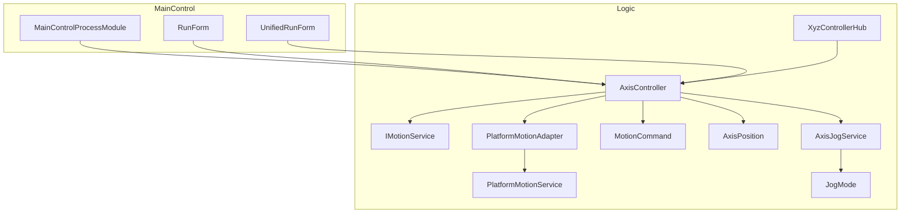
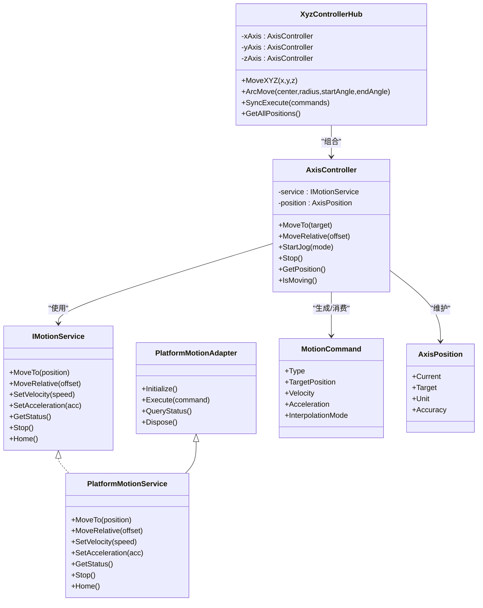
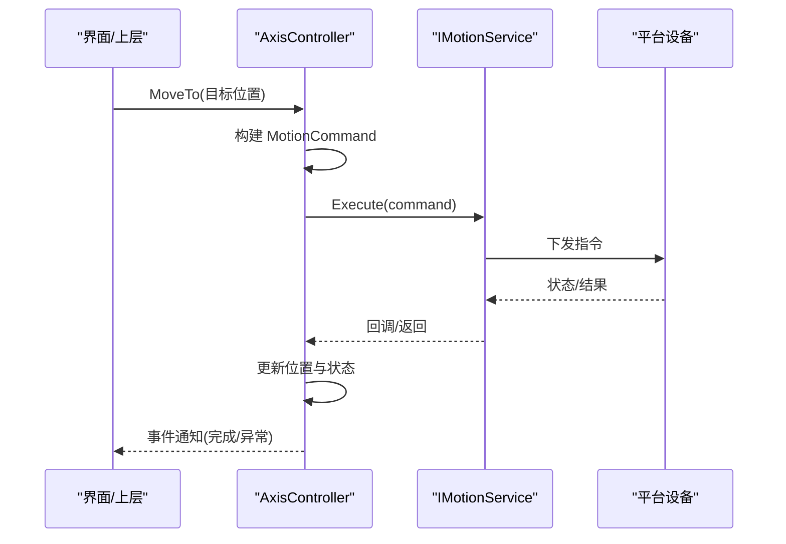
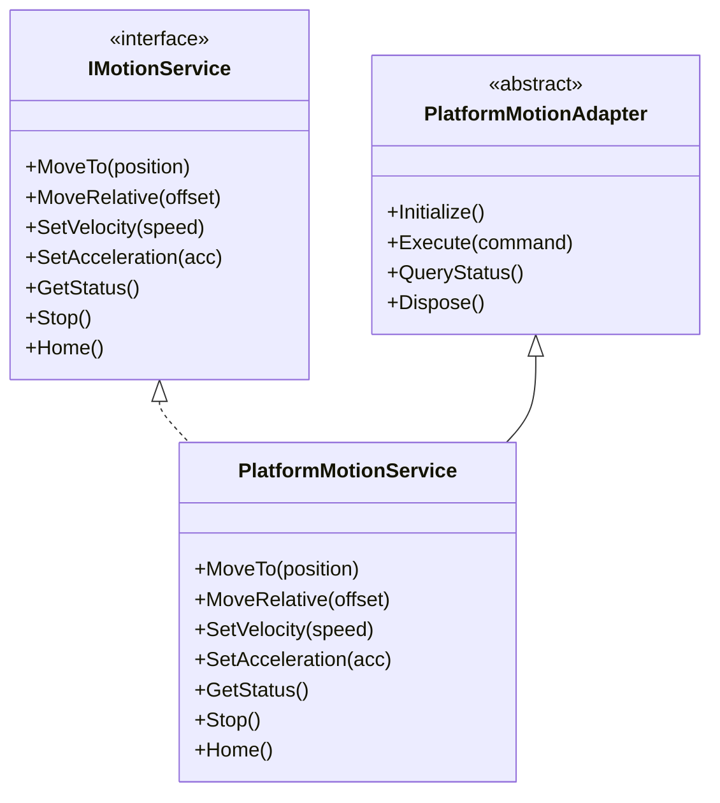
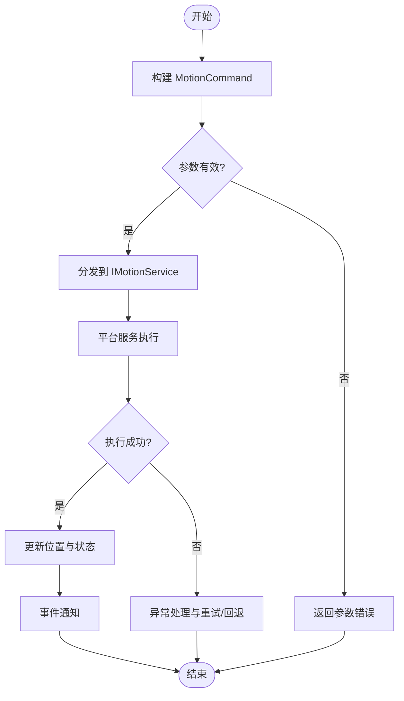
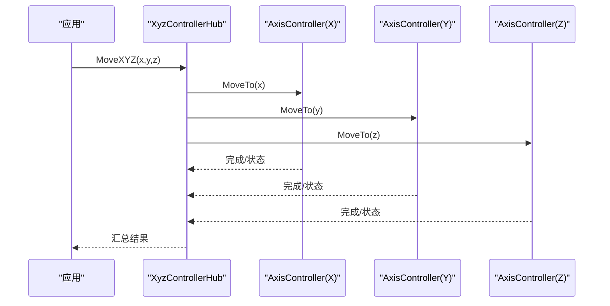
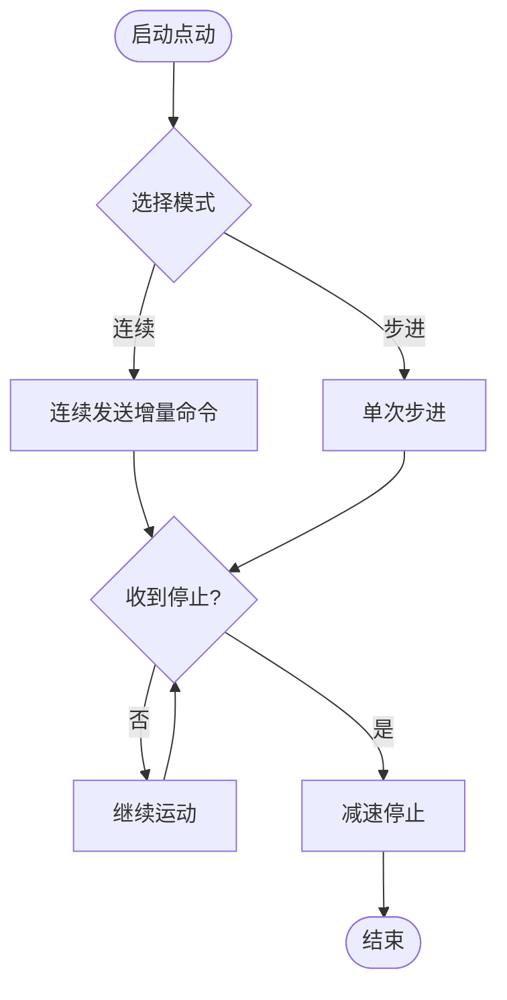
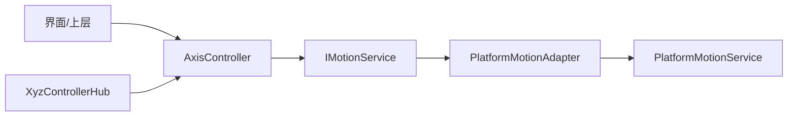

# 运动控制系统

<cite>
**本文引用的文件**   
- [AxisController.cs](file://Logic/AxisController.cs)
- [IMotionService.cs](file://Logic/IMotionService.cs)
- [MotionCommand.cs](file://Logic/MotionCommand.cs)
- [PlatformMotionAdapter.cs](file://Logic/PlatformMotionAdapter.cs)
- [PlatformMotionService.cs](file://Logic/PlatformMotionService.cs)
- [XyzControllerHub.cs](file://Logic/XyzControllerHub.cs)
- [AxisPosition.cs](file://Logic/AxisPosition.cs)
- [AxisJogService.cs](file://Logic/AxisJogService.cs)
- [JogMode.cs](file://Logic/JogMode.cs)
- [MainControlProcessModule.cs](file://MainControl/MainControlProcessModule.cs)
- [RunForm.cs](file://MainControl/RunForm.cs)
- [UnifiedRunForm.cs](file://MainControl/UnifiedRunForm.cs)
</cite>

## 目录
1. [简介](#简介)
2. [项目结构](#项目结构)
3. [核心组件](#核心组件)
4. [架构总览](#架构总览)
5. [详细组件分析](#详细组件分析)
6. [依赖关系分析](#依赖关系分析)
7. [性能与并发](#性能与并发)
8. [故障排查指南](#故障排查指南)
9. [结论](#结论)
10. [附录：扩展与示例](#附录扩展与示例)

## 简介
本技术文档面向 ProcessModules 的运动控制系统，重点阐述轴控制器（AxisController）的设计与实现、多轴协调控制、位置管理与运动状态监控；解释 IMotionService 接口的设计理念与平台适配机制；文档化 MotionCommand 运动命令系统的消息格式与处理流程；说明 XyzControllerHub 作为 XYZ 控制器中心的作用与协调机制；并提供 PlatformMotionAdapter 的实现方法与扩展指南。同时给出异步操作处理、线程安全与性能优化的最佳实践，以及自定义运动控制与平台适配的具体示例路径。

## 项目结构
本项目采用分层与按功能模块组织的方式：
- Logic：运动控制核心逻辑，包含轴控制、服务接口、命令模型、平台适配与XYZ中枢等。
- MainControl：主控制界面与运行表单，集成运动控制能力。
- Controls：UI控件与辅助工具。
- 其他业务模块（如 PointJump、Trajectory）复用 Logic 中的运动控制能力。

图表来源
- [AxisController.cs:1-200](file://Logic/AxisController.cs#L1-L200)
- [IMotionService.cs:1-200](file://Logic/IMotionService.cs#L1-L200)
- [PlatformMotionAdapter.cs:1-200](file://Logic/PlatformMotionAdapter.cs#L1-L200)
- [PlatformMotionService.cs:1-200](file://Logic/PlatformMotionService.cs#L1-L200)
- [MotionCommand.cs:1-200](file://Logic/MotionCommand.cs#L1-L200)
- [XyzControllerHub.cs:1-200](file://Logic/XyzControllerHub.cs#L1-L200)
- [AxisPosition.cs:1-200](file://Logic/AxisPosition.cs#L1-L200)
- [AxisJogService.cs:1-200](file://Logic/AxisJogService.cs#L1-L200)
- [JogMode.cs:1-200](file://Logic/JogMode.cs#L1-L200)
- [MainControlProcessModule.cs:1-200](file://MainControl/MainControlProcessModule.cs#L1-L200)
- [RunForm.cs:1-200](file://MainControl/RunForm.cs#L1-L200)
- [UnifiedRunForm.cs:1-200](file://MainControl/UnifiedRunForm.cs#L1-L200)

章节来源
- [MainControlProcessModule.cs:1-200](file://MainControl/MainControlProcessModule.cs#L1-L200)
- [RunForm.cs:1-200](file://MainControl/RunForm.cs#L1-L200)
- [UnifiedRunForm.cs:1-200](file://MainControl/UnifiedRunForm.cs#L1-L200)

## 核心组件
- AxisController：轴控制器，负责单轴或多轴的运动编排、位置管理、状态监控与事件通知。
- IMotionService：运动服务接口，定义平台无关的运动能力契约，便于不同硬件/驱动平台的适配。
- PlatformMotionAdapter：平台适配器基类，封装底层设备差异，向上暴露统一接口。
- PlatformMotionService：具体平台服务实现，对接特定硬件或仿真环境。
- MotionCommand：运动命令数据模型，描述目标位置、速度、加速度、插补模式等参数。
- XyzControllerHub：XYZ 控制器中心，协调三轴联动、轨迹规划与同步执行。
- AxisPosition：轴位置数据结构，记录当前/目标位置、单位与精度。
- AxisJogService：点动服务，提供手动/自动点动模式与加减速控制。
- JogMode：点动模式枚举，区分连续点动、步进点动等。

章节来源
- [AxisController.cs:1-200](file://Logic/AxisController.cs#L1-L200)
- [IMotionService.cs:1-200](file://Logic/IMotionService.cs#L1-L200)
- [PlatformMotionAdapter.cs:1-200](file://Logic/PlatformMotionAdapter.cs#L1-L200)
- [PlatformMotionService.cs:1-200](file://Logic/PlatformMotionService.cs#L1-L200)
- [MotionCommand.cs:1-200](file://Logic/MotionCommand.cs#L1-L200)
- [XyzControllerHub.cs:1-200](file://Logic/XyzControllerHub.cs#L1-L200)
- [AxisPosition.cs:1-200](file://Logic/AxisPosition.cs#L1-L200)
- [AxisJogService.cs:1-200](file://Logic/AxisJogService.cs#L1-L200)
- [JogMode.cs:1-200](file://Logic/JogMode.cs#L1-L200)

## 架构总览
系统采用“接口抽象 + 适配器”的分层架构：
- 上层应用通过 IMotionService 调用运动能力，屏蔽平台差异。
- AxisController 基于 IMotionService 实现轴级控制与多轴协调。
- XyzControllerHub 聚合多个 AxisController，完成XYZ联动与轨迹编排。
- PlatformMotionAdapter/PlatformMotionService 将高层指令映射到底层设备API。

图表来源
- [IMotionService.cs:1-200](file://Logic/IMotionService.cs#L1-L200)
- [PlatformMotionAdapter.cs:1-200](file://Logic/PlatformMotionAdapter.cs#L1-L200)
- [PlatformMotionService.cs:1-200](file://Logic/PlatformMotionService.cs#L1-L200)
- [AxisController.cs:1-200](file://Logic/AxisController.cs#L1-L200)
- [XyzControllerHub.cs:1-200](file://Logic/XyzControllerHub.cs#L1-L200)
- [MotionCommand.cs:1-200](file://Logic/MotionCommand.cs#L1-L200)
- [AxisPosition.cs:1-200](file://Logic/AxisPosition.cs#L1-L200)

## 详细组件分析

### AxisController 设计与实现
- 职责：单轴运动编排、位置跟踪、状态监控、点动控制、错误恢复。
- 关键能力：
  - MoveTo/MoveRelative：绝对/相对移动，内部构造 MotionCommand。
  - StartJog/Stop：点动模式切换与停止。
  - GetPosition/IsMoving：位置查询与运动状态判断。
  - 事件通知：位置更新、运动完成、异常上报。
- 多轴协调：由 XyzControllerHub 调度，AxisController 专注单轴执行与反馈。
- 线程安全：对位置与状态字段进行读写保护，避免竞态条件。

图表来源
- [AxisController.cs:1-200](file://Logic/AxisController.cs#L1-L200)
- [IMotionService.cs:1-200](file://Logic/IMotionService.cs#L1-L200)
- [MotionCommand.cs:1-200](file://Logic/MotionCommand.cs#L1-L200)

章节来源
- [AxisController.cs:1-200](file://Logic/AxisController.cs#L1-L200)
- [AxisPosition.cs:1-200](file://Logic/AxisPosition.cs#L1-L200)
- [AxisJogService.cs:1-200](file://Logic/AxisJogService.cs#L1-L200)
- [JogMode.cs:1-200](file://Logic/JogMode.cs#L1-L200)

### IMotionService 接口与平台适配
- 设计理念：以接口隔离平台差异，上层仅依赖 IMotionService。
- 适配机制：
  - PlatformMotionAdapter：抽象适配器，定义初始化、执行、查询、资源释放等通用方法。
  - PlatformMotionService：具体实现，封装底层驱动/协议细节。
- 扩展指南：
  - 新增平台时，继承 PlatformMotionAdapter 并实现 IMotionService 方法。
  - 在配置中注册新服务实例，替换默认实现。
  - 确保线程安全与异常边界清晰，避免阻塞调用。

图表来源
- [IMotionService.cs:1-200](file://Logic/IMotionService.cs#L1-L200)
- [PlatformMotionAdapter.cs:1-200](file://Logic/PlatformMotionAdapter.cs#L1-L200)
- [PlatformMotionService.cs:1-200](file://Logic/PlatformMotionService.cs#L1-L200)

章节来源
- [IMotionService.cs:1-200](file://Logic/IMotionService.cs#L1-L200)
- [PlatformMotionAdapter.cs:1-200](file://Logic/PlatformMotionAdapter.cs#L1-L200)
- [PlatformMotionService.cs:1-200](file://Logic/PlatformMotionService.cs#L1-L200)

### MotionCommand 运动命令系统
- 消息格式：包含命令类型、目标位置、速度、加速度、插补模式等字段。
- 处理流程：
  - 上层构造命令对象。
  - AxisController 校验参数并下发至 IMotionService。
  - 平台服务解析命令并驱动设备。
  - 设备状态回传，更新控制器状态与位置。

图表来源
- [MotionCommand.cs:1-200](file://Logic/MotionCommand.cs#L1-L200)
- [AxisController.cs:1-200](file://Logic/AxisController.cs#L1-L200)
- [IMotionService.cs:1-200](file://Logic/IMotionService.cs#L1-L200)

章节来源
- [MotionCommand.cs:1-200](file://Logic/MotionCommand.cs#L1-L200)

### XyzControllerHub 协调机制
- 作用：集中管理X/Y/Z三轴控制器，提供联动与轨迹能力。
- 协调机制：
  - 接收高层轨迹指令，分解为各轴子命令。
  - 同步执行，保证多轴时序一致性。
  - 汇总状态与位置，提供全局查询。
- 典型用法：直线插补、圆弧插补、同步启停。

图表来源
- [XyzControllerHub.cs:1-200](file://Logic/XyzControllerHub.cs#L1-L200)
- [AxisController.cs:1-200](file://Logic/AxisController.cs#L1-L200)

章节来源
- [XyzControllerHub.cs:1-200](file://Logic/XyzControllerHub.cs#L1-L200)

### 点动控制（AxisJogService 与 JogMode）
- 点动模式：支持连续点动、步进点动等模式。
- 控制流程：启动点动后持续发送增量命令，停止时平滑减速。
- 与 AxisController 协作：AxisController 委托 AxisJogService 管理点动生命周期。

图表来源
- [AxisJogService.cs:1-200](file://Logic/AxisJogService.cs#L1-L200)
- [JogMode.cs:1-200](file://Logic/JogMode.cs#L1-L200)
- [AxisController.cs:1-200](file://Logic/AxisController.cs#L1-L200)

章节来源
- [AxisJogService.cs:1-200](file://Logic/AxisJogService.cs#L1-L200)
- [JogMode.cs:1-200](file://Logic/JogMode.cs#L1-L200)

## 依赖关系分析
- 松耦合设计：上层依赖 IMotionService 接口，不感知平台实现。
- 组合优于继承：XyzControllerHub 组合多个 AxisController，避免深层继承链。
- 适配器模式：PlatformMotionAdapter/PlatformMotionService 解耦平台差异。
- 潜在循环依赖：需确保 AxisController 不反向依赖 XyzControllerHub，保持单向依赖。

图表来源
- [AxisController.cs:1-200](file://Logic/AxisController.cs#L1-L200)
- [IMotionService.cs:1-200](file://Logic/IMotionService.cs#L1-L200)
- [PlatformMotionAdapter.cs:1-200](file://Logic/PlatformMotionAdapter.cs#L1-L200)
- [PlatformMotionService.cs:1-200](file://Logic/PlatformMotionService.cs#L1-L200)
- [XyzControllerHub.cs:1-200](file://Logic/XyzControllerHub.cs#L1-L200)

章节来源
- [AxisController.cs:1-200](file://Logic/AxisController.cs#L1-L200)
- [XyzControllerHub.cs:1-200](file://Logic/XyzControllerHub.cs#L1-L200)
- [IMotionService.cs:1-200](file://Logic/IMotionService.cs#L1-L200)
- [PlatformMotionAdapter.cs:1-200](file://Logic/PlatformMotionAdapter.cs#L1-L200)
- [PlatformMotionService.cs:1-200](file://Logic/PlatformMotionService.cs#L1-L200)

## 性能与并发
- 异步操作：所有耗时IO与设备通信应使用异步API，避免阻塞UI线程。
- 线程安全：共享状态（位置、状态标志）需加锁或使用不可变对象；事件回调注意跨线程更新UI。
- 批量命令：合并小粒度命令，减少通信开销。
- 缓存与去抖：高频状态查询可引入本地缓存与去抖策略。
- 资源管理：及时释放设备句柄与缓冲区，避免内存泄漏。

[本节为通用指导，无需代码来源]

## 故障排查指南
- 常见问题：
  - 命令超时：检查设备连接与网络延迟，增加超时阈值与重试策略。
  - 位置漂移：校准编码器零点，检查机械间隙与回差补偿。
  - 多轴不同步：调整插补算法参数，确保各轴速度/加速度匹配。
- 诊断步骤：
  - 启用日志与状态快照，定位失败阶段。
  - 使用最小化用例复现问题，逐步排除外部因素。
  - 验证 IMotionService 实现是否抛出明确异常。

章节来源
- [AxisController.cs:1-200](file://Logic/AxisController.cs#L1-L200)
- [PlatformMotionService.cs:1-200](file://Logic/PlatformMotionService.cs#L1-L200)

## 结论
本运动控制系统通过清晰的接口抽象与适配器模式，实现了平台无关的运动控制能力。AxisController 聚焦单轴控制与状态管理，XyzControllerHub 负责多轴协调与轨迹编排，IMotionService 与 PlatformMotionAdapter/PlatformMotionService 共同构成可扩展的平台适配层。遵循异步、线程安全与性能优化实践，可构建稳定高效的运动控制应用。

[本节为总结性内容，无需代码来源]

## 附录：扩展与示例
- 自定义运动控制：
  - 在 AxisController 中新增高级运动方法（如S曲线加减速），并通过 IMotionService 下发。
  - 参考路径：[AxisController.cs:1-200](file://Logic/AxisController.cs#L1-L200)
- 平台适配扩展：
  - 继承 PlatformMotionAdapter，实现 IMotionService 的底层设备交互。
  - 在应用中注册新服务实例，替换默认实现。
  - 参考路径：[PlatformMotionAdapter.cs:1-200](file://Logic/PlatformMotionAdapter.cs#L1-L200)、[PlatformMotionService.cs:1-200](file://Logic/PlatformMotionService.cs#L1-L200)
- 界面集成示例：
  - 在 RunForm/UnifiedRunForm 中调用 AxisController 完成按钮驱动与状态显示。
  - 参考路径：[RunForm.cs:1-200](file://MainControl/RunForm.cs#L1-L200)、[UnifiedRunForm.cs:1-200](file://MainControl/UnifiedRunForm.cs#L1-L200)

章节来源
- [AxisController.cs:1-200](file://Logic/AxisController.cs#L1-L200)
- [PlatformMotionAdapter.cs:1-200](file://Logic/PlatformMotionAdapter.cs#L1-L200)
- [PlatformMotionService.cs:1-200](file://Logic/PlatformMotionService.cs#L1-L200)
- [RunForm.cs:1-200](file://MainControl/RunForm.cs#L1-L200)
- [UnifiedRunForm.cs:1-200](file://MainControl/UnifiedRunForm.cs#L1-L200)