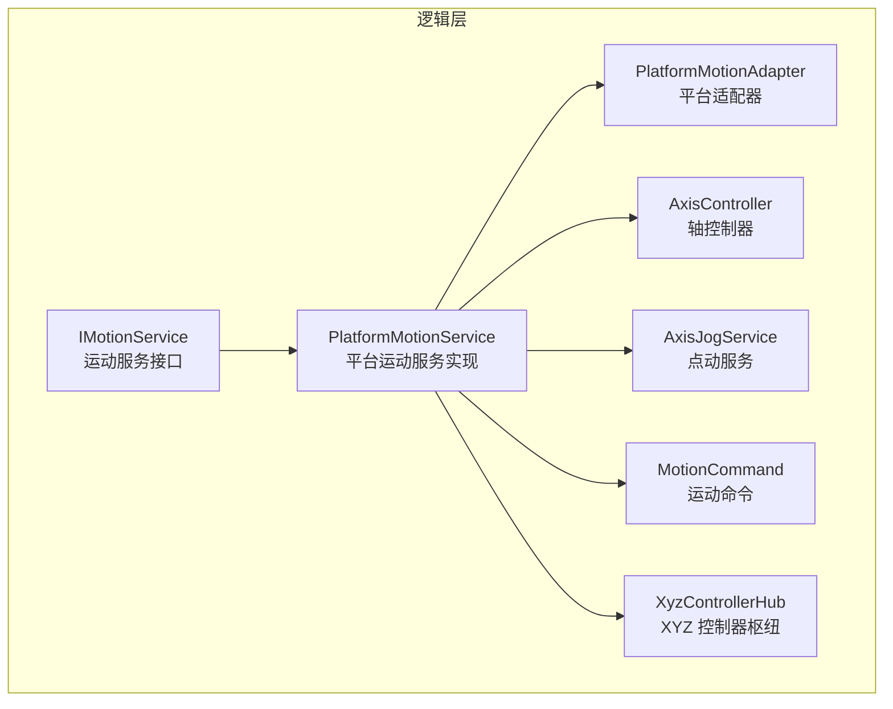
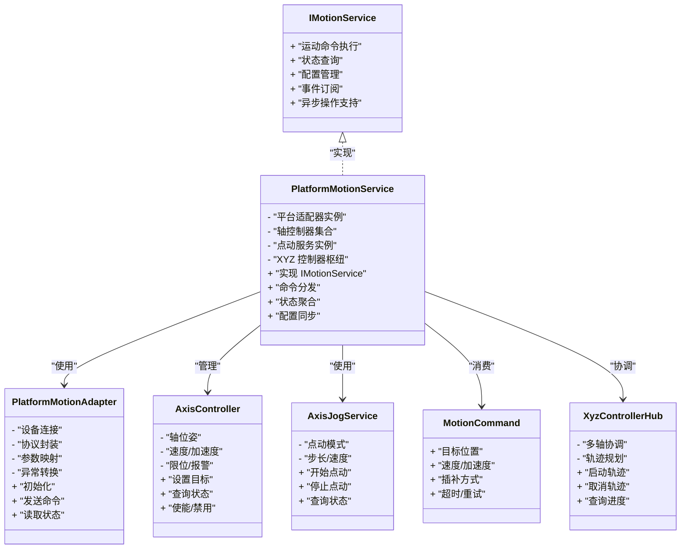
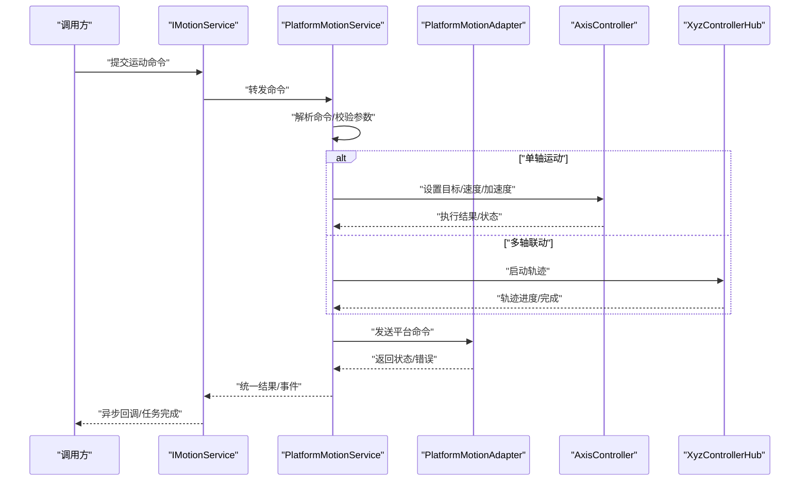
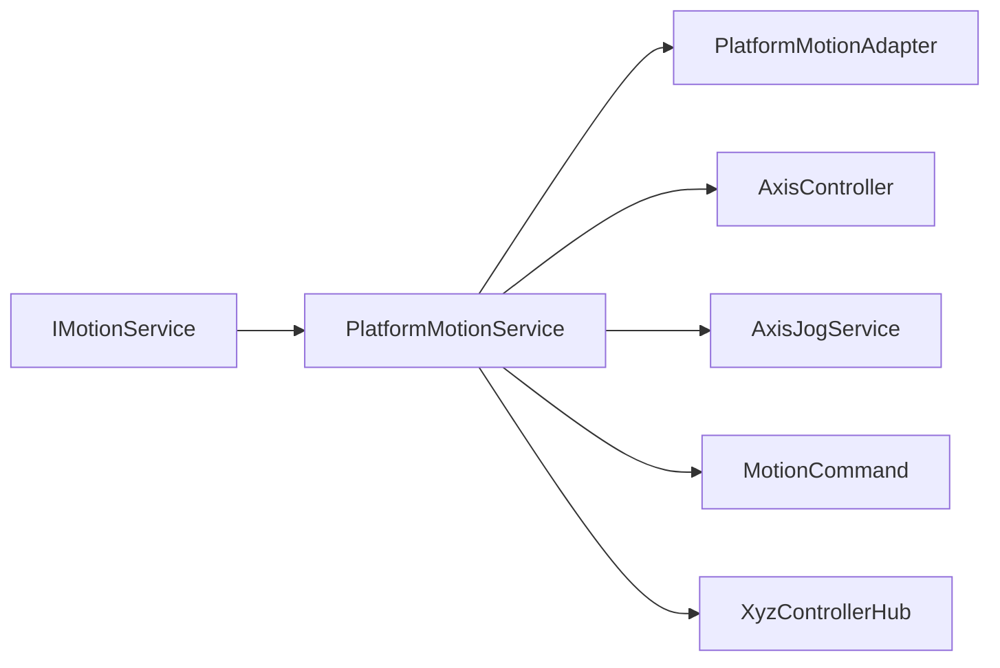

# 运动服务接口

<cite>
**本文引用的文件**   
- [IMotionService.cs](file://Logic/IMotionService.cs)
- [PlatformMotionService.cs](file://Logic/PlatformMotionService.cs)
- [PlatformMotionAdapter.cs](file://Logic/PlatformMotionAdapter.cs)
- [AxisController.cs](file://Logic/AxisController.cs)
- [AxisJogService.cs](file://Logic/AxisJogService.cs)
- [MotionCommand.cs](file://Logic/MotionCommand.cs)
- [XyzControllerHub.cs](file://Logic/XyzControllerHub.cs)
</cite>

## 目录
1. [简介](#简介)
2. [项目结构](#项目结构)
3. [核心组件](#核心组件)
4. [架构总览](#架构总览)
5. [详细组件分析](#详细组件分析)
6. [依赖关系分析](#依赖关系分析)
7. [性能与并发](#性能与并发)
8. [故障排查指南](#故障排查指南)
9. [结论](#结论)
10. [附录：示例与最佳实践](#附录示例与最佳实践)

## 简介
本技术文档围绕 IMotionService 运动服务接口，系统化阐述其设计理念、抽象层次与统一控制 API。重点说明 PlatformMotionService 的具体实现与平台适配机制，并完整文档化公共方法、事件与属性，涵盖运动命令执行、状态查询与配置管理。同时解释异步操作模式与回调机制，提供自定义运动服务接口与多硬件平台集成的参考路径，以及错误处理、超时控制和资源管理的最佳实践。

## 项目结构
本项目采用分层与按功能组织相结合的结构：
- Logic 层：定义运动服务接口、平台适配与服务实现，以及轴控制、点动服务、运动命令等核心类型。
- Controls/MainControl/Trajectory/PointJump 等模块：面向 UI 或业务场景的集成使用层。

图表来源
- [IMotionService.cs](file://Logic/IMotionService.cs)
- [PlatformMotionService.cs](file://Logic/PlatformMotionService.cs)
- [PlatformMotionAdapter.cs](file://Logic/PlatformMotionAdapter.cs)
- [AxisController.cs](file://Logic/AxisController.cs)
- [AxisJogService.cs](file://Logic/AxisJogService.cs)
- [MotionCommand.cs](file://Logic/MotionCommand.cs)
- [XyzControllerHub.cs](file://Logic/XyzControllerHub.cs)

章节来源
- [IMotionService.cs](file://Logic/IMotionService.cs)
- [PlatformMotionService.cs](file://Logic/PlatformMotionService.cs)
- [PlatformMotionAdapter.cs](file://Logic/PlatformMotionAdapter.cs)
- [AxisController.cs](file://Logic/AxisController.cs)
- [AxisJogService.cs](file://Logic/AxisJogService.cs)
- [MotionCommand.cs](file://Logic/MotionCommand.cs)
- [XyzControllerHub.cs](file://Logic/XyzControllerHub.cs)

## 核心组件
- IMotionService：统一的运动控制抽象接口，屏蔽底层硬件差异，向上提供一致的运动命令执行、状态查询与配置管理能力。
- PlatformMotionService：具体平台运动服务实现，负责将 IMotionService 的统一调用映射到具体平台驱动或设备。
- PlatformMotionAdapter：平台适配器，封装不同硬件平台的通信协议、初始化、参数映射与异常转换。
- AxisController：轴级控制器，管理单轴或多轴的位姿、速度、加速度、限位等。
- AxisJogService：点动（Jog）服务，提供增量移动、连续点动、停止等能力。
- MotionCommand：运动命令模型，描述目标位置、速度、加速度、插补方式等。
- XyzControllerHub：XYZ 三轴协同控制器，协调多轴联动与轨迹规划。

章节来源
- [IMotionService.cs](file://Logic/IMotionService.cs)
- [PlatformMotionService.cs](file://Logic/PlatformMotionService.cs)
- [PlatformMotionAdapter.cs](file://Logic/PlatformMotionAdapter.cs)
- [AxisController.cs](file://Logic/AxisController.cs)
- [AxisJogService.cs](file://Logic/AxisJogService.cs)
- [MotionCommand.cs](file://Logic/MotionCommand.cs)
- [XyzControllerHub.cs](file://Logic/XyzControllerHub.cs)

## 架构总览
IMotionService 作为上层统一入口，PlatformMotionService 作为中间适配层，PlatformMotionAdapter 对接具体硬件。AxisController、AxisJogService、XyzControllerHub 提供轴级与多轴协同能力，MotionCommand 贯穿命令传递。

图表来源
- [IMotionService.cs](file://Logic/IMotionService.cs)
- [PlatformMotionService.cs](file://Logic/PlatformMotionService.cs)
- [PlatformMotionAdapter.cs](file://Logic/PlatformMotionAdapter.cs)
- [AxisController.cs](file://Logic/AxisController.cs)
- [AxisJogService.cs](file://Logic/AxisJogService.cs)
- [MotionCommand.cs](file://Logic/MotionCommand.cs)
- [XyzControllerHub.cs](file://Logic/XyzControllerHub.cs)

## 详细组件分析

### IMotionService 接口设计
- 设计理念：以“命令-状态-配置”为核心抽象，屏蔽平台差异，提供一致的异步 API。
- 抽象层次：
  - 命令层：统一运动命令模型与执行入口。
  - 状态层：统一设备/轴状态查询与事件上报。
  - 配置层：统一参数读写与持久化。
- 关键能力：
  - 运动命令执行：支持单轴、多轴联动、点动、急停等。
  - 状态查询：位置、速度、报警、使能状态等。
  - 配置管理：速度、加速度、步长、限位阈值等。
  - 事件与回调：完成、错误、状态变更等异步通知。
  - 超时与重试：可配置的超时策略与重试次数。

章节来源
- [IMotionService.cs](file://Logic/IMotionService.cs)

### PlatformMotionService 实现与平台适配
- 职责：
  - 将 IMotionService 的通用调用转换为平台特定命令。
  - 聚合轴控制器与 XYZ 控制器，统一调度。
  - 通过 PlatformMotionAdapter 与硬件交互。
- 平台适配机制：
  - 适配器工厂：根据配置选择具体适配器实现。
  - 参数映射：将高层参数映射为平台协议字段。
  - 异常转换：将平台异常转换为统一错误码与消息。
  - 生命周期管理：初始化、连接、断开、重连。
- 异步与回调：
  - 基于任务/回调的异步执行，避免阻塞 UI。
  - 事件总线发布状态变化与错误信息。

章节来源
- [PlatformMotionService.cs](file://Logic/PlatformMotionService.cs)
- [PlatformMotionAdapter.cs](file://Logic/PlatformMotionAdapter.cs)

### AxisController 轴控制器
- 职责：管理单个轴的位姿、速度、加速度、限位、报警与使能。
- 关键能力：
  - 设置目标位置与速度曲线。
  - 查询当前位置、速度与状态。
  - 启停、复位、回零。
  - 限位保护与软/硬限位处理。
- 与服务的协作：被 PlatformMotionService 统一管理，参与多轴协调。

章节来源
- [AxisController.cs](file://Logic/AxisController.cs)

### AxisJogService 点动服务
- 职责：提供点动控制，包括增量移动、连续点动、停止与限速。
- 关键能力：
  - 开始/停止点动。
  - 设置步长与速度。
  - 查询点动状态与剩余距离。
- 与服务的协作：由 PlatformMotionService 在需要时启用。

章节来源
- [AxisJogService.cs](file://Logic/AxisJogService.cs)

### MotionCommand 运动命令
- 职责：描述一次运动的完整参数，如目标位置、速度、加速度、插补方式、超时与重试策略。
- 关键属性：
  - 目标位置（单轴/多轴）。
  - 速度与加速度限制。
  - 插补模式（直线、圆弧等）。
  - 超时与重试配置。
- 与服务的协作：作为 IMotionService 的命令载体，贯穿执行链路。

章节来源
- [MotionCommand.cs](file://Logic/MotionCommand.cs)

### XyzControllerHub 三轴控制器枢纽
- 职责：协调 XYZ 三轴联动，进行轨迹规划与同步控制。
- 关键能力：
  - 启动/取消轨迹。
  - 查询轨迹进度与状态。
  - 处理多轴同步与冲突。
- 与服务的协作：由 PlatformMotionService 调用，对外暴露统一接口。

章节来源
- [XyzControllerHub.cs](file://Logic/XyzControllerHub.cs)

### 典型调用序列（命令执行）

图表来源
- [IMotionService.cs](file://Logic/IMotionService.cs)
- [PlatformMotionService.cs](file://Logic/PlatformMotionService.cs)
- [PlatformMotionAdapter.cs](file://Logic/PlatformMotionAdapter.cs)
- [AxisController.cs](file://Logic/AxisController.cs)
- [XyzControllerHub.cs](file://Logic/XyzControllerHub.cs)

## 依赖关系分析
- 耦合度：
  - IMotionService 与 PlatformMotionService 松耦合，便于替换实现。
  - PlatformMotionService 对 Adapter、AxisController、XyzControllerHub 有明确依赖，职责清晰。
- 外部依赖：
  - PlatformMotionAdapter 封装硬件通信细节，降低上层复杂度。
- 潜在循环依赖：
  - 通过接口与事件解耦，避免直接循环引用。

图表来源
- [IMotionService.cs](file://Logic/IMotionService.cs)
- [PlatformMotionService.cs](file://Logic/PlatformMotionService.cs)
- [PlatformMotionAdapter.cs](file://Logic/PlatformMotionAdapter.cs)
- [AxisController.cs](file://Logic/AxisController.cs)
- [AxisJogService.cs](file://Logic/AxisJogService.cs)
- [MotionCommand.cs](file://Logic/MotionCommand.cs)
- [XyzControllerHub.cs](file://Logic/XyzControllerHub.cs)

章节来源
- [IMotionService.cs](file://Logic/IMotionService.cs)
- [PlatformMotionService.cs](file://Logic/PlatformMotionService.cs)
- [PlatformMotionAdapter.cs](file://Logic/PlatformMotionAdapter.cs)
- [AxisController.cs](file://Logic/AxisController.cs)
- [AxisJogService.cs](file://Logic/AxisJogService.cs)
- [MotionCommand.cs](file://Logic/MotionCommand.cs)
- [XyzControllerHub.cs](file://Logic/XyzControllerHub.cs)

## 性能与并发
- 异步优先：所有运动命令与状态查询应使用异步 API，避免阻塞 UI 线程。
- 批量命令：尽量合并多次小命令为批量指令，减少通信开销。
- 超时与重试：合理设置超时时间与重试次数，防止长时间占用资源。
- 资源管理：确保连接、句柄等资源在使用后及时释放，避免泄漏。
- 并发安全：对共享状态加锁或使用不可变对象，避免竞态条件。

[本节为通用指导，不直接分析具体文件]

## 故障排查指南
- 常见问题定位：
  - 连接失败：检查适配器初始化与设备通信端口/地址。
  - 命令超时：确认设备响应时间、网络延迟与超时配置。
  - 轴报警：查看限位、过载、编码器错误等状态位。
  - 轨迹中断：检查多轴同步与优先级冲突。
- 日志与诊断：
  - 记录命令入队、执行、回调与错误堆栈。
  - 输出轴状态快照与适配器原始报文。
- 恢复策略：
  - 自动重连与指数退避。
  - 安全停机与复位流程。

章节来源
- [PlatformMotionService.cs](file://Logic/PlatformMotionService.cs)
- [PlatformMotionAdapter.cs](file://Logic/PlatformMotionAdapter.cs)
- [AxisController.cs](file://Logic/AxisController.cs)

## 结论
IMotionService 提供了统一的运动控制抽象，PlatformMotionService 与 PlatformMotionAdapter 实现了平台无关的服务层与硬件适配。通过清晰的职责划分与异步机制，系统具备良好的扩展性与可维护性。遵循本文的最佳实践，可有效提升稳定性与性能，并简化多平台集成。

[本节为总结性内容，不直接分析具体文件]

## 附录：示例与最佳实践

### 自定义运动服务接口实现要点
- 继承 IMotionService 并实现统一命令执行、状态查询与配置管理。
- 使用 PlatformMotionAdapter 封装平台差异，集中处理协议与异常。
- 通过事件与回调通知上层状态变化与错误信息。
- 合理设置超时与重试策略，保证健壮性。

章节来源
- [IMotionService.cs](file://Logic/IMotionService.cs)
- [PlatformMotionService.cs](file://Logic/PlatformMotionService.cs)
- [PlatformMotionAdapter.cs](file://Logic/PlatformMotionAdapter.cs)

### 集成不同硬件平台的步骤
- 选择或实现对应的 PlatformMotionAdapter。
- 配置设备连接参数与协议映射。
- 在 PlatformMotionService 中注册适配器实例。
- 验证命令执行与状态上报是否正常。

章节来源
- [PlatformMotionAdapter.cs](file://Logic/PlatformMotionAdapter.cs)
- [PlatformMotionService.cs](file://Logic/PlatformMotionService.cs)

### 错误处理、超时控制与资源管理最佳实践
- 错误处理：
  - 统一错误码与消息格式，便于上层处理。
  - 区分可恢复与不可恢复错误，采取不同策略。
- 超时控制：
  - 为每个命令设置合理超时，避免长期挂起。
  - 支持动态调整超时以适应不同设备。
- 资源管理：
  - 使用 try-finally 或 using 确保资源释放。
  - 连接池与复用，减少频繁创建销毁。

章节来源
- [PlatformMotionService.cs](file://Logic/PlatformMotionService.cs)
- [PlatformMotionAdapter.cs](file://Logic/PlatformMotionAdapter.cs)