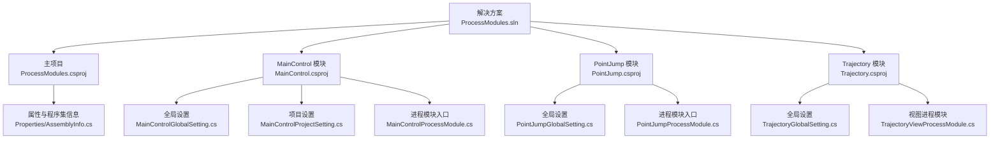
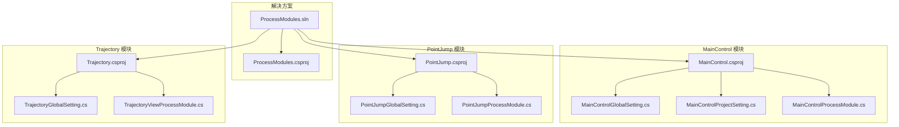
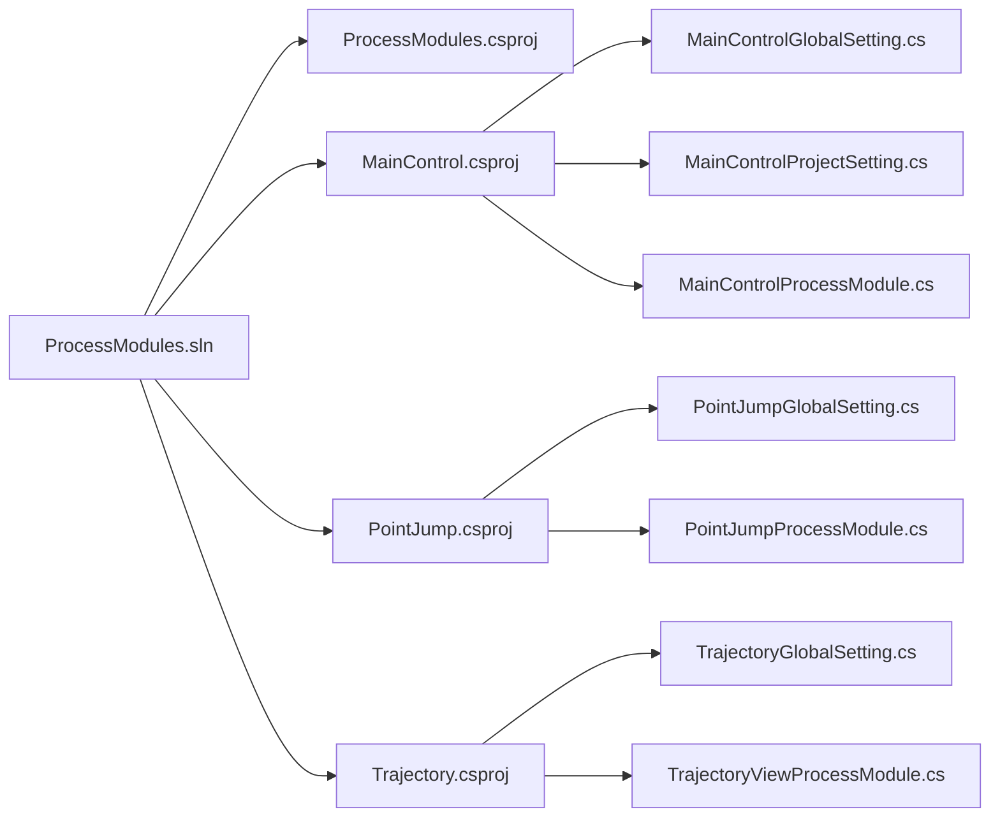

# 部署和发布

<cite>
**本文引用的文件**   
- [ProcessModules.csproj](file://ProcessModules.csproj)
- [ProcessModules.sln](file://ProcessModules.sln)
- [MainControl/MainControl.csproj](file://MainControl/MainControl.csproj)
- [PointJump/PointJump.csproj](file://PointJump/PointJump.csproj)
- [Trajectory/Trajectory.csproj](file://Trajectory/Trajectory.csproj)
- [独立 DLL 构建说明.md](file://独立 DLL 构建说明.md)
- [项目文件清理说明.md](file://项目文件清理说明.md)
- [命名空间与类名一致性验证报告.md](file://命名空间与类名一致性验证报告.md)
- [MainControl/MainControlGlobalSetting.cs](file://MainControl/MainControlGlobalSetting.cs)
- [MainControl/MainControlProjectSetting.cs](file://MainControl/MainControlProjectSetting.cs)
- [MainControl/MainControlProcessModule.cs](file://MainControl/MainControlProcessModule.cs)
- [PointJump/PointJumpGlobalSetting.cs](file://PointJump/PointJumpGlobalSetting.cs)
- [PointJump/PointJumpProcessModule.cs](file://PointJump/PointJumpProcessModule.cs)
- [Trajectory/TrajectoryGlobalSetting.cs](file://Trajectory/TrajectoryGlobalSetting.cs)
- [Trajectory/TrajectoryViewProcessModule.cs](file://Trajectory/TrajectoryViewProcessModule.cs)
- [Properties/AssemblyInfo.cs](file://Properties/AssemblyInfo.cs)
</cite>

## 目录
1. [简介](#简介)
2. [项目结构](#项目结构)
3. [核心组件](#核心组件)
4. [架构总览](#架构总览)
5. [详细组件分析](#详细组件分析)
6. [依赖分析](#依赖分析)
7. [性能考虑](#性能考虑)
8. [故障排查指南](#故障排查指南)
9. [结论](#结论)
10. [附录](#附录)

## 简介
本文件面向 ProcessModules 框架的部署与发布，覆盖以下关键主题：
- 独立 DLL 构建流程与配置选项
- 项目文件清理最佳实践（obj、bin、临时文件）
- 命名空间与类名一致性验证方法与工具
- 多目标框架（.NET Framework 版本）编译配置
- 依赖项管理与版本兼容性检查
- 打包发布的完整流程（安装包制作、签名验证）
- 部署环境准备与系统依赖
- 自动化构建与持续集成示例
- 回滚策略与版本管理最佳实践

## 项目结构
ProcessModules 解决方案包含多个子项目（如 MainControl、PointJump、Trajectory），每个子项目均遵循统一的模块组织方式：Controls、Logic、Resources、bin、obj 等。根目录提供解决方案与主项目文件，以及若干说明文档用于指导构建、清理与一致性校验。

图表来源
- [ProcessModules.sln](file://ProcessModules.sln)
- [ProcessModules.csproj](file://ProcessModules.csproj)
- [MainControl/MainControl.csproj](file://MainControl/MainControl.csproj)
- [PointJump/PointJump.csproj](file://PointJump/PointJump.csproj)
- [Trajectory/Trajectory.csproj](file://Trajectory/Trajectory.csproj)
- [Properties/AssemblyInfo.cs](file://Properties/AssemblyInfo.cs)

章节来源
- [ProcessModules.sln](file://ProcessModules.sln)
- [ProcessModules.csproj](file://ProcessModules.csproj)

## 核心组件
- 主项目与解决方案：定义整体构建目标、引用关系与输出产物。
- 模块项目（MainControl、PointJump、Trajectory）：各自实现独立的业务功能与 UI，并暴露进程模块入口。
- 程序集元数据：集中管理版本、文化、签名等程序集级别信息。
- 设置与配置：各模块的全局设置与项目设置类，便于运行时参数化。

章节来源
- [ProcessModules.csproj](file://ProcessModules.csproj)
- [MainControl/MainControlGlobalSetting.cs](file://MainControl/MainControlGlobalSetting.cs)
- [MainControl/MainControlProjectSetting.cs](file://MainControl/MainControlProjectSetting.cs)
- [MainControl/MainControlProcessModule.cs](file://MainControl/MainControlProcessModule.cs)
- [PointJump/PointJumpGlobalSetting.cs](file://PointJump/PointJumpGlobalSetting.cs)
- [PointJump/PointJumpProcessModule.cs](file://PointJump/PointJumpProcessModule.cs)
- [Trajectory/TrajectoryGlobalSetting.cs](file://Trajectory/TrajectoryGlobalSetting.cs)
- [Trajectory/TrajectoryViewProcessModule.cs](file://Trajectory/TrajectoryViewProcessModule.cs)
- [Properties/AssemblyInfo.cs](file://Properties/AssemblyInfo.cs)

## 架构总览
下图展示了从解决方案到具体模块的依赖关系，以及模块内部“设置—入口”的基本结构。该结构支持将每个模块作为独立 DLL 进行构建与发布。

图表来源
- [ProcessModules.sln](file://ProcessModules.sln)
- [ProcessModules.csproj](file://ProcessModules.csproj)
- [MainControl/MainControl.csproj](file://MainControl/MainControl.csproj)
- [PointJump/PointJump.csproj](file://PointJump/PointJump.csproj)
- [Trajectory/Trajectory.csproj](file://Trajectory/Trajectory.csproj)
- [MainControl/MainControlGlobalSetting.cs](file://MainControl/MainControlGlobalSetting.cs)
- [MainControl/MainControlProjectSetting.cs](file://MainControl/MainControlProjectSetting.cs)
- [MainControl/MainControlProcessModule.cs](file://MainControl/MainControlProcessModule.cs)
- [PointJump/PointJumpGlobalSetting.cs](file://PointJump/PointJumpGlobal.cs)
- [PointJump/PointJumpProcessModule.cs](file://PointJump/PointJumpProcessModule.cs)
- [Trajectory/TrajectoryGlobalSetting.cs](file://Trajectory/TrajectoryGlobalSetting.cs)
- [Trajectory/TrajectoryViewProcessModule.cs](file://Trajectory/TrajectoryViewProcessModule.cs)

## 详细组件分析

### 独立 DLL 构建流程与配置选项
- 构建目标
  - 为每个模块生成独立的 DLL 输出，供宿主或其他进程加载。
  - 支持 Debug/Release 两种配置，分别对应调试与发布产物。
- 关键配置点
  - 目标框架选择：在 csproj 中指定 .NET Framework 版本。
  - 输出路径与文件名：通过项目属性或 MSBuild 变量控制。
  - 强名称签名：如需企业级分发，启用签名并在 CI 中注入证书。
  - 条件编译符号：按平台或特性开关控制编译行为。
- 构建命令建议
  - 使用 dotnet CLI 或 MSBuild 对解决方案或单个项目进行构建。
  - 推荐显式指定 Configuration 与 TargetFramework，确保可重复性。
- 参考说明
  - 详见“独立 DLL 构建说明”文档中的步骤与注意事项。

章节来源
- [独立 DLL 构建说明.md](file://独立 DLL 构建说明.md)
- [ProcessModules.csproj](file://ProcessModules.csproj)
- [MainControl/MainControl.csproj](file://MainControl/MainControl.csproj)
- [PointJump/PointJump.csproj](file://PointJump/PointJump.csproj)
- [Trajectory/Trajectory.csproj](file://Trajectory/Trajectory.csproj)

### 项目文件清理最佳实践（obj、bin、临时文件）
- 清理范围
  - obj：中间编译产物，应纳入忽略与自动清理。
  - bin：最终输出目录，发布前需清理旧产物，避免残留。
  - 其他临时文件：日志、缓存、用户配置等，应在运行期隔离于输出目录之外。
- 清理策略
  - 在构建脚本中执行清理任务，确保每次构建前状态一致。
  - 使用 .gitignore 排除 obj、bin 及 IDE 临时文件。
  - 在 CI 中执行清理后再构建，保证产物纯净。
- 参考说明
  - 详见“项目文件清理说明”文档中的操作清单与脚本示例。

章节来源
- [项目文件清理说明.md](file://项目文件清理说明.md)

### 命名空间与类名一致性验证方法与工具
- 验证目标
  - 确保各模块的命名空间与类名符合统一约定，避免反射加载失败。
  - 校验进程模块入口类的命名与位置是否符合框架期望。
- 常用方法
  - 静态扫描：基于正则或 Roslyn 分析代码库，输出不一致项报告。
  - 规则驱动：以约定文件（如白名单/黑名单）驱动校验。
  - 自动化集成：在 CI 中执行校验，失败则阻断构建。
- 参考说明
  - 详见“命名空间与类名一致性验证报告”文档中的规则与结果。

章节来源
- [命名空间与类名一致性验证报告.md](file://命名空间与类名一致性验证报告.md)

### 不同目标框架（.NET Framework 版本）的编译配置
- 配置要点
  - 在 csproj 中明确 TargetFramework 值，确保与宿主环境一致。
  - 针对多目标框架，可使用 Condition 或 PropertyGroup 区分配置。
  - 第三方库需确认其支持的框架版本，避免运行时缺失依赖。
- 兼容性检查
  - 使用包管理器查看依赖的最低框架要求。
  - 在 CI 中并行构建多目标框架，尽早发现不兼容问题。
- 参考说明
  - 参见各项目 csproj 中的框架声明与条件编译片段。

章节来源
- [ProcessModules.csproj](file://ProcessModules.csproj)
- [MainControl/MainControl.csproj](file://MainControl/MainControl.csproj)
- [PointJump/PointJump.csproj](file://PointJump/PointJump.csproj)
- [Trajectory/Trajectory.csproj](file://Trajectory/Trajectory.csproj)

### 依赖项管理与版本兼容性检查
- 依赖管理
  - 使用 NuGet 管理第三方库，锁定版本号以避免漂移。
  - 定期更新依赖并回归测试，关注安全公告。
- 兼容性检查
  - 在构建阶段输出依赖树，人工或脚本审查冲突。
  - 对关键依赖进行最小版本约束与最大版本上限保护。
- 参考说明
  - 结合各项目 csproj 与 NuGet 配置文件进行核查。

章节来源
- [ProcessModules.csproj](file://ProcessModules.csproj)
- [MainControl/MainControl.csproj](file://MainControl/MainControl.csproj)
- [PointJump/PointJump.csproj](file://PointJump/PointJump.csproj)
- [Trajectory/Trajectory.csproj](file://Trajectory/Trajectory.csproj)

### 打包发布的完整流程（安装包制作与签名验证）
- 打包内容
  - 所有必要的 DLL、配置文件、资源文件与依赖库。
  - 安装脚本、卸载脚本与帮助文档。
- 安装包制作
  - 使用 WiX、Inno Setup 或 Visual Studio 打包工具创建安装包。
  - 配置安装路径、注册表项、启动快捷方式等。
- 签名与验证
  - 对安装包与 DLL 进行数字签名，确保来源可信与完整性。
  - 在 CI 中使用受信任证书进行签名，并记录签名哈希。
- 参考说明
  - 结合“独立 DLL 构建说明”与团队打包规范执行。

章节来源
- [独立 DLL 构建说明.md](file://独立 DLL 构建说明.md)
- [Properties/AssemblyInfo.cs](file://Properties/AssemblyInfo.cs)

### 部署环境的准备要求与系统依赖
- 运行环境
  - 目标 .NET Framework 运行时已安装且版本匹配。
  - 必要的系统组件（如图形库、硬件驱动）满足要求。
- 权限与安全
  - 应用所需文件系统与注册表访问权限。
  - 防火墙与杀毒软件白名单配置。
- 监控与日志
  - 部署后收集运行日志，建立告警与巡检机制。

[本节为通用指导，无需特定文件来源]

### 自动化构建与持续集成配置示例
- 构建步骤
  - 拉取代码、恢复依赖、执行清理、构建多配置与多目标框架。
  - 运行单元测试与一致性校验，生成制品与报告。
- 制品归档
  - 上传 DLL、安装包与构建日志至制品仓库。
- 示例要点
  - 使用 YAML 定义流水线，包含构建、测试、打包、签名与发布阶段。
  - 缓存 NuGet 包与中间产物，提升构建速度。

[本节为通用指导，无需特定文件来源]

### 回滚策略与版本管理最佳实践
- 版本管理
  - 采用语义化版本（主.次.修订），在 AssemblyInfo 与标签中保持一致。
  - 分支策略（主干+特性分支）与合并请求评审。
- 回滚策略
  - 保留最近 N 个稳定版本的可回滚包。
  - 灰度发布与快速回滚预案，确保业务连续性。
- 参考说明
  - 结合“命名空间与类名一致性验证报告”与“独立 DLL 构建说明”中的版本约定。

章节来源
- [命名空间与类名一致性验证报告.md](file://命名空间与类名一致性验证报告.md)
- [独立 DLL 构建说明.md](file://独立 DLL 构建说明.md)
- [Properties/AssemblyInfo.cs](file://Properties/AssemblyInfo.cs)

## 依赖分析
下图展示了解决方案与各模块之间的依赖关系，以及模块内部的设置与入口类依赖。

图表来源
- [ProcessModules.sln](file://ProcessModules.sln)
- [ProcessModules.csproj](file://ProcessModules.csproj)
- [MainControl/MainControl.csproj](file://MainControl/MainControl.csproj)
- [PointJump/PointJump.csproj](file://PointJump/PointJump.csproj)
- [Trajectory/Trajectory.csproj](file://Trajectory/Trajectory.csproj)
- [MainControl/MainControlGlobalSetting.cs](file://MainControl/MainControlGlobalSetting.cs)
- [MainControl/MainControlProjectSetting.cs](file://MainControl/MainControlProjectSetting.cs)
- [MainControl/MainControlProcessModule.cs](file://MainControl/MainControlProcessModule.cs)
- [PointJump/PointJumpGlobalSetting.cs](file://PointJump/PointJumpGlobalSetting.cs)
- [PointJump/PointJumpProcessModule.cs](file://PointJump/PointJumpProcessModule.cs)
- [Trajectory/TrajectoryGlobalSetting.cs](file://Trajectory/TrajectoryGlobalSetting.cs)
- [Trajectory/TrajectoryViewProcessModule.cs](file://Trajectory/TrajectoryViewProcessModule.cs)

章节来源
- [ProcessModules.sln](file://ProcessModules.sln)
- [ProcessModules.csproj](file://ProcessModules.csproj)

## 性能考虑
- 构建性能
  - 启用增量构建与并行构建，缓存 NuGet 包与中间产物。
  - 减少不必要的重新编译，合理拆分项目以降低耦合。
- 运行性能
  - 按需加载模块，避免一次性加载全部 DLL。
  - 优化资源文件与 UI 初始化流程，降低启动时间。

[本节为通用指导，无需特定文件来源]

## 故障排查指南
- 常见问题
  - 框架版本不匹配导致运行时异常。
  - 依赖缺失或版本冲突引发加载失败。
  - 命名空间或类名不一致导致反射错误。
- 排查步骤
  - 检查目标框架与运行时版本是否一致。
  - 查看依赖树与冲突提示，必要时锁定版本。
  - 运行一致性校验工具，修正命名约定。
- 参考说明
  - 结合“命名空间与类名一致性验证报告”与“独立 DLL 构建说明”。

章节来源
- [命名空间与类名一致性验证报告.md](file://命名空间与类名一致性验证报告.md)
- [独立 DLL 构建说明.md](file://独立 DLL 构建说明.md)

## 结论
通过规范的构建与发布流程、严格的依赖与版本管理、完善的清理与一致性校验，以及自动化 CI 与回滚策略，ProcessModules 框架可实现稳定、可重复、可追溯的交付。建议在团队内统一执行本指南，并结合实际环境进行适配与优化。

[本节为总结性内容，无需特定文件来源]

## 附录
- 术语
  - 独立 DLL：不包含可执行入口，仅由宿主动态加载的程序集。
  - 目标框架：应用程序编译时指定的 .NET Framework 版本。
  - 强名称签名：用于标识程序集来源与完整性的数字签名。
- 参考文档
  - “独立 DLL 构建说明”
  - “项目文件清理说明”
  - “命名空间与类名一致性验证报告”

[本节为补充信息，无需特定文件来源]