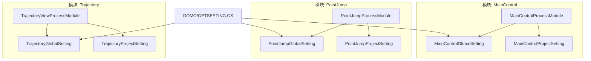
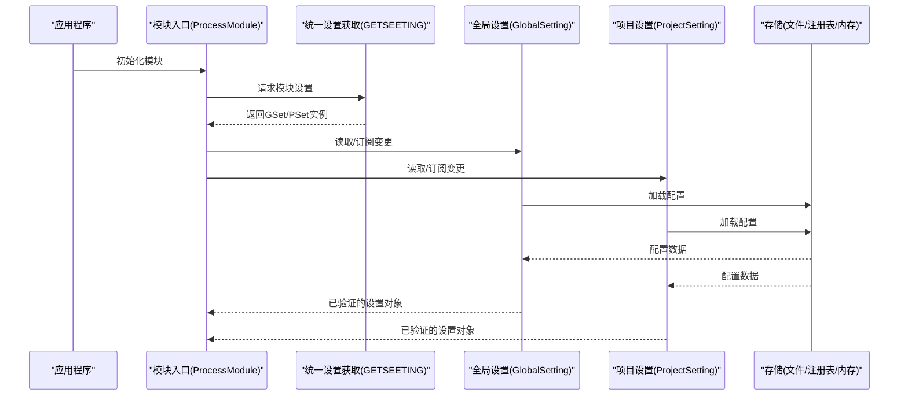
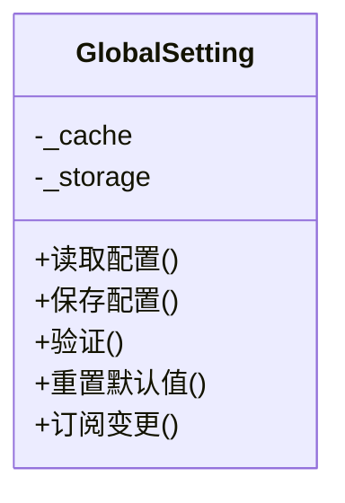
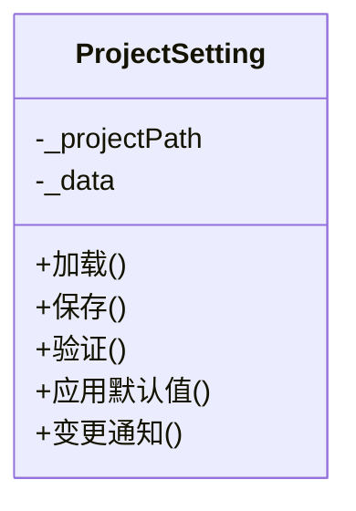
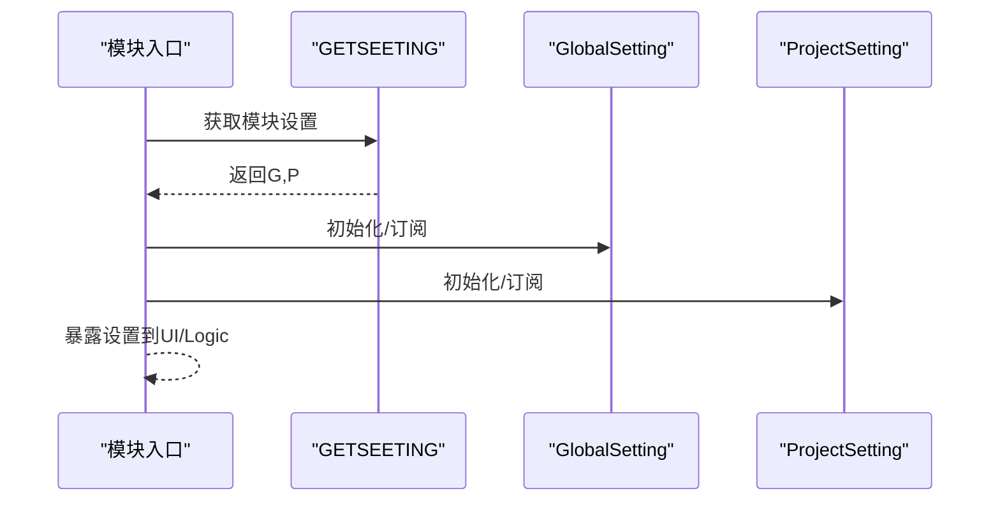
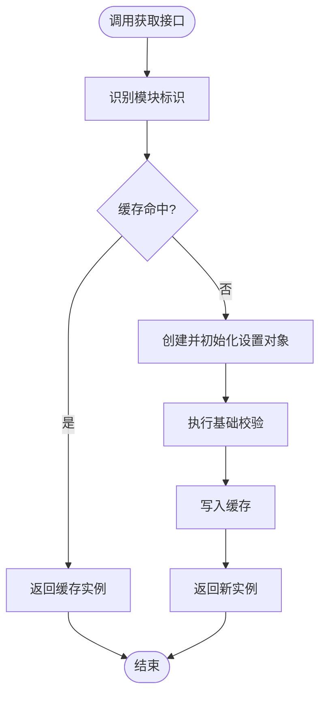
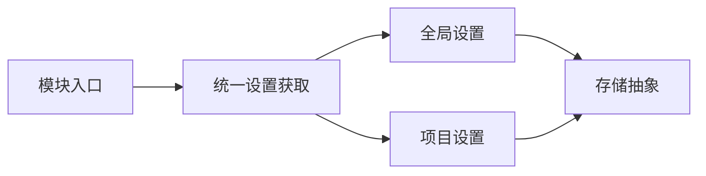

# 配置管理

<cite>
**本文引用的文件**   
- [MainControlGlobalSetting.cs](file://MainControl/MainControlGlobalSetting.cs)
- [MainControlProjectSetting.cs](file://MainControl/MainControlProjectSetting.cs)
- [PointJumpGlobalSetting.cs](file://PointJump/PointJumpGlobalSetting.cs)
- [PointJumpProjectSetting.cs](file://PointJump/PointJumpProjectSetting.cs)
- [TrajectoryGlobalSetting.cs](file://Trajectory/TrajectoryGlobalSetting.cs)
- [TrajectoryProjectSetting.cs](file://Trajectory/TrajectoryProjectSetting.cs)
- [GETSEETING.CS](file://DOMO/GETSEETING.CS)
- [MainControlProcessModule.cs](file://MainControl/MainControlProcessModule.cs)
- [PointJumpProcessModule.cs](file://PointJump/PointJumpProcessModule.cs)
- [TrajectoryViewProcessModule.cs](file://Trajectory/TrajectoryViewProcessModule.cs)
- [README.md](file://MainControl/README.md)
- [README.md](file://PointJump/README.md)
- [README.md](file://Trajectory/README.md)
</cite>

## 目录
1. [简介](#简介)
2. [项目结构](#项目结构)
3. [核心组件](#核心组件)
4. [架构总览](#架构总览)
5. [详细组件分析](#详细组件分析)
6. [依赖关系分析](#依赖关系分析)
7. [性能考虑](#性能考虑)
8. [故障排查指南](#故障排查指南)
9. [结论](#结论)
10. [附录](#附录)

## 简介
本文件为 ProcessModules 项目的“配置管理系统”提供系统化文档，覆盖全局配置与项目配置的架构设计、实现原理、配置文件格式与验证规则、加载缓存与热更新机制、扩展方式（通过 GlobalSetting 与 ProjectSetting 类）、序列化/反序列化与持久化方法、迁移与版本管理策略、安全考虑（敏感信息加密与访问控制），以及读取、修改与管理配置的实践示例。

## 项目结构
本项目采用按功能模块划分的组织方式：每个业务模块（如 MainControl、PointJump、Trajectory）均包含自身的“全局设置”和“项目设置”两类配置类，并通过各自的 ProcessModule 入口进行装配与使用。DOMO 层提供统一的设置获取能力。

图表来源 
- [MainControlGlobalSetting.cs](file://MainControl/MainControlGlobalSetting.cs)
- [MainControlProjectSetting.cs](file://MainControl/MainControlProjectSetting.cs)
- [MainControlProcessModule.cs](file://MainControl/MainControlProcessModule.cs)
- [PointJumpGlobalSetting.cs](file://PointJump/PointJumpGlobalSetting.cs)
- [PointJumpProjectSetting.cs](file://PointJump/PointJumpProjectSetting.cs)
- [PointJumpProcessModule.cs](file://PointJump/PointJumpProcessModule.cs)
- [TrajectoryGlobalSetting.cs](file://Trajectory/TrajectoryGlobalSetting.cs)
- [TrajectoryProjectSetting.cs](file://Trajectory/TrajectoryProjectSetting.cs)
- [TrajectoryViewProcessModule.cs](file://Trajectory/TrajectoryViewProcessModule.cs)
- [GETSEETING.CS](file://DOMO/GETSEETING.CS)

章节来源
- [MainControl/README.md](file://MainControl/README.md)
- [PointJump/README.md](file://PointJump/README.md)
- [Trajectory/README.md](file://Trajectory/README.md)

## 核心组件
- 全局设置（GlobalSetting）：面向应用级或模块级的共享配置，通常由多个子模块共享。
- 项目设置（ProjectSetting）：面向具体项目实例的配置，随项目生命周期存在。
- 模块入口（ProcessModule）：负责在模块初始化时加载、绑定并暴露配置给 UI 与逻辑层。
- 统一设置获取（DOMO/GETSEETING.CS）：对外提供一致的设置访问接口，屏蔽底层存储细节。

章节来源
- [MainControl/MainControlGlobalSetting.cs](file://MainControl/MainControlGlobalSetting.cs)
- [MainControl/MainControlProjectSetting.cs](file://MainControl/MainControlProjectSetting.cs)
- [PointJump/PointJumpGlobalSetting.cs](file://PointJump/PointJumpGlobalSetting.cs)
- [PointJump/PointJumpProjectSetting.cs](file://PointJump/PointJumpProjectSetting.cs)
- [Trajectory/TrajectoryGlobalSetting.cs](file://Trajectory/TrajectoryGlobalSetting.cs)
- [Trajectory/TrajectoryProjectSetting.cs](file://Trajectory/TrajectoryProjectSetting.cs)
- [DOMO/GETSEETING.CS](file://DOMO/GETSEETING.CS)

## 架构总览
下图展示了配置系统的整体交互：模块入口从统一设置获取器中解析出对应模块的全局/项目设置对象，并在运行时读写；设置对象内部负责校验、默认值处理、变更通知与持久化。

图表来源 
- [MainControl/MainControlProcessModule.cs](file://MainControl/MainControlProcessModule.cs)
- [PointJump/PointJumpProcessModule.cs](file://PointJump/PointJumpProcessModule.cs)
- [TrajectoryViewProcessModule.cs](file://Trajectory/TrajectoryViewProcessModule.cs)
- [DOMO/GETSEETING.CS](file://DOMO/GETSEETING.CS)

## 详细组件分析

### 全局设置（GlobalSetting）
- 职责：定义模块级共享配置项、默认值、校验规则、变更事件、序列化/反序列化与持久化。
- 扩展方式：新增属性即新增配置项；建议同时提供默认值与校验逻辑。
- 典型流程：加载时从存储读取 -> 反序列化为对象 -> 校验并填充缺失字段 -> 触发变更事件 -> 写入缓存。

图表来源 
- [MainControl/MainControlGlobalSetting.cs](file://MainControl/MainControlGlobalSetting.cs)
- [PointJump/PointJumpGlobalSetting.cs](file://PointJump/PointJumpGlobalSetting.cs)
- [Trajectory/TrajectoryGlobalSetting.cs](file://Trajectory/TrajectoryGlobalSetting.cs)

章节来源
- [MainControl/MainControlGlobalSetting.cs](file://MainControl/MainControlGlobalSetting.cs)
- [PointJump/PointJumpGlobalSetting.cs](file://PointJump/PointJumpGlobalSetting.cs)
- [Trajectory/TrajectoryGlobalSetting.cs](file://Trajectory/TrajectoryGlobalSetting.cs)

### 项目设置（ProjectSetting）
- 职责：定义项目实例级配置，支持独立于全局设置的个性化参数。
- 特性：与项目生命周期绑定，支持按需加载与释放；可继承或组合全局设置中的公共项。
- 典型流程：打开项目时加载 -> 合并默认值 -> 校验 -> 缓存 -> 监听变更并持久化。

图表来源 
- [MainControl/MainControlProjectSetting.cs](file://MainControl/MainControlProjectSetting.cs)
- [PointJump/PointJumpProjectSetting.cs](file://PointJump/PointJumpProjectSetting.cs)
- [Trajectory/TrajectoryProjectSetting.cs](file://Trajectory/TrajectoryProjectSetting.cs)

章节来源
- [MainControl/MainControlProjectSetting.cs](file://MainControl/MainControlProjectSetting.cs)
- [PointJump/PointJumpProjectSetting.cs](file://PointJump/PointJumpProjectSetting.cs)
- [Trajectory/TrajectoryProjectSetting.cs](file://Trajectory/TrajectoryProjectSetting.cs)

### 模块入口（ProcessModule）
- 职责：在模块启动时完成配置的初始化、绑定与暴露；将设置对象注入到 UI 与逻辑层。
- 行为：调用统一设置获取器，获取 GlobalSetting/ProjectSetting 实例；订阅变更事件以驱动界面刷新。

图表来源 
- [MainControl/MainControlProcessModule.cs](file://MainControl/MainControlProcessModule.cs)
- [PointJump/PointJumpProcessModule.cs](file://PointJump/PointJumpProcessModule.cs)
- [TrajectoryViewProcessModule.cs](file://Trajectory/TrajectoryViewProcessModule.cs)
- [DOMO/GETSEETING.CS](file://DOMO/GETSEETING.CS)

章节来源
- [MainControl/MainControlProcessModule.cs](file://MainControl/MainControlProcessModule.cs)
- [PointJump/PointJumpProcessModule.cs](file://PointJump/PointJumpProcessModule.cs)
- [TrajectoryViewProcessModule.cs](file://Trajectory/TrajectoryViewProcessModule.cs)
- [DOMO/GETSEETING.CS](file://DOMO/GETSEETING.CS)

### 统一设置获取（DOMO/GETSEETING.CS）
- 职责：提供跨模块的统一设置访问入口，屏蔽不同模块的命名空间差异与存储路径。
- 能力：根据模块标识返回对应的 GlobalSetting/ProjectSetting 实例；支持按需创建与缓存。

图表来源 
- [DOMO/GETSEETING.CS](file://DOMO/GETSEETING.CS)

章节来源
- [DOMO/GETSEETING.CS](file://DOMO/GETSEETING.CS)

## 依赖关系分析
- 模块入口依赖统一设置获取器，进而依赖各模块的 GlobalSetting/ProjectSetting。
- GlobalSetting/ProjectSetting 依赖存储抽象（文件/注册表/内存），并提供序列化/反序列化能力。
- 变更事件用于 UI 与逻辑层的解耦，避免强耦合导致的循环依赖。

图表来源 
- [MainControl/MainControlProcessModule.cs](file://MainControl/MainControlProcessModule.cs)
- [PointJump/PointJumpProcessModule.cs](file://PointJump/PointJumpProcessModule.cs)
- [TrajectoryViewProcessModule.cs](file://Trajectory/TrajectoryViewProcessModule.cs)
- [DOMO/GETSEETING.CS](file://DOMO/GETSEETING.CS)
- [MainControl/MainControlGlobalSetting.cs](file://MainControl/MainControlGlobalSetting.cs)
- [MainControl/MainControlProjectSetting.cs](file://MainControl/MainControlProjectSetting.cs)
- [PointJump/PointJumpGlobalSetting.cs](file://PointJump/PointJumpGlobalSetting.cs)
- [PointJump/PointJumpProjectSetting.cs](file://PointJump/PointJumpProjectSetting.cs)
- [Trajectory/TrajectoryGlobalSetting.cs](file://Trajectory/TrajectoryGlobalSetting.cs)
- [Trajectory/TrajectoryProjectSetting.cs](file://Trajectory/TrajectoryProjectSetting.cs)

章节来源
- [DOMO/GETSEETING.CS](file://DOMO/GETSEETING.CS)

## 性能考虑
- 懒加载：仅在首次访问时加载配置，减少启动开销。
- 缓存：进程内缓存设置对象，避免重复 IO 与反序列化。
- 增量持久化：仅对变更字段进行保存，降低磁盘压力。
- 异步 I/O：大文件或高并发场景下使用异步读写，避免阻塞 UI。
- 变更节流：高频变更合并批量保存，减少频繁写盘。

[本节为通用指导，不直接分析具体文件]

## 故障排查指南
- 常见错误
  - 配置文件损坏或缺失：回退到默认值并提示用户修复。
  - 校验失败：记录详细错误信息，定位字段与约束。
  - 权限不足：检查目标路径权限与只读属性。
  - 热更新冲突：确保单写者模型与事务性保存。
- 诊断步骤
  - 启用调试日志，记录加载/保存/校验全流程。
  - 对比当前配置与默认配置，定位差异字段。
  - 隔离存储后端，确认是否为 IO 问题。
- 恢复策略
  - 自动备份最近一次有效配置。
  - 提供“恢复默认”与“导入导出”工具。

[本节为通用指导，不直接分析具体文件]

## 结论
通过 GlobalSetting 与 ProjectSetting 的职责分离，配合统一设置获取与模块入口的装配，ProcessModules 实现了清晰、可扩展且高性能的配置管理体系。建议在新增配置项时遵循默认值、校验、变更通知与持久化的完整闭环，以确保系统稳定性与可维护性。

[本节为总结性内容，不直接分析具体文件]

## 附录

### 配置文件格式与结构
- 推荐格式：JSON（易读、易解析、跨平台）。
- 结构建议：
  - 顶层包含元数据（版本、时间戳、模块标识）。
  - 分节存储（如“全局”、“项目”、“设备”等）。
  - 字段命名规范：小驼峰，语义明确。
- 示例结构（概念性）：
  - 元数据：version、updated_at、module_id
  - 全局：连接参数、默认路径、显示主题
  - 项目：轴参数、轨迹参数、阈值与限幅

[本节为概念性说明，不直接分析具体文件]

### 配置验证与默认值处理
- 验证规则：类型检查、范围限制、必填项、依赖关系、枚举值。
- 默认值：缺失字段自动填充，保证对象始终处于合法状态。
- 错误恢复：校验失败时保留旧值，提示用户修正。

[本节为概念性说明，不直接分析具体文件]

### 加载、缓存与热更新机制
- 加载：按模块标识查找配置 -> 反序列化 -> 校验 -> 缓存。
- 缓存：进程内字典缓存，支持过期与失效策略。
- 热更新：监听文件系统或消息通道，增量更新并广播变更事件。

[本节为概念性说明，不直接分析具体文件]

### 序列化、反序列化与持久化
- 序列化：对象转 JSON，忽略空值与计算字段。
- 反序列化：严格模式开启，未知字段报错或忽略。
- 持久化：原子写入（先写临时文件再替换），失败回滚。

[本节为概念性说明，不直接分析具体文件]

### 配置迁移与版本管理
- 版本字段：每次破坏性变更递增 version。
- 迁移脚本：按版本顺序执行，兼容旧格式到新格式。
- 兼容性：向下兼容至少一个版本，向上兼容可选。

[本节为概念性说明，不直接分析具体文件]

### 安全考虑
- 敏感信息：密码、密钥等应加密存储，避免明文。
- 访问控制：最小权限原则，限制读写路径。
- 审计：记录关键配置变更操作与责任人。

[本节为概念性说明，不直接分析具体文件]

### 代码示例（读取、修改与管理）
- 读取配置：通过模块入口或统一设置获取器获取设置对象后，直接访问属性。
- 修改配置：设置属性后触发变更事件，必要时调用保存方法。
- 管理配置：提供导入/导出、恢复默认、校验与迁移工具。

[本节为概念性说明，不直接分析具体文件]