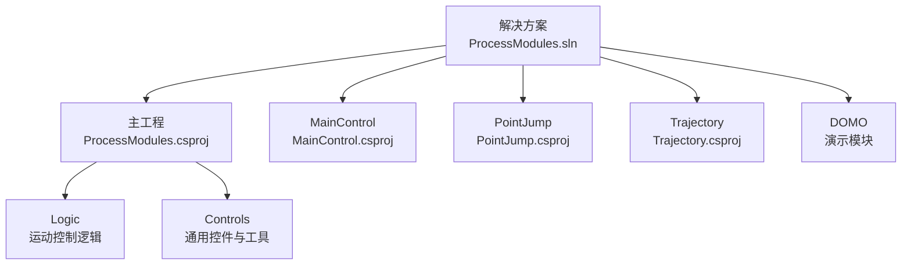
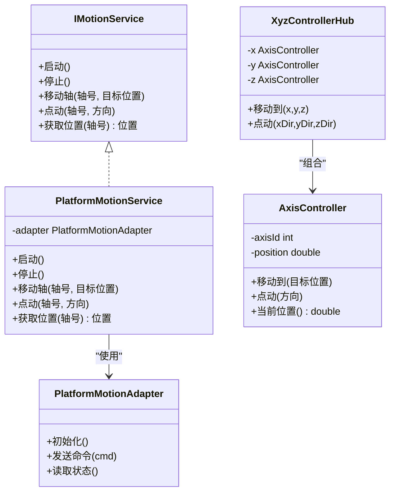
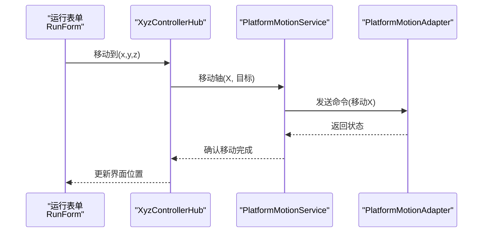
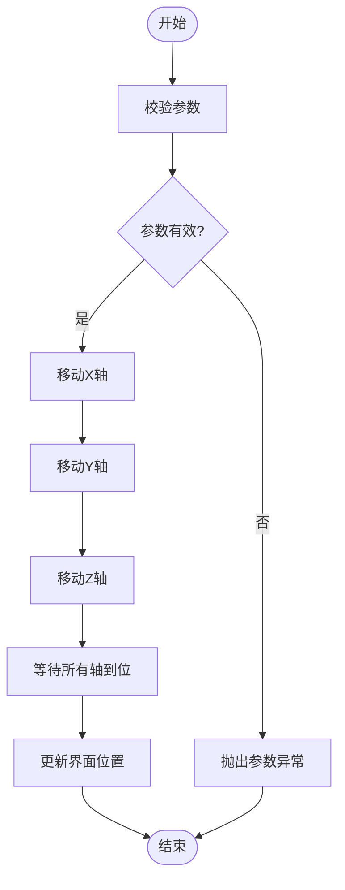
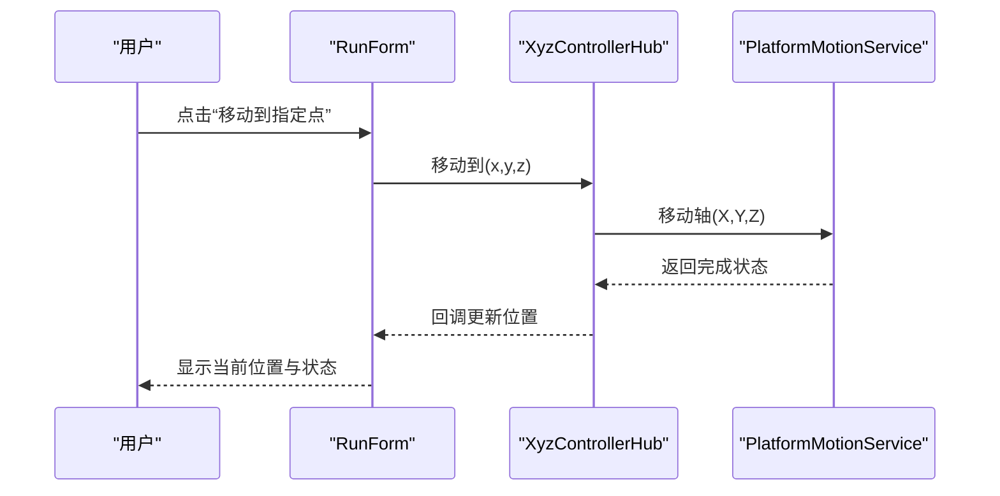
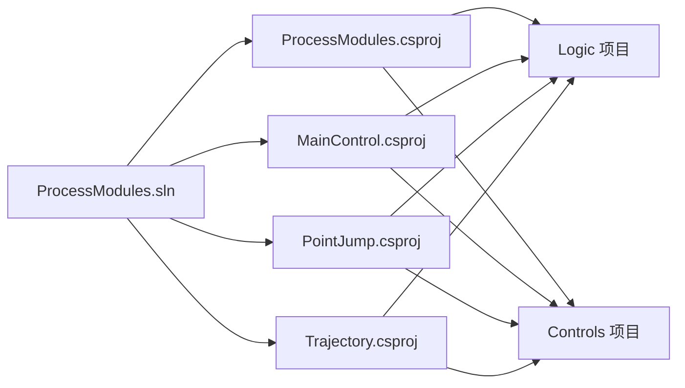

# 快速开始

<cite>
**本文引用的文件**   
- [README.md](file://README.md)
- [ProcessModules.sln](file://ProcessModules.sln)
- [ProcessModules.csproj](file://ProcessModules.csproj)
- [MainControl/MainControl.csproj](file://MainControl/MainControl.csproj)
- [PointJump/PointJump.csproj](file://PointJump/PointJump.csproj)
- [Trajectory/Trajectory.csproj](file://Trajectory/Trajectory.csproj)
- [Logic/PlatformMotionAdapter使用说明.md](file://Logic/PlatformMotionAdapter使用说明.md)
- [MainControl/README.md](file://MainControl/README.md)
- [PointJump/README.md](file://PointJump/README.md)
- [Trajectory/RunForm.cs](file://Trajectory/RunForm.cs)
- [MainControl/RunForm.cs](file://MainControl/RunForm.cs)
- [PointJump/RunForm.cs](file://PointJump/RunForm.cs)
- [Logic/AxisController.cs](file://Logic/AxisController.cs)
- [Logic/PlatformMotionService.cs](file://Logic/PlatformMotionService.cs)
- [Logic/IMotionService.cs](file://Logic/IMotionService.cs)
- [Logic/XyzControllerHub.cs](file://Logic/XyzControllerHub.cs)
- [Controls/MathHelper.cs](file://Controls/MathHelper.cs)
- [Controls/PaintHelper.cs](file://Controls/PaintHelper.cs)
- [Controls/XYView.cs](file://Controls/XYView.cs)
- [Controls/ZBarView.cs](file://Controls/ZBarView.cs)
- [Controls/JogButton.cs](file://Controls/JogButton.cs)
- [DOMO/DOMO.CS](file://DOMO/DOMO.CS)
- [DOMO/GETSEETING.CS](file://DOMO/GETSEETING.CS)
- [DOMO/MAINMODUO.CS](file://DOMO/MAINMODUO.CS)
</cite>

## 目录
1. [简介](#简介)
2. [项目结构](#项目结构)
3. [核心组件](#核心组件)
4. [架构总览](#架构总览)
5. [详细组件分析](#详细组件分析)
6. [依赖关系分析](#依赖关系分析)
7. [性能注意事项](#性能注意事项)
8. [故障排除指南](#故障排除指南)
9. [结论](#结论)
10. [附录](#附录)

## 简介
本快速开始指南面向首次接触 ProcessModules 的新用户，目标是帮助你在 30 分钟内完成环境准备、克隆与编译运行，并成功执行第一个示例程序，掌握基本的轴控制与点位跳转功能。文档涵盖：
- 环境准备：.NET Framework 安装、Visual Studio 配置、项目依赖项设置
- 项目克隆、编译与运行步骤
- 常见问题解决方案
- 第一个示例程序的完整代码路径与运行结果说明
- 调试技巧与常用工具使用方法
- 故障排除：编译错误、运行时异常、硬件连接问题
- 视频教程链接与在线资源推荐（占位）

## 项目结构
ProcessModules 是一个基于 .NET Framework 的 C# 桌面应用解决方案，包含多个子项目与模块：
- 根解决方案与主工程：ProcessModules.sln、ProcessModules.csproj
- 主要功能模块：
  - MainControl：主控界面与运行表单
  - PointJump：点位跳转功能
  - Trajectory：轨迹相关功能
- 逻辑层：
  - Logic：运动控制抽象与服务实现（轴控制器、平台适配器、服务接口等）
- 控件库：
  - Controls：通用 UI 控件与辅助类（数学计算、绘图、视图等）
- DOMO：演示与示例模块
- 其他：资源、构建产物、说明文档等

图表来源
- [ProcessModules.sln](file://ProcessModules.sln)
- [ProcessModules.csproj](file://ProcessModules.csproj)
- [MainControl/MainControl.csproj](file://MainControl/MainControl.csproj)
- [PointJump/PointJump.csproj](file://PointJump/PointJump.csproj)
- [Trajectory/Trajectory.csproj](file://Trajectory/Trajectory.csproj)

章节来源
- [README.md](file://README.md)
- [ProcessModules.sln](file://ProcessModules.sln)
- [ProcessModules.csproj](file://ProcessModules.csproj)

## 核心组件
- 运动控制抽象与服务
  - IMotionService：定义运动服务的统一接口
  - PlatformMotionService：平台运动服务的具体实现
  - AxisController：轴控制器，封装单轴操作
  - XyzControllerHub：XYZ 三轴协调控制入口
- 平台适配
  - PlatformMotionAdapter：平台运动适配器，屏蔽底层硬件差异
  - 使用说明：PlatformMotionAdapter使用说明.md
- 通用控件与工具
  - MathHelper：数学计算工具
  - PaintHelper：绘图辅助
  - XYView、ZBarView：坐标视图与 Z 轴条显示
  - JogButton：点动按钮控件
- 运行表单
  - MainControl/RunForm.cs
  - PointJump/RunForm.cs
  - Trajectory/RunForm.cs
- 演示模块
  - DOMO.DOMO.CS、DOMO.GETSEETING.CS、DOMO.MAINMODUO.CS

章节来源
- [Logic/IMotionService.cs](file://Logic/IMotionService.cs)
- [Logic/PlatformMotionService.cs](file://Logic/PlatformMotionService.cs)
- [Logic/AxisController.cs](file://Logic/AxisController.cs)
- [Logic/XyzControllerHub.cs](file://Logic/XyzControllerHub.cs)
- [Logic/PlatformMotionAdapter使用说明.md](file://Logic/PlatformMotionAdapter使用说明.md)
- [Controls/MathHelper.cs](file://Controls/MathHelper.cs)
- [Controls/PaintHelper.cs](file://Controls/PaintHelper.cs)
- [Controls/XYView.cs](file://Controls/XYView.cs)
- [Controls/ZBarView.cs](file://Controls/ZBarView.cs)
- [Controls/JogButton.cs](file://Controls/JogButton.cs)
- [MainControl/RunForm.cs](file://MainControl/RunForm.cs)
- [PointJump/RunForm.cs](file://PointJump/RunForm.cs)
- [Trajectory/RunForm.cs](file://Trajectory/RunForm.cs)
- [DOMO/DOMO.CS](file://DOMO/DOMO.CS)
- [DOMO/GETSEETING.CS](file://DOMO/GETSEETING.CS)
- [DOMO/MAINMODUO.CS](file://DOMO/MAINMODUO.CS)

## 架构总览
整体采用“界面层 + 逻辑层 + 平台适配层”的分层架构：
- 界面层：各 RunForm 提供用户交互与可视化
- 逻辑层：通过 IMotionService 抽象运动能力，由 PlatformMotionService 实现
- 平台适配层：PlatformMotionAdapter 对接具体硬件或仿真平台
- 控制器：AxisController 管理单轴状态与命令，XyzControllerHub 负责多轴协同

图表来源
- [Logic/IMotionService.cs](file://Logic/IMotionService.cs)
- [Logic/PlatformMotionService.cs](file://Logic/PlatformMotionService.cs)
- [Logic/AxisController.cs](file://Logic/AxisController.cs)
- [Logic/XyzControllerHub.cs](file://Logic/XyzControllerHub.cs)
- [Logic/PlatformMotionAdapter使用说明.md](file://Logic/PlatformMotionAdapter使用说明.md)

## 详细组件分析

### 运动服务与平台适配
- IMotionService 定义了统一的运动控制接口，便于替换不同平台实现
- PlatformMotionService 作为默认实现，内部依赖 PlatformMotionAdapter 进行实际通信
- 建议根据硬件驱动或仿真平台扩展新的 Adapter 实现，保持上层调用一致

图表来源
- [MainControl/RunForm.cs](file://MainControl/RunForm.cs)
- [Logic/XyzControllerHub.cs](file://Logic/XyzControllerHub.cs)
- [Logic/PlatformMotionService.cs](file://Logic/PlatformMotionService.cs)
- [Logic/PlatformMotionAdapter使用说明.md](file://Logic/PlatformMotionAdapter使用说明.md)

章节来源
- [Logic/IMotionService.cs](file://Logic/IMotionService.cs)
- [Logic/PlatformMotionService.cs](file://Logic/PlatformMotionService.cs)
- [Logic/PlatformMotionAdapter使用说明.md](file://Logic/PlatformMotionAdapter使用说明.md)

### 轴控制器与三轴协调
- AxisController 封装单轴的当前位置、移动与点动逻辑
- XyzControllerHub 组合三个 AxisController，提供 XYZ 联动能力
- 典型流程：界面触发 -> Hub 调度 -> 各轴依次移动 -> 状态回传

图表来源
- [Logic/AxisController.cs](file://Logic/AxisController.cs)
- [Logic/XyzControllerHub.cs](file://Logic/XyzControllerHub.cs)

章节来源
- [Logic/AxisController.cs](file://Logic/AxisController.cs)
- [Logic/XyzControllerHub.cs](file://Logic/XyzControllerHub.cs)

### 运行表单与用户交互
- MainControl/RunForm.cs：主控运行界面，提供轴控制与状态显示
- PointJump/RunForm.cs：点位跳转界面，支持预设点位与手动输入
- Trajectory/RunForm.cs：轨迹运行界面，支持轨迹播放与暂停

图表来源
- [MainControl/RunForm.cs](file://MainControl/RunForm.cs)
- [PointJump/RunForm.cs](file://PointJump/RunForm.cs)
- [Trajectory/RunForm.cs](file://Trajectory/RunForm.cs)
- [Logic/XyzControllerHub.cs](file://Logic/XyzControllerHub.cs)
- [Logic/PlatformMotionService.cs](file://Logic/PlatformMotionService.cs)

章节来源
- [MainControl/RunForm.cs](file://MainControl/RunForm.cs)
- [PointJump/RunForm.cs](file://PointJump/RunForm.cs)
- [Trajectory/RunForm.cs](file://Trajectory/RunForm.cs)

### 通用控件与工具
- MathHelper：提供常用数学运算（如角度转换、距离计算）
- PaintHelper：封装绘图方法，简化界面绘制
- XYView：二维坐标视图，用于展示 XY 平面位置
- ZBarView：Z 轴高度条显示
- JogButton：点动按钮，支持按住连续点动

章节来源
- [Controls/MathHelper.cs](file://Controls/MathHelper.cs)
- [Controls/PaintHelper.cs](file://Controls/PaintHelper.cs)
- [Controls/XYView.cs](file://Controls/XYView.cs)
- [Controls/ZBarView.cs](file://Controls/ZBarView.cs)
- [Controls/JogButton.cs](file://Controls/JogButton.cs)

### 演示模块（DOMO）
- DOMO.DOMO.CS：演示入口与示例逻辑
- DOMO.GETSEETING.CS：演示配置读取
- DOMO.MAINMODUO.CS：主模块组织

章节来源
- [DOMO/DOMO.CS](file://DOMO/DOMO.CS)
- [DOMO/GETSEETING.CS](file://DOMO/GETSEETING.CS)
- [DOMO/MAINMODUO.CS](file://DOMO/MAINMODUO.CS)

## 依赖关系分析
- 解决方案级依赖：ProcessModules.sln 聚合多个子项目
- 工程级依赖：
  - ProcessModules.csproj：主工程引用 Logic 与 Controls
  - MainControl/PointJump/Trajectory：各自引用 Logic 与 Controls
- 运行时依赖：.NET Framework 版本需与项目目标框架一致

图表来源
- [ProcessModules.sln](file://ProcessModules.sln)
- [ProcessModules.csproj](file://ProcessModules.csproj)
- [MainControl/MainControl.csproj](file://MainControl/MainControl.csproj)
- [PointJump/PointJump.csproj](file://PointJump/PointJump.csproj)
- [Trajectory/Trajectory.csproj](file://Trajectory/Trajectory.csproj)

章节来源
- [ProcessModules.sln](file://ProcessModules.sln)
- [ProcessModules.csproj](file://ProcessModules.csproj)
- [MainControl/MainControl.csproj](file://MainControl/MainControl.csproj)
- [PointJump/PointJump.csproj](file://PointJump/PointJump.csproj)
- [Trajectory/Trajectory.csproj](file://Trajectory/Trajectory.csproj)

## 性能注意事项
- 界面更新频率：避免在高频循环中频繁刷新 UI，建议使用定时器或异步更新
- 轴移动策略：批量移动时合并指令，减少通信开销
- 资源释放：及时释放串口、线程等资源，防止内存泄漏
- 日志与监控：关键路径添加性能计数与日志，便于定位瓶颈

[本节为通用指导，不直接分析具体文件]

## 故障排除指南
常见编译错误
- 目标框架不一致：确保 Visual Studio 已安装与项目匹配的 .NET Framework 版本
- 缺少依赖包：检查 NuGet 包还原是否成功，必要时清理并重新生成
- 引用缺失：确认各子项目对 Logic 与 Controls 的引用正确

常见运行时异常
- 硬件连接失败：检查串口/网络端口配置与权限
- 参数越界：校验移动目标位置是否在限位范围内
- 线程同步问题：确保 UI 线程与非 UI 线程的正确切换

硬件连接问题
- 端口占用：关闭占用端口的其他程序
- 权限不足：以管理员身份运行或调整端口权限
- 驱动未安装：安装设备厂商提供的驱动程序

章节来源
- [Logic/PlatformMotionAdapter使用说明.md](file://Logic/PlatformMotionAdapter使用说明.md)
- [MainControl/README.md](file://MainControl/README.md)
- [PointJump/README.md](file://PointJump/README.md)

## 结论
通过以上步骤，你应已完成环境准备、项目编译与运行，并掌握了基本的轴控制与点位跳转功能。建议在后续使用中逐步熟悉平台适配与自定义控件扩展，结合调试技巧与故障排除指南，提升开发效率与稳定性。

[本节为总结性内容，不直接分析具体文件]

## 附录

### 环境准备清单
- 安装 .NET Framework（与项目目标框架一致）
- 安装 Visual Studio（建议 2019 或更高版本）
- 打开解决方案 ProcessModules.sln
- 还原 NuGet 包（如有）
- 设置启动项目（例如 MainControl）

章节来源
- [ProcessModules.sln](file://ProcessModules.sln)
- [ProcessModules.csproj](file://ProcessModules.csproj)
- [MainControl/MainControl.csproj](file://MainControl/MainControl.csproj)

### 克隆、编译与运行步骤
- 克隆仓库到本地目录
- 使用 Visual Studio 打开 ProcessModules.sln
- 选择启动项目（MainControl/PointJump/Trajectory）
- 生成解决方案（Ctrl+Shift+B）
- 运行（F5）

章节来源
- [ProcessModules.sln](file://ProcessModules.sln)
- [ProcessModules.csproj](file://ProcessModules.csproj)

### 第一个示例程序
- 示例入口：DOMO 模块中的演示文件
- 运行结果：界面显示当前轴位置，支持点动与移动到指定点
- 代码路径参考：
  - [DOMO/DOMO.CS](file://DOMO/DOMO.CS)
  - [DOMO/GETSEETING.CS](file://DOMO/GETSEETING.CS)
  - [DOMO/MAINMODUO.CS](file://DOMO/MAINMODUO.CS)

章节来源
- [DOMO/DOMO.CS](file://DOMO/DOMO.CS)
- [DOMO/GETSEETING.CS](file://DOMO/GETSEETING.CS)
- [DOMO/MAINMODUO.CS](file://DOMO/MAINMODUO.CS)

### 调试技巧与常用工具
- 断点调试：在 RunForm 与 Logic 关键方法设置断点
- 输出窗口：查看日志与异常堆栈
- 监视窗口：实时查看变量与对象状态
- 性能分析：使用 VS 内置的性能分析器定位热点

章节来源
- [MainControl/RunForm.cs](file://MainControl/RunForm.cs)
- [Logic/PlatformMotionService.cs](file://Logic/PlatformMotionService.cs)

### 视频教程与在线资源
- 视频教程：[待补充链接]
- 在线资源：[待补充链接]

[本节为占位信息，无具体文件引用]