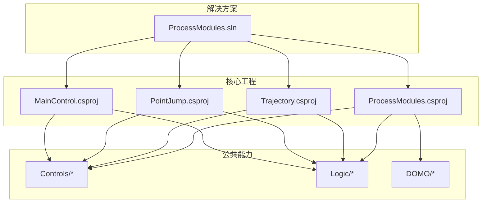
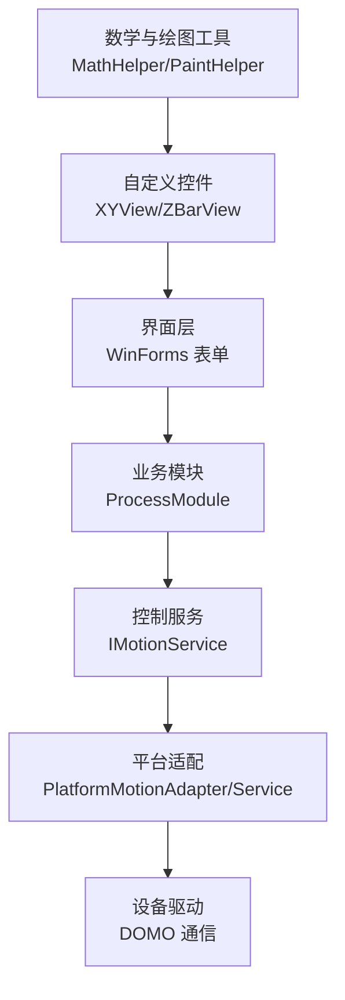
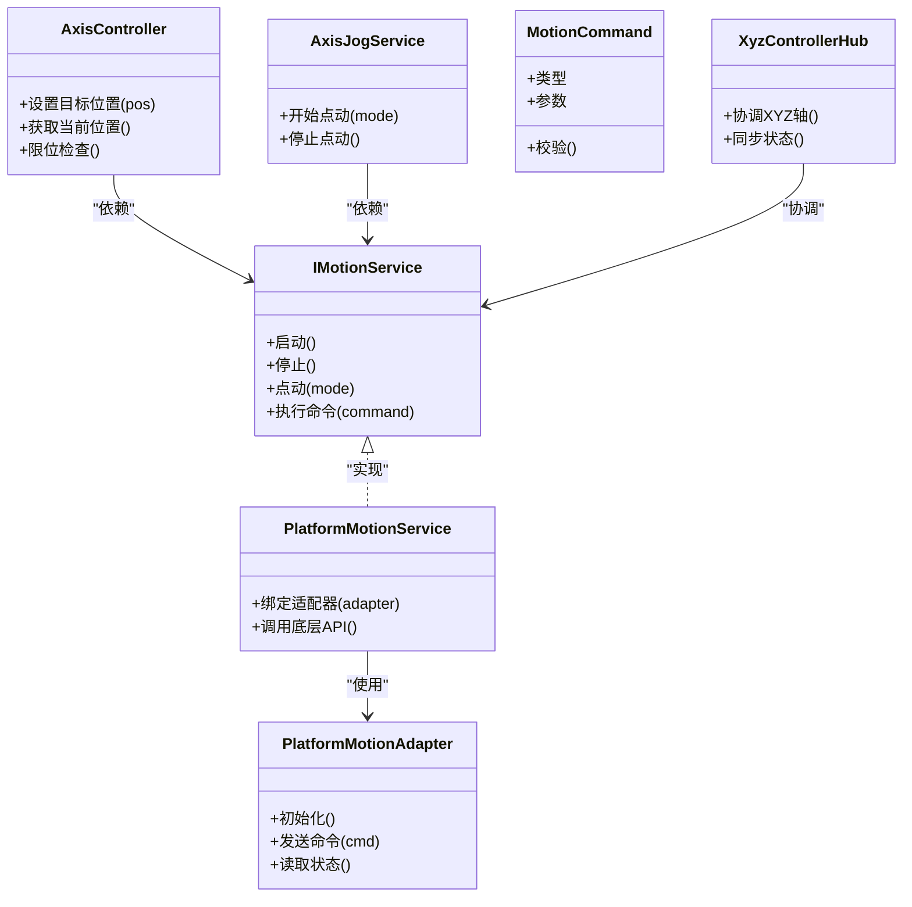
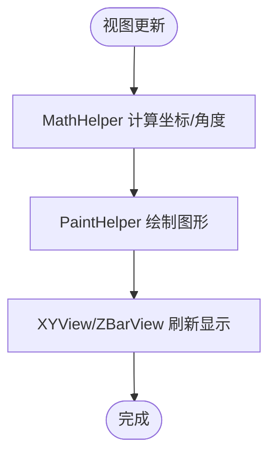
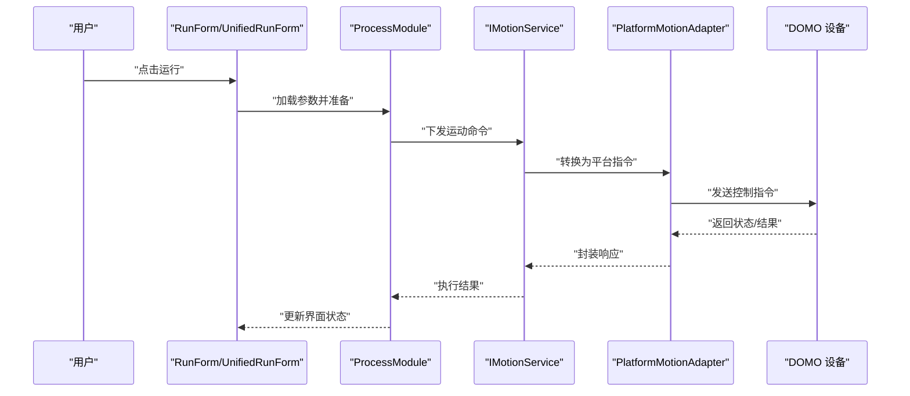
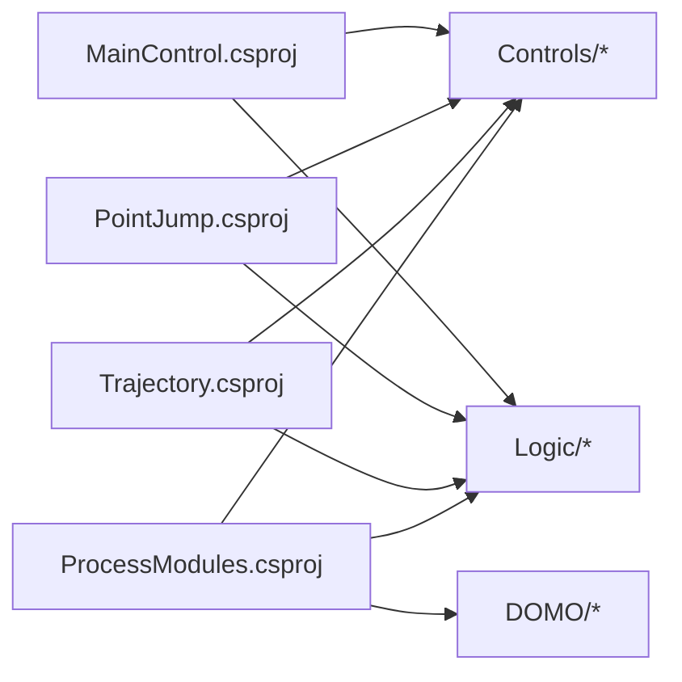

# 技术栈介绍

<cite>
**本文档引用的文件**   
- [ProcessModules.csproj](file://ProcessModules.csproj)
- [ProcessModules.sln](file://ProcessModules.sln)
- [MainControl/MainControl.csproj](file://MainControl/MainControl.csproj)
- [PointJump/PointJump.csproj](file://PointJump/PointJump.csproj)
- [Trajectory/Trajectory.csproj](file://Trajectory/Trajectory.csproj)
- [Controls/MathHelper.cs](file://Controls/MathHelper.cs)
- [Controls/PaintHelper.cs](file://Controls/PaintHelper.cs)
- [Controls/XYView.cs](file://Controls/XYView.cs)
- [Controls/ZBarView.cs](file://Controls/ZBarView.cs)
- [Logic/AxisController.cs](file://Logic/AxisController.cs)
- [Logic/AxisJogService.cs](file://Logic/AxisJogService.cs)
- [Logic/AxisPosition.cs](file://Logic/AxisPosition.cs)
- [Logic/IMotionService.cs](file://Logic/IMotionService.cs)
- [Logic/JogMode.cs](file://Logic/JogMode.cs)
- [Logic/MotionCommand.cs](file://Logic/MotionCommand.cs)
- [Logic/PlatformMotionAdapter.cs](file://Logic/PlatformMotionAdapter.cs)
- [Logic/PlatformMotionService.cs](file://Logic/PlatformMotionService.cs)
- [Logic/XyzControllerHub.cs](file://Logic/XyzControllerHub.cs)
- [DOMO/DOMO.CS](file://DOMO/DOMO.CS)
- [DOMO/GETSEETING.CS](file://DOMO/GETSEETING.CS)
- [DOMO/MAINMODUO.CS](file://DOMO/MAINMODUO.CS)
- [MainControl/MainControlGlobalSetting.cs](file://MainControl/MainControlGlobalSetting.cs)
- [MainControl/MainControlProcessModule.cs](file://MainControl/MainControlProcessModule.cs)
- [MainControl/MainControlProjectSetting.cs](file://MainControl/MainControlProjectSetting.cs)
- [MainControl/RunForm.cs](file://MainControl/RunForm.cs)
- [MainControl/UnifiedRunForm.cs](file://MainControl/UnifiedRunForm.cs)
- [MainControl/AxisLimitForm.cs](file://MainControl/AxisLimitForm.cs)
- [PointJump/PointJumpGlobalSetting.cs](file://PointJump/PointJumpGlobalSetting.cs)
- [PointJump/PointJumpProcessModule.cs](file://PointJump/PointJumpProcessModule.cs)
- [PointJump/PointJumpProjectSetting.cs](file://PointJump/PointJumpProjectSetting.cs)
- [PointJump/RunForm.cs](file://PointJump/RunForm.cs)
- [Trajectory/TrajectoryGlobalSetting.cs](file://Trajectory/TrajectoryGlobalSetting.cs)
- [Trajectory/TrajectoryProjectSetting.cs](file://Trajectory/TrajectoryProjectSetting.cs)
- [Trajectory/TrajectoryViewProcessModule.cs](file://Trajectory/TrajectoryViewProcessModule.cs)
- [Trajectory/RunForm.cs](file://Trajectory/RunForm.cs)
- [Properties/AssemblyInfo.cs](file://Properties/AssemblyInfo.cs)
- [README.md](file://README.md)
</cite>

## 目录
1. [简介](#简介)
2. [项目结构](#项目结构)
3. [核心组件](#核心组件)
4. [架构总览](#架构总览)
5. [详细组件分析](#详细组件分析)
6. [依赖关系分析](#依赖关系分析)
7. [性能考量](#性能考量)
8. [故障排查指南](#故障排查指南)
9. [结论](#结论)
10. [附录](#附录)

## 简介
本章节面向希望快速理解 ProcessModules 技术栈的开发者与工程师，系统阐述本项目采用的 C#/.NET 技术体系、Windows Forms/WPF 框架选择原因、主要依赖库与自定义控件、开发环境要求，以及技术选型对比与未来升级路线。文档基于仓库中的工程文件、逻辑模块与控件实现进行归纳总结，确保内容与实际代码一致。

## 项目结构
ProcessModules 采用多项目解决方案组织，按功能域划分：
- Controls：通用绘图与数学辅助、坐标视图等自定义控件
- Logic：运动控制抽象与服务适配层（轴控制、点动、命令封装、平台适配器）
- MainControl：主控制界面与运行表单、统一运行入口
- PointJump：点位跳转模块
- Trajectory：轨迹模块
- DOMO：设备通信与设置读取相关逻辑
- Properties/AssemblyInfo：程序集元数据
- 根级工程文件与解决方案文件定义整体构建目标与引用关系

图表来源
- [ProcessModules.sln](file://ProcessModules.sln)
- [ProcessModules.csproj](file://ProcessModules.csproj)
- [MainControl/MainControl.csproj](file://MainControl/MainControl.csproj)
- [PointJump/PointJump.csproj](file://PointJump/PointJump.csproj)
- [Trajectory/Trajectory.csproj](file://Trajectory/Trajectory.csproj)

章节来源
- [ProcessModules.sln](file://ProcessModules.sln)
- [ProcessModules.csproj](file://ProcessModules.csproj)
- [MainControl/MainControl.csproj](file://MainControl/MainControl.csproj)
- [PointJump/PointJump.csproj](file://PointJump/PointJump.csproj)
- [Trajectory/Trajectory.csproj](file://Trajectory/Trajectory.csproj)

## 核心组件
- 自定义控件库
  - 数学与绘图工具：MathHelper、PaintHelper
  - 二维/三维视图：XYView、ZBarView
- 运动控制服务层
  - 接口与模式：IMotionService、JogMode、MotionCommand
  - 轴控制与位置：AxisController、AxisPosition
  - 点动服务：AxisJogService
  - 平台适配：PlatformMotionAdapter、PlatformMotionService
  - 控制器枢纽：XyzControllerHub
- 业务模块
  - 主控制：MainControlProcessModule、MainControlGlobalSetting、MainControlProjectSetting、RunForm、UnifiedRunForm、AxisLimitForm
  - 点位跳转：PointJumpProcessModule、PointJumpGlobalSetting、PointJumpProjectSetting、RunForm
  - 轨迹：TrajectoryViewProcessModule、TrajectoryGlobalSetting、TrajectoryProjectSetting、RunForm
- 设备与配置
  - DOMO 通信与设置：DOMO.CS、GETSEETING.CS、MAINMODUO.CS
  - 程序集信息：AssemblyInfo.cs

章节来源
- [Controls/MathHelper.cs](file://Controls/MathHelper.cs)
- [Controls/PaintHelper.cs](file://Controls/PaintHelper.cs)
- [Controls/XYView.cs](file://Controls/XYView.cs)
- [Controls/ZBarView.cs](file://Controls/ZBarView.cs)
- [Logic/IMotionService.cs](file://Logic/IMotionService.cs)
- [Logic/JogMode.cs](file://Logic/JogMode.cs)
- [Logic/MotionCommand.cs](file://Logic/MotionCommand.cs)
- [Logic/AxisController.cs](file://Logic/AxisController.cs)
- [Logic/AxisPosition.cs](file://Logic/AxisPosition.cs)
- [Logic/AxisJogService.cs](file://Logic/AxisJogService.cs)
- [Logic/PlatformMotionAdapter.cs](file://Logic/PlatformMotionAdapter.cs)
- [Logic/PlatformMotionService.cs](file://Logic/PlatformMotionService.cs)
- [Logic/XyzControllerHub.cs](file://Logic/XyzControllerHub.cs)
- [MainControl/MainControlProcessModule.cs](file://MainControl/MainControlProcessModule.cs)
- [MainControl/MainControlGlobalSetting.cs](file://MainControl/MainControlGlobalSetting.cs)
- [MainControl/MainControlProjectSetting.cs](file://MainControl/MainControlProjectSetting.cs)
- [MainControl/RunForm.cs](file://MainControl/RunForm.cs)
- [MainControl/UnifiedRunForm.cs](file://MainControl/UnifiedRunForm.cs)
- [MainControl/AxisLimitForm.cs](file://MainControl/AxisLimitForm.cs)
- [PointJump/PointJumpProcessModule.cs](file://PointJump/PointJumpProcessModule.cs)
- [PointJump/PointJumpGlobalSetting.cs](file://PointJump/PointJumpGlobalSetting.cs)
- [PointJump/PointJumpProjectSetting.cs](file://PointJump/PointJumpProjectSetting.cs)
- [PointJump/RunForm.cs](file://PointJump/RunForm.cs)
- [Trajectory/TrajectoryViewProcessModule.cs](file://Trajectory/TrajectoryViewProcessModule.cs)
- [Trajectory/TrajectoryGlobalSetting.cs](file://Trajectory/TrajectoryGlobalSetting.cs)
- [Trajectory/TrajectoryProjectSetting.cs](file://Trajectory/TrajectoryProjectSetting.cs)
- [Trajectory/RunForm.cs](file://Trajectory/RunForm.cs)
- [DOMO/DOMO.CS](file://DOMO/DOMO.CS)
- [DOMO/GETSEETING.CS](file://DOMO/GETSEETING.CS)
- [DOMO/MAINMODUO.CS](file://DOMO/MAINMODUO.CS)
- [Properties/AssemblyInfo.cs](file://Properties/AssemblyInfo.cs)

## 架构总览
整体架构遵循“界面层—业务模块—控制服务—平台适配—设备驱动”的分层设计：
- 界面层：Windows Forms 表单承载交互，提供统一的运行入口与可视化视图
- 业务模块：各 ProcessModule 负责特定任务编排与参数管理
- 控制服务：以 IMotionService 为抽象，解耦具体硬件平台差异
- 平台适配：PlatformMotionAdapter/Service 屏蔽底层驱动细节
- 设备驱动：通过 DOMO 模块完成设备通信与配置读写

图表来源
- [MainControl/RunForm.cs](file://MainControl/RunForm.cs)
- [MainControl/UnifiedRunForm.cs](file://MainControl/UnifiedRunForm.cs)
- [MainControl/MainControlProcessModule.cs](file://MainControl/MainControlProcessModule.cs)
- [PointJump/PointJumpProcessModule.cs](file://PointJump/PointJumpProcessModule.cs)
- [Trajectory/TrajectoryViewProcessModule.cs](file://Trajectory/TrajectoryViewProcessModule.cs)
- [Logic/IMotionService.cs](file://Logic/IMotionService.cs)
- [Logic/PlatformMotionAdapter.cs](file://Logic/PlatformMotionAdapter.cs)
- [Logic/PlatformMotionService.cs](file://Logic/PlatformMotionService.cs)
- [DOMO/DOMO.CS](file://DOMO/DOMO.CS)
- [Controls/XYView.cs](file://Controls/XYView.cs)
- [Controls/ZBarView.cs](file://Controls/ZBarView.cs)
- [Controls/MathHelper.cs](file://Controls/MathHelper.cs)
- [Controls/PaintHelper.cs](file://Controls/PaintHelper.cs)

## 详细组件分析

### 运动控制服务层（IMotionService 与平台适配）
- 抽象接口 IMotionService 定义了统一的运动控制契约，便于替换不同硬件平台
- AxisController/AxisJogService 提供轴级别控制与点动模式（JogMode），MotionCommand 封装指令语义
- PlatformMotionAdapter/PlatformMotionService 将上层调用映射到具体驱动 API
- XyzControllerHub 协调 XYZ 三轴协同

图表来源
- [Logic/IMotionService.cs](file://Logic/IMotionService.cs)
- [Logic/AxisController.cs](file://Logic/AxisController.cs)
- [Logic/AxisJogService.cs](file://Logic/AxisJogService.cs)
- [Logic/MotionCommand.cs](file://Logic/MotionCommand.cs)
- [Logic/PlatformMotionAdapter.cs](file://Logic/PlatformMotionAdapter.cs)
- [Logic/PlatformMotionService.cs](file://Logic/PlatformMotionService.cs)
- [Logic/XyzControllerHub.cs](file://Logic/XyzControllerHub.cs)

章节来源
- [Logic/IMotionService.cs](file://Logic/IMotionService.cs)
- [Logic/AxisController.cs](file://Logic/AxisController.cs)
- [Logic/AxisJogService.cs](file://Logic/AxisJogService.cs)
- [Logic/MotionCommand.cs](file://Logic/MotionCommand.cs)
- [Logic/PlatformMotionAdapter.cs](file://Logic/PlatformMotionAdapter.cs)
- [Logic/PlatformMotionService.cs](file://Logic/PlatformMotionService.cs)
- [Logic/XyzControllerHub.cs](file://Logic/XyzControllerHub.cs)

### 自定义控件与可视化（XYView/ZBarView）
- XYView 用于二维平面轨迹与坐标显示，结合 PaintHelper 进行高效绘制
- ZBarView 用于 Z 轴高度或行程可视化
- MathHelper 提供常用几何与数值计算，支撑视图渲染与路径插值

图表来源
- [Controls/XYView.cs](file://Controls/XYView.cs)
- [Controls/ZBarView.cs](file://Controls/ZBarView.cs)
- [Controls/MathHelper.cs](file://Controls/MathHelper.cs)
- [Controls/PaintHelper.cs](file://Controls/PaintHelper.cs)

章节来源
- [Controls/XYView.cs](file://Controls/XYView.cs)
- [Controls/ZBarView.cs](file://Controls/ZBarView.cs)
- [Controls/MathHelper.cs](file://Controls/MathHelper.cs)
- [Controls/PaintHelper.cs](file://Controls/PaintHelper.cs)

### 业务模块（MainControl/PointJump/Trajectory）
- 每个模块包含全局设置、项目设置与进程模块类，负责参数管理与流程编排
- RunForm 作为用户交互入口，UnifiedRunForm 提供统一运行入口
- AxisLimitForm 处理轴限位与安全边界

图表来源
- [MainControl/RunForm.cs](file://MainControl/RunForm.cs)
- [MainControl/UnifiedRunForm.cs](file://MainControl/UnifiedRunForm.cs)
- [MainControl/MainControlProcessModule.cs](file://MainControl/MainControlProcessModule.cs)
- [PointJump/PointJumpProcessModule.cs](file://PointJump/PointJumpProcessModule.cs)
- [Trajectory/TrajectoryViewProcessModule.cs](file://Trajectory/TrajectoryViewProcessModule.cs)
- [Logic/IMotionService.cs](file://Logic/IMotionService.cs)
- [Logic/PlatformMotionAdapter.cs](file://Logic/PlatformMotionAdapter.cs)
- [DOMO/DOMO.CS](file://DOMO/DOMO.CS)

章节来源
- [MainControl/MainControlProcessModule.cs](file://MainControl/MainControlProcessModule.cs)
- [MainControl/RunForm.cs](file://MainControl/RunForm.cs)
- [MainControl/UnifiedRunForm.cs](file://MainControl/UnifiedRunForm.cs)
- [PointJump/PointJumpProcessModule.cs](file://PointJump/PointJumpProcessModule.cs)
- [Trajectory/TrajectoryViewProcessModule.cs](file://Trajectory/TrajectoryViewProcessModule.cs)

## 依赖关系分析
- 工程引用关系由 .csproj 文件声明，Solution 文件聚合多个子项目
- 控件与逻辑层被各业务模块复用，形成稳定的内聚与低耦合
- DOMO 模块作为设备通信桥接，向上暴露稳定接口

图表来源
- [MainControl/MainControl.csproj](file://MainControl/MainControl.csproj)
- [PointJump/PointJump.csproj](file://PointJump/PointJump.csproj)
- [Trajectory/Trajectory.csproj](file://Trajectory/Trajectory.csproj)
- [ProcessModules.csproj](file://ProcessModules.csproj)

章节来源
- [MainControl/MainControl.csproj](file://MainControl/MainControl.csproj)
- [PointJump/PointJump.csproj](file://PointJump/PointJump.csproj)
- [Trajectory/Trajectory.csproj](file://Trajectory/Trajectory.csproj)
- [ProcessModules.csproj](file://ProcessModules.csproj)

## 性能考量
- 自定义控件采用双缓冲与增量重绘策略，减少闪烁与 CPU 占用
- 数学计算集中在 MathHelper，避免重复计算与对象分配
- 运动控制命令批量封装，降低频繁 I/O 与线程切换开销
- 平台适配层缓存设备状态，减少轮询频率

[本节为通用指导，不直接分析具体文件]

## 故障排查指南
- 界面卡顿或掉帧：检查 XYView/ZBarView 的重绘频率与 PaintHelper 的绘制复杂度
- 运动异常或超时：确认 IMotionService 的命令序列与 PlatformMotionAdapter 的状态反馈
- 设备通信失败：核查 DOMO 模块的连接参数与错误码处理
- 参数不一致：核对 GlobalSetting 与 ProjectSetting 的加载顺序与默认值

章节来源
- [Controls/XYView.cs](file://Controls/XYView.cs)
- [Controls/ZBarView.cs](file://Controls/ZBarView.cs)
- [Controls/PaintHelper.cs](file://Controls/PaintHelper.cs)
- [Logic/IMotionService.cs](file://Logic/IMotionService.cs)
- [Logic/PlatformMotionAdapter.cs](file://Logic/PlatformMotionAdapter.cs)
- [DOMO/DOMO.CS](file://DOMO/DOMO.CS)

## 结论
ProcessModules 以 C#/.NET 为基础，采用 Windows Forms 构建界面，配合自研控件与运动控制服务层，实现了高内聚、低耦合的可扩展架构。通过平台适配层屏蔽硬件差异，满足多设备兼容需求；通过模块化设计提升开发效率与维护性。未来可平滑升级到 WPF 以提升 UI 表现力，同时保持现有控制服务与适配层的稳定性。

[本节为总结性内容，不直接分析具体文件]

## 附录

### 技术栈与版本说明
- 编程语言：C#
- 框架：.NET Framework（由工程文件与程序集元数据决定）
- UI 框架：Windows Forms（表单与控件实现位于各 RunForm 与自定义控件）
- 第三方库：未引入外部 NuGet 包，依赖 .NET Framework 内置库与自定义控件库

章节来源
- [ProcessModules.csproj](file://ProcessModules.csproj)
- [MainControl/MainControl.csproj](file://MainControl/MainControl.csproj)
- [PointJump/PointJump.csproj](file://PointJump/PointJump.csproj)
- [Trajectory/Trajectory.csproj](file://Trajectory/Trajectory.csproj)
- [Properties/AssemblyInfo.cs](file://Properties/AssemblyInfo.cs)

### 开发环境要求
- Visual Studio：建议安装支持 .NET Framework 的目标版本（根据工程文件目标框架确定）
- .NET Framework：需安装工程文件中指定的目标框架版本
- 调试与发布：使用解决方案文件统一构建与打包

章节来源
- [ProcessModules.sln](file://ProcessModules.sln)
- [ProcessModules.csproj](file://ProcessModules.csproj)
- [MainControl/MainControl.csproj](file://MainControl/MainControl.csproj)
- [PointJump/PointJump.csproj](file://PointJump/PointJump.csproj)
- [Trajectory/Trajectory.csproj](file://Trajectory/Trajectory.csproj)

### 技术选型对比分析
- Windows Forms vs WPF
  - 优势：WinForms 成熟稳定、控件生态完善、学习成本低
  - 劣势：UI 定制能力有限、高分屏适配较弱
  - 决策依据：当前以工业控制为主，强调稳定性与开发效率，WinForms 更契合
- 自研控件 vs 第三方控件库
  - 优势：完全可控、无许可限制、贴合业务场景
  - 劣势：维护成本较高
  - 决策依据：核心可视化与运动控制需要深度定制，自研控件更合适
- 平台适配层必要性
  - 优势：屏蔽硬件差异、便于多设备集成
  - 劣势：接口设计与实现复杂度增加
  - 决策依据：多设备兼容与长期演进需求强烈

[本节为概念性分析，不直接分析具体文件]

### 未来技术升级路线图
- 短期：优化控件绘制性能，完善错误日志与诊断工具
- 中期：评估迁移至 WPF 的可行性，逐步替换关键界面
- 长期：引入异步/并发优化，提升运动控制实时性与吞吐

[本节为规划性内容，不直接分析具体文件]

### 兼容性说明
- 向后兼容：保持 IMotionService 与 PlatformMotionAdapter 接口稳定
- 向前兼容：新增功能通过扩展点注入，不影响既有模块
- 设备兼容：DOMO 模块抽象设备协议，支持新设备接入

章节来源
- [Logic/IMotionService.cs](file://Logic/IMotionService.cs)
- [Logic/PlatformMotionAdapter.cs](file://Logic/PlatformMotionAdapter.cs)
- [DOMO/DOMO.CS](file://DOMO/DOMO.CS)