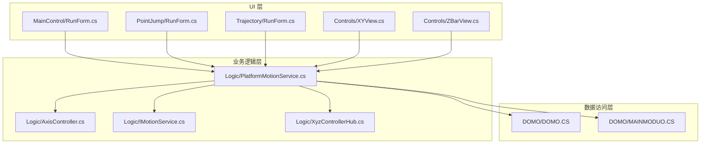
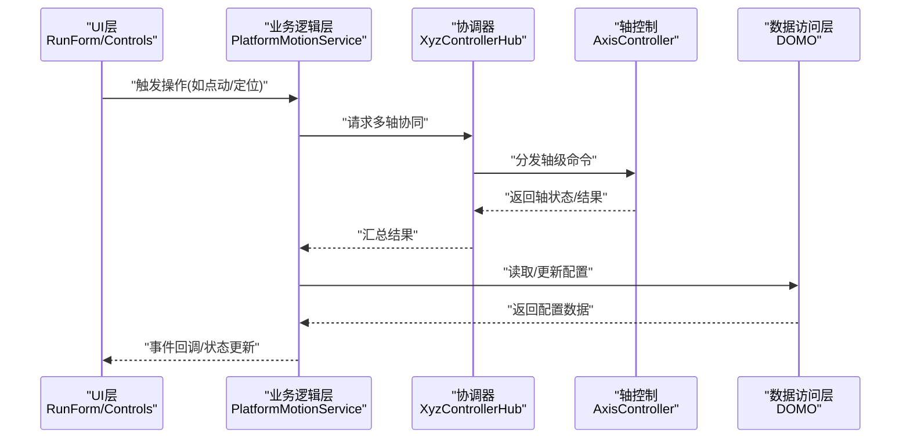
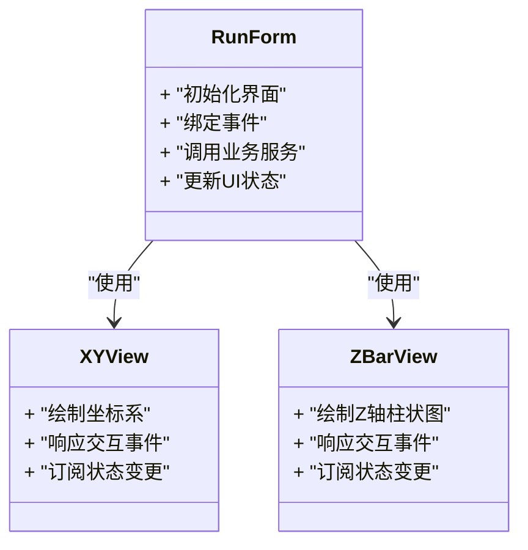
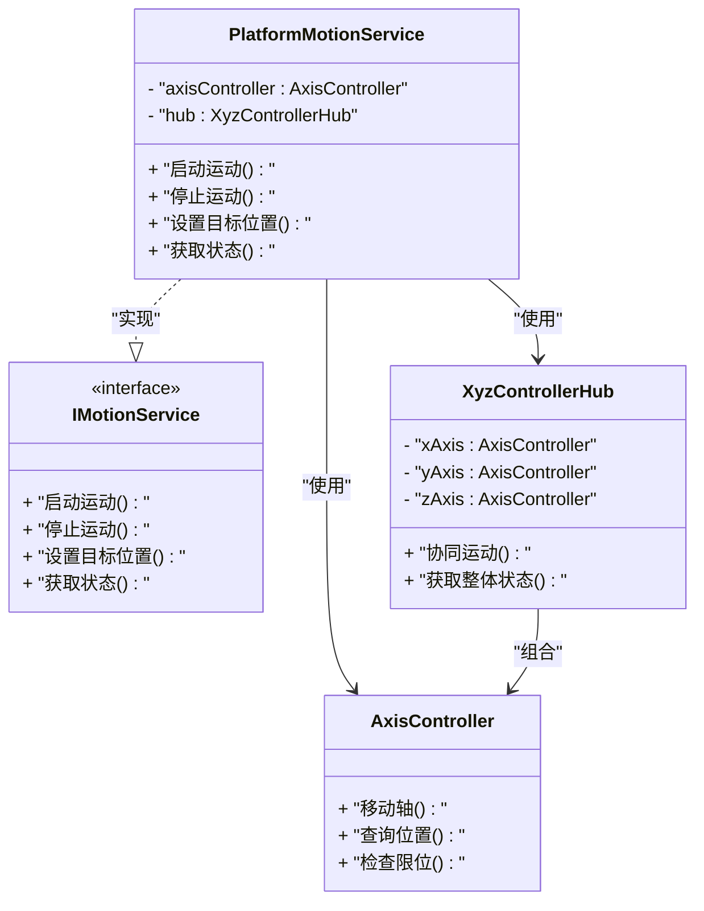
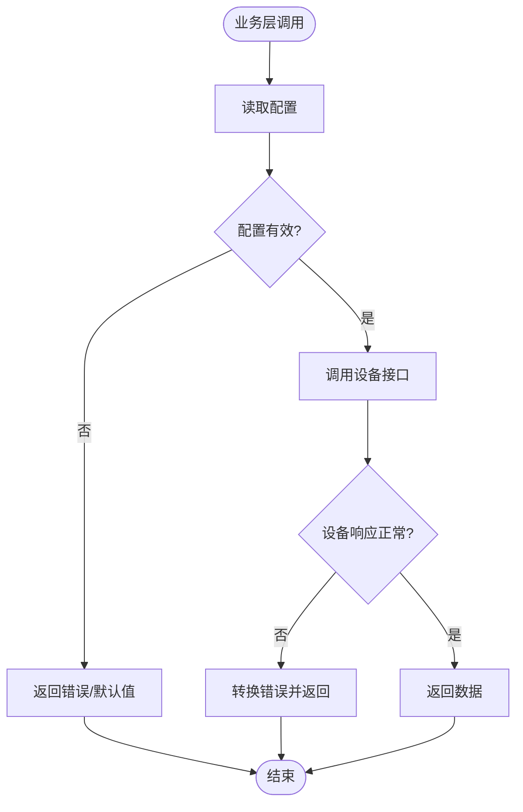
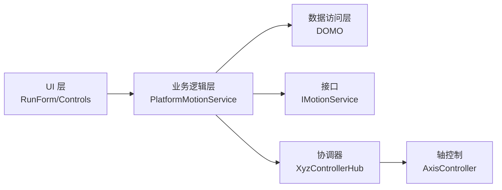

# 分层架构设计

<cite>
**本文引用的文件**   
- [ProcessModules.csproj](file://ProcessModules.csproj)
- [MainControl/RunForm.cs](file://MainControl/RunForm.cs)
- [MainControl/MainControlProcessModule.cs](file://MainControl/MainControlProcessModule.cs)
- [PointJump/RunForm.cs](file://PointJump/RunForm.cs)
- [Trajectory/RunForm.cs](file://Trajectory/RunForm.cs)
- [Controls/XYView.cs](file://Controls/XYView.cs)
- [Controls/ZBarView.cs](file://Controls/ZBarView.cs)
- [Logic/PlatformMotionService.cs](file://Logic/PlatformMotionService.cs)
- [Logic/AxisController.cs](file://Logic/AxisController.cs)
- [Logic/IMotionService.cs](file://Logic/IMotionService.cs)
- [Logic/XyzControllerHub.cs](file://Logic/XyzControllerHub.cs)
- [DOMO/DOMO.CS](file://DOMO/DOMO.CS)
- [DOMO/MAINMODUO.CS](file://DOMO/MAINMODUO.CS)
</cite>

## 目录
1. [简介](#简介)
2. [项目结构](#项目结构)
3. [核心组件](#核心组件)
4. [架构总览](#架构总览)
5. [详细组件分析](#详细组件分析)
6. [依赖关系分析](#依赖关系分析)
7. [性能考虑](#性能考虑)
8. [故障排查指南](#故障排查指南)
9. [结论](#结论)
10. [附录](#附录)

## 简介
本文件为 ProcessModules 项目的分层架构设计文档，围绕 UI 层、业务逻辑层与数据访问层的职责划分、依赖关系与通信机制展开。通过三层架构实现模块化开发与代码复用，降低耦合度、提升内聚性，便于测试与维护。面向初学者解释分层概念，同时为有经验的开发者提供实现细节与最佳实践。

## 项目结构
本项目采用按功能模块与层次划分的组织方式：
- UI 层（Controls 与各模块 RunForm）：负责用户交互、界面展示与事件转发。
- 业务逻辑层（Logic）：封装运动控制、轴管理、命令处理等核心服务。
- 数据访问层（DOMO）：负责配置管理与底层设备/系统交互。

图表来源
- [MainControl/RunForm.cs](file://MainControl/RunForm.cs)
- [PointJump/RunForm.cs](file://PointJump/RunForm.cs)
- [Trajectory/RunForm.cs](file://Trajectory/RunForm.cs)
- [Controls/XYView.cs](file://Controls/XYView.cs)
- [Controls/ZBarView.cs](file://Controls/ZBarView.cs)
- [Logic/PlatformMotionService.cs](file://Logic/PlatformMotionService.cs)
- [Logic/AxisController.cs](file://Logic/AxisController.cs)
- [Logic/IMotionService.cs](file://Logic/IMotionService.cs)
- [Logic/XyzControllerHub.cs](file://Logic/XyzControllerHub.cs)
- [DOMO/DOMO.CS](file://DOMO/DOMO.CS)
- [DOMO/MAINMODUO.CS](file://DOMO/MAINMODUO.CS)

章节来源
- [ProcessModules.csproj](file://ProcessModules.csproj)

## 核心组件
- UI 层组件
  - 各模块的 RunForm：承载用户操作入口，将交互事件委托给业务逻辑层。
  - Controls（如 XYView、ZBarView）：可视化控件，订阅业务状态变化并刷新显示。
- 业务逻辑层组件
  - PlatformMotionService：统一运动控制服务，协调轴控制器与命令执行。
  - AxisController：轴级控制抽象，封装单轴动作与状态。
  - IMotionService：运动服务接口，定义上层可依赖的契约。
  - XyzControllerHub：XYZ 多轴协同控制器，聚合多个 AxisController。
- 数据访问层组件
  - DOMO 模块：封装配置读取/写入与底层设备通信，屏蔽具体实现细节。

章节来源
- [MainControl/RunForm.cs](file://MainControl/RunForm.cs)
- [PointJump/RunForm.cs](file://PointJump/RunForm.cs)
- [Trajectory/RunForm.cs](file://Trajectory/RunForm.cs)
- [Controls/XYView.cs](file://Controls/XYView.cs)
- [Controls/ZBarView.cs](file://Controls/ZBarView.cs)
- [Logic/PlatformMotionService.cs](file://Logic/PlatformMotionService.cs)
- [Logic/AxisController.cs](file://Logic/AxisController.cs)
- [Logic/IMotionService.cs](file://Logic/IMotionService.cs)
- [Logic/XyzControllerHub.cs](file://Logic/XyzControllerHub.cs)
- [DOMO/DOMO.CS](file://DOMO/DOMO.CS)
- [DOMO/MAINMODUO.CS](file://DOMO/MAINMODUO.CS)

## 架构总览
分层架构的核心思想是将系统划分为清晰的层次，每层仅对相邻层暴露必要接口，从而达成松耦合与高内聚。在本项目中：
- UI 层不直接依赖数据访问层，所有设备与配置访问均通过业务逻辑层完成。
- 业务逻辑层通过接口（如 IMotionService）与上层解耦，便于替换实现或进行单元测试。
- 数据访问层隐藏底层差异，向上提供稳定的配置与设备访问能力。

图表来源
- [MainControl/RunForm.cs](file://MainControl/RunForm.cs)
- [Logic/PlatformMotionService.cs](file://Logic/PlatformMotionService.cs)
- [Logic/XyzControllerHub.cs](file://Logic/XyzControllerHub.cs)
- [Logic/AxisController.cs](file://Logic/AxisController.cs)
- [DOMO/DOMO.CS](file://DOMO/DOMO.CS)

## 详细组件分析

### UI 层：RunForm 与 Controls
- RunForm 的职责
  - 接收用户输入（按钮点击、参数输入）。
  - 调用业务逻辑层的服务方法，并将结果反馈到界面。
  - 订阅业务层的事件以更新 UI 状态。
- Controls 的职责
  - 渲染实时数据（如坐标、轨迹、柱状图）。
  - 响应鼠标/键盘事件并转发至业务层。

图表来源
- [MainControl/RunForm.cs](file://MainControl/RunForm.cs)
- [Controls/XYView.cs](file://Controls/XYView.cs)
- [Controls/ZBarView.cs](file://Controls/ZBarView.cs)

章节来源
- [MainControl/RunForm.cs](file://MainControl/RunForm.cs)
- [Controls/XYView.cs](file://Controls/XYView.cs)
- [Controls/ZBarView.cs](file://Controls/ZBarView.cs)

### 业务逻辑层：PlatformMotionService、AxisController、IMotionService、XyzControllerHub
- IMotionService
  - 定义运动服务的契约，供 UI 层与上层模块依赖。
- PlatformMotionService
  - 实现 IMotionService，协调多轴运动、命令编排与状态同步。
- AxisController
  - 封装单轴控制逻辑，包括位置、速度、限位等。
- XyzControllerHub
  - 聚合 XYZ 三轴控制器，提供协同运动能力。

图表来源
- [Logic/IMotionService.cs](file://Logic/IMotionService.cs)
- [Logic/PlatformMotionService.cs](file://Logic/PlatformMotionService.cs)
- [Logic/AxisController.cs](file://Logic/AxisController.cs)
- [Logic/XyzControllerHub.cs](file://Logic/XyzControllerHub.cs)

章节来源
- [Logic/IMotionService.cs](file://Logic/IMotionService.cs)
- [Logic/PlatformMotionService.cs](file://Logic/PlatformMotionService.cs)
- [Logic/AxisController.cs](file://Logic/AxisController.cs)
- [Logic/XyzControllerHub.cs](file://Logic/XyzControllerHub.cs)

### 数据访问层：DOMO 模块
- DOMO 模块职责
  - 配置管理：读取/保存运行参数、设备参数。
  - 设备通信：封装底层驱动或协议，向上提供稳定接口。
- 与业务层的交互
  - 业务层在需要时调用 DOMO 提供的配置与设备接口。
  - 错误与异常由 DOMO 层捕获并转换为业务层可处理的语义化结果。

图表来源
- [DOMO/DOMO.CS](file://DOMO/DOMO.CS)
- [DOMO/MAINMODUO.CS](file://DOMO/MAINMODUO.CS)

章节来源
- [DOMO/DOMO.CS](file://DOMO/DOMO.CS)
- [DOMO/MAINMODUO.CS](file://DOMO/MAINMODUO.CS)

### 模块入口与进程模块
- MainControlProcessModule
  - 作为主控制模块的入口，注册 UI 与业务服务，初始化运行环境。
- 其他模块的 RunForm
  - PointJump 与 Trajectory 模块各自提供 RunForm，复用 Logic 层服务以实现特定业务流程。

章节来源
- [MainControl/MainControlProcessModule.cs](file://MainControl/MainControlProcessModule.cs)
- [PointJump/RunForm.cs](file://PointJump/RunForm.cs)
- [Trajectory/RunForm.cs](file://Trajectory/RunForm.cs)

## 依赖关系分析
- 依赖方向
  - UI 层依赖业务逻辑层（通过接口与服务实例）。
  - 业务逻辑层依赖数据访问层（配置与设备接口）。
  - 数据访问层不反向依赖上层。
- 解耦策略
  - 通过接口（IMotionService）隔离实现，便于替换与测试。
  - 通过事件与回调传递状态，避免 UI 与业务强耦合。
  - 通过 Hub 与 Controller 的组合模式，提高内聚性与可维护性。

图表来源
- [MainControl/RunForm.cs](file://MainControl/RunForm.cs)
- [Logic/PlatformMotionService.cs](file://Logic/PlatformMotionService.cs)
- [Logic/IMotionService.cs](file://Logic/IMotionService.cs)
- [Logic/XyzControllerHub.cs](file://Logic/XyzControllerHub.cs)
- [Logic/AxisController.cs](file://Logic/AxisController.cs)
- [DOMO/DOMO.CS](file://DOMO/DOMO.CS)

章节来源
- [MainControl/RunForm.cs](file://MainControl/RunForm.cs)
- [Logic/PlatformMotionService.cs](file://Logic/PlatformMotionService.cs)
- [Logic/IMotionService.cs](file://Logic/IMotionService.cs)
- [Logic/XyzControllerHub.cs](file://Logic/XyzControllerHub.cs)
- [Logic/AxisController.cs](file://Logic/AxisController.cs)
- [DOMO/DOMO.CS](file://DOMO/DOMO.CS)

## 性能考虑
- UI 刷新频率
  - 控件应在合适的线程中更新，避免阻塞 UI 线程。
  - 使用增量更新与节流策略减少重绘开销。
- 异步与并发
  - 设备通信与长耗时操作应使用异步模型，避免阻塞。
  - 合理设置超时与重试策略，提升鲁棒性。
- 资源管理
  - 及时释放设备句柄与缓存对象，防止内存泄漏。
  - 批量读写配置，减少频繁 IO。

[本节为通用指导，不涉及具体文件分析]

## 故障排查指南
- 常见问题
  - UI 无响应：检查是否在主线程执行了耗时操作。
  - 设备通信失败：确认 DOMO 层错误码与日志，验证配置有效性。
  - 轴控制异常：检查限位、使能状态与目标参数范围。
- 调试建议
  - 在业务层增加关键路径日志，记录命令与状态。
  - 使用接口模拟（Mock）进行单元测试，隔离设备依赖。
  - 逐步缩小问题范围，从 UI 到业务再到数据访问层逐层验证。

章节来源
- [DOMO/DOMO.CS](file://DOMO/DOMO.CS)
- [Logic/PlatformMotionService.cs](file://Logic/PlatformMotionService.cs)

## 结论
通过明确的三层架构划分，ProcessModules 实现了 UI、业务与数据访问的清晰解耦。接口驱动与组合模式提升了模块的可复用性与可测试性。该设计既适合初学者理解分层思想，也为高级开发者提供了可扩展与高性能的实现基础。

[本节为总结性内容，不涉及具体文件分析]

## 附录
- 术语说明
  - 分层架构：将系统划分为若干层次，每层职责单一且仅依赖相邻层。
  - 松耦合：模块间依赖最小化，便于独立演进与替换。
  - 高内聚：模块内部元素紧密相关，职责明确。
- 最佳实践
  - 优先使用接口定义契约，避免直接依赖具体实现。
  - 通过事件与回调进行跨层通信，避免直接属性访问。
  - 将设备与配置访问集中在数据访问层，保持业务层纯净。

[本节为概念性内容，不涉及具体文件分析]