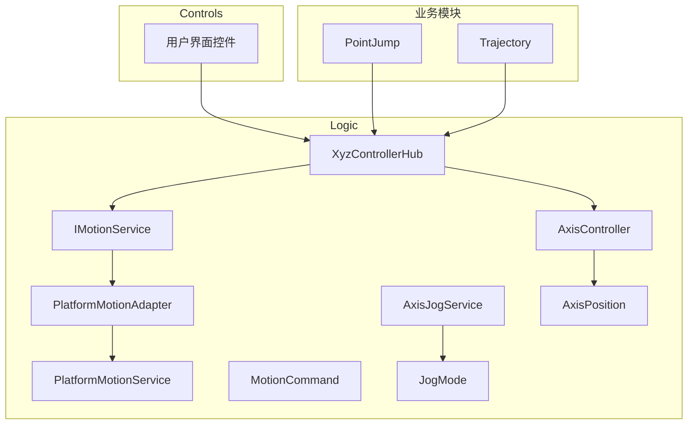
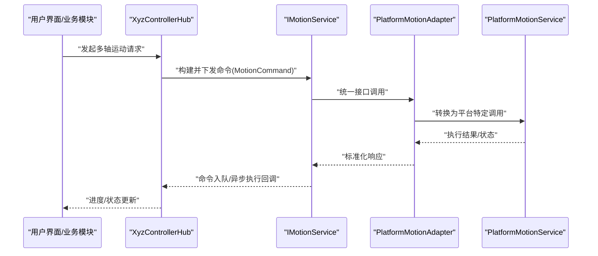
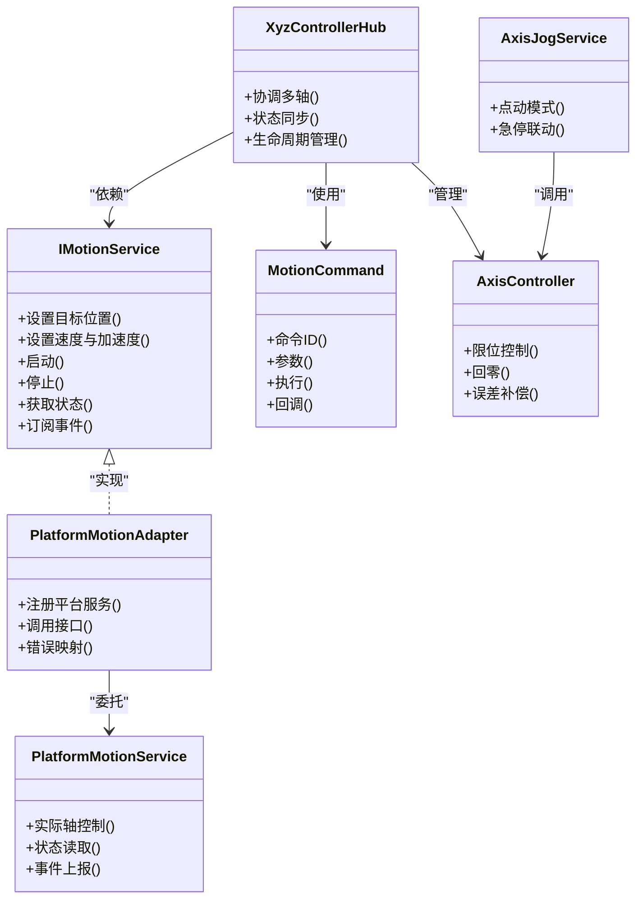

# 接口驱动设计

<cite>
**本文引用的文件**   
- [IMotionService.cs](file://Logic/IMotionService.cs)
- [PlatformMotionAdapter.cs](file://Logic/PlatformMotionAdapter.cs)
- [PlatformMotionService.cs](file://Logic/PlatformMotionService.cs)
- [MotionCommand.cs](file://Logic/MotionCommand.cs)
- [XyzControllerHub.cs](file://Logic/XyzControllerHub.cs)
- [AxisController.cs](file://Logic/AxisController.cs)
- [AxisJogService.cs](file://Logic/AxisJogService.cs)
- [AxisPosition.cs](file://Logic/AxisPosition.cs)
- [JogMode.cs](file://Logic/JogMode.cs)
- [PlatformMotionAdapter使用说明.md](file://Logic/PlatformMotionAdapter使用说明.md)
</cite>

## 目录
1. [简介](#简介)
2. [项目结构](#项目结构)
3. [核心组件](#核心组件)
4. [架构总览](#架构总览)
5. [详细组件分析](#详细组件分析)
6. [依赖关系分析](#依赖关系分析)
7. [性能考虑](#性能考虑)
8. [故障排查指南](#故障排查指南)
9. [结论](#结论)
10. [附录](#附录)

## 简介
本设计文档围绕ProcessModules项目的接口驱动设计展开，重点阐述以下方面：
- IMotionService接口的设计理念：运动控制的抽象化、平台无关性与扩展点定义。
- PlatformMotionAdapter适配器模式：屏蔽不同硬件平台的差异，提供统一调用面。
- MotionCommand命令模式：命令封装、队列管理与异步执行机制。
- XyzControllerHub控制器中心：多轴协调控制与状态同步策略。
- 接口实现示例：自定义运动服务与硬件适配器的开发要点。
- 接口版本管理：向后兼容与迁移策略。
- 最佳实践与常见陷阱：确保可维护性、可扩展性与稳定性。

## 项目结构
本项目采用分层与按功能域组织的方式，核心逻辑集中在Logic目录中，包含运动控制接口、适配器、命令、控制器中心等关键模块。UI与控制界面位于Controls与MainControl等目录，业务模块如PointJump、Trajectory通过进程模块方式集成。

图表来源
- [IMotionService.cs](file://Logic/IMotionService.cs)
- [PlatformMotionAdapter.cs](file://Logic/PlatformMotionAdapter.cs)
- [PlatformMotionService.cs](file://Logic/PlatformMotionService.cs)
- [MotionCommand.cs](file://Logic/MotionCommand.cs)
- [XyzControllerHub.cs](file://Logic/XyzControllerHub.cs)
- [AxisController.cs](file://Logic/AxisController.cs)
- [AxisJogService.cs](file://Logic/AxisJogService.cs)
- [AxisPosition.cs](file://Logic/AxisPosition.cs)
- [JogMode.cs](file://Logic/JogMode.cs)

章节来源
- [IMotionService.cs](file://Logic/IMotionService.cs)
- [PlatformMotionAdapter.cs](file://Logic/PlatformMotionAdapter.cs)
- [PlatformMotionService.cs](file://Logic/PlatformMotionService.cs)
- [MotionCommand.cs](file://Logic/MotionCommand.cs)
- [XyzControllerHub.cs](file://Logic/XyzControllerHub.cs)
- [AxisController.cs](file://Logic/AxisController.cs)
- [AxisJogService.cs](file://Logic/AxisJogService.cs)
- [AxisPosition.cs](file://Logic/AxisPosition.cs)
- [JogMode.cs](file://Logic/JogMode.cs)

## 核心组件
- IMotionService：定义运动控制的核心接口，包括目标位置设置、速度/加速度配置、运行控制、状态查询与事件通知等能力，强调平台无关与可扩展性。
- PlatformMotionAdapter：适配器层，将上层统一的运动控制请求转换为具体硬件平台的服务调用，屏蔽底层差异。
- PlatformMotionService：具体平台服务实现，对接硬件或仿真环境，提供实际的轴控制与状态反馈。
- MotionCommand：命令对象，封装单次运动指令（如点位、速度、加减速曲线），支持队列与异步执行。
- XyzControllerHub：三轴控制器中心，负责多轴协调、轨迹合成、状态同步与冲突消解。
- AxisController：单轴控制器，封装轴级控制逻辑（限位、回零、插补等）。
- AxisJogService：点动服务，提供手动步进、连续点动等交互能力。
- AxisPosition：轴位置数据模型，用于状态上报与同步。
- JogMode：点动模式枚举，定义不同的点动行为。

章节来源
- [IMotionService.cs](file://Logic/IMotionService.cs)
- [PlatformMotionAdapter.cs](file://Logic/PlatformMotionAdapter.cs)
- [PlatformMotionService.cs](file://Logic/PlatformMotionService.cs)
- [MotionCommand.cs](file://Logic/MotionCommand.cs)
- [XyzControllerHub.cs](file://Logic/XyzControllerHub.cs)
- [AxisController.cs](file://Logic/AxisController.cs)
- [AxisJogService.cs](file://Logic/AxisJogService.cs)
- [AxisPosition.cs](file://Logic/AxisPosition.cs)
- [JogMode.cs](file://Logic/JogMode.cs)

## 架构总览
整体架构遵循“接口驱动 + 适配器 + 命令 + 控制器中心”的分层设计：
- 上层应用（UI与业务模块）仅依赖IMotionService接口，不感知具体硬件。
- PlatformMotionAdapter作为适配层，将接口调用映射到具体PlatformMotionService。
- MotionCommand将复杂动作封装为可排队、可撤销、可重试的命令单元。
- XyzControllerHub协调多轴，保证一致性、顺序性与安全性。

图表来源
- [XyzControllerHub.cs](file://Logic/XyzControllerHub.cs)
- [IMotionService.cs](file://Logic/IMotionService.cs)
- [PlatformMotionAdapter.cs](file://Logic/PlatformMotionAdapter.cs)
- [PlatformMotionService.cs](file://Logic/PlatformMotionService.cs)
- [MotionCommand.cs](file://Logic/MotionCommand.cs)

## 详细组件分析

### IMotionService接口设计
- 设计理念
  - 抽象化：隐藏硬件细节，暴露稳定的控制方法集合。
  - 平台无关：通过接口契约约束行为，便于替换实现。
  - 扩展点：预留事件、回调与配置项，支持新特性接入。
- 关键能力
  - 目标位置与速度/加速度设置。
  - 启动/停止/暂停/复位等运行控制。
  - 状态查询与事件通知（完成、错误、报警）。
  - 参数校验与异常处理约定。
- 版本与兼容性
  - 新增方法需保持默认实现或向后兼容。
  - 废弃方法保留过渡期并提供迁移指引。

章节来源
- [IMotionService.cs](file://Logic/IMotionService.cs)

### PlatformMotionAdapter适配器模式
- 职责
  - 将IMotionService的通用调用转换为具体PlatformMotionService的API。
  - 处理单位换算、坐标系转换、时序对齐等差异。
- 设计要点
  - 单一适配入口，避免散落的平台判断。
  - 错误码与异常的统一映射。
  - 可插拔的多平台实现注册机制。
- 使用建议
  - 在初始化阶段注册平台服务。
  - 对平台能力进行探测与降级策略。

章节来源
- [PlatformMotionAdapter.cs](file://Logic/PlatformMotionAdapter.cs)
- [PlatformMotionService.cs](file://Logic/PlatformMotionService.cs)
- [PlatformMotionAdapter使用说明.md](file://Logic/PlatformMotionAdapter使用说明.md)

### MotionCommand命令模式
- 职责
  - 封装单次运动指令，包含轴列表、目标位置、速度/加速度、插补类型等。
  - 支持命令队列、优先级、取消与重试。
  - 提供执行结果与状态回调。
- 数据结构
  - 命令ID、时间戳、执行上下文、参数快照。
- 执行流程
  - 入队 -> 调度器选择 -> 执行 -> 回调结果 -> 清理。
- 并发与线程安全
  - 队列操作需原子化，避免竞态条件。
  - 回调需在合适的线程上下文中触发。

章节来源
- [MotionCommand.cs](file://Logic/MotionCommand.cs)

### XyzControllerHub控制器中心
- 职责
  - 多轴协调：XYZ三轴的同步与插补。
  - 状态同步：聚合各轴状态，提供一致视图。
  - 冲突消解：处理互斥资源与权限控制。
  - 生命周期管理：初始化、监控、优雅关闭。
- 关键流程
  - 接收命令 -> 解析与校验 -> 生成插补路径 -> 下发至各轴 -> 汇总状态 -> 回调上层。
- 扩展点
  - 插件式轴控制器注册。
  - 自定义插补算法接入。

章节来源
- [XyzControllerHub.cs](file://Logic/XyzControllerHub.cs)
- [AxisController.cs](file://Logic/AxisController.cs)
- [AxisPosition.cs](file://Logic/AxisPosition.cs)

### AxisController与AxisJogService
- AxisController
  - 单轴控制：限位、回零、速度/加速度曲线、误差补偿。
  - 状态上报：位置、速度、报警、就绪状态。
- AxisJogService
  - 点动模式：步进、连续、变速点动。
  - 交互友好：按键绑定、防抖、急停联动。

章节来源
- [AxisController.cs](file://Logic/AxisController.cs)
- [AxisJogService.cs](file://Logic/AxisJogService.cs)
- [AxisPosition.cs](file://Logic/AxisPosition.cs)
- [JogMode.cs](file://Logic/JogMode.cs)

## 依赖关系分析
- 耦合度
  - 上层仅依赖IMotionService，降低与实现的耦合。
  - PlatformMotionAdapter集中处理平台差异，提高内聚性。
- 依赖方向
  - UI/业务 -> XyzControllerHub -> IMotionService -> PlatformMotionAdapter -> PlatformMotionService。
- 潜在循环依赖
  - 通过接口与事件解耦，避免直接双向引用。

图表来源
- [IMotionService.cs](file://Logic/IMotionService.cs)
- [PlatformMotionAdapter.cs](file://Logic/PlatformMotionAdapter.cs)
- [PlatformMotionService.cs](file://Logic/PlatformMotionService.cs)
- [MotionCommand.cs](file://Logic/MotionCommand.cs)
- [XyzControllerHub.cs](file://Logic/XyzControllerHub.cs)
- [AxisController.cs](file://Logic/AxisController.cs)
- [AxisJogService.cs](file://Logic/AxisJogService.cs)

章节来源
- [IMotionService.cs](file://Logic/IMotionService.cs)
- [PlatformMotionAdapter.cs](file://Logic/PlatformMotionAdapter.cs)
- [PlatformMotionService.cs](file://Logic/PlatformMotionService.cs)
- [MotionCommand.cs](file://Logic/MotionCommand.cs)
- [XyzControllerHub.cs](file://Logic/XyzControllerHub.cs)
- [AxisController.cs](file://Logic/AxisController.cs)
- [AxisJogService.cs](file://Logic/AxisJogService.cs)

## 性能考虑
- 命令队列
  - 使用无锁队列或环形缓冲减少争用。
  - 批量合并相邻命令以降低开销。
- 异步执行
  - 非阻塞I/O与回调，避免主线程阻塞。
  - 合理设置超时与重试策略。
- 状态同步
  - 增量更新与事件驱动，减少轮询。
  - 状态去抖与合并上报。
- 资源管理
  - 及时释放句柄与内存。
  - 连接池与复用硬件资源。

## 故障排查指南
- 常见问题
  - 命令未执行：检查队列是否满、线程池是否饱和、命令参数是否合法。
  - 状态不同步：确认事件订阅是否正确、回调线程上下文是否有效。
  - 平台差异：核对单位换算、坐标系、时序要求。
- 诊断步骤
  - 启用详细日志，记录命令入队、执行、回调全链路。
  - 使用模拟平台服务验证接口契约。
  - 逐步隔离问题模块（UI、Hub、Adapter、Platform）。
- 恢复策略
  - 自动重试与降级执行。
  - 安全停机与状态复位。

章节来源
- [PlatformMotionAdapter使用说明.md](file://Logic/PlatformMotionAdapter使用说明.md)
- [MotionCommand.cs](file://Logic/MotionCommand.cs)
- [XyzControllerHub.cs](file://Logic/XyzControllerHub.cs)

## 结论
通过接口驱动与适配器、命令模式的结合，本项目实现了高内聚、低耦合的运动控制系统。IMotionService提供稳定契约，PlatformMotionAdapter屏蔽平台差异，MotionCommand保障命令的可编排与可观测，XyzControllerHub实现多轴协调与状态一致性。该设计具备良好的扩展性与可维护性，适合持续演进与多平台部署。

## 附录

### 接口实现示例要点
- 自定义运动服务
  - 实现IMotionService接口，提供参数校验、状态管理与事件通知。
  - 与PlatformMotionAdapter协作，注册具体平台服务。
- 自定义硬件适配器
  - 实现PlatformMotionService，处理硬件通信、单位换算与错误映射。
  - 提供能力探测与降级策略，确保鲁棒性。

章节来源
- [IMotionService.cs](file://Logic/IMotionService.cs)
- [PlatformMotionAdapter.cs](file://Logic/PlatformMotionAdapter.cs)
- [PlatformMotionService.cs](file://Logic/PlatformMotionService.cs)
- [PlatformMotionAdapter使用说明.md](file://Logic/PlatformMotionAdapter使用说明.md)

### 接口版本管理与迁移策略
- 版本策略
  - 语义化版本控制，明确破坏性变更与新增特性。
  - 废弃方法保留过渡期，提供迁移工具与文档。
- 兼容性保证
  - 默认实现与可选参数，避免强制升级。
  - 能力探测与动态加载，支持多版本并存。
- 迁移步骤
  - 评估影响范围，制定灰度发布计划。
  - 提供自动化脚本与测试用例，确保平滑迁移。

章节来源
- [IMotionService.cs](file://Logic/IMotionService.cs)
- [PlatformMotionAdapter使用说明.md](file://Logic/PlatformMotionAdapter使用说明.md)

### 最佳实践与常见陷阱
- 最佳实践
  - 严格遵循接口契约，避免隐式假设。
  - 使用命令模式提升可测试性与可回放性。
  - 事件驱动与异步回调，避免阻塞与死锁。
- 常见陷阱
  - 忽略线程安全，导致竞态条件。
  - 过度耦合平台实现，破坏抽象边界。
  - 未处理异常与超时，造成系统不稳定。

章节来源
- [MotionCommand.cs](file://Logic/MotionCommand.cs)
- [PlatformMotionAdapter.cs](file://Logic/PlatformMotionAdapter.cs)
- [XyzControllerHub.cs](file://Logic/XyzControllerHub.cs)