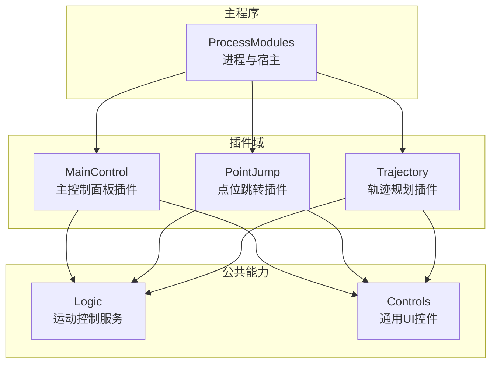
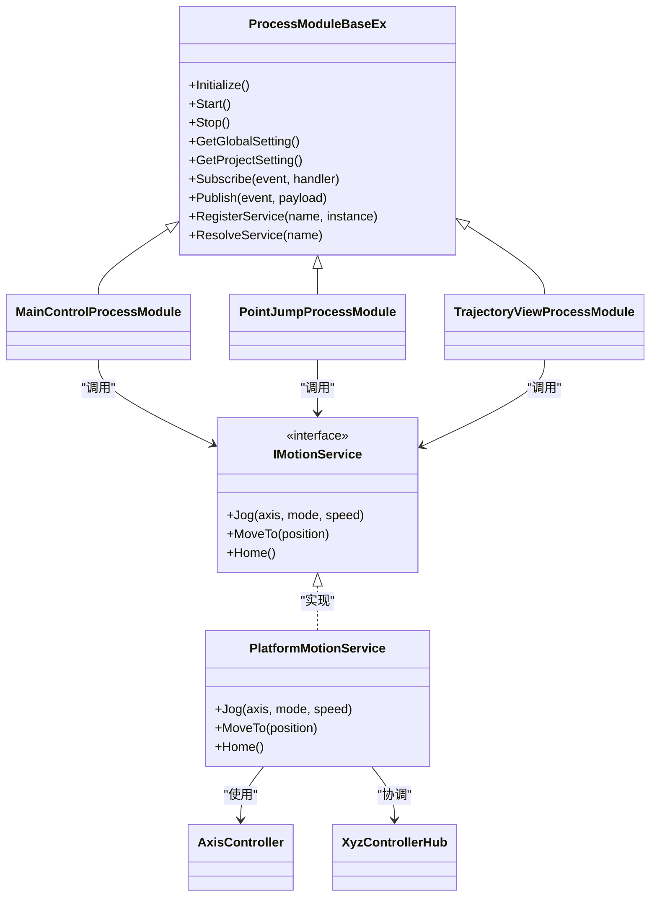
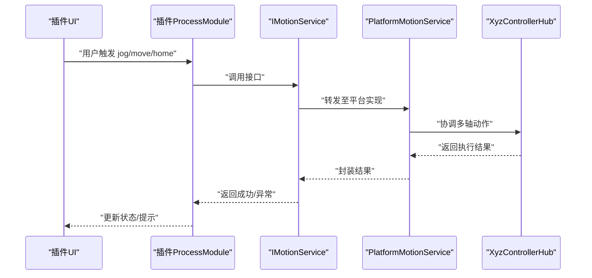
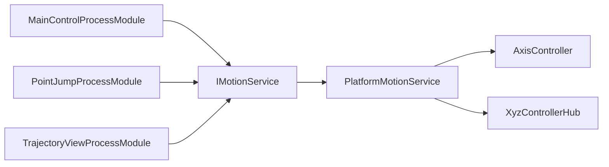

# 插件化架构

<cite>
**本文引用的文件**   
- [ProcessModules.csproj](file://ProcessModules.csproj)
- [MainControl/MainControlProcessModule.cs](file://MainControl/MainControlProcessModule.cs)
- [MainControl/MainControlGlobalSetting.cs](file://MainControl/MainControlGlobalSetting.cs)
- [MainControl/MainControlProjectSetting.cs](file://MainControl/MainControlProjectSetting.cs)
- [PointJump/PointJumpProcessModule.cs](file://PointJump/PointJumpProcessModule.cs)
- [PointJump/PointJumpGlobalSetting.cs](file://PointJump/PointJumpGlobalSetting.cs)
- [PointJump/PointJumpProjectSetting.cs](file://PointJump/PointJumpProjectSetting.cs)
- [Trajectory/TrajectoryViewProcessModule.cs](file://Trajectory/TrajectoryViewProcessModule.cs)
- [Trajectory/TrajectoryGlobalSetting.cs](file://Trajectory/TrajectoryGlobalSetting.cs)
- [Trajectory/TrajectoryProjectSetting.cs](file://Trajectory/TrajectoryProjectSetting.cs)
- [Logic/PlatformMotionService.cs](file://Logic/PlatformMotionService.cs)
- [Logic/IMotionService.cs](file://Logic/IMotionService.cs)
- [Logic/AxisController.cs](file://Logic/AxisController.cs)
- [Logic/XyzControllerHub.cs](file://Logic/XyzControllerHub.cs)
- [DOMO/DOMO.CS](file://DOMO/DOMO.CS)
- [DOMO/MAINMODUO.CS](file://DOMO/MAINMODUO.CS)
- [Controls/XYView.cs](file://Controls/XYView.cs)
- [Controls/ZBarView.cs](file://Controls/ZBarView.cs)
- [Controls/JogButton.cs](file://Controls/JogButton.cs)
- [README.md](file://README.md)
- [基类调整说明.md](file://基类调整说明.md)
- [独立 DLL 构建说明.md](file://独立 DLL 构建说明.md)
</cite>

## 目录
1. [简介](#简介)
2. [项目结构](#项目结构)
3. [核心组件](#核心组件)
4. [架构总览](#架构总览)
5. [详细组件分析](#详细组件分析)
6. [依赖关系分析](#依赖关系分析)
7. [性能考虑](#性能考虑)
8. [故障排查指南](#故障排查指南)
9. [结论](#结论)
10. [附录：API参考与开发示例](#附录api参考与开发示例)

## 简介
本文件面向ProcessModules项目的插件开发者，系统化阐述基于ProcessModuleBaseEx的插件化架构。内容涵盖：
- 插件生命周期管理（Initialize、Start、Stop等）
- 模块发现与加载机制
- 插件间通信协议
- 配置系统（GlobalSetting与ProjectSetting）
- 热插拔、版本兼容性与错误处理策略
- 插件打包、部署与管理最佳实践
- 从简单显示模块到复杂运动控制模块的完整开发示例

## 项目结构
本项目采用“主程序 + 多插件”的分层组织方式。每个插件以独立工程或命名空间形式存在，包含：
- ProcessModule实现（继承自ProcessModuleBaseEx）
- GlobalSetting与ProjectSetting定义
- UI控件与业务逻辑代码
- 资源与配置文件

图表来源
- [ProcessModules.csproj](file://ProcessModules.csproj)
- [MainControl/MainControlProcessModule.cs](file://MainControl/MainControlProcessModule.cs)
- [PointJump/PointJumpProcessModule.cs](file://PointJump/PointJumpProcessModule.cs)
- [Trajectory/TrajectoryViewProcessModule.cs](file://Trajectory/TrajectoryViewProcessModule.cs)
- [Logic/PlatformMotionService.cs](file://Logic/PlatformMotionService.cs)
- [Controls/XYView.cs](file://Controls/XYView.cs)

章节来源
- [README.md](file://README.md)
- [ProcessModules.csproj](file://ProcessModules.csproj)

## 核心组件
- ProcessModuleBaseEx：插件基类，定义生命周期钩子（Initialize、Start、Stop）、配置访问接口、事件总线与消息通道、以及对外暴露的能力契约。
- 各插件的ProcessModule实现：如MainControlProcessModule、PointJumpProcessModule、TrajectoryViewProcessModule，负责具体功能编排与UI集成。
- 配置体系：
  - GlobalSetting：全局配置，跨项目共享，通常用于硬件参数、默认行为、路径等。
  - ProjectSetting：项目级配置，针对当前工作区或任务集，保存用户偏好与运行时状态。
- 运动控制服务：
  - IMotionService：运动控制抽象接口。
  - PlatformMotionService：平台适配的具体实现。
  - AxisController、XyzControllerHub：轴控制器与多轴协调器。

章节来源
- [MainControl/MainControlProcessModule.cs](file://MainControl/MainControlProcessModule.cs)
- [PointJump/PointJumpProcessModule.cs](file://PointJump/PointJumpProcessModule.cs)
- [Trajectory/TrajectoryViewProcessModule.cs](file://Trajectory/TrajectoryViewProcessModule.cs)
- [MainControl/MainControlGlobalSetting.cs](file://MainControl/MainControlGlobalSetting.cs)
- [MainControl/MainControlProjectSetting.cs](file://MainControl/MainControlProjectSetting.cs)
- [PointJump/PointJumpGlobalSetting.cs](file://PointJump/PointJumpGlobalSetting.cs)
- [PointJump/PointJumpProjectSetting.cs](file://PointJump/PointJumpProjectSetting.cs)
- [Trajectory/TrajectoryGlobalSetting.cs](file://Trajectory/TrajectoryGlobalSetting.cs)
- [Trajectory/TrajectoryProjectSetting.cs](file://Trajectory/TrajectoryProjectSetting.cs)
- [Logic/IMotionService.cs](file://Logic/IMotionService.cs)
- [Logic/PlatformMotionService.cs](file://Logic/PlatformMotionService.cs)
- [Logic/AxisController.cs](file://Logic/AxisController.cs)
- [Logic/XyzControllerHub.cs](file://Logic/XyzControllerHub.cs)

## 架构总览
下图展示插件系统与核心服务的交互关系。插件通过基类提供的接口访问配置、事件总线与服务注册表；运动控制由统一的服务层提供，避免插件直接耦合底层设备。

图表来源
- [MainControl/MainControlProcessModule.cs](file://MainControl/MainControlProcessModule.cs)
- [PointJump/PointJumpProcessModule.cs](file://PointJump/PointJumpProcessModule.cs)
- [Trajectory/TrajectoryViewProcessModule.cs](file://Trajectory/TrajectoryViewProcessModule.cs)
- [Logic/IMotionService.cs](file://Logic/IMotionService.cs)
- [Logic/PlatformMotionService.cs](file://Logic/PlatformMotionService.cs)
- [Logic/AxisController.cs](file://Logic/AxisController.cs)
- [Logic/XyzControllerHub.cs](file://Logic/XyzControllerHub.cs)

## 详细组件分析

### 插件基类与生命周期
- Initialize：初始化阶段，读取并校验配置，建立内部状态，订阅必要事件。
- Start：启动阶段，创建UI、启动后台线程或定时器、注册服务、发布就绪事件。
- Stop：停止阶段，释放资源、取消订阅、保存配置、清理临时数据。

建议：
- 在Initialize中完成所有只读配置加载与校验，失败应抛出明确异常以便宿主捕获。
- 在Start中避免阻塞操作，耗时任务异步执行。
- 在Stop中确保幂等性，重复调用不引发异常。

章节来源
- [基类调整说明.md](file://基类调整说明.md)

### 模块发现与加载机制
- 插件工程需遵循统一的命名约定与输出结构，便于宿主扫描与反射加载。
- 宿主通过约定路径或清单文件发现插件DLL，按依赖顺序加载。
- 加载后实例化各插件的ProcessModule实现，依次调用Initialize与Start。

章节来源
- [独立 DLL 构建说明.md](file://独立 DLL 构建说明.md)

### 插件间通信协议
- 事件总线：插件通过Subscribe/Publish进行松耦合通信，支持强类型事件与负载。
- 服务注册：插件可RegisterService暴露能力，其他插件通过ResolveService获取实例。
- 推荐模式：
  - 命令-响应：通过事件携带请求ID与回调标识。
  - 发布-订阅：状态变更广播，如位置更新、报警信息。
  - 服务发现：按需解析服务实例，避免硬编码依赖。

章节来源
- [MainControl/MainControlProcessModule.cs](file://MainControl/MainControlProcessModule.cs)
- [PointJump/PointJumpProcessModule.cs](file://PointJump/PointJumpProcessModule.cs)
- [Trajectory/TrajectoryViewProcessModule.cs](file://Trajectory/TrajectoryViewProcessModule.cs)

### 配置系统（GlobalSetting与ProjectSetting）
- GlobalSetting：全局唯一，适合硬件端口、默认速度、单位换算等。
- ProjectSetting：随项目切换，适合工件坐标、加减速曲线、运行参数等。
- 读写规范：
  - 使用强类型配置对象，避免字符串解析错误。
  - 提供默认值与校验规则，保证向后兼容。
  - 敏感字段加密存储。

章节来源
- [MainControl/MainControlGlobalSetting.cs](file://MainControl/MainControlGlobalSetting.cs)
- [MainControl/MainControlProjectSetting.cs](file://MainControl/MainControlProjectSetting.cs)
- [PointJump/PointJumpGlobalSetting.cs](file://PointJump/PointJumpGlobalSetting.cs)
- [PointJump/PointJumpProjectSetting.cs](file://PointJump/PointJumpProjectSetting.cs)
- [Trajectory/TrajectoryGlobalSetting.cs](file://Trajectory/TrajectoryGlobalSetting.cs)
- [Trajectory/TrajectoryProjectSetting.cs](file://Trajectory/TrajectoryProjectSetting.cs)

### 运动控制服务与插件集成
- IMotionService为抽象接口，屏蔽底层差异。
- PlatformMotionService实现具体平台适配，AxisController管理单轴，XyzControllerHub协调多轴。
- 插件通过服务接口发起Jog、MoveTo、Home等操作，无需关心硬件细节。

图表来源
- [Logic/IMotionService.cs](file://Logic/IMotionService.cs)
- [Logic/PlatformMotionService.cs](file://Logic/PlatformMotionService.cs)
- [Logic/XyzControllerHub.cs](file://Logic/XyzControllerHub.cs)

章节来源
- [Logic/AxisController.cs](file://Logic/AxisController.cs)
- [Logic/XyzControllerHub.cs](file://Logic/XyzControllerHub.cs)
- [Logic/PlatformMotionService.cs](file://Logic/PlatformMotionService.cs)

### 插件热插拔机制
- 动态加载：宿主监听插件目录变化，增量加载新DLL或卸载旧版本。
- 隔离域：建议使用AppDomain或AssemblyLoadContext隔离插件，避免相互干扰。
- 平滑升级：先加载新版本，验证通过后替换旧实例，回滚策略保障稳定性。

章节来源
- [独立 DLL 构建说明.md](file://独立 DLL 构建说明.md)

### 版本兼容性与错误处理
- 版本声明：插件元数据包含版本号与兼容性矩阵。
- 渐进迁移：保持接口稳定，废弃成员标记为过时并提供替代方案。
- 错误处理：
  - 初始化失败：记录详细上下文，阻止插件激活。
  - 运行时异常：捕获并上报，提供降级模式。
  - 配置错误：提示用户修正，保留上次有效配置。

章节来源
- [基类调整说明.md](file://基类调整说明.md)

### 插件打包、部署与管理
- 打包：每个插件输出独立DLL，附带配置文件与资源。
- 部署：将DLL放入指定插件目录，宿主自动发现。
- 管理：提供启用/禁用、重启、日志查看与诊断工具。

章节来源
- [独立 DLL 构建说明.md](file://独立 DLL 构建说明.md)

## 依赖关系分析
插件之间通过事件与服务解耦，降低直接引用带来的耦合度。运动控制服务作为横切能力被多个插件复用。

图表来源
- [MainControl/MainControlProcessModule.cs](file://MainControl/MainControlProcessModule.cs)
- [PointJump/PointJumpProcessModule.cs](file://PointJump/PointJumpProcessModule.cs)
- [Trajectory/TrajectoryViewProcessModule.cs](file://Trajectory/TrajectoryViewProcessModule.cs)
- [Logic/IMotionService.cs](file://Logic/IMotionService.cs)
- [Logic/PlatformMotionService.cs](file://Logic/PlatformMotionService.cs)
- [Logic/AxisController.cs](file://Logic/AxisController.cs)
- [Logic/XyzControllerHub.cs](file://Logic/XyzControllerHub.cs)

章节来源
- [Logic/IMotionService.cs](file://Logic/IMotionService.cs)
- [Logic/PlatformMotionService.cs](file://Logic/PlatformMotionService.cs)

## 性能考虑
- 事件分发：批量合并高频事件，避免UI抖动。
- I/O操作：异步化配置读写与日志写入，减少阻塞。
- 内存管理：及时释放图像缓存与临时对象，避免GC压力。
- 并发控制：对共享资源加锁或使用无锁队列，防止竞争条件。

[本节为通用指导，不直接分析具体文件]

## 故障排查指南
- 常见问题：
  - 插件未加载：检查DLL路径、依赖缺失、版本不匹配。
  - 配置错误：核对JSON/XML格式与必填字段。
  - 运动异常：确认轴使能、限位开关、回零流程。
- 诊断步骤：
  - 启用详细日志，定位异常堆栈。
  - 使用最小化配置复现问题。
  - 逐步禁用插件隔离问题源。

章节来源
- [DOMO/DOMO.CS](file://DOMO/DOMO.CS)
- [DOMO/MAINMODUO.CS](file://DOMO/MAINMODUO.CS)

## 结论
ProcessModules的插件化架构以ProcessModuleBaseEx为核心，结合事件总线与服务注册，实现了高内聚、低耦合的可扩展系统。通过严格的配置管理与错误处理策略，保障了系统的稳定性与可维护性。遵循本文档的开发指南与最佳实践，可快速构建高质量的插件模块。

[本节为总结性内容，不直接分析具体文件]

## 附录：API参考与开发示例

### API参考要点
- 生命周期方法
  - Initialize：初始化配置与订阅
  - Start：启动UI与后台任务
  - Stop：释放资源与保存状态
- 配置访问
  - GetGlobalSetting：获取全局配置
  - GetProjectSetting：获取项目配置
- 通信接口
  - Subscribe/Publish：事件订阅与发布
  - RegisterService/ResolveService：服务注册与解析

章节来源
- [基类调整说明.md](file://基类调整说明.md)

### 开发示例一：简单显示模块
- 目标：创建一个仅显示文本与状态的插件。
- 步骤：
  - 新建插件工程，添加ProcessModule实现。
  - 在Initialize中加载配置，在Start中创建Label与Timer。
  - 通过事件总线接收外部状态更新并刷新UI。
- 关键点：避免在UI线程执行耗时操作，使用异步更新。

章节来源
- [Controls/XYView.cs](file://Controls/XYView.cs)
- [Controls/ZBarView.cs](file://Controls/ZBarView.cs)

### 开发示例二：复杂运动控制模块
- 目标：实现 Jog、MoveTo、Home 等功能，并与现有运动服务集成。
- 步骤：
  - 在Initialize中解析GlobalSetting与ProjectSetting。
  - 在Start中注册UI控件（JogButton等），绑定事件。
  - 通过IMotionService调用平台服务，处理异常与状态反馈。
- 关键点：确保限位保护、急停响应与回零流程正确。

章节来源
- [Controls/JogButton.cs](file://Controls/JogButton.cs)
- [Logic/IMotionService.cs](file://Logic/IMotionService.cs)
- [Logic/PlatformMotionService.cs](file://Logic/PlatformMotionService.cs)

### 插件打包与部署清单
- 输出：插件DLL、配置文件、资源文件夹。
- 部署：复制到插件目录，宿主自动发现。
- 管理：启用/禁用、重启、日志查看。

章节来源
- [独立 DLL 构建说明.md](file://独立 DLL 构建说明.md)