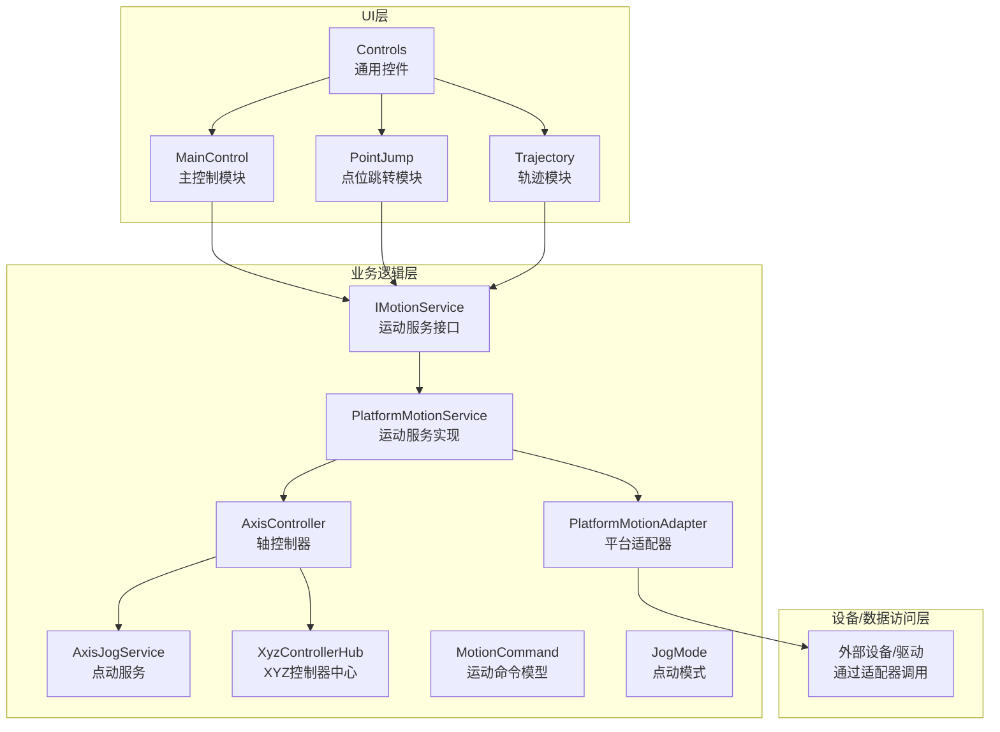
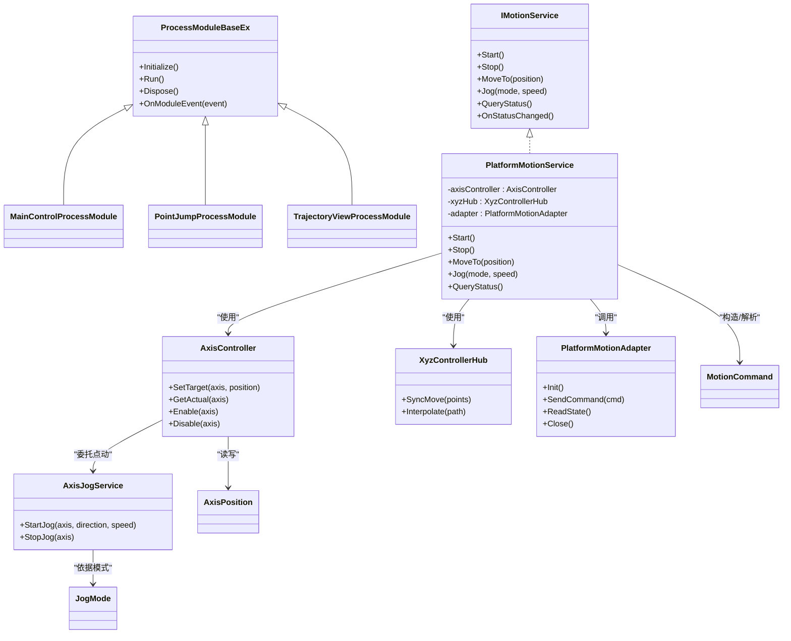
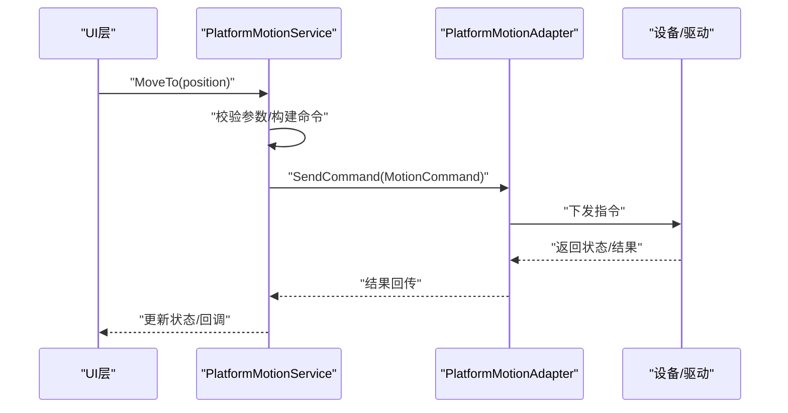
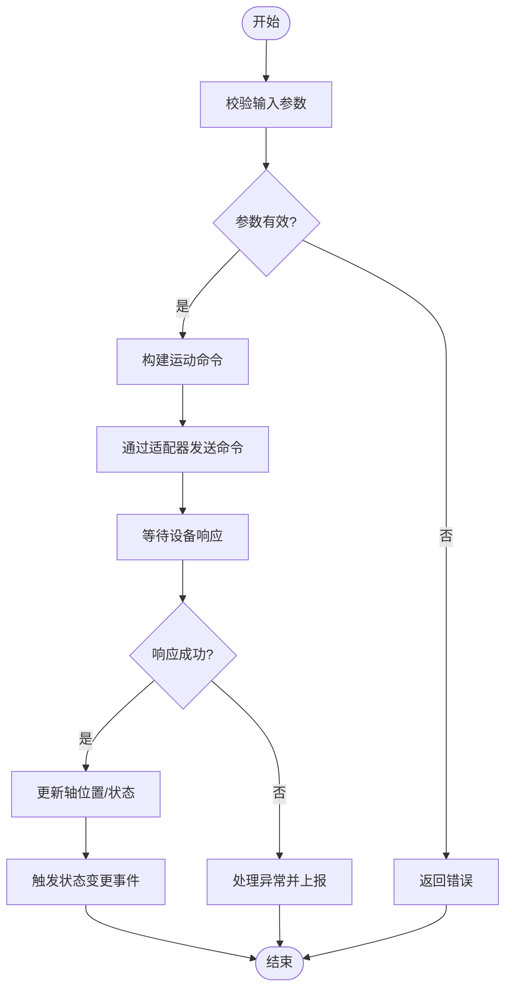
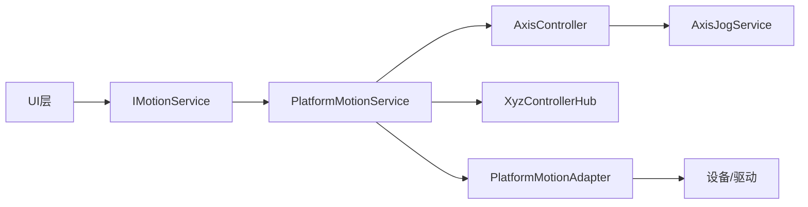

# 架构概览

<cite>
**本文引用的文件**   
- [ProcessModules.csproj](file://ProcessModules.csproj)
- [README.md](file://README.md)
- [Logic/IMotionService.cs](file://Logic/IMotionService.cs)
- [Logic/PlatformMotionAdapter.cs](file://Logic/PlatformMotionAdapter.cs)
- [Logic/PlatformMotionService.cs](file://Logic/PlatformMotionService.cs)
- [Logic/MotionCommand.cs](file://Logic/MotionCommand.cs)
- [Logic/JogMode.cs](file://Logic/JogMode.cs)
- [Logic/AxisController.cs](file://Logic/AxisController.cs)
- [Logic/AxisJogService.cs](file://Logic/AxisJogService.cs)
- [Logic/AxisPosition.cs](file://Logic/AxisPosition.cs)
- [Logic/XyzControllerHub.cs](file://Logic/XyzControllerHub.cs)
- [MainControl/MainControlProcessModule.cs](file://MainControl/MainControlProcessModule.cs)
- [PointJump/PointJumpProcessModule.cs](file://PointJump/PointJumpProcessModule.cs)
- [Trajectory/TrajectoryViewProcessModule.cs](file://Trajectory/TrajectoryViewProcessModule.cs)
- [Controls/MathHelper.cs](file://Controls/MathHelper.cs)
- [Controls/PaintHelper.cs](file://Controls/PaintHelper.cs)
- [Controls/DroLabel.cs](file://Controls/DroLabel.cs)
- [Controls/JogButton.cs](file://Controls/JogButton.cs)
- [Controls/XYView.cs](file://Controls/XYView.cs)
- [Controls/ZBarView.cs](file://Controls/ZBarView.cs)
</cite>

## 目录
1. [简介](#简介)
2. [项目结构](#项目结构)
3. [核心组件](#核心组件)
4. [架构总览](#架构总览)
5. [详细组件分析](#详细组件分析)
6. [依赖关系分析](#依赖关系分析)
7. [性能考量](#性能考量)
8. [故障排查指南](#故障排查指南)
9. [结论](#结论)
10. [附录](#附录)

## 简介
本架构概览面向ProcessModules项目的整体设计，重点阐述分层架构（UI层、业务逻辑层、数据访问/设备适配层）、插件化架构与接口驱动开发理念。文档围绕以下核心组件展开：ProcessModuleBaseEx基类（用于模块生命周期与宿主集成）、IMotionService接口（运动控制抽象）、PlatformMotionAdapter适配器（平台差异屏蔽）等。同时说明模块间通信机制、事件处理模式与异步操作设计，并通过架构图与数据流图展示组件交互方式，帮助初学者理解概念并为有经验的开发者提供实现细节参考。

## 项目结构
本项目采用多工程模块化组织，按功能域划分：
- Controls：通用控件与绘图辅助，如坐标视图、按钮、数值标签等
- Logic：运动控制核心逻辑、命令模型、服务与适配器
- MainControl、PointJump、Trajectory：具体业务模块（插件），各自包含界面与进程模块入口
- 根目录：项目配置与说明文档

图表来源
- [MainControl/MainControlProcessModule.cs](file://MainControl/MainControlProcessModule.cs)
- [PointJump/PointJumpProcessModule.cs](file://PointJump/PointJumpProcessModule.cs)
- [Trajectory/TrajectoryViewProcessModule.cs](file://Trajectory/TrajectoryViewProcessModule.cs)
- [Logic/IMotionService.cs](file://Logic/IMotionService.cs)
- [Logic/PlatformMotionService.cs](file://Logic/PlatformMotionService.cs)
- [Logic/PlatformMotionAdapter.cs](file://Logic/PlatformMotionAdapter.cs)
- [Logic/AxisController.cs](file://Logic/AxisController.cs)
- [Logic/AxisJogService.cs](file://Logic/AxisJogService.cs)
- [Logic/XyzControllerHub.cs](file://Logic/XyzControllerHub.cs)
- [Logic/MotionCommand.cs](file://Logic/MotionCommand.cs)
- [Logic/JogMode.cs](file://Logic/JogMode.cs)
- [Controls/DroLabel.cs](file://Controls/DroLabel.cs)
- [Controls/JogButton.cs](file://Controls/JogButton.cs)
- [Controls/XYView.cs](file://Controls/XYView.cs)
- [Controls/ZBarView.cs](file://Controls/ZBarView.cs)

章节来源
- [ProcessModules.csproj](file://ProcessModules.csproj)
- [README.md](file://README.md)

## 核心组件
- ProcessModuleBaseEx（基类）
  - 作用：为各业务模块提供统一的进程模块生命周期管理、初始化/销毁钩子、与宿主通信能力
  - 设计要点：封装模块注册、配置加载、资源释放；对外暴露扩展点供子类覆盖
  - 使用位置：MainControlProcessModule、PointJumpProcessModule、TrajectoryViewProcessModule等继承该基类

- IMotionService（接口）
  - 作用：定义运动控制服务的统一契约，包括启动/停止、轴控制、点动、状态查询、事件通知等
  - 设计要点：以接口隔离平台差异，便于替换实现或进行单元测试

- PlatformMotionAdapter（适配器）
  - 作用：屏蔽底层设备/驱动差异，将上层运动命令转换为平台特定调用
  - 设计要点：策略/适配器模式，支持多平台实现切换

- PlatformMotionService（服务实现）
  - 作用：实现IMotionService，协调AxisController、XyzControllerHub与PlatformMotionAdapter完成实际运动控制

- AxisController / AxisJogService / XyzControllerHub
  - 作用：轴级控制、点动逻辑、XYZ三轴协同控制与调度

- MotionCommand / JogMode / AxisPosition
  - 作用：运动命令模型、点动模式枚举、轴位置数据结构，贯穿UI到设备层的数据载体

章节来源
- [MainControl/MainControlProcessModule.cs](file://MainControl/MainControlProcessModule.cs)
- [PointJump/PointJumpProcessModule.cs](file://PointJump/PointJumpProcessModule.cs)
- [Trajectory/TrajectoryViewProcessModule.cs](file://Trajectory/TrajectoryViewProcessModule.cs)
- [Logic/IMotionService.cs](file://Logic/IMotionService.cs)
- [Logic/PlatformMotionService.cs](file://Logic/PlatformMotionService.cs)
- [Logic/PlatformMotionAdapter.cs](file://Logic/PlatformMotionAdapter.cs)
- [Logic/AxisController.cs](file://Logic/AxisController.cs)
- [Logic/AxisJogService.cs](file://Logic/AxisJogService.cs)
- [Logic/XyzControllerHub.cs](file://Logic/XyzControllerHub.cs)
- [Logic/MotionCommand.cs](file://Logic/MotionCommand.cs)
- [Logic/JogMode.cs](file://Logic/JogMode.cs)
- [Logic/AxisPosition.cs](file://Logic/AxisPosition.cs)

## 架构总览
系统采用“UI层—业务逻辑层—设备适配层”的分层架构，结合插件化与接口驱动：
- UI层：各业务模块的窗体与控件，负责用户交互与可视化
- 业务逻辑层：IMotionService及其实现，封装运动控制流程、命令编排、状态同步
- 设备适配层：PlatformMotionAdapter屏蔽硬件差异，向上提供稳定API

图表来源
- [MainControl/MainControlProcessModule.cs](file://MainControl/MainControlProcessModule.cs)
- [PointJump/PointJumpProcessModule.cs](file://PointJump/PointJumpProcessModule.cs)
- [Trajectory/TrajectoryViewProcessModule.cs](file://Trajectory/TrajectoryViewProcessModule.cs)
- [Logic/IMotionService.cs](file://Logic/IMotionService.cs)
- [Logic/PlatformMotionService.cs](file://Logic/PlatformMotionService.cs)
- [Logic/PlatformMotionAdapter.cs](file://Logic/PlatformMotionAdapter.cs)
- [Logic/AxisController.cs](file://Logic/AxisController.cs)
- [Logic/AxisJogService.cs](file://Logic/AxisJogService.cs)
- [Logic/XyzControllerHub.cs](file://Logic/XyzControllerHub.cs)
- [Logic/MotionCommand.cs](file://Logic/MotionCommand.cs)
- [Logic/JogMode.cs](file://Logic/JogMode.cs)
- [Logic/AxisPosition.cs](file://Logic/AxisPosition.cs)

## 详细组件分析

### 分层架构与插件化设计
- 分层职责清晰：
  - UI层仅关注交互与展示，通过IMotionService发起请求
  - 业务逻辑层聚合控制器与适配器，编排运动流程
  - 设备适配层屏蔽平台差异，保证上层稳定
- 插件化：
  - 各业务模块继承ProcessModuleBaseEx，由宿主统一管理生命周期
  - 模块间通过IMotionService解耦，避免直接耦合

章节来源
- [MainControl/MainControlProcessModule.cs](file://MainControl/MainControlProcessModule.cs)
- [PointJump/PointJumpProcessModule.cs](file://PointJump/PointJumpProcessModule.cs)
- [Trajectory/TrajectoryViewProcessModule.cs](file://Trajectory/TrajectoryViewProcessModule.cs)

### 接口驱动与适配器模式
- IMotionService作为契约，使PlatformMotionService可被替换或模拟
- PlatformMotionAdapter将上层命令映射到底层设备API，支持多平台实现

图表来源
- [Logic/IMotionService.cs](file://Logic/IMotionService.cs)
- [Logic/PlatformMotionService.cs](file://Logic/PlatformMotionService.cs)
- [Logic/PlatformMotionAdapter.cs](file://Logic/PlatformMotionAdapter.cs)
- [Logic/MotionCommand.cs](file://Logic/MotionCommand.cs)

章节来源
- [Logic/IMotionService.cs](file://Logic/IMotionService.cs)
- [Logic/PlatformMotionService.cs](file://Logic/PlatformMotionService.cs)
- [Logic/PlatformMotionAdapter.cs](file://Logic/PlatformMotionAdapter.cs)

### 轴控制与点动流程
- AxisController负责单轴目标设置与实际位置读取
- AxisJogService根据JogMode执行连续点动，支持启停与速度控制
- XyzControllerHub协调多轴联动与插补

图表来源
- [Logic/AxisController.cs](file://Logic/AxisController.cs)
- [Logic/AxisJogService.cs](file://Logic/AxisJogService.cs)
- [Logic/XyzControllerHub.cs](file://Logic/XyzControllerHub.cs)
- [Logic/MotionCommand.cs](file://Logic/MotionCommand.cs)
- [Logic/JogMode.cs](file://Logic/JogMode.cs)

章节来源
- [Logic/AxisController.cs](file://Logic/AxisController.cs)
- [Logic/AxisJogService.cs](file://Logic/AxisJogService.cs)
- [Logic/XyzControllerHub.cs](file://Logic/XyzControllerHub.cs)
- [Logic/MotionCommand.cs](file://Logic/MotionCommand.cs)
- [Logic/JogMode.cs](file://Logic/JogMode.cs)

### 事件处理与异步操作
- 事件：状态变化、错误上报、运动完成等通过事件通知UI层
- 异步：长耗时操作（设备通信、插补计算）采用异步任务，避免阻塞UI线程
- 建议：在UI层订阅事件，使用线程安全的队列或调度器更新界面

章节来源
- [Logic/IMotionService.cs](file://Logic/IMotionService.cs)
- [Logic/PlatformMotionService.cs](file://Logic/PlatformMotionService.cs)

### 数据模型与一致性
- MotionCommand：统一描述运动意图（目标、速度、加速度等）
- AxisPosition：记录轴当前位置与目标位置
- JogMode：定义点动方向与模式（如步进、连续）

章节来源
- [Logic/MotionCommand.cs](file://Logic/MotionCommand.cs)
- [Logic/AxisPosition.cs](file://Logic/AxisPosition.cs)
- [Logic/JogMode.cs](file://Logic/JogMode.cs)

### UI控件与数据绑定
- DroLabel：显示实时数值（如坐标）
- JogButton：触发点动动作
- XYView/ZBarView：绘制二维视图与Z轴条状指示
- MathHelper/PaintHelper：数学计算与绘图工具

章节来源
- [Controls/DroLabel.cs](file://Controls/DroLabel.cs)
- [Controls/JogButton.cs](file://Controls/JogButton.cs)
- [Controls/XYView.cs](file://Controls/XYView.cs)
- [Controls/ZBarView.cs](file://Controls/ZBarView.cs)
- [Controls/MathHelper.cs](file://Controls/MathHelper.cs)
- [Controls/PaintHelper.cs](file://Controls/PaintHelper.cs)

## 依赖关系分析
- 低耦合：UI层依赖IMotionService接口，不感知具体实现
- 高内聚：PlatformMotionService聚合控制器与适配器，集中编排
- 可扩展：新增平台只需实现PlatformMotionAdapter；新增业务模块只需继承ProcessModuleBaseEx

图表来源
- [Logic/IMotionService.cs](file://Logic/IMotionService.cs)
- [Logic/PlatformMotionService.cs](file://Logic/PlatformMotionService.cs)
- [Logic/PlatformMotionAdapter.cs](file://Logic/PlatformMotionAdapter.cs)
- [Logic/AxisController.cs](file://Logic/AxisController.cs)
- [Logic/AxisJogService.cs](file://Logic/AxisJogService.cs)
- [Logic/XyzControllerHub.cs](file://Logic/XyzControllerHub.cs)

章节来源
- [Logic/IMotionService.cs](file://Logic/IMotionService.cs)
- [Logic/PlatformMotionService.cs](file://Logic/PlatformMotionService.cs)
- [Logic/PlatformMotionAdapter.cs](file://Logic/PlatformMotionAdapter.cs)
- [Logic/AxisController.cs](file://Logic/AxisController.cs)
- [Logic/AxisJogService.cs](file://Logic/AxisJogService.cs)
- [Logic/XyzControllerHub.cs](file://Logic/XyzControllerHub.cs)

## 性能考量
- 减少UI阻塞：所有设备通信与复杂计算走异步路径，UI仅做轻量更新
- 批量命令：对多点轨迹采用批处理与插补优化，降低往返开销
- 缓存与节流：高频状态更新采用节流与增量刷新，避免重绘风暴
- 资源管理：及时释放设备连接与图形资源，防止内存泄漏

[本节为通用指导，无需引用具体文件]

## 故障排查指南
- 常见问题定位
  - 设备连接失败：检查PlatformMotionAdapter初始化与关闭流程
  - 运动无响应：确认MotionCommand参数与JogMode设置是否正确
  - UI不同步：检查事件订阅与线程安全更新
- 调试建议
  - 在PlatformMotionService中增加日志输出关键步骤
  - 使用Mock实现IMotionService进行单元测试
  - 通过控件打印中间状态（DroLabel、XYView）辅助定位

章节来源
- [Logic/PlatformMotionAdapter.cs](file://Logic/PlatformMotionAdapter.cs)
- [Logic/PlatformMotionService.cs](file://Logic/PlatformMotionService.cs)
- [Logic/MotionCommand.cs](file://Logic/MotionCommand.cs)
- [Logic/JogMode.cs](file://Logic/JogMode.cs)
- [Controls/DroLabel.cs](file://Controls/DroLabel.cs)
- [Controls/XYView.cs](file://Controls/XYView.cs)

## 结论
ProcessModules采用清晰的分层与插件化架构，通过IMotionService与PlatformMotionAdapter实现接口驱动与平台解耦。该设计提升了系统的可扩展性、可维护性与可测试性，既适合初学者理解架构思想，也为有经验的开发者提供了明确的扩展点与实现指引。

[本节为总结性内容，无需引用具体文件]

## 附录
- 术语表
  - 分层架构：将系统划分为UI、业务逻辑、设备适配等层次，职责分离
  - 插件化：模块独立开发、按需加载与管理
  - 接口驱动：以接口定义契约，实现与调用解耦
  - 适配器模式：将不同接口转换为统一接口，屏蔽差异
- 最佳实践
  - 保持UI薄、逻辑厚，避免UI直接访问设备
  - 使用事件与异步提升响应性与用户体验
  - 通过接口与适配器增强可测试性与可替换性

[本节为补充信息，无需引用具体文件]