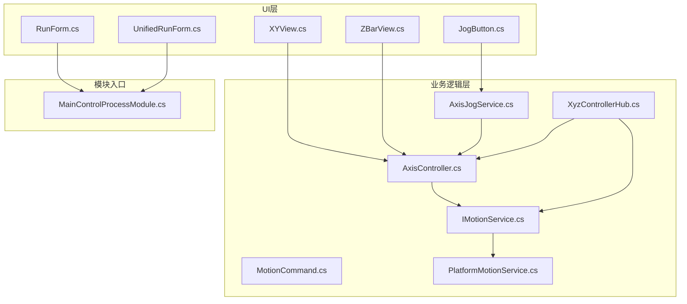
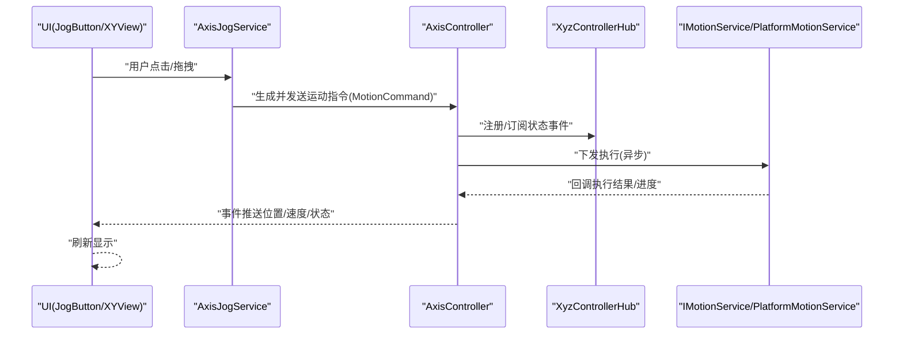
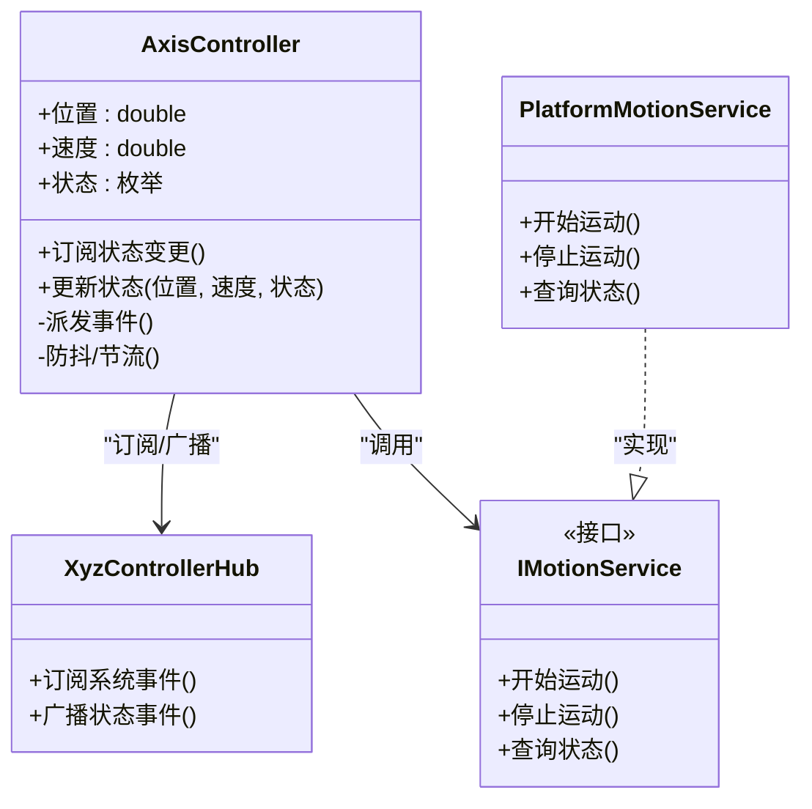
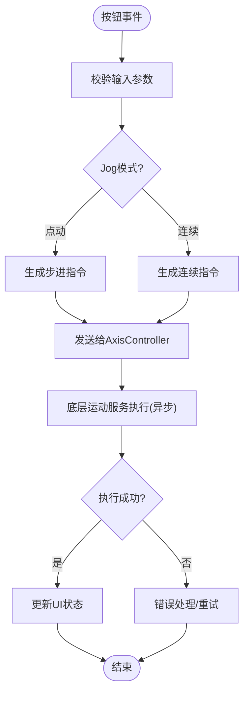
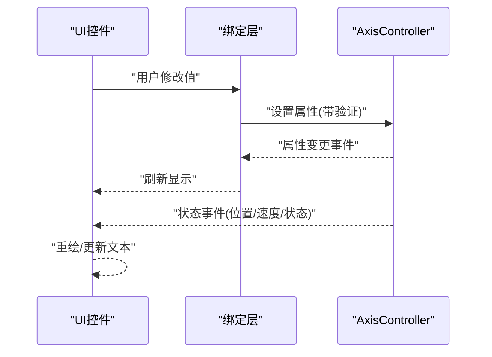
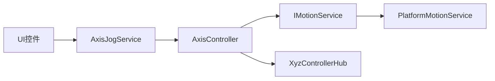

# 组件通信机制

<cite>
**本文引用的文件**   
- [AxisController.cs](file://Logic/AxisController.cs)
- [AxisJogService.cs](file://Logic/AxisJogService.cs)
- [IMotionService.cs](file://Logic/IMotionService.cs)
- [MotionCommand.cs](file://Logic/MotionCommand.cs)
- [PlatformMotionService.cs](file://Logic/PlatformMotionService.cs)
- [XyzControllerHub.cs](file://Logic/XyzControllerHub.cs)
- [JogButton.cs](file://Controls/JogButton.cs)
- [XYView.cs](file://Controls/XYView.cs)
- [ZBarView.cs](file://Controls/ZBarView.cs)
- [MainControlProcessModule.cs](file://MainControl/MainControlProcessModule.cs)
- [RunForm.cs](file://MainControl/RunForm.cs)
- [UnifiedRunForm.cs](file://MainControl/UnifiedRunForm.cs)
</cite>

## 目录
1. [简介](#简介)
2. [项目结构](#项目结构)
3. [核心组件](#核心组件)
4. [架构总览](#架构总览)
5. [详细组件分析](#详细组件分析)
6. [依赖关系分析](#依赖关系分析)
7. [性能考虑](#性能考虑)
8. [故障排查指南](#故障排查指南)
9. [结论](#结论)
10. [附录：通信模式与示例索引](#附录通信模式与示例索引)

## 简介
本文件面向 ProcessModules 项目的“组件通信机制”，系统性阐述事件驱动、消息传递、回调与订阅发布等模式在轴控制与用户交互中的落地方式。重点覆盖：
- AxisController 的状态同步机制（位置、速度、状态实时更新）
- JogService 的用户交互响应（按钮事件到运动指令的转换）
- UI 与业务逻辑的数据绑定（双向绑定与属性变更通知）
- 异步操作处理（Task、async/await 与线程安全）
- 通信性能优化与调试技巧

## 项目结构
本项目采用分层组织：UI 控件位于 Controls，业务逻辑位于 Logic，主界面与模块入口位于 MainControl。通信贯穿三层，通过事件、命令与服务接口解耦。

图表来源 
- [JogButton.cs](file://Controls/JogButton.cs)
- [XYView.cs](file://Controls/XYView.cs)
- [ZBarView.cs](file://Controls/ZBarView.cs)
- [RunForm.cs](file://MainControl/RunForm.cs)
- [UnifiedRunForm.cs](file://MainControl/UnifiedRunForm.cs)
- [AxisController.cs](file://Logic/AxisController.cs)
- [AxisJogService.cs](file://Logic/AxisJogService.cs)
- [IMotionService.cs](file://Logic/IMotionService.cs)
- [MotionCommand.cs](file://Logic/MotionCommand.cs)
- [PlatformMotionService.cs](file://Logic/PlatformMotionService.cs)
- [XyzControllerHub.cs](file://Logic/XyzControllerHub.cs)
- [MainControlProcessModule.cs](file://MainControl/MainControlProcessModule.cs)

章节来源
- [MainControlProcessModule.cs](file://MainControl/MainControlProcessModule.cs)
- [RunForm.cs](file://MainControl/RunForm.cs)
- [UnifiedRunForm.cs](file://MainControl/UnifiedRunForm.cs)

## 核心组件
- AxisController：轴状态与运动的协调者，负责位置/速度/状态的实时同步与更新分发。
- AxisJogService：将用户交互（如点动按钮）转换为运动指令，并驱动 AxisController。
- IMotionService 与 PlatformMotionService：抽象与实现底层运动服务，屏蔽硬件差异。
- MotionCommand：运动指令载体，用于跨层传递。
- XyzControllerHub：多轴控制器中枢，统一调度与广播。
- UI 控件（JogButton、XYView、ZBarView）：采集用户输入与展示状态。

章节来源
- [AxisController.cs](file://Logic/AxisController.cs)
- [AxisJogService.cs](file://Logic/AxisJogService.cs)
- [IMotionService.cs](file://Logic/IMotionService.cs)
- [PlatformMotionService.cs](file://Logic/PlatformMotionService.cs)
- [MotionCommand.cs](file://Logic/MotionCommand.cs)
- [XyzControllerHub.cs](file://Logic/XyzControllerHub.cs)
- [JogButton.cs](file://Controls/JogButton.cs)
- [XYView.cs](file://Controls/XYView.cs)
- [ZBarView.cs](file://Controls/ZBarView.cs)

## 架构总览
整体通信以“事件+命令+服务”为主：
- 事件驱动：AxisController 暴露状态变更事件，UI 订阅后刷新显示。
- 消息传递：MotionCommand 作为不可变消息在层间传递。
- 回调机制：平台运动服务完成时回调上层，触发后续动作。
- 订阅发布：XyzControllerHub 作为总线，集中订阅/发布系统级事件。

图表来源 
- [AxisJogService.cs](file://Logic/AxisJogService.cs)
- [AxisController.cs](file://Logic/AxisController.cs)
- [XyzControllerHub.cs](file://Logic/XyzControllerHub.cs)
- [IMotionService.cs](file://Logic/IMotionService.cs)
- [PlatformMotionService.cs](file://Logic/PlatformMotionService.cs)
- [JogButton.cs](file://Controls/JogButton.cs)
- [XYView.cs](file://Controls/XYView.cs)

## 详细组件分析

### AxisController：状态同步与实时更新
- 职责
  - 维护轴的位置、速度、运行状态等核心属性。
  - 对外暴露状态变更事件，供 UI 订阅。
  - 接收来自服务层的回调，合并为一致的状态快照。
  - 提供节流/去抖策略，避免高频刷新导致 UI 卡顿。
- 关键流程
  - 初始化时订阅底层运动服务的状态事件。
  - 收到回调后更新内部状态，并通过事件广播。
  - UI 订阅事件后更新显示；必要时进行数据格式化。
- 线程安全
  - 使用线程安全的集合与锁保护共享状态。
  - 事件派发在合适的上下文（UI 线程或任务调度器）进行。

图表来源 
- [AxisController.cs](file://Logic/AxisController.cs)
- [XyzControllerHub.cs](file://Logic/XyzControllerHub.cs)
- [IMotionService.cs](file://Logic/IMotionService.cs)
- [PlatformMotionService.cs](file://Logic/PlatformMotionService.cs)

章节来源
- [AxisController.cs](file://Logic/AxisController.cs)
- [XyzControllerHub.cs](file://Logic/XyzControllerHub.cs)

### AxisJogService：用户交互到运动指令的转换
- 职责
  - 监听 UI 按钮事件（按下/释放）。
  - 根据当前 jog 模式与参数生成 MotionCommand。
  - 调用 AxisController 执行点动、步进或连续移动。
- 关键点
  - 将用户输入规范化为统一的指令模型。
  - 对重复按键进行合并与限流，防止指令风暴。
  - 异常回退：当底层服务不可用时，给出可恢复的错误提示。

图表来源 
- [AxisJogService.cs](file://Logic/AxisJogService.cs)
- [MotionCommand.cs](file://Logic/MotionCommand.cs)
- [AxisController.cs](file://Logic/AxisController.cs)

章节来源
- [AxisJogService.cs](file://Logic/AxisJogService.cs)
- [MotionCommand.cs](file://Logic/MotionCommand.cs)

### UI 与业务逻辑的数据绑定
- 双向绑定
  - UI 控件（如滑块、文本框）与 AxisController 的属性建立绑定。
  - 属性变更通知通过事件或 INotifyPropertyChanged 风格机制实现。
- 单向订阅
  - 视图订阅 AxisController 的状态事件，仅用于刷新显示。
- 典型场景
  - JogButton 按下时，向 AxisJogService 发出指令；完成后从 AxisController 获取最新状态刷新按钮指示。
  - XYView/ZBarView 订阅位置/速度事件，绘制轨迹与数值。

图表来源 
- [JogButton.cs](file://Controls/JogButton.cs)
- [XYView.cs](file://Controls/XYView.cs)
- [ZBarView.cs](file://Controls/ZBarView.cs)
- [AxisController.cs](file://Logic/AxisController.cs)

章节来源
- [JogButton.cs](file://Controls/JogButton.cs)
- [XYView.cs](file://Controls/XYView.cs)
- [ZBarView.cs](file://Controls/ZBarView.cs)
- [AxisController.cs](file://Logic/AxisController.cs)

### XyzControllerHub：订阅发布中枢
- 职责
  - 统一管理多轴相关的事件订阅与发布。
  - 提供全局事件总线能力，降低组件耦合。
- 设计要点
  - 事件类型化，避免字符串键带来的错误。
  - 支持一次性订阅与持久订阅。
  - 事件派发线程安全，必要时切换至 UI 线程。

章节来源
- [XyzControllerHub.cs](file://Logic/XyzControllerHub.cs)

### 运动服务接口与实现
- IMotionService：定义开始/停止/查询状态等契约。
- PlatformMotionService：具体实现，封装硬件或仿真驱动。
- 回调机制：执行完成后通过回调或事件通知上层，触发状态同步。

章节来源
- [IMotionService.cs](file://Logic/IMotionService.cs)
- [PlatformMotionService.cs](file://Logic/PlatformMotionService.cs)

## 依赖关系分析
- 低耦合
  - UI 不直接依赖底层运动服务，通过 AxisJogService 与 AxisController 间接调用。
- 高内聚
  - AxisController 聚合轴状态与事件分发，职责清晰。
- 可能的循环依赖
  - 通过接口与事件解耦，避免直接引用导致的循环。
- 外部依赖
  - 运动服务可能依赖硬件 SDK 或仿真库，需通过适配器隔离。

图表来源 
- [JogButton.cs](file://Controls/JogButton.cs)
- [AxisJogService.cs](file://Logic/AxisJogService.cs)
- [AxisController.cs](file://Logic/AxisController.cs)
- [IMotionService.cs](file://Logic/IMotionService.cs)
- [PlatformMotionService.cs](file://Logic/PlatformMotionService.cs)
- [XyzControllerHub.cs](file://Logic/XyzControllerHub.cs)

章节来源
- [AxisController.cs](file://Logic/AxisController.cs)
- [AxisJogService.cs](file://Logic/AxisJogService.cs)
- [IMotionService.cs](file://Logic/IMotionService.cs)
- [PlatformMotionService.cs](file://Logic/PlatformMotionService.cs)
- [XyzControllerHub.cs](file://Logic/XyzControllerHub.cs)

## 性能考虑
- 事件频率控制
  - 对高频状态事件进行节流/合并，减少 UI 刷新压力。
- 批量更新
  - 将多次状态变更合并为一次批量事件，降低渲染开销。
- 异步优先
  - 所有 I/O 与运动控制走异步 Task，避免阻塞 UI 线程。
- 内存与对象复用
  - 重用指令对象与缓冲区，减少 GC 压力。
- 线程亲和
  - 确保 UI 更新在 UI 线程执行，后台计算在专用线程池。

[本节为通用指导，无需代码来源]

## 故障排查指南
- 常见问题
  - 事件未触发：检查订阅是否生效、事件名/类型是否匹配。
  - UI 不更新：确认事件派发线程是否为 UI 线程。
  - 指令丢失：检查命令队列与去重策略。
  - 性能抖动：定位高频事件源，增加节流或批量合并。
- 调试技巧
  - 在关键路径添加日志（进入/退出、参数、耗时）。
  - 使用断点观察状态变化序列。
  - 模拟异常注入，验证回退与恢复逻辑。

章节来源
- [AxisController.cs](file://Logic/AxisController.cs)
- [AxisJogService.cs](file://Logic/AxisJogService.cs)
- [XyzControllerHub.cs](file://Logic/XyzControllerHub.cs)

## 结论
本项目通过事件驱动、消息传递、回调与订阅发布等多种通信模式，实现了 UI 与业务逻辑的松耦合与高内聚。AxisController 作为状态中枢，结合 XyzControllerHub 的全局事件总线，保证了位置、速度与状态的实时同步；AxisJogService 将用户交互可靠地转化为运动指令。配合异步与线程安全策略，系统在交互体验与稳定性上达到良好平衡。

[本节为总结性内容，无需代码来源]

## 附录：通信模式与示例索引
- 事件驱动通信
  - 事件定义与订阅：见 AxisController 的状态事件与 XyzControllerHub 的订阅机制。
  - 参考文件：[AxisController.cs](file://Logic/AxisController.cs)、[XyzControllerHub.cs](file://Logic/XyzControllerHub.cs)
- 消息传递
  - 指令模型：MotionCommand 承载运动参数，跨层传递。
  - 参考文件：[MotionCommand.cs](file://Logic/MotionCommand.cs)
- 回调机制
  - 运动服务完成回调：PlatformMotionService 回调 AxisController 更新状态。
  - 参考文件：[PlatformMotionService.cs](file://Logic/PlatformMotionService.cs)、[AxisController.cs](file://Logic/AxisController.cs)
- 订阅发布模式
  - 全局事件总线：XyzControllerHub 统一订阅/发布。
  - 参考文件：[XyzControllerHub.cs](file://Logic/XyzControllerHub.cs)
- 用户交互响应
  - 按钮事件到运动指令：JogButton -> AxisJogService -> AxisController。
  - 参考文件：[JogButton.cs](file://Controls/JogButton.cs)、[AxisJogService.cs](file://Logic/AxisJogService.cs)
- 数据绑定
  - 双向绑定与属性变更通知：UI 控件与 AxisController 属性绑定。
  - 参考文件：[XYView.cs](file://Controls/XYView.cs)、[ZBarView.cs](file://Controls/ZBarView.cs)、[AxisController.cs](file://Logic/AxisController.cs)
- 异步与线程安全
  - Task/async/await 使用与线程切换：运动控制与 UI 更新分离。
  - 参考文件：[PlatformMotionService.cs](file://Logic/PlatformMotionService.cs)、[AxisController.cs](file://Logic/AxisController.cs)