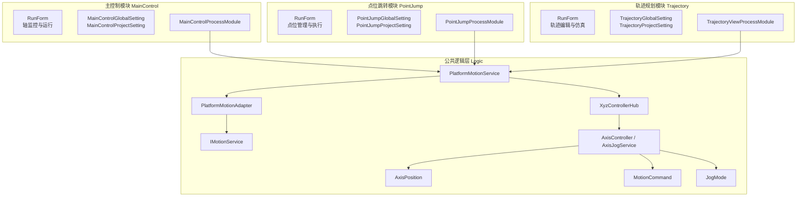
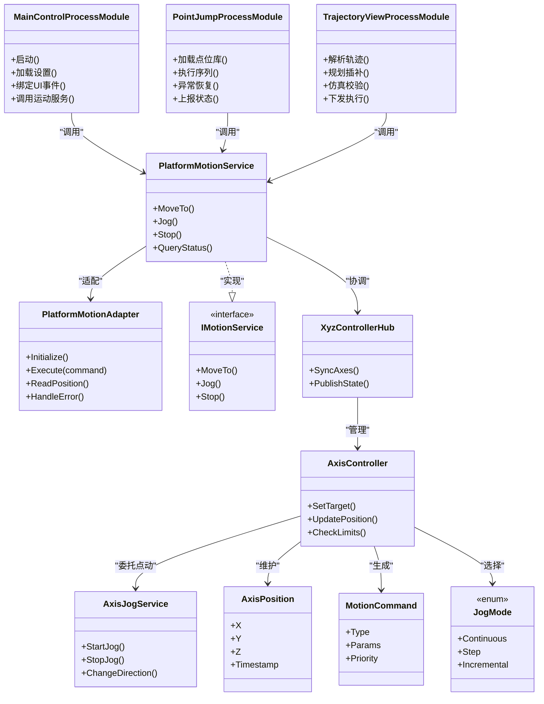
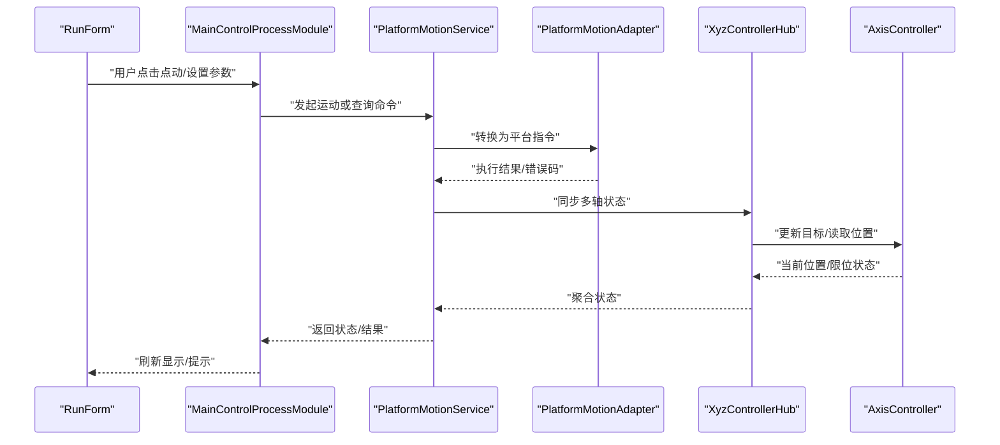
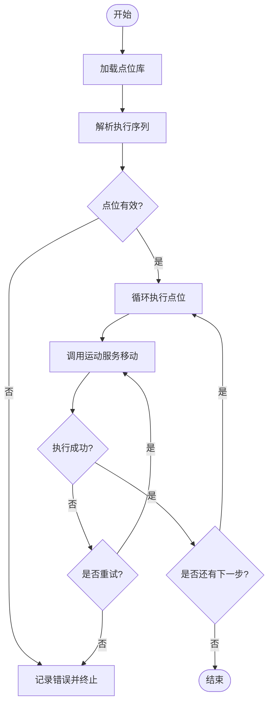
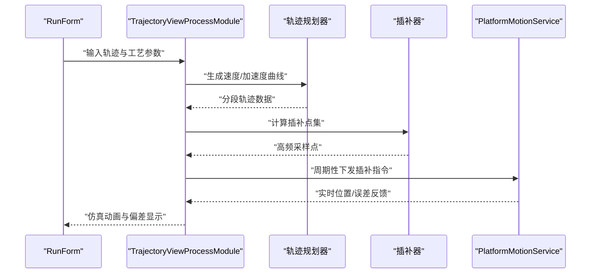
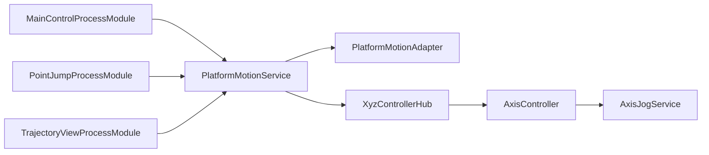

# 核心功能概览

<cite>
**本文档引用的文件**   
- [MainControlProcessModule.cs](file://MainControl/MainControlProcessModule.cs)
- [MainControlGlobalSetting.cs](file://MainControl/MainControlGlobalSetting.cs)
- [MainControlProjectSetting.cs](file://MainControl/MainControlProjectSetting.cs)
- [RunForm.cs](file://MainControl/RunForm.cs)
- [AxisLimitForm.cs](file://MainControl/AxisLimitForm.cs)
- [PointJumpProcessModule.cs](file://PointJump/PointJumpProcessModule.cs)
- [PointJumpGlobalSetting.cs](file://PointJump/PointJumpGlobalSetting.cs)
- [PointJumpProjectSetting.cs](file://PointJump/PointJumpProjectSetting.cs)
- [RunForm.cs](file://PointJump/RunForm.cs)
- [TrajectoryViewProcessModule.cs](file://Trajectory/TrajectoryViewProcessModule.cs)
- [TrajectoryGlobalSetting.cs](file://Trajectory/TrajectoryGlobalSetting.cs)
- [TrajectoryProjectSetting.cs](file://Trajectory/TrajectoryProjectSetting.cs)
- [RunForm.cs](file://Trajectory/RunForm.cs)
- [PresetPoint.cs](file://PresetPoint.cs)
- [PlatformMotionService.cs](file://Logic/PlatformMotionService.cs)
- [PlatformMotionAdapter.cs](file://Logic/PlatformMotionAdapter.cs)
- [IMotionService.cs](file://Logic/IMotionService.cs)
- [XyzControllerHub.cs](file://Logic/XyzControllerHub.cs)
- [AxisController.cs](file://Logic/AxisController.cs)
- [AxisJogService.cs](file://Logic/AxisJogService.cs)
- [AxisPosition.cs](file://Logic/AxisPosition.cs)
- [MotionCommand.cs](file://Logic/MotionCommand.cs)
- [JogMode.cs](file://Logic/JogMode.cs)
- [README.md](file://MainControl/README.md)
- [README.md](file://PointJump/README.md)
- [README.md](file://Trajectory/README.md)
</cite>

## 目录
1. [简介](#简介)
2. [项目结构](#项目结构)
3. [核心组件](#核心组件)
4. [架构总览](#架构总览)
5. [详细组件分析](#详细组件分析)
6. [依赖关系分析](#依赖关系分析)
7. [性能考量](#性能考量)
8. [故障排查指南](#故障排查指南)
9. [结论](#结论)
10. [附录](#附录)

## 简介
本概览聚焦 ProcessModules 项目的三大核心功能模块：主控制模块（MainControl）、点位跳转模块（PointJump）与轨迹规划模块（Trajectory）。它们分别面向轴参数配置与实时监控、预设点位管理与程序执行、复杂运动轨迹生成与仿真，覆盖从设备调试到自动化执行的完整链路。文档将说明各模块的功能特性、使用场景与核心价值，并阐述模块间的协作关系与数据流转，辅以对比表格、典型应用场景与最佳实践建议，帮助不同经验水平的开发者快速上手与高效选型。

## 项目结构
项目采用模块化组织方式，每个功能模块以独立工程形式存在，包含 UI（Controls/RunForm）、业务逻辑（Logic）、资源（Resources）与设置（GlobalSetting/ProjectSetting）等层次；底层运动控制能力由 Logic 层统一提供，并通过适配器模式对接具体硬件平台。

图表来源 
- [MainControlProcessModule.cs](file://MainControl/MainControlProcessModule.cs)
- [PointJumpProcessModule.cs](file://PointJump/PointJumpProcessModule.cs)
- [TrajectoryViewProcessModule.cs](file://Trajectory/TrajectoryViewProcessModule.cs)
- [PlatformMotionService.cs](file://Logic/PlatformMotionService.cs)
- [PlatformMotionAdapter.cs](file://Logic/PlatformMotionAdapter.cs)
- [IMotionService.cs](file://Logic/IMotionService.cs)
- [XyzControllerHub.cs](file://Logic/XyzControllerHub.cs)
- [AxisController.cs](file://Logic/AxisController.cs)
- [AxisJogService.cs](file://Logic/AxisJogService.cs)
- [AxisPosition.cs](file://Logic/AxisPosition.cs)
- [MotionCommand.cs](file://Logic/MotionCommand.cs)
- [JogMode.cs](file://Logic/JogMode.cs)

章节来源
- [MainControl/README.md](file://MainControl/README.md)
- [PointJump/README.md](file://PointJump/README.md)
- [Trajectory/README.md](file://Trajectory/README.md)

## 核心组件
- 主控制模块（MainControl）
  - 功能特性：轴参数配置、实时位置/状态监控、点动（Jog）控制、限位与安全保护、运行表单交互。
  - 使用场景：设备调试、单轴/多轴手动操作、参数标定与验证。
  - 核心价值：为上层应用提供稳定可靠的底层轴控制入口，确保人机交互安全与可观测性。

- 点位跳转模块（PointJump）
  - 功能特性：预设点位管理、批量执行、顺序/条件跳转、运行日志与结果反馈。
  - 使用场景：重复性定位任务、装配/检测流程中的定点动作序列。
  - 核心价值：将离散点位编排为可复用程序，提升产线节拍与一致性。

- 轨迹规划模块（Trajectory）
  - 功能特性：复杂轨迹定义（直线/圆弧/样条等）、插补与速度曲线规划、轨迹仿真与碰撞检查、离线编程与回放。
  - 使用场景：切割/焊接/涂胶等需要连续路径的工艺。
  - 核心价值：在保证精度与效率的前提下，降低工艺编程复杂度，提高柔性生产能力。

章节来源
- [MainControl/README.md](file://MainControl/README.md)
- [PointJump/README.md](file://PointJump/README.md)
- [Trajectory/README.md](file://Trajectory/README.md)

## 架构总览
整体架构遵循“UI 层—过程模块—服务层—适配器—控制器”的分层设计。三个过程模块通过统一的 PlatformMotionService 暴露运动能力，内部通过 XyzControllerHub 协调多轴，AxisController/AxisJogService 负责单轴行为，AxisPosition/MotionCommand/JogMode 描述状态与指令，PlatformMotionAdapter 屏蔽硬件差异。

图表来源 
- [MainControlProcessModule.cs](file://MainControl/MainControlProcessModule.cs)
- [PointJumpProcessModule.cs](file://PointJump/PointJumpProcessModule.cs)
- [TrajectoryViewProcessModule.cs](file://Trajectory/TrajectoryViewProcessModule.cs)
- [PlatformMotionService.cs](file://Logic/PlatformMotionService.cs)
- [PlatformMotionAdapter.cs](file://Logic/PlatformMotionAdapter.cs)
- [IMotionService.cs](file://Logic/IMotionService.cs)
- [XyzControllerHub.cs](file://Logic/XyzControllerHub.cs)
- [AxisController.cs](file://Logic/AxisController.cs)
- [AxisJogService.cs](file://Logic/AxisJogService.cs)
- [AxisPosition.cs](file://Logic/AxisPosition.cs)
- [MotionCommand.cs](file://Logic/MotionCommand.cs)
- [JogMode.cs](file://Logic/JogMode.cs)

## 详细组件分析

### 主控制模块（MainControl）
- 主要职责
  - 轴参数配置与持久化（全局/项目级设置）
  - 实时位置与状态采集、显示与报警
  - 点动控制与限位保护
  - 运行表单的事件驱动交互
- 关键类与文件
  - 过程模块：MainControlProcessModule
  - 设置：MainControlGlobalSetting、MainControlProjectSetting
  - UI：RunForm、AxisLimitForm
- 数据流
  - UI 事件 → 过程模块 → PlatformMotionService → 适配器/控制器 → 轴状态回传 → UI 刷新
- 典型用法
  - 打开 RunForm 进行轴点动与参数修改；在 AxisLimitForm 中设定软/硬限位阈值；保存项目设置后重启生效。

图表来源 
- [MainControlProcessModule.cs](file://MainControl/MainControlProcessModule.cs)
- [RunForm.cs](file://MainControl/RunForm.cs)
- [AxisLimitForm.cs](file://MainControl/AxisLimitForm.cs)
- [PlatformMotionService.cs](file://Logic/PlatformMotionService.cs)
- [PlatformMotionAdapter.cs](file://Logic/PlatformMotionAdapter.cs)
- [XyzControllerHub.cs](file://Logic/XyzControllerHub.cs)
- [AxisController.cs](file://Logic/AxisController.cs)

章节来源
- [MainControl/README.md](file://MainControl/README.md)
- [MainControlProcessModule.cs](file://MainControl/MainControlProcessModule.cs)
- [MainControlGlobalSetting.cs](file://MainControl/MainControlGlobalSetting.cs)
- [MainControlProjectSetting.cs](file://MainControl/MainControlProjectSetting.cs)
- [RunForm.cs](file://MainControl/RunForm.cs)
- [AxisLimitForm.cs](file://MainControl/AxisLimitForm.cs)

### 点位跳转模块（PointJump）
- 主要职责
  - 预设点位库的增删改查与版本化管理
  - 按序/条件执行点位序列，支持暂停/恢复/急停
  - 执行日志与结果统计，便于追溯与优化
- 关键类与文件
  - 过程模块：PointJumpProcessModule
  - 设置：PointJumpGlobalSetting、PointJumpProjectSetting
  - 数据结构：PresetPoint
  - UI：RunForm
- 数据流
  - 点位库 → 序列解析器 → 运动服务 → 执行引擎 → 状态上报与日志
- 典型用法
  - 在 RunForm 中导入/编辑点位表，创建作业脚本，一键执行并查看进度与结果。

图表来源 
- [PointJumpProcessModule.cs](file://PointJump/PointJumpProcessModule.cs)
- [PresetPoint.cs](file://PresetPoint.cs)
- [PlatformMotionService.cs](file://Logic/PlatformMotionService.cs)

章节来源
- [PointJump/README.md](file://PointJump/README.md)
- [PointJumpProcessModule.cs](file://PointJump/PointJumpProcessModule.cs)
- [PointJumpGlobalSetting.cs](file://PointJump/PointJumpGlobalSetting.cs)
- [PointJumpProjectSetting.cs](file://PointJump/PointJumpProjectSetting.cs)
- [RunForm.cs](file://PointJump/RunForm.cs)
- [PresetPoint.cs](file://PresetPoint.cs)

### 轨迹规划模块（Trajectory）
- 主要职责
  - 复杂轨迹建模（直线、圆弧、样条、混合段）
  - 速度/加速度曲线规划与插补计算
  - 轨迹仿真、干涉检查与可视化
  - 离线编程与在线回放
- 关键类与文件
  - 过程模块：TrajectoryViewProcessModule
  - 设置：TrajectoryGlobalSetting、TrajectoryProjectSetting
  - UI：RunForm
- 数据流
  - 轨迹定义 → 规划器 → 插补器 → 运动服务 → 实时跟踪与仿真渲染
- 典型用法
  - 在 RunForm 中绘制/编辑轨迹，设置工艺参数，进行仿真验证后下发执行。

图表来源 
- [TrajectoryViewProcessModule.cs](file://Trajectory/TrajectoryViewProcessModule.cs)
- [RunForm.cs](file://Trajectory/RunForm.cs)
- [PlatformMotionService.cs](file://Logic/PlatformMotionService.cs)

章节来源
- [Trajectory/README.md](file://Trajectory/README.md)
- [TrajectoryViewProcessModule.cs](file://Trajectory/TrajectoryViewProcessModule.cs)
- [TrajectoryGlobalSetting.cs](file://Trajectory/TrajectoryGlobalSetting.cs)
- [TrajectoryProjectSetting.cs](file://Trajectory/TrajectoryProjectSetting.cs)
- [RunForm.cs](file://Trajectory/RunForm.cs)

## 依赖关系分析
- 模块耦合
  - 三个过程模块均依赖 PlatformMotionService，解耦了 UI 与底层运动控制。
  - PlatformMotionService 通过 PlatformMotionAdapter 屏蔽硬件差异，便于扩展新平台。
  - XyzControllerHub 集中管理多轴协同，AxisController 封装单轴行为，AxisJogService 处理点动逻辑。
- 外部依赖
  - 硬件平台通过适配器接口接入，保证进程模块无需关心具体驱动细节。
- 潜在风险
  - 若适配器未正确实现错误处理，可能导致上层异常传播；需在 Adapter 层统一捕获与转换。

图表来源 
- [MainControlProcessModule.cs](file://MainControl/MainControlProcessModule.cs)
- [PointJumpProcessModule.cs](file://PointJump/PointJumpProcessModule.cs)
- [TrajectoryViewProcessModule.cs](file://Trajectory/TrajectoryViewProcessModule.cs)
- [PlatformMotionService.cs](file://Logic/PlatformMotionService.cs)
- [PlatformMotionAdapter.cs](file://Logic/PlatformMotionAdapter.cs)
- [XyzControllerHub.cs](file://Logic/XyzControllerHub.cs)
- [AxisController.cs](file://Logic/AxisController.cs)
- [AxisJogService.cs](file://Logic/AxisJogService.cs)

章节来源
- [PlatformMotionService.cs](file://Logic/PlatformMotionService.cs)
- [PlatformMotionAdapter.cs](file://Logic/PlatformMotionAdapter.cs)
- [XyzControllerHub.cs](file://Logic/XyzControllerHub.cs)
- [AxisController.cs](file://Logic/AxisController.cs)
- [AxisJogService.cs](file://Logic/AxisJogService.cs)

## 性能考量
- 插补频率与缓冲区
  - 轨迹模块需保证稳定的插补周期与足够大的输出缓冲，避免丢步与抖动。
- 多轴同步
  - 通过 XyzControllerHub 进行状态聚合与同步，减少跨线程竞争。
- I/O 与 UI 刷新
  - 将高频状态更新与 UI 刷新分离，采用队列或异步更新策略，避免界面卡顿。
- 参数调优
  - 合理设置加减速、最大速度与加速度，结合负载与机械特性，平衡效率与稳定性。

[本节为通用指导，不直接分析具体文件]

## 故障排查指南
- 常见问题定位
  - 无法连接硬件：检查 PlatformMotionAdapter 初始化与通信参数。
  - 点位执行失败：核对点位坐标与限位设置，确认运动服务返回值与错误码。
  - 轨迹抖动或超差：调整插补周期、平滑算法与速度曲线参数。
- 诊断步骤
  - 启用运行日志，观察命令下发与状态回传时序。
  - 在 AxisLimitForm 中检查限位阈值与报警状态。
  - 使用 RunForm 的点动模式逐步验证单轴响应。
- 恢复策略
  - 遇到异常时优先执行 Stop，再复位报警，最后重新校准零点。

章节来源
- [AxisLimitForm.cs](file://MainControl/AxisLimitForm.cs)
- [RunForm.cs](file://MainControl/RunForm.cs)
- [PlatformMotionAdapter.cs](file://Logic/PlatformMotionAdapter.cs)
- [PlatformMotionService.cs](file://Logic/PlatformMotionService.cs)

## 结论
MainControl、PointJump 与 Trajectory 三大模块分别承担基础控制、点位编排与轨迹规划的核心职责，通过统一的运动服务与适配器层形成松耦合架构。开发者可根据应用场景选择合适的模块或组合使用，借助良好的分层设计与清晰的职责边界，快速构建稳定高效的运动控制系统。

[本节为总结性内容，不直接分析具体文件]

## 附录

### 模块功能对比
- 维度说明
  - 适用场景：典型应用与工艺类型
  - 核心能力：关键功能点
  - 学习难度：入门到精通所需时间
  - 集成复杂度：与现有系统对接难度
  - 扩展性：新增平台/功能的难易度

| 模块 | 适用场景 | 核心能力 | 学习难度 | 集成复杂度 | 扩展性 |
|---|---|---|---|---|---|
| MainControl | 设备调试、手动点动、参数标定 | 轴参数配置、实时监控、点动控制、限位保护 | 低 | 低 | 中（新增轴/传感器） |
| PointJump | 重复定位、装配/检测流程 | 点位库管理、序列执行、日志与结果统计 | 中 | 中（与MES/数据库对接） | 高（脚本/条件分支） |
| Trajectory | 切割/焊接/涂胶等连续路径 | 轨迹建模、插补规划、仿真与校验 | 高 | 高（工艺参数与硬件匹配） | 高（新插补算法/路径类型） |

[本节为概念性对比，不直接分析具体文件]

### 典型应用场景与最佳实践
- 主控制模块
  - 场景：设备上线调试、日常点检与维护
  - 最佳实践：先设置限位与急停，再进行点动测试；参数变更需记录版本与责任人。
- 点位跳转模块
  - 场景：固定工序的重复执行、质量抽检流程
  - 最佳实践：点位命名规范、增加冗余校验与重试机制；关键步骤加入确认与互锁。
- 轨迹规划模块
  - 场景：复杂轮廓加工、连续涂覆
  - 最佳实践：离线仿真先行，逐步缩短步进验证；对关键工艺参数做敏感性分析。

[本节为概念性指导，不直接分析具体文件]

### 学习路径建议
- 初学者
  - 从 MainControl 入手，熟悉轴控制与点动操作，理解限位与安全机制。
- 进阶开发者
  - 学习 PointJump 的点位管理与序列执行，掌握异常处理与日志追踪。
- 高级开发者
  - 深入 Trajectory 的轨迹建模与插补算法，研究性能优化与扩展适配器。

[本节为概念性指导，不直接分析具体文件]