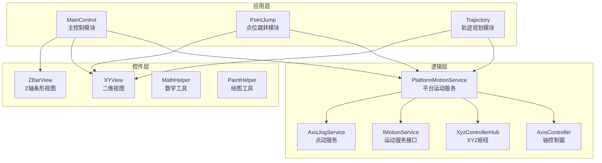
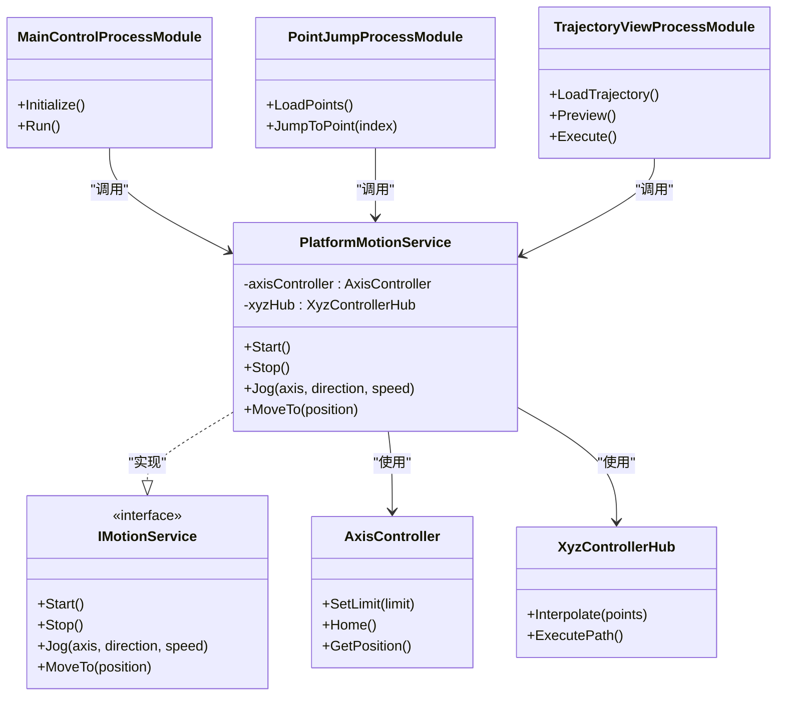
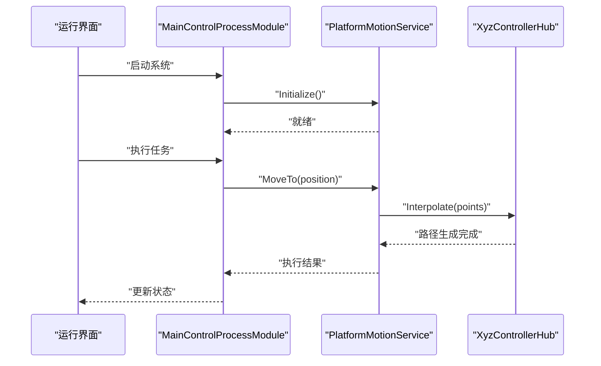
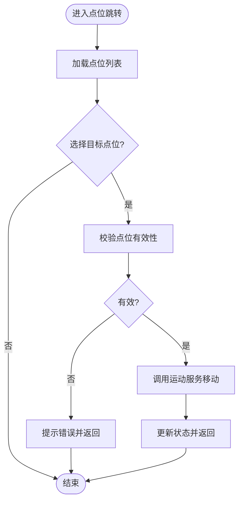
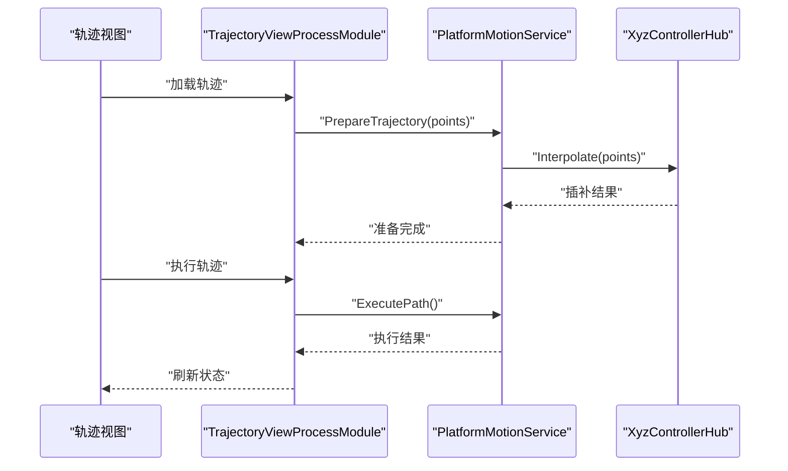
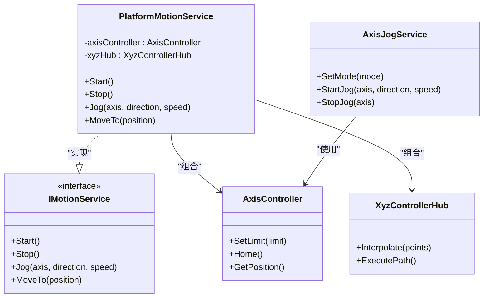
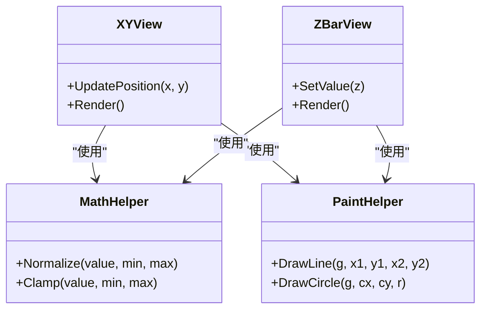
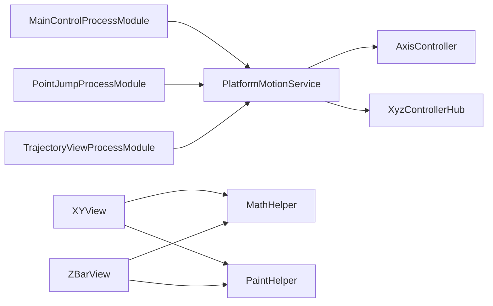

# 项目概述

<cite>
**本文引用的文件**   
- [README.md](file://README.md)
- [ProcessModules.sln](file://ProcessModules.sln)
- [AGENTS.md](file://AGENTS.md)
- [MainControl/MainControlProcessModule.cs](file://MainControl/MainControlProcessModule.cs)
- [PointJump/PointJumpProcessModule.cs](file://PointJump/PointJumpProcessModule.cs)
- [Trajectory/TrajectoryViewProcessModule.cs](file://Trajectory/TrajectoryViewProcessModule.cs)
- [Logic/PlatformMotionService.cs](file://Logic/PlatformMotionService.cs)
- [Logic/AxisController.cs](file://Logic/AxisController.cs)
- [Logic/XyzControllerHub.cs](file://Logic/XyzControllerHub.cs)
- [Logic/IMotionService.cs](file://Logic/IMotionService.cs)
- [Logic/AxisJogService.cs](file://Logic/AxisJogService.cs)
- [Controls/MathHelper.cs](file://Controls/MathHelper.cs)
- [Controls/PaintHelper.cs](file://Controls/PaintHelper.cs)
- [Controls/XYView.cs](file://Controls/XYView.cs)
- [Controls/ZBarView.cs](file://Controls/ZBarView.cs)
- [PresetPoint.cs](file://PresetPoint.cs)
</cite>

## 更新摘要
**所做更改**
- 移除了DOMO模块相关的所有内容，包括演示模块章节和相关引用
- 更新了项目结构描述，反映简化后的三个独立工艺模块架构
- 删除了所有DOMO相关的代码示例和架构图元素
- 调整了依赖关系分析以反映当前实际的项目结构

## 目录
1. [简介](#简介)
2. [项目结构](#项目结构)
3. [核心组件](#核心组件)
4. [架构总览](#架构总览)
5. [详细组件分析](#详细组件分析)
6. [依赖关系分析](#依赖关系分析)
7. [性能与可扩展性](#性能与可扩展性)
8. [快速开始指南](#快速开始指南)
9. [故障排查](#故障排查)
10. [结论](#结论)

## 简介
ProcessModules 是一个面向工业控制的模块化框架，基于 C# .NET Framework 构建，采用 Windows Forms/WPF 技术栈，提供插件化的进程模块组织方式。框架以"接口驱动 + 分层架构"为核心设计理念，将主控制、点位跳转、轨迹规划等能力解耦为独立模块，便于扩展与维护。其目标是在自动化产线、设备调试与可视化监控等场景中，提供稳定、可插拔、易扩展的控制平台。

核心价值
- 模块化与插件化：每个功能域（如主控制、点位跳转、轨迹）作为独立 ProcessModule，支持按需加载与组合。
- 分层架构：UI、业务逻辑、运动服务与硬件抽象清晰分离，降低耦合度。
- 接口驱动开发：通过 IMotionService 等接口屏蔽底层硬件差异，提升可移植性与可测试性。
- 可视化与交互：内置 XYView、ZBarView 等控件，便于实时监控轴位置与状态。
- 工程化与可维护性：统一的命名空间、类名规范与项目结构，配合文档与报告，提升团队协作效率。

适用场景
- 多轴设备的点动、回零、限位保护与运行监控
- 点位管理与快速跳转
- 轨迹规划与执行（直线、圆弧、样条等）
- 设备调试、工艺参数配置与数据记录

**章节来源**
- [README.md](file://README.md)
- [AGENTS.md](file://AGENTS.md)

## 项目结构
整体采用"按功能域划分模块 + 共享逻辑层 + 通用控件库"的组织方式：
- Controls：通用 UI 控件与绘图辅助（XYView、ZBarView、MathHelper、PaintHelper）
- Logic：运动控制核心逻辑与服务（AxisController、PlatformMotionService、XyzControllerHub、IMotionService、AxisJogService）
- MainControl：主控制模块（进程模块入口、运行界面、全局设置）
- PointJump：点位跳转模块（点位管理、跳转执行）
- Trajectory：轨迹规划模块（轨迹视图、运行界面）
- 根级解决方案文件与说明文档：ProcessModules.sln、README.md、AGENTS.md 等

**图表来源**
- [MainControl/MainControlProcessModule.cs](file://MainControl/MainControlProcessModule.cs)
- [PointJump/PointJumpProcessModule.cs](file://PointJump/PointJumpProcessModule.cs)
- [Trajectory/TrajectoryViewProcessModule.cs](file://Trajectory/TrajectoryViewProcessModule.cs)
- [Logic/PlatformMotionService.cs](file://Logic/PlatformMotionService.cs)
- [Logic/AxisController.cs](file://Logic/AxisController.cs)
- [Logic/XyzControllerHub.cs](file://Logic/XyzControllerHub.cs)
- [Logic/IMotionService.cs](file://Logic/IMotionService.cs)
- [Logic/AxisJogService.cs](file://Logic/AxisJogService.cs)
- [Controls/XYView.cs](file://Controls/XYView.cs)
- [Controls/ZBarView.cs](file://Controls/ZBarView.cs)
- [Controls/MathHelper.cs](file://Controls/MathHelper.cs)
- [Controls/PaintHelper.cs](file://Controls/PaintHelper.cs)

**章节来源**
- [ProcessModules.sln](file://ProcessModules.sln)
- [README.md](file://README.md)

## 核心组件
- 进程模块基类与实现
  - 各功能域均实现统一的 ProcessModule 接口，提供生命周期管理、配置加载、UI 呈现与命令处理。
  - 典型实现包括 MainControlProcessModule、PointJumpProcessModule、TrajectoryViewProcessModule。
- 运动服务与接口
  - IMotionService 定义运动控制契约（如启动、停止、点动、定位）。
  - PlatformMotionService 作为具体实现，协调 AxisController、XyzControllerHub 完成多轴协同。
  - AxisJogService 提供点动模式与速度/加速度参数管理。
- 轴控制与坐标枢纽
  - AxisController 封装单轴控制细节（限位、回零、位置读取）。
  - XyzControllerHub 负责 XYZ 三轴联动与插补计算。
- 可视化控件
  - XYView 用于二维平面显示与交互；ZBarView 用于 Z 轴高度指示。
  - MathHelper、PaintHelper 提供数值计算与绘图辅助。

**章节来源**
- [MainControl/MainControlProcessModule.cs](file://MainControl/MainControlProcessModule.cs)
- [PointJump/PointJumpProcessModule.cs](file://PointJump/PointJumpProcessModule.cs)
- [Trajectory/TrajectoryViewProcessModule.cs](file://Trajectory/TrajectoryViewProcessModule.cs)
- [Logic/IMotionService.cs](file://Logic/IMotionService.cs)
- [Logic/PlatformMotionService.cs](file://Logic/PlatformMotionService.cs)
- [Logic/AxisController.cs](file://Logic/AxisController.cs)
- [Logic/XyzControllerHub.cs](file://Logic/XyzControllerHub.cs)
- [Logic/AxisJogService.cs](file://Logic/AxisJogService.cs)
- [Controls/XYView.cs](file://Controls/XYView.cs)
- [Controls/ZBarView.cs](file://Controls/ZBarView.cs)
- [Controls/MathHelper.cs](file://Controls/MathHelper.cs)
- [Controls/PaintHelper.cs](file://Controls/PaintHelper.cs)

## 架构总览
框架采用"插件化进程模块 + 分层架构 + 接口驱动"的总体设计：
- 插件化：每个功能域作为独立进程模块，遵循统一接口，支持动态加载与组合。
- 分层：UI 层（Windows Forms/WPF）→ 业务逻辑层（ProcessModule）→ 运动服务层（IMotionService/PlatformMotionService）→ 硬件抽象层（AxisController/XyzControllerHub）。
- 接口驱动：通过 IMotionService 屏蔽底层差异，便于替换或模拟实现。

**图表来源**
- [Logic/IMotionService.cs](file://Logic/IMotionService.cs)
- [Logic/PlatformMotionService.cs](file://Logic/PlatformMotionService.cs)
- [Logic/AxisController.cs](file://Logic/AxisController.cs)
- [Logic/XyzControllerHub.cs](file://Logic/XyzControllerHub.cs)
- [MainControl/MainControlProcessModule.cs](file://MainControl/MainControlProcessModule.cs)
- [PointJump/PointJumpProcessModule.cs](file://PointJump/PointJumpProcessModule.cs)
- [Trajectory/TrajectoryViewProcessModule.cs](file://Trajectory/TrajectoryViewProcessModule.cs)

## 详细组件分析

### 主控制模块（MainControl）
职责
- 系统初始化、全局设置与运行流程编排
- 与运动服务对接，提供统一的运行入口
- 集成 UI 控件进行状态显示与操作

关键类
- MainControlProcessModule：进程模块入口，负责生命周期与命令分发
- RunForm / UnifiedRunForm：运行界面与统一运行表单

**图表来源**
- [MainControl/MainControlProcessModule.cs](file://MainControl/MainControlProcessModule.cs)
- [Logic/PlatformMotionService.cs](file://Logic/PlatformMotionService.cs)
- [Logic/XyzControllerHub.cs](file://Logic/XyzControllerHub.cs)

**章节来源**
- [MainControl/MainControlProcessModule.cs](file://MainControl/MainControlProcessModule.cs)
- [MainControl/RunForm.cs](file://MainControl/RunForm.cs)
- [MainControl/UnifiedRunForm.cs](file://MainControl/UnifiedRunForm.cs)

### 点位跳转模块（PointJump）
职责
- 点位数据的加载与管理
- 快速跳转到指定点位并执行动作
- 与运动服务协作完成定位

关键类
- PointJumpProcessModule：点位跳转的进程模块实现
- PresetPoint：预设点位数据结构

**图表来源**
- [PointJump/PointJumpProcessModule.cs](file://PointJump/PointJumpProcessModule.cs)
- [PresetPoint.cs](file://PresetPoint.cs)
- [Logic/PlatformMotionService.cs](file://Logic/PlatformMotionService.cs)

**章节来源**
- [PointJump/PointJumpProcessModule.cs](file://PointJump/PointJumpProcessModule.cs)
- [PresetPoint.cs](file://PresetPoint.cs)

### 轨迹规划模块（Trajectory）
职责
- 轨迹数据的加载与预览
- 路径插补与执行
- 与运动服务协作完成复杂轨迹

关键类
- TrajectoryViewProcessModule：轨迹视图与执行的进程模块实现

**图表来源**
- [Trajectory/TrajectoryViewProcessModule.cs](file://Trajectory/TrajectoryViewProcessModule.cs)
- [Logic/PlatformMotionService.cs](file://Logic/PlatformMotionService.cs)
- [Logic/XyzControllerHub.cs](file://Logic/XyzControllerHub.cs)

**章节来源**
- [Trajectory/TrajectoryViewProcessModule.cs](file://Trajectory/TrajectoryViewProcessModule.cs)

### 运动服务与轴控制（Logic）
职责
- 定义运动控制接口（IMotionService）
- 实现平台运动服务（PlatformMotionService）
- 封装轴控制（AxisController）与 XYZ 枢纽（XyzControllerHub）
- 提供点动服务（AxisJogService）

**图表来源**
- [Logic/IMotionService.cs](file://Logic/IMotionService.cs)
- [Logic/PlatformMotionService.cs](file://Logic/PlatformMotionService.cs)
- [Logic/AxisController.cs](file://Logic/AxisController.cs)
- [Logic/XyzControllerHub.cs](file://Logic/XyzControllerHub.cs)
- [Logic/AxisJogService.cs](file://Logic/AxisJogService.cs)

**章节来源**
- [Logic/IMotionService.cs](file://Logic/IMotionService.cs)
- [Logic/PlatformMotionService.cs](file://Logic/PlatformMotionService.cs)
- [Logic/AxisController.cs](file://Logic/AxisController.cs)
- [Logic/XyzControllerHub.cs](file://Logic/XyzControllerHub.cs)
- [Logic/AxisJogService.cs](file://Logic/AxisJogService.cs)

### 可视化控件（Controls）
职责
- 提供二维视图（XYView）与 Z 轴条形视图（ZBarView）
- 提供数学计算（MathHelper）与绘图辅助（PaintHelper）

**图表来源**
- [Controls/XYView.cs](file://Controls/XYView.cs)
- [Controls/ZBarView.cs](file://Controls/ZBarView.cs)
- [Controls/MathHelper.cs](file://Controls/MathHelper.cs)
- [Controls/PaintHelper.cs](file://Controls/PaintHelper.cs)

**章节来源**
- [Controls/XYView.cs](file://Controls/XYView.cs)
- [Controls/ZBarView.cs](file://Controls/ZBarView.cs)
- [Controls/MathHelper.cs](file://Controls/MathHelper.cs)
- [Controls/PaintHelper.cs](file://Controls/PaintHelper.cs)

## 依赖关系分析
- 模块间依赖
  - 各 ProcessModule（MainControl、PointJump、Trajectory）依赖 PlatformMotionService 提供的运动能力。
  - PlatformMotionService 依赖 AxisController 与 XyzControllerHub 完成具体控制。
- 控件依赖
  - XYView、ZBarView 依赖 MathHelper、PaintHelper 进行数值计算与绘制。
- 外部依赖
  - 基于 .NET Framework 与 Windows Forms/WPF 运行时环境。

**图表来源**
- [MainControl/MainControlProcessModule.cs](file://MainControl/MainControlProcessModule.cs)
- [PointJump/PointJumpProcessModule.cs](file://PointJump/PointJumpProcessModule.cs)
- [Trajectory/TrajectoryViewProcessModule.cs](file://Trajectory/TrajectoryViewProcessModule.cs)
- [Logic/PlatformMotionService.cs](file://Logic/PlatformMotionService.cs)
- [Logic/AxisController.cs](file://Logic/AxisController.cs)
- [Logic/XyzControllerHub.cs](file://Logic/XyzControllerHub.cs)
- [Controls/XYView.cs](file://Controls/XYView.cs)
- [Controls/ZBarView.cs](file://Controls/ZBarView.cs)
- [Controls/MathHelper.cs](file://Controls/MathHelper.cs)
- [Controls/PaintHelper.cs](file://Controls/PaintHelper.cs)

**章节来源**
- [ProcessModules.sln](file://ProcessModules.sln)

## 性能与可扩展性
- 性能考虑
  - 插补计算在 XyzControllerHub 中集中处理，避免 UI 线程阻塞。
  - 绘图更新采用增量渲染策略，减少重绘开销。
- 可扩展性
  - 新增功能域只需实现 ProcessModule 接口并注册到宿主。
  - 替换运动服务实现仅需实现 IMotionService 接口，无需修改上层模块。
- 可测试性
  - 通过 IMotionService 接口注入 Mock 实现，便于单元测试与集成测试。

## 快速开始指南
环境要求
- 操作系统：Windows 10/11
- 运行时：.NET Framework（根据项目目标框架版本）
- IDE：Visual Studio（支持 .NET Framework 项目）

安装步骤
- 克隆或下载仓库源码
- 使用 Visual Studio 打开解决方案文件（ProcessModules.sln）
- 还原 NuGet 包（如有）
- 编译并运行主控制模块（MainControl）

基本使用示例
- 启动主控制模块，查看运行界面
- 在点位跳转模块中加载预设点位并执行跳转
- 在轨迹规划模块中加载轨迹数据并预览执行

注意事项
- 确保硬件驱动与通信端口配置正确
- 首次运行前检查限位与回零设置
- 根据实际设备调整速度与加速度参数

**章节来源**
- [README.md](file://README.md)
- [ProcessModules.sln](file://ProcessModules.sln)

## 故障排查
常见问题
- 无法连接硬件
  - 检查通信端口与权限设置
  - 确认驱动已正确安装
- 点位跳转失败
  - 校验点位数据格式与范围
  - 检查限位与回零状态
- 轨迹执行异常
  - 验证插补参数与路径连续性
  - 检查运动服务日志

调试建议
- 启用详细日志输出
- 使用 XYView 与 ZBarView 实时观察轴状态
- 逐步隔离问题模块（UI、逻辑、服务、硬件）

**章节来源**
- [Logic/PlatformMotionService.cs](file://Logic/PlatformMotionService.cs)
- [Controls/XYView.cs](file://Controls/XYView.cs)
- [Controls/ZBarView.cs](file://Controls/ZBarView.cs)

## 结论
ProcessModules 通过插件化进程模块、分层架构与接口驱动设计，为工业自动化控制提供了灵活、可扩展且易于维护的平台。其清晰的模块边界与标准化的接口定义，使得在不同设备与场景下快速适配成为可能。结合可视化控件与完善的工程化实践，开发者能够高效地构建与迭代工业控制应用。

经过简化后的项目结构更加专注于核心的三个工艺模块（主控制、点位跳转、轨迹规划），去除了演示模块后，整体架构更加简洁明了，便于开发者快速理解和使用。