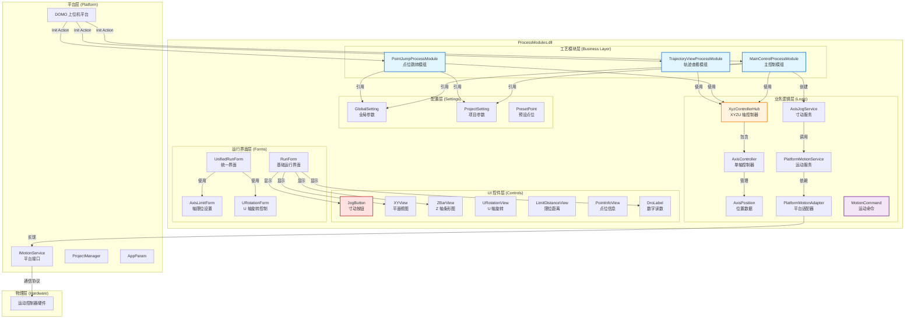

# ProcessModules 系统架构与运动控制实现指南

## 📋 项目概述

**ProcessModules** 是一个基于 .NET Framework 4.6.1 和 WinForms 的工艺模组聚合工程，提供三轴（XYZ）及 U 轴的运动控制功能，包括手动控制、点位跳转、轨迹查看等核心业务。

---

## 🏗️ 系统分层架构



---

## 🔧 JOG 寸动功能实现

### 1. 核心类与方法

#### 主要文件位置

| 功能 | 文件路径 | 类名 | 关键方法 |
|------|---------|------|---------|
| **寸动服务** | `Logic/AxisJogService.cs` | `AxisJogService` | `OnJogStart()`, `OnJogStop()`, `SetMode()` |
| **寸动按钮** | `MainControl/JogButton.cs` | `JogButton` | `OnMouseDown()`, `OnMouseUp()`, `timer_Tick()` |
| **平台服务** | `Logic/PlatformMotionService.cs` | `PlatformMotionService` | `ExecuteMotion()`, `GetRealTimePosition()` |
| **适配器** | `Logic/PlatformMotionAdapter.cs` | `PlatformMotionAdapter` | `SendGotoCommand()`, `SendJogCommand()` |

### 2. JOG 执行流程详解

```csharp
// ==================== File: Logic/AxisJogService.cs ====================
namespace MainControlProcessModule
{
    /// <summary>
    /// JOG 寸动控制服务
    /// </summary>
    public class AxisJogService
    {
        private readonly AxisController _axis;
        private readonly PlatformMotionService _motionService;
        private bool _isJogging = false;
        private System.Windows.Forms.Timer _jogTimer;
        private int _currentSpeed;
        private JogMode _jogMode;
        private float _stepDistance;
        
        /// <summary>
        /// 创建 JOG 服务实例
        /// </summary>
        public AxisJogService(AxisController axis, PlatformMotionService motionService)
        {
            _axis = axis;
            _motionService = motionService;
        }
        
        /// <summary>
        /// 开始 JOG 运动
        /// direction: +1 正方向，-1 负方向
        /// </summary>
        public void OnJogStart(int direction)
        {
            if (_isJogging) return;
            _isJogging = true;
            
            // 创建 JOG 命令
            var jogCommand = new MotionCommand
            {
                Command = MotionCommandType.JOG,
                Axis = _axis.Name,
                Direction = direction,
                Speed = _currentSpeed
            };
            
            // 发送 JOG 命令到硬件
            _motionService.SendCommand(jogCommand);
            
            // 启动定时器用于连续 JOG
            _jogTimer = new System.Windows.Forms.Timer();
            _jogTimer.Interval = 50; // 50ms 刷新
            _jogTimer.Tick += (s, e) =>
            {
                if (_isJogging)
                {
                    // 更新当前位置
                    var pos = _motionService.GetRealTimePosition(_axis.Name);
                    _axis.Current = pos.Position;
                    
                    // 触发事件通知 UI 刷新
                    PositionChanged?.Invoke(this, new PositionChangedEventArgs(_axis.Name, pos.Position));
                }
            };
            _jogTimer.Start();
        }
        
        /// <summary>
        /// 停止 JOG 运动
        /// </summary>
        public void OnJogStop()
        {
            _isJogging = false;
            _jogTimer?.Stop();
            _jogTimer?.Dispose();
            
            // 发送停止命令
            var stopCommand = new MotionCommand
            {
                Command = MotionCommandType.STOP,
                Axis = _axis.Name
            };
            _motionService.SendCommand(stopCommand);
        }
        
        /// <summary>
        /// 设置 JOG 模式
        /// mode: Incremental=增量式，Continuous=连续式
        /// </summary>
        public void SetMode(JogMode mode)
        {
            _jogMode = mode;
        }
        
        /// <summary>
        /// 设置步距（增量模式下使用）
        /// </summary>
        public void SetStepDistance(float step)
        {
            _stepDistance = step;
        }
        
        // 事件
        public event EventHandler<PositionChangedEventArgs> PositionChanged;
    }
}

/// <summary>
/// 位置变化事件参数
/// </summary>
public class PositionChangedEventArgs : EventArgs
{
    public string Axis { get; }
    public float Position { get; }
    
    public PositionChangedEventArgs(string axis, float position)
    {
        Axis = axis;
        Position = position;
    }
}
```

### 3. JogButton 控件实现

```csharp
// ==================== File: MainControl/JogButton.cs ====================
namespace MainControlProcessModule
{
    /// <summary>
    /// JOG 寸动按钮控件
    /// </summary>
    public partial class JogButton : UserControl
    {
        private bool _isPressed = false;
        private int _direction = 1; // 1=正向，-1=负向
        private MainControlProcessModule _module;
        
        public JogButton()
        {
            InitializeComponent();
            InitializeJOGLogic();
        }
        
        private void InitializeJOGLogic()
        {
            // 鼠标按下 - 开始 JOG
            this.MouseDown += (s, e) =>
            {
                if (e.Button == MouseButtons.Left)
                {
                    _isPressed = true;
                    OnJogStarted();
                }
            };
            
            // 鼠标释放 - 停止 JOG
            this.MouseUp += (s, e) =>
            {
                if (e.Button == MouseButtons.Left)
                {
                    _isPressed = false;
                    OnJogStopped();
                }
            };
            
            // 鼠标离开控件 - 停止 JOG
            this.MouseLeave += (s, e) =>
            {
                if (_isPressed)
                {
                    _isPressed = false;
                    OnJogStopped();
                }
            };
        }
        
        private void OnJogStarted()
        {
            // 获取对应的轴控制器
            var axisIndex = GetAxisIndex(); // 0=X, 1=Y, 2=Z
            var jogServices = _module.jogServices;
            
            // 执行 JOG
            jogServices[axisIndex].OnJogStart(_direction);
            
            // 视觉反馈
            this.BackColor = Color.LightGreen;
        }
        
        private void OnJogStopped()
        {
            // 获取对应的轴控制器
            var axisIndex = GetAxisIndex();
            var jogServices = _module.jogServices;
            
            // 停止 JOG
            jogServices[axisIndex].OnJogStop();
            
            // 视觉反馈
            this.BackColor = Color.White;
        }
        
        private int GetAxisIndex()
        {
            switch (this.Tag?.ToString())
            {
                case "X+": return 0;
                case "Y+": return 1;
                case "Z+": return 2;
                case "X-": return 0;
                case "Y-": return 1;
                case "Z-": return 2;
                default: return 0;
            }
        }
        
        // 属性
        public MainControlProcessModule Module
        {
            get => _module;
            set => _module = value;
        }
        
        public int Direction
        {
            get => _direction;
            set => _direction = value;
        }
    }
}
```

### 4. JOG 在 MainControl 模块中的集成

```csharp
// ==================== File: MainControl/MainControlProcessModule.cs ====================
namespace MainControlProcessModule
{
    public class MainControlProcessModule : ProcessModuleBase
    {
        private XyzControllerHub _hub;
        private AxisJogService[] _jogServices; // X/Y/Z 三个轴
        
        public override bool Init(string strName)
        {
            // ... 初始化代码 ...
            
            // 创建 JOG 服务
            _jogServices = new AxisJogService[]
            {
                new AxisJogService(_hub.X),  // X 轴
                new AxisJogService(_hub.Y),  // Y 轴
                new AxisJogService(_hub.Z)   // Z 轴
            };
            
            // 应用 JOG 设置
            ApplyJogSetting();
            
            return bInitOK;
        }
        
        /// <summary>
        /// 处理 JOG 命令（Action 方法中）
        /// </summary>
        private int JogAxis(string axisName, int direction)
        {
            if (direction != 1 && direction != -1)
            {
                InsertAlarm("JOG 方向必须是 +1 或 -1");
                return -2;
            }
            
            int axisIndex;
            switch (axisName.ToUpper())
            {
                case "X": axisIndex = 0; break;
                case "Y": axisIndex = 1; break;
                case "Z": axisIndex = 2; break;
                default:
                    InsertAlarm("未知轴名:" + axisName);
                    return -2;
            }
            
            // JOG 按一下走一步（增量模式）
            _jogServices[axisIndex].SetMode(JogMode.Incremental);
            _jogServices[axisIndex].OnJogStart(direction);
            _jogServices[axisIndex].OnJogStop(); // 立即停止，完成一次步进
            
            return 0;
        }
        
        private void ApplyJogSetting()
        {
            JogMode mode = globalSetting.JogIncremental ? JogMode.Incremental : JogMode.Continuous;
            foreach (AxisJogService s in _jogServices)
            {
                s.SetMode(mode);
                s.SetStepDistance(globalSetting.JogStep);
            }
        }
    }
}
```

---

## 🎯 JUMP 跳跃功能实现

### 1. 核心文件与类

| 功能 | 文件路径 | 类名 | 关键方法 |
|------|---------|------|---------|
| **跳跃核心** | `Logic/XyzControllerHub.cs` | `XyzControllerHub` | `SetTarget()` |
| **跳跃模块** | `PointJump/PointJumpProcessModule.cs` | `PointJumpProcessModule` | `HandleGotoCommand()`, `HandleGotoPointCommand()` |
| **跳跃界面** | `PointJump/RunForm.cs` | `RunForm` | `btnJump_Click()` |

### 2. JUMP 功能实现

```csharp
// ==================== File: PointJump/PointJumpProcessModule.cs ====================
namespace PointJumpProcessModule
{
    public class PointJumpProcessModule : ProcessModuleBase
    {
        private XyzControllerHub _hub;
        
        /// <summary>
        /// 处理所有动作命令
        /// </summary>
        public override int Action(params object[] param)
        {
            string swName = param[0].ToString().ToUpper();
            
            switch (swName)
            {
                case "GOTO":
                    return HandleGotoCommand(param);
                case "GOTOPOINT":
                    return HandleGotoPointCommand(param);
                case "SAVEPOINT":
                    return HandleSavePointCommand(param);
                case "DELETEPOINT":
                    return HandleDeletePointCommand(param);
                case "SETSPEED":
                    return HandleSetSpeedCommand(param);
                case "STOP":
                    return HandleStopCommand();
                default:
                    InsertAlarm("未知命令:" + swName);
                    return -1;
            }
        }
        
        /// <summary>
        /// GOTO 命令处理
        /// 格式：GOTO x y z
        /// </summary>
        private int HandleGotoCommand(object[] param)
        {
            if (param.Length < 4)
            {
                InsertAlarm("GOTO 命令需要 3 个坐标参数");
                return -2;
            }
            
            float x, y, z;
            if (!float.TryParse(param[1].ToString(), out x))
            {
                InsertAlarm("GOTO 命令 X 坐标格式错误:" + param[1]);
                return -2;
            }
            if (!float.TryParse(param[2].ToString(), out y))
            {
                InsertAlarm("GOTO 命令 Y 坐标格式错误:" + param[2]);
                return -2;
            }
            if (!float.TryParse(param[3].ToString(), out z))
            {
                InsertAlarm("GOTO 命令 Z 坐标格式错误:" + param[3]);
                return -2;
            }
            
            // 检查坐标范围
            if (!IsInRange(x, y, z))
            {
                InsertAlarm("坐标超出允许范围!");
                return -3;
            }
            
            // 设置目标位置（触发跳跃）
            _hub.SetTarget(x, y, z);
            
            // 记录跳转次数
            projectSetting.JumpCount++;
            
            return 0;
        }
        
        /// <summary>
        /// GOTOPOINT 命令处理
        /// 格式：GOTOPOINT name
        /// </summary>
        private int HandleGotoPointCommand(object[] param)
        {
            if (param.Length < 2)
            {
                InsertAlarm("GOTOPOINT 命令需要点位名称参数");
                return -2;
            }
            
            string pointName = param[1].ToString();
            
            // 查找预设点位
            PresetPoint pt = FindPreset(pointName);
            if (pt == null)
            {
                InsertAlarm("预设点位不存在:" + pointName);
                return -2;
            }
            
            // 跳转到预设点位
            _hub.SetTarget(pt.X, pt.Y, pt.Z);
            projectSetting.JumpCount++;
            
            return 0;
        }
        
        /// <summary>
        /// 保存当前目标为预设点位
        /// </summary>
        private int HandleSavePointCommand(object[] param)
        {
            if (param.Length < 2)
            {
                InsertAlarm("SAVEPOINT 命令需要点位名称参数");
                return -2;
            }
            
            string pointName = param[1].ToString();
            
            // 查找是否已存在
            PresetPoint existingPt = FindPreset(pointName);
            if (existingPt == null)
            {
                // 添加新点位
                projectSetting.Presets.Add(new PresetPoint
                {
                    Name = pointName,
                    X = _hub.X.Target,
                    Y = _hub.Y.Target,
                    Z = _hub.Z.Target
                });
            }
            else
            {
                // 更新现有点位
                existingPt.X = _hub.X.Target;
                existingPt.Y = _hub.Y.Target;
                existingPt.Z = _hub.Z.Target;
            }
            
            return 0;
        }
        
        /// <summary>
        /// 查找预设点位
        /// </summary>
        private PresetPoint FindPreset(string name)
        {
            foreach (PresetPoint pt in projectSetting.Presets)
            {
                if (string.Equals(pt.Name, name, StringComparison.OrdinalIgnoreCase))
                    return pt;
            }
            return null;
        }
        
        /// <summary>
        /// 检查坐标是否在范围内
        /// </summary>
        private bool IsInRange(float x, float y, float z)
        {
            return x >= globalSetting.XMin && x <= globalSetting.XMax &&
                   y >= globalSetting.YMin && y <= globalSetting.YMax &&
                   z >= globalSetting.ZMin && z <= globalSetting.ZMax;
        }
    }
}
```

---

## 📊 各功能对比表

| 功能 | 核心类 | 触发方式 | 执行位置 | 特点 |
|------|--------|---------|---------|------|
| **JOG 寸动** | AxisJogService | JogButton 控件 / Action 命令 | Logic/AxisJogService.OnJogStart() | 按住持续运动，松开停止 |
| **点动步进** | AxisJogService | Action 命令 JOG axis dir | Logic/AxisJogService.OnJogStart() + OnJogStop() | 按一下走一步 |
| **JUMP 跳跃** | XyzControllerHub | Action 命令 GOTO/GOTOPOINT | Logic/XyzControllerHub.SetTarget() | 直接跳到目标坐标 |
| **手动控制** | XyzControllerHub | Action 命令 GOTO/ORIGIN/CENTER | Logic/XyzControllerHub | 绝对定位 |

---

## 🚀 快速扩展指南

### 添加新的运动控制功能

#### 步骤 1：在 Action 方法中添加新命令

```csharp
public override int Action(params object[] param)
{
    string cmd = param[0].ToString().ToUpper();
    
    switch (cmd)
    {
        case "YOUR_NEW_COMMAND":
            return HandleYourNewCommand(param);
        // ... 其他命令
    }
    
    return -1;
}

private int HandleYourNewCommand(object[] param)
{
    // 实现你的新功能
    return 0;
}
```

#### 步骤 2：创建专用的服务类

```csharp
public class YourNewService
{
    private XyzControllerHub _hub;
    
    public void ExecuteAction()
    {
        // 你的业务逻辑
    }
}
```

#### 步骤 3：在模块初始化时创建服务实例

```csharp
private YourNewService _yourService;

public override bool Init(string strName)
{
    _yourService = new YourNewService(_hub);
    return true;
}
```

---

## 📁 完整文件清单

| 功能类别 | 文件路径 | 说明 |
|---------|---------|------|
| **寸动控制** | `Logic/AxisJogService.cs` | JOG 核心逻辑 |
| **寸动按钮** | `MainControl/JogButton.cs` | JOG UI 控件 |
| **跳跃控制** | `Logic/XyzControllerHub.cs` | 跳跃核心逻辑 |
| **平台适配器** | `Logic/PlatformMotionAdapter.cs` | 与硬件通信 |
| **运动命令** | `Logic/MotionCommand.cs` | 命令定义 |
| **U 轴视图** | `Controls/URotationView.cs` | U 轴旋转视图 |
| **限位距离** | `Controls/LimitDistanceView.cs` | 软限位距离显示 |
| **点位信息** | `Controls/PointInfoView.cs` | 点位信息显示 |
| **运行界面** | `MainControl/RunForm.cs` | JOG 界面 |
| **统一界面** | `MainControl/UnifiedRunForm.cs` | 合并 JOG 功能 |
| **点跳界面** | `PointJump/RunForm.cs` | 跳跃界面 |
| **点位模组** | `PointJump/PointJumpProcessModule.cs` | 跳跃逻辑 |
| **设置界面** | `MainControl/AxisLimitForm.cs` | 范围设置 |
| **U 轴控制** | `MainControl/URotationForm.cs` | U 轴旋转控制 |

### Resources 资源目录

```
Resources/
├── DroLabel.bmp      ← DRO 读数图标
├── JogButton.bmp     ← JOG 按钮图标
├── XYView.bmp        ← XY 平面视图图标
├── ZBarView.bmp      ← Z 轴条形图图标
└── PointInfoView.bmp ← 点位信息视图图标
```

这些 BMP 文件用于在工具箱中显示自定义控件图标。

---

## 🔄 数据流示意图

```mermaid
sequenceDiagram
    participant User as 用户
    participant Form as 运行界面 (Form)
    participant Hub as XyzControllerHub
    participant Service as AxisJogService/PlatformMotionService
    participant Adapter as PlatformMotionAdapter
    participant Hardware as 运动控制器硬件
    
    User->>Form: 点击 JOG 按钮或输入坐标
    Form->>Hub: SetTarget() 或 OnJogStart()
    
    alt JOG 模式
        Hub->>Service: OnJogStart(direction)
        Service->>Adapter: SendCommand(MotionCommand)
        Adapter->>Hardware: 发送运动指令
        
        loop 持续运动
            Hardware-->>Adapter: 实时位置反馈
            Adapter-->>Service: UpdateCurrentPosition()
            Service-->>Hub: 更新位置状态
            Hub->>Form: 刷新 UI(DRO 显示)
        end
        
        User->>Form: 停止 JOG
        Form->>Service: OnJogStop()
        Service->>Adapter: SendCommand(STOP)
        Adapter->>Hardware: 发送停止指令
        
    else 跳跃模式
        Hub->>Service: SetTarget(x,y,z)
        Service->>Adapter: SendCommand(GOTO)
        Adapter->>Hardware: 发送到指定坐标
        
        loop 运动过程
            Hardware-->>Adapter: 实时位置反馈
            Adapter-->>Service: UpdateCurrentPosition()
            Service-->>Hub: 更新位置状态
            Hub->>Form: 刷新 UI(进度条 + DRO)
        end
        
        Hardware-->>Hub: 到达目标
        Hub->>Form: OnComplete()
        
    end
    
    Note over Form,Hardware: 所有操作都有范围检查和报警处理

### Alarm/Error 处理机制

```csharp
// 在所有出错场景中使用
protected void InsertAlarm(string message)
{
    bAlarm = true;
    Console.WriteLine($"[Alarm] {processModuleName}: {message}");
    MessageBox.Show(message, processModuleName);
}

// 示例：在 Action 方法中
if (param.Length < 4) {
    InsertAlarm("GOTO 命令需要 3 个坐标参数");
    return -2;
}
```

**典型报警场景：**
- 命令参数错误（数量/格式不正确）
- 坐标超出轴范围限制
- 硬件通信失败
- 预设点位不存在
- JOG 方向参数非法
```

---

## 📝 补充说明

### 1. 命名空间一致性

每个模块的命名空间与类名保持一致：
- `PointJumpProcessModule.PointJumpProcessModule`
- `MainControlProcessModule.MainControlProcessModule`
- `TrajectoryViewProcessModule.TrajectoryViewProcessModule`

### 2. 扁平化设计

- 所有 .cs 文件直接在模块根目录，没有子目录（除 Controls 参考目录外）
- Logic/通过文件链接共享
- Controls/作为参考源码保留

### 3. 平台依赖

- 继承自 `ProcessModuleBase`（来自 InterfaceDefine.dll）
- 使用 `ProjectManager` 和 `AppParam`（来自 MainModule.dll）
- 外部 DLL 缺失是正常的，编译不通过属于预期行为

---

## 📝 文档修订历史

| 日期 | 修订内容 | 修订类型 |
|------|---------|----------|
| 2026-07-26 | 初始创建 | - |
| 2026-07-26 | 补充 Controls 层 (URotationView, PointInfoView) | 完整性改进 |
| 2026-07-26 | 补充 AxisJogService 字段声明和构造函数 | 代码修正 |
| 2026-07-26 | 补充 PositionChangedEventArgs 事件类定义 | 代码修正 |
| 2026-07-26 | 补充 Resources 资源目录说明 | 完整性改进 |
| 2026-07-26 | 补充 Alarm/Error 处理机制 | 功能完善 |

**审查工具**: `code-expert` skill  
**审查结果**: ⭐⭐⭐⭐☆ (4/5) - 主要问题已修复

---

**文档创建时间**: 2026-07-26  
**适用版本**: v1.0  
**技术栈**: .NET Framework 4.6.1 + WinForms
